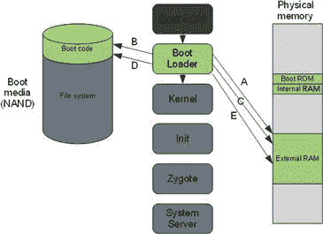
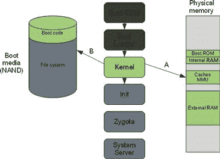
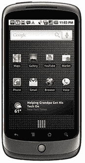

# 第二章

# 安卓硬件平台

### 本章信息

• 核心组件概述

• 不同设备类型概述

• 只读存储器和引导加载器

• 制造商

• 特定设备

## 引言

安卓被设计为与广泛的硬件兼容。这在很大程度上是通过 Linux 内核实现的，多年来它已经演变为支持各种硬件。这是平台的一个重要特点，因为它允许制造商在设计、采购或以其他方式整合理想的安卓设备组件时拥有自由。这一策略导致了强大的双核安卓设备的开发，这些设备具有显著的处理器性能，以及针对入门级无线计划的入门级设备。尽管硬件兼容性对制造商、无线运营商和最终消费者都有利，但多样性给法医分析师和安全工程师带来了挑战。了解安卓的硬件组件、设备类型和启动过程将有助于您全面了解安卓。

## 核心组件概述

安卓被开发出来以支持广泛的设备和制造商。因此，任何主要组件的列表可能一列出就过时了。然而，有一些在安卓设备中始终如一的组件是值得讨论的。以下组件构成了安卓设备的核心。

### 中央处理单元

中央处理单元（CPU）是大多数法医分析师相当熟悉的术语，在安卓设备上的作用也没有什么意外。CPU 负责执行操作系统（OS）和应用程序代码，并协调或控制其他核心组件，包括网络、存储、显示和输入设备。

从一开始，大多数（如果不是全部）的安卓设备都使用 ARM 处理器作为其 CPU，这些处理器对于移动平台来说足够强大，但设计上注重低功耗——这是最大化电池寿命的关键因素。

然而，企业和爱好者已经将安卓移植到其他平台上。在企业方面，英特尔已经将安卓移植到他们的 Atom 处理器上。同样，谷歌也在他们的 Google TV 产品中使用了安卓，该产品是基于安卓构建的。还有一些项目，如 Android-x86（Android-x86, n.d.），已经发布了运行在英特尔 x86 架构上的安卓移植版本。一些受支持的平台包括许多 Eee PC 型号和联想 ThinkPad x61 平板电脑。

### 基带调制解调器/无线电

基带调制解调器和无线电是提供安卓设备连接到蜂窝网络的硬件和软件系统。这使得设备可以进行语音和数据通信。

为了不让主 CPU 处理这些活动，设备设计师通常会利用一个专用的组件来管理蜂窝通信的复杂性。因此，尽管 CPU 可能指导设备的主要活动，但基带调制解调器负责管理蜂窝通信。

在整本书中，我们将交替使用*基带*、*基带调制解调器*和*无线电*这些术语。尽管这些系统很复杂，这个定义可能忽略了一些细微差别，但对于法医分析师来说，这些区别并不重要。

### 内存（随机存取存储器和 NAND 闪存）

由于 Android 设备在某种程度上只是计算机，因此需要各种类型的内存来运行。所需的两主要类型的内存是易失性（随机存取存储器[RAM]）和非易失性（NAND 闪存）内存。

系统使用 RAM 来加载、执行和操作操作系统、应用程序或数据的关键部分。RAM 是易失性的，这意味着在没有电源的情况下它不会保持状态。

然而，NAND 闪存（我们简称这种内存为 NAND 闪存）是非易失性的，因此，在设备断电后数据仍然得以保存。NAND 闪存用于存储引导加载器、操作系统和用户数据。因此，它是任何法医调查的关键组成部分，类似于在笔记本电脑、台式机或服务器的法医调查中的硬盘。NAND 闪存还具有使其成为移动设备理想的独特属性，同时为程序员带来了一系列挑战（这通常为法医分析师提供了独特的机会）。这些特性将在第四章中详细探讨。

从硬件角度来看，移动设备显然在空间上有很大的限制。通常，RAM 和 NAND 闪存被制造成一个被称为多芯片组件（MCP）的简单部件。在检查 Android 设备组件时，通常 NAND 闪存和 RAM 会被封装成一个 MCP。

尽管图 2.1 是特定于内存制造商 Hynix（用于 Dell Streak 和其他 Android 设备），但这种整体架构是包括 NAND 闪存和 RAM 在内的 MCP 组件的一个很好的描述，还包括适合各种设备的封装选项。

图 2.1 MCP 架构（Mobile Memory, n.d.）。

### 全球定位系统

毫无疑问，自包含蜂窝通信以来，移动设备最重要的创新之一是将全球定位系统（GPS）集成到核心产品中。这个功能不仅使用 GPS 卫星网络确定设备的位置，还允许诸如点对点导航、位置感知应用程序等应用，毫无疑问，将来还会有更多有趣的使用方式。

### 无线（[Wi-Fi.com](http://Wi-Fi.com)和蓝牙）

除了蜂窝网络，大多数设备还支持额外的无线技术，如[Wi-Fi.com](http://Wi-Fi.com)提供的高速数据连接和用于连接外部设备（如耳机、键盘、打印机等）的蓝牙。实际上，一些设备可能会省略蜂窝网络连接，这不仅降低了设备的成本和复杂性，也消除了消费者每月的重复收费。这些设备可能仅设计用于家庭使用（例如，家用电话或多媒体设备），或在没有[Wi-Fi.com](http://Wi-Fi.com)连接时用于离线模式（即平板电脑或电子阅读器）。

### 安全数字卡

大多数 Android 设备都配备了可拆卸的存储卡，称为安全数字（SD）卡。与设备上的 NAND 闪存一样，SD 卡也是非易失性的，并使用 NAND 闪存技术。然而，由于 SD 卡被设计为便携，它们必须遵守各种物理和通信规范，以便与大多数设备互操作。

SD 卡是大多数 Android 设备与流行的苹果 iPhone 之间的一个明显设计差异。iPhone 设计有 4GB 至 32GB 的板载 NAND 闪存，并不支持 SD 卡。尽管成本更高，但这让设备制造商（在这个情况下是苹果）对设备拥有更多的控制权。在 Android 的情况下，较大的用户文件预期会存储在 SD 卡上。这不仅为消费者提供了一个成本更低且易于升级的存储选项，而且还可以便携，这样如果消费者购买了新手机，他们可以轻松使用现有的 SD 卡转移数据。

近期 HTC 手机（尤其是 HTC Incredible）提供了标准的 SD 卡接口，但并未随机附赠 SD 卡。相反，它们通过切割一部分板载 NAND 内存并模拟成 SD 卡来创建一个虚拟的 SD 卡。这为法医分析师增加了额外的复杂性。分析师首先需要确定是否存在 SD 卡、虚拟 SD 卡，或是其他用户数据存储方式（除了板载 NAND 闪存）。

### 屏幕

Android 设备上的屏幕显然是一个关键组件。它是用户交互的主要界面，不仅通过视觉显示，还通过响应用户的触摸。屏幕背后的技术是研发的重点。早期的迭代包括液晶显示屏和第二层屏幕，用于检测用户在屏幕上的输入。近期的改进包括更高的显示分辨率、更亮的屏幕、更敏感和复杂的用户触摸交互，以及降低的功耗。实际上，一些近期使用三星 Super AMOLED 技术的 Android 智能手机，因其屏幕性能而受到消费者的好评。

### 相机

最初，智能手机上的摄像头主要用于拍照。尽管这在当时是一个激动人心的发展，但在这个领域也出现了重大的创新。现在大多数设备还支持视频录制（有些支持高清）。当然，摄像头的质量也在提高，现在通常还包括一个集成的闪光灯。

近期，一些设备配备了两个摄像头。设备背面的第一个摄像头用于拍摄外部图片和视频。而面向前方的第二个摄像头使得像视频会议这样的新应用成为可能。

大多数安卓设备还将摄像头功能与 GPS 结合；因此，你可以记录照片的日期和时间，以及 GPS 坐标。然后你可以轻松地通过网络上传或分享照片，或者通过移动运营商的多媒体信息服务（MMS）发送。

这个领域一个有趣的发展是使用摄像头读取条形码。专业应用程序利用摄像头拍摄条形码的照片，然后分析数据。它可能查找产品评论，确定最佳价格，或者自动将你签到餐厅应用程序，以便你可以评价体验。也许在未来，这些应用程序甚至可能允许你支付你想购买的物品。

这个技术的一个早期实现是谷歌的一款名为 Goggles 的应用。用户可以拍摄任何物体，应用尝试识别该物体。谷歌提供的一个有趣的例子是，游客使用该应用识别他们正在参观的地标。

### 键盘

你可能会认为键盘的创新空间很小；然而，这绝非事实。大多数安卓设备都配备了触屏技术的屏幕键盘。一些设备还拥有基于硬件的键盘。

强大的软件键盘能适应屏幕方向（即，如果你将屏幕旋转 90 度，键盘也会跟着旋转），并且支持多种语言。

也有一些公司在开发更高效的文本输入方式。例如 Swype Inc. 就开发了一款键盘，用户不需要为每个字母单独选择按键。相反，对于每个词，他们只需从第一个字母开始，然后在不抬起手指的情况下在键盘上滑动到后续的每个字母，直到完成。Swype 键盘然后确定可能的词并完成它（或提供建议）。这种方法已被证明相当成功，我们预计将看到更多 Swype 技术（或类似创新）被整合到安卓键盘中。

### 电池

电池寿命一直是智能手机用户关注的主要问题。你可能爱你的手机，但不喜欢它的电池寿命。使用设备及其强大组件的人越多，消耗的电量也越多。在尽量减少功耗方面已经做了大量工作。然而，大多数人发现他们必须每天给手机充电。

随着时间的推移，硬件、软件和电池技术的改进可能导致充电频率降低。在这一领域有一些有趣的研究举措，比如无线充电手机，利用人体运动进行持续充电，或者简单地制造更强大的电池。无论改进如何，它们都将受到消费者的欢迎。

对于法医分析师来说，需要记住的一件事是，SD 卡通常位于电池后面。因此，要访问 SD 卡（以及确定确切的设备类型和标识），通常需要移除电池（从而关闭设备电源）。这里有许多需要考虑的因素，我们将在第六章中进行介绍。

### 通用串行总线

大多数安卓设备支持多个通用串行总线（USB）接口，可以从电脑进行访问。不同设备之间的电缆可能有所不同，但一般来说，USB 接口允许大多数现代操作系统与设备连接。以下是安卓设备公开的一些常见接口：

1. 仅充电：设备可以通过 USB 电缆充电。

2. 磁盘接口：设备的部分区域，包括 SD 卡、模拟 SD 卡和其他磁盘接口，作为大容量存储设备向操作系统呈现并可供访问。

3. 厂商特定接口：这些包括自定义同步协议、用于软件安装的模拟 CD 只读存储器（ROM）驱动器，以及用于共享手机互联网连接的专业连接。

4. 安卓调试桥（ADB）：一个接口，它为用户提供访问设备上的 shell 提示符以及其他高级功能。

在第三章中，我们将探讨磁盘接口和 ADB 接口，这两个接口在安卓设备的法医调查中都是关键组成部分。

### 加速度计/陀螺仪

安卓可以检测并根据设备的持握或旋转方式来改变用户界面。这通常是通过检测设备加速（或定位）的大小和方向的加速度计来实现的。通常，这被用来在横屏和竖屏之间改变显示。

最新版本的安卓系统（截至本文写作时的 2.3 版本）现在支持陀螺仪，它比加速度计更敏感、更复杂。陀螺仪是对设备移动更灵敏、更准确的测量方式，这对于高级游戏开发至关重要。

### 扬声器/麦克风

最后，如果没有听或产生声音的能力，智能手机或平板电脑就没什么意思了。与其他组件一样，扬声器和麦克风也在每一代产品中不断成熟。例如，一些 Android 设备包含两个或三个麦克风，结合 Android 软件，它们能够检测并消除背景噪音，提供更好的音质。在本世纪最惊人的技术发展中，扬声器电话已经发展到可以实际用于真实对话的程度！

## 不同设备类型概览

从这些核心组件出发，设计师们已经创造出了各种各样的设备类型。回到 2008 年 10 月，T-Mobile G1（HTC Dream 100）刚刚发布，当时追踪 Android 设备和类型还相当简单。那时只有 G1，唯一的设备类型就是智能手机。当然，关于新型设备类型的博客文章已经满天飞，但这些都还只是猜测。

然而，到了 2010 年底，Android 设备不仅数量激增，设备类型也变得多样化。有许多网站试图追踪 Android 设备，但大多数都不完整。在准备检查新 Android 设备时，[PDAdb.net](http://PDAdb.net)是一个不错的参考资料，它追踪有关当前和未来设备的重要信息。目前，他们正在追踪超过 300 款运行 Android 的设备，您可以通过他们的 PDAmaster 页面进行搜索（Main Page, n.d.）。

主要的设备类型仍然是智能手机和平板电脑，但超便携式电脑（我们将它们称为上网本）以及电子阅读器的数量也在增长。在创新方面，运行 Android 的 Google TV 设备开始进入市场，一些媒体播放器已经存在，还有多家汽车公司宣布将使用 Android 作为其媒体和导航系统的一部分。最后，还有一整个类别属于“其他”，这些可能是独一无二的产品，或者也可能成为主流。例如家用电器、游戏设备、GPS 接收器、家用电话和音频设备、相框和打印机等。以下部分将详细介绍这些设备类型。

### 智能手机

智能手机是 Android 设备中最受欢迎的类型。它们几乎包含了上述所有组件，通常也是最为人熟知的。截至 2010 年 10 月，Android 设备在美国智能手机市场占有 22%的份额（Nielsen Wire, n.d.），并且增长迅速。人们普遍认为 Android 将超越 iPhone，或许最终会成为最受欢迎的智能手机平台。

### 平板电脑

尽管平板电脑已经存在了几十年，但看起来硬件、软件、移动网络和应用程序的融合最终可能产生一个可行的市场。市面上有许多 Android 平板电脑。然而，最新且被广泛宣传的设备是三星 Galaxy Tab™。这款 7 英寸的设备基本上拥有 Android 智能手机的所有组件，但体积更大。尽管平板电脑可能支持蜂窝数据连接（如 Galaxy Tab 所做的），但它们通常仅限于数据和短信/MMS 服务，并不支持蜂窝语音通话。然而，随着语音和数据融合，我们预计平板设备很快将支持 VoIP 电话和视频通话。

### 上网本

凭借低功耗和高度便携性，上网本成为了安装 Android 系统的良好选择。需要注意的是，Android 与谷歌的另一个项目 Chromium OS 不同，后者是一个开源项目，旨在构建一个操作系统，为那些大部分时间都在网上的人提供快速、简单且更安全的计算体验（Chromium OS, n.d.）。Android 先于 Chromium OS 开发，并且比它成熟得多。

现在市面上的许多 Android 上网本与平板电脑具有共同特征，不同之处在于上网本拥有完整的硬件键盘和通常更大的铰链式屏幕。上网本的主要数据存储介质通常是 NAND 闪存。然而，没有技术上的理由不能使用更传统的硬盘驱动器。

### 谷歌电视

谷歌像许多过去的公司一样，试图弥合观看广播电视和互联网内容之间的差距。这些设备从内置 Android 的完整电视套装到连接到现有电视的机顶盒不等。但关键在于利用 Android 作为基础操作系统，整合互联网和电视节目，并为开发者提供一个框架，以创造适合这一新媒体的新应用程序。

### 车载设备（内置）

一个充满激动人心可能性的领域是将 Android 设备集成到汽车中，通常作为导航/抬头显示或娱乐系统的一部分。迄今为止，这些系统通常是每个车辆制造商特定的，导致这些系统在功能、稳定性和有效性上有很大差异。如果制造商集成了不断发展的 Android 操作系统的全部功能，他们将能够专注于用户体验，而不是基础构建块。用户会发现在不同车辆之间以及 Android 设备上有一致性。而且开发者可以针对车辆的具体需求开发应用程序，并获得更广泛的市场分布。最后，可能会有许多其他感兴趣的参与者，如保险公司、律师、研究机构、法医分析师等，他们可以通过多种方式分析这些系统中的信息。

第一款投入生产的运行安卓的汽车是中国上海汽车工业公司开发和推广的荣威 350。此外，许多美国汽车制造商已经宣布支持安卓，从与智能手机的连接到将安卓操作系统完全集成到他们的车辆中。

### 全球定位系统

如前所述，大多数安卓设备在硬件中内置了 GPS。当 GPS 首次对消费者可用时，制造商创建了自定义操作系统来管理他们的设备。尽管大多数仍然利用他们的自定义系统，但有几个已经转向了安卓操作系统。因此，法医分析师可能会遇到运行安卓的专用 GPS 设备。

### 其他设备

随着越来越多的新型安卓设备上市，它们很快就会变得过时。安卓对制造商来说是一个太好的交易，不容错过。操作系统是免费的、成熟的，并允许专有开发。它还提供了应用程序开发的机制，无论是内部的还是通过第三方。因此，许多制造商放弃了昂贵的操作系统开发、维护和支持，而是在安卓的基础上进行构建。以下是一些额外的安卓设备类型的例子：

• 家用电器，如洗衣机和微波炉

• 如 Barnes and Noble 的 Nook 电子阅读器

• 媒体播放器

• 办公设备，如复印机

• 家用电话、音频和视频（例如相框）设备

• 专用游戏设备

• 打印机

如你所见，制造商将利用安卓的多种方式无疑会让法医分析师的工作变得有趣（好像它还不够有趣）。

## ROM 和引导加载器

安卓设备与其他计算机一样，有一个相当标准的启动过程，允许设备将所需的固件、操作系统和用户数据加载到内存中，以支持全面运行。尽管启动过程本身定义明确，但固件和 ROM 因制造商和设备而异。本节的目的是提供一个关于安卓启动过程的高级概述，因为本书后面将介绍的技术将与设备在各个层面进行交互。本概述旨在高级别，因为对安卓或 Linux 启动过程的深入描述可能很容易就需要一整本书。

本节的大部分信息基于 Enea 公司安卓竞争力中心的 Mattias Björnheden 发表的一篇名为“从开机开始的安卓启动过程”的文章（Björnheden, n.d.）。在文章中，Mattias 确定了安卓启动过程的七个关键步骤：

1. 开机和芯片上 Boot ROM 代码执行

2. 引导加载器

3. Linux 内核

4. 初始化进程

5. Zygote 和 Dalvik

6. 系统服务器

7. 启动完成

我们将详细研究这些步骤。

### 开机和芯片上 Boot ROM 代码执行

当 Android 设备首次开机时，与 CPU 配对的特殊启动 ROM 代码被执行以（1）初始化设备硬件和（2）定位启动媒体。ROM 代码特定于设备使用的 CPU。这个启动过程中的步骤类似于用于启动计算机的基本输入输出系统。

例如，硬件黑客社区中非常流行的一款 CPU 是德州仪器的 OMAP3530 ARM 兼容 CPU，它有一本 3444 页的*技术参考手册*公开可用（OMAP35xx 的公开版本，2010）。尽管阅读技术手册不是每个人都适合的，但它提供了巨大的细节和洞察力，了解 CPU 是如何初始化并加载操作系统的。在第 3373 页，手册提供了一个流程图，详细介绍了整个启动顺序。启动整个过程的 ROM 代码是硬编码在地址 0x00014000 的，这样当设备上电时，CPU 就知道确切的位置来查找启动 ROM，开始启动序列。

一旦设备硬件初始化，ROM 代码就会扫描，直到找到启动媒体（Android 设备将其存储在 NAND 闪存中），并将初始启动加载器复制到内部 RAM 中。然后执行从启动 ROM 跳转到 RAM 中刚加载的代码，如图 2.2 所示。

图 2.2 开启电源和芯片上的启动 ROM 代码。

### 启动加载器（初始程序加载/第二程序加载器）

启动加载器现在从启动媒体复制到内部 RAM 中执行。这一步骤类似于在启动 Windows、Mac 和 Linux 等计算机时找到的启动加载器。例如，Linux 的 GRUB 这样的典型计算机启动加载器允许用户选择他们想要启动的操作系统，并相应地加载它。

对于 Android 设备，启动加载器有两个不同的阶段：初始程序加载（IPL）和第二程序加载器（SPL）。IPL 负责检测和设置外部 RAM，这是启动和操作设备所必需的重要组件。一旦外部 RAM 准备就绪，IPL 将 SPL 复制到 RAM 中，然后将执行权转移到 SPL。

SPL 不仅负责加载 Android 操作系统，还提供了访问其他启动模式，如 fastboot、恢复模式或其他旨在更新、调试或服务设备的设计模式。SPL 通常由制造商提供。然而，Android 社区积极创建自己的 SPL（和其他自定义镜像），这些镜像启用了额外的功能和功能。在典型的启动场景中，SPL 将初始化硬件组件，如时钟、控制台、显示、键盘和基带调制解调器以及文件系统、虚拟内存和操作设备所需的其他功能。

然后，SPL 在启动媒体上定位 Linux 内核，将其复制到 RAM 中，加载启动参数，并最终将执行权转移到内核。图 2.3 展示了这个过程。

图 2.3 引导加载器。

### Linux 内核

关于 Linux 内核已经有大量的文献，其中很多内容都可以在线找到。在这本书中，我们只需确认 Linux 内核现在正在控制设备。在设备上设置额外的特性后，将从 NAND 闪存中读取根文件系统，这将提供对系统和用户数据的访问，如图 2.4 所示。

图 2.4 Linux 内核。

### 初始化过程。

一旦内核可以访问系统分区，它就可以处理启动关键系统和用户进程的 init 脚本。这类似于在传统 Linux 设备上找到的 /etc/init.d 脚本。对于 Android，init.rc 通常位于根文件系统上，并提供内核启动核心服务的详细信息。

在运行 Android 2.2 的 HTC Incredible 上，init.rc 和 init.inc.rc 文件包含超过 650 行，为设备设置提供了大量的洞察。以下是 /init.rc 文件选定部分的内容：

从法医的角度来看，HTC Incredible 改变了启动过程完成后浏览器存储缓存的方式。/bootcomplete.inc.rc 文件的内容非常说明问题：

如您所见，一旦设备完成启动过程，浏览器缓存就会从存储在 NAND 闪存上的用户数据分区移动到位于 /app-cache 的临时 RAM 磁盘（tmpfs）。这意味着当设备关闭电源时，写入 /app-cache 的任何数据都会丢失，如图 2.5 所示。

图 2.5 初始化过程。

总结来说，init.rc 是设置 Android 设备的基本步骤，可以仔细研究它以了解特定 Android 设备的配置和操作方式。

### Zygote 和 Dalvik

在第三章中，我们将详细介绍每个用户应用程序作为运行时沙箱提供的独立虚拟机。Dalvik 虚拟机是谷歌选择用来创建这个应用程序沙箱的技术。在启动时，Zygote 序列基本上设置了 Java 运行环境，并在系统中注册了一个套接字；因此，需要初始化的新应用程序可以请求一个新的 Dalvik 虚拟机。没有 Zygote 服务，Android 内核可以运行。然而，包括电话、浏览器和其他核心功能在内的应用程序都无法操作，如图 2.6 所示。

图 2.6 Zygote 和 Dalvik。

### 系统服务器

前一节提到的设备的核心功能是由系统服务器启动的。一旦 Java 运行时设置好，Zygote 进程开始监听，系统服务器就会被启动。它运行着设备和其他应用程序依赖的核心功能，如电话、网络和其他基本组件。图 2.7 展示了系统服务器是如何运行的。

图 2.7 系统服务器。

系统最终会发送一个名为 ACTION_BOOT_COMPLETED 的标准广播动作，这会通知依赖进程引导过程已经完成。安卓系统现在已经完全运行起来，准备好与用户进行交互。

## 制造商

谷歌的安卓策略催生了一个多样化的安卓设备制造商群体。在安卓开发者网站上，维护了一份 USB 供应商 ID 列表，目前追踪了 15 家制造商（使用硬件设备，n.d.）。该列表包括以下内容：

• 宏碁

• 戴尔

• 富士康

• 佳明-华硕

• 宏达电

• 华为

• 京瓷

• LG

• 摩托罗拉

• 英伟达

• 帕泰克

• 三星

• 夏普

• 夏普

• 中兴

然而，一旦考虑到上述未列出的制造商和处于规划阶段的设备，安卓设备的制造商超过 50 家。

这当然为法医调查人员和公司安全管理人员带来了独特的挑战。大量的设备制造商、设备类型和设备导致了一系列复杂的策略、程序、技术和甚至是 USB 线缆。

## 安卓更新

安卓的更新模式是分散的、特定于设备的，并且由运营商或设备制造商负责，而不是谷歌。尽管主要由谷歌影响的开放手持设备联盟负责维护核心的安卓操作系统，但它们并不对特定设备行使控制权。这种分散的方法以多种方式影响设备的法医和安全程序。

首先，分析师永远无法确定一个设备将安装哪个版本的 Android。这在一定程度上是由企业追求尽可能高的利润率所驱动的。特别是在美国，如果消费者购买了一个带有两年合约的 Android 设备，运营商基本上已经锁定了消费者，因为提前终止合约的费用会不断上升。由于用户不太可能升级他们的服务或购买新手机，他们对于运营商来说是一笔固定的收入。升级现有 Android 设备的工程、开发、部署和支持成本相当高。因此，运营商可以选择投资新的 Android 设备，这会引发极大的兴趣并可能带来销售，或者维护现有设备，这几乎不会带来额外的收入。通常情况下，使用旧款 Android 手机的消费者将继续使用较旧、功能较少且安全性较低的 Android 版本。这是谷歌已经承认并声明正在努力解决的问题。

第二，获取 Android 设备的取证映像以及确保其安全性在不同 Android 版本和设备类型之间存在很大差异。例如，分析师针对运行 Android 1.5 和内核 2.6.30.4 或更早版本的 HTC Dream 100（T-Mobile G1）所采用的技术与同一设备运行 Android 1.6 或更高版本内核的技术截然不同。可以想象，超过 50 家制造商，300 多种 Android 设备，四个主要版本和数百个次要版本，可能的组合非常庞大。

第三，连接到不同 Android 设备时所使用的硬件、驱动程序和软件可能会有所不同。第三章讨论的 Android 软件开发工具包（SDK）确实提供了一定的一致性。然而，每个制造商可能都有自己特定的驱动程序和软件。例如，如果将三星 Galaxy S 连接到运行 Windows 的电脑，你需要先安装三星提供的特定软件。然而，许多其他设备通过谷歌的 SDK 提供了标准的 USB 驱动程序。

最后，每个制造商都有自己的启动过程，包括硬件、引导加载器和 ROM 固件。第六章中，我们将探讨一些针对不同制造商设备启动过程的利用技术。

### 定制用户界面

Android 的部分内容在 Apache 2.0 开源许可下授权，而不是完整的 GPLv2 开源许可。Apache 2.0 许可让制造商和开发者有能力定制 Android 系统的某些部分，同时免除他们向社区返回源代码的义务。Apache 2.0 许可主要涵盖特定设备的驱动程序，这些驱动程序可能包含制造商的知识产权，以及用户界面定制领域。

谷歌允许制造商定制面向目标受众的关键区域，从而使得 Android 设备能够与竞争对手区分开来。例如，一个 Android 设备可能针对青少年市场，专注于短信和社交应用，而另一个设备可能主要针对商务用户。从根本上说，这些设备运行方式非常相似。然而，用户界面定制（以及硬件设计实施）创造了独特的体验。表 2.1 描述了制造商定制的用户界面。

表 2.1 定制 Android 用户界面

| 制造商 | 定制用户界面 |
| --- | --- |
| 摩托罗拉 | Motoblur |
| 宏达电 | Sense |
| 三星 | TouchWiz |
| 索尼爱立信 | Rachael, UX, Nexus |
| 宏碁 | Touch 3D |
| 戴尔 | Stage |
| 优派 | TapnTap |

### 市场后 Android 设备

由于 Android 操作系统是开源的，已经创建了定制版本，可以在最初搭载其他操作系统的设备上运行。在一个著名的例子中，存在可以在 iPhone 上安装并运行的 Android 版本（Linux on the iPhone, n.d.）。当这样的壮举完成时，观看苹果粉丝的反应确实很有趣。更实际的是，Android 已经被移植到许多最初搭载 Windows Mobile 的宏达电手机上。还有更多涉及诺基亚等公司以及智能手机以外类别的设备例子。

尽管可能不会经常发生，但考虑到需要司法分析的 Windows 手机（或 iPhone）实际上可能运行的是 Android 系统，这一点很重要。

## 特定设备

本书将使用以下设备，并在此提供每个设备的简要概述以供参考。其中一些设备是首批商业可用的 Android 智能手机，人们对其非常了解。它们可以以相对合理的价格购买，并且是跟随本书示例进行实验和填充的绝佳设备。

### T-Mobile G1

如图 2.8 所示的 T-Mobile G1 是由宏达电制造，并于 2008 年 10 月由 T-Mobile 在美国市场推出。像许多第一代设备一样，这款手机存在可用性问题。然而，在最初六个月内，它的销量超过了一百万台（Krazit, n.d.），作为参考手机非常出色。

图 2.8 T-Mobile G1 (DREA100)。

设备信息：

• 制造商：宏达电

• 型号：G1（又名：HTC Dream 100）

• 运营商：T-Mobile

• 发布日期：2008 年 10 月

### 摩托罗拉 Droid

如图 2.9 所示的摩托罗拉 Droid 由摩托罗拉制造，并于 2009 年 11 月由威瑞森在美国市场发布。在最初的 74 天内，售出了 105 万部 Droid 智能手机，比 2007 年 6 月发布的原始 iPhone 更受欢迎（第 74 天销售情况，不详）。Droid 是一款出色的参考手机，如果你在考虑购买测试设备，你应强烈考虑这款设备。

图 2.9 摩托罗拉 Droid (A855)。

设备信息：

• 制造商：摩托罗拉移动设备

• 型号：A855

• 运营商：威瑞森无线

• 发布日期：2009 年 11 月

### HTC Incredible

如图 2.10 所示的 HTC Incredible 在威瑞森网络发布，在美国也非常受欢迎。本书广泛使用该设备作为参考手机。

图 2.10 HTC Incredible。

设备信息：

• 制造商：HTC

• 型号：ADR6300

• 运营商：威瑞森无线

• 发布日期：2010 年 4 月

### 谷歌 Nexus One

如第一章所述，谷歌在 2010 年 1 月推出了自己的智能手机，Nexus One（N1），如图 2.11 所示。N1 由 HTC 开发，在各方面都是制造商应该如何开发手机的理想典范。其处理器速度极快（1 GHz），运行的是最新版本的 Android 系统，并具有诸如三个麦克风监测背景噪音并将你的声音融合以创造尽可能清晰的对话等创新功能。

图 2.11 谷歌 Nexus One (N1)。

设备信息：

• 制造商：HTC

• 型号：HTC Passion

• 运营商：T-Mobile，威瑞森，沃达丰

• 发布日期：2010 年 1 月

## 概述

尽管设备组件各不相同，但大多数设备都有几个核心组件是共通的。在许多情况下，对这些组件的基本了解以及对各种设备类型的了解对法医分析师来说已经足够。然而，在调查中显然还有许多其他不同的因素需要考虑。启动过程的高级概述为更深入讨论这些过程奠定了基础，这些将在后续进行进一步探讨。最后，制造商和设备的概述使分析师能够洞察需要考虑的各种因素。Android 市场是分散和多样化的，法医分析师需要记住，在调查 Android 设备时，“一刀切”的策略是行不通的。

## 参考文献

1\. *Android-x86—将 Android 移植到 x86*。（不详）。2011 年 3 月 9 日检索自[`www.android-x86.org/`](http://www.android-x86.org/)。

2\. Bjo¨rnheden, M.（未注明日期）。*Enea Android Blog: 从开机分析 Android 启动过程*。2010 年 12 月 17 日检索自[Android 启动过程从开机分析](http://www.androidenea.com/2009/06/android-bootprocess-from-power-on.html)。

3\. *Chromium OS—Chromium 项目*。（未注明日期）。2010 年 12 月 13 日检索自[Chromium OS—Chromium 项目](http://www.chromium.org/chromium-os)。

4\. *第 74 天销售：苹果 iPhone vs. 谷歌 Nexus One vs. 摩托罗拉 Droid*。（未注明日期）。The Flurry Blog—移动应用分析 jiPhone 分析 jAndroid 分析。2010 年 12 月 18 日检索自[第 74 天销售：苹果 iPhone vs. 谷歌 Nexus One vs. 摩托罗拉 Droid](http://blog.flurry.com/bid/31410/Day-74-Sales-Apple-iPhone-vs-Google-Nexus-One-vs-Motorola-Droid)。

5\. Krazit, T.（未注明日期）。*T-Mobile 已售出 100 万部 G1 Android 手机*。《无线 dCNET 新闻》。技术新闻 dCNET 新闻。2010 年 12 月 18 日检索自[T-Mobile 已售出 100 万部 G1 Android 手机](http://news.cnet.com/8301-1035_3-10226034-94.html)。

6\. *Linux 在 iPhone 上*。（未注明日期）。2010 年 12 月 15 日检索自[Linux 在 iPhone 上](http://linuxoniphone.blogspot.com/)。

7\. *主页面 jPDAdb.net—智能手机、PDA、PDA 手机、PNA、上网本和移动设备规格的综合性数据库*。（未注明日期）。2010 年 11 月 28 日检索自[jPDAdb.net—智能手机、PDA、PDA 手机、PNA、上网本和移动设备规格的综合性数据库](http://pdadb.net/index.php)。

8\. *移动内存*。（未注明日期）。Hynix。2011 年 3 月 9 日检索自[Hynix 移动内存](http://www.hynix.com/products/mobile/mcp.jsp?menuNo=1&m=4&s=4)。

9\. Nielsen Wire。（未注明日期）。*美国智能手机之战升温：哪个是“最想要的”操作系统？*。2010 年 12 月 12 日检索自[美国智能手机之战升温：哪个是“最想要的”操作系统？](http://blog.nielsen.com/nielsenwire/online_mobile/us-smartphone-battle-heats-up/)。

10\. OMAP35xx 的公共版本。（2010 年）。*技术参考手册—版本 M (SPRUF98M)*。德克萨斯州休斯顿：德州仪器公司。2010 年 12 月 17 日检索自[OMAP3530 技术参考手册](http://focus.ti.com/docs/prod/folders/print/omap3530.html)。

11\. 使用硬件设备。（未注明日期）。*Android 开发者*。2011 年 3 月 9 日检索自[Android 开发者：使用硬件设备](http://developer.android.com/guide/developing/device.html)。
