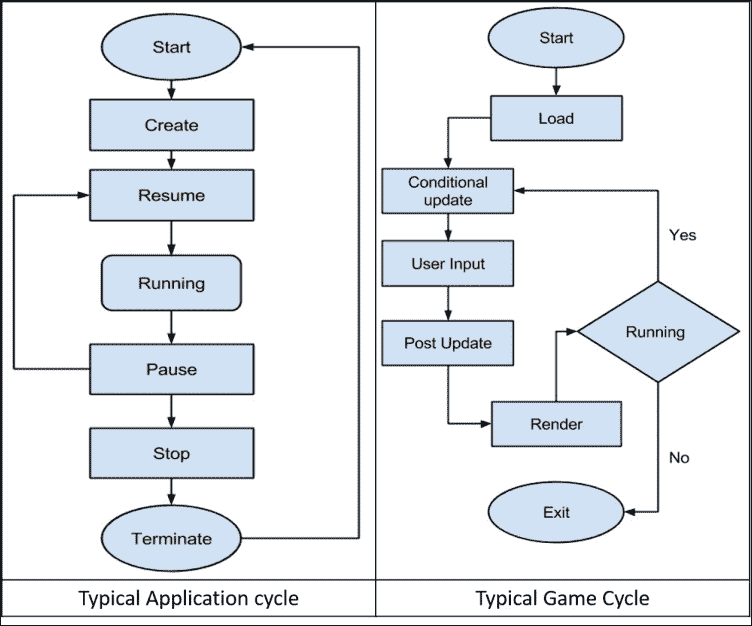

# 第一章：安卓游戏开发

在过去的十年里，游戏开发已经成为一个非常受欢迎的职业。以前，它局限于个人电脑、游戏机和一些嵌入式游戏设备。如今的世界完全配备了现代化的设备，技术更好，便携性更好，灵活性更好，质量更好。这为开发者创造更高质量的游戏和减少限制打开了大门。

安卓是一个现代操作系统，被广泛应用于许多硬件平台。因此，安卓世界已成为游戏开发者的目标。最有效和有用的目标是安卓智能手机和平板电脑。根据全球移动操作系统市场份额的调查，2015 年安卓占据了 78-80%的份额。安卓现在不仅是一个移动操作系统，还被用于电视和智能手表。因此，安卓在游戏开发者中的受欢迎程度正在飙升。

这本书对那些已经有安卓游戏开发背景的人会有所帮助。让我们从以下主题开始：

+   安卓游戏开发

+   游戏不仅仅是一个应用程序。

+   为你的游戏选择目标设备配置

+   在安卓上制作游戏的最佳实践

# 安卓游戏开发

现在让我们专注于本书的主题。尽管游戏开发涵盖了许多平台和技术，但本书只关注安卓。

安卓是基于 Linux 内核的移动操作系统。目前由谷歌开发。自 2008 年以来，该操作系统已发布了许多版本。但在发布安卓 2.2（Froyo）和安卓 2.3（Gingerbread）之后，这个操作系统引起了许多游戏开发者的注意。安卓使用所谓的**达尔维克虚拟机**（**DVM**），这是**Java 虚拟机**（JVM）的开源实现。达尔维克和标准 JVM 之间有一些差异，有些微妙，有些不那么微妙。DVM 也不是针对 Java SE 或 Java ME，而是针对一个名为 Apache Harmony Java 的 Apache 实现。如果你刚好从 Java ME 过渡过来，这些都会造成一些学习曲线。谷歌在安卓 4.4（KitKat）中推出了一种名为**安卓运行时**（**ART**）的 DVM 替代方案，ART 从安卓 5.0（棒棒糖）开始取代了 DVM。ART 主要特点是**提前编译**（**AOT**）和改进的垃圾回收过程，并提供更小的内存占用以优化内存操作。然而，大多数游戏开发者使用 DVM 来支持旧版本的安卓设备。

当许多硬件平台开始采用这个操作系统时，安卓游戏开发开始大规模开展。安卓主要被用于移动和平板设备。当移动游戏行业开始从 Symbian 或 Java 迁移到安卓或其他智能移动操作系统时，安卓游戏开发开始蓬勃发展。

安卓游戏成功的原因有几个：

+   流畅的用户界面

+   更好的互动性

+   触摸界面

+   更好的外观和感觉

+   更好的硬件平台

+   更多设计灵活性

使用通用操作系统总比使用嵌入式**实时操作系统**（**RTOS**）更容易。用户不需要花时间学习不同硬件的可用性。安卓就是这样一个易于使用的操作系统。

在安卓中，视觉用户界面非常吸引人，因为它总是在比 Symbian、Java 或嵌入式操作系统更好的硬件配置上运行。这增强了用户体验，这也是为什么它被这么多组织所采用的原因之一。随着安卓用户群的增加，许多游戏开发者开始瞄准这个平台。

从游戏设计的角度来看，增强的安卓功能列表给移动游戏的探索提供了灵活性。因此，游戏设计风格得到了提升。

当前世界上有各种类型的运行 Android 的硬件。除了手机，Android 还被用于平板电脑、电视、手表、游戏机、数码相机、个人电脑和其他设备上。如今，游戏开发者几乎在每个 Android 平台上进行开发。

## 功能和支持

**直接操作界面**是 Android 的顶级特性。它通过持续表示感兴趣的对象、动态实时操作和动态反馈与用户进行交互。Android 主要使用触摸界面，实时操作如滑动、拖动、轻击和多点触控，在 Android 游戏开发中被广泛使用。

Android 应用程序开发主要基于 Java（SDK）和 C++（NDK），这是世界上最常见的编程语言。因此，开发游戏变得更加容易。

**出色的多媒体支持**使 Android 在赢得流行度方面迈出了一大步。游戏开发者现在可以在游戏中自由使用多媒体对象，以提高游戏质量。

自 2.2 版（Froyo）以来，谷歌开发了一个名为 Google Play 服务的集成服务。这是一个封闭的系统级 API 服务提供商，在游戏开发中非常有用。

对于 Android 开发，有大量的第三方工具可用，这也使游戏开发者的工作变得更加轻松。我们可以提到一些工具，如 Android Studio、App Inventor、Corona、Delphi、Testdroid、Sample Directmedia Layer、Visual Studio、Eclipse IDE 和 RubyMotions。

**Android 设备硬件**配置必须遵循一个最低配置列表，这样开发者就可以很容易地识别配置。此外，它必须保持一个最低标准，以便轻松运行应用程序。

与 Android 设备（主要是手机或平板电脑）相关联的传感器有很多，这对于设计游戏的控制是一个非常好的选择。

Android 通过蓝牙、Wi-Fi、GSM/CDMA/EDGE、LTE、NFC、IDEN 等提供了出色的连接功能。这些帮助游戏开发者轻松创建多人游戏。

**虚拟现实**是另一个领域，Android 通过 Cardboard SDK 被使用。我们稍后会更详细地讨论这个话题。

这些是游戏开发者应该牢记的特性。其他特性对于游戏开发来说不那么重要。然而，总是有机会去探索更多，并创建一些特定特性导向的游戏。

## 挑战

在 Android 平台上开发游戏的主要挑战是以高效的方式充分利用其功能。

Android 设备配置范围广泛。因此，针对大多数设备设计游戏是一个很大的挑战。

许多 Android 游戏开发者为特定的硬件配置设计和构建游戏，比如 Tegra 或 Snapdragon，或者像 Xperia Play 这样的特定设备。Nvidia 的 Tegra 是这些情况下最常用的芯片；*THD*品牌通常表示游戏是专为 Tegra 构建的。Nvidia 在桌面端与开发者合作方面拥有丰富的经验，并将这一专业知识带到了移动设备上。鼓励 Android 游戏开发者利用 Tegra 特定的 API 来构建他们的游戏。这种情况的问题在于大多数用户的手机上并没有 Tegra。事实上，许多本来可能搭载这种游戏友好芯片的 LTE 手机现在都转向了 Snapdragon S4。对于开发者来说，要在不同的图形处理器上保持性能非常困难。

## 用户体验

Android 游戏可以通过其功能提供出色的用户体验。

游戏控制可以利用加速计或重力传感器进行基于物理的机制（如果硬件支持），这总是实时互动的一个额外优势。

在触摸屏设备上，可以通过 Android 体验到诸如滑动、拖动、捏合和多点触控等动态控制。

Android 支持 OpenGL 以获得更好的图形渲染，从而增强游戏的视觉质量。

Android 中的 Miracast 是另一个功能，它使游戏可以使用多个显示屏和屏幕共享，以获得更好的体验。

## 设计约束

任何游戏的开发都需要一个设计，Android 也不例外。Android 游戏的设计需要对目标硬件有很多了解。Android 有成千上万种不同的设备。设计师必须非常谨慎地选择他们的目标，然后设计游戏范围。

正如之前所述，这不仅对程序员是一个挑战，对设计师也是如此。不同的 Android 设备具有不同的配置，但对于设计师来说，有必要针对共同特征。

# 游戏不仅仅是一个应用程序

应用程序开发人员经常转向游戏开发，反之亦然。许多人不改变他们的风格，并相应地进行游戏开发。每个游戏开发者都应该记住*游戏不仅仅是一个应用程序*。

## 游戏与应用程序

游戏可以简称为交互式娱乐系统。游戏的主要目标是提供乐趣，无论是软件还是体育锻炼。另一方面，应用程序的主要目标是通过机械工作使生活更轻松。因此，这两者的开发方法完全不同。然而，这仍然是一个讨论的焦点，因为每个游戏都是一个应用程序。任何应用程序都可以适应游戏的特性，以提供更好的用户体验。

很难区分游戏开发与应用程序开发的复杂性。然而，游戏开发有优势。大多数应用程序开发者不必过多关注速度性能，而所有游戏开发者都必须关注游戏的速度和帧率。

每个游戏肯定都是一个应用程序，但并非每个应用程序都是一个游戏。这个陈述本身传达了这样一个信息，即在一个参考标准上，游戏开发的参数比应用程序更多，但它必须具有应用程序的所有特性。

应用程序开发是技术导向的，而游戏开发是以乐趣为导向的。这增加了游戏开发的困难。乐趣是一种情感，没有参数可以计算。因此，在制作游戏时，开发人员永远无法知道游戏在乐趣方面到底能达到什么程度。另一方面，应用程序开发人员非常确定，只要所有规格满足要求，应用程序目标就可以实现。

游戏开发非常严格地需要数学来处理物理或图形方面；即使 AI 也需要大量的数学来处理低级别的东西。应用程序更多地受技术驱动，图形的使用有限。

任何符合游戏资格的应用程序必须满足以下标准：

+   它必须在乐趣方面满足一组用户

+   必须有一组里程碑供应用程序用户实现

+   它应该奖励用户达到里程碑

+   它应该有一个更动态的用户界面

+   必须有更好的视觉冲击

+   它应该是以性能为驱动而不是以功能为驱动

## Android 应用程序和游戏的生命周期

应用程序生命周期适用于在同一平台上制作的任何游戏。但是游戏的周期更多，如下图所示：

应用程序的生命周期比游戏生命周期简单。游戏周期在应用程序生命周期的运行阶段内运行。这通常被称为**游戏循环**。这将在后面详细讨论。

这个游戏循环在游戏状态上运行。应用程序可能只有一个运行状态，但有多个游戏更新状态。在典型的游戏开发系统中，至少有两个更新状态。一个取决于游戏循环的执行，另一个取决于时间间隔。第二个实际上控制着帧率。

## 游戏和应用程序的性能

游戏和应用程序的性能管理系统之间存在明显的差异。性能是游戏开发中最大的要求之一，而对于应用程序来说，它只是一个推荐的特性，因为帧率不会影响质量。

公认的事实是，游戏比同样规模的应用程序更重。游戏在重复的帧上运行一组任务。这增加了处理器的指令流量。在应用程序中，通常没有循环；应用程序的状态取决于用户的操作。在这种情况下，处理器有足够的时间来执行指令，因为没有重复发送指令。

## 游戏和应用程序的内存管理

不是游戏的应用程序与游戏有不同的内存管理。在游戏的情况下，多媒体资产是主要对象，占用堆的比例比类对象大。但在应用程序的情况下，情况正好相反。应用程序只需要加载它们需要的对象，即类对象。

对于任何游戏开发者来说，内存优化是必须的。由于内存的广泛使用，开发者不能承担在内存中加载未使用的对象，或者由于处理不当的内存指针导致的内存泄漏。这直接影响游戏的运行。对于应用程序，内存优化显然是一个好的实践，但大多数情况下对应用程序的运行没有直接或间接的影响。然而，一个好的程序员应该始终了解内存优化。

# 选择目标设备配置

如前所述，安卓有各种设备配置。因此，对于安卓游戏开发者来说，非常重要的是要非常谨慎地选择目标。一般的方法应该具有这些参数：

+   游戏规模

+   目标受众

+   功能要求

+   可移植性的范围

## 游戏规模

这基本上是游戏制作的规模。规模越大，需要的配置就越好。这主要包括游戏大小，即它在设备上消耗的内存量。许多安卓设备配置的 RAM 和内部存储空间非常低。如果目标设备没有所需的配置，游戏将无法运行。即使游戏经过了充分优化，也可能因为运行的硬件平台而失败。

每个游戏都需要一组递归执行的进程，这需要处理器速度。如果游戏的进程密集，并且目标设备的处理器速度较慢，游戏将出现一些可怕的帧率问题，或者崩溃。

每个安卓游戏开发者在选择目标设备时必须了解内存、处理器和其他约束的要求。

让我们以一个需要至少 120MB 磁盘空间安装、512MB RAM 运行和 1.2 GHz 处理器速度达到良好帧率的安卓游戏为例。现在考虑一个移动设备，它完全符合这些规格，但作为开发者，不能假设设备没有安装或并行运行其他应用程序。因此，在这种情况下，即使设备符合要求，也有一个合理的假设，即游戏将无法获得所需的支持。因此，对于这个例子游戏，目标设备必须比最低要求更高配置。

现在，让我们看看相反的情况。假设相同的游戏要求，考虑一个具有 8GB 可用存储空间、2GB RAM 和 2GHz 多核处理器的设备。毫无疑问，游戏将在该设备上以最佳性能运行，但该设备本可以支持更大规模的游戏。因此，在这种情况下，资源利用效率不高。这就是移植的作用。游戏开发者应提升游戏质量，并为这些高端配置设备创建不同的版本。

在行业中，通常会排除一些设备，以使游戏能够正常运行。在一些情况下，游戏开发者会创建单独的游戏版本，以支持大多数设备并保持游戏质量。

## 目标受众

目标受众是制作游戏的特定群体。人们认为特定的一群人会从游戏中获得最多的乐趣，或者他们会比其他人更多地玩这个游戏。

每个游戏设计都有其目标受众。目标设备的集合是目标受众的直接结果。例如，如果目标受众是 25 至 40 岁的职业人士，无论游戏规模如何，为 Android 电视创建游戏都没有意义。这是因为这个特定的受众大多会使用移动设备，因为他们没有时间坐在电视机前。因此，针对这个目标受众的目标设备列表应包含移动设备。

我们可以看到同一类别的设备之间存在很大的差异。现在，让我们以 Android 手机为例，因为这是最常用的 Android 类别。我们可以看到市场上有各种 Android 设备。大多数 Android 手机价格相对较低，功能较少。使用这类手机的目标受众大部分属于亚洲或第三世界国家。因此，在为这个目标受众制作游戏时，开发者应考虑最低配置目标。

## 功能需求

功能需求完全取决于游戏设计。当我们谈论 Android 游戏时，主要关注的是移动和平板平台。大多数 Android 游戏都是为这些设备制作的。

如果我们考虑其他平台，如手表、电视或游戏机，功能集会有所不同。电视提供较大的显示屏，用户控制较少，手表的显示区域有限，配置最低，游戏机具有更好的图形质量和专用控制等。识别所需的硬件设备的功能列表非常重要。

可能存在这样一种情况，游戏中使用了加速计、蓝牙、Wi-Fi 或其他特殊功能，因此所选的硬件平台必须具备这些功能。然而，普通的移动设备和平板设备几乎具有游戏开发者通常会使用的相同功能集。当为某些特定的硬件平台（如游戏机或 VR 设备）制作 Android 游戏时，这种功能依赖变得非常具体。

## 可移植性的范围

在选择目标硬件设备时，每个游戏开发者都必须考虑游戏的可移植性。游戏变得越可移植，选择目标硬件所需的工作量就越少。

游戏的可移植性始终取决于游戏开发者的愿景。移植可以采用两种不同的方法：平台移植和硬件移植。在这里，我们只关注硬件移植，因为我们已经确定了平台为 Android。

游戏开发者应该专注于以下几点，以增加游戏的可移植性：

+   创建不同的资产集

+   设计不同的控制集

+   查找和列出功能的替代方案

+   控制内存使用

+   控制帧率

一个好的便携游戏是所有这些前述要点的平衡组合。大多数情况下，目标硬件是根据其他参数首先选择的，然后开发者才会着手游戏的可移植性。

# 制作 Android 游戏的最佳实践

制作 Android 游戏并不是一件大事。但是通过正确的方式制作游戏，使游戏在尽可能多的设备上看起来很棒，并且性能良好，这是非常重要的。最佳实践应该关注以下几点：

+   维护游戏质量

+   极简用户界面

+   支持最大分辨率

+   支持最大设备

+   后台行为

+   中断处理

+   维护电池使用

+   对多种视觉质量的扩展支持

+   引入社交网络和多人游戏

让我们在这里简要讨论一下。随着书籍的进展，我们将在后面详细阐述这些内容。

## 维护游戏质量

市场上有数百万款游戏，每周都有数千款新游戏推出。因此，仅仅制作一个好游戏已经不够了。每个开发者都应该定期维护他们的游戏，以适应其他改进游戏的质量。

开发者应该时刻关注用户的评论和投诉。根据这些反馈，游戏的质量可以得到很大的改善。在游戏上市之前，没有人能够准确预测用户对游戏的反应。因此，在大多数情况下，游戏的设计或其他方面都会经历剧烈的变化，以保持消费者的满意度。

还有一些其他跟踪消费者/玩家行为的方法。有几种工具可以高效地完成这项工作，比如 Google Analytics、Game Analytics、Flurry 等等。除了这些内部集成，用户在商店或博客上的评论也有助于维护游戏的质量。

修复游戏中的错误是提高游戏质量的另一个重要因素。在开发过程中不可能摆脱游戏内的所有错误。应用商店的错误报告工具对于跟踪游戏上市后的重大崩溃和 ANR 非常有用。除此之外，开发者可以使用 Android 错误报告来跟踪真实用户的错误和 bug。Android 在 2.2 版本及以后提供了这个功能。

提高游戏质量的另外两个因素是稳定的游戏玩法和一致的帧率。

## 极简用户界面

这是 Android 游戏的典型设计实践。许多开发者犯的一个常见错误是设计一个冗长而繁琐的用户界面来引导用户进入游戏。这一部分应该尽可能地简短。玩家应该在第一次体验游戏时尽量少地付出努力。大多数用户会因为繁重的 UI 界面而离开游戏。

从技术上讲，开发者应该注意设备的 UI 选项，比如菜单、返回和主页。这些是 Android 手机和平板电脑平台上最常见的选项。所有这些选项的行为应该在游戏内进行控制，因为用户在玩游戏时可能会意外按到/触摸到它们。此外，应该有一个快速的界面来退出游戏。

基本上，拥有最少的用户界面和较少的屏幕切换可以节省大量时间，这对游戏的游戏时间有直接影响。

## 支持最大分辨率

这是制作一个好的 Android 游戏的一个非常明显的要点。游戏必须支持尽可能多的分辨率。特别是 Android 在市场上有许多不同的屏幕尺寸可用。

Android 有一系列不同的分辨率集：

+   LDPI（大约 120 dpi）

+   MDPI（大约 160 dpi）

+   HDPI（大约 240 dpi）

+   XHDPI（大约 320 dpi）

+   XXHDI（大约 480 dpi）

+   XXXHDPI（大约 640 dpi）

如果他们不遵循多个分辨率规范，开发者也可以选择作为最后手段的屏幕兼容性选项。然而，建议不要使用这个 Android 的功能，因为它可能会显著降低视觉质量。这个选项在 Android API 版本 11 中默认是禁用的。

## 支持最大设备

除了不同的屏幕尺寸，Android 还有各种设备配置。大多数开发者只通过屏幕分辨率来过滤设备列表，这是一个不好的做法。Android 游戏开发者应该始终考虑目标设备配置以及分辨率。

在构建他们的应用程序时，开发者应该记住不要对特定的键盘布局、触摸界面或其他交互系统做出假设，除非游戏被限制只能在这些设备上使用。

在内存和性能方面优化应用程序也有助于支持更多设备。开发者不应该将其限制在只支持少数设备。最佳地利用磁盘空间和处理器可以增加支持范围的机会。

一个游戏应用程序构建可以通过一些简单的技巧支持更多设备。在 Android 活动启动时，开发者应该检测硬件信息，并使用它来创建某种规则，通过这些规则可以控制整个游戏的质量和处理速度。

## 后台行为

在主线程运行时，游戏中的一些任务可能会在后台运行。这些被称为异步任务，主要用于加载大文件或从互联网获取数据。

另一种后台任务称为服务，即使主应用程序线程没有运行，也可以工作。这是一个非常有用的功能，用于与安装了游戏的设备进行通信。

对于任何游戏开发者来说，合理使用这些功能是一个很好的做法。通常大量的数据需要更长时间，但不应该暂停游戏循环。在另一种情况下，异步任务用于游戏与互联网或其他连接进行通信。这个功能有助于保持主线程运行，并提供动态反馈。

后台服务对增加开发者和用户之间的通信很有用。它们可以提供用户活动信息，以改进游戏，并通知用户有关最新更新或信息。

## 中断处理

中断处理是游戏开发中最棘手的部分之一。正如我们之前讨论过的游戏循环一样，循环会在任何外部中断时暂停或有时终止。在进行中的游戏周期中，中断不应该影响游戏体验。对开发者来说，一个非常常见的问题是游戏在被中断后重新启动。如果 Android 游戏活动在空闲状态下保持很长时间，或者其他活动需要运行，Android 很可能会终止游戏活动。在这些情况下，大多数时候玩家会失去他/她的进度。

定期保存用户进度是一个很好的做法，以避免数据或进度的丢失。但保存数据可能会导致游戏循环出现延迟，并且可能会显著降低帧率。游戏开发者应该确定可以在不影响游戏体验的情况下保存数据的状态。

在多活动应用程序中处理这个问题的方法是检测并暂停/恢复所有正在运行的线程。很多时候，游戏开发者会保持线程运行，因为主要目标只是在中断时正确地暂停/恢复游戏循环。在大多数情况下，所有的后台进程都不会暂停，导致游戏出现异常行为。

## 维护电池使用

Android 游戏成功的原因之一是功耗效率。Android 硬件平台很可能是移动设备，其电源来源有限。因此，节能应用程序总是首选。

电池的主要部分被渲染和网络连接所消耗。从游戏的角度来看，渲染和连接都是必要的。因此，游戏消耗大量电力的可能性很大。

大多数游戏开发人员都非常注重视觉效果。这会提高图形质量，同时也会增加电池消耗。因此，开发人员始终应更多关注图形资产的技术质量是一个非常好的做法。资产不应该增加处理或渲染，因为开发人员经常使用非优化的资产。

另一个消耗大量电池的过程是后台服务。这些广泛用于与消费者更好地连接或用于一些基于网络的服务。从技术上讲，这个过程频繁地 ping 以保持与所需网络的连接。开发人员可以控制这种频率。避免这种情况的另一种方法是通过使用 Android **PackageManager**杀死长时间未连接或已从网络断开连接的服务。

在许多情况下，人们会发现一个游戏变得流行，或者用户数量比其他质量更好的游戏更多，仅仅是因为电池消耗较低。

如果开发人员可以确定连接丢失，那么除了连接更改接收器之外，可以使用本机 API 禁用所有接收器。相反，一旦开发人员连接，他们可以停止监听连接更改，并在执行更新之前立即检查应用程序是否在线；然后可以重新安排定期更新警报。

开发人员可以使用相同的技术来延迟需要更高带宽才能完成的下载，只需启用广播接收器，监听连接更改，并在应用程序连接到 Wi-Fi 后才启动下载。这可以显著减少电池使用。

## 对多种视觉质量的扩展支持

这一部分实际上是从支持多种分辨率开始的。我们已经讨论了具有不同 dpi 的多尺寸屏幕。以下列表是 Android 设备遵循的另一个标准：

+   QVGA（低 PPI）

+   WQVGA（中低 PPI）

+   HVGA（中等 PPI）

+   WVGA（中高 PPI）

+   SVGA（高 PPI）

+   VGA（非常高 PPI）

使用这种标准创建图形始终是有益的，以实现跨设备的最佳视觉质量。这种表示法主要取决于屏幕大小，而不是分辨率。在 Android 设备上，相同的分辨率在不同的屏幕尺寸上运行是非常常见的。专门为目标设备优化的资产将有助于提高视觉质量。

## 引入社交网络和多人游戏

游戏行业的风格和标准正在迅速变化。现在游戏被用于社交连接，即在单个平台上连接多个真实用户。非常谨慎地使用这种社交元素可以显著增加用户群和留存率。

在许多游戏中，有可能让多个用户一起体验相同的游戏状态，并通过实时互动来改善游戏玩法。一些棋类游戏，如国际象棋、飞行棋和蛇梯棋，就是这种可能的例子。除此之外，一些实时在线多人游戏也正处于巅峰状态。

谷歌通过 Google Play 服务拥有自己的多人游戏功能。除了流行的回合制和实时多人游戏支持外，谷歌还通过 Wi-Fi 引入了一项功能，可以将靠近的玩家连接到单个平台上，称为**Google Nearby**。还有许多其他第三方平台支持多人游戏。

# 总结

制作安卓游戏并不困难，但要制作一款成功的游戏就不同了。从技术角度来看，一款成功的游戏必须提供流畅的游戏体验，为用户提供出色、迅速的游戏体验。出色的视觉质量和更好的图形总是吸引用户和其他潜在玩家，而较少的错误可以消除用户在游戏过程中的烦恼，游戏可以按计划进行。广泛的设备支持可以增加用户数量和游戏次数，资源的最佳利用确保了最小可能的应用程序包大小，最后，开发者与用户之间良好的关系，通过出色的沟通技巧，可以消除用户的一些疑虑和困惑。

我们已经简要介绍了所有这些要点，以便让您了解如何制作一款成功的安卓游戏。制作安卓游戏与制作任何软件并无二致。然而，为了实现游戏的乐趣元素，游戏必须遵循一些实践。您将在本书的后面详细了解如何制作高效的安卓游戏。您还将最终了解安卓平台的游戏开发的几个方面。您将认识并了解由各种制造商制造的当前可用安卓设备的现状。有许多类型的设备，我们将一一了解。

我们将尝试探索一种更好、更高效的安卓游戏开发方法，针对不同硬件平台有许多开发流程、风格和标准。我们将进一步深入，针对 2D、3D 和虚拟现实游戏制定特定的开发标准。我们还将讨论原生开发，包括着色器和各种优化技术。

最后，我们将探讨各种使游戏成功的方法，从盈利的角度来看是足够好的。由于开发者必须了解每个用户的行为以使游戏更好，您可以通过本书了解从用户那里收集到的数据的力量。
