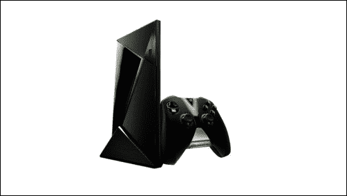
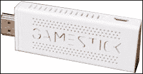
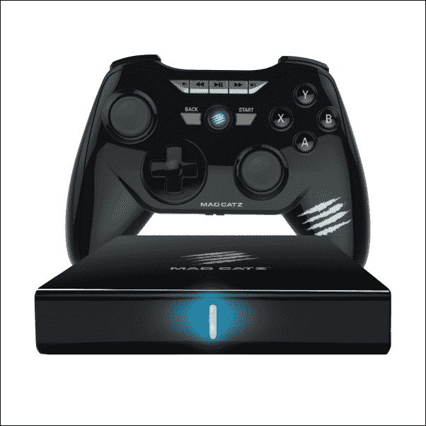
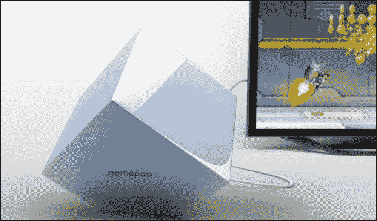

# 第二章：不同 Android 平台的介绍

第一款商用发布的 Android 设备是**HTC Dream**。在 2008 年，这款手机推出了一个新的基于 Linux 的操作系统 Android。从那时起，成千上万的制造商开始为他们的设备使用 Android。起初，Android 在移动操作系统中变得流行，如 Symbian、Java ME、Blackberry 和 iOS。新一代技术对于一个新的、轻量级、用户友好和价格实惠的操作系统有了需求。Android 满足了这些要求，并比 Blackberry 和其他竞争操作系统更快地获得了动力。

根据最新的市场研究，在 2016 年第一季度，Android 占据了 76%的市场份额，这本身就解释了它的成功。随着时间的推移，Android 已经将其领土从手机扩展到其他有用的硬件平台，如平板电脑、电视、手表、游戏机等等。

在本章中，我们将从游戏开发的角度探索这些平台。让我们快速看一下我们将要涵盖的主题：

+   探索 Android 手机

+   探索 Android 平板

+   探索 Android 电视

+   探索 Android 游戏机

+   探索 Android 手表

+   Android 手机开发见解

+   Android 平板开发见解

+   Android 电视和 STB 的开发见解

+   Android 游戏机的开发见解

+   Android 手表的开发见解

+   每个平台都有自己的特色

+   为同一款游戏进行跨平台开发

+   设计前所需的限制测量

我们将尝试了解所有平台及其详细信息，以便开发游戏。现代世界已经见证了游戏现在不仅仅局限于 PC 或游戏机。它们已经成为几乎所有事物的一部分。因此，对于 Android 游戏开发者来说，对可能对游戏有用的所有可能的硬件有一个良好的了解是非常重要的，这也为一些其他可能性打开了机会。

# 探索 Android 手机

Android 手机设备对于游戏开发者来说是最重要的设备。移动技术在过去的十年里经历了巨大的革命，从黑白像素手机到现代智能手机。目前，与最接近的竞争对手 iPhone 相比，Android 手机设备在市场上领先了很大一部分。

最初的 Android 游戏在 Android 1.6 发布后获得了动力，随后是 Android 2.3。即使在今天，仍有许多设备在运行 Android 2.3。这就是为什么许多流行的跨平台游戏引擎支持 Android 2.3。

曾经有一段时间，Android 的最低要求是 32MB 的 RAM，32MB 的磁盘空间和 200MHz 的处理器。如果我们看一下当前的设备规格，就会发现有了很大的变化。如今，Android 手机设备平均拥有 1GB 的 RAM，1GHz 的处理器和 4GB 的磁盘空间。大多数设备都有多核处理器。然而，这种提升并没有简化游戏开发者的生活；相反，它增加了更多的复杂性。

让我们来看一下配置较低的低预算 Android 设备的规格。以下示例表格显示了 Micromax Bolt A24 的配置：

| **处理器** | Cortex A5 |
| --- | --- |
| **速度** | 1GHz |
| **RAM** | 256MB |
| **闪存** | 512MB |
| **屏幕模式** | NA |
| **屏幕分辨率** | 480x640 |
| **屏幕尺寸** | 2.8 英寸 |
| **Android 版本** | 2.3（姜饼） |

以下是它的外观（图片来源：[`www.androided.in/wp-content/uploads/2014/02/Micromax-BoltA24.jpg`](http://www.androided.in/wp-content/uploads/2014/02/Micromax-BoltA24.jpg)）：


现在让我们来看一下配置非常高的高预算 Android 设备。以下表格显示了三星 Galaxy S6 的配置：

| **处理器** | Cortex A57 |
| --- | --- |
| **速度** | 2.1GHz 四核 |
| **RAM** | 3GB |
| **闪存内存** | 128 GB |
| **屏幕模式** | NA |
| **屏幕分辨率** | 1440x2560 |
| **屏幕尺寸** | 5.1 英寸 |
| **安卓版本** | 5.0.2（棒棒糖） |

它看起来是这样的（图片来源：[`talishop.ru/data/big/eew.jpg`](http://talishop.ru/data/big/eew.jpg)）：


每个安卓游戏开发者都应该清楚地意识到，单个游戏构建无法在所有配置上实现最佳性能。很显然，如果游戏在 Micromax Bolt A24 设备上运行良好，那么它肯定会在三星 Galaxy S6 上表现不佳。所谓的“表现不佳”，是指三星 Galaxy S6 上的游戏质量远低于预期。因此，对游戏可移植性有一些想法是非常好的。我们将在后面详细讨论这个问题。

以下图表显示了自 2012 年以来手机市场份额：


正如你所看到的，大部分市场被安卓占据，而 iOS 则落后很多。

其他移动操作系统如 Windows Phone、BlackBerry、Java、Symbian、Bada、QT 等都远远落后。因此，可以预测未来的手机市场将由安卓和 iOS 主导。

安卓手机市场日益扩大。设计和开发变得更加艰难、棘手，市场竞争也更加激烈。每天都有数以万计的新游戏在诸如 Google Play 商店、亚马逊应用商店、一些特定职业商店以及许多个人在线网站上推出。

我们之前已经讨论过游戏的目标受众。在探索安卓手机设备时，我们需要了解用户群体。在大多数情况下，用户类别是通过设备配置或价格群体来识别的。

# 探索安卓平板电脑

安卓平板与安卓手机非常相似。安卓手机和安卓平板的主要规格区别在于物理尺寸和屏幕分辨率。一般来说，安卓平板的 PPI 比手机低。然而，并没有硬性规定或任何特定系统来衡量这一点。

运行安卓的最低要求是 200 MHz 处理器，32 MB RAM 和 32 MB 磁盘空间。安卓需要 ARMv5 或更高的处理器，尽管安卓 4 需要 ARMv7。以前，起步年龄的平板几乎都是最低硬件系统。

平板电脑起源于平板电脑的概念；它们由触摸屏显示器、摄像头、麦克风、扬声器和一些物理按钮组成。平板电脑通常比手机或 PDA 大。

最低配置的安卓平板是 Coby Kyros MID7047，如图所示（图片来源：[`www.evisionstore.com/catalogo/coby_mid7012-4g.jpg`](http://www.evisionstore.com/catalogo/coby_mid7012-4g.jpg)）：


以下表格显示了它的规格：

| **处理器** | Cortex A5 |
| --- | --- |
| **速度** | 1 GHz |
| **RAM** | 512 MB |
| **闪存内存** | 4 GB |
| **屏幕模式** | WVGA |
| **屏幕分辨率** | 800x480 |
| **屏幕尺寸** | 7.00 英寸 |
| **安卓版本** | 4.0（ICS） |

2013 年，安卓平板销量约为 62%，销量超过 1.21 亿台设备。再加上亚马逊 Kindle Fire 销售了约 700 万台设备。

随着安卓平板的销量增加，配置也在不断提升。让我们来看看索尼在 2015 年 6 月发布的一款平板配置。这款型号被称为索尼 Xperia Z4（图片来源：[`tecneticoc1.wpengine.com/wp-content/uploads/2015/03/z4tab.png`](https://tecneticoc1.wpengine.com/wp-content/uploads/2015/03/z4tab.png)）：


以下表格显示了它的规格：

| **处理器** | 骁龙 810 |
| --- | --- |
| **速度** | 2 GHz 八核 |
| **RAM** | 3 GB |
| **闪存** | 32 GB |
| **屏幕分辨率** | 2560x1600 |
| **屏幕尺寸** | 10.1 英寸 |
| **Android 版本** | Android 5.0（棒棒糖） |

我们可以清楚地观察到这两款平板电脑之间的巨大配置差异。有趣的是，即使在今天，这两种配置仍然共存，并且人们在购买它们。

Android 平板电脑通常比智能手机更大更重。它们还具有更好的电池容量。因此，平板电脑的游戏应该是节能的。然而，现代平板电脑与智能手机并没有太大区别。智能手机的尺寸越来越大，智能手机的功能也被添加到平板电脑上。现在，人们甚至可以将平板电脑用作手机。

# 探索 Android 电视和机顶盒

在 Android 手机和平板电脑取得成功之后，Android 开始向其他硬件平台扩张。电视成为下一个目标，因为智能电视的概念已经存在市场上。因此，通过 Android，电视机成为了互动的。Google 推出了一些额外的配件，以提高 Android 电视的用户体验。

首款面向消费者推出的 Android 电视设备是 2014 年 11 月 3 日的 Nexus Player。其规格如下：

+   英特尔 Atom Z3560 1.8 GHz 四核处理器

+   1 GB RAM

+   8 GB 闪存

+   Android 5.1.1 棒棒糖

这就是它的样子（图片来源：[`1.bp.blogspot.com/-H1rp1fboU6g/VX2Huu6ClyI/AAAAAAAA3hA/5te4NZ65Tgg/s1600/nexus_player.jpg`](http://1.bp.blogspot.com/-H1rp1fboU6g/VX2Huu6ClyI/AAAAAAAA3hA/5te4NZ65Tgg/s1600/nexus_player.jpg)）：


这是第一种 Android 电视设备，与 Google TV 非常相似，也可以与 Apple TV 相媲美。

除了 Nexus Player，还有一些其他支持 Android 的机顶盒设备：

+   **Freebox Mini 4K**：这是一款 4K 能力的电视机顶盒，最初由一家法国 ISP 与光纤调制解调器一起提供。

+   **Forge TV**：这是一款具有高性能硬件规格的电视/微型游戏机，由 Razer 于 2015 年 1 月 6 日宣布。它配备了高通骁龙 805 处理器、2 GB RAM 和 16 GB 闪存。

+   **Shield Android TV**：这款设备是由 NVIDIA 于 2015 年 3 月 3 日宣布的。它声称能与第八代游戏机展开激烈竞争。这套硬件配备了一款 NVIDIA 品牌的游戏手柄。

+   **OgleBox Android TV**：这款设备主要在澳大利亚提供区域性内容。它于 2015 年 3 月宣布。

+   **LG UPlus Android TV**：韩国电信公司 LG UPlus 推出了一款 Android 电视，搭载 U+ tvG 4K UHD 和 U+ tvG Woofer IPTV 机顶盒。

+   **Arcadyan BouygtelTV**：2015 年 6 月，法国电信公司 Bouygues Telecom 宣布推出一款名为“Miami”的集成式基于 Android TV 的机顶盒。

除了这些基于机顶盒/游戏机的 Android 设备外，许多电视制造商也在瞄准推出 Android 电视。索尼、夏普、飞利浦、LG、三星等公司都在向 Android 迁移。飞利浦宣布他们未来 80%的电视型号将采用 Android（图片来源：[`www.techdigest.tv/wp-content/uploads/2014/07/kogan-smart-tv-may-2013.jpg`](http://www.techdigest.tv/wp-content/uploads/2014/07/kogan-smart-tv-may-2013.jpg)）：


让我们来看一个示例智能电视的规格：

+   **型号**：VU 32K160M LED 电视

+   **操作系统**：Android v4.4 奇巧猫

+   **处理器**：2.0 GHz 八核 GPU，搭载 Amlogic 四核 S802 ARM Cortex 处理器 CPU

+   **显示**：32 英寸 LED 屏幕（1366x768 像素），采用消色技术和全色优化器，为图像、视频、游戏等提供世界级的观看体验

+   **设计**：该型号采用 A+级纯棱镜面板覆盖，使图片更加清晰和详细。而且它比普通智能电视型号更薄。其尺寸为 29 英寸 x 19 英寸 x 7 英寸，重量为 7.3 公斤。

+   **RAM 和存储**: Vu 32K160M 电视有 2 GB DDR3 RAM 和 8 GB NAND 闪存存储。

+   **视频**: 它可以播放 @60fps 的 1080p 视频，并支持各种文件格式。

+   **连接**: Vu 电视支持蓝牙 v4.0、Wi-Fi 和以太网。它让用户可以从电视屏幕上浏览他们喜爱的网站和查看邮件。它有三个 USB 端口和两个 HDMI 端口。

这个规格足够吸引游戏开发人员积极参与他/她的下一个游戏。

谷歌还发布了一个名为 ADT-1 的安卓电视开发套件。这个硬件开发套件是在谷歌 I/O 期间向应用程序开发人员提供的（图片来源：[`chezasite.com/media/2014-post-icon/adt-1-android-tv-reference-design-1920x1080.jpg`](http://chezasite.com/media/2014-post-icon/adt-1-android-tv-reference-design-1920x1080.jpg)）：


早期的谷歌电视设备因性能不佳的规格而受到批评。幸运的是，谷歌已经试图解决这个问题，因为他们以一些相当令人印象深刻的规格强势出击：

+   Tegra 4 芯片组

+   2 GB RAM

+   16 GB 内部存储

+   2×2 MIMO 双通道 Wi-Fi

+   蓝牙 4.0

+   以太网端口

+   HDMI 端口

+   安卓 L 开发者预览

安卓电视在开箱即用时已完全解锁，因此谷歌邀请开发人员为这个平台开发任何有助于它的东西。现在还为时过早来判断这种开放性会带来什么结果，但开发人员应该很快就会探索并为这个设备开发。

# 探索安卓游戏机

连接到电视的一个小型适配器和一个控制器设备，一起被称为游戏机套装。安卓是一个便宜、低成本的操作系统，可以轻松地在任何移动硬件平台上使用。

首款基于安卓的游戏机之一是 OUYA（图片来源：[`cdn2.pu.nl/media/misc/ouya_wall_ins.jpg`](http://cdn2.pu.nl/media/misc/ouya_wall_ins.jpg)）：


这些游戏机被称为微型游戏机。几年前，这类游戏机的规格是这样的：

+   **型号**: OUYA

+   **处理器**: ARM Cortex A9

+   **速度**: 1.7 GHz 四核

+   **系统芯片**: NVIDIA Tegra 3

+   **闪存**: 8 GB

+   **RAM**: 1 GB DDR3

+   **显示**: 高清（720p）或全高清（1080p）

+   **图形处理器**: NVIDIA GeForce ULP GPU

+   **安卓版本**: 安卓 4.1 果冻豆

+   **连接**: Wi-Fi、蓝牙和局域网

现在让我们来看一下现代安卓游戏机的规格：

+   **型号**: NVIDIA Shield

+   **处理器**: ARM Cortex A57 + A53（64 位）

+   **速度**: 1.9 GHz 四核 + 1000 MHz 四核

+   **系统芯片**: NVIDIA Tegra X1

+   **闪存**: 500 GB 硬盘

+   **RAM**: 3 GB

+   **连接**: Wi-Fi、蓝牙、局域网、USB 和 HDMI

+   **显示**: 支持 4K 分辨率

这是 NVIDIA Shield 安卓游戏机 ([`cdn0.vox-cdn.com/thumbor/72vPz7fqWT7ButeiG17cW_jjP2Y=/0x0:1920x1080/1600x900/cdn0.vox-cdn.com/uploads/chorus_image/image/45812214/shield-hero-image.0.0.jpg`](https://cdn0.vox-cdn.com/thumbor/72vPz7fqWT7ButeiG17cW_jjP2Y=/0x0:1920x1080/1600x900/cdn0.vox-cdn.com/uploads/chorus_image/image/45812214/shield-hero-image.0.0.jpg))



现在让我们来看另一款现代安卓游戏机，名为 Razor Forge TV（图片来源：[`android.hu/img/2015/04/gallery-04.jpg`](http://android.hu/img/2015/04/gallery-04.jpg)）：


其规格如下：

+   **型号**: Razor Forge TV

+   **处理器**: 高通骁龙 805

+   **速度**: 2.5 GHz 四核

+   **GPU**: Adreno 420

+   **闪存**: 16 GB

+   **RAM**: 2 GB

+   **连接**: Wi-Fi、蓝牙、局域网、USB 和 HDMI

+   **安卓版本**: 5.0 棒棒糖

游戏机是专门用于游戏的设备。然而，如今，游戏机可以用于各种用途，但主要目标仍然是一样的。

从之前的规格示例中，我们可以了解到安卓游戏机的发展。开发者为游戏机工作在特定目标设备上。即使游戏是可携带的，游戏机的质量也必须得到保证。

在最近的市场研究中，有人说 PlayStation 4、Xbox One 和任天堂 Wii U 将成为硬核游戏机玩家的主要平台。然而，亚马逊、谷歌和其他公司推出的安卓游戏机预计将以更快的速度增长，并为休闲到中核心玩家提供了一个从沙发上玩游戏的经济实惠方式。很明显，随着时间的推移，更广泛的游戏机玩家群体可能会考虑安卓。

这开启了安卓游戏开发的新时代。游戏机游戏与典型的移动游戏不同，而大多数安卓游戏开发者都在其中。然而，随着自 2014 年以来安卓游戏机数量的增加，越来越多的开发者对此产生了兴趣。

除了之前讨论过的游戏机之外，还有一些其他的，比如以下的：

+   **Game Stick**：这是一个由安卓果冻豆驱动的小型插入式游戏机，具有 1GB DDR3 内存和 8GB 闪存。然而，这些规格正在被提升（图片来源：[`cdn2.knowyourmobile.com/sites/knowyourmobilecom/files/styles/gallery_wide/public/5/05/gamestick-4.jpg?itok=kYGDnKgr`](http://cdn2.knowyourmobile.com/sites/knowyourmobilecom/files/styles/gallery_wide/public/5/05/gamestick-4.jpg?itok=kYGDnKgr)）：

+   **Mad Catz MOJO**：这是一款普通的微型游戏机，配备 2GB 内存、16GB 闪存和 Tegra 4 处理器。该设备运行在安卓 4.2.2 上（图片来源：[`cc.cnetcontent.com/inlinecontent/mediaserver/3m/8f8/607/8f8607ed9d2b4cee981f651125046895/original.jpg`](http://cc.cnetcontent.com/inlinecontent/mediaserver/3m/8f8/607/8f8607ed9d2b4cee981f651125046895/original.jpg)）：

+   **GamePop**：BlueStacks 公司制造了这款下一代安卓游戏机，旨在建立一个类似其他顶级游戏机的订阅模式。大多数安卓游戏机使用基于商店的内容。这无疑是一个伴随着巨大期望的新尝试。

这款游戏机引入的一个新功能是，该设备能够通过一个名为 Looking Glass 的可视化工具运行 iOS 游戏。在这个设备进入市场之前，过于兴奋地期待它的表现可能不太明智。但如果真的能实现，结果可能会令人惊讶。



安卓游戏机的发展可能是游戏的未来；然而，其他顶级游戏机的存在不会灭绝。用户群体每天都在增加，平台上的游戏数量也在增加。

作为安卓游戏开发者，一个人不应该局限于传统的游戏平台，比如智能手机和平板电脑。时代在迅速变化。开发者应该保持自己的更新。

# 探索安卓手表

在智能技术时代，人们预期每种可能的小工具都能更智能地工作。手表也不例外。手表的类型从模拟变成了数字，现在又变成了纯粹的计算机智能手表。作为一个非常灵活的开源操作系统，安卓是智能手表最受欢迎的选择之一（图片来源：[`photos.appleinsidercdn.com/bigger-wimm-130830.jpg`](http://photos.appleinsidercdn.com/bigger-wimm-130830.jpg)）：


从早期版本开始，安卓手表就有能力玩游戏，因此进入了游戏开发领域。先进的设备和小型计算机一样出色。它们包括互联网、传感器、摄像头、蓝牙、Wi-Fi、扬声器、卡槽等许多功能。

与其他计算机一样，智能手表可以从内部或外部传感器收集信息。它可以控制或从其他仪器或计算机中检索数据。它可以支持蓝牙、Wi-Fi 和 GPS 等无线技术。然而，"手表电脑"也可能只是作为远程系统的前端，就像使用蜂窝技术或 Wi-Fi 的手表一样。

Android Wear 于 2014 年 3 月 18 日首次由谷歌宣布。与此同时，许多电子设备制造商也宣布成为 Android Wear 的合作伙伴。这些公司包括三星、摩托罗拉、LG、HTC、华硕等。

2014 年 12 月，操作系统升级到 Android 5.0（棒棒糖）。我们可以看到在这个时期周围有一系列的 Android 手表发布。LG 开始发货 LG G Watch，摩托罗拉宣布 Moto 360，华硕发布了 ZenWatch。

最新的智能手表提供了一系列吸引人的功能。用户可以通过手机语音获取方向，选择包括自行车在内的交通方式，并开始旅程。在旅行时，手表会显示方向，并实际上使用触觉交互来指示转弯，帮助佩戴者在不看手机甚至手表屏幕的情况下旅行。用户可以使用他们的 Android Wear 手表来控制手机。可以请求音乐（例如，"OK Google，播放滚石乐队"）。屏幕上会显示一个播放控制卡，包括音量、跳过和媒体图像，音乐可以从手腕上控制，用户可以自由移动。

让我们来看一下 Android 可穿戴设备的一些规格。首先是 LG G Watch：

| **处理器** | 高通骁龙 400 |
| --- | --- |
| **闪存** | 4 GB |
| **RAM** | 512 MB |
| **电池** | 400 毫安时 |
| **连接性** | 蓝牙 4.0 |
| **传感器** | 陀螺仪、加速度计、指南针 |
| **Android 版本** | 4.3 |
| **显示** | 1.6 英寸 |
| **分辨率** | 280x280 |

这种配置在市场上已经不复存在了，但用户还在。因此，在为 Android 可穿戴设备开发游戏时，开发者也应该考虑这些配置。

Android 可穿戴设备制造商也在大规模升级他们的设备硬件。现在让我们通过比较两个版本来看一下设备的演变：

|   | 索尼智能手表 2 | 索尼智能手表 3 |
| --- | --- | --- |
| **处理器** | ARM Cortex M4 | ARM A7 四核 |
| **速度** | 180 MHz | 1.2 GHz |
| **闪存** | 256 MB | 4 GB |
| **RAM** | 64 MB | 512 MB |
| **电池** | 225 毫安时 | 420 毫安时 |
| **连接性** | 蓝牙 3.0 | 蓝牙 4.0 和 Wi-Fi 准备 |
| **传感器** | 陀螺仪、加速度计、指南针、接近、环境光和 IP57 防尘防水 | 陀螺仪、加速度计、指南针、接近、环境光和 IP68 防尘防水 |
| **Android 版本** | 4.0 | 4.3+ |
| **显示** | 1.6 英寸 | 1.6 英寸 |
| **分辨率** | 220x176 | 320x320 |

我们可以看到在技术和硬件升级方面的巨大提升。这就是市场的增长，也是应用程序的增长。

# 对 Android 手机的开发见解

正如我们之前讨论过的，对于 Android 平台上的任何游戏开发者来说，主要的开发目标是 Android 手机。我们也注意到了 Android 手机的各种技术规格。当游戏开发者将目标最大化地放在这个平台上时，他们必须注意设备类别。

大多数 Android 设备都支持常见的触摸界面、物理 Home 按钮、物理锁定按钮、返回按钮以及音量上下键进行用户交互。除此之外，加速度计也可以是用户界面的一个良好媒介。

游戏大多是视觉化的，因此游戏开发者应该始终关注设备的图形性能。最新的 Android 手机中有一个独立的图形处理器，但质量有所不同。

视觉卓越不仅仅取决于 GPU，显示屏质量也非常重要。低 PPI 屏幕无法提供高质量的显示。第一代 Android G1 手机的屏幕分辨率为 240x320，属于 LDPI 分辨率类别。因此，无论开发者如何努力，游戏的视觉质量都无法达到卓越。幸运的是，随着时间的推移，设备制造商在提高视觉质量和性能方面付出了很多努力。但这一特性是以电池寿命为代价的。它获得的质量越高，消耗的电池就越多。

以前，很少有 Android 手机（例如 Android HTC Dream G1）有物理 QWERTY 键盘。这使得从 Symbian 或 BlackBerry 移植游戏控制系统到 Android 变得更容易（图片来源：[`s.androidinsider.ru/2015/02/htc-dream.@750.jpg`](http://s.androidinsider.ru/2015/02/htc-dream.@750.jpg)）：


如今，Android 游戏的控制系统完全改变了，以适应市场上其他智能手机游戏的控制风格。

在当前情况下，移动电池的平均容量约为 2750 毫安。一些制造商通过降低显示质量来提供更高的电池容量。由于移动设备的物理尺寸和重量限制，不可能将电池容量增加到一定限度以上。

以最大化设备为目标总是一个好主意，只要在性能和游戏体验之间保持平衡。

设备市场对各种设备都是开放的。虽然旧配置不再生产，但这些设备还没有过时。这就是为什么开发者对他们的游戏有最低要求。

智能手机是任何游戏开发组织的主要目标。用户群不断增加，Android 的升级帮助这个平台更快地增长。曾经有一段时间，人们认为 BlackBerry 是唯一的智能手机。但当前市场表明，时代已经改变，开发者也改变了。

对于 Android 手机游戏开发，开发者应该牢记以下限制和特点：

+   小的显示区域

+   广泛的分辨率和像素密度

+   全屏多点触控界面

+   陀螺仪、加速计、指南针、环境光等传感器支持

+   广泛的 RAM

+   各种处理器和性能

+   电池寿命

+   更多的中断机会

Android 手机现在是更有利可图的平台之一。在市场份额方面，没有其他移动操作系统能与 Android 竞争。因此，开发者总是投身于 Android。这个平台成功的一些经济原因如下：

+   拥有庞大的用户群，吸引广告商作为广告平台

+   通过成熟的商店进行简单的货币交易

+   轻松进行游戏和应用的跨推广

# Android 平板的开发见解

Android 游戏开发在 Android 平板出现之前主要局限于智能手机。在平板上玩游戏更有趣。平板游戏因以下原因在短时间内变得流行起来：

+   **更大的屏幕**：尽管分辨率相同的更大屏幕会影响视觉质量，但它提供了更大的可见性。更大的可见性增强了艺术资产以展现其细节，这对于小屏幕智能手机来说并不总是可能的。

+   **更大的物理尺寸**：更大的物理尺寸迫使玩家用双手玩游戏，这样可以更好地控制设备和控制。

+   **更大的空间/可玩区域**：更大的可玩区域可以提供更多的控制空间。这意味着玩家在使用触摸控制系统时不需要那么准确，因此可以更专注于游戏本身。因此，它增强了游戏体验。

+   **少限制**：持续玩游戏会严重消耗电池。在手机的情况下，主要目标是保持与网络的连接。因此，保持设备活跃非常重要。但平板没有特定的目标。它是一个多用途的实用设备。其中一个目的可以是玩游戏。因此，除了游戏之外，没有必要为其他工作节省电源。

+   **少打扰**：我们都知道在进行中的工作中任何打扰都会很烦人。游戏体验也是如此。任何打扰都会导致游戏的主要暂停，大多数时候，玩家会在那个时候退出。在平板上，自动打扰的机会比手动或物理打扰要少；这意味着在平板上玩游戏时会少一些烦恼。

对于安卓平板游戏开发，开发者应该牢记以下限制和特点：

+   大屏幕显示区域

+   广泛的分辨率范围，相对较低的像素密度

+   全屏多点触控界面

+   传感器支持陀螺仪、加速计、指南针、环境光等

+   广泛的 RAM

+   广泛的处理器和性能

+   打扰的机会较少

平板电脑起源于一个小型便携计算设备的概念，可以成为智能手机和个人电脑/笔记本电脑之间的桥梁。

更大的屏幕总是帮助用户更轻松地与游戏互动。游戏设计师有更多的空间可以利用。然而，这稍微增加了开发者的头疼，因为视觉质量必须在相同的硬件限制内保持不变。

以前，大多数平板使用移动处理器，但现在平板制造商正在使用笔记本处理器。英特尔酷睿就是一个例子。设备中使用的处理器能力越强，它能提供的质量就越好。

曾经有一段时间，安卓游戏首先面向手机，然后再移植到平板上。但现在情况已经改变。现在智能手机游戏的开发和平板游戏之间的界限非常微弱。大多数情况下，同一个 APK 可以支持手机和平板，几乎具有相同的质量和性能。不再专门为平板移植。

# 关于安卓电视和机顶盒的开发见解

首先，安卓电视游戏开发需要专注于两个特定的事情：

+   大型共享显示屏

+   横向分辨率较低的 dpi

对于玩家来说，大屏幕总是一个加分项，但这增加了图形设计师根据硬件限制进行优化的工作量。同时，显示屏可以与多个用户共享，因此开发者必须确保所有用户的操作始终可以与显示屏同步。

与其他安卓设备相比，电视屏幕要大得多。从 5 英寸到 50 英寸再到 150 英寸的屏幕可以暴露出图形质量差的问题。因此，在开发安卓电视游戏时需要考虑以下几点：

+   检查游戏的纹理——在安卓电视上拉伸时，低分辨率纹理通常看起来很差

+   在电视上，3D 模型可能会有锯齿状的曲线，因为多边形太少

+   如果发射器、图案或颜色太少，粒子效果可能需要重新调整以适应电视的大屏幕

+   在小屏幕的安卓设备上通常不需要抗锯齿，但对于电视来说，它会对视觉产生明显的影响。

现在下一个挑战是输入控制系统。游戏可以有多个控制器。电视可以直接由其他安卓设备或遥控器控制。

然而，任何安卓游戏机或机顶盒也可以使用。在这种情况下，游戏控制器或 D-pad 控制对游戏更有用。

要使用控制器或 D-pad，游戏开发人员应该非常具体地使用适当的控制按钮来实现每个功能。当多个玩家一起玩游戏时，每个人都有自己的控制器，重要的是要映射每个玩家-控制器对。

在`AndroidManifest.xml`文件的`application`标签下指定游戏是一个可选的优势，如下所示：

```kt
<application
<!-- other declarations and tags -->
android:isGame="true"
<!-- other declarations and tags -->
>
```

这将有助于将游戏与其他常规应用程序区分开，并将其显示在 Android TV 主页的游戏类别下。

根据要求，还可以进行其他声明。

要声明对游戏控制器的支持，请使用以下代码：

```kt
< uses-feature android:name="android.hardware.gamepad" android:required="true"/>
```

开发人员必须在`AndroidManifest.xml`文件中包含“touchscreen required false”声明，因为 Play Store 用于过滤。如果缺少这一声明，Play Store 在搜索结果中不会向 Android TV 用户显示应用程序：

```kt
< uses-feature android:name="android.hardware.touchscreen" android:required="false"/>
```

对于所有 Android TV 游戏开发人员来说，指定 Android 的非必需功能以摆脱额外的库麻烦是非常好的做法。例如，电视没有加速计或重力传感器，因此将它们标记为非必需是一个很好的开发实践。可以按照以下方式进行：

```kt
<manifest ...>
  <application ...>
    ...
    <!-- Requiring the camera removes this listing from Android TV search results -->
    <uses-feature android:name="android.hardware.camera" 
      android:required="true" />

    <!-- Making accelerometer optional has no impact on Android TV filtering -->
    <uses-feature android:name="android.hardware.sensor.accelerometer" android:required="false" /> 
  </application>
</manifest>
```

## UI 和游戏设计

每个游戏 UI 都必须遵循支持控制方案的设计，也就是说，UI 必须完全支持输入控制器和元素，并且屏幕必须相应地进行设计。这是移动/平板游戏开发和 Android TV 游戏开发之间的主要区别。

由于我们正在讨论 Android TV 上的开发，开发人员必须考虑在离沙发或豆袋 4-10 英尺的距离上玩 Android TV 游戏的感觉。以下是开发人员应该查找的检查清单：

+   所有文本都应该清晰可读

+   UI 按钮和其他元素应该与整体布局相匹配，而不会影响整个屏幕的可读性和可见性

+   在玩游戏时，控制器必须控制所有可能的任务，因为没有人愿意经常起来控制电视

## 过扫描

与手机和平板电脑屏幕不同，电视屏幕可能会在屏幕边缘失去一些空间以进行**过扫描**。尽管现在许多电视使用固定像素技术如 LCD，但许多品牌仍然会失去边缘细节。请确保在电视屏幕的外部留出一个区域，不要放置重要的 UI 和游戏元素。一个很好的经验法则是在完全空白的空间周围留出 5-10%的边距，并在绘制重要元素之前留出 10-20%的边距。

如果开发人员在其 UI 中使用标准的 Android 组件，则可以使用 Android Jelly Bean 中提供的内置过扫描支持。如果 UI 是自定义的 OpenGL 或 OpenGL ES 代码，或者使用游戏引擎的 UI 系统，则开发人员必须在 Android TV 界面设计中考虑过扫描。

# Android 游戏机的开发见解

今天的现代移动设备完全有能力运行质量适中的游戏，处理能力有限，可与 PC 和游戏机相媲美。预计到 2015-2016 年，移动游戏的收入将超过游戏机和 PC。现在的问题是，“游戏机市场会生存下去吗？”答案是*是*。

游戏机专门设计和配置，以提供最佳的游戏体验，而智能手机则设计用于更好的通信和网络连接，计算能力有限。作为游戏机操作系统的 Android 已经被证明是成功的。

Android 手机和 Android 游戏机的配置几乎没有太大区别。处理器、内存容量和其他一些变化可以看到，但最重要的区别是输入系统。手机、平板电脑、可穿戴设备都有触摸界面，而游戏机使用典型的游戏控制器。

从开发的角度来看，Android 游戏机位于手机和 PC 之间。因此，除了设计外，控制和硬件的使用是主要的两个参数。

我们已经讨论了市场上可用的各种类型的游戏机。作为开发平台，它并没有太多的独特性。

# Android 手表开发见解

可穿戴游戏直接在可穿戴设备上运行，使开发人员可以访问低级硬件，如传感器、活动、服务等，直接在可穿戴设备上。当开发人员想要发布到 Google Play 商店时，还需要一个包含可穿戴应用程序的手持游戏。可穿戴设备不支持 Google Play 商店，因此用户下载手持游戏，该游戏会自动将可穿戴游戏推送到可穿戴设备上。手持游戏还可用于进行大量处理、网络操作或其他工作，并将结果发送到可穿戴设备。

要在 Android 可穿戴设备上开发游戏，需要遵循一些技术步骤。这不是一般的 Android 游戏开发：

+   Android SDK 工具必须更新到 23.0 或更高版本

+   SDK 中的 Android 平台支持必须更新到 Android 4.4.2 (API 20)或更高版本

+   开发需要一个 Android 可穿戴设备或模拟器

## 创建和设置可穿戴应用程序

可以按以下步骤完成：

在 Android Studio 中选择**新项目**。在**配置项目**窗口中，输入应用程序名称和包名称。在**表单因素**窗口中，执行以下步骤：

1.  选择**手机和平板电脑**，在**最低 SDK**下选择**API 9: Android 2.3 (姜饼)**。

1.  选择**Wear**，在**最低 SDK**下选择**API 20: Android 4.4 (KitKat Wear)**。

1.  在第一个**添加活动**窗口中，为`mobile`添加一个空白活动。

1.  在第二个**添加活动**窗口中，为`wear`添加一个空白活动。

当向导完成时，Android Studio 将创建一个包含两个模块`mobile`和`wear`的新项目。开发人员现在有了一个用于手持设备和可穿戴设备应用程序的项目，可以在其中创建活动、服务和自定义布局。手持设备应用程序完成大部分繁重的工作，如网络通信、密集处理或需要长时间用户交互的任务。当应用程序完成这些操作时，应用程序应通过通知或将数据同步和发送到可穿戴设备来通知可穿戴设备的结果。

### 注意

`wear`模块还包含一个使用`WatchViewStub`的`Hello World`活动。这个类根据设备的屏幕是圆形还是方形来填充布局。`WatchViewStub`类是可穿戴支持库提供的 UI 小部件之一。

## 在项目中包含正确的库

Android 应用/游戏有很多库支持。每个开发人员都需要确定他们的正确需求，以包含正确的库。

以下是一些在可穿戴设备上进行游戏开发的有用库的列表：

+   **通知**：Android v4 支持库（或 v13，包括 v4）包含了扩展手持设备现有通知以支持可穿戴设备的 API。对于仅出现在可穿戴设备上的通知（即由在可穿戴设备上运行的应用发出的通知），开发人员可以在可穿戴设备上使用标准框架 API（API 级别 20），并在游戏或应用程序的`mobile`模块中删除支持库依赖。

+   **可穿戴数据层**：要使用可穿戴数据层 API 在可穿戴设备和手持设备之间同步和发送数据，开发人员需要最新版本的 Google Play 服务。如果开发人员不使用这些 API，从两个模块中删除依赖关系。

+   **可穿戴 UI 支持库**：这是一个非官方库，包括为可穿戴设备设计的 UI 小部件。安卓平台鼓励开发者在应用程序中使用它们，因为它们体现了最佳实践，但它们随时可能会发生变化。但是，如果库被更新，应用程序不会崩溃，因为它们被编译到项目中。要从更新的库中获得新功能，开发者只需静态链接新版本，并相应地更新应用程序。这个库只适用于开发者创建可穿戴应用程序。

## 与安卓版本的硬件兼容性问题

现在让我们再次看一下绝对最低的硬件要求，因为我们已经知道安卓不兼容 ARM v4 处理器，而安卓 4.0+需要 ARM v7 或更高版本。安卓可穿戴设备运行在安卓 4.4 或更高版本。因此，开发者必须支持从 ARM v7 开始。

# 平台特定特性

到目前为止，我们已经讨论了所有安卓硬件平台。每个平台在配置、大小、形状、实用性和功能方面都有自己的特点。

现在让我们总结一下在开发相同游戏时应考虑的特定平台要点。

## 安卓手机

这种类型的安卓硬件平台是全球最著名和广泛使用的设备。典型的安卓手机特定功能包括：

+   小屏幕

+   高 dpi 显示

+   广泛的硬件配置范围

+   全触摸屏

+   最大传感器支持

+   多用途

+   最大用户群

## 安卓平板电脑

这种类型的安卓硬件平台是全球第二大最著名和广泛使用的设备，具有略微不同的实用功能。典型的安卓平板电脑特定功能包括：

+   相对较大的屏幕

+   低 dpi 显示

+   全触摸屏

+   特定用途设备

## 安卓电视和机顶盒

这种类型的安卓硬件平台正在迅速传播，作为比普通电视更受欢迎的智能电视，具有更多功能和能力。典型的安卓电视和机顶盒特定功能包括：

+   最大的显示单元

+   无触摸界面

+   D-pad 或基于控制器的输入系统

+   固定的横向方向

+   有限的硬件支持

+   适合多人游戏

## 安卓游戏机

除了著名的游戏机如 PS3、PS4 和 Xbox 之外，安卓游戏机如今也越来越受欢迎。典型的安卓游戏机特定功能包括：

+   专用的硬件系统用于游戏

+   全控制器输入系统

+   多分辨率大屏幕支持

+   硬件特定开发

+   最佳的安卓平台，提供多人游戏体验

## 安卓手表

这是安卓上最常用的可穿戴平台。该设备的主要特点是提供健康信息。然而，游戏也在这个设备上流行起来。典型的安卓手表特定功能包括：

+   非常小的显示屏

+   有限的硬件支持

+   较少的内存和处理能力

+   触摸屏界面

+   非常便携

+   需要单独的可穿戴设备开发环境

# 总结

在开始开发之前，开发者必须清楚了解硬件和软件规格。在本章中，您已经了解了安卓上可能运行的不同硬件平台。通过这些知识，作为开发者，您可以轻松地确定您的目标受众。选择特定的一组硬件平台作为目标要容易得多。

在不久的将来，安卓将会进入虚拟现实世界，采用不同的技术。我们将在本书的后面讨论这些。到目前为止，您已经知道手机、平板电脑、电视、机顶盒、游戏机和手表是各种硬件平台。它们都能够运行安卓游戏。然而，安卓游戏机是唯一专用于游戏的硬件平台。

尽管游戏机是专门的游戏平台，但安卓手机和安卓平板是开发者最瞄准的平台。它们提供了运行几乎所有类型游戏所需的所有支持和设施。这些平台还有用户数量的额外优势。大多数开发者都瞄准这些平台，以获取尽可能多的用户。
