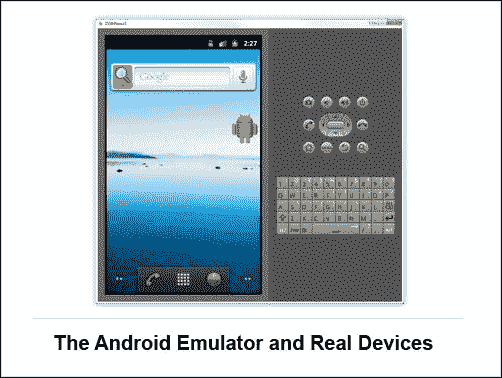
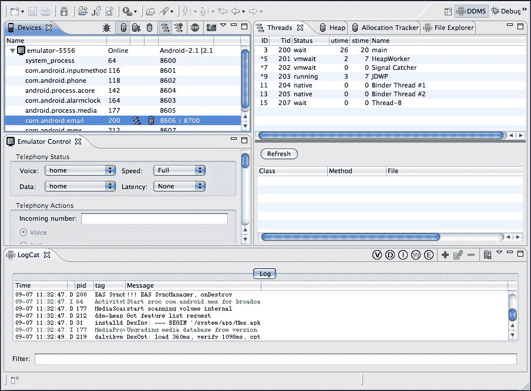
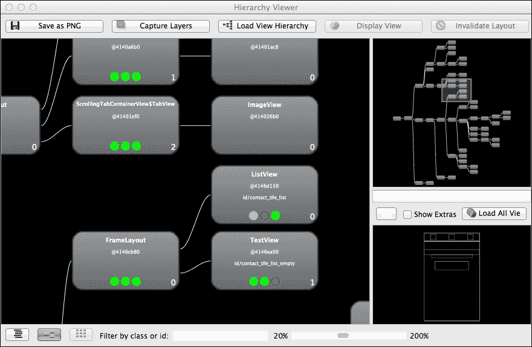
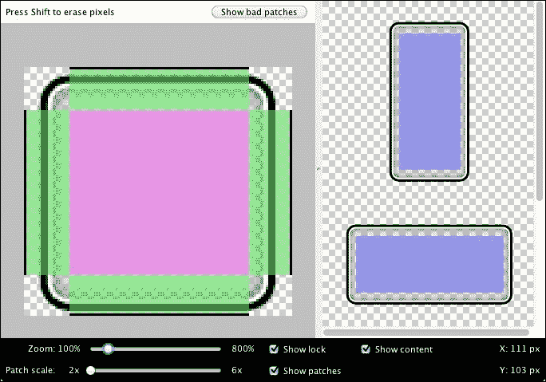
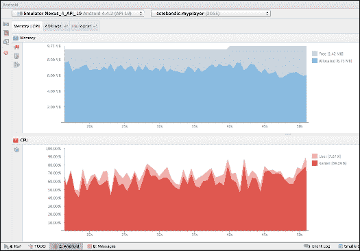

# 第三章。不同的 Android 开发工具

我们已经讨论了游戏开发的不同 Android 目标设备。在本章中，我们将看看为 Android 开发游戏的不同方法和工具。除了开发技能和知识外，了解可以使开发过程更轻松和有效的有用软件非常重要。

Android 游戏开发得到许多强大的工具和库的支持。让我们来看看开发过程中必备的工具列表：

+   Android SDK

+   Android 开发工具

+   Android 虚拟设备

+   Android 调试桥

+   达尔维克调试监视服务器

这些是 Android 游戏开发人员系统中必须安装的必备工具。没有这些工具，就无法为 Android 平台开发任何东西。尽管 ADB 和 AVD 对于开发来说并不是必需的，但它们需要用于在物理设备和虚拟设备上测试和部署游戏，以便调试游戏。

# Android SDK

Android SDK 是构建 Android 应用程序所需的主要开发工具包。不详细介绍，可以说 SDK 是任何 Android 开发的骨架。这个 SDK 本身带有数十个支持工具。它包含平台细节、API 和库，以及 ADT 和 AVD。因此，将 Android SDK 集成到系统中提供了开发人员所需的所有必要工具。始终使用最新平台和其他工具更新 SDK 是一个非常好的做法。

升级可以通过 Android SDK 管理器进行。但是，平台选择是手动的，建议根据需求仅安装必要的平台。另一个最佳实践是将最新发布的平台与 Android 的最低目标版本一起使用（图片来源：[`photos4.meetupstatic.com/photos/event/1/1/0/f/highres_441724367.jpeg`](http://photos4.meetupstatic.com/photos/event/1/1/0/f/highres_441724367.jpeg)）：


# Android 开发工具

**Android 开发工具**（**ADT**）是专为 Eclipse IDE 设计的插件，旨在为构建 Android 应用程序提供强大的集成环境。

ADT 扩展了 Eclipse 的功能，使开发人员能够快速设置新的 Android 项目，创建应用程序 UI，根据 Android 框架 API 添加包，使用 Android SDK 工具调试应用程序，甚至导出签名（或未签名）`.apk`文件以分发应用程序。

在 Eclipse 中使用 ADT 进行开发是非常推荐的，也是最快速的入门方式。通过提供的引导式项目设置以及工具集成、自定义 XML 编辑器和调试输出窗格，ADT 极大地提高了开发 Android 应用程序的速度。

然而，谷歌正在取消对 Eclipse 的 ADT 支持，因此建议开发人员切换到 Android Studio。

# Android 虚拟设备

**Android 虚拟设备**（**AVD**）是真实设备的软件生成模型，可以配置自定义硬件规格。它也可以是真实设备的虚拟副本。这是任何 Android 开发人员最重要的工具之一。这使开发人员能够在典型的 Android 环境中测试应用程序，而无需使用实际的硬件设备，以缩短开发时间（图片来源：[`www.geeknaut.com/images/2014/08/top-android-emulators-for-windows3.png`](http://www.geeknaut.com/images/2014/08/top-android-emulators-for-windows3.png)）：



## 配置 AVD

AVD 包括以下内容：

+   **硬件配置文件**：该配置文件描述虚拟设备的硬件特性。可以配置硬件选项，如 QWERTY 键盘、摄像头、集成内存等。

+   **系统镜像映射**：可以根据已安装的 Android 平台集合配置正在运行的 Android 平台版本。Android 平台可以通过 Android SDK 管理器安装。

+   **专用磁盘空间**：可以使用此功能在开发机上设置专用存储区域，用于保存模拟器的用户数据和虚拟 SD 卡。

+   **其他功能**：开发人员甚至可以指定虚拟设备的外观和感觉，如设备外壳、屏幕尺寸和外观。

以下是通过 AVD 管理器创建 AVD 的简要过程，该管理器位于 `<SDK 路径>/tools` 目录中：

1.  在主屏幕上，点击**创建虚拟设备**。

1.  在**选择硬件**窗口中，选择设备配置，如**Nexus 5**，然后点击**下一步**，然后点击**完成**。

1.  要通过使用现有设备配置文件作为模板开始自定义设备，请选择设备配置文件，然后点击**克隆设备**。或者，要创建完整的自定义模拟器，请点击**新硬件配置文件**。

1.  设置以下内容以创建新的自定义模拟器：

+   设备名称

+   屏幕尺寸

+   屏幕分辨率

+   RAM

+   输入选项

+   支持的状态

+   摄像头选项

+   传感器选项

1.  设置完每个属性后，点击**完成**。

开发人员还可以使用命令行创建新的自定义模拟器，如下所示：

```kt
android create avd -n <name> -t <targetID> [-<option> <value>] ...

```

在这里，可以设置以下选项：

+   `name`：这将是自定义 AVD 名称

+   `targetID`：这将是自定义 ID

+   `option`：这可以包括设备屏幕密度、分辨率、摄像头等选项。

开发人员可以执行此命令来使用先前定义的 AVD：

```kt
android list targets

```

然后，开发人员可以运行以下命令：

```kt
emulator –avd <avd_name> [options]

```

# Android 调试桥

**Android 调试桥**（**adb**）是用于在开发环境和虚拟设备或连接的 Android 设备之间建立通信的工具。它是一个客户端-服务器命令行程序，由三个元素组成：

+   **开发机上的客户端**：作为客户端工作，可以通过 adb 命令调用。其他 Android 工具，如 ADT 插件和 DDMS，也会创建 adb 客户端。

+   **守护进程**：在每个模拟器或设备实例上后台运行的后台进程。

+   **开发机上的服务器**：这是在开发机上运行的后台进程，负责管理客户端和服务器之间的通信。

启动 adb 时，客户端首先检查是否已经运行了 adb 服务器进程。如果没有，它会启动服务器进程。服务器启动后，它会绑定到本地 TCP 端口 `5037`，并监听从 adb 客户端发送的命令——所有 adb 客户端都使用端口 `5037` 与 adb 服务器通信。

服务器然后建立到所有运行的模拟器/设备实例的连接。它通过扫描范围为 `5555` 到 `5585` 的奇数端口来定位模拟器/设备实例，这是模拟器/设备使用的范围。服务器在找到 adb 守护程序时，会建立到该端口的连接。请注意，每个模拟器/设备实例都会获取一对连续端口——用于控制台连接的偶数端口和用于 adb 连接的奇数端口。

一旦服务器建立了到所有模拟器实例的连接，开发人员就可以使用 adb 命令访问这些实例。由于服务器管理着对模拟器/设备实例的连接，并处理来自多个 adb 客户端的命令，开发人员可以从任何客户端（或脚本）控制任何模拟器/设备实例。

## 在 Android 设备上使用 adb

要记住的第一件事之一是将开发设备置于 USB 调试模式。这可以通过转到设置，点击**开发人员选项**，并为 Android 5.0 及以上版本勾选名为**USB 调试**的复选框来完成（对于其他 Android 版本，请参考[`www.recovery-android.com/enable-usb-debugging-on-android.html`](https://www.recovery-android.com/enable-usb-debugging-on-android.html)）。如果不这样做，开发 PC 将无法识别设备。

最重要的是知道如何通过命令行进入 adb 文件夹。这可以通过`cd`（更改目录）命令完成。因此，如果（在 Windows 上）SDK 文件夹称为`android-SDK`，并且位于根目录（`c:`）中，您可以输入以下命令：

```kt
cd c:/android-SDK

```

然后，要进入 adb 文件夹，请使用以下命令：

```kt
cd platform-tools

```

此时，提示会显示如下内容：

```kt
C:\android-SDK\platform-tools>

```

现在开发人员可以连接设备，并测试 adb 连接，在找到并安装特定设备的驱动程序之后：

```kt
adb devices

```

如果一切设置正确，应该会列出已连接的设备。手机或平板电脑将被分配一个编号，因此如果它不说“Droid Razr”或“Galaxy Nexus”，也不要感到惊讶。

对于普通用户，adb 更多地是用于基本黑客任务的工具，而不是任务本身。除非开发人员知道自己在做什么，他们可能不应该在没有明确指示的情况下过多地探索。在对设备进行 root 时，了解这些基础知识可以帮助节省一些时间，并让开发人员提前做好准备。

除了特定设备的 root 指令之外，开发人员需要的下一步是手机或平板电脑的驱动程序。

通常，最简单的方法是简单地通过谷歌搜索*特定设备加驱动程序*。因此，如果开发人员有一个 Droid Razr，他/她应该搜索`Droid Razr Windows Drivers`。这几乎总是会将开发人员引向最佳链接。

另一个选项，仅适用于原生 Android 设备的是从 SDK 下载 USB 驱动程序。要做到这一点，再次启动 SDK 管理器。转到左侧的**可用软件包**选项卡，展开**第三方附加组件**条目，然后展开**Google Inc.附加组件**条目。最后，勾选**Google USB 驱动程序**软件包的条目。

请注意，USB 驱动程序包与 OS X 不兼容。

# Dalvik 调试监视服务器

**Dalvik 调试监视服务器**（**DDMS**），无论是通过独立应用程序还是具有相同名称的 Eclipse 透视图访问，都提供了方便的功能，用于检查、调试和与模拟器和设备实例交互。您可以使用 DDMS 来检查运行中的进程和线程，浏览文件系统，收集堆和其他内存信息，附加调试器，甚至拍摄屏幕截图。对于模拟器，您还可以模拟模拟位置数据，发送短信和发起来电：



如前面的屏幕截图所示，DDMS 主要可以跟踪、更新和显示以下信息：

+   所有运行中的进程

+   每个进程的所有运行线程

+   每个进程的已用堆

+   所有日志消息

在 Android 上，每个应用程序都在自己的进程中运行，每个进程都在自己的虚拟机中运行。调试器可以连接到 VM 的公开端口。DDMS 在启动时连接到 adb。成功连接后，在 adb 和 DDMS 之间创建了一个 VM 监视服务，该服务在设备上启动和结束 VM 时通知 DDMS。DDMS 通过 adb 检索 VM 的进程 ID，并在通过设备上的 adb 守护程序运行的活动 VM 时，打开到 VM 的调试器的连接。DDMS 现在可以使用自定义的线路协议与 VM 通信。

DDMS 还监听默认调试端口，称为**基本端口**。基本端口是一个端口转发器，可以接受来自任何调试端口的 VM 流量并将其转发到调试器。转发的流量由 DDMS **设备**视图中当前选择的进程确定。

# 其他工具

前面部分提到的元素是 Android 开发的最低要求，可以使用它们创建完整的应用程序。但是，借助其他一些工具的支持，开发过程可以变得更加容易。让我们看看一些这样的工具。这些工具对于 Android 开发并非强制使用，但建议使用以获得更好的开发过程。

## Eclipse

尽管 Eclipse 不是唯一可用于开发 Android 应用程序的 Java 开发环境，但它是迄今为止最受欢迎的。这在一定程度上是由于其成本（免费！），但主要是由于 Android 工具与 Eclipse 的强大集成。这种集成是通过 Eclipse 的 ADT 插件实现的，可以从 Android 网站下载。

对于许多开发人员来说，使用 Eclipse 进行 Android 开发是一个众所周知的做法。其中一些原因如下：

+   免费的 Eclipse IDE

+   直接的 Android 插件支持

+   直接的 DDMS 支持

+   简单的界面

+   Android NDK 支持

Android Studio 的推出降低了 Eclipse 在 Android 开发人员中的流行度，因为 Android Studio 具有内置的支持任何 Android 开发所需的一切。此外，在设计视图中使用起来更加简化。谷歌本身正在大力推广这个新工具。

Eclipse Android 开发存在一些缺点，因为它使用 Android SDK 作为第三方工具。主要缺点如下：

+   通过 Eclipse 进行调试有时很困难

+   ADB 配置很棘手

+   Android 清单必须手动管理

+   通过 Eclipse IDE 进行设计视图非常复杂

Eclipse 是一个出色的独立 IDE，但在 Android 开发方面，Android Studio 赢得了比赛。

## 层次结构查看器

层次结构查看器，无论是通过独立应用程序还是相对较新的 Eclipse 透视图访问，都用于查看布局和屏幕在运行时的解析方式。

它提供了应用程序布局和视图层次结构的图形表示，并可用于诊断布局问题（图片来源：[`media-mediatemple.netdna-ssl.com/wp-content/uploads/2012/03/da_hierarchy_viewer.png`](https://media-mediatemple.netdna-ssl.com/wp-content/uploads/2012/03/da_hierarchy_viewer.png)）：



## Draw 9-Patch

在图形设计方面，Draw 9-patch 工具非常有用。该工具允许您将传统的 PNG 图形文件转换为可伸缩的图形，对于移动开发使用更加灵活和高效。该工具简化了在即时显示结果的环境中创建 NinePatch 文件的过程：



## ProGuard

ProGuard 与 Android 开发没有直接关联，但它有助于保护开发者的知识产权。对于 Android 游戏开发人员来说，使用 ProGuard 是一种非常常见的做法。

ProGuard 基本上将成员和方法包装成不可读的代码结构。该工具可以配置为混淆生成的二进制文件。ProGuard 还有助于优化二进制文件，从而减小整体包大小。

当开发人员尝试将预编译的 JAR 文件集成到 Android 项目中时，ProGuard 可能很难使用。如果 JAR 已经通过 ProGuard 进行了优化，类结构可能会产生冲突。在这种情况下，必须配置 ProGuard 以排除预编译的 JAR，以实现成功构建。

始终建议使用 ProGuard 来保护游戏类免受逆向工程或反编译。

## 资产优化工具

我们都知道 Android 硬件配置的广泛范围。始终有必要优化资产以减少运行时内存使用和不必要的数据处理。在游戏中，图形资产占据了大部分存储空间和内存。

### 完整的资产优化

未经优化的资产可能包含一些不必要的数据，例如不透明资产中的透明信息，EXIF 数据，未使用的颜色信息，额外的位深度等。

资产优化工具有助于摆脱这一负担。但是，使用此类工具可能会使资产质量下降。开发人员在使用这些工具时应非常谨慎。

例如，如果一个资产应该是 24 位的，但是使用了 8 位优化工具进行了优化，它肯定会失去其视觉质量。因此，不建议对任何游戏进行过度优化，开发人员有责任使用适当的优化技术来维护游戏质量。

以下是一些此类资产优化工具：

+   PNGOUT

+   TinyPNG

+   RIOT

+   JPEGmini

+   PNGGauntlet

借助这些工具，艺术资源的大小可以优化到 80-90％。但许多开发人员不喜欢定期使用它们，原因如下：

+   开发人员不会单独优化每个资产，这导致了一些资产的质量损失。

+   选择正确的优化工具真的很困难。有时，相同的工作可能需要多个工具，这会减慢整体开发过程。

### 创建精灵

在许多情况下，人们注意到游戏中使用了大量小型艺术资源。这可能导致游戏的性能严重滞后。建议使用精灵构建工具将这些资源合并到一个资源中，以节省空间和时间。SpriteBuilder 和 TexturePacker 是此类工具的两个很好的例子。

# 测试工具

对于任何开发过程，测试都非常重要。对于 Android 游戏开发，也有一些工具和流程可以使测试变得更容易。

## 创建测试用例

活动测试以结构化方式编写。确保将测试放在与受测试代码不同的包中。按照惯例，您的测试包名称应该与应用程序包名称相同，后缀为`.tests`。在您创建的测试包中，添加您的测试用例的 Java 类。按照惯例，您的测试用例名称也应该与您想要测试的 Java 或 Android 类的名称相同，但后缀为`Test`。

要在 Eclipse 中创建新的测试用例，请执行以下步骤：

1.  在包资源管理器中，右键单击您的测试项目的`/src`目录，然后选择**新建** | **包**。

1.  将**名称**字段设置为`<package_name>.tests`（例如`com.example.android.testingfun.tests`），然后单击**完成**。

1.  右键单击您创建的测试包，并选择**新建** | **类**。

1.  将**名称**字段设置为`<activity_name>Test`（例如`MyFirstTestActivityTest`），然后单击**完成**。

## 设置测试装置

测试装置由必须初始化以运行一个或多个测试的对象组成。要设置测试装置，您可以重写测试中的`setUp()`和`tearDown()`方法。测试运行器在运行任何其他测试方法之前自动运行`setUp()`，并在每个测试方法执行结束时运行`tearDown()`。您可以使用这些方法将测试初始化和清理的代码与测试方法分开。

要在 Eclipse 中设置测试装置，请按照下面列出的步骤进行操作：

1.  在包资源管理器中，双击您之前创建的测试用例，以打开 Eclipse Java 编辑器，然后修改您的测试用例类以扩展`ActivityTestCase`的子类之一。例如：

```kt
public class MyFirstTestActivityTest extends ActivityInstrumentationTestCase2<MyFirstTestActivity> {
```

1.  接下来，向您的测试用例添加构造函数和`setUp()`方法，并为您想要测试的活动添加变量声明。例如：

```kt
public class MyFirstTestActivityTest
        extends ActivityInstrumentationTestCase2<MyFirstTestActivity> {

    private MyFirstTestActivity mFirstTestActivity;
    private TextView mFirstTestText;

    public MyFirstTestActivityTest() {
        super(MyFirstTestActivity.class);
    }

    @Override
    protected void setUp() throws Exception {
        super.setUp();
        mFirstTestActivity = getActivity();
        mFirstTestText =
                (TextView) mFirstTestActivity
                .findViewById(R.id.my_first_test_text_view);
    }
}
```

构造函数由测试运行器调用以实例化测试类，而`setUp()`方法在测试运行器运行测试类中的任何测试之前由测试运行器调用。

通常，在`setUp()`方法中，您应该调用`setUp()`的超类构造函数，这是 JUnit 所要求的。

您可以通过以下方式初始化测试装置状态：

1.  定义存储装置状态的实例变量。

1.  创建并存储对要测试的活动实例的引用。

1.  获取要测试的活动中的任何 UI 组件的引用。

开发人员可以使用`getActivity()`方法获取对要测试的活动的引用。

## 添加测试前提条件

作为一种合理检查，验证测试装置是否已正确设置，并且您要测试的对象是否已正确实例化或初始化是一个好习惯。这样，您就不必因为测试装置的设置有问题而看到测试失败。按照惯例，用于验证测试装置的方法称为`testPreconditions()`。

例如，您可能希望向您的测试用例添加一个类似于以下内容的`testPreconditions()`方法：

```kt
public void testPreconditions() {
    assertNotNull("mFirstTestActivity is null", mFirstTestActivity);
    assertNotNull("mFirstTestText is null", mFirstTestText);
}
```

断言方法来自 Junit 的`Assert`类。通常，您可以使用断言来验证您要测试的特定条件是否为真。

如果条件为假，则断言方法会抛出`AssertionFailedError`异常，然后通常由测试运行器报告。您可以在断言方法的第一个参数中提供一个字符串，以便在断言失败时提供一些上下文详情。

如果条件为真，则测试通过。在两种情况下，测试运行器都会继续运行测试用例中的其他测试方法。

## 添加测试方法来验证一个活动

接下来，添加一个或多个测试方法来验证活动的布局和功能行为。

例如，如果您的活动包括一个 TextView，您可以添加一个类似于以下内容的测试方法来检查它是否具有正确的标签文本：

```kt
public void testMyFirstTestTextView_labelText() {
    final String expected =
            mFirstTestActivity.getString(R.string.my_first_test);
    final String actual = mFirstTestText.getText().toString();
    assertEquals(expected, actual);
}
```

`testMyFirstTestTextView_labelText()`方法只是检查 TextView 的默认文本（由布局设置）是否与`strings.xml`资源中定义的预期文本相同。

### 注意

在命名测试方法时，您可以使用下划线来区分正在测试的内容和正在测试的具体情况。这种风格使得更容易看到确切测试了哪些情况。

在进行这种类型的字符串值比较时，最好从资源中读取预期字符串，而不是在比较代码中硬编码字符串。这样可以防止在资源文件中修改字符串定义时轻松破坏您的测试。

要执行比较，将预期和实际字符串作为参数传递给`assertEquals()`方法。如果这些值不相同，断言将抛出`AssertionFailedError`异常。

如果您添加了一个`testPreconditions()`方法，请在 Java 类中的`testPreconditions()`定义之后放置您的测试方法。

您可以在 Eclipse 的“包资源管理器”中轻松构建和运行您的测试。要构建和运行您的测试，请按照以下步骤进行：

1.  将 Android 设备连接到计算机。在设备或模拟器上，打开**设置**菜单，选择**开发者选项**，并确保**USB 调试**已启用。

1.  在“项目资源管理器”中，右键单击您之前创建的测试类，然后选择**运行为** | **Android JUnit 测试**。

1.  在**Android 设备选择器**对话框中，选择刚刚连接的设备，然后单击**确定**。

1.  在 JUnit 视图中，验证测试是否通过，没有错误或失败。

# 性能分析工具

在屏幕上放置像素涉及四个主要的硬件部件：CPU 计算显示列表，GPU 将图像渲染到显示器，内存存储图像和数据，电池提供电力。每个硬件部件都有约束；推动或超过这些约束会导致您的应用变慢，降低显示性能，或耗尽电池。

要发现导致特定性能问题的原因，您需要深入了解，使用工具收集有关应用程序执行行为的数据，将这些数据显示为列表和图形，理解和分析所见的内容，并改进您的代码。

Android Studio 和您的设备提供了性能分析工具，记录和可视化应用的渲染、计算、内存和电池性能。

# Android Studio

Android Studio 是 Android 应用开发的官方 IDE，基于 IntelliJ IDEA。除了您期望从 IntelliJ 获得的功能外，Android Studio 还提供了以下功能：

+   灵活的基于 Gradle 的构建系统

+   构建变体和多个`.apk`文件生成

+   代码模板可帮助您构建常见的应用程序功能

+   具有拖放主题编辑支持的丰富布局编辑器

+   lint 工具用于捕捉性能、可用性、版本兼容性和其他问题

+   ProGuard 和应用签名功能

+   内置对 Google Cloud 平台的支持，轻松集成 Google Cloud 消息传递和 App Engine

如果您是 Android Studio 或 IntelliJ IDEA 界面的新手，本节将介绍一些关键的 Android Studio 功能。

## Android 项目视图

默认情况下，Android Studio 在 Android 项目视图中显示项目文件。此视图显示项目结构的扁平化版本，可快速访问 Android 项目的关键源文件，并帮助您使用基于 Gradle 的构建系统。Android 项目视图：

+   在模块层次结构的顶层显示最重要的源目录

+   将所有模块的构建文件分组到一个公共文件夹中

+   将每个模块的所有清单文件分组到一个公共文件夹中

+   显示所有 Gradle 源集的资源文件

+   将不同语言环境、方向和屏幕类型的资源文件分组到单个资源类型的单个组中

Android 项目视图在项目层次结构的顶层显示所有构建文件，位于`Gradle Scripts`下。每个项目模块都显示为项目层次结构的顶层文件夹，并包含以下四个元素：

+   `java/`：模块的源文件

+   `manifests/`：模块的清单文件

+   `res/`：模块的资源文件

+   `Gradle Scripts/`：Gradle 构建和属性文件

### 注意

例如，Android 项目视图将不同屏幕密度下`ic_launcher.png`资源的所有实例分组到同一个元素下。

磁盘上的项目结构与此扁平化表示不同。要切换回分隔的项目视图，请从**项目**下拉菜单中选择您的项目。

## 内存和 CPU 监视器

Android Studio 提供了内存和 CPU 监视器视图，以便您可以轻松监视应用的性能和内存使用情况，跟踪 CPU 使用情况，查找已释放的对象，定位内存泄漏，并跟踪连接设备使用的内存量。在设备或模拟器上运行您的应用程序时，单击运行时窗口左下角的**Android**选项卡，以启动**Android 运行时**窗口。单击**内存|CPU**选项卡。

在 Android Studio 中监视内存使用情况时，您可以启动垃圾回收，并同时将 Java 堆转储到 Android 特定的 HPROF 二进制格式文件中。HPROF 查看器显示类、每个类的实例和引用树，以帮助您跟踪内存使用情况和查找内存泄漏。

Android Studio 允许您跟踪内存分配，因为它监视内存使用情况。跟踪内存分配可以让您监视在执行某些操作时对象的分配位置。了解这些分配可以让您调整与这些操作相关的方法调用，以优化应用程序的性能和内存使用。



# 跨平台工具

虽然我们只谈论 Android 游戏开发，但是没有跨平台支持，游戏开发是不可能高效的。我们已经讨论了游戏设计的灵活性。从典型的技术角度来看，应该可以将游戏部署到各种平台，如 iOS、Windows、游戏机等。

请始终记住，跨平台移动开发并不像只编写一次代码，通过工具进行翻译，然后将 iOS 和 Android 应用程序发布到各自的应用商店那样简单。

使用跨平台移动开发工具可以减少在两个平台上开发应用程序所需的时间和成本，但需要更新 UI 以匹配每个系统。例如，需要在两者之间进行调整，以使菜单和控制命令与 Android 设备和 iOS 设备的 UX 相匹配，因为它们在操作方式上有所不同。

有很多支持跨平台开发的工具。让我们来看看其中的一些：

## Cocos2d-x

Cocos2d 主要用于二维游戏开发。它为开发者提供了基于其首选编程语言的五种不同分支或平台的选择，如 C++、JavaScript、Objective C、Python 和 C#（图片来源：[`www.cocos2d-x.org/attachments/802/cocos2dx_landscape.png`](http://www.cocos2d-x.org/attachments/802/cocos2dx_landscape.png)）：


主要，这个工具对 Android、iOS 和 Windows Phone 都很有效。开发平台主要是 2D；然而，从 Cocos2d-x 3.x 开始，也可以开发 3D 游戏。

Cocos2d-x 与原生 Android 兼容，并且可以分别支持不同的处理器架构。这个工具在 Unix 环境中工作。

有一个庞大的开发者社区在 Cocos2d-x 上开发游戏。以下是从 Android 游戏开发角度看这个跨平台开发引擎的优缺点：

优点如下：

+   支持最常见的编程语言，如 C++

+   在本地环境中工作

+   轻量级和优化库

+   常见的 OpenGL 渲染系统

+   支持所有智能手机功能的 2D 开发

+   完全免费的开源引擎

缺点如下：

+   主要支持 2D 开发

+   跨平台部署很棘手和复杂

+   性能和内存优化较弱

+   没有可视化编程支持

+   引擎内没有提供调试工具

+   主要在手机平台上运行

## Unity3D

Unity3D 是 Android 和 iOS 游戏开发者中最流行的跨平台引擎。虽然它主要针对移动平台进行了优化，但它足够强大，可以为其他主要游戏平台部署游戏，例如 PC、Mac、游戏机、Web、Linux、Xbox、PlayStation 等。目前，它支持 17 种不同的游戏开发平台（图片来源：[`img.danawa.com/images/descFiles/3/545/2544550_1_1390443907.png`](http://img.danawa.com/images/descFiles/3/545/2544550_1_1390443907.png)）：


一旦您在所有选择的平台上都有了游戏，Unity3D 甚至会帮助您将其分发到适当的商店，获得社交分享，并跟踪用户分析。

Unity3D 拥有最大的游戏开发者社区，几乎在游戏开发的各个方面都有很大的支持。它有自己的商店，您可以在那里找到有效的预构建自定义库、预构建插件等，这有助于开发者大大减少开发时间。以下是 Unity3D 的主要优缺点。

优点如下：

+   支持 17 种不同的游戏平台

+   非常简单的部署程序

+   可视化编辑器支持可视化编程

+   内置强大的调试工具

+   庞大的库支持

+   无忧开发

+   内置强大的内存和性能优化器

缺点如下：

+   相对较大的库大小

+   性能稍重（然而，它正在日益改进）

+   仅支持脚本语言（C＃，JavaScript 和 Boo）

+   商业用途并非完全免费

+   主要适用于 3D

## 虚幻引擎

最近发布的虚幻引擎 4 是一个非常强大的跨平台游戏引擎。此前，该引擎仅专注于主机和 PC 平台，但现在已将其支持扩展到 Android 和 iOS 等移动游戏平台（图片来源：[`up.11t.ir/view/691714/1425334231-unreal-engine-logo.png`](http://up.11t.ir/view/691714/1425334231-unreal-engine-logo.png)）：


关于虚幻引擎 4 是否比 Unity3D 更好有很多争论。它们都有各自的优缺点。让我们来看看虚幻引擎 4 的优缺点：

优点如下：

+   蓝图功能允许灵活的可视化编程

+   通用 C++语言更适合开发人员

+   图形处理非常出色

+   内置动态阴影系统

+   简单易懂，开始制作游戏

+   在设备可扩展性方面提供广泛支持

+   编辑器中的材料设计

缺点如下：

+   移动优化仍未达到标准

+   缺乏 2D 开发工具

+   缺乏第三方插件的可用性

+   在移动开发中使用精灵很麻烦

+   仍专注于高配置硬件平台

## PhoneGap

由 Adobe 拥有，PhoneGap 是初次应用程序开发者可以使用的免费资源，用于将代码从 HTML5，CSS 和 JavaScript 翻译过来。

他们在各个平台上维护 SDK，因此您可以为每个平台开发应用程序，这样您就少了一件要担心的事情。一旦您的应用程序完成，您可以与团队成员分享，以便审查是否需要进行任何改进。

除了 iOS 和 Android，PhoneGap 还为 BlackBerry 和 Windows 创建应用程序。因此，它真正是一个跨平台移动开发工具（图片来源：[`blogs.perceptionsystem.com/wp-content/uploads/2016/03/phonegap.png`](http://blogs.perceptionsystem.com/wp-content/uploads/2016/03/phonegap.png)）：


PhoneGap 具有以下优点：

+   几乎支持所有移动平台

+   轻量级应用程序构建

+   支持 HTML，CSS 和 JavaScript

+   Cordova 应用程序的安装方式与本机应用程序相同

+   PhoneGap 是开源和免费的

它有以下缺点：

+   缺乏平台支持

+   缺乏第三方插件

+   本机 UI 仍然难以使用

## Corona

Corona 的 SDK 承诺您可以在下载后的五分钟内开始编写新应用程序。这是另一个专为 2D 游戏图形优化的跨平台移动开发工具，可以帮助您比从头开始编写代码快 10 倍制作游戏（图片来源：[`qph.ec.quoracdn.net/main-qimg-fad64a16e531773325448e6ca699d117`](https://qph.ec.quoracdn.net/main-qimg-fad64a16e531773325448e6ca699d117)）：


Corona 的编程语言是 Lua，它是用 C 编写的，使其成为一种跨平台语言。Corona 选择 Lua 是因为他们发现它对于移动应用程序来说非常强大，占用空间很小。

Corona 具有以下优点：

+   在 FPS 方面具有良好的应用程序性能

+   良好的内置模拟器

+   轻量级应用程序构建

它有以下缺点：

+   使用不太流行的脚本语言 Lua

+   不免费

+   插件支持较少

+   没有设备上的调试支持

## 钛

使用 JavaScript，Titanium 的 SDK 可以创建原生的 iOS 和 Android 应用程序，同时在制作所有应用程序时可以重复使用 60%到 90%的相同代码，从而为您节省大量时间（图片来源：[`mobile.e20lab.info/wp-content/uploads/sites/2/2014/04/titanium.png`](http://mobile.e20lab.info/wp-content/uploads/sites/2/2014/04/titanium.png)）：


由于 Titanium 是一个开源工具，成千上万的开发人员不断为其做出贡献，使其变得更好，并赋予它更多功能。如果您发现系统中有错误，您也可以这样做。

优点如下：

+   初始阶段的快速灵活性

+   轻量级应用程序构建

+   常见的 JavaScript 语言

+   在 Android 和 iOS 上的 Web 和移动支持

+   开源

缺点如下：

+   缺乏插件支持

+   缺乏平台支持范围

+   基于脚本的开发增加了复杂性和工作量

+   性能因不同平台而异

+   与其他工具相比，优化不足

# 总结

开发工具对于任何游戏开发都是必不可少的；然而，在游戏设计和前期分析阶段，它们一直是低优先级的。当需要这些工具时，才意识到它们的必要性。

我们只讨论了 Android 开发的必备工具。但是现代游戏开发需要在硬件平台和操作系统上具有灵活性。这就是跨平台开发引擎出现的地方。这些工具帮助开发过程变得更快更高效；然而，这是以性能略微下降和更大的构建大小为代价的。在大多数情况下，开发人员对跨平台引擎的控制有限，但如果游戏是在原生 SDK 上开发的，就可以获得完全控制。

开发工具不仅在开发和调试方面有用——它们在优化游戏以及数据保护方面非常高效，这可能对游戏没有直接影响。一个优秀的开发人员必须使用优化工具来提供性能更好的游戏。
