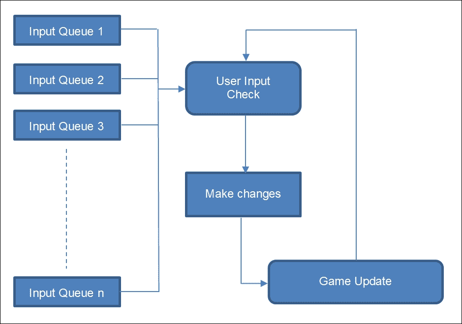
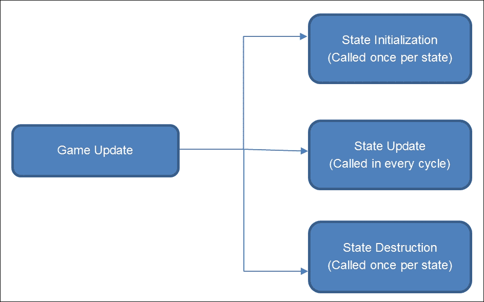
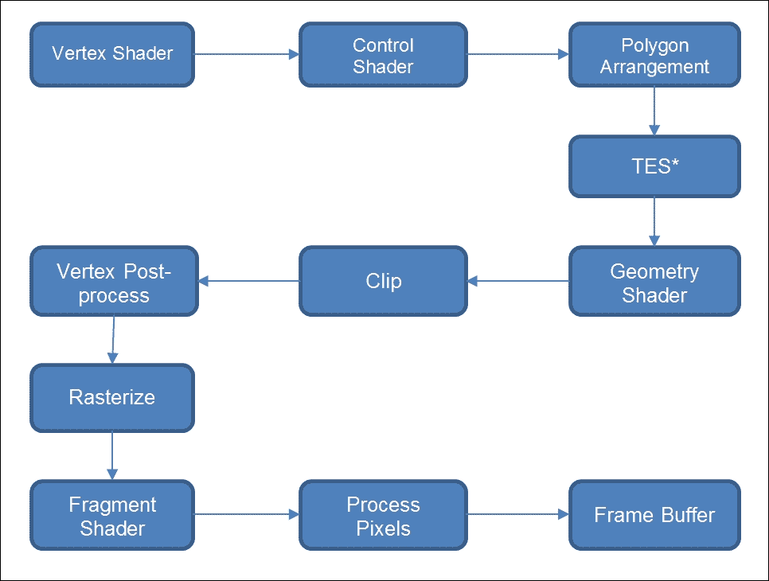
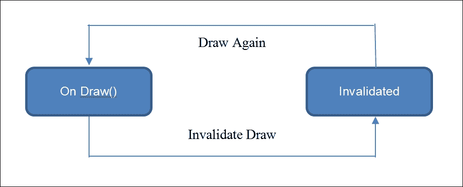
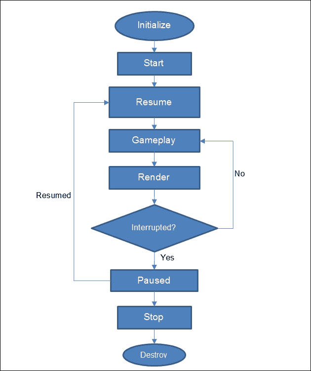

# 第五章：了解游戏循环和帧率

游戏循环是游戏的运行主体，帧率是其结果。没有定义游戏循环，游戏就无法制作；没有测量帧率，性能就无法判断。

游戏开发的这两个方面在任何游戏开发项目中都是通用的。然而，游戏循环的可伸缩性和性质在不同设备上有所不同，不同平台上可能有不同的帧率测量标准。

对于原生开发，游戏循环由开发人员自行创建和维护。然而，在大多数游戏引擎中，循环已经定义了所有必要的控制和范围。

我们将通过以下主题详细了解游戏开发中最重要的这两个部分：

+   游戏循环介绍

+   使用 Android SDK 创建示例游戏循环

+   游戏生命周期

+   游戏更新和用户界面

+   中断处理

+   游戏状态机的一般概念

+   FPS 系统

+   硬件依赖

+   性能和内存之间的平衡

+   控制 FPS

# 游戏循环介绍

游戏循环是核心循环，依次执行用户输入、游戏更新和渲染。这个循环理想情况下每帧运行一次。因此，游戏循环是运行帧率控制游戏最重要的部分。

典型的游戏循环有三个步骤：

1.  用户输入

1.  游戏更新

1.  渲染！游戏循环介绍

简单的游戏循环

## 用户输入

本节检查游戏的 UI 系统是否接收到了外部输入。它设置了游戏在下一次更新时需要进行的更改。在不同的硬件平台上，游戏循环的这部分变化最大。为不同的输入类型创建通用功能是一种最佳实践，以确保标准化。

输入系统不被视为游戏循环的一部分；然而，用户输入检测是游戏循环的一部分。该系统不断监视输入系统，无论是否发生事件。

当活动游戏循环运行时，用户可以在游戏过程中的任何时间触发任何事件。通常，输入系统维护着队列。每个队列代表不同类型的可能输入事件，如触摸、按键、传感器读数等。

用户输入监视器按照循环顺序在特定间隔内检查这些队列。如果在队列中发现任何事件，它会进行必要的更改，这将影响游戏循环中下一次更新的调用：



用户输入工作原理

## 游戏更新

游戏循环的游戏更新部分管理和维护完整的游戏状态。该部分还负责运行游戏逻辑、游戏状态的更改、加载/卸载资源以及设置渲染管线。

游戏控制通常由游戏更新部分管理。通常，主游戏管理器在游戏更新部分的顶层工作。我们在前一节讨论了游戏程序结构。

任何游戏一次只能运行一个特定状态。状态可以通过用户输入或任何自动化的 AI 算法进行更新。所有 AI 算法都是逐帧地在游戏更新周期上运行的。

## 状态更新

如前所述，状态可以从游戏更新中进行更新。状态也是由游戏更新初始化和销毁的。初始化和销毁每个状态只发生一次，状态更新可以在每个游戏周期中调用一次。



状态更新调用流程

## 渲染帧

游戏循环中的渲染部分负责设置渲染管线。在游戏循环的这一部分中不会运行任何更新或 AI 算法。

曾经有一段时间，开发者对渲染管线有完全控制。开发者可以操纵并设置每一个顶点。现代游戏开发系统与这种渲染系统没有太多关系。图形库负责渲染系统的所有控制。然而，在非常高的层面上，开发者只能设置渲染顶点的顺序和数量。

在帧速率控制方面，渲染是最重要的角色之一，保持其他连续进程的稳定性。从处理的角度来看，显示和内存操作需要最长的执行时间。

典型的 Android 图形渲染遵循 OpenGL 管线：



# 使用 Android SDK 创建一个示例游戏循环

Android SDK 开发从一个活动开始，游戏在单个或多个视图上运行。大多数情况下，考虑使用单个视图来运行游戏。

不幸的是，Android SDK 没有提供预定义的游戏循环。然而，循环可以以许多种方式创建，但基本机制保持不变。

在 Android SDK 库中，`View`类包含一个抽象方法`OnDraw()`，其中每个可能的渲染调用都排队等候。这个方法在绘图发生任何改变时被调用，这会使之前的渲染管线无效。

逻辑如下：



让我们来看一个使用 Android `View`创建的基本游戏循环。在这里，一个自定义视图是从 Android `View`扩展而来的：

```kt
/*Sample Loop created within OnDraw()on Canvas 
* This loop works with 2D android game development
*/
@Override
public void onDraw(Canvas canvas)
{
  //If the game loop is active then only update and render
  if(gameRunning)
  {
    //update game state
    MainGameUpdate();

    //set rendering pipeline for updated game state
    RenderFrame(canvas);
    //Invalidate previous frame, so that updated pipeline can be
    // rendered
    //Calling invalidate() causes recall of onDraw()
    invalidate();
  }
  else
  {
    //If there is no active game loop
    //Exit the game
    System.exit(0);
  }
}
```

在当前的 Android 游戏开发时代，开发者使用`SurfaceView`而不是`View`。`SurfaceView`继承自`View`，并且更适用于使用 Canvas 制作的游戏。在这种情况下，一个定制视图是从`SurfaceView`扩展并实现`SurfaceHolder.Callback`接口。在这种情况下，重写了三种方法：

```kt
/* Called When a surface is changed */
@Override
public void surfaceChanged(SurfaceHolder holder, int format, int width, int height)
{
}
/* Called on create of a SurfaceView */
@Override
public void surfaceCreated(SurfaceHolder holder)
{
}
/* Called on destroy of a SurfaceView is destroyed */
@Override
public void surfaceDestroyed(SurfaceHolder holder)
{
}
```

在开发游戏时，开发者不需要每次更改表面。这就是`surfaceChanged`方法应该有一个空体来作为基本游戏循环的原因。

我们需要创建一个定制的游戏线程并重写`run()`方法：

```kt
public class BaseGameThread extends Thread
{
  private boolean isGameRunning;
  private SurfaceHolder currentHolder;
  private MyGameState currentState;
  public void activateGameThread(SurfaceHolder holder, MyGameState state)
  {
    currentState = state;
    isGameRunning = true;
    currentHolder = holder;
    this.start();
  }

  @Override
  public void run()
  {
    Canvas gameCanvas = null;
    while(isGameRunning)
    {
      //clear canvas
      gameCanvas = null;
      try
      {
        //locking the canvas for screen pixel editing
        gameCanvas  = currentHolder.lockCanvas();
        //Update game state
        currentState.update();
        //render game state
        currentState.render(gameCanvas);
      }
      catch(Exception e)
      {
        //Update game state without rendering (Optional)
        currentState.update();
      }
    }
  }
}
```

现在，我们准备从定制的`SurfaceView`类开始新创建的游戏循环：

```kt
public myGameCanvas extends SurfaceView implements SurfaceHolder
{
  //Declare thread
  private BaseGameThread gameThread;
  private MyGameState gameState;
  @Override
  public void surfaceCreated(SurfaceHolder holder)
  {
    //Initialize game state
    gameState = new MyGameState();
    //Instantiate game thread
    gameThread = new BaseGameThread();
    //Start game thread
    gameThread. activateGameThread(this.getHolder(),gameState);
  }

  @Override
  public void surfaceChanged(SurfaceHolder holder, int format, int width, int height)
  {
  }

  @Override
  public void surfaceDestroyed(SurfaceHolder holder)
{
}
}
```

实现游戏循环可以有很多方法。然而，基本方法遵循这里提到的两种方式之一。一些开发者更喜欢在游戏视图内部实现游戏线程。处理输入是游戏循环的另一个重要部分。我们将在本章后面讨论这个话题。

游戏循环的另一个部分是**每秒帧数**（**FPS**）管理。最常见的机制之一是使用`Thread.sleep()`来计算循环以固定速率执行的时间。一些开发者创建了两种更新机制：一种基于 FPS，另一种基于每帧无延迟。

大多数基于物理的游戏需要一个更新机制，以便在所有设备上以统一的实时间隔运行。

对于小规模开发，行业中有一些开发者采用第一种方法，但不遵循典型的循环。这种系统根据所需的动作使当前绘制无效。在这种情况下，游戏循环不依赖于固定的 FPS。

# 游戏生命周期

Android 游戏生命周期几乎与任何其他应用程序的生命周期相似，除了游戏循环机制。大多数情况下，应用程序状态会随着外部干扰而改变。状态也可以通过其他方式进行操作，游戏具有能够干扰主游戏循环的算法或人工智能。

Android 游戏是通过活动初始化的。`onCreate()`方法用于初始化。然后，游戏线程启动并进入游戏循环。游戏循环可以被外部中断打断。

在游戏开发中，始终要保存当前游戏状态并正确暂停循环和线程。在恢复游戏时，应该很容易返回到上一个状态。

# 游戏更新和用户界面

我们已经在之前涵盖了一些更新和接口机制。运行中的游戏状态可以通过用户输入或内部 AI 算法来改变：



大多数情况下，游戏更新每帧调用一次，或者在固定时间间隔后调用一次。无论哪种方式，算法都会改变游戏状态。您已经了解了用户输入队列。在每个游戏循环周期中，都会检查输入队列。

例如，具有触摸界面的移动游戏循环的工作方式如下：

```kt
/* import proper view and implement touch listener */
public class MyGameView extends View implements View.OnTouchListener
/* declare game state */
private MyGameState gameState;
/* set listener */
public MyGameView (Context context)
{
  super(context);
  setOnTouchListener(this);
  setFocusableInTouchMode(true);
  gameState = new MyGameState();
}

/* override onTouch() and call state update on individual touch events */
@Override
public boolean onTouch(View v, MotionEvent event) 
{
  if(event.getAction() == MotionEvent.ACTION_UP)
  {
    //call changes in current state on touch release
    gameState.handleInputTouchRelease((int)event.getX(), (int)event.getY());
    return false;
  }
  else if(event.getAction() == MotionEvent.ACTION_DOWN)
  {
    //call changes in current state on touch begin
    gameState.handleInputTouchEngage((int)event.getX(), (int)event.getY());
  }
  else if(event.getAction() == MotionEvent.ACTION_MOVE)
  {
    //call changes in current state on touch drag
    gameState.handleInputTouchDrag((int)event.getX(), (int)event.getY());
  }
  return true;
}
```

现在，让我们以相同的方式来看待输入队列系统：

```kt
Point touchBegin = null;
Point touchDragged = null;
Point touchEnd = null;

@Override
public boolean onTouch(View v, MotionEvent event)
{
  if(event.getAction() == MotionEvent.ACTION_UP)
  {
    touchEnd = new Point(int)event.getX(), (int)event.getY());
    return false;
  }
  else if(event.getAction() == MotionEvent.ACTION_DOWN)
  {
    touchBegin = new Point(int)event.getX(), (int)event.getY());

  }
  else if(event.getAction() == MotionEvent.ACTION_MOVE)
  {
    touchDragged = new Point(int)event.getX(), (int)event.getY());

  }
  return true;
}

/* declare checking input mechanism */
private void checkUserInput() 
{
  if(touchBegin != null)
  {
    //call changes in current state on touch begin
    gameState. handleInputTouchEngage (touchBegin);
    touchBegin = null;
  }

  if(touchDragged != null)
  {
    //call changes in current state on touch drag
    gameState. handleInputTouchDrag (touchDragged);
    touchDragged = null;
  }

  if(touchEnd != null)
{
    //call changes in current state on touch release  
    gameState.handleInputTouchRelease (touchEnd);
    touchEnd = null;
  }
}

/* finally we need to invoke checking inside game loop */
@Override
public void onDraw(Canvas canvas)
{
  //If the game loop is active then only update and render
  if(gameRunning)
  {
    //check user input
    checkUserInput();
    //update game state
    MainGameUpdate();

    //set rendering pipeline for updated game state
    RenderFrame(canvas);
    //Invalidate previous frame, so that updated pipeline can be
    // rendered
    //Calling invalidate() causes recall of onDraw()
    invalidate();
  }
  else
  {
    //If there is no active game loop
    //Exit the game
    System.exit(0);
  }
}
```

相同的过程也可以用于`SurfaceView`游戏循环方法。

# 中断处理

游戏循环是一个持续的过程。每当发生中断时，有必要暂停每个运行的线程并保存游戏的当前状态，以确保它能够正确恢复。

在 Android 中，任何中断都会触发`onPause()`：

```kt
@Override
protected void onPause() 
{
  super.onPause();
  // pause and save game loop here
}
// When control is given back to application, then onResume() is // called.
@Override
protected void onResume() 
{
  super.onResume();
  //resume the game loop here
}
```

现在，我们需要更改实际运行游戏循环的类。

首先，声明一个布尔值来指示游戏是否暂停。然后，在游戏循环中进行检查。之后，创建一个处理这个变量的静态方法：

```kt
private static boolean gamePaused = false;
@Override
public void onDraw(Canvas canvas)
{
  if(gameRunning && ! gamePaused)
  {
    MainGameUpdate();
    RenderFrame(canvas);

    invalidate();
  }
  else if(! gamePaused)
  {
    //If there is no active game loop
    //Exit the game
    System.exit(0);
  }
}

public static void enableGameLoop(boolean enable)
{
  gamePaused = enable;
  if(!gamePaused)
  {
    //invalidation of previous draw has to be called from static
    // instance of current View class
    this.invalidate();
  }
  else
  {
    //save state
  }
}
```

# 游戏状态机的一般概念

游戏状态机在游戏循环的更新周期内运行。游戏状态机是将所有游戏状态绑定在一起的机制。在旧的技术中，这是典型的线性控制流。然而，在现代开发过程中，它可以是在多个线程中并行运行的控制流。在游戏开发的旧架构中，鼓励只有一个游戏线程。开发人员过去会避免并行处理，因为它容易受到游戏循环和定时器管理的影响。然而，即使在现代开发中，许多开发人员仍然在可能的情况下更喜欢使用单个线程进行游戏开发。借助各种工具和高级脚本语言的帮助，大多数游戏开发人员现在都使用虚拟并行处理系统。

简单游戏状态机的一个过程是创建一个公共状态接口，并为每个游戏状态重写它。这样，在游戏循环内管理状态就变得容易了。

让我们看一个简单的游戏状态机管理器的循环。该管理器应该执行四个主要功能：

+   创建状态

+   更新状态

+   渲染状态

+   改变状态

示例实现可能如下所示：

```kt
public class MainStateManager
{
  private int currentStateId;
  //setting up state IDs
  public Interface GameStates
  {
    public static final int STATE_1 = 0;
    public static final int STATE_2 = 1;
    public static final int STATE_3 = 2;
    public static final int STATE_4 = 3; 
  }

  private void initializeState(int stateId)
  {
    currentStateId = stateId;
    switch(currentStateId)
    {
      case STATE_1:
        // initialize/load state 1
      break;
      case STATE_2:
        // initialize/load state 2
      break;
      case STATE_3:
        // initialize/load state 3
      break;
      case STATE_4:
        // initialize/load state 4
      break;
    }
  }
}
/*
* update is called in every cycle of game loop.
* make sure that the state is already initialized before updating the state
*/
private void updateState()
{
  switch(currentStateId)
  {
    case STATE_1:
      // Update state 1
    break;
    case STATE_2:
      // Update state 2
    break;
    case STATE_3:
      // Update state 3
    break;
    case STATE_4:
      // Update state 4
    break;
  }
}
/*
* render is called in every cycle of game loop.
* make sure that the state is already initialized before updating the state
*/
private void renderState()
{
  switch(currentStateId)
  {
    case STATE_1:
      // Render state 1
    break;
    case STATE_2:
      // Render state 2
    break;
    case STATE_3:
      // Render state 3
    break;
    case STATE_4:
      // Render state 4
    break;
  }
}
/*
* Change state can be triggered from outside of manager or from any other state
* This should be responsible for destroying previous state and free memory and initialize new state
*/
public void changeState(int nextState)
{
  switch(currentStateId)
  {
    case STATE_1:
      // Destroy state 1
    break;
    case STATE_2:
      // Destroy state 2
    break;
    case STATE_3:
      // Destroy state 3
    break;
    case STATE_4:
      // Destroy state 4
    break;
  }
  initializeState(nextState);
}
}
```

在某些情况下，开发人员还会通过状态管理器将输入信号传递到特定状态。

# FPS 系统

在游戏开发和游戏行业中，FPS 非常重要。游戏质量的衡量取决于 FPS 计数。简单来说，游戏的 FPS 越高，越好。游戏的 FPS 取决于指令和渲染的处理时间。

执行游戏循环需要一些时间。让我们看一下游戏循环内 FPS 管理的示例实现：

```kt
long startTime;
long endTime;
public final int TARGET_FPS = 60;

@Override
public void onDraw(Canvas canvas)
{
  if(isRunning)
  {
    startTime = System.currentTimeMillis();
    //update and paint in game cycle
    MainGameUpdate();

    //set rendering pipeline for updated game state
    RenderFrame(canvas);

    endTime = System.currentTimeMillis();
    long delta = endTime - startTime;
    long interval = (1000 - delta)/TARGET_FPS;

    try
    {
      Thread.sleep(interval);
    }
    catch(Exception ex)
    {}
    invalidate();
  }
}
```

在上面的示例中，我们首先记录了循环执行之前的时间（`startTime`），然后记录了循环执行之后的时间（`endTime`）。然后我们计算了执行所需的时间（`delta`）。我们已经知道应该花费多少时间（`interval`）来保持最大帧率。因此，在剩余的时间里，我们让游戏线程在再次执行之前进入休眠状态。这也可以应用于不同的游戏循环系统。

在使用`SurfaceView`时，我们可以在`run()`方法中的游戏循环内声明 FPS 系统：

```kt
long startTime;
long endTime;
public final int TARGET_FPS = 60;
@Override
public void run()
{
  Canvas gameCanvas = null;
  while(isGameRunning)
  {
    startTime = System.currentTimeMillis();
    //clear canvas
    gameCanvas = null;
    try
    {
      //locking the canvas for screen pixel editing
      gameCanvas  = currentHolder.lockCanvas();
      //Update game state
      currentState.update();
      //render game state
      currentState.render(gameCanvas);
      endTime = System.currentTimeMillis();
      long delta = endTime - startTime;
      long interval = (1000 - delta)/TARGET_FPS;

      try
      {
        Thread.sleep(interval);
      }
      catch(Exception ex) 
      {}
    }
    Catch(Exception e)
    {
      //Update game state without rendering (Optional)
      currentState.update();
    }
  }
}
```

在这个过程中，我们限制了 FPS 计数，并尝试在预定义的 FPS 上执行游戏循环。这个系统的一个主要缺点是这种机制在很大程度上取决于硬件配置。对于无法在预定义的 FPS 上运行循环的慢硬件系统，这个系统没有效果。这是因为间隔时间大多为零或小于零，因此没有每帧周期。

# 硬件依赖

我们之前讨论过硬件配置在 FPS 系统中起着重要作用。如果硬件无法以特定频率运行一组指令，那么任何开发人员都无法在目标 FPS 上运行游戏。

让我们列出游戏中占用大部分处理时间的任务：

+   显示或渲染

+   内存加载/卸载操作

+   逻辑操作

## 显示或渲染

显示处理主要取决于图形处理器和需要显示的内容。当涉及与硬件的交互时，处理变慢。使用着色器操作和映射渲染每个像素都需要时间。

曾经有时候以 12 帧的帧率运行游戏是困难的。然而，在现代世界，一个出色的显示质量游戏需要以 60 帧的帧率运行。这只是硬件质量的问题。

大屏幕需要大量的缓存内存。例如，硬件具有大而密集的显示屏，但缓存内存较少，无法保持良好的显示质量。

## 内存加载/卸载操作

内存是系统的硬件组件。再次强调，与内存组件交互需要更多时间。从开发人员的角度来看，当我们分配内存、释放内存和进行读写操作时，需要时间。

从游戏开发的角度来看，有四种类型的内存最重要：

+   堆内存

+   堆栈内存

+   寄存器内存

+   只读存储器（ROM）

### 堆内存

堆内存是用户手动管理的内存。这个内存必须手动分配和手动释放。在 Android 的情况下，垃圾收集器负责释放被标记为非引用的内存。这个内存位置是随机存取内存类别中最慢的。

### 堆栈内存

这段内存用于在方法内声明的元素。程序解释器会自动分配和释放这个内存段。这个内存段仅适用于本地成员。

### 寄存器内存

寄存器内存是最快的。寄存器内存用于存储当前进程和频繁使用的数据。在寄存器内存更好和更快的设备上，游戏开发人员可以实现更高的帧率。

### 只读存储器（ROM）

只读存储器（ROM）是永久存储器。特别是在游戏开发中，大量的资源存储在 ROM 中。在加载/卸载这些资源时需要最长的时间。程序需要从 ROM 中将必要的数据加载到 RAM 中。因此，拥有更快的 ROM 有助于在加载/卸载操作期间获得更好的 FPS。

## 逻辑操作

开发人员应该以最有效的方式定义指令，以便利用硬件。从技术角度来看，每条指令以二进制指令形式进入堆栈。处理器在一个时钟周期内执行一条指令。

例如，让我们看一个构造不好的逻辑指令：

```kt
char[] name = "my name is android";
for(int i = 0; i < name.length; i ++)
{
  //some operation
}
```

每次调用`length`并使用后增量运算符都会增加处理器的指令，最终增加执行时间。现在，看看这段代码：

```kt
char[] name = "my name is android";
int length = name.length;
for(int i = 0; i < length; ++ i)
{
  //some operation
}
```

这段代码执行了相同的任务；然而，在这种方法中，处理开销大大减少了。这段代码所做的唯一妥协是阻塞了一个整数变量的内存，并保存了与`length`相关的许多嵌套任务。

时钟速度更快的处理器可以更快地执行任务，这直接意味着更好的 FPS。然而，任务量的管理取决于开发人员，就像前面的例子所示。

每个处理器都有一个数学处理单元。处理器的性能因处理器而异。因此，开发人员总是需要检查数学表达式，以了解它是否可以简化。

# 性能和内存之间的平衡

正如您之前学到的，内存操作需要很长时间。然而，开发人员总是有限的内存。因此，在性能和内存之间保持平衡是非常必要的。

从 ROM 加载或卸载任何资产到 RAM 都需要时间，因此建议您不要为依赖 FPS 的游戏执行此类操作。这种操作会显著影响 FPS。

假设一个游戏在运行一个游戏状态时需要大量资产，而目标设备可用的堆有限。在这种情况下，开发人员应该对资产进行分组。只有在必要的情况下，才能在运行状态的游戏中加载小资产。

有时，许多开发人员预加载所有资产并从缓存中使用。这种方法使游戏玩起来更加流畅和快速。然而，如果在不需要的特定游戏状态下加载缓存中的资产，可能会在发生中断时导致游戏崩溃。Android 操作系统完全有权清除不活动或最小化应用程序所占用的内存。当发生中断时，游戏进入最小化状态。如果新应用程序需要内存而没有空闲内存可用，那么 Android 操作系统会终止不活动的应用程序并为新应用程序释放内存。

因此，根据游戏状态，将资产集分成部分总是一个很好的做法。

# 控制 FPS

我们已经看到了一些定义 FPS 系统的方法。我们也已经讨论了该系统的主要缺点。因此，我们可以根据当前游戏循环周期中生成的实时 FPS 来操纵游戏循环：

```kt
long startTime;
long endTime;
public static in ACTUAL_FPS = 0;

@Override
public void onDraw(Canvas canvas)
{
  if(isRunning)
  {
    startTime = System.currentTimeMillis();
    //update and paint in game cycle
    MainGameUpdate();

    //set rendering pipeline for updated game state
    RenderFrame(canvas);

    endTime = System.currentTimeMillis();
    long delta = endTime - startTime;
    ACTUAL_FPS = 1000 / delta;
    invalidate();
  }
}
```

现在，让我们来看一下混合 FPS 系统，我们将最大 FPS 限制为 60。否则，游戏可能会通过实际 FPS 进行操纵：

```kt
long startTime;
long endTime;
public final int TARGET_FPS = 60;
public static int ACTUAL_FPS = 0;

@Override
public void onDraw(Canvas canvas)
{
  if(isRunning)
  {
    startTime = System.currentTimeMillis();
    //update and paint in game cycle
    MainGameUpdate();

    //set rendering pipeline for updated game state
    RenderFrame(canvas);

    endTime = System.currentTimeMillis();
    long delta = endTime - startTime;

    //hybrid system begins
    if(delta < 1000)
    {
      long interval = (1000 - delta)/TARGET_FPS;
      ACTUAL_FPS = TARGET_FPS;
      try
      {
        Thread.sleep(interval);
      }
      catch(Exception ex) 
      {}
    }
    else
    {
      ACTUAL_FPS = 1000 / delta;
    }
    invalidate();
  }
}
```

# 总结

游戏循环主要是游戏开发的逻辑方法。在许多情况下，开发人员不选择这种机制。有些游戏可能是典型的互动游戏，没有连续运行的算法。在这种情况下，可能不需要游戏循环。游戏状态可以根据输入更新到游戏系统。

然而，例外不能成为例证。这就是为什么遵循游戏循环以保持开发标准是一种工业方法，而不管游戏设计如何。

您在这里了解了游戏循环和游戏状态管理。开发人员可以自由地以不同的方式发明和执行游戏循环。许多游戏引擎具有不同的控制游戏循环和管理游戏状态的方式。游戏循环和状态管理的理念和概念可能会根据游戏需求而改变。

然而，开发人员应始终牢记，他们使用的技术不应影响游戏性能和 FPS。此外，开发人员需要保持代码的可读性和灵活性。某些方法可能会消耗更多内存并运行得更快，反之亦然。Android 具有各种硬件配置，因此可能不是所有硬件上都具有相同的处理和内存支持。最终，在内存和性能之间取得平衡是创造更好游戏的关键。

我们将在后面的章节中深入研究性能和内存管理。我们将尝试从不同的角度来看待游戏开发的这些部分，比如 2D/3D 游戏、VR 游戏、优化技术等。
