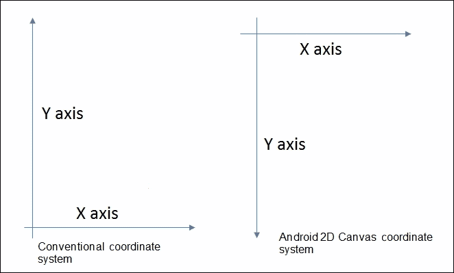
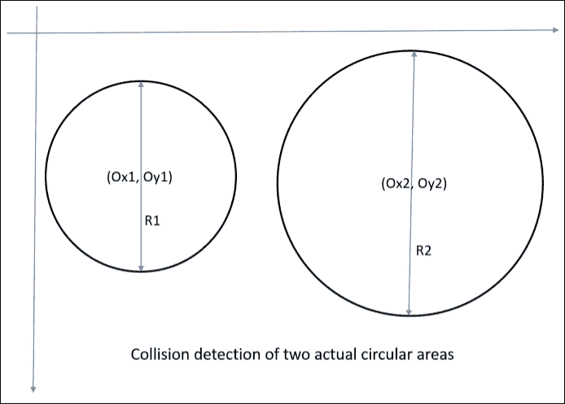
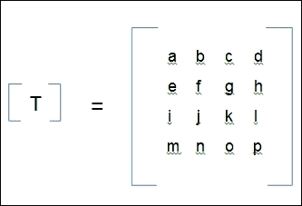
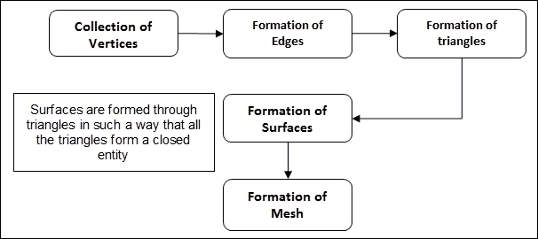
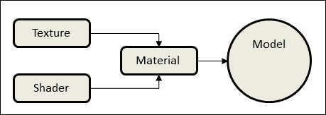
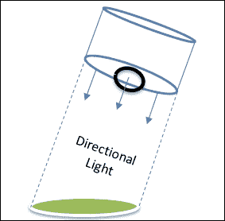
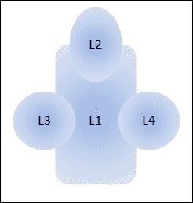
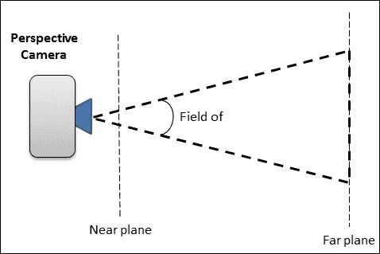
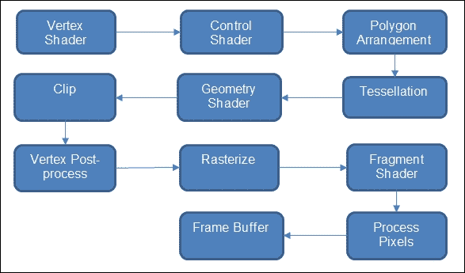

# 第六章：提高 2D/3D 游戏性能

曾几何时，移动平台上的游戏局限于黑白像素游戏，其他游戏媒介也严重依赖像素图形。现在时代已经改变。3D 游戏在手持设备上轻松运行。然而，对 2D 资产的需求尚未改变。即使在 hardcore 3D 游戏中，2D 资产也是必需的。很少有游戏是完全 2D 的。

我们将在以下主题的帮助下讨论 2D 和 3D 游戏的性能：

+   2D 游戏开发的限制

+   3D 游戏开发的限制

+   Android 的渲染管道

+   通过 OpenGL 渲染

+   优化 2D 资产

+   优化 3D 资产

+   常见的游戏开发错误

+   2D/3D 性能比较

# 2D 游戏开发的限制

从 2D 游戏开发的角度来看，主要的限制如下：

+   2D 艺术资产

+   2D 渲染系统

+   2D 映射

+   2D 物理

## 2D 艺术资产

艺术资产的限制主要限于图形或视觉资产，包括图像、精灵和字体。不难理解，较大的资产将比较小的资产需要更多的时间来处理和渲染，从而导致性能质量较低。

### 一组 2D 艺术资产

在 Android 游戏开发中，不可能通过一组资产提供最大的显示质量。这是大多数 Android 游戏开发人员选择高分辨率资产作为基础构建的原因。这通常对高配置硬件平台表现良好，但在低配置设备上无法提供良好的性能。许多开发人员选择为多分辨率硬件平台进行移植的选项。这再次需要时间来完成项目。

### 多分辨率使用相同的资产集

许多时候，开发人员选择忽略一组硬件平台。在移动游戏行业中，选择更高分辨率的艺术资产并将其缩小适应较低分辨率设备是一种常见做法。如今，大多数硬件平台都有更好的 RAM。因此，这个过程对开发人员来说变得更加方便。

### 屏幕上绘制的资产数量

游戏性能并不总是取决于资产大小；它还取决于屏幕上绘制的资产数量。精灵表的概念已经发展，以减少屏幕上绘制元素的数量。

通常，系统会为单个艺术资产发出绘制指令。随着资产数量的增加，需要更多这样的绘制指令才能在每个游戏循环周期内完成渲染。显然，这个过程会减慢处理器的速度，游戏性能变差。

精灵表可以包含单个图像中的多个资产。因此，只需要一个绘制指令就可以渲染精灵的所有资产。然而，精灵表的物理大小是受限制的。不同硬件平台的设备的最大尺寸各不相同。最方便的是，1024x1024 的精灵是目前几乎所有可用设备支持的最安全选项。

### 使用字体文件

几乎每个游戏都使用除了 Android 默认系统字体之外的自定义或特殊字体。在这些情况下，字体源文件必须包含在游戏构建中。有多种使用不同字体的方法。我们将在这里讨论其中三种：

+   精灵字体

+   位图字体

+   TrueType 字体

#### 精灵字体

这是一种典型的老派技术，但在某些情况下仍然有效。开发人员创建一个包含所有必要字符的精灵表。所有字符都在数据文件中映射。这种映射用于裁剪每个字符并相应地形成单词。

这种字体的一些优点包括：

+   开发人员完全控制映射

+   字符风格可以根据需求定制

+   可以实现快速处理速度；但这将取决于开发效率

这种字体的一些缺点包括：

+   它们增加了开发开销

+   系统效率完全取决于开发人员的技能

+   在多语言支持的情况下很难映射字符

+   任何更改都需要大量迭代才能达到完美

这种样式现在通常不再使用，因为我们有许多设计师和时尚字体可用。

#### 位图字体

位图字体系统是从精灵字体继承而来的。它更新了预定义的映射样式和支持开发过程的库。它还使用一个或多个精灵表和一个数据文件。位图字体的工作原理与精灵字体相同。有很多工具可以直接从 TrueType 字体创建这样的字体，并进行一些样式化。

这种字体的一些优点包括：

+   它与任何现有的代码库兼容，无论渲染框架是 OpenGL、DirectX、Direct Draw 还是 GDI+

+   易于集成

+   它可以操纵现有 TrueType 字体的样式

这种字体的一些缺点包括：

+   精灵字体的相同缺点在这里也适用，只是开发开销更小

+   放大位图字体会导致模糊的输出

#### TrueType 字体

这是大多数平台支持的通用字体格式，包括 Android。这是在游戏中集成各种字体的最快速的方法。

这种字体的一些优点包括：

+   通用字体样式

+   最大的平台支持

+   易于多语言实现

+   这是一种矢量字体，所以它没有缩放问题

+   易于获得特殊字符

这种字体的一些缺点包括：

+   使用这种字体样式可能会使游戏多花费几千字节

+   并非所有脚本语言都受 TTF 支持

## 2D 渲染系统

Android 提供了通过 API 框架将 2D 资产渲染到画布的范围。画布可以与`View`或`SurfaceView`中的`Drawable`对象一起使用。

画布充当实际绘图表面的接口，所有的图形对象都可以在其上绘制。在`onDraw()`回调方法中绘制画布上的图形对象。开发人员只需指定图形对象及其在画布上的位置。

画布本身具有一组默认的绘图方法，可以渲染几乎每种类型的图形对象。以下是一些例子：

+   `drawBitmap()`方法用于以位图格式绘制图像对象。但是，图像不需要以位图格式。

+   `drawRect()`和`drawLine()`方法用于在画布上绘制原始形状。

+   `drawText()`方法可用于使用特定字体样式在画布上渲染文本。

画布可以在 Android 架构中的视图中使用。

## 2D 映射

2D 映射基于简单的 2D 坐标系。唯一的区别是与传统坐标系相比相反的*y*轴：



在 Android 2D 中，原点位于画布的左上角。所有的几何计算都是基于这种映射的。然而，它对性能没有直接影响，就像基于 2D 画布的应用程序一样。许多开发人员习惯于根据传统系统映射他们的图形资产，并颠倒垂直轴以在画布上渲染它。这需要一些额外的计算。

关于 2D 渲染系统还有一个性能约束。全球通用的开发方法是拥有一组最小的图形资产，并尽可能多地使用它们。经常会导致同一像素多次渲染。这会影响处理速度，从而影响 FPS。

例如，位图**A**、位图**B**、位图**C**和位图**D**以一种使**A**、**B**和**C**重叠在一起，而**D**保持独立的方式在画布上呈现。以下情况发生：

+   在只绘制一个位图的区域**R0**中的像素将被渲染一次

+   在两个位图重叠的区域**R1**中的像素将被渲染两次

+   在区域**R2**中，三个位图重叠的像素将被渲染三次

这在这里显示：


现在，在区域**R1**和**R2**，所有像素都被渲染多次。在这个系统中，像素数据信息将附加到先前的数据上，导致最终像素值。在这个系统中，处理开销增加。因此，性能下降。

即使在今天，这仍然是 2D 游戏编程的常见做法。原因如下：

+   透明度混合

+   模块化图形资源

+   低构建大小

+   通过叠加多个资源轻松构建屏幕

有时，可能会出现设备的图形处理器性能非常低，多次渲染同一个像素对性能有很大影响。在这种情况下，双缓冲机制会有很大帮助。

双缓冲系统是指创建一个缓冲的可显示资源，使用图形资源创建显示屏，然后只在屏幕上绘制一次这个缓冲对象。它可以防止以下问题：

+   屏幕闪烁

+   一个像素的多次绘制

+   资源的撕裂

## 2D 物理

2D 物理只考虑*x-y*平面上的所有计算。市场上有很多 2D 物理引擎可用。**Box2D**是最流行的一个。物理引擎包括实时物理的每一个机制和计算。

实时物理计算比游戏所需的要复杂得多。让我们讨论一下一些可用的物理引擎。

### Box2D

Box2D 是一个基于 C++的开源物理引擎。它包括几乎可以用于各种游戏的固体物理的每一个方面。它的一些值得一提的特性如下：

+   刚体的动态碰撞检测

+   碰撞状态回调，如碰撞进入、退出、停留等

+   多边形碰撞

+   垂直、水平和抛射运动

+   摩擦物理

+   扭矩和动量物理

+   基于枢轴点和关节的重力效应

### LiquidFun

LiquidFun 是一个液体物理的物理引擎。这个引擎实际上是基于 Box2D 的。谷歌发布了这个开源物理引擎来覆盖液体物理的公式和机制。LiquidFun 可以用于 Android、iOS、Windows 和其他一些流行的平台。LiquidFun 支持 Box2D 的每一个特性，以及液体粒子物理。这包括以下内容：

+   波浪模拟

+   液体下落和粒子模拟

+   液体搅拌模拟

+   固体和液体动态碰撞

+   液体混合

### 对游戏性能的影响

碰撞检测是一个昂贵的过程。多边缘和多边形碰撞会增加处理开销。刚体和碰撞表面的数量对性能有最大的影响。这就是为什么液体物理比固体物理慢的原因。

让我们来看一下主要影响：

+   任何刚体的每次变换都需要刷新整个系统的碰撞检查

+   物理引擎负责重复的变换，这导致了繁重的过程

物理引擎计算刚体上的每一个可能的力。并不是所有的游戏都需要进行每一项计算。游戏开发并不总是需要实时实现物理。然而，游戏需要实时可视化。

## 2D 碰撞检测

大多数游戏使用盒子碰撞系统来检测大多数碰撞。矩形碰撞检测是最便宜的方法，可以在游戏内用于检测碰撞。

有时，三角形和圆形碰撞检测也用于 2D 游戏以提高碰撞检测的准确性。需要在使用这些方法之间取得平衡。

例如，如果我们需要检测两个圆之间的碰撞，我们可以选择以下任何一个系统：

+   将每个圆视为矩形并检测它们之间的碰撞

+   将一个圆视为矩形，并检测圆和矩形之间的碰撞

+   应用实际的圆形碰撞检测方法

让我们考虑两个圆，它们的原点分别是*O1*和*O2*，直径分别是*R1*和*R2*：

*O1*位于*(Ox1, Oy1)*

*O2*位于*(Ox2, Oy2)*

### 矩形碰撞

如果我们想象圆在 2D 画布上是矩形，那么它会是这样的：


矩形碰撞检测指的是这个公式。

输入反馈将如下：

*xMin1 = x1*（第一个矩形在*x*轴上的最小坐标）

*yMin1 = y1*（第一个矩形在*y*轴上的最小坐标）

*xMax1 = x1m*（第一个矩形在*x*轴上的最大坐标）

*yMax1 = y1m*（第一个矩形在*y*轴上的最大坐标）

*xMin2 = x2*（第二个矩形在*x*轴上的最小坐标）

*yMin2 = y2*（第二个矩形在*y*轴上的最小坐标）

*xMax2 = x2m*（第二个矩形在*x*轴上的最大坐标）

*yMax2 = y2m*（第二个矩形在*y*轴上的最大坐标）

在给定的情况下，我们将有以下情况：

*x1 = Ox1 – (R1 / 2)*

*y1 = Oy1 – (R1 / 2)*

*x1m = Ox1 + (R1 / 2) = x1 + R1*

*y1m = Oy1 + (R1 / 2) = y1 + R1*

*x2 = Ox2 – (R2 / 2)*

*y2 = Oy2 – (R2 / 2)*

*x2m = Ox2 + (R2 / 2) = x2 + R2*

*y2m = Oy2 + (R2 / 2) = y2 + R2*

这两个矩形是否碰撞的条件如下：

```kt
if( x1m < x2 )
{
  // Not Collide
}
else if( y1m < y2 )
{
  // Not collide
}
else if( x1 > x2m )
{
  //Not collide
}
else if( y1 > y2m )
{
  //Not collide
}
else
{
  //Successfully collide 
}
```

### 矩形和圆的碰撞

现在，只考虑第二个圆作为矩形，我们会得到这样：


由于我们已经讨论了相同系统的坐标系的一般概念，我们可以直接推导出数值：

*Px1 = Ox2 – (R2 / 2)*

*Py1 = Oy2 – (R2 / 2)*

*Px2 = Ox2 – (R2 / 2)*

*Py2 = Oy2 + (R2 / 2)*

*Px3 = Ox2 + (R2 / 2)*

*Py3 = Oy2 + (R2 / 2)*

*Px4 = Ox2 + (R2 / 2)*

*Py4 = Oy2 – (R2 / 2)*

*x2m = Ox2 + (R2 / 2) = x2 + R2*

*y2m = Oy2 + (R2 / 2) = y2 + R2*

*radius1 = (R1 / 2)*

*distanceP1 = squareRoot(((Px1 – Ox1)* (Px1 – Ox1)) + ((Py1 – Oy1)* (Py1 – Oy1)))*

*distanceP2 = squareRoot(((Px2 – Ox1)* (Px2 – Ox1)) + ((Py2 – Oy1)* (Py2 – Oy1)))*

*distanceP3 = squareRoot(((Px3 – Ox1)* (Px3 – Ox1)) + ((Py3 – Oy1)* (Py3 – Oy1)))*

*distanceP4 = squareRoot(((Px4 – Ox1)* (Px4 – Ox1)) + ((Py4 – Oy1)* (Py4 – Oy1)))*

碰撞和非碰撞条件如下：

```kt
if ( (Ox1 + radius1) < x2 )
{
  //Not collide
}
else if ( Ox1 > x2m )
{
  //Not collide
}
else if ( (Oy1 + radius1) < y2 )
{
  //Not collide
}
else if ( Oy1 > y2m )
{
  //Not collide
}
else 
{
if (distanceP1 <= radius1)
{
  //Successfully collide
}
else if (distanceP2 <= radius1)
{
  //Successfully collide
}
else if (distanceP3 <= radius1)
{
  //Successfully collide
}
else if (distanceP4 <= radius1)
{
  //Successfully collide
}
else if ( Ox1 >= Px1 && Ox1 <= x2m &&
(Oy1 + radius1) >= Py1 && (Oy1 <= y2m))
{
  //Successfully collide
}
else if ( Oy1 >= Py1 && Oy1 <= y2m &&
(Ox1 + radius1) >= Px1 && (Ox1 <= x2m))
{
  //Successfully collide
}
else
{
  //Not collide
}
```

### 圆和圆的碰撞

最后，实际的碰撞检测系统是圆和圆的碰撞：



从逻辑上讲，这是找出圆形碰撞的最简单的方法。

首先，计算两个圆的原点之间的距离：

*originDistance = squareRoot ( ((Ox2 – Ox1)* (Ox2 – Ox1)) + ((Ox2 – Ox1)* (Ox2 – Ox1)))*

现在，我们需要检查距离是否小于或等于两个圆的半径之和：

```kt
if (originDistance <= ((R1 + R2) / 2))
{
  //Successfully Collide
}
else
{
  //Not Collide
}
```

### 性能比较

对于第一种方法，执行检查需要最少的时钟周期。然而，它并不那么准确。特别是当开发人员使用更大的圆时，缺乏准确性就会变得明显。

第三种方法是完全准确的，但处理时间更长。在运行时有许多圆相互碰撞的情况下，这个过程和数学计算可能会导致性能延迟。

总体而言，第二种方法是解决这个问题的最糟糕的方式。然而，在非常特定的情况下，可以使用这种方法。当开发人员想要准确检测圆和矩形的碰撞时，只有这种方法才能尝试。

检测这种类型的碰撞可能有多种解决方案。在性能方面，您在这里学到的方法和解决方案是最有效的几种解决方案之一。

在准确检测矩形和圆形碰撞时，还有一种更流行的方法，即通过增加圆的直径来创建一个更大的圆角矩形，增加宽度和高度。这个过程更重，但更准确。

# 3D 游戏开发的限制

Android 本地的 3D 游戏开发非常复杂。Android 框架不支持直接的 3D 游戏开发平台。Android Canvas 直接支持 2D 游戏开发。开发人员需要 OpenGL 支持才能为 Android 开发 3D 游戏。

开发受到 Android NDK 的支持，它基于 C++。我们将讨论一下在 Android 上使用 OpenGL 支持的 3D 开发的一些限制。

Android 提供了 OpenGL 库进行开发。开发人员需要首先设置场景、光线和摄像机才能开始任何开发过程。

## 顶点和三角形

顶点指的是 3D 空间中的一个点。在 Android 中，`Vector3`可以用来定义顶点。三角形由三个这样的顶点组成。任何三角形都可以投影到一个 2D 平面上。任何 3D 对象都可以简化为围绕其表面的三角形集合。

例如，一个立方体表面是两个三角形的集合。因此，一个立方体可以由 12 个三角形组成，因为它有六个表面。三角形的数量对渲染时间有很大影响。

## 3D 变换矩阵

每个 3D 对象都有自己的变换。`Vector`可以用来指示其位置、缩放和旋转。通常，这通过一个称为变换矩阵的矩阵来表示。变换矩阵的维度为 4 x 4。

让我们假设矩阵为*T*：



这里：

+   *{a, b, c, e, f, g, i, j, k}*代表线性变换

+   *{d, h, l}*代表透视变换

+   *{m, n, o}*代表绕*x*、*y*和*z*轴的平移

+   *{a, f, k}*代表沿*x*、*y*和*z*轴的局部缩放

+   *{p}*代表整体缩放

+   *{f, g, i, k}*代表绕*x*轴的旋转，其中*a = 1*

+   *{a, c, i, k}*代表绕*y*轴的旋转，其中*f = 1*

+   *{a, b, e, f}*代表绕*z*轴的旋转，其中*k = 1*

任何 3D 对象都可以使用这个矩阵和相应的变换 3D 向量进行平移。自然地，矩阵计算比 2D 简单线性计算更重。随着顶点数量的增加，计算数量也会增加。这会导致性能下降。

## 3D 对象和多边形数量

任何 3D 模型或对象都有被称为多边形的表面。较少的多边形意味着较少的三角形，这直接减少了顶点数量：


这是一个简单的多边形分布的 3D 对象表面的例子。一个六边形有四个三角形和六个顶点。每个顶点都是一个 3D 向量。每个处理器都需要时间来处理每个顶点。建议您检查每个绘制周期中将绘制的总多边形数量。许多游戏因多边形数量过高和无法管理而遭受显著的 FPS 下降。

Android 是专门针对移动操作系统的。大多数情况下，它具有有限的设备配置。通常，管理 Android 上 3D 游戏的多边形数量成为开发人员的问题。

## 3D 渲染系统

Android 使用 OpenGL 提供了一个 3D 渲染平台，包括框架和 NDK。Android 框架提供了`GLSurfaceView`和`GLSurfaceView.Renderer`来渲染 Android 中的 3D 对象。它们负责在屏幕上生成模型。我们已经通过 OpenGL 讨论了 3D 渲染管线。

3D 渲染将所有对象映射到一个 3D 世界坐标系，遵循右手拇指系统：


## 3D 网格

3D 网格是由顶点、三角形和表面创建的。网格用于确定物体的形状。纹理被应用到网格上以创建完整的模型。

创建网格是 3D 模型创建中最棘手的部分，因为基本的优化可以在这里应用。

以下是创建网格的过程：



一个 3D 模型可以包含多个网格，它们甚至可以互换。网格负责模型的细节质量和渲染性能。对于 Android 开发，建议对网格的顶点和三角形数量保持一定限制，以提高渲染性能。

## 材料、着色器和纹理

在通过网格形成模型结构后，纹理被应用于其上，以创建最终模型。然而，纹理是通过材质应用并由着色器操纵的：



### 纹理

纹理是应用于模型的 2D 图像，以增加模型的细节和视图质量。这个图像被映射到网格的表面上，以便每个表面渲染纹理的特定部分。

### 着色器

着色器用于操纵纹理的质量、颜色和其他属性，使其更加逼真。大多数情况下，不可能创建具有所有属性正确设置的纹理。3D 模型的可见性取决于光源、强度、颜色和材质类型。

### 材料

材料确定纹理属性和着色器属性。在将其应用于网格以创建模型之前，材料可以被称为着色器和纹理的容器。

## 碰撞检测

3D Android 游戏的碰撞检测可以分为两种类型：

+   原始碰撞器

+   网格碰撞器

### 原始碰撞器

这些碰撞器由立方体、球体、圆柱体、棱柱体等基本的 3D 元素组成。这种碰撞检测系统遵循一定的几何模式和规则。这就是为什么它相对于任意网格碰撞器来说比较简单的原因。

大多数情况下，开发人员会为许多模型分配原始碰撞器，以提高游戏的性能。这种方法显然不如实际的碰撞器精确。

### 网格碰撞器

网格碰撞器可以检测实际的任意碰撞检测。这种碰撞检测技术处理开销很大。有一些算法可以减少处理开销。四叉树、kd 树和 AABB 树是这种碰撞检测技术的几个例子。然而，它们并不能显著减少 CPU 开销。

最古老但最准确的方法是对每个表面进行三角形到三角形的碰撞检测。为了简化这种方法，每个网格块都被转换为盒子。生成特殊的 AABB 树或四叉树以减少顶点检查。

这可以通过合并两个盒子碰撞器来进一步减少到八叉树顶点映射。通过这种方式，开发人员可以减少碰撞检查以减少 CPU 开销。

## 射线投射

射线投射是一种几何系统，用于检测 3D 图形对象的表面。这个系统用于解决 3D 计算机图形的几何问题。在 3D 游戏中，所有 3D 对象都被投影到 2D 视图中。在 2D 电子显示器的情况下，没有射线投射是无法确定深度的：


从原点发射的每条射线都可以检测不同对象上的形状、距离、碰撞检测、旋转和缩放等信息。

在 Android 游戏中，射线投射被广泛用于处理屏幕上的触摸输入。大多数游戏使用这种方法来操纵游戏中使用的 3D 对象的行为。

从开发性能的角度来看，射线投射是一个在大规模使用时成本相当高的系统。这需要一系列几何计算，导致处理开销。随着射线数量的增加，处理过程变得更加繁重。

在一个点上使用多个射线投射时，始终要控制好。

## “世界”的概念

3D 游戏中的“世界”是实际世界的实时模拟，具有区域限制。世界是用 3D 模型创建的，这些模型指的是现实世界中的实际物体。游戏世界的范围是有限的。这个世界遵循特定的比例、位置和旋转，以及相应的摄像机。

摄像机的概念对于模拟这样一个世界是必不可少的。可以使用多个摄像机来渲染同一个世界的不同视角。

在游戏行业中，游戏世界是根据需求创建的。这意味着不同游戏的世界是不同的。但是一些参数保持不变。这些参数如下：

+   有限元素

+   光源

+   相机

### 游戏世界的元素

世界由游戏设计中所需的元素组成。每个游戏可能需要不同的元素。然而，跨游戏的两个共同点是天空和地形。大多数元素通常放置在地形上，光源在天空中。然而，许多游戏在游戏的不同范围内提供不同的光源。

元素可以分为两类：可移动对象和静态对象。游戏的刚体与这些元素相关联。通常，静态对象不支持运动物理学。

对世界中的对象进行优化对性能至关重要。每个对象都有一定数量的顶点和三角形。我们已经讨论了 3D 对象顶点的处理开销。一般来说，世界优化基本上是对世界中每个元素的优化。

### 游戏世界中的光源

游戏世界必须有一个或多个光源。光源用于暴露世界中的元素。多个光源对用户体验有很大的视觉影响。

游戏开发过程总是需要至少一个优秀的光照艺术家。现代游戏使用光照图来增强视觉质量。游戏世界中的光与影是完全依赖于光照图的。

毫无疑问，光是游戏世界中的必要元素。然而，处理光和阴影的后果是大量的处理。所有顶点都需要根据特定的着色器处理光源。使用大量光源会导致性能低下。

光源可以是以下类型：

+   区域光

+   聚光灯

+   点光源

+   定向光

+   环境光

+   体积光

**区域光**

这种光源用于照亮矩形或圆形区域。本质上，它是定向光，以相等的强度照亮区域：


**聚光灯**

聚光灯用于以圆锥形方向聚焦于特定对象：


**点光源**

点光源照亮光源的所有方向。一个典型的例子是灯泡的照明：


**定向光**

定向光是投射在 3D 世界中某个地方的一组平行光束。一个典型的例子是阳光：



**环境光**

环境光是任意方向上的一组光束。通常，这种光源的强度较低。由于光束没有特定的方向，并且不会产生任何阴影：



**L1**、**L2**、**L3**和**L4**在这里是环境光源。

**体积光**

体积光是修改后的点光源类型。这种光源可以转换为在定义的几何形状内的一组光束。任何光束都是这种光源的完美例子：


### 游戏世界中的相机

相机是游戏世界中最后但最重要的元素。相机负责渲染游戏屏幕。它还确定要添加到渲染管线中的元素。

游戏中使用的相机有两种类型。

**透视相机**

这种类型的相机通常用于渲染 3D 对象。可见的比例和深度完全取决于这种类型的相机。开发人员通过操纵视野和近/远范围来控制渲染管线：



**正交相机**

这种类型的相机用于从 2D 透视渲染对象，而不考虑对象。正交相机在同一平面上渲染对象，而不考虑深度。开发人员操纵相机的有效宽度和高度来控制 2D 渲染管线。这种相机通常用于 2D 游戏和在 3D 游戏中渲染 2D 对象：


除此之外，游戏相机也可以根据其性质和目的进行分类。以下是最常见的变化。

**固定相机**

固定相机在执行过程中不会旋转、平移或缩放。通常，2D 游戏使用这样的相机。固定相机在处理速度方面是最方便的相机。固定相机没有任何运行时操作。

**旋转相机**

这种相机在运行时具有旋转功能。这种相机类型在体育模拟或监控模拟游戏中非常有效。

**移动相机**

当平移在运行时可以改变时，相机可以被称为移动。这种类型的相机通常用于游戏的俯视图。这种相机的典型用途是像《帝国时代》、《英雄公司》、《部落冲突》等游戏。

**第三人称相机**

这种相机主要是游戏设计的一部分。这是一个移动相机，但这个相机跟随特定的对象或角色。角色应该是用户角色，因此所有的动作和移动都由这个相机跟踪，包括角色和对象。大多数情况下，这个相机可以根据玩家的动作进行旋转或推动。

**第一人称相机**

当玩家扮演主角时，这个相机用于实现玩家眼睛的典型视图。相机根据玩家的动作移动或平移。

# Android 中的渲染管线

现在让我们来看看 Android 中的渲染管线类型。

## 2D 渲染管线

在 Android 的 2D 绘图系统中，所有资产首先绘制在画布上，然后画布被渲染在屏幕上。图形引擎根据给定位置在有限的画布上映射所有资产。

通常，开发人员单独使用小资产，导致每个资产执行映射指令。建议您尽可能使用精灵表来合并尽可能多的小资产。然后可以应用单个绘制调用来在画布上绘制每个对象。

现在，问题是如何创建精灵以及其他后果是什么。以前，Android 不能支持尺寸超过 1024 x 1024 像素的图像或精灵。自 Android 2.3 以来，开发人员可以使用 4096 x 4096 的精灵。然而，使用这样的精灵可能会导致所有小资产的永久内存占用。许多低配置的 Android 设备不支持在应用程序加载期间加载如此大的图像。最佳做法是开发人员限制自己在 2048 x 2048 像素。这将减少内存使用峰值，以及对画布的大量绘制调用。

## 3D 渲染管线

Android 使用 OpenGL 在屏幕上渲染资产。因此，Android 3D 的渲染管线基本上是 OpenGL 管线。

让我们来看看 OpenGL 渲染系统：



现在，让我们详细看一下前述渲染流程图的每个步骤：

1.  **顶点着色器**处理具有顶点数据的单个顶点。

1.  **控制着色器**负责控制顶点数据和镶嵌的补丁。

1.  **多边形排列**系统使用由顶点创建的每对相交线排列多边形。因此，它创建边缘而不重复顶点。

1.  **镶嵌**是在不重叠或有任何间隙的情况下对多边形进行平铺的过程。

1.  **几何着色器**负责优化原始形状。因此会生成三角形。

1.  在构建多边形和形状之后，模型被**裁剪**以进行优化。

1.  **顶点后处理**用于过滤掉不必要的数据。

1.  然后对网格进行光栅化。

1.  **片段着色器**用于处理光栅化生成的片段。

1.  所有像素在分割后都经过映射，并使用处理后的数据进行处理。

1.  网格被添加到**帧缓冲区**进行最终渲染。

# 优化 2D 资源

任何数字游戏都无法在没有 2D 艺术资源的情况下制作。游戏内必须以某种形式存在 2D 资源。因此，就游戏组件优化而言，每个 2D 资源也应该被优化。优化 2D 资源意味着这三个主要方面。

## 大小优化

每个资产帧应该只包含在游戏中使用的有效像素。不必要的像素会增加资产大小，并在运行时增加内存使用。

## 数据优化

并非所有图像都需要像素的完整数据信息。根据图像格式，每个像素可能存储大量数据。例如，全屏不透明图像永远不应该包含透明数据。同样，根据颜色集，图像必须以 8 位、16 位或 24 位格式进行格式化。

图像优化工具可用于执行此类优化。

## 流程优化

在优化期间压缩的数据量越大，解压缩和加载到内存所需的时间就越长。因此，图像优化直接影响处理速度。

从另一个角度来看，创建图像图集或精灵表是减少图像处理时间的另一种方法。

# 优化 3D 资源

3D 艺术资源有两个部分需要优化。 2D 纹理部分需要以相同的 2D 优化风格进行优化。开发人员需要考虑的唯一一件事是，在优化后，着色器对结构应该有相同的效果。

其余的 3D 资产优化完全取决于顶点数量和模型多边形。

## 限制多边形数量

很明显，使用大量多边形来创建网格可以创建更多细节。但是，我们都知道 Android 是一个移动操作系统，它总是有硬件限制。

开发人员应该计算网格中使用的多边形数量以及在单个绘制周期内屏幕上呈现的多边形总数。根据硬件配置，总会有限制。

因此，限制每个网格的多边形和顶点数量总是有利于实现特定的帧速率或性能。

## 模型优化

模型是用多个网格创建的。在最终模型中使用单独的网格总是会导致大量处理。这对游戏艺术家来说是一项重大工作。如果使用多个网格，可能会发生多重重叠。这会增加顶点处理。

绑定是最终确定模型的另一个重要部分。一个好的绑定者会为最少的处理定义骨骼。

# 常见的游戏开发错误

在每个开发阶段都不可能查看每个性能方面。在临时模式下使用资产和编写代码，并在最终游戏中使用它是一种非常常见的做法。

这会影响整体性能和未来的维护程序。以下是在游戏开发过程中常见的一些错误。

## 使用未优化的图像

艺术家创建艺术资产，开发人员直接将其集成到游戏中进行调试构建。然而，大部分时间，这些资产甚至没有针对发布候选版本进行优化。

这就是为什么可能会有大量高位图像，其中资产包含有限的信息。Alpha 信息可能存在于不透明图像中。

## 使用完整的实用第三方库

现代开发风格不要求每个开发模块都从头开始编写。大多数开发人员使用预定义的第三方库来进行常见的实用机制。

大多数情况下，这些包含大部分可能方法的包，而其中很少有实际在游戏中使用。开发人员大多数情况下在没有任何过滤的情况下使用这些包。在这种情况下，大量未使用的数据会在运行时占用内存。

通常，第三方库没有编辑功能。在这种情况下，开发人员应根据其特定需求非常谨慎地选择这些包。

## 使用未经管理的网络连接

在现代安卓游戏中，使用互联网连接非常普遍。许多游戏使用基于服务器的游戏玩法。在这种情况下，整个游戏在服务器上运行，并且服务器和客户端设备之间频繁传输数据。每个数据传输过程都需要时间，连接会显著消耗电池电量。

糟糕管理的网络状态经常会冻结应用程序。特别是对于实时多人游戏，处理大量数据。在这种情况下，应该创建并正确管理请求和响应队列。然而，开发人员经常跳过这一部分以节省开发时间。

未经管理的连接的另一个方面是服务器和客户端之间不必要的数据包传输。因此，每次传输数据时都涉及额外的解析过程。

## 使用次标准的编程

我们已经讨论了编程风格和标准。模块化编程方法可能会增加一些额外的过程，但长期管理编程需要模块化编程。否则，开发人员最终会重复代码，这会增加过程开销。

内存管理也需要良好的编程风格。在一些情况下，开发人员分配内存但经常忘记释放内存。这会导致大量内存泄漏。有时，应用程序由于内存不足而崩溃。

次标准的编程包括以下错误：

+   多次声明相同的变量

+   创建许多静态实例

+   编写非模块化的编码

+   不正确的单例类创建

+   运行时加载对象

## 采取捷径

这是不良开发风格中最有趣的事实。在开发过程中采取捷径在游戏开发人员中非常普遍。

制作游戏主要是逻辑开发。解决逻辑问题可能有多种方法。开发人员经常选择最方便的方式来解决这些问题。例如，开发人员大多数情况下使用冒泡排序方法来满足大部分排序需求，尽管知道这是最低效的排序过程。

在游戏中多次使用这样的捷径可能会导致可见的进程延迟，直接影响帧率。

# 2D/3D 性能比较

2D 和 3D 的安卓游戏开发是不同的。事实上，3D 游戏处理比 2D 游戏更加繁重。然而，游戏规模始终是决定因素。

## 不同的外观和感觉

3D 的外观和感觉与 2D 完全不同。在 3D 游戏中使用粒子系统来提供视觉效果非常普遍。在 2D 游戏中，使用精灵动画和其他转换来展示这些效果。

2D 和 3D 外观的另一个区别是动态光和阴影。动态光始终是更高视觉质量的一个因素。如今，大多数 3D 游戏使用动态光照，这对游戏性能有显著影响。在 2D 游戏中，光管理是通过资源完成的。因此，在 2D 游戏中没有额外的光和阴影处理。

在 2D 游戏中，游戏屏幕是在画布上渲染的。只有一个固定的视角。因此，摄像头的概念局限于固定摄像头。然而，在 3D 游戏中，情况就不同了。可以实现多种类型的摄像头。可以同时使用多个摄像头以获得更好的游戏体验。通过多个摄像头渲染对象会导致更多的处理开销。因此，它会降低游戏的帧率。

在使用 2D 物理和 3D 物理之间存在显著的性能差异。3D 物理引擎比 2D 物理引擎要重得多。

## 3D 处理比 2D 处理要重得多

在游戏行业中，接受 3D 游戏的 FPS 比 2D 游戏要少是一种常见做法。在 Android 中，2D 游戏的标准接受的 FPS 约为 60 FPS，而 3D 游戏即使以低至 40 FPS 的速度运行也是可以接受的。

这背后的逻辑原因是，从处理的角度来看，3D 游戏比 2D 游戏要重得多。主要原因如下：

+   **顶点处理**：在 3D 游戏中，每个顶点在渲染过程中在 OpenGL 层上进行处理。因此，增加顶点数量会导致更重的处理。

+   **网格渲染**：网格由多个顶点和许多多边形组成。处理网格会增加渲染开销。

+   **3D 碰撞系统**：3D 动态碰撞检测系统要求对每个碰撞体的顶点进行计算以进行碰撞。这个计算通常由 GPU 完成。

+   **3D 物理实现**：3D 变换计算完全取决于矩阵操作，这总是很重的。

+   **多摄像头使用**：使用多个摄像头并动态设置渲染管线需要更多的内存和时钟周期。

## 设备配置

Android 平台支持各种设备配置选项。在前几章中，我们已经看到了这样的变化。在不同配置上运行相同的游戏不会产生相同的结果。

性能取决于以下因素。

### 处理器

在 Android 设备中使用了许多处理器，涉及核心数量和每个核心速度。速度决定了在单个周期内可以执行的指令数量。曾经有一段时间，Android 使用的是速度低于 500 MHz 的单核 CPU。现在我们有了每个核心超过 2 GHz 速度的多核 CPU。

### RAM

可用 RAM 是决定性能的另一个因素。重型游戏在运行时需要更多的 RAM。如果 RAM 有限，频繁的加载/卸载过程会影响性能。

### GPU

GPU 决定了渲染速度。它充当了图形对象的处理单元。更强大的处理器可以处理更多的渲染指令，从而提高性能。

### 显示质量

显示质量实际上与性能成反比。更好的显示质量必须由更好的 GPU、CPU 和 RAM 支持，因为更好的显示总是由更大的分辨率、更好的 dpi 和更多的颜色支持组成。

我们可以看到各种不同显示质量的设备。Android 本身已经根据这个特性划分了资源：

+   **LDPI**：Android 的最低 dpi 显示（~120 dpi）

+   **MDPI**：Android 的中等 dpi 显示（~160 dpi）

+   **HDPI**：Android 的高 dpi 显示（~240 dpi）

+   **XHDPI**：Android 的额外高 dpi 显示（~320 dpi）

+   **XXHDPI**：Android 的额外额外高 dpi 显示（~480 dpi）

+   **XXXHDPI**：Android 的额外额外额外高 dpi 显示（~640 dpi）

可以很容易地预测，随着硬件技术的进步，列表将在不久的将来包含更多选项。

### 电池容量

电池容量是应用性能中的一个奇怪因素。更强大的 CPU、GPU 和 RAM 需要更多的电力。如果电池无法提供电力，那么处理单元就无法以最高效率运行。

总结这些因素，我们可以很容易地用性能做出一些关系方程：

+   CPU 与性能成正比

+   GPU 与性能成正比

+   RAM 与性能成正比

+   显示质量与性能成反比

+   电池容量与性能成正比

# 总结

随着更高质量和性能的 3D 游戏范围不断扩大。然而，这需要硬件支持运行 Android 平台。旧设备尚未过时。

当同一应用在不同设备上运行时，这就成为一个严重的问题。这对开发人员来说是一个挑战，要在不同设备上运行同一应用。

在渲染、处理和资产方面，2D 和 3D 游戏之间存在许多技术差异。开发人员应始终使用优化的方法来创建资产和编写代码。另一种提高性能的方法是为 2D 和 3D 游戏的不同硬件系统移植游戏。

自上个十年以来，硬件平台已经有了革命性的升级。相应地，游戏的性质也发生了变化。然而，2D 游戏的范围仍然存在着大量的可能性。

有许多用于开发 2D 和 3D 游戏的框架和引擎。对多个操作系统的支持也增加了对 2D 和 3D 游戏的价值。

提高性能更多是一个逻辑任务，而不是技术任务。有一些可用的工具来完成这项工作，但选择权在开发人员手中。因此，选择合适的工具是必要的，制作 2D 和 3D 游戏应该有不同的方法。

我们已经讨论了 2D 和 3D 开发中的渲染过程。我们将在本书的后面进一步利用 Android 中的着色器来增强渲染，并尝试探索优化 Android 游戏的各种技术。
