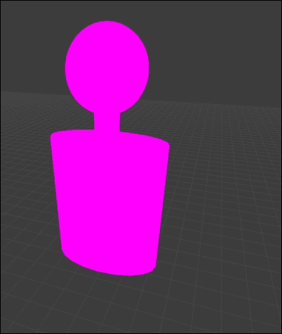
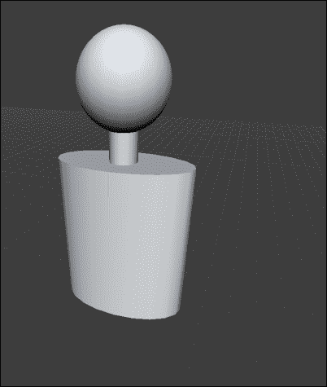
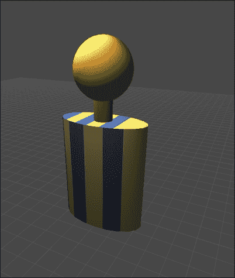

# 第七章：使用着色器

每个游戏的成功在很大程度上取决于其外观和感觉。这直接意味着游戏必须具有引人注目的图形显示。由于空间和堆限制，通常无法提供最高质量的图形资产。因此，必须有一种方法在运行时创建或改进图形资产以供显示。这种必要性催生了着色器的概念。

着色器可以操作任何可视元素，并在渲染之前调整可绘制元素的每个像素。大多数情况下，着色器针对特定的图形处理器进行了优化。然而，如今，着色器可以编写以支持多个平台上的多个处理器。

Android 在 Android 框架本身中提供了使用着色器的选项。此外，还可以使用 OpenGL 着色器，并借助 Android NDK 进行自定义。有许多场合，借助着色器可以在没有优秀原始艺术资产的情况下提供精美的图形质量。

我们将从 Android 游戏开发的角度讨论着色器，涵盖以下主题：

+   着色器介绍

+   着色器的工作原理

+   着色器的类型

+   Android 库着色器

+   编写自定义着色器

+   通过 OpenGL 的着色器

+   游戏中的着色器使用

+   着色器和游戏性能

# 着色器介绍

许多开发人员在 Android 上开发游戏，但对着色器了解不多。在大多数情况下，开发人员不需要使用着色器，或者在游戏开发框架或引擎中有一些预定义的着色器。

1988 年，动画工作室 Pixar 引入了现代着色器概念。然而，当时的 GPU 无法处理着色器。OpenGL 和 Direct3D 是支持着色器的第一批图形库。GPU 开始通过 2D 像素着色支持着色器。很快，它得到了增强，以支持顶点着色器。如今，OpenGL 3.2 和 Direct3D 10 库也支持几何着色器。

现在让我们深入了解着色器的定义、必要性和在 Android 游戏中的范围。

## 什么是着色器？

简而言之，着色器是一组指令，用于操纵输入图形资产的视觉显示。

让我们稍微详细解释一下定义。所有指令基本上都是通过编程完成的。这就是为什么着色器的概念只存在于计算机图形中的原因。着色器能够根据指令和输入资产执行计算，以产生更有效的输出可显示资产。

典型的着色器可以处理顶点或像素。像素着色器可以计算资产的颜色、深度和 alpha 属性。顶点着色器可以计算顶点的位置、颜色、坐标、深度、光照等。因此，着色器可以根据操作基本类型主要分为两类：

+   2D 着色器

+   3D 着色器

## 着色器的必要性

在游戏开发的正常实践中，Android 开发人员不太关心着色器。但是，着色器的必要性是不可避免的。最初，对于小规模游戏，艺术资产是未经改进的。对资产的任何修改都是通过更新艺术资产本身的旧流程来管理的。

着色器可以最小化这种额外耗时的工作。同一资产可以被操纵以在屏幕上创建不同的对象。例如，您可以在对象失焦时使其模糊，改变游戏过程中精灵的颜色以表示不同的团队或玩家，创建艺术资产的蒙版等等。

着色器具有以下好处：

+   当不同的着色器应用于相同的艺术资产时，根据运行时的要求，会产生不同的资产。因此，着色器可以节省额外的艺术创作时间。

+   游戏中一次性集成可绘制对象可以通过不同的着色器产生不同的视觉体验。

+   由于艺术资产被最小化，使用着色器可以减少游戏构建大小。

+   相同的资产集会有更多的视觉差异。

+   通过着色器可以通过简单的艺术重复操纵视觉内容来创建动画。

+   着色器在运行时创建视觉效果很有用。

然而，使用着色器可能会导致一些负面后果：

+   使用着色器会增加处理时间，因为在运行时操纵视觉资产

+   未经优化地使用着色器可能导致更多的堆内存消耗，因为其中将存储各种中间实例

+   有时，着色器在处理时负责对象的扭曲

+   使用着色器使艺术资产容易受到质量损失

只有前两种是使用着色器的实际直接后果。其余的问题只有在开发人员使用编写不好的着色器或有故障的着色器时才会发生。因此，选择特定任务的完美着色器是非常必要的。

有时，着色器处理需要很长时间，导致 FPS 输出不佳。一些旧的 GPU 不支持所有类型的着色器。因此，开发人员应检查和确认着色器要执行的硬件平台。

## 着色器的范围

着色器可以用于与计算机图形相关的各种领域，如图像处理、摄影、数字动画、视频/电脑/数字游戏等。

游戏行业是使用着色器的最大社区之一。安卓平台也不例外。安卓游戏开发人员在 3D 和 2D 游戏中大规模使用着色器。

坦率地说，2D 游戏对着色器的范围不大。只有像素着色器可以操纵像素的颜色、不透明度、饱和度和色调。当相同的原始资产用于不同的可见性时，这是很有用的。

例如，一个 2D 板球游戏有许多队伍，他们穿着不同的服装以区分它们。开发人员将所有精灵动画资产设计成一个设计，并应用着色器以不同方式操纵颜色以区分不同的队伍。因此，输出的精灵具有不同的可见性，并且玩家可以轻松识别它们。

# 着色器的工作原理

我们已经讨论过着色器处理顶点或像素。因此，基本的工作原理是在运行时更改或操纵数据：


着色器过程是一组特定的指令，用于处理顶点或片段。可以为各种类型的处理编写不同的着色器程序。

顶点着色器用于改变模型的形状；它还可以改变表面形成系统。

像素/片段着色器可以改变像素颜色值以及不透明度。像素数据可以通过着色器程序合并、修改或替换，以形成新的数字图像。

# 着色器的类型

游戏行业中使用了许多着色器。它们根据其行为和特性进行分类。以下是一些着色器：

+   像素着色器

+   顶点着色器

+   几何着色器

+   镶嵌着色器

让我们详细看看这些类型。

## 像素着色器

像素着色器是在纹理或数字图像上工作的 2D 着色器。像素着色器处理单个像素的颜色和其他属性。每个单个像素称为片段。这就是为什么像素着色器经常被称为片段着色器的原因。

## 顶点着色器

顶点着色器主要作用于网格或模型的顶点。每个模型的网格由多个顶点组成。顶点着色器只能应用于 3D 模型。因此，顶点着色器是一种 3D 着色器。

## 几何着色器

几何着色器用于创建新的基本图形元素。在应用顶点着色器以执行渲染管线后，几何着色器用于创建点、线和三角形以形成表面。

## 镶嵌着色器

这是一个典型的 3D 着色器，用于简化和改进镶嵌期间的 3D 网格。它分为两个着色器：

+   Hull 着色器或镶嵌控制着色器

+   域着色器或镶嵌进化着色器

这两个着色器一起使用以减少网格带宽。

镶嵌着色器有能力以显著减少可绘制顶点数的方式改进 3D 模型。因此，渲染变得更快。

# Android 库着色器

Android 在`android.graphics`包中的框架中提供了着色器选项。一些知名和广泛使用的着色器也在 Android 库中。其中一些如下：

+   `BitmapShader`：这可以用于以纹理格式绘制位图。它还支持位图的平铺或镜像。它非常适用于创建具有平铺的地形。

+   `ComposeShader`：这用于合并两个着色器。因此，它非常适用于掩模或合并两种不同着色器的颜色。

+   `LinearGradient`：这用于沿着给定的线段创建渐变，并带有定义的颜色集。

+   `RadialGradient`：这用于创建沿着给定圆弧段的渐变，并带有定义的颜色集。提供了径向原点和半径来创建渐变。

+   `SweepGradient`：这用于在给定半径周围创建扫描渐变颜色。

这里是一个例子：

```kt
@Override
protected void onDraw ( Canvas c)
{
  float px = 100.0f;
  float py = 100.0f;
  float radius = 50.0f;

  int startColor = Color.GREEN;
  int targetColor = Color.RED;

  Paint shaderPaint = new Paint();
  shaderPaint.setStyle(Paint.Style.FILL);

  //LinearGradient Example to a circular region
  LinearGradient lgs = new LinearGradient( px, py, px + radius, py + radius, 
    startColor, targetColor, Shader.TileMode.MIRROR);
  shaderPaint.setShader(lgs);
  c.drawCircle( px, py, radius, shaderPaint);

  //RadialGradient Example to a circular region
  px = 200.0f;
  py = 200.0f;
  RadialGradient rgs = new LinearGradient( px, py, radius, 
    startColor, targetColor, Shader.TileMode.MIRROR);
  shaderPaint.setShader(rgs);
  c.drawCircle( px, py, radius, shaderPaint);

  //SweepGradient Example to a circular region
  px = 300.0f;
  py = 300.0f;
  shaderPaint.setShader(new SweepGradient(px, py, startColor, targetColor));
  c.drawCircle( px, py, radius, shaderPaint);
}
```

这是它的样子：


这些选项非常适合使用不同的样式创建不同对象的相同原始对象。

# 编写自定义着色器

开发人员可以根据自己的需求编写自定义着色器。Android 提供了`android.graphics.Shader`类。使用提供的原始着色器很容易创建自己的着色器类。

自定义着色器可能不仅包括一个着色器。它可以是各种着色器的组合。例如，考虑使用运动触摸事件在圆形视口中遮罩图像：

```kt
private float touchX;
private float touchY;
private boolean shouldMask = false;

private final float viewRadius;
private Paint customPaint;

@Override
public boolean onTouchEvent(MotionEvent motionEvent) 
{
  int pointerAction = motionEvent.getAction();
  if ( pointerAction == MotionEvent.ACTION_DOWN || 
  pointerAction == MotionEvent.ACTION_MOVE )
    shouldMask = true;
  else
    shouldMask = false;

  touchX = motionEvent.getX();
  touchY = motionEvent.getY();
  invalidate();
  return true;
}

@Override
protected void onDraw(Canvas canvas) 
{
  if (customPaint == null) 
  {
    Bitmap source = Bitmap.createBitmap( getWidth(), getHeight(), Bitmap.Config.ARGB_8888);
    Canvas baseCanvas = new Canvas(source);
    super.onDraw(baseCanvas);

    Shader customShader = new BitmapShader(source, Shader.TileMode.CLAMP, Shader.TileMode.CLAMP);

    customPaint = new Paint();
    customPaint.setShader(customShader);
  }

  canvas.drawColor(Color.RED);
  if (shouldMask) 
  {
    canvas.drawCircle( touchX, touchY - viewRadius, viewRadius, customPaint);
  }
}
```

这个例子是图片游戏中最常用的着色器样式之一。您也可以实现这样的着色器来创建隐藏物体游戏。

另一个用例是突出显示屏幕上的特定对象。同样的可视圆可以用来只显示突出的对象。在这种情况下，颜色可以是半透明的，以显示暗淡的背景。

# 通过 OpenGL 的着色器

在 Android 中，OpenGL 支持为 Android 3D 游戏实现着色器。OpenGL ES 2.0 是 Android 上支持着色器的平台。在手动创建着色器时，它有两个功能段：

+   着色器

+   程序

着色器被转换成中间代码以支持程序在 GPU 上运行。在编译阶段，着色器被转换。这就是为什么着色器在程序执行之前需要重新编译的原因。

在我们的例子中，我们将使用`android.opengl`包的`GLSurfaceView`。

对于 3D 游戏，Android 开发人员可以使用这个包在 Android SDK 上玩转着色器。这个包提供了使用 Java 创建和使用 OpenGL 着色器的 API。

我们将使用`GLSurfaceView`而不是普通的 Android`View`或`SurfaceView`。实现将如下所示：

```kt
import android.opengl.GLSurfaceView;
import android.content.Context;

public class MyGLExampleView extends GLSurfaceView 
{
  private final GLRenderer mRenderer;

  public MyGLExampleView (Context context) 
  {
    super(context);

// Set OpenGL version 2.0 as we will be working with that particular library
    this.setEGLContextClientVersion(2);

// Set the Renderer for drawing on the GLSurfaceView
    MyOpenGLRendererExample = new MyOpenGLRendererExample (context);
    setRenderer(mRenderer);

// Render the view only when there is a change in the //drawing data
    setRenderMode(GLSurfaceView.RENDERMODE_CONTINUOUSLY);
  }

  @Override
  public void onPause() 
  {
    super.onPause();
  }

  @Override
  public void onResume() 
  {
    super.onResume();
  }
}
```

我们需要为视图创建一个渲染器，通过 OpenGL 绘制对象：

```kt
import java.nio.ByteBuffer;
import java.nio.ByteOrder;
import java.nio.FloatBuffer;
import java.nio.ShortBuffer;

import android.content.Context;
import android.opengl.GLES20;
import android.opengl.GLSurfaceView.Renderer;
import android.opengl.Matrix;
import android.util.Log;

import javax.microedition.khronos.egl.EGLConfig;
import javax.microedition.khronos.opengles.GL10;

public class MyOpenGLRendererExample implements Renderer 
{

  // Declare matrices
  private float[] matatrixProjection = new float[32];
  private float[] matrixView = new float[32];
  private float[] matatrixProjectionOnView = new float[32];

  // Declare Co-ordinate attributes
  private float vertexList[];
  private short indicxList[];
  private FloatBuffer vertexBuffer;
  private ShortBuffer drawBuffer;

  private final String vertexShader =
          "uniform    mat4        uMVPMatrix;" +
          "attribute  vec4        vPosition;" +
          "void main() {" +
          "  gl_Position = uMVPMatrix * vPosition;" +
          "}";

  private final String pixelShader =
          "precision mediump float;" +
          "void main() {" +
          "  gl_FragColor = vec4(0.5,0,0,1);" +
          "}";

  // Declare Screen Width and Height HD display
  float ScreenWidth = 1280.0f;
  float ScreenHeight = 800.0f;

  private int programIndex = 1;

  public MyOpenGLRendererExample (Context context)
  {

  }

  @Override
  public void onDrawFrame(GL10 param) 
  {
    renderView(matatrixProjectionOnView);
  }

  @Override
  public void onSurfaceChanged(GL10 objGL, int width, 
int height) 
  {
    ScreenWidth = (float)width;
    ScreenHeight = (float)height;

    GLES20.glViewport(0, 0, (int)ScreenWidth, 
(int)ScreenHeight);

    //reset matrices
    for( int i = 0; i < 32 ; ++ i )
    {
      matatrixProjection[i] = 0.0f;
      matrixView[i] = 0.0f;
      matatrixProjectionOnView[i] = 0.0f;
    }

    Matrix.orthoM(matatrixProjection, 0, 0f, ScreenWidth, 
0.0f, ScreenHeight, 0, 50);

    Matrix.setLookAtM(matrixView, 0, 0f, 0f, 1f, 0f, 0f, 
0f, 0f, 1.0f, 0.0f);

    Matrix.multiplyMM(matatrixProjectionOnView, 0, 
matatrixProjection, 0, matrixView, 0);
  }

  @Override
  public void onSurfaceCreated(GL10 gl, EGLConfig config) 
  {
    //create any object 
    //Eg. Triangle:: simplest possible closed region

    createTriangle();

    // Set the color to black
    GLES20.glClearColor(0.0f, 0.0f, 0.0f, 1);

    // Create the shaders
    int vertexShaderTmp = 
loadShader(GLES20.GL_VERTEX_SHADER, vertexShader);

    int pixelShaderTmp = 
loadShader(GLES20.GL_FRAGMENT_SHADER, pixelShader);

    int programIndexTmp = GLES20.glCreateProgram();

    GLES20.glAttachShader(programIndexTmp, 
vertexShaderTmp);

    GLES20.glAttachShader(programIndexTmp, 
pixelShaderTmp);

    GLES20.glLinkProgram(programIndexTmp);

    // Set shader program
    GLES20.glUseProgram(programIndexTmp);
  }

  void renderView(float[] matrixParam) 
  {
    int positionHandler = 
GLES20.glGetAttribLocation(programIndex, "vPosition");

    GLES20.glEnableVertexAttribArray(positionHandler);
    GLES20.glVertexAttribPointer(positionHandler, 3, 
GLES20.GL_FLOAT, false, 0, vertexBuffer);

    int mtrxhandle = 
GLES20.glGetUniformLocation(programIndex, "uMVPMatrix");

    GLES20.glUniformMatrix4fv(mtrxhandle, 1,
 false, matrixParam, 0);

    GLES20.glDrawElements(GLES20.GL_TRIANGLES, 
indicxList.length, GLES20.GL_UNSIGNED_SHORT, drawBuffer);

    GLES20.glDisableVertexAttribArray(positionHandler);  
  }

  void createTriangle()
  {
    // We have to create the vertexList of our triangle.
    vertexList = new float[]
    {
      20.0f, 200f, 0.0f,
      20.0f, 300f, 0.0f,
      200f, 150f, 0.0f,
    };

    //setting up the vertex list in order
    indicxList = new short[] {0, 1, 2};

    ByteBuffer bytebufVertex = 
ByteBuffer.allocateDirect(vertexList.length * 4);

    bytebufVertex.order(ByteOrder.nativeOrder());
    vertexBuffer = bytebufVertex.asFloatBuffer();
    vertexBuffer.put(vertexList);
    vertexBuffer.position(0);

    ByteBuffer bytebufindex = 
ByteBuffer.allocateDirect(indicxList.length * 2);

    bytebufindex.order(ByteOrder.nativeOrder());
    drawBuffer = bytebufindex.asShortBuffer();
    drawBuffer.put(indicxList);
    drawBuffer.position(0);

    int vertexShaderTmp = 
loadShader(GLES20.GL_VERTEX_SHADER, vertexShader);

    int pixelShaderTmp = 
loadShader(GLES20.GL_FRAGMENT_SHADER, pixelShader);

    int program = GLES20.glCreateProgram();
    if (program != 0) 
    {
      GLES20.glAttachShader(program, vertexShaderTmp);
      GLES20.glAttachShader(program, pixelShaderTmp);
      GLES20.glLinkProgram(program);

      int[] linkStatus = new int[1];

      GLES20.glGetProgramiv(program, 
GLES20.GL_LINK_STATUS, linkStatus, 0);

      if (linkStatus[0] != GLES20.GL_TRUE) 
      {
        Log.e("TAG_EXAMPLE_OPENGL", "Linking Failed !! 
Error:: " + GLES20.glGetProgramInfoLog(program));

        GLES20.glDeleteProgram(program);
        program = 0;
      }
    }
  }

// method to create shader
   int loadShader(int type, String shaderCode)
   {
        int shader = GLES20.glCreateShader(type);

        GLES20.glShaderSource(shader, shaderCode);
        GLES20.glCompileShader(shader);

        return shader;
    }
}
```

顶点着色器代码（`String vs_SolidColor`）有两个需要的参数。`uMVPMatrix`参数是`mat4`类型，它保存了可以用来平移位置的变换矩阵。`uMVPMatrix`参数是一个统一矩阵。`vPosition`参数是`vec4`类型，它保存了顶点的位置。

这个系统可以应用于三角形表面。

# 在游戏中使用着色器

着色器在游戏和动画中被广泛使用，特别是在创建动态照明、改变色调和进行动态视觉改进时。有时，世界环境是用着色器创建的。

## 2D 游戏空间中的着色器

只有像素着色器可以在 2D 游戏中使用。数字图像的每个像素被视为一个片段。这就是为什么像素着色器也被称为片段着色器的原因。像素着色器只能执行颜色更改、平铺和遮罩。

`BitmapShader`、`ComposeShader`、`LinearGradient`、`RadialGradient`和`SweepGradient`是 Android 2D 着色器的变体。

2D 游戏世界是由图像创建的。开发人员通常选择创建不同的资源，以赋予相同对象不同的外观和感觉。在这个过程中，开发人员最终会创建一个几乎相同的使用集，但 APK 更大的 APK。

精灵也是着色器可以发挥重要作用的领域。当使用相同的精灵创建不同的对象时，某些片段的颜色需要动态改变。像素着色器在这里非常有用。

2D 空间中的着色器用于改变颜色，模糊段，改变亮度，改变不透明度，着色图像等。

## 3D 游戏空间中的着色器

在 3D 游戏中，着色器最常见的用途是动态阴影。在现代游戏开发中，阴影是改善游戏体验的不可避免的元素。应用纹理后，3D 模型看起来很真实。

在 Android 中，通过 OpenGL 应用 3D 着色器。我们已经讨论了一个例子：



只有顶点信息的原始模型

这是一个没有任何光照或着色器的简单模型。让我们应用一些着色器，使其具有坚实的 3D 外观：



应用简单的平面着色器

现在，开发人员可以应用任何纹理或颜色来赋予其不同的感觉。在这一部分，开发人员可以选择通过颜色或纹理来限制这一点。通常在这种情况下使用纹理，以使模型在视觉上更真实。然而，这比仅仅进行颜色操作要昂贵得多。

在这里我们将看到颜色和光照的变化，以获得完全不同的感觉。对于游戏的不同场景需求，有不同的处理程序。

然而，这个例子只是着色器如何操纵 3D 模型以获得不同外观和感觉的视觉表示：



着色器和游戏性能

着色器通常是处理密集型的。片段着色器处理纹理的每个片段并操纵其数据。大纹理可能会导致游戏循环中出现明显的延迟。

我们可以从不同的角度看待着色器，以创造出性能的概念。大纹理会降低性能，而许多小纹理也会影响性能。它们之间必须保持平衡，以便在实时使用着色器时具有可行性。

创建阴影是着色器的广泛用途之一。然而，阴影处理的质量与性能成反比。在高质量游戏中，我们可以体验实时阴影。着色器映射对象的顶点并根据光线方向进行处理。然后将其投影到*X-Z*平面上以创建阴影。阴影与平面上的对象和其他阴影合并。

着色器可用于改善世界的可见性，使用不同的光线、材质和颜色。

在游戏中使用着色器的一些优点：

+   渲染资源的完全灵活性

+   减少资源包，增加可重用性

+   动态视觉效果

+   动态光照和阴影

+   实时精灵操作

使用着色器有一些缺点：

+   帧率相对较低

+   性能下降

+   需要支持的硬件平台和图形驱动程序

尽管有一些缺点，着色器已经被证明足够成为游戏开发的固有部分。任何性能下降都可以通过升级硬件和图形驱动程序来处理。

如今，着色器正在针对资源有限的嵌入式设备进行优化。这甚至为在几乎每个平台上增加着色器的使用提供了机会，而不会显著影响性能。

# 总结

自 Android API 级别 15 起，框架支持 OpenGL ES 2.0。这为图形程序员在 Android 游戏中实现着色器提供了巨大的灵活性。

几乎每种硬件配置都支持着色器在 GPU 上运行。然而，使用着色器的规模决定了性能。在现代，这实际上并不是一个问题。

着色器在游戏中被广泛使用。在图形编程的各个方面，着色器已经证明了它们的重要性。所有著名和成功的游戏开发者都承认了着色器的重要性。图形艺术家不需要担心游戏中的所有视觉内容，这显著减少了开发时间。

因此，着色器在游戏中被广泛使用。新的着色器现在带有额外的功能。着色器的升级周期已经减少。然而，硬件也在升级，以支持图形更新的新技术。

看到一个简单的立方体变成具有相同方向的任何东西，感觉就像魔术。这种魔术将在未来更大规模地持续发生。

开发一款游戏并不足够。着色器在减少内存使用方面有很大帮助，但它们会增加处理开销。我们将在下一章尝试探索各种存储和处理的优化技术。
