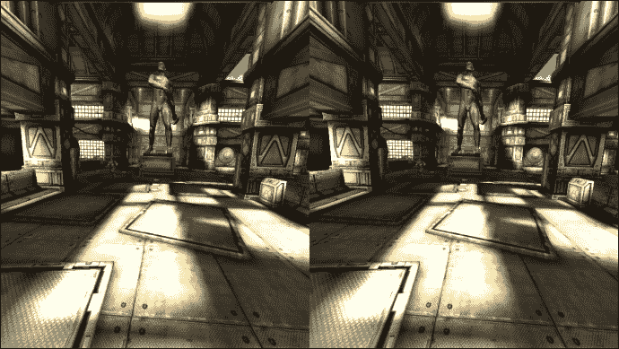
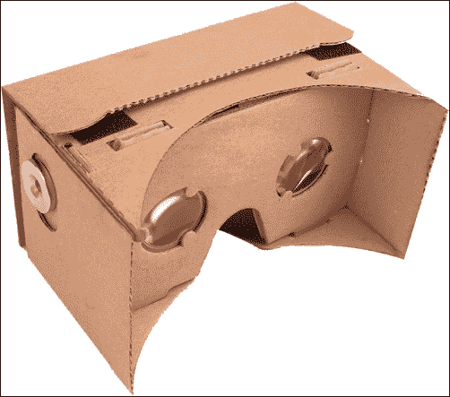

# 第十章：Android 在 VR 游戏中的范围

从简单的角度来看，“虚拟”和“现实”是两个相反的词。因此，一个自然的问题是它们如何能一起表示某种意义。这个短语描述了通过数字计算系统体验想象的或真实环境的经历。

游戏环境也是想象的或实时的。然而，这些环境不会通过触摸、气味、声音和视觉来呈现实时体验。因此，游戏在**虚拟现实**（**VR**）的帮助下有了新的探索范围。

让我们通过以下主题探讨 VR 在 Android 游戏中的概念和范围：

+   理解 VR

+   游戏中的 VR

+   Android 在 VR 的未来

+   为 VR 设备开发游戏

+   Cardboard SDK 简介

+   使用 Cardboard SDK 开发游戏的基本指南

+   通过 Google VR 进行 VR 游戏开发

+   Android VR 开发最佳实践

+   Android VR 游戏市场的挑战

+   扩展的 VR 游戏概念和开发

# 理解 VR

在数字计算世界中，VR 意味着数字计算创建的实时环境。这意味着环境并不存在于地球上，但可以通过数字计算体验。然而，并不总是必须 VR 总是复制真实环境。它有能力复制一个想象的世界或环境，可以显示在计算机屏幕或 VR 头盔（头戴式显示器）设备上（图片来源：[`lh3.ggpht.com/uv8mx61-jsrbcu-EPNw1wIi4BCXg7338alepVlr7xKbKJf7eZ9EXT2U3roA8SWx1RC8=h900-rw`](https://lh3.ggpht.com/uv8mx61-jsrbcu-EPNw1wIi4BCXg7338alepVlr7xKbKJf7eZ9EXT2U3roA8SWx1RC8=h900-rw)）：



Shadowgun VR 游戏的实际屏幕显示

## VR 的演变

VR 概念似乎代表了现代技术，但事实是 VR 概念是在 20 世纪第二季度引入的。1935 年，斯坦利·G·韦恩鲍姆写了一篇名为《皮格马利翁的眼镜》的短篇科幻小说，在其中发现了一个护目镜的描述。护目镜描述了通过触觉和气味的虚拟体验的全息记录。从技术上讲，它定义了虚拟现实。

在 20 世纪中叶，这个概念通过视觉、气味、触觉和声音的虚拟化得到了改进。最终，在 1968 年，伊凡·萨瑟兰和他的学生鲍勃·斯普劳尔创造了世界上第一个 VR 头戴显示设备。

## 现代 VR 系统

现代 VR 设备在 1990 年后得到了发展。它们更轻，具有更好的显示和计算设备。世嘉在 1991 年为街机游戏和游戏机开发了世嘉 VR。该设备配备了液晶显示屏、立体声耳机和惯性传感器。

后来，在 21 世纪之后，VR 设备在许多方面得到了改进。许多技术公司对开发更好的 VR 系统表现出了浓厚的兴趣。如今，VR 设备在市场上是商业化的。VR 现在已经集成在最新的移动设备中，配备了输入控制器系统。

有许多公司开发在 VR 设备上运行的应用程序，用于多种目的。VR 技术的许多其他用途正在不断推出和改进。

## 使用 VR

VR 每天都在现代世界的许多领域扩展。让我们快速看一下 VR 可用性的领域：

+   视频游戏

+   教育和学习

+   建筑设计

+   美术

+   城市设计

+   动态图片

+   医疗疗法

### 视频游戏

视频游戏在技术上由显示、声音和各种类型的交互系统组成。VR 设备已被证明具有运行游戏应用程序所需的所有必要组件。VR 的游戏化始于 20 世纪末。从那时起，VR 一直被用于游戏行业。

游戏基本上是一个互动娱乐系统。VR 只是支持视频游戏系统的环境。VR 系统可以将用户带入游戏世界与元素进行互动。

我们将在本章后面详细讨论 VR 在游戏中的作用。

### 教育和学习

实地考察和教育科目的可视化对学习过程有很大的影响。很多时候，不可能对每个科目提供实际的课程。虚拟现实有助于在许多教育主题上创造虚拟、实际和视觉上的影响。许多学院和培训师使用这种方法进行更好的教学。

培训是虚拟现实教育的另一个重要方面。例如，虚拟现实被用来培训飞行员在发达国家驾驶战斗机。这降低了事故的发生几率，培训候选人可以体验驾驶喷气式飞机的实时感受。

它被广泛用于培训医学生进行各种领域的治疗。

### 建筑设计

虚拟现实在建筑设计中被广泛使用。它可以在不实际实施的情况下浏览拟议的设计。许多建筑公司使用虚拟现实来展示设计。

有许多虚拟现实软件可以从建筑设计的数字副本中构建虚拟现实应用程序。

### 美术

这是虚拟现实的一个较少为人所知和较少被探索的用途。然而，许多优秀的艺术家已经利用虚拟现实来创造一个可导航的艺术虚拟世界。一些艺术博物馆可以通过虚拟现实技术进行虚拟参观。

### 城市设计

在现代世界中，城市设计和规划使用虚拟现实来模拟和验证设计。城市设计也用于发现设计中的漏洞和缺陷。在城市/城镇重建、交通规划、景观设计等方面，虚拟现实技术使城市设计变得更加容易。

### 电影

我们可以找到一些电影运用了虚拟现实技术的概念。电影《阿凡达》就是一个很好的例子。整个概念都建立在虚拟现实技术之上。这个概念描绘了一个虚拟的生活和活动，借助技术，角色可以在现实中不在场的情况下体验虚拟世界。

电影通过虚拟现实模拟已经变得多维化。如今，观众的体验通过虚拟现实得到了提升。

### 医疗疗法

**虚拟现实疗法**（**VRT**）在医学科学中非常受欢迎，特别是在心理治疗中。据记录，全球虚拟现实疗法的成功率超过 90%。

虚拟现实疗法主要用于治疗恐高、恐飞、恐虫、恐动、公开演讲等人群，创造一个受控的虚拟环境。

# Android 游戏中的虚拟现实

在 Android N 的最新版本发布之前，Android 并没有直接支持虚拟现实。谷歌意识到虚拟现实是应用的未来。此前，谷歌发布了 Cardboard SDK 来开发 Android 上的虚拟现实应用。这个 SDK 仍然存在于市场上，并被广泛使用。

市场上已经有许多针对 Android 虚拟现实头盔的游戏。虚拟现实头盔的数量日益增加。虚拟现实以前并不是主流的 Android 游戏开发的一部分，但据信它很快将成为主流，因为 Android 现在已经包含了一个专门的虚拟现实设置。

## Android 虚拟现实游戏的历史

在 70 年代末，虚拟现实系统开始以更好的设备迅速发展。结果是虚拟现实在 2016 年被纳入主流 Android SDK。最新的 Android 设备都支持虚拟现实。据信，大多数即将推出的设备都将支持虚拟现实头盔。

以前，操作虚拟现实头盔需要高端 PC 或游戏机。但现在，虚拟现实头盔被设计成支持移动设备。虚拟现实头盔被视为 Android 可穿戴设备的一部分，具有高配置。

## 技术规格

从技术上讲，虚拟现实系统一直存在严重的延迟问题。然而，随着技术的改进，延迟正在减少，体验也在变得更好。一些著名的虚拟现实头盔包括 Oculus Rift、HTC Vive、三星 Gear VR 等。

让我们来看看哪些 VR 设备直接兼容安卓设备。以前，VR 设备中有集成显示器。然而，现在，安卓设备可以直接与具有多个输入处理器的 VR 头盔相关联。VR 头盔面临的一个限制是它们只兼容特定的移动手机，因为它们自身的物理尺寸和硬件规格。VR 头盔设计用于适配特定的屏幕尺寸。然而，市场上有一些支持多种屏幕尺寸的 VR 套装。

## 当前安卓 VR 游戏行业

安卓 VR 游戏行业正在迅速增长。几乎所有新手机都支持 VR 应用。许多设备制造商提供专门为特定手机设计的外部 VR 套装。

以前，体验 VR 需要单独的设备，比如 Oculus VR 套装。然而，借助安卓 VR 开发，大多数移动设备都能运行 VR 应用，并且可以通过外部 VR 套装来体验。

# 安卓在 VR 中的未来

众所周知，VR 游戏正在占领游戏市场。安卓正在不断发展。最新发布的安卓 N 版本具有全新的 VR 支持维度。这清楚地表明安卓在 VR 游戏方面有着巨大的潜力。谷歌有可能正在开发一个未来的 VR 专用平台。

市场上会有更多兼容 VR 的设备。因此，安卓平台上的 VR 游戏有着光明的未来。

## 谷歌 Daydream

谷歌 Daydream 是下一代 VR 开发平台。据说它是谷歌 Cardboard 的继任者。最新的安卓 N 将包括对谷歌 Daydream 的支持，并且已经决定将支持 Daydream 的手机称为“Daydream-ready phones”。

谷歌 Daydream 和 Android N 将把安卓上的 VR 游戏带到数字游戏世界的新高度。游戏的体验和质量将会更好、更流畅、更逼真。

# 针对 VR 设备的游戏开发

移动游戏行业中有很大的空间可以用于 VR。基于安卓和谷歌 VR 平台，开发者现在正在针对 VR 开发游戏。VR 游戏在性质上与其他游戏不同。它将用户带入游戏世界。当然，游戏设计和规划也与其他移动游戏不同。

## VR 游戏设计

VR 并不适合每种游戏类型。因此，VR 游戏设计需要相应调整。在游戏中有角色时，VR 游戏更适合，最好是第一人称射击游戏或一些 RPG 或赛车游戏。

设计师需要记住整个游戏世界必须通过游戏由用户来体验。因此，游戏体验是任何 VR 游戏最重要的因素。

一般来说，游戏设计师从一个想法开始设计游戏。然后，相应的控制、环境和体验被考虑进去。然而，在 VR 游戏的情况下，开发者或设计师已经有了一组定义好的特性，他们通过设计来实现这个想法。

## VR 目标受众

全球有数十亿部手机。然而，只有很少一部分实际上兼容 VR 并且能够流畅运行 VR 游戏。随着时间的推移，越来越多的设备具备了 VR 功能。

在安卓上玩 VR 游戏不仅需要手机，还需要兼容的 VR 头盔。并不是每个用户都会去购买额外的设备来玩 VR 游戏。这就是为什么休闲玩家不是 VR 游戏的主要目标受众。相反，典型的玩家和游戏爱好者现在是实际的目标受众。

VR 的用途广泛。其中一个主要用途是模拟，包括教育。教育过程的游戏化为学生开辟了一个巨大的目标受众。另一个主要目标受众是对新事物充满好奇和活力的年轻人。

## VR 游戏开发的限制

VR 游戏开发并不需要非凡的技能。开发人员应该熟悉并精通安卓系统，足够高效地理解 VR 规格和平台限制。在安卓平台上开发 VR 游戏时有一些限制：

+   有限的手柄支持

+   有限且特定的目标受众

+   有限的控制

+   有限的图形质量和最大体验

# Cardboard SDK 简介

Google Cardboard 是谷歌于 2014 年开发并发布的 VR 平台，用于与智能手机配合使用的头戴设备。该平台旨在鼓励大规模的低成本 VR 应用程序开发，至今已被证明是成功的。2016 年 5 月 18 日，谷歌宣布 Daydream 是该平台的下一个步骤。

“Cardboard”这个名字来源于用硬纸板制成的 VR 设备的概念，这使得设备的成本大大降低。然而，许多第三方公司正在使用各种材料遵循相同的构建架构，以增加其风格和质量。

目前，Google Cardboard 只能用于为安卓和 iOS 创建 VR 应用程序。这改变了 VR 开发的概念，原来只限于典型的设备和硬件规格：



## Cardboard 头盔组件

典型的 Google Cardboard 头盔包括以下部分：

+   一块剪成精确形状的硬纸板

+   45 毫米焦距镜片

+   磁铁或电容贴

+   钩和环尼龙扣

+   一个橡皮筋

+   一个可选的近场通信标签

硬纸板设备的每个部分都是预装的或者有一个机械槽可以安装。组装整套设备非常容易和快速。橡皮筋最后安装到头盔上。然而，用任何方式拿着组装好的 VR 头盔都能实现 VR 体验的目的。

组装套件后，将兼容的智能手机插入 VR 头盔的设备槽中，并由相应的组件固定在那里。

## Cardboard 应用的工作原理

兼容 Google Cardboard 的应用程序将智能手机显示图像分成两部分，每个眼睛一部分。可以通过每个 45mm 镜片看到图像。它对每个显示部分应用桶形畸变以抵消镜片的枕形畸变。因此，创建了一个完整的广阔的 3D 世界。

最初的 Cardboard 头盔可以容纳屏幕尺寸达 5.7 英寸（140 毫米）的手机，并使用磁铁作为输入按钮，这也需要智能手机设备中的指南针传感器。后来，按钮被一个导电杠替代。

## 升级和变种

谷歌更新了设计，并于 2016 年发布了下一代 Cardboard VR 头盔，可与 6 英寸（150 毫米）显示屏的手机配合使用。它还用导电杠更新了输入按钮，触发智能手机屏幕上的触摸事件，以实现更好的设备兼容性。

Google 允许多家供应商和制造商使用不同的材料和风格制造兼容 Cardboard 的头盔。今天，我们可以看到这种产品的许多变种。

# 使用 Cardboard SDK 开发游戏的基本指南

为 Cardboard SDK 或其他任何 VR 组件开发游戏与其他安卓游戏不同。让我们通过以下几点快速了解 Cardboard 开发风格和标准的基础知识：

+   启动和退出 VR 游戏

+   VR 设备适应

+   显示属性

+   游戏组件

+   游戏控制

+   游戏音频设置

+   用户焦点辅助

+   终极 VR 体验

## 启动和退出 VR 游戏

通常，在启动安卓游戏后，它会执行一些自动任务并带用户进入菜单选择操作。在 VR 游戏中，需要花时间将安卓设备正确安装到 VR 头盔上，因此开发人员在启动游戏后不会执行任何自动任务。游戏应该等待用户在适合运行的完美状态下开始。

为了更好和更常见的体验，游戏应该提示用户使用 VR 标志或按钮来开始 VR 游戏。

标准 VR 游戏有两种可能的退出方式：

+   按下返回按钮

+   按下主页按钮

### 按下返回按钮

如果 VR 有一个用于显示退出弹出窗口的 2D 界面，那么使用返回按钮是最好的选择。在玩安卓 VR 游戏时，不太可能意外按到返回按钮，因为设备安装在 VR 头显上。通常情况下，只需按一次返回按钮即可退出游戏，因为符合上述标准。否则，退出弹出窗口可以起到作用，类似于非 VR 游戏。

### 按下主页按钮

通常情况下，按下主页按钮会将安卓应用程序推到后台，而不会关闭应用程序，在 VR 游戏中也是如此。

## VR 设备适应

使用 Cardboard SDK 的安卓 VR 游戏应该适应 VR 头显的物理特性。Google Cardboard SDK 具有自动执行此任务的功能。开发者可以依赖 SDK 根据 VR 头显调整应用程序设置和配置。Cardboard SDK 本身包含了几种特定 Cardboard 设备的调整设置。SDK 可以为 VR 头显的几种特定镜片配置立体设置和矫正失真。

建议开发者使用 Cardboard SDK 功能，支持尽可能多的 VR 头显，以便单个游戏为用户提供最佳的 VR 体验，而不会出现任何麻烦。

## 显示属性

在许多安卓设备中，有一个名为“Lights Out”的功能。在这些设备中，主页、菜单和返回控件被隐藏在“Lights Out”功能下。VR 游戏使用滑屏技术通过 VR 头显镜片生成 3D 体验。这就是为什么在全屏模式下运行 VR 游戏非常必要。系统控件或状态栏可能会出现在用户的外围视野中，阻挡或分散他们的注意力，影响真正的 VR 体验。

## 游戏内组件

通常情况下，VR 游戏体验是通过设备屏幕在环境中进行的。在游戏过程中，很少会触发任何弹出窗口或其他不需要的组件。

开发者不应调用任何会在游戏过程中触发任何弹出窗口或不需要的中断的 API。安卓目前不支持任何 2D 组件渲染。强制渲染 2D 元素可能会导致 VR 显示的迷失。即使不是这样，用户也需要将设备从 VR 头显中取出，然后执行所需的操作来摆脱弹出窗口，这一点都不方便。

## 游戏控件

安卓 VR 头显只有一个按钮。因此，在 VR 游戏中，控件设计不遵循传统方式。让我们来看看 VR 游戏的控件方案。

### 控件概念

UI 控件通常出现在游戏启动时。开发者应该将 UI 控件放在初始视野范围内，以便用户可以找到它们开始游戏。如果控件不在可见范围内，用户可能会感到困惑。在这种情况下，他们可能会四处寻找控件，或者直接离开游戏。在这两种情况下，用户可能会失去对游戏的兴趣。

在玩游戏时，如果有任何用户界面，这些控件需要随着视野移动。否则，用户可能需要回到 UI 元素所在的位置。

#### 控件类型

虽然头显设备只有一个控制单元，但可能有几种使用按钮和其他选项的方式。最常见的控件类型如下：

+   融合按钮

+   视觉倒计时

##### 融合按钮

Cardboard VR 头盔只有一个按钮在设备的一侧。它可以用来点击目标。这个按钮的一个用途是触发 VR 世界中的虚拟按钮，它将融合。这意味着在关注虚拟融合按钮一段时间后，将触发相应的任务。然而，这可能会令人沮丧，因为用户需要等待那段时间。为了解决这个问题，开发者应该在可能的情况下给用户一个立即点击虚拟按钮的选项：


##### 可视倒计时

在使用带有计时器的熔丝按钮时，用户可能会在不知情的情况下关注按钮，并在一定时间后，它会改变游戏状态。在这种情况下，用户可能会感到困惑，无法继续相同的游戏体验。开发者应该通过视觉方式指示用户，在一定时间内会发生某些事情：


#### 熔丝按钮指示

我们已经知道 VR 游戏不支持 2D UI 按钮。因此，开发者使用熔丝按钮。熔丝按钮可以是游戏中的任何元素。必须有指示来引导用户关注特定的熔丝按钮。然后，可以在倒计时或点击时执行操作。

例如，开发者经常使用一些发光、闪烁、摇晃或其他动态机制来使对象可点击。周围的任务或动作由环境来定义以指示任务。

#### 控制放置

当元素足够大以便关注时，激活熔丝按钮总是一个好的做法。这可以避免用户产生很多困惑。此外，场景中不应该有难以定位并可能造成困惑的相邻熔丝按钮。

# 通过 Google VR 进行 VR 游戏开发

谷歌通过 Google VR 发布了一个针对 Android 的 VR 开发工具包，其中包括 Android SDK 和 Android NDK。这些 SDK 支持 Cardboard 和 Daydream VR 平台。

开发者可以通过以下任务跳入 VR 游戏开发：

+   头部跟踪系统

+   空间音频

+   动态渲染

+   UI 处理

+   3D 校准

+   镜头失真校正

+   立体几何配置

让我们来看看用于 VR 游戏开发的 Android SDK：

+   使用 Android SDK 的 Google VR

+   使用 Android NDK 的 Google VR

## 使用 Android SDK 的 Google VR

我们将通过 Android SDK 来看一下 VR 开发。可以使用 Gradle 来构建 VR 应用程序。Gradle 可以独立使用，也可以与 Android Studio 一起使用。

开发者可以使用 Android Studio 之外的其他工具，但强烈建议在 Android 构建中使用 Android Studio。这是在 Android 平台上开发 VR 应用程序最方便的方法。

开发者需要检查以下因素，以便为 Android 创建 VR 应用程序构建：

+   Android Studio 版本 1.0 或更高

+   Android SDK 版本 23 或更高

+   Gradle 版本 23.0.1 或更高

使用 Android Studio 可以避免用户配置 Gradle 设置来构建应用程序包。它还可以帮助开发者识别并在需要时更新 Gradle。

开发者可以选择使用 Gradle 来构建 Android 应用程序项目。在这种情况下，开发者需要手动编辑每个模块的`build.gradle`文件，以包括 Gradle 构建的`.AAR`声明。

修改必须这样做：

```kt
dependencies
{
  compile(name:'audio', ext:'aar')
  compile(name:'common', ext:'aar')
  compile(name:'core', ext:'aar')
}

repositories
{
  flatDir
  {
    dirs 'libs'
  }
}
```

Android Studio 会自动进行这些更改，并为每个模块声明依赖项。这将告诉 Gradle 在相应模块的`libs`子目录中查找三个`.AAR`声明。如果没有名为`libs`的子目录，则开发者需要在模块目录内创建一个`libs`子目录，并手动复制所需的`.AAR`文件。

## 使用 Android NDK 的 Google VR

使用 Android NDK 进行 VR 应用开发与 SDK 开发并没有太大的不同。它需要以下组件：

+   Android Studio 版本 1.0 或更高

+   Android NDK

+   Google VR SDK for Android

建议使用 Android NDK 与 Daydream 开发平台。因此，开发者需要为 Daydream SDK 设置开发环境。

Google VR 开发工具包从版本 v0.8.0 的测试版开始支持 NDK 开发。从版本 v0.8.1 开始，它包括了一个本地的头部跟踪系统来增强开发。

Android SDK 足以开发 Cardboard 的 VR 游戏，但一些开发者喜欢使用 C++等本地语言来开发游戏。一些开发者选择使用 C++和 OpenGL 来开发 VR 游戏，以便更好地理解技术。这样，VR 游戏也可以在其他 VR 平台上使用。

# Android VR 开发最佳实践

开发者在开始使用 Cardboard 开发 VR 体验之前，需要有编写 Android 常规游戏的经验。以下是开发者在为 Google Cardboard 开发 VR 游戏时需要注意的几个方面：

+   绘制调用限制

+   三角形数量限制

+   保持稳定的 FPS

+   克服过热问题

+   追求更好的音频体验

+   设置适当的项目设置

+   使用适当的测试环境

## 绘制调用限制

VR 游戏显然是 3D 游戏，需要进行广泛的渲染过程。将绘制调用最小化以限制渲染时间并减少 GPU 开销是一种良好的实践。

一般来说，根据当前可用设备的列表，开发者应该将每帧的渲染调用限制在 100 次。在当前行业中，大多数开发者都在努力将绘制调用保持在 50 到 100 之间。

## 三角形数量限制

我们已经讨论了在 3D 游戏中顶点和三角形的功能。相同的逻辑也适用于 VR 游戏。然而，在 VR 游戏中保持性能比普通的 3D 游戏更加困难。这就是为什么 VR 游戏通常使用 100k 以内的三角形数量。

目前，性能良好的 VR 游戏的平均三角形数量约为 50k 至 80k。开发者需要简化所有的 3D 对象，并将它们优化为可能的最小三角形和顶点，以在运行时获得良好的 FPS。

## 保持稳定的 FPS

对于任何 Android 游戏来说，保持稳定和良好的 FPS 是必要的。Android 的 VR 游戏也不例外。通过上述限制，开发者可以减少渲染时间以获得更好的性能。

VR 游戏使用分屏技术，这是一个繁重的过程。因此，开发者应该决定并使用尽可能少的游戏对象或元素，以保持稳定的 FPS。

对于 VR 游戏开发者来说，以有限的资源提供更好的视觉效果是一个巨大的挑战。设计和创建艺术资源是一个重要部分。使用最少的三角形来制作低多边形模型会产生较差的视觉质量。然而，通过对模型提供出色的纹理支持和在虚拟现实世界中进行战略光照映射，可以改善这种质量。

## 克服过热问题

过热是 Android VR 游戏的常见问题。由于 CPU 和 GPU 的广泛使用，设备在运行 VR 应用时会发热。开发者无法完全解决这个问题。然而，开发者可以优化 VR 游戏以减少处理器使用。游戏应该限制网络使用和其他设备组件，以最小化电池消耗。

## 更好的音频体验

Android VR 游戏是在额外的 VR 设备的支持下进行的，例如 Google Cardboard 或类似设备。我们已经在本章讨论过这些设备。这些设备没有音频支持；VR 游戏默认使用设备扬声器。

没有适当的音频体验，虚拟现实体验就不完整。在游戏中使用 3D 环境音频并建议用户在玩 VR 游戏时戴上耳机，这总是一个好的做法。

## 设置适当的项目设置

在项目设置 VR 项目设置正确可以在未来避免开发者的头疼。特别是为了获得更好的项目性能，很重要在项目开始时正确设置质量设置。没有先前的项目配置，整个项目和性能规划都不会有成果。

## 使用适当的测试环境

为了任何游戏的成功，特别是对于大规模游戏如 VR 游戏，设置测试环境是非常重要的。开发者必须了解每个开发阶段的状态，以便他们可以做出未来的决定，使游戏变得更好。通过这种方式，开发过程可以顺利进行。

建议您从 VR 设备外部运行 VR 游戏进行测试。还建议您使用 adb 检查每个调试条件和语句。由于游戏必须使用 VR 设备进行测试，因此很难使用普通的调试桥接。开发者需要设置无线调试桥接来克服这个问题。调试桥接也可以用于从 VR 设备外部运行和停止游戏。通过这种方式，开发者可以节省大量时间，用于改进游戏。

# 安卓 VR 游戏市场的挑战

我们已经了解了在安卓平台上开发 VR 游戏的技术挑战。现在，让我们看看开发者在开发或为安卓平台上的 VR 游戏进行货币化时可能面临的其他挑战：

+   目标受众少

+   游戏类型有限

+   长时间游戏时间

+   设备支持有限

+   实时约束

## 目标受众少

很少有安卓用户熟悉 VR 概念和技术。大多数用户只是普通的手机持有者，没有 VR 头盔。因此，已经有一大部分受众不在 VR 游戏的范围内。这就是为什么 VR 游戏市场受众有限于拥有 VR 头盔的人群。

## 游戏类型有限

我们已经看到了 VR 游戏中可能的游戏类型。VR 游戏不能支持迄今为止发布的所有游戏类型，可能在不久的将来也无法做到。这种限制对于安卓 VR 游戏市场来说是一个严重的挑战，它影响了其在获得盈利地位和设计货币化方面的地位。

## 长时间游戏时间

安卓 VR 游戏必须使用配备安卓手机的 VR 头盔进行游戏。通常游戏时间较长，需要时间和精力来设置一个可玩的环境。

安卓游戏用户通常沉迷于快速和灵活的游戏时间。大多数游戏可以立即暂停和恢复，方便游戏。然而，VR 游戏不能立即暂停或恢复。用户更喜欢在有长时间空闲的时候玩 VR 游戏。

## 设备支持有限

安卓 VR 游戏需要高水平的硬件配置来运行游戏。硬件平台必须有足够的能力来处理游戏，渲染单元必须以最短的时间内以最大可能的质量渲染游戏。

市场上有很多廉价和低配置的手机。数百万安卓用户使用这些手机。然而，大多数手机无法稳定且可接受的 FPS 运行 VR 游戏。安卓 VR 游戏的开发者不得不排除这些设备。这种限制显著减少了受支持设备的数量。

## 实时约束

大多数 VR 游戏玩家是游戏玩家或游戏爱好者。然而，他们在玩 VR 游戏时也有一些实时约束。用户或玩家必须选择一个游戏情境，其中可能中断的机会最小。

玩家通常更喜欢坐在一个地方或者在宽敞的地方玩游戏，以避免发生任何意外。他们的眼睛被 VR 头盔遮住，所以用户需要采取这些安全措施。这些问题无法解决，这影响了 VR 游戏市场，导致了低会话次数和时间。

# 扩展的 VR 游戏概念和开发

我们只谈到了 Android 的 VR 游戏方面的一些内容。这些想法已经被实施或正在实施。然而，虚拟游戏还有更广泛的概念。

游戏开发者现在正试图利用 VR 技术制作实时体验。有一些类似数字游戏的实时游戏，比如*彩弹*、*激光标签*等。借助 VR 技术，这些体验可以达到一个新的水平。在一个与 VR 应用环境物理同步的预定义竞技场中使用 VR 头盔可以让用户进入游戏。这种游戏概念已经开始成形。一些用于 VR 游戏的测试竞技场已经通过各种其他物理设备和传感器的支持被创建出来。这些设备和传感器可以实时跟踪用户的动作，并通过 VR 头盔显示在虚拟世界中复制出来。

诸如行走、蹲下、在虚拟世界中触摸某物以及射击虚拟敌人等简单动作已经被实现。开发人员和研究人员正在不断改进。然而，出于以下原因，Android 平台尚未迈出这种 VR 开发的步伐：

+   Android 是一个最适合便携设备的移动操作系统。

+   大多数 Android 设备是移动电话或平板电脑。

+   在 Android 上管理一个具有大型物理设置的专用硬件平台是困难的。**实时操作系统**（**RTOS**）对于这类系统的性能要比 Android 好得多。

+   这种 Android 设置的市场前景不佳，成本可能会很高。

尽管在大规模设置 Android VR 游戏中存在这些问题，但人们相信 Android 很快将成为这类系统的一部分。

# 总结

这是科技时代。VR 技术已经将游戏体验提升到了一个新的水平。Android 现在是游戏开发最为进步的平台。将两个领先的平台结合起来肯定可以将移动游戏体验提升到一个新的水平。

在 VR 游戏中，用户有机会置身于游戏环境中。然而，在为 Android 开发具有 VR 功能的游戏时存在许多限制。谷歌已经宣布了即将推出的 VR 开发平台 Daydream，其中包括带有独立控制器的扩展控制。

VR 游戏行业正在迅速增长。它有自己的一套优势和劣势。然而，毫无疑问，游戏体验远比传统的游戏系统要好得多。因此，可以毫不夸张地说，Android VR 游戏行业的未来是光明的。
