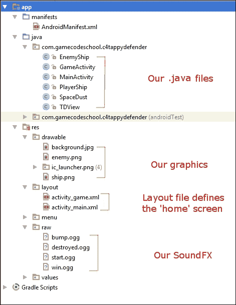
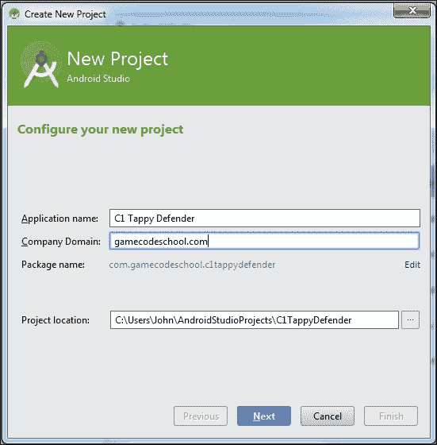
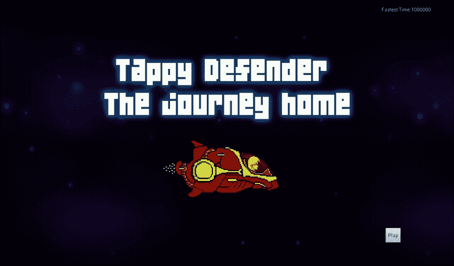
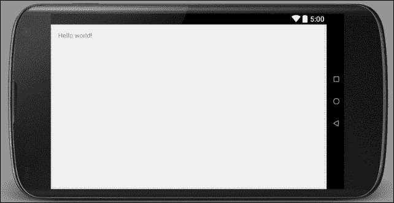
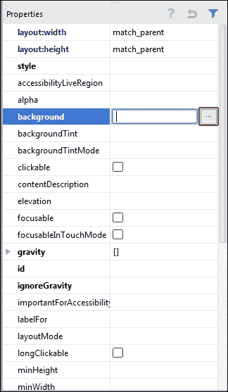
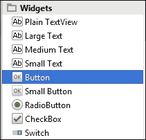
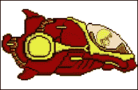
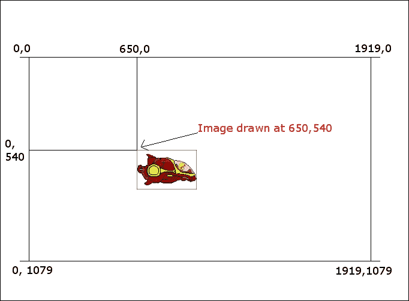
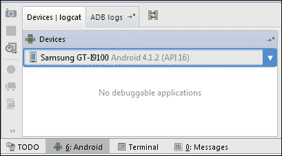

# 第二章：Tappy Defender – 起步

欢迎来到我们将在三章内了解的第一个游戏。在本章中，我们将详细审视最终产品的目标。如果我们确切知道我们试图实现什么，那么在构建游戏时会非常有帮助。

然后，我们可以看看我们代码的结构，包括我们将遵循的近似设计模式。接着，我们将组装我们第一个游戏引擎的代码框架。最后，为了完成本章，我们将绘制游戏中的第一个真实对象，并在屏幕上为其添加动画。

然后，我们将准备好进入第三章，*Tappy Defender – 翱翔*，在那里我们在完成第一个游戏之前可以取得非常快的进展，并在第四章，*Tappy Defender – 回家*中完成它。

# 规划第一个游戏

在本节中，我们将详细阐述我们的游戏将会是什么样子。背景故事；谁是我们的英雄，他们试图实现什么？游戏机制；玩家实际上会做什么？他会按哪些按钮，这种方式有何挑战性或乐趣？然后，我们将看看规则。什么构成了胜利、死亡和进步？最后，我们将从技术角度出发，开始探讨我们实际上将如何构建这个游戏。

## 背景故事

瓦莱丽自 20 世纪 80 年代初以来一直在保卫人类的遥远前哨。她勇敢的壮举最初在 1981 年的街机经典游戏《Defender》中被永远铭记。然而，在 30 多年的前线生涯后，她即将退休，是时候开始回家的旅程了。不幸的是，在最近的一次小规模战斗中，她的飞船引擎和导航系统受到了严重损坏。因此，现在她必须仅使用她的推进器飞回家。

这意味着她必须通过同时向上和向前推进，有点像是在弹跳，同时避开试图撞击她的敌人来驾驶她的飞船。在最近与地球的通讯中，瓦莱丽表示这就像是在“尝试驾驶一只跛脚的鸟”。这是瓦莱丽在她的受损飞船中的概念艺术，因为这样有助于我们尽早可视化我们的游戏。


现在我们已经对我们的英雄和她的困境有了一些了解，我们将更仔细地看看游戏机制。

## 游戏机制

机制是玩家必须掌握并熟练的关键动作，以能够通关游戏。在设计游戏时，你可以依赖经过尝试和测试的机制想法，或者你可以发明自己的。在 Tappy Defender 中，我们将使用一种机制，玩家通过轻敲并按住屏幕来推进飞船。

这个加速功能会将飞船向上提升，但同时也会让飞船加速，因此更容易受到攻击。当玩家移开手指，加速引擎会关闭，飞船会向下坠落并减速，从而使得飞船稍微不那么脆弱。因此，为了生存，需要非常精细和熟练地平衡加速和不加速。

Tappy Defender 当然深受 Flappy Bird 以及其成功后涌现的大量类似游戏的启发。

与 Flappy Bird 的“我能走多远”计分系统不同，Tappy Defender 的目标是到达“家”。然后，玩家可以多次重玩游戏，试图打破他们的最快时间。当然，为了更快，玩家必须更频繁地加速，并让 Valerie 面临更大的危险。

### 注意

如果你从未玩过或见过 Flappy Bird，花 5 分钟玩玩这类游戏是非常值得的。你可以从 Google Play 商店下载一个受 Flappy Bird 启发的应用程序：

[在 Google Play 商店搜索 Flappy Bird](https://play.google.com/store/search?q=flappy%20bird&c=apps)

## 游戏规则

在这里，我们将定义一些平衡游戏并使其对玩家公平和一致的事物：

+   玩家的飞船比敌人的飞船要坚固得多。这是因为玩家的飞船有护盾。每次玩家与敌人相撞，敌人会被立即摧毁，但玩家会失去一个护盾。玩家有三个护盾。

+   玩家需要飞行一定的公里数才能到达家中。

+   每次玩家到达家中，他们就赢得了游戏。如果他们用时最短，他们还会获得一个新的最快时间，就像是一个高分。

+   敌人将在屏幕最右侧的随机高度生成，并以随机速度向玩家飞行。

玩家始终位于屏幕最左侧，但加速意味着敌人会更快地接近。

## 设计理念

我们将使用一个宽松的设计模式，根据控制部分、模型部分和视图来分离我们的代码。这是我们如何将代码分为三个区域的方法。

### 控制

这是我们的代码部分，它将控制所有其他部分。它将决定何时显示视图，它将初始化模型中的所有游戏对象，并根据数据的状况提示模型中发生的数据决策。

### 模型

模型是我们的游戏数据和逻辑。飞船长什么样？它们在屏幕的哪个位置？它们移动得多快等等。此外，我们代码中的模型部分是每个游戏对象的智能系统。尽管这个游戏中的敌人没有复杂的 AI，但它们会自行判断它们的速度、何时重生等。

### 视图

视图（View）正如其名所示，它是根据模型的状态进行实际绘制的代码部分。当控制代码告诉它时，它将进行绘制。它不会对游戏对象有任何影响。例如，视图不会决定一个对象在哪里，甚至它看起来是什么样子。它只是绘制，然后将控制权交还给控制代码。

### 设计模式现实检查

实际上，这种分离并不像讨论中那么清晰。实际上，绘制和控制代码在同一个类中。但是，你会发现，即使在这个类中，绘制和控制的逻辑是分开的。

通过将游戏分为这三个部分，我们可以看到如何简化开发过程，并避免在添加新功能时代码不断膨胀，变得混乱。

让我们更仔细地看看这种模式如何与我们的代码契合。

## 游戏代码结构

首先，我们必须考虑到我们所工作的系统。在这个案例中，它是安卓系统。如果你已经开发了一段时间的安卓应用，你可能会想知道这种模式与安卓 Activity 生命周期如何契合。如果你是安卓开发新手，你可能会问 Activity 生命周期是什么。

### 安卓 Activity 生命周期

安卓 Activity 生命周期是我们必须遵循的框架，以制作任何类型的安卓应用。有一个名为`Activity`的类，我们必须从中派生，它是我们应用的入口点。此外，我们需要知道这个类，我们的游戏是其对象，还有一些我们可以覆盖的方法。这些方法控制着应用的生命周期。

当用户启动一个应用时，我们的`Activity`对象将被创建，并且可以覆盖的一系列方法将按顺序被调用。以下是发生的情况。

当创建`Activity`对象时，将按顺序调用三个方法：`onCreate()`、`onStart()`和`onResume()`。此时，应用正在运行。此外，当用户退出应用或应用被中断，比如一个电话，将调用`onPause`方法。用户可能会决定，在完成电话后返回应用。如果发生这种情况，将调用`onResume`方法，之后应用再次运行。

如果用户没有返回应用，或者安卓系统决定需要这些系统资源做其他事情，将调用两个进一步的方法来进行清理。首先是`onStop()`，然后是`onDestroy()`。现在应用已经被销毁，任何尝试返回游戏的行为都将以 Activity 生命周期的开始为结果。

作为游戏程序员，我们必须注意这个生命周期，并遵循一些良好的家务管理规则。在接下来的过程中，我们将实施并解释这些良好的家务管理规则。

### 注意

安卓 Activity 生命周期比我刚才所解释的要复杂得多，也更为细致。然而，我们知道开始编程我们第一款游戏所需的一切。如果你想了解更多，请查看安卓开发者网站上的这篇文章：

[`developer.android.com/reference/android/app/Activity.html`](http://developer.android.com/reference/android/app/Activity.html)

一旦我们考虑了 Android Activity 生命周期，代表控制部分模式的类核心方法将会像这样非常简单：

1.  更新我们的游戏对象的状态。

1.  根据它们的状态绘制游戏对象。

1.  暂停以锁定帧率。

1.  获取玩家输入。实际上，因为第 1、2 和 3 部分在线程中发生，这部分可以在任何时候进行。

1.  重复。

在我们真正开始构建游戏之前，还有最后一点准备工作。

## Android Studio 文件结构

安卓系统非常讲究我们放置类文件的位置，包括`Activity`，以及我们在文件层次结构中放置如声音文件和图像等资源的位置。

这里是一个非常快速的总览，介绍我们将要放置所有内容的地方。你不需要记住这个，因为我们在添加资源时会提醒自己正确的文件夹。在最初几次需要时，我们将逐步完成活动/类创建过程。

提前告知，以下是你的 Android Studio 项目浏览器在完成 Tappy Defender 项目后看起来会是什么样子的一份注释图解。



现在，我们可以真正开始构建 Tappy Defender。

# 构建主屏幕

既然我们已经完成了所有规划和准备工作，我们可以开始编写代码了。

### 注意事项

**下载示例代码**

你可以从你在[`www.packtpub.com`](http://www.packtpub.com)的账户下载示例代码文件，这些文件对应你购买的所有 Packt Publishing 的书籍。如果你在其他地方购买了这本书，可以访问[`www.packtpub.com/support`](http://www.packtpub.com/support)注册，我们会直接将文件通过电子邮件发送给你。

要使用代码文件，你仍然需要创建一个 Android Studio 项目。此外，你还需要更改每个 JAVA 文件代码第一行的包名。将包名更改为与你创建的项目相匹配的包名。最后，你需要确保将任何资源（如图片或声音文件）放置到项目中的适当文件夹。每个项目所需的资源在下载包中都有提供。

## 创建项目

打开 Android Studio 并按照以下步骤创建一个新项目。到本章结束时，我们将要使用的所有文件都可以在下载包中的 `Chapter2` 文件夹找到。

1.  在**欢迎来到 Android Studio**对话框中，点击**开始一个新的 Android Studio 项目**。

1.  在接下来显示的**创建新项目**窗口中，我们需要输入一些关于我们应用的基本信息。这些信息将被 Android Studio 用来确定软件包名称。

    ### 注意

    在下图中，你可以看到**编辑**链接，如果需要，你可以在这里自定义软件包名称。

1.  如果你将提供的代码复制粘贴到你的项目中，那么在**应用名称**字段中使用`C1 Tappy Defender`，在**公司域名**字段中使用`gamecodeschool.com`，如下截图所示：

1.  准备好之后，点击**下一步**按钮。当被问及选择应用将运行的表单因素时，我们可以接受默认设置（**手机和平板电脑**）。因此再次点击**下一步**。

1.  在**向移动设备添加活动**对话框中，只需点击**空白活动**，然后点击**下一步**按钮。

1.  在**自定义活动**对话框中，我们再次可以接受默认设置，因为`MainActivity`看起来是我们主活动的不错名称。所以点击**完成**按钮。

### 我们的操作步骤

Android Studio 已经构建了项目并创建了许多文件，我们将在构建这个游戏的过程中看到并编辑其中大部分文件。正如前面提到的，即使你只是复制粘贴代码，也需要完成这一步，因为 Android Studio 在幕后做了很多工作，以确保我们的项目能够运行。

## 构建主屏幕用户界面

我们 Tappy Defender 游戏的第一部分也是最为简单的部分就是主屏幕。我们需要的只是一个整洁的画面，包含有关游戏场景、最高分和开始游戏的按钮。完成后的主屏幕大致会是这样：



当我们构建项目时，Android Studio 会打开两个文件供我们编辑。你可以在以下 Android Studio UI 设计师的标签中看到它们。这些文件（以及标签）是`MainActivity.java`和`activity_main.xml`：


`MainActivity.java`文件是我们游戏的入口点，我们很快会详细看到这一点。`activity_main.xml`文件是我们主屏幕将使用的 UI 布局。现在，我们可以继续编辑`activity_main.xml`文件，使其看起来像我们的主屏幕应该有的样子。

1.  首先，你的游戏将在横屏模式下通过 Android 设备进行游戏。如果我们把 UI 预览窗口改为横屏，我们将会更准确地看到你的进度。寻找下一个图像中显示的按钮。它就在 UI 预览之前：

1.  点击前一个截图中显示的按钮，你的 UI 预览将切换到横屏，如下所示：

1.  确保通过点击其标签打开`activity_main.xml`。

1.  现在，我们将设置一个背景图片。你可以使用自己的图片，或者使用下载包中`Chapter2/drawable/background.jpg`的我的图片。将你选择的图片添加到 Android Studio 中项目的`drawable`文件夹中。

1.  在 UI 设计师的**属性**窗口中，找到并点击**background**属性，如下一个图像所示：

1.  此外，在上一张图片中，标记为**...**的按钮被圈出。它位于**background**属性的右侧。点击那个**...**按钮，浏览并选择你将使用的背景图片文件。

1.  然后，我们需要一个**TextView**小部件，用来显示高分。注意，布局中已经有一个**TextView**小部件，显示的是**Hello World**。你会修改这个，将其用于我们的高分显示。左键点击它，并将**TextView**拖动到你想要的位置。如果你打算使用提供的背景，可以参考我的操作，或者将其放置在你背景上最佳的位置。

1.  接下来，在**属性**窗口中找到并点击**id**属性。输入`textHighScore`。务必按照显示的格式输入，因为在后面的教程中编写一些 Java 代码时，我们将引用这个 ID 以便操作它，显示玩家的最快时间。

1.  你还可以编辑**text**属性，使其显示为`High Score: 99999`或类似的文字，以便**TextView**看起来更合适。但这不是必须的，因为你的 Java 代码稍后会处理这个问题。

1.  现在，我们将按照以下截图所示从窗口小部件调色板中拖动一个按钮：

1.  将其拖动到背景上看起来合适的位置。如果你使用提供的背景，可以参考我的操作，或者将其放置在你背景上最佳的位置。

### 我们的操作

现在，我们有一个酷炫的背景，以及为你主屏幕整齐排列的小部件（一个**TextView**和一个**Button**）。接下来，我们可以通过 Java 代码为**Button**小部件添加功能。在第四章 *Tappy Defender – Going Home*中重新访问玩家的最高分数**TextView**。重要的是，这两个小部件都被分配了一个唯一的 ID，我们可以在你的 Java 代码中引用并操作它。

## 编写功能代码

现在，我们为游戏主屏幕创建了一个简单的布局。接下来，我们需要添加功能，允许玩家点击**播放**按钮来开始游戏。

点击`MainActivity.java`文件的标签页。自动为我们生成的代码并不是完全符合我们需要的。因此，我们将重新开始，因为这比调整现有的东西更简单、更快。

删除`MainActivity.java`文件中的全部内容，除了包名，并在其中输入以下代码。当然，你的包名可能有所不同。

```java
package com.gamecodeschool.c1tappydefender;

import android.app.Activity;
import android.os.Bundle;

public class MainActivity extends Activity{

    // This is the entry point to our game
    @Override
    protected void onCreate(Bundle savedInstanceState) {
        super.onCreate(savedInstanceState);

        //Here we set our UI layout as the view
        setContentView(R.layout.activity_main);

    }
}
```

所提及的代码是我们主要的`MainActivity`类的当前内容，也是我们游戏的入口点，即`onCreate`方法。以`setContentView...`开头的代码行是将我们的 UI 布局从`activity_main.xml`加载到玩家屏幕的代码。现在我们可以运行游戏并查看主屏幕，但让我们继续取得更多进展，本章末尾我们将了解如何在实际设备上运行游戏。

现在，让我们处理主屏幕上的**播放**按钮。将下面高亮的两行代码添加到`onCreate`方法中，紧跟在`setContentView()`调用之后。第一行新代码创建了一个新的`Button`对象，并获取了 UI 布局中`Button`的引用。第二行是监听按钮点击的代码。

```java
//Here we set our UI layout as the view
setContentView(R.layout.activity_main);

// Get a reference to the button in our layout
final Button buttonPlay =
 (Button)findViewById(R.id.buttonPlay);
// Listen for clicks
buttonPlay.setOnClickListener(this);

```

注意我们的代码中有几个错误。我们可以通过按住*Alt*键然后按*Enter*来解决这些错误。这将添加对`Button`类的导入指令。

我们还有一个错误。我们需要实现一个接口，以便我们的代码监听按钮点击。按照高亮显示的方式修改`MainActivity`类的声明：

```java
public class MainActivity extends Activity 
 implements View.OnClickListener{

```

当我们实现`onClickListener`接口时，我们还必须实现`onClick`方法。这里就是处理按钮点击后发生情况的地方。我们可以在`onCreate`方法之后，但在`MainActivity`类内右键点击，导航到**Generate** | **Implement methods** | **onClick(v:View):void**来自动生成`onClick`方法，或者直接添加给定的代码。

我们还需要让 Android Studio 为`Android.view.View`添加另一个导入指令。再次使用*Alt* | *Enter*键盘组合。

现在，我们可以滚动到`MainActivity`类的底部附近，可以看到 Android Studio 已经为我们实现了一个空的`onClick`方法。此时你的代码中应该没有错误。以下是`onClick`方法：

```java
@Override
public void onClick(View v) {
  //Our code goes here
}
```

由于我们只有一个`Button`对象和一个监听器，我们可以安全地假设主屏幕上的任何点击都是玩家点击我们的**播放**按钮。

Android 使用`Intent`类在活动之间切换。由于我们需要在点击**播放**按钮时进入一个新的活动，我们将创建一个新的`Intent`对象，并将其构造函数中传入我们未来的`Activity`类名，`GameActivity`。然后我们可以使用`Intent`对象来切换活动。将以下代码添加到`onClick`方法的主体中：

```java
// must be the Play button.
// Create a new Intent object
Intent i = new Intent(this, GameActivity.class);
// Start our GameActivity class via the Intent
startActivity(i);
// Now shut this activity down
finish();    
```

我们代码中再次出现了错误，因为我们需要生成一个新的导入指令，这次是为`Intent`类，所以再次使用*Alt* | *Enter*键盘组合。我们代码中还有一个错误。这是因为我们的`GameActivity`类尚未存在。我们现在将解决这个问题。

## 创建 GameActivity

我们已经看到，当玩家点击**播放**按钮时，主活动将关闭，游戏活动将开始。因此，我们需要创建一个名为`GameActivity`的新活动，你的游戏实际上将在这里执行。

1.  从主菜单导航到**文件** | **新建** | **活动** | **空白活动**。

1.  在**自定义活动**对话框中，将**活动名称**字段更改为`GameActivity`。

1.  我们可以接受此对话框中的其他默认设置，所以点击**完成**。

1.  就像我们对`MainActivity`类所做的那样，我们将从这个类开始编写代码。因此，删除`GameActivity.java`中的所有代码内容。

### 我们的操作

Android Studio 为我们生成了两个新文件，并在幕后完成了一些工作，我们很快就会研究这些内容。新文件是`GameActivity.java`和`activity_game.xml`。它们都会在 UI 设计师上方的两个新标签页中自动打开。

我们将不需要`activity_game.xml`，因为我们将构建一个动态生成的游戏视图，而不是静态 UI。现在可以关闭它，或者直接忽略。在*编写游戏循环代码*部分，我们将在本章后面真正开始编写游戏代码时回到`GameActivity.java`文件。

## 配置`AndroidManifest.xml`文件

我们之前提到，当我们创建新项目或新活动时，Android Studio 不仅仅是为我们创建两个文件。这就是为什么我们要以这种方式创建新项目/活动。

在幕后发生的一件事是在`manifests`目录中创建和修改`AndroidManifest.xml`文件。

我们的程序要运行需要这个文件。同时，它还需要被编辑，以便按照我们的意愿工作。Android Studio 已经为我们自动配置了基本内容，但现在我们将对这个文件进行两项额外的操作。

通过编辑`AndroidManifest.xml`文件，我们将强制我们的两个活动全屏运行，并且我们将它们锁定为横屏布局。让我们在这里进行这些更改：

1.  现在打开`manifests`文件夹，双击`AndroidManifest.xml`文件，在代码编辑器中打开它。

1.  在`AndroidManifest.xml`文件中，找到以下代码行：

    ```java
    android:name=".MainActivity"
    ```

1.  紧接着，输入或复制粘贴以下两行代码，使`MainActivity`全屏运行并锁定为横屏方向：

    ```java
    android:theme="@android:style/Theme.NoTitleBar.Fullscreen"
    android:screenOrientation="landscape"
    ```

1.  在`AndroidManifest.xml`文件中，找到以下代码行：

    ```java
    android:name=".GameActivity"
    ```

1.  紧接着，输入或复制粘贴以下两行代码，使`GameActivity`全屏运行并锁定为横屏方向：

    ```java
    android:theme="@android:style/Theme.NoTitleBar.Fullscreen"
    android:screenOrientation="landscape"
    ```

### 我们的操作

现在我们已将游戏的两个活动配置为全屏。这为我们的玩家提供了更加愉悦的外观。此外，我们还取消了玩家通过旋转他们的 Android 设备影响我们游戏的能力。

# 编写游戏循环代码

我们说过，我们的游戏屏幕不使用 UI 布局，而是动态绘制的视图。这就是我们模式中的视图部分。让我们创建一个新类来表示我们的视图，然后我们将放入“Tappy Defender”游戏的基本构建块。

## 构建视图

我们将暂时不处理两个活动类，这样我们就可以看看将代表游戏视图的类。正如本章开始时所讨论的，视图和控制器方面将包含在同一个类中。

Android API 为我们提供了一个理想的类来满足我们的需求。`android.view.SurfaceView`类不仅为我们提供了一个专门用于绘制像素、文本、线条和精灵的视图，还使我们能够快速处理玩家输入。

就像这还不够有用一样，我们还可以通过实现可运行接口来生成一个线程，这样我们的主游戏循环可以同时获取玩家输入和其他系统要点。现在，我们将处理您新的`SurfaceView`实现的基本结构，随着项目的进行，我们可以填充细节。

### 为视图创建一个新类

没有更多延迟，我们可以创建一个扩展了`SurfaceView`的新类。

1.  右键点击包含我们的`.java`文件的文件夹，选择**新建** | **Java 类**，然后点击**确定**。

1.  在**创建新类**对话框中，将新类命名为`TDView`（Tappy Defender 视图）。现在，点击**确定**让 Android Studio 自动生成该类。

1.  新类将在代码编辑器中打开。修改代码，让它扩展`SurfaceView`并实现`Runnable`，如前一部分所述。编辑下面高亮显示的代码部分：

    ```java
    package com.gamecodeschool.c1tappydefender;

    import android.view.SurfaceView;

    public class TDView extends SurfaceView implements Runnable{

    }
    ```

1.  使用*Alt* | *Enter*组合键导入缺失的类。

1.  请注意，我们的代码中仍然有一个错误。这是因为我们必须为我们的`SurfaceView`实现提供一个构造函数。在`TDView`类声明下方右键点击，导航到**生成** | **构造函数** | **SurfaceView(Context:context)**。或者你可以像在下一块代码中显示的那样直接输入。现在点击**确定**。

### 我们所做的工作

现在我们有一个名为`TDView`的新类，它扩展了`SurfaceView`以满足我们的绘图需求，并实现了`Runnable`以支持我们的线程需求。我们还生成了一个构造函数，我们很快会使用它来初始化我们的新类。

传递给我们的构造函数的`Context`参数是对当前应用状态的引用，在我们的`GameActivity`类中由 Android 系统保存。这个`Context`参数在实现我们整个项目中的许多功能时非常有用/至关重要。

到目前为止，我们的`TDView`类将如下所示：

```java
package com.gamecodeschool.c1tappydefender;

import android.content.Context;
import android.view.SurfaceView;

public class TDView extends SurfaceView implements Runnable{

    public TDView(Context context) {
        super(context);
    }
}
```

### 组织类代码

既然我们已经从`SurfaceView`类扩展了`TDView`类，我们可以开始编写代码了。为了控制游戏，我们需要能够更新所有的游戏数据/对象。这意味着需要一个`update`方法。此外，我们显然会在每次更新后，每一帧都绘制所有的游戏数据。让我们将所有的绘图代码放在一个名为`draw`的方法中。而且，我们还需要控制发生的频率。因此，一个`control`方法似乎也应该成为类的一部分。

我们也知道所有的事情都需要在您的线程中发生；因此，为了实现这一点，我们应该将代码包裹在`run`方法中。最后，我们需要一种方法来控制线程应该和不应该执行工作的时间，因此我们需要一个由布尔值控制的无限循环，或许可以使用`playing`。

将以下代码复制到我们的`TDView`类中，以实现我们刚才讨论的内容：

```java
@Override
    public void run() {
        while (playing) {
            update();
            draw();
            control();
        }
    }
```

这是我们的游戏的基本框架。`run`方法将在一个线程中执行，但它只会在布尔实例`playing`为真时执行游戏循环。然后，它将更新所有的游戏数据，基于这些游戏数据绘制屏幕，并控制再次调用`run`方法的时间间隔。

现在，我们可以快速地在此基础上构建代码。首先，我们可以实现从`run`方法中调用的三个方法。在`TDView`类的`run`方法结束大括号之前，键入以下代码：

```java
private void update(){

}

private void draw(){

}

private void control(){

}
```

我们现在需要声明我们的`playing`成员变量。我们可以使用`volatile`关键字这样做，因为它将从线程外部和内部访问。在`TDView`类声明后键入以下代码：

```java
volatile boolean playing;
```

现在，我们知道我们可以使用无限循环和`playing`变量来控制`run`方法内的代码执行。我们也需要开始和停止实际的线程本身。不仅在我们决定时，而且当玩家意外退出游戏时。如果他接到电话或者只是在他的设备上点击了主页按钮怎么办？

为了处理这些事件，我们需要`TDView`类和`GameActivity`协同工作。现在，在`TDView`类中，我们可以实现一个`pause`方法和一个`resume`方法。在其中，我们放置停止和启动线程的代码。在`TDView`类的主体中实现这两个方法：

```java
// Clean up our thread if the game is interrupted or the player quits
public void pause() {
        playing = false;
        try {
            gameThread.join();
        } catch (InterruptedException e) {

        }
    }

    // Make a new thread and start it
    // Execution moves to our R
    public void resume() {
           playing = true;
           gameThread = new Thread(this);
           gameThread.start();
    }
```

现在，我们需要一个名为`gameThread`的`Thread`类实例。我们可以在类声明之后，紧接着布尔参数`playing`之后，将其声明为`TDView`的成员变量。如下所示：

```java
volatile boolean playing;
Thread gameThread = null;

```

请注意，`onPause`和`onResume`方法是公开的。我们现在可以在`GameActivity`类中添加代码，在适当的时候调用这些方法。记住，`GameActivity`继承自`Activity`。因此，使用重写的`Activity`生命周期方法。

通过重写`onPause`方法，无论何时活动暂停，我们都可以关闭线程。这避免了可能让玩家尴尬的情况，以及向来电者解释为什么他们能听到背景中的音效。

通过重写`onResume()`，我们可以在应用程序实际运行之前，在 Android 生命周期的最后阶段启动我们的线程。

### 注意

注意区分`TDView`类的`pause`和`resume`方法与`GameActivity`类中重写的`onPause`和`onResume`方法。

## 游戏活动

在你实现/重写这个方法之前，请注意，它们将执行的操作只是调用它们各自方法对应的父版本，然后调用`TDView`类中对应的方法。

你可能还记得我们创建新的`GameActivity`类的那一节，我们删除了整个代码内容？考虑到这一点，以下是我们在`GameActivity.java`中需要的代码大纲，包括我们之前讨论的`GameActivity`类体内重写方法的实现。在`GameActivity.java`中输入以下代码：

```java
package com.gamecodeschool.c1tappydefender;

import android.app.Activity;
import android.os.Bundle;

public class GameActivity extends Activity {

    // This is where the "Play" button from HomeActivity sends us
    @Override
    protected void onCreate(Bundle savedInstanceState) {
        super.onCreate(savedInstanceState);

    }

    // If the Activity is paused make sure to pause our thread
    @Override
    protected void onPause() {
        super.onPause();
        gameView.pause();
    }

    // If the Activity is resumed make sure to resume our thread
    @Override
    protected void onResume() {
        super.onResume();
        gameView.resume();
    }

}
```

最后，让我们继续声明`TDView`类的一个对象。在`GameActivity`类声明之后立即这样做：

```java
// Our object to handle the View
private TDView gameView;
```

现在，在`onCreate`方法中，我们需要实例化你的对象，记住在`TDView.java`中的构造函数需要一个`Context`对象作为参数。然后，我们使用新实例化的对象在调用`setContentView()`时使用。记得我们构建主屏幕时，我们调用了`setContentView()`并传入了我们的 UI 设计。这次，我们将玩家的视图设置为我们的`TDView`类的对象。将以下代码复制到`GameActivity`类的`onCreate`方法中：

```java
// Create an instance of our Tappy Defender View (TDView)
// Also passing in "this" which is the Context of our app
gameView = new TDView(this);

// Make our gameView the view for the Activity
setContentView(gameView);
```

在这一点上，我们可以实际运行我们的游戏，并点击**播放**按钮进入`GameView`活动，它将使用`TDView`作为其视图并启动我们的线程。显然，现在还看不到任何东西，所以让我们着手构建我们设计模式的模型，并构建我们第一个游戏对象的基本大纲。在本章的最后，我们将看到如何在 Android 设备上运行游戏。

# `PlayerShip`对象

我们需要尽可能将代码的模型部分与其它部分分开。我们可以通过为玩家的太空飞船创建一个类来实现这一点。让我们将我们的新类命名为`PlayerShip`。

继续向项目中添加一个新类，并将其命名为`PlayerShip`。以下是几个快速步骤说明如何做到这一点。现在，右键点击包含我们的`.java`文件的文件夹，导航到**新建** | **Java 类**，然后输入`PlayerShip`作为名称并点击**确定**。

我们需要`PlayerShip`类能够了解自己的哪些信息呢？至少它需要知道：

+   知道它在屏幕上的位置

+   它的外观

+   它的飞行速度

这些要求提示我们可以声明一些成员变量。在我们生成的类声明之后输入以下代码：

```java
private Bitmap bitmap;
private int x, y;
private int speed = 0;
```

像往常一样，使用 *Alt* | *Enter* 键盘组合导入任何缺失的类。在之前的代码块中，我们看到我们声明了一个类型为 `Bitmap` 的对象，我们将用它来保存表示我们飞船的图像。

我们还声明了三个 `int` 类型的变量；`x` 和 `y` 用来保存飞船的屏幕坐标，另一个 `int` 类型变量 `speed` 用来保存飞船的移动速度值。

现在，让我们考虑一下我们的 `PlayerShip` 类需要做什么。同样，最低限度它需要：

+   准备自身

+   更新自身

+   与视图共享其状态

构造函数似乎是准备自身的好地方。我们可以初始化其 `x` 和 `y` 坐标变量，并用 `speed` 变量设置一个起始速度。

构造函数还需要做另一件事，即加载表示其外观的位图图像。要加载位图，我们需要一个 Android `Context` 对象。这意味着我们编写的构造函数需要从视图接收一个 `Context` 对象。

考虑到所有这些，以下是我们的 `PlayerShip` 构造函数，以实现待办事项列表中的第一点：

```java
// Constructor
public PlayerShip(Context context) {
        x = 50;
        y = 50;
        speed = 1;
        bitmap = BitmapFactory.decodeResource 
        (context.getResources(), R.drawable.ship);

    }
```

像往常一样，我们需要使用 *Alt* | *Enter* 组合导入一些新类。导入初始化我们的位图对象所需的全部新类后，我们可以看到我们仍然有一个错误；`Cannot resolve symbol ship`。

让我们剖析加载飞船位图的行，因为我们在书中会经常看到这个。

`BitmapFactory` 类正在使用其静态方法 `decodeResource()` 尝试加载玩家飞船的图像。它需要两个参数。第一个是由视图传递的 `Context` 对象提供的 `getResources` 方法。

第二个参数 `R.drawable.ship` 是从名为 `drawable` 的 (R)esource 文件夹中请求一个名为 `ship` 的图像。要解决这个错误，我们只需将名为 `ship.png` 的图像文件复制到我们项目的 `drawable` 文件夹中。

只需将下载包中 `Chapter2/drawable` 文件夹内的 `ship.png` 图像拖放/复制粘贴到 Android Studio 项目资源管理器窗口中的 `res/drawable` 文件夹。以下是 `ship.png` 图像：



我们 `PlayerShip` 需要做的第二件事是更新自身。让我们实现一个公共 `update` 方法，该方法可以被 `TDView` 类调用。该方法将每次调用时简单地将飞船的 *x* 值增加 1。显然，我们需要比这更先进。现在在 `PlayerShip` 类中像这样实现该方法：

```java
public void update() {
  x++;
}
```

待办事项列表的第三项是与视图共享其状态。我们可以通过提供一系列如下的获取器方法来实现这一点：

```java
//Getters
public Bitmap getBitmap() {
  return bitmap;
}

public int getSpeed() {
  return speed;
}

public int getX() {
  return x;
}

public int getY() {
  return y;
}
```

现在，`TDView`类可以被实例化，了解它关于任何`PlayerShip`对象的喜好。然而，只有`PlayerShip`类本身才能决定它应该的外观，具有哪些属性以及如何表现。

我们可以看到我们如何将玩家的船只绘制到屏幕上并对其进行动画处理。

# 绘制场景

正如我们将要看到的，绘制位图实际上非常简单。但是，我们需要简要解释我们用来绘制图形的坐标系统。

## 绘图和绘制

当我们将`Bitmap`对象绘制到屏幕上时，我们传递我们想要绘制对象的坐标。给定 Android 设备的可用坐标取决于其屏幕的分辨率。

例如，三星 Galaxy S4 手机在横屏模式下，屏幕分辨率为 1920 像素（水平）乘 1080 像素（垂直）。

这些坐标的编号系统从左上角的 0,0 开始，向下和向右直到右下角是像素 1919, 1079。1920/1919 和 1080/1079 之间的 1 像素差异是因为编号从 0 开始。

因此，当我们绘制位图或任何其他可绘制对象到屏幕上时，我们必须指定*x*, *y*坐标。

此外，位图当然是由许多像素组成的。那么，给定位图的哪个像素会绘制在我们将要指定的*x*, *y*屏幕坐标上？

答案是`Bitmap`对象的左上角像素。查看下一张图片，它应该能使用三星 Galaxy S4 作为例子来阐明屏幕坐标。



目前，在任意位置绘制单一船只时，这些信息并不重要。在下一章中，当我们开始限制图形在可见屏幕上并当它们消失时重新生成时，这将变得更加重要。

所以让我们牢记这一点，继续将我们的船只绘制到屏幕上。

## 绘制`PlayerShip`

既然我们知道这些，我们可以在`TDView`类中添加一些代码，以便我们可以看到`PlayerShip`类的运行情况。首先，我们需要一个具有类作用域的新`PlayerShip`对象。以下是`TDView`类的声明代码：

```java
//Game objects
private PlayerShip player;
```

我们还需要一些我们尚未见过的对象来帮助我们实际进行绘制。我们需要一个画布和一些画笔。

### `Canvas`和`Paint`对象

名副其实的`Canvas`类提供了你所期望的东西——一个虚拟画布来绘制我们的图形。

我们可以使用`Canvas`类创建一个虚拟画布，并将其投影到我们的`SurfaceView`对象上，这是`GameActivity`类的视图。我们实际上可以在`Canvas`对象上添加`Bitmap`对象，甚至可以使用`Paint`对象的方法操作单个像素。此外，我们还需要一个`SurfaceHolder`类的对象。这允许我们在操作`Canvas`对象时锁定它，并在准备好绘制帧时解锁。

我们将在接下来的内容中更详细地了解这些类是如何工作的。在输入我们刚才输入的代码行之后，立即输入以下代码：

```java
// For drawing
private Paint paint;
private Canvas canvas;
private SurfaceHolder ourHolder;
```

和往常一样，我们需要使用 *Alt | Enter* 键盘组合导入一些新的类，用于接下来的两行代码。从这一点开始，我们将省略数字链接，并假设你知道每次添加新类时都要这样做。

接下来，我们需要设置以准备绘制。做这件事最好的地方是在 `TDView()` 构造函数中。输入以下代码，为我们的 `Paint` 和 `SurfaceHolder` 对象准备行动：

```java
// Initialize our drawing objects
ourHolder = getHolder();
paint = new Paint();
```

在上一行代码之后，我们可以最后调用 `new()` 来初始化我们的 `PlayerShip` 对象：

```java
// Initialize our player ship
player = new PlayerShip(context);
```

现在，我们可以跳到 `TDView` 类的 `update` 方法，并进行以下操作：

```java
// Update the player
player.update();
```

就这样。`PlayerShip` 类（模型的一部分）知道该做什么，我们可以在 `PlayerShip` 类中添加各种人工智能。`TDView` 类（控制器）只是说何时该更新。你可以很容易地想象，我们只需要创建具有不同属性和行为的各种游戏对象，并每帧调用一次它们的 `update` 方法。

现在，跳到 `TDView` 类的 `draw` 方法。通过执行以下操作来绘制我们的 `player` 对象：

1.  检查我们的 `SurfaceHolder` 类是否有效。

1.  锁定 `Canvas` 对象。

1.  通过调用 `drawColor()` 清屏。

1.  通过调用 `drawBitmap()` 并传入 `PlayerShip` 位图以及一个 *x*, *y* 坐标，在它上面喷上一些虚拟的油漆。

1.  最后，解锁 `Canvas` 对象并绘制场景。

为了实现这些事情，在 `draw` 方法中输入以下代码：

```java
if (ourHolder.getSurface().isValid()) {

  //First we lock the area of memory we will be drawing to
  canvas = ourHolder.lockCanvas();

  // Rub out the last frame
  canvas.drawColor(Color.argb(255, 0, 0, 0));

  // Draw the player
  canvas.drawBitmap(
    player.getBitmap(), 
    player.getX(), 
    player.getY(), 
    paint);

  // Unlock and draw the scene
  ourHolder.unlockCanvasAndPost(canvas);
}
```

在这一点上，我们实际上可以运行游戏了。如果我们的视力足够快或者我们的安卓设备足够慢，我们就能看到玩家宇宙飞船以极快的速度飞过屏幕。

在我们部署目前完成的游戏之前，还有一件事要做。

## 控制帧率

我们几乎看不到任何东西的原因是，尽管我们每帧只让飞船在 *x* 轴上移动一个像素（在 `PlayerShip` 类的 `update` 方法中），但我们的线程正在不受限制地调用 `run` 方法。这可能每秒发生数百次。我们需要做的是控制这个速率。

每秒六十帧（FPS）是一个合理的目标。这个目标意味着需要计时。安卓系统以毫秒（千分之一秒）为单位测量时间。因此，我们可以向 `control` 方法中添加以下代码：

```java
try {
    gameThread.sleep(17);
    } catch (InterruptedException e) {

    }
```

在前面的代码中，我们通过调用 `gameThread.sleep` 方法并传入 `17` 作为参数，让线程暂停了 17 毫秒（*1000(毫秒)/60(帧率)*)。我们将代码包裹在 `try`/`catch` 块中。

# 部署游戏

现在，我们可以运行游戏，看到我们的宇宙飞船在太空中漂浮（从 *x* 轴上的 50 像素和 *y* 轴上的 50 像素开始）。

Android Studio 使我们能够相对快速地创建模拟器，在开发 PC 上测试我们的游戏。然而，即使是最简单的游戏在模拟器上运行也不好。当我们开始测试像玩家输入这样的东西时，体验是如此糟糕，最好完全避免使用模拟器。

解决方案是在真实的 Android 设备上进行调试。为此做准备非常简单。

## 在 Android 设备上进行调试

首先要做的是访问您的设备制造商的网站，获取并安装所需的驱动程序，以便在您的设备和操作系统上使用。

接下来的几个步骤将设置 Android 设备以进行调试。请注意，不同的制造商在菜单选项的结构上可能会有细微的差别。以下步骤可能非常接近，如果不是完全相同的话，可以在大多数设备上启用调试。

1.  点击**设置**菜单选项或**设置**应用。

1.  点击**开发者**选项。

1.  点击**USB 调试**的复选框。

1.  将您的 Android 设备连接到开发系统的 USB 端口。下一张图片显示在 Android 标签页上。在 Android Studio 界面的底部，您可以看到已经检测到**三星 GT-I9100 Android 4.1.2 (API 16)**：

1.  点击 Android Studio 工具栏中的**播放**图标：

1.  当提示时，点击**确定**以在您选择的设备上运行游戏。

游戏现在将在设备上运行。任何输出或错误都可以在**logcat**窗口中查看，同样在**Android**标签页上：


目睹我们玩家的太空船缓缓从左向右移动，令人惊叹。

# 总结

在本章中，我们花了大量时间设置结构、游戏循环和线程。我们还花时间处理 Android Activity 的生命周期。

现在，我们已经准备好了一切，可以在下一章中轻松添加更多游戏对象，让 Tappy Defender 迅速变得像一个真正的游戏。
