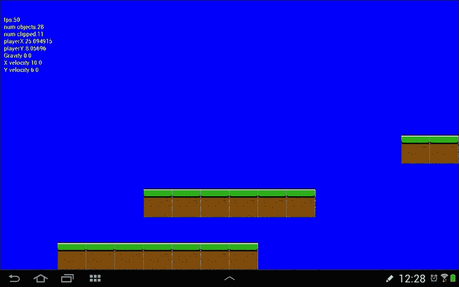
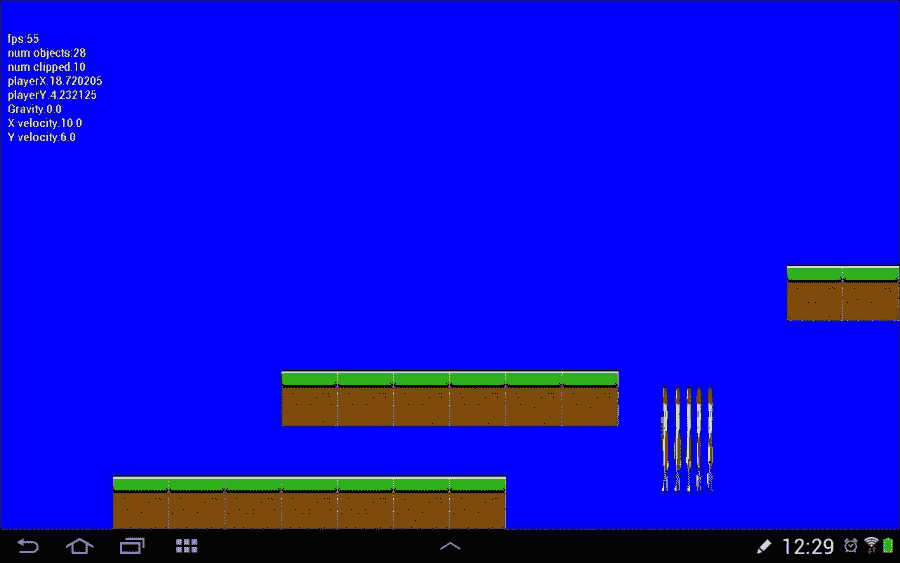
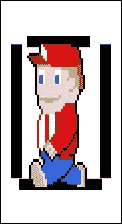
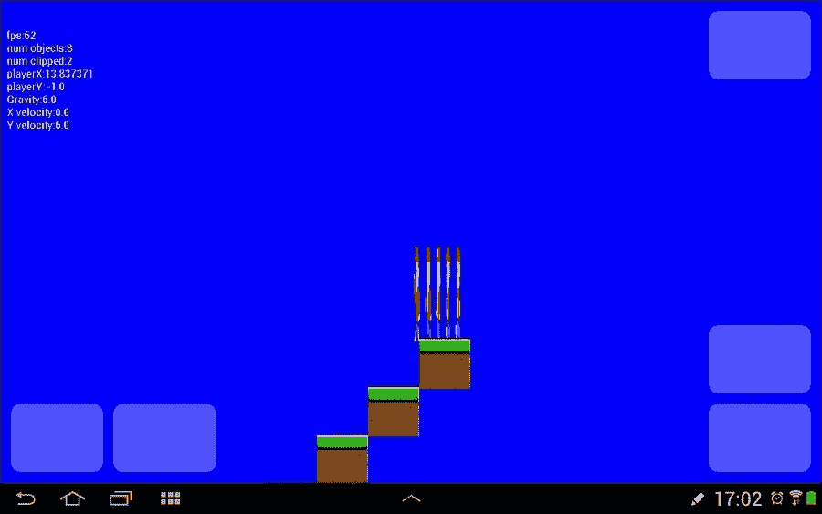
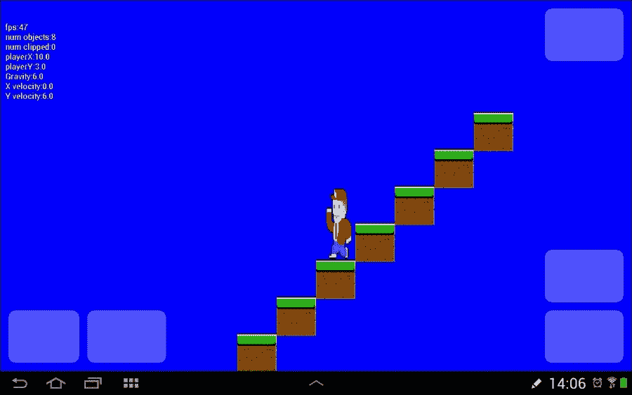

# 第六章：平台游戏 - Bob、哔哔声和碰撞

我们的 basic 游戏引擎设置好后，我们就可以开始快速进展了。在本章中，我们将快速添加一个`SoundManager`类，我们可以在任何需要的时候用它来发出声音。之后，我们将为 Bob 添加一些实质性的内容，并在`Player`类中实现我们所需的核心功能。然后，我们可以处理多阶段碰撞检测的第二阶段（剪辑后），让 Bob 具备站在平台上的有用技能。

在我们完成这项重大任务后，我们将通过实现`InputController`类将 Bob 的控制权交给玩家。Bob 终于能够到处跑和跳了。在本章结束时，我们将为 Bob 的精灵表制作动画，让他看起来真的在跑，而不是到处滑动。

# SoundManager 类

在接下来的几章中，我们将为各种事件添加声音效果。有时这些声音将直接在主`PlatformView`类中触发，但其他时候，它们需要在代码更远的角落中触发，比如`InputController`类，甚至是在`GameObject`类内部。我们将快速制作一个简单的`SoundManager`类，当需要哔哔声时，可以传递并按需使用。

创建一个新的 Java 类，将其命名为`SoundManager`。这个类有三个主要部分。在第一部分，我们简单地声明一个`SoundPool`对象和一些`int`变量，以保存每个声音效果的引用。以下是第一部分代码，声明和成员：

```java
import android.content.Context;
import android.content.res.AssetFileDescriptor;
import android.content.res.AssetManager;
import android.media.AudioManager;
import android.media.SoundPool;
import android.util.Log;

import java.io.IOException;

public class SoundManager {
    private SoundPool soundPool;
    int shoot = -1;
    int jump = -1;
    int teleport = -1;
    int coin_pickup = -1;
    int gun_upgrade = -1;
    int player_burn = -1;
    int ricochet = -1;
    int hit_guard = -1;
    int explode = -1;
    int extra_life = -1;
```

类的第二部分是`loadSound`方法，它毫不意外地将所有声音加载到内存中，准备播放。我们在`PlatformView`构造函数中初始化一个`SoundManager`对象后，将调用这个方法。接下来输入这段代码：

```java
public void loadSound(Context context){
    soundPool = new SoundPool(10, AudioManager.STREAM_MUSIC,0);
    try{
        //Create objects of the 2 required classes
        AssetManager assetManager = context.getAssets();
        AssetFileDescriptor descriptor;

        //create our fx
        descriptor = assetManager.openFd("shoot.ogg");
        shoot = soundPool.load(descriptor, 0);

        descriptor = assetManager.openFd("jump.ogg");
        jump = soundPool.load(descriptor, 0);

        descriptor = assetManager.openFd("teleport.ogg");
        teleport = soundPool.load(descriptor, 0);

        descriptor = assetManager.openFd("coin_pickup.ogg");
        coin_pickup = soundPool.load(descriptor, 0);

        descriptor = assetManager.openFd("gun_upgrade.ogg");
        gun_upgrade = soundPool.load(descriptor, 0);

        descriptor = assetManager.openFd("player_burn.ogg");
        player_burn = soundPool.load(descriptor, 0);

        descriptor = assetManager.openFd("ricochet.ogg");
        ricochet = soundPool.load(descriptor, 0);

        descriptor = assetManager.openFd("hit_guard.ogg");
        hit_guard = soundPool.load(descriptor, 0);

        descriptor = assetManager.openFd("explode.ogg");
        explode = soundPool.load(descriptor, 0);

        descriptor = assetManager.openFd("extra_life.ogg");
        extra_life = soundPool.load(descriptor, 0);

    }catch(IOException e){
        //Print an error message to the console
        Log.e("error", "failed to load sound files");

    }

}
```

最后，对于我们的`SoundManager`类，我们需要能够播放任何我们喜欢的声音。这个`playSound`方法只是简单地通过一个作为参数传递的字符串来切换。当我们有一个`SoundManager`对象时，我们可以通过一个合适的字符串参数简单地调用`playSound()`。

```java
public void playSound(String sound){
        switch (sound){
            case "shoot":
                soundPool.play(shoot, 1, 1, 0, 0, 1);
                break;

            case "jump":
                soundPool.play(jump, 1, 1, 0, 0, 1);
                break;

            case "teleport":
                soundPool.play(teleport, 1, 1, 0, 0, 1);
                break;

            case "coin_pickup":
                soundPool.play(coin_pickup, 1, 1, 0, 0, 1);
                break;

            case "gun_upgrade":
                soundPool.play(gun_upgrade, 1, 1, 0, 0, 1);
                break;

            case "player_burn":
                soundPool.play(player_burn, 1, 1, 0, 0, 1);
                break;

            case "ricochet":
                soundPool.play(ricochet, 1, 1, 0, 0, 1);
                break;

            case "hit_guard":
                soundPool.play(hit_guard, 1, 1, 0, 0, 1);
                break;

            case "explode":
                soundPool.play(explode, 1, 1, 0, 0, 1);
                break;

            case "extra_life":
                soundPool.play(extra_life, 1, 1, 0, 0, 1);
                break;

        }

    }
}// End SoundManager
```

在上一章你的新游戏引擎类之后，`PlatformView`类声明后声明一个类型为`SoundManager`的新对象。

```java
// Our new engine classes
private LevelManager lm;
private Viewport vp;
InputController ic;
SoundManager sm;

```

接下来，在`PlatformView`构造函数中初始化`SoundManager`对象，并调用`loadSound()`，如下所示：

```java
// Initialize the viewport
vp = new Viewport(screenWidth, screenHeight);

sm = new SoundManager();
sm.loadSound(context);

loadLevel("LevelCave", 15, 2);
```

你可以使用 BFXR 创建所有自己的声音，或者直接从`Chapter6/assets`文件夹复制我的。将所有声音复制到你的 Android Studio 项目的`assets`文件夹中。如果还不存在，请在项目的`src/main`文件夹中创建一个`assets`文件夹以实现这一点。

现在，我们可以在任何地方播放声音效果。是时候让我们的英雄 Bob 活灵活现了。

# 介绍 Bob

在这里，我们可以为你的`Player`类增加一些实质性的内容。不过，这不会是我们最后一次回顾`Player`类。现在，我们将添加必要的功能，让 Bob 能够移动。完成这一步后，我们将会添加代码，允许玩家使用即将到来的碰撞检测代码和`Animation`类。

首先，我们需要向`Player`类中添加一些成员。`Player`类需要知道它能移动多快，玩家何时按下左右控制键，以及它是否在掉落或跳跃。此外，`Player`类还需要知道它已经跳跃了多长时间，以及它应该跳跃多久。

下一个代码块为我们提供了监控所有这些事物的变量。我们很快就会看到，如何使用它们让 Bob 做出我们想要的行为。

现在，我们知道这些变量是干什么用的了。我们可以在类声明后直接添加这段代码，如下所示：

```java
public class Player extends GameObject {

 final float MAX_X_VELOCITY = 10;
 boolean isPressingRight = false;
 boolean isPressingLeft = false;

 public boolean isFalling;
 private boolean isJumping;
 private long jumpTime;
 private long maxJumpTime = 700;// jump 7 10ths of second

```

此外，还有一些其他与移动相关的条件我们需要跟踪，但它们在其他类中也会很有用。因此，我们将它们作为成员添加到`GameObject`类中。我们将跟踪当前的水平速度和垂直速度，对象面向的方向，以及以下变量来确定对象是否可以移动。

```java
private float xVelocity;
private float yVelocity;
final int LEFT = -1;
final int RIGHT = 1;
private int facing;
private boolean moves = false;
```

现在，在`GameObject`类中，我们将添加一个`move`方法。这个方法简单检查下 x 轴或 y 轴上的速度是否为零，如果不是，它就会通过改变对象的`worldLocation`来移动对象。这个方法使用速度（`xVelocity`或`yVelocity`）除以当前的每秒帧数来计算每帧移动的距离。这样可以确保无论当前的每秒帧数是多少，移动都是完全正确的。无论我们的游戏运行是否流畅，或者有所波动，或者安卓设备中的 CPU 性能强大与否，都没有关系。我们很快就会在`Player`类的`update`方法中调用这个`move`方法。在项目的后期，我们也会从其他类中调用它。

```java
void move(long fps){
        if(xVelocity != 0) {
            this.worldLocation.x += xVelocity / fps;
        }

        if(yVelocity != 0) {
            this.worldLocation.y += yVelocity / fps;
        }
    }
```

接下来，在`GameObject`类中，我们为之前添加的新变量准备了一堆 getter 和 setter 方法。唯一需要注意的是，两个速度变量（`setxVelocity`和`setyVelocity`）的 setter 在真正赋值之前会检查`if(moves)`。

```java
public int getFacing() {
  return facing;
}

public void setFacing(int facing) {
  this.facing = facing;
}

public float getxVelocity() {
  return xVelocity;
}

public void setxVelocity(float xVelocity) {
  // Only allow for objects that can move
  if(moves) {
    this.xVelocity = xVelocity;
  }
}

public float getyVelocity() {
  return yVelocity;
}

public void setyVelocity(float yVelocity) {
  // Only allow for objects that can move
  if(moves) {
    this.yVelocity = yVelocity;
  }
}

public boolean isMoves() {
  return moves;
}

public void setMoves(boolean moves) {
  this.moves = moves;
}

public void setActive(boolean active) {
  this.active = active;
}
```

现在，回到`Player`类的构造函数中，我们可以使用其中一些新方法在对象创建时进行设置。在`Player`构造函数中添加高亮显示的代码。

```java
setHeight(HEIGHT); // 2 metre tall
setWidth(WIDTH); // 1 metre wide

// Standing still to start with
setxVelocity(0);
setyVelocity(0);
setFacing(LEFT);
isFalling = false;

// Now for the player's other attributes
// Our game engine will use these
setMoves(true);
setActive(true);
setVisible(true);
//...

```

最后，我们可以在`Player`类的`update`方法中实际使用所有这些新代码。

首先，我们处理当`isPressingRight`或`isPressingLeft`为真时会发生什么。当然，我们还需要能够通过屏幕触摸来设置这些变量。很简单，下一个代码块如果`isPressingRight`为真，将水平速度设置为`MAX_X_VELOCITY`；如果`isPressingLeft`为真，则设置为`-MAX_X_VELOCITY`。如果都不为真，则将水平速度设置为零，即静止不动。

```java
public void update(long fps, float gravity) {
 if (isPressingRight) {
 this.setxVelocity(MAX_X_VELOCITY);
 } else if (isPressingLeft) {
 this.setxVelocity(-MAX_X_VELOCITY);
 } else {
 this.setxVelocity(0);
 }

```

接下来，我们检查玩家移动的方向，并调用`setFacing()`，参数为`RIGHT`或`LEFT`。

```java
//which way is player facing?
if (this.getxVelocity() > 0) {
  //facing right
  setFacing(RIGHT);
} else if (this.getxVelocity() < 0) {
  //facing left
  setFacing(LEFT);
}//if 0 then unchanged
```

现在，我们可以处理跳跃。当玩家按下跳跃按钮时，如果成功，`isJumping`将被设置为真，`jumpTime`将被设置为当前系统时间。这样，我们就可以在每一帧进入`if(isJumping)`块，测试鲍勃已经跳跃了多长时间，并且如果他没有超过`maxJumpTime`，就会采取两个可能动作之一。

动作一是：如果我们还没有跳到一半，*y*速度设置为`-gravity`（向上）。动作二是：如果鲍勃跳过一半了，他的*y*速度设置为`gravity`（向下）。

当超过`maxJumpTime`时，`isJumping`会被重新设置为假，直到下一次玩家点击跳跃按钮。以下代码中的最后一个`else`子句在`isJumping`为假时执行，并将玩家的`y`速度设置为`gravity`。注意，还有一行代码将`isFalling`设置为`true`。正如我们将要看到的，这个变量用于控制玩家初次尝试跳跃时以及我们碰撞检测代码部分会发生什么。它基本上阻止了玩家在空中跳跃。

```java
// Jumping and gravity
if (isJumping) {
  long timeJumping = System.currentTimeMillis() - jumpTime;
  if (timeJumping < maxJumpTime) {
    if (timeJumping < maxJumpTime / 2) {
      this.setyVelocity(-gravity);//on the way up
       } else if (timeJumping > maxJumpTime / 2) {
          this.setyVelocity(gravity);//going down
       }
  } else {
    isJumping = false;
  }
} else {
      this.setyVelocity(gravity);
      // Read Me!
      // Remove this next line to make the game easier
      // it means the long jumps are less punishing
      // because the player can take off just after the platform
      // They will also be able to cheat by jumping in thin air
      isFalling = true;
}
```

在处理完跳跃之后，我们立即调用`move()`来更新*x*和*y*坐标，如果它们有变化的话。

```java
 // Let's go!
 this.move(fps);
}// end update()
```

这有点复杂，但除了实际控制之外，它几乎包含了我们让玩家移动所需的一切。我们只需要从我们`PlatformView`类的`update`方法中每一帧调用一次`update()`方法，我们的玩家角色就会活跃起来。

在`PlatformView`类的`update`方法中，像这样添加以下高亮代码：

```java
// Set visible flag to true
go.setVisible(true);

if (lm.isPlaying()) {
 // Run any un-clipped updates
 go.update(fps, lm.gravity);
}

} else {
  // Set visible flag to false
  //...
```

接下来，我们可以看到正在发生什么。在`PlatformView`类的`draw`方法的`if(debugging)`块中添加一些更多的文本输出。像这里显示的那样添加新的高亮代码：

```java
canvas.drawText("playerY:" +   lm.gameObjects.get(lm.playerIndex).getWorldLocation().y,
  10, 140, paint);

canvas.drawText("Gravity:" + 
 lm.gravity, 10, 160, paint);

canvas.drawText("X velocity:" +   lm.gameObjects.get(lm.playerIndex).getxVelocity(), 
 10, 180, paint);

canvas.drawText("Y velocity:" +   lm.gameObjects.get(lm.playerIndex).getyVelocity(), 
 10, 200, paint);

//for reset the number of clipped objects each frame
```

现在为何不运行游戏呢？你可能已经注意到下一个问题是玩家不见了。



这是因为我们现在有了重力，而且调用`update()`的线程在应用程序启动时立即运行，甚至在我们完成关卡和玩家角色的设置之前。

我们需要做两件事。首先，我们只想在`LevelManager`类完成工作后运行`update()`。其次，我们需要在每一帧更新`Viewport`类的焦点，这样即使玩家正在掉入死亡（他经常这样做），屏幕也会以他为中心，这样我们就可以看到他的终结。

让我们从暂停模式开始游戏，这样玩家就不会错过。首先，我们将在`LevelManager`类中添加一个方法，该方法将切换游戏状态在玩与不玩之间。一个合适的名字可能是`switchPlayingStatus()`。按照如下所示，将新方法添加到`LevelManager`中：

```java
public void switchPlayingStatus() {
        playing = !playing;
        if (playing) {
            gravity = 6;
        } else {
            gravity = 0;
        }
    }
```

现在，删除或注释掉`LevelManager`构造函数中设置`playing`为`true`的那行代码。很快，这将会通过屏幕触摸和我们刚刚编写的方法来处理：

```java
// Load all the GameObjects and Bitmaps
loadMapData(context, pixelsPerMetre, px, py);

//playing = true;
//..
```

我们将编写一点临时代码，只是一点点。我们已经知道，我们最终会将监控玩家输入的责任委托给我们的新`InputController`类。在重写的`onTouchEvent`方法中，这点代码是值得的，因为我们可以立即使用暂停功能。

这段代码将在每次触摸屏幕时使用我们刚刚编写的方法切换游戏状态。将重写的方法添加到`PlatformView`类中。我们将在本章稍后替换其中一些代码。

```java
@Override
public boolean onTouchEvent(MotionEvent motionEvent) {
  switch (motionEvent.getAction() & MotionEvent.ACTION_MASK) {
    case MotionEvent.ACTION_DOWN:
         lm.switchPlayingStatus();
         break;
   }
return true;
}
```

你可以在`Player`类中将`isPressingRight`设置为`true`，然后运行游戏并点击屏幕。然后我们会看到玩家像幽灵一样从底部掉落，同时向屏幕右侧移动：



现在，让我们每帧更新视口，使其保持在玩家中心。将这段高亮代码添加到`PlatformView`类中的`update`方法的最后：

```java
if (lm.isPlaying()) {
    //Reset the players location as the centre of the viewport
    vp.setWorldCentre(lm.gameObjects.get(lm.playerIndex)
        .getWorldLocation().x,
        lm.gameObjects.get(lm.playerIndex)
        .getWorldLocation().y);}
}// End of update()
```

如果你现在运行游戏，尽管玩家仍然向右掉入厄运，但至少屏幕会聚焦在他身上，让我们看到这一过程。

我们将处理持续下落的问题。

# 多阶段碰撞检测

我们已经看到，我们的玩家角色会简单地穿过世界，落入虚无。当然，我们需要玩家能够站在平台上。以下是我们要采取的措施。

我们将为每个重要的对象提供一个碰撞箱，这样我们就可以在`Player`类中提供测试碰撞箱是否与玩家接触的方法。每帧一次，我们将发送所有未被视口剪辑的碰撞箱到这个新方法，在这里可以测试是否发生碰撞。

我们这样做有两个主要原因。首先，通过仅发送未剪辑的碰撞箱进行碰撞测试，我们大大减少了检查的数量，如第三章，*Tappy Defender – Taking Flight*中的“碰撞检测”部分所述。其次，通过在`Player`类中处理检查，我们可以给玩家多个不同的碰撞箱，并根据哪个被击中稍微有不同的反应。

让我们创建一个自己的碰撞箱类，这样我们可以按照自己的需求来定义它。它需要使用浮点坐标，还需要一个`intersects`方法和一些获取器和设置器。创建一个新类，将其命名为`RectHitbox`。

在这里，我们看到`RectHitbox`仅有一系列的自我解释的获取器和设置器。它还具有`intersects`方法，如果传递给它的`RectHitbox`与自身相交，则返回`true`。关于`intersects()`代码如何工作的解释，请参见第三章，*Tappy Defender – Taking Flight*。在新的类中输入以下代码：

```java
public class RectHitbox {
    float top;
    float left;
    float bottom;
    float right;
    float height;

    boolean intersects(RectHitbox rectHitbox){
        boolean hit = false;

        if(this.right > rectHitbox.left
                && this.left < rectHitbox.right ){
            // Intersecting on x axis

            if(this.top < rectHitbox.bottom
                    && this.bottom > rectHitbox.top ){
                // Intersecting on y as well
                // Collision
                hit = true;
            }
        }

        return hit;
    }

    public void setTop(float top) {
        this.top = top;
    }

    public float getLeft() {
        return left;
    }

    public void setLeft(float left) {
        this.left = left;
    }

    public void setBottom(float bottom) {
        this.bottom = bottom;
    }

    public float getRight() {
        return right;
    }

    public void setRight(float right) {
        this.right = right;
    }

    public float getHeight() {
        return height;
    }

    public void setHeight(float height) {
        this.height = height;
    }
}
```

现在，我们可以将`RectHitbox`类作为`GameObject`的一个成员添加。在类声明后直接添加它。

```java
private RectHitbox rectHitbox = new RectHitbox();
```

然后，我们添加一个方法来初始化碰撞箱，以及一个方法，以便在我们需要时获取它的副本。将这些两个方法添加到`GameObject`中：

```java
public void setRectHitbox() {
   rectHitbox.setTop(worldLocation.y);
   rectHitbox.setLeft(worldLocation.x);
   rectHitbox.setBottom(worldLocation.y + height);
   rectHitbox.setRight(worldLocation.x + width);
}

RectHitbox getHitbox(){
  return rectHitbox;
}
```

现在，对于我们的`Grass`对象，我们添加一个对`setRectHitbox()`的调用，然后我们就可以开始与之碰撞了。在`Grass`类的构造函数的最后，添加这一行高亮代码。调用`setRectHitbox()`需要在`setWorldLocation()`之后进行，否则碰撞箱将不会围绕草地块。

```java
// Where does the tile start
// X and y locations from constructor parameters
setWorldLocation(worldStartX, worldStartY, 0);
setRectHitbox();
}// End of Grass constructor
```

在我们开始理解进行碰撞检测的代码之前，需要让`Player`类拥有自己的碰撞箱集合。我们需要了解以下关于玩家角色的信息：

+   当头部撞到它上方的物体时

+   当脚部落在下方的平台上时

+   当玩家从两侧走进某物时

为此，我们将创建四个碰撞箱；一个用于头部，一个用于脚部，还有两个用于左右两侧。由于它们是玩家独有的，我们将在`Player`类中创建碰撞箱。

在`Player`类声明后立即声明四个碰撞箱作为成员：

```java
RectHitbox rectHitboxFeet;
RectHitbox rectHitboxHead;
RectHitbox rectHitboxLeft;
RectHitbox rectHitboxRight;
```

在构造函数中，我们调用新的`RectHitbox()`来准备它们。注意我们还没有给碰撞箱赋值。我们很快就会看到如何操作。在`Player`构造函数的最后，像这样添加四个对`new()`的调用：

```java
rectHitboxFeet = new RectHitbox();
rectHitboxHead = new RectHitbox();
rectHitboxLeft = new RectHitbox();
rectHitboxRight = new RectHitbox();
```

我们将看到如何正确初始化它们。下面代码中的碰撞箱值是基于实际角色形状在表示每个角色帧的矩形中所占空间手动估算的。如果你使用不同的角色图形，你可能需要调整你使用的精确值。

图表显示了每个碰撞箱将定位的大致图形表示位置。左侧和右侧碰撞箱看起来距离较远，是因为动画的不同帧比这一帧稍微宽一些。这是一个折中方案。



代码必须在`Player`类中的`update`方法内调用`move()`之后的位置。这样，每次玩家位置改变时都会更新碰撞箱。在显示的确切位置添加高亮代码，这样我们就更接近能够开始碰撞到各种东西了。

```java
// Let's go!
this.move(fps);

// Update all the hitboxes to the new location
// Get the current world location of the player
// and save them as local variables we will use next
Vector2Point5D location = getWorldLocation();
float lx = location.x;
float ly = location.y;

//update the player feet hitbox
rectHitboxFeet.top = ly + getHeight() * .95f;
rectHitboxFeet.left = lx + getWidth() * .2f;
rectHitboxFeet.bottom = ly + getHeight() * .98f;
rectHitboxFeet.right = lx + getWidth() * .8f;

// Update player head hitbox
rectHitboxHead.top = ly;
rectHitboxHead.left = lx + getWidth() * .4f;
rectHitboxHead.bottom = ly + getHeight() * .2f;
rectHitboxHead.right = lx + getWidth() * .6f;

// Update player left hitbox
rectHitboxLeft.top = ly + getHeight() * .2f;
rectHitboxLeft.left = lx + getWidth() * .2f;
rectHitboxLeft.bottom = ly + getHeight() * .8f;
rectHitboxLeft.right = lx + getWidth() * .3f;

// Update player right hitbox
rectHitboxRight.top = ly + getHeight() * .2f;
rectHitboxRight.left = lx + getWidth() * .8f;
rectHitboxRight.bottom = ly + getHeight() * .8f;
rectHitboxRight.right = lx + getWidth() * .7f;

}// End update()
```

在下一阶段，我们可以检测到一些碰撞并对它们做出反应。仅涉及玩家的碰撞，比如跌落、撞头或者试图穿墙，都将在下一个方法中直接处理，该方法位于`Player`类中。请注意，该方法还返回一个`int`值来表示是否发生碰撞以及碰撞发生在玩家的哪个部位，以便处理与其他物体（如拾取物或火坑）的碰撞。

新的`checkCollisions`方法接收一个`RectHitbox`作为参数。这将是我们当前正在检查碰撞的任何对象的`RectHitbox`。将`checkCollisions`方法添加到`Player`类中。

```java
public int checkCollisions(RectHitbox rectHitbox) {
    int collided = 0;// No collision

    // The left
    if (this.rectHitboxLeft.intersects(rectHitbox)) {
        // Left has collided
        // Move player just to right of current hitbox
        this.setWorldLocationX(rectHitbox.right - getWidth() * .2f);
        collided = 1;
    }

    // The right
    if (this.rectHitboxRight.intersects(rectHitbox)) {
        // Right has collided
        // Move player just to left of current hitbox
        this.setWorldLocationX(rectHitbox.left - getWidth() * .8f);
        collided = 1;
    }

    // The feet
    if (this.rectHitboxFeet.intersects(rectHitbox)) {
        // Feet have collided
        // Move feet to just above current hitbox
        this.setWorldLocationY(rectHitbox.top - getHeight());
        collided = 2;
    }

    // Now the head
    if (this.rectHitboxHead.intersects(rectHitbox)) {
        // Head has collided. Ouch!
        // Move head to just below current hitbox bottom
        this.setWorldLocationY(rectHitbox.bottom);
        collided = 3;
    }

    return collided;
}
```

如前述代码所示，我们需要向`GameObject`类中添加一些 setter 方法，以便在检测到碰撞时可以更改*x*和*y*世界坐标。向`GameObject`类添加以下两个方法：

```java
public void setWorldLocationY(float y) {
  this.worldLocation.y = y;
}

public void setWorldLocationX(float x) {
  this.worldLocation.x = x;
}
```

最后一步是选择所有相关对象并进行碰撞测试。我们在`PlatformView`类的`update`方法中进行这项操作，然后根据哪个身体部位与哪种对象类型发生碰撞来进一步采取行动。由于我们只有一个可能与草地平台发生碰撞的对象类型，因此我们的 switch 块最初只会有一个默认情况。请注意，当检测到脚部发生碰撞时，我们将`isFalling`变量设置为`false`，使玩家能够跳跃。在显示的位置输入高亮代码：

```java
// Set visible flag to true
go.setVisible(true);

// check collisions with player
int hit = lm.player.checkCollisions(go.getHitbox());
if (hit > 0) {
 //collision! Now deal with different types
 switch (go.getType()) {

 default:// Probably a regular tile
 if (hit == 1) {// Left or right
 lm.player.setxVelocity(0);
 lm.player.setPressingRight(false);
 }

 if (hit == 2) {// Feet
 lm.player.isFalling = false;
 }

 break;
 }
}

```

### 注意事项

随着这个项目的进行，我们将更多地利用在`hit`中存储的值进行基于碰撞的决策。

让我们真正地控制玩家。

# 玩家输入

首先，在`Player`类中添加一些方法，我们的输入控制器将能够调用这些方法，然后操作`Player`类的`update`方法用来移动的变量。

我们已经玩过了`isPressingRight`变量，也有一个`isPressingLeft`变量。此外，我们希望能够跳跃。如果你查看`Player`类的`update`方法，我们已经有处理这些情况的代码了。我们只需要玩家能够通过触摸屏幕来启动这些动作。

我们之前的按钮布局设计和到目前为止编写的代码，暗示了一种向左走的方法，一种向右走的方法，以及一种跳跃的方法。

你还会注意到，我们将`SoundManager`的副本传递给`startJump`方法，这使得如果跳跃尝试成功，我们可以播放一个整洁的复古跳跃声音。

```java
public void setPressingRight(boolean isPressingRight) {
        this.isPressingRight = isPressingRight;
    }

    public void setPressingLeft(boolean isPressingLeft) {
        this.isPressingLeft = isPressingLeft;
    }

    public void startJump(SoundManager sm) {
        if (!isFalling) {//can't jump if falling
            if (!isJumping) {//not already jumping
                isJumping = true;
                jumpTime = System.currentTimeMillis();
                sm.playSound("jump");
            }
        }
    }
```

现在，我们可以专注于`InputController`类。让我们从`onTouchEvent`方法中将控制权传递给我们的`InputController`类。在`PlatformView`类中更改`onTouchEvent`方法的代码如下：

```java
@Override
    public boolean onTouchEvent(MotionEvent motionEvent) {
        if (lm != null) {
            ic.handleInput(motionEvent, lm, sm, vp);
        }
        //invalidate();
        return true;
    }
```

我们的新方法中有一个错误。这仅仅是因为我们调用了`handleInput`方法，但还没有实现它。我们现在就来做这件事。

### 注意

如果你好奇为什么需要检查`lm != null`，这是因为`onTouchEvent`方法是从 Android UI 线程触发的，不在我们的控制范围内。如果我们传入`lm`并尝试用它做事情，而它尚未初始化，游戏将会崩溃。

我们现在可以在`InputController`类中完成我们需要做的一切。现在打开这个类，我们将计划我们要做什么。

我们需要一个向左的按钮，一个向右的按钮，一个跳跃按钮，一个切换暂停的按钮，稍后我们还需要一个发射机枪的按钮。因此，我们确实需要突出屏幕的不同区域来代表这些任务。

为了实现这一点，我们将声明四个`Rect`对象，每个任务一个。然后在构造函数中，我们将通过基于玩家屏幕分辨率进行一些简单的计算来定义这四个`Rect`对象的点。

我们根据设备屏幕分辨率定义了一些方便的变量，`buttonWidth`、`buttonHeight`和`buttonPadding`，以帮助我们整齐地排列`Rect`坐标。输入以下成员和`InputController`构造函数，如下所示：

```java
import android.graphics.Rect;
import android.view.MotionEvent;
import java.util.ArrayList;

public class InputController {

    Rect left;
    Rect right;
    Rect jump;
    Rect shoot;
    Rect pause;

    InputController(int screenWidth, int screenHeight) {

        //Configure the player buttons
        int buttonWidth = screenWidth / 8;
        int buttonHeight = screenHeight / 7;
        int buttonPadding = screenWidth / 80;

        left = new Rect(buttonPadding,
            screenHeight - buttonHeight - buttonPadding,
            buttonWidth,
            screenHeight - buttonPadding);

        right = new Rect(buttonWidth + buttonPadding,
            screenHeight - buttonHeight - buttonPadding,
            buttonWidth + buttonPadding + buttonWidth,
            screenHeight - buttonPadding);

        jump = new Rect(screenWidth - buttonWidth - buttonPadding,
            screenHeight - buttonHeight - buttonPadding -                           
            buttonHeight - buttonPadding,
            screenWidth - buttonPadding,
            screenHeight - buttonPadding - buttonHeight -                           
            buttonPadding);

        shoot = new Rect(screenWidth - buttonWidth - buttonPadding,
            screenHeight - buttonHeight - buttonPadding,
            screenWidth - buttonPadding,
            screenHeight - buttonPadding);

        pause = new Rect(screenWidth - buttonPadding -                          
            buttonWidth,
            buttonPadding,
            screenWidth - buttonPadding,
            buttonPadding + buttonHeight);

    }
```

我们将使用这四个`Rect`对象在屏幕上绘制按钮。`draw`方法将需要它们的副本。输入`getButtons`方法的代码以实现这一点：

```java
public ArrayList getButtons(){
   //create an array of buttons for the draw method
   ArrayList<Rect> currentButtonList = new ArrayList<>();
   currentButtonList.add(left);
   currentButtonList.add(right);
   currentButtonList.add(jump);
   currentButtonList.add(shoot);
   currentButtonList.add(pause);
   return  currentButtonList;
}
```

我们现在可以处理实际的玩家输入。这个项目与上一个项目不同，因为有大量不同的玩家动作需要监控和响应，有时是同时进行的。正如你所期望的，Android API 具有使这尽可能简单的功能。

`MotionEvent`类中隐藏的数据比我们目前看到的要多。之前，我们只是检查了`ACTION_DOWN`和`ACTION_UP`事件。现在，我们需要更深入地挖掘以获取更多的事件数据。

为了记录和传递多个手指在屏幕上触摸、离开和移动的详细信息，`MotionEvent` 类将它们都存储在一个数组中。当玩家的第一个手指触摸屏幕时，详细信息、坐标等存储在位置零。后续动作随后存储在数组的后面。

与任何手指活动相关的数组中的位置并不一致。在某些情况下，例如检测特定的手势时，这可能是个问题，程序员需要捕获、记住并响应对应于 `MotionEvent` 类中保存的手指 ID。

幸运的是，在这种情况下，我们有明确定义的屏幕区域来表示我们的按钮，我们最多需要知道的是，玩家的手指是否在这些预定义的区域内按下或释放了屏幕。

我们只需通过调用 `motionEvent.getPointerCount()` 来找出导致事件的手指数量，进而得知它们存储在数组中的情况。然后，我们遍历这些事件，并提供一个 `switch` 代码块来处理它们，无论在屏幕的哪个区域发生了 `ACTION_DOWN` 或 `ACTION_UP`。只要我们能够检测到事件并对其作出响应，事件存储在数组的哪个位置都无关紧要。

在我们编写解决方案的代码之前，还需要了解的另外一点是，数组中后续的动作被存储为 `ACTION_POINTER_DOWN` 和 `ACTION_POINTER_UP`；因此，在即将编写的循环中，每次通过时，我们都需要检查并处理 `ACTION_DOWN` 和 `ACTION_POINTER_DOWN`。

在所有这些讨论之后，以下是每次屏幕被触摸或释放时调用的 `handleInput` 方法：

```java
public void handleInput(MotionEvent motionEvent,LevelManager l,     
  SoundManager sound, Viewport vp){

    int pointerCount = motionEvent.getPointerCount();

    for (int i = 0; i < pointerCount; i++) {

        int x = (int) motionEvent.getX(i);
        int y = (int) motionEvent.getY(i);

        if(l.isPlaying()) {
            switch  (motionEvent.getAction() &
            MotionEvent.ACTION_MASK) {

            case MotionEvent.ACTION_DOWN:
                    if (right.contains(x, y)) {
                    l.player.setPressingRight(true);
                    l.player.setPressingLeft(false);

                    } else if (left.contains(x, y)) {
                    l.player.setPressingLeft(true);
                    l.player.setPressingRight(false);

                    } else if (jump.contains(x, y)) {
                    l.player.startJump(sound);

                    } else if (shoot.contains(x, y)) {

                    } else if (pause.contains(x, y)) {
                    l.switchPlayingStatus();
                    }

                break;

                case MotionEvent.ACTION_UP:
                    if (right.contains(x, y)) {
                    l.player.setPressingRight(false);

                    } else if (left.contains(x, y)) {
                    l.player.setPressingLeft(false);
                }

                break;

                case MotionEvent.ACTION_POINTER_DOWN:
                if (right.contains(x, y)) {
                    l.player.setPressingRight(true);
                    l.player.setPressingLeft(false);

                    } else if (left.contains(x, y)) {
                    l.player.setPressingLeft(true);
                        l.player.setPressingRight(false);

                    } else if (jump.contains(x, y)) {
                    l.player.startJump(sound);

                    } else if (shoot.contains(x, y)) {
                    //Handle shooting here

                    } else if (pause.contains(x, y)) {
                    l.switchPlayingStatus();
                }

                    break;

                case MotionEvent.ACTION_POINTER_UP:
                    if (right.contains(x, y)) {
                    l.player.setPressingRight(false);
                   //Log.w("rightP:", "up" );

                    } else if (left.contains(x, y)) {
                    l.player.setPressingLeft(false);
                   //Log.w("leftP:", "up" );

                    } else if (shoot.contains(x, y)) {
                    //Handle shooting here
                    } else if (jump.contains(x, y)) {
                   //Handle more jumping stuff here later
                }

                break;
}// End if(l.playing)

}else {// Not playing
    //Move the viewport around to explore the map
    switch (motionEvent.getAction() & MotionEvent.ACTION_MASK) {

    case MotionEvent.ACTION_DOWN:

        if (pause.contains(x, y)) {
            l.switchPlayingStatus();
            //Log.w("pause:", "DOWN" );
        }

      break;
            }
        }
    }
}
}
```

### 注意

如果你好奇为什么我们要设置两组控制代码，一组用于播放，一组用于不播放，那是因为在第八章《组合在一起》中，我们将为游戏暂停时添加一个很酷的新功能。当然，`togglePlayingStatus` 方法不必这样做，即使没有播放状态的检测也能正常工作。这只是为我们稍后对代码进行微小的精细修改节省时间。

现在，我们需要做的就是打开 `PlatformView` 类，获取包含所有控制按钮的数组副本，并将它们绘制到屏幕上。我们使用 `drawRoundRect` 方法绘制整洁的圆角矩形，以表示屏幕上将对玩家的触摸作出响应的区域。在 `draw` 方法的 `unlockCanvasAndPost()` 调用之前输入以下代码：

```java
//draw buttons
paint.setColor(Color.argb(80, 255, 255, 255));
ArrayList<Rect> buttonsToDraw;
buttonsToDraw = ic.getButtons();

for (Rect rect : buttonsToDraw) {
  RectF rf = new RectF(rect.left, rect.top, 
    rect.right, rect.bottom);

    canvas.drawRoundRect(rf, 15f, 15f, paint);
}
```

同样，在我们调用 `unlockCanvasAndPost()` 之前，让我们绘制一个简单的暂停屏幕，这样我们就可以知道游戏是暂停还是正在播放。

```java
//draw paused text
if (!this.lm.isPlaying()) {
    paint.setTextAlign(Paint.Align.CENTER);
    paint.setColor(Color.argb(255, 255, 255, 255));

    paint.setTextSize(120);
    canvas.drawText("Paused", vp.getScreenWidth() / 2,                       
    vp.getScreenHeight() / 2, paint);
}
```

现在你可以到处跳跃和行走，同时还会播放一段不错的复古跳跃音效。为何不通过编辑`LevelCave`并向场景中添加更多草地，用一些`1`字符替换几个句点（`.`）字符呢？下一张截图显示了玩家已经跳跃了一段时间，以及用于控制的按钮：



### 注意

我们将设计一些真正可玩的游戏关卡，并在第八章，*将其全部组合在一起*中链接它们。现在，只需用`LevelCave`做任何看起来有趣的事情。

现在，我们可以摆脱那个难看的压缩玩家图像，并使其成为一个整洁的小动画。

# 动画鲍勃

精灵表动画通过快速更改屏幕上绘制的图像来工作。这就像一个孩子在书本的角落里画出火柴人的动作阶段，然后快速翻动书本，使其看起来像是在移动。

鲍勃的动画帧已经包含在我们一直用来表示他的`player.png`文件中。


我们需要做的就是在玩家移动时逐个遍历这些帧。

实现这一点非常直接。我们将制作一个简单的动画类，处理保持时间和在请求时返回精灵表适当部分的功能。然后，我们可以为任何需要动画的`GameObject`初始化一个新的动画对象。此外，当它们在`PlatformView`的`draw`方法中被绘制时，如果对象是动画的，我们将稍微不同地处理它。

在本节中，我们还将了解如何使用面对变量来跟踪玩家面向的方向。它将使我们能够根据玩家（或任何未来的动画对象）前进的方向来反转精灵表。

让我们先创建一个动画类。创建一个新的 Java 类，将其命名为`Animation`。接下来的代码将声明用于操作位图的变量、位图名称以及一个`rect`参数，以定义精灵表当前相关动画帧的区域坐标。

此外，我们还有`frameCount`、`currentFrame`、`frameTicker`和`framePeriod`，它们分别保存和控制可用的帧数、当前帧编号以及帧变化的时间。如您所料，我们还需要知道动画帧的宽度和高度，这些由`frameWidth`和`frameHeight`保存。

此外，`Animation`类将经常引用每米的像素数；因此，将这个值保存在成员变量中是有意义的。

我们来输入在`Animation`类中讨论过的成员变量：

```java
import android.content.Context;
import android.graphics.Bitmap;
import android.graphics.Rect;

public class Animation {
    Bitmap bitmapSheet;
    String bitmapName;
    private Rect sourceRect;
    private int frameCount;
    private int currentFrame;
    private long frameTicker;
    private int framePeriod;
    private int frameWidth;
    private int frameHeight;
    int pixelsPerMetre;
```

接下来，我们有构造函数，它为我们的动画对象做好准备。我们很快就会看到如何为实际动画做准备。注意，签名中有相当多的参数，表明动画是相当可配置的。只需注意，这里的 FPS 不是指游戏的帧率，而是指动画的帧率。

```java
Animation(Context context, 
  String bitmapName, float frameHeight, 
  float frameWidth, int animFps, 
  int frameCount, int pixelsPerMetre){

   this.currentFrame = 0;
   this.frameCount = frameCount;
   this.frameWidth = (int)frameWidth * pixelsPerMetre;
   this.frameHeight = (int)frameHeight * pixelsPerMetre;
   sourceRect = new Rect(0, 0, this.frameWidth, this.frameHeight);

   framePeriod = 1000 / animFps;
   frameTicker = 0l;
   this.bitmapName = "" + bitmapName;
   this.pixelsPerMetre = pixelsPerMetre;
}
```

我们可以处理类的实际功能。`getCurrentFrame`方法首先检查对象是否在移动或是否能够移动。在这个阶段，这可能看起来有点奇怪，因为该方法只会被一个已动画化的`GameObject`类调用。因此，这个奇怪的检查是确定此刻是否需要一个新帧。

如果一个对象移动（比如 Bob），但处于静止状态，那么我们不需要改变动画的帧。然而，如果一个动画对象从不具有速度，比如熊熊燃烧的火焰，那么我们需要一直动画它。它永远不会有任何速度，所以`moves`变量将是`false`，但方法将继续执行。

该方法然后使用`time`、`frameTicker`和`framePeriod`来确定是否到了显示动画下一帧的时间，并递增要显示的帧号。然后，如果动画在最后一帧，它会回到第一帧。

最后，计算代表精灵表中包含所需帧的精确左右位置，并将这些位置返回给调用代码。

```java
public Rect getCurrentFrame(long time, 
    float xVelocity, boolean moves){

    if(xVelocity!=0 || moves == false) {
    // Only animate if the object is moving 
    // or it is an object which doesn't move
    // but is still animated (like fire)

        if (time > frameTicker + framePeriod) {
            frameTicker = time;
            currentFrame++;
            if (currentFrame >= frameCount) {
                currentFrame = 0;
            }
        }
    }

    //update the left and right values of the source of
    //the next frame on the spritesheet
    this.sourceRect.left = currentFrame * frameWidth;
    this.sourceRect.right = this.sourceRect.left + frameWidth;

    return sourceRect;

}

}// End of Animation class
```

接下来，我们可以向`GameObject`类添加一些成员。

```java
// Most objects only have 1 frame
// And don't need to bother with these
private Animation anim = null;
private boolean animated;
private int animFps = 1;
```

一些与我们的`Animation`类交互的方法，设置和获取变量，使动画工作，并通知`draw`方法对象是否已动画化。

```java
public void setAnimFps(int animFps) {
  this.animFps = animFps;
}

public void setAnimFrameCount(int animFrameCount) {
  this.animFrameCount = animFrameCount;
}

public boolean isAnimated() {
  return animated;
}
```

最后，在`GameObject`中，有一个方法，需要动画的对象可以使用它来设置它们的整个动画对象。注意，是`setAnimated`方法在一个新的动画对象上调用`new()`。

```java
public void setAnimated(Context context, int pixelsPerMetre,  
  boolean animated){

 this.animated = animated;
 this.anim = new Animation(context, bitmapName,
     height,
     width,
     animFps,
     animFrameCount,
     pixelsPerMetre );
}
```

下一个方法作为`PlatformView`类的`draw`方法和`Animation`类的`getRectToDraw`方法之间的中介。

```java
public Rect getRectToDraw(long deltaTime){
  return anim.getCurrentFrame(
    deltaTime, 
    xVelocity, 
    isMoves());
}
```

然后，我们需要更新`Player`类，以便根据其特定的帧数和每秒帧数初始化其动画对象。`Player`类中的新代码如下所示：

```java
setBitmapName("player");

final int ANIMATION_FPS = 16;
final int ANIMATION_FRAME_COUNT = 5;

// Set this object up to be animated
setAnimFps(ANIMATION_FPS);
setAnimFrameCount(ANIMATION_FRAME_COUNT);
setAnimated(context, pixelsPerMetre, true);

// X and y locations from constructor parameters
setWorldLocation(worldStartX, worldStartY, 0);
```

我们可以使用`draw`方法中的所有新代码来实现我们的动画。下一块代码检查当前正在绘制的`GameObject`是否`isAnimated()`。如果是，它通过`GameObject`类的`getRectToDraw`方法使用`getNextRect()`方法从精灵表中获取适当的矩形。

注意，从原始的`draw`方法中调用`drawBitmap()`的下一行代码，现在被包裹在新代码末尾的一个`else`子句中。基本上，逻辑是这样的：如果需要动画，执行新代码，否则按常规方式处理。

除了我们已知的动画代码外，我们还检查 `if(go.getFacing() == 1)` 并使用 `Matrix` 类在必要时通过 *x* 轴缩放 -1 来翻转位图。

这里是所有新代码，包括原始的 `drawBitmap()` 调用，在最后的 `else` 子句中进行了包装：

```java
toScreen2d.set(vp.worldToScreen
  go.getWorldLocation().x,
  go.getWorldLocation().y,
  go.getWidth(),
  go.getHeight()));

if (go.isAnimated()) {
 // Get the next frame of the bitmap
 // Rotate if necessary
 if (go.getFacing() == 1) {
 // Rotate
 Matrix flipper = new Matrix();
 flipper.preScale(-1, 1);
 Rect r = go.getRectToDraw(System.currentTimeMillis());
 Bitmap b = Bitmap.createBitmap(
 lm.bitmapsArray[lm.getBitmapIndex(go.getType())],
 r.left,
 r.top,
 r.width(),
 r.height(),
 flipper,
 true);
 canvas.drawBitmap(b, toScreen2d.left, toScreen2d.top, paint);
} else {
 // draw it the regular way round
 canvas.drawBitmap(
 lm.bitmapsArray[lm.getBitmapIndex(go.getType())],
 go.getRectToDraw(System.currentTimeMillis()),
 toScreen2d, paint);
}
} else { // Just draw the whole bitmap
 canvas.drawBitmap(
 lm.bitmapsArray[lm.getBitmapIndex(go.getType())],
 toScreen2d.left,
 toScreen2d.top, paint);
}

```

现在，您可以运行游戏，并看到 Bob 的所有动画效果。截图无法展示他的动作，但您可以看到他现在形态完美：



# 总结

我们的游戏正在稳步成型。在这个阶段，我们可以在 `LevelCave` 中构建一个巨大的关卡设计，并在各处奔跑跳跃。然而，我们会推迟尝试使游戏可玩，直到我们添加了更多整洁的特性为止。

这些整洁的特性将包括一挺机关枪，这挺枪可以通过收集升级物品和 Bob 可以射击的一些敌人来进行升级。我们将在下一章开始介绍这些内容。
