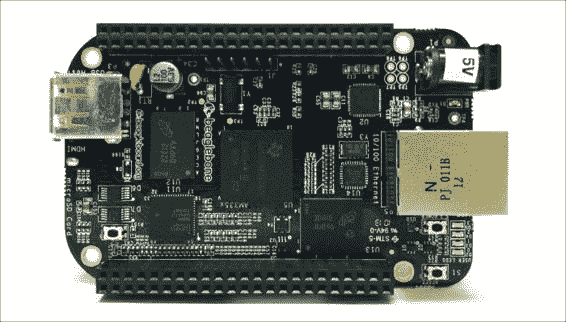
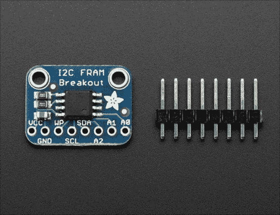
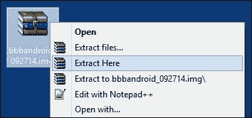
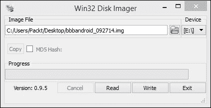

# 第一章. Android 和 BeagleBone Black 介绍

在这本书中，你将学习如何将 Android 安装到 microSD 卡上，以便与 BeagleBone Black 配合使用，并创建与连接到 BeagleBone Black 的外部硬件接口的 Android 应用。你将开发软件，通过按钮和传感器从外部世界接收输入，从外部存储芯片存储和检索数据，以及点亮外部 LED。更棒的是，你将学会以灵活的方式进行这些操作，可以轻松集成到你的应用中。

当你探索将硬件与 Android 接口的世界时，你会发现它涵盖了许多不同的专业知识领域。理解电子电路，以及如何将它们与 BeagleBone Black 接口，理解 Linux 内核，以及开发 Android 应用只是其中的几个领域。幸运的是，你不需要在这些领域成为专家就能学习到将硬件与 Android 接口的基础知识。我们已尽最大努力指导你通过本书中的例子，而无需深入了解 Linux 内核或电子理论。

在本章中，我们将介绍以下主题：

+   回顾 Android 和 BeagleBone Black 的开发

+   购买必要的硬件设备

+   了解你将要接口的硬件

+   在 BeagleBone Black 上安装 Android

# 回顾 Android 和 BeagleBone Black 的开发

Android 操作系统已经风靡全球。自从 2007 年以测试版的形式向世界介绍以来，它已经发展成为占主导地位的移动电话操作系统。除了手机，它还被用于平板电脑（如 Barnes & Noble Nook 电子阅读器和 Tesco Hudl 平板电脑）和各种其他嵌入式多媒体设备。该操作系统在多年的发展中增加了新功能，但仍然具有最初构想时的相同的主要设计原则。它提供了一个轻量级的操作系统，具有触摸屏界面，可以快速轻松地访问多媒体应用程序，同时使用最少的资源。

除了其普遍的受欢迎程度外，Android 还有许多优势，使其成为你项目的优秀操作系统。Android 的源代码是开源的，可以从[`source.android.com`](http://source.android.com)免费获取。你可以免费在任何你创造的产品中使用它。Android 使用了流行的 Linux 内核，因此你在 Linux 方面的任何专业知识都将帮助你进行 Android 开发。有一个文档齐全的接口 API，使得为 Android 开发变得简单直接。

基于 Android 的设备的广泛普及激发了对开发针对 Android 的软件应用程序（或应用）的极大兴趣。开发 Android 应用变得更容易了。Eclipse **Android Development Tools (ADT)** 允许应用开发者在模拟的 Android 设备环境中原型化软件，然后执行该软件。然而，模拟设备在速度和外观上与真实硬件存在细微（有时是显著）的差异。幸运的是，有一个功能强大且成本低的硬件平台可以让你快速轻松地在真实硬件上测试你的应用：那就是 BeagleBone Black。

由**CircuitCo**为 BeagleBoard.org 非盈利组织生产的**BeagleBone Black (BBB)** 硬件平台是开源硬件领域的新成员。自 2013 年首次生产以来，这款基于 ARM 的低成本单板计算机是对原有 BeagleBone 平台的改进。BBB 在原版 BeagleBone 板的基础上进行了改进，提供了增强的处理能力、内置 HDMI 视频以及 2 或 4 GB（取决于 BBB 的版本）的板载 eMMC 内存。BBB 专注于小型化以及广泛的扩展和接口机会，以非常低的价格提供了大量的处理能力。以下图片展示了一个典型的 BBB：



BeagleBone Black（来源：[www.beagleboard.org](http://www.beagleboard.org)）

Android 运行在廉价的 BBB 上，这使得它成为一个优秀的硬件平台，用于探索 Android 并开发你自己的定制 Android 项目，例如，如果你有一个 Android 自助服务终端设备、手持游戏机或其他多媒体设备的主意。Android 和 BBB 的结合将使你能够快速且低成本地原型这些设备。

既然我们已经快速地了解了 BBB 和 Android，让我们看看你需要哪些硬件才能充分利用它们。

# 购买硬件必需品

当你购买 BBB 时，你将只会收到主板和一根 USB 线，用于供电和与它通信。在开始使用 BBB 进行任何严肃的硬件接口项目软件开发之前，你还需要一些额外的硬件设备。在我们看来，购买这些物品的最佳地点是**AdaFruit**（[www.adafruit.com](http://www.adafruit.com)）。几乎这里的一切都可以从这个单一来源获得，而且他们的客户服务非常好。实际上，这里列出的许多物品都可以从 AdaFruit 购买到 BeagleBone Black 入门套件（产品 ID 703）。入门套件不含 3.3 V **Future Technology Devices International (FTDI)** 电缆，但它确实包含了 BeagleBone Black 本身。


来自 AdaFruit 的 BeagleBone Black 入门套件内容（来源：[www.adafruit.com](http://www.adafruit.com)）

## FTDI 电缆

一个 3.3 伏的 FTDI 电缆（产品编号 70）可以让你查看 BBB 的所有串行调试输出。如果你进行任何认真的开发，你必须拥有这样一条电缆。如果你想观察 BBB 的启动过程（包括引导加载程序和内核输出，系统初始化时），这条电缆是必不可少的，它还提供了一个到 Linux 和 Android 的命令行外壳。这个外壳可以帮助你排除启动问题，因为当网络连接不可用，或者没有通信服务运行时，你总有一种与系统交互的方法。

## 电源供应

尽管 BBB 可以通过 USB 电缆供电，但这种方法提供的电力仅够运行 BBB。如果你使用外部扩展板，或者连接从 BBB 的 5 伏引脚获取电源的外部电路，你必须使用外部电源。BeagleBoard.org 规定，电源必须是一个 2 安培、5 伏直流电源，带有 2.1 毫米的圆筒形连接器，中心为正极。AdaFruit 出售符合 BBB 要求的电源（产品编号 276）。

## 面包板和安装板

如果你能够轻松快速地构建电路，而不必担心焊接，那么电子实验会变得简单得多。因此，我们建议你投资一个面包板和一些面包板跳线（产品编号 153）。你的面包板不必很大或花哨，但你应该至少使用一个标准半尺寸的面包板（产品编号 64）来进行本书中给出的项目。

AdaFruit 原型板（产品编号 702）是我们建议你额外购买的物品。原型板是一个塑料板，可以将 BBB 和半个尺寸的面包板固定在上面。这有助于你避免意外拉伸或断开连接电子电路到 BBB 的电线。使用原型板可以使你简单无痛地重新定位 BBB 和面包板。

## MicroSD 卡

如果你经常使用 BBB，你总会想要身边有几张额外的 microSD 卡！Android 可以安装在一个 8GB 的 microSD 卡上，并且还有足够的空间来存放你自己的应用程序。你可以将一个 Android 镜像写入更大的 microSD 卡，但大多数预先制作的 Android 系统镜像只会占用卡上最初 4-8GB 的空间。由于大多数笔记本电脑和台式机不直接接受 microSD 卡，你应该至少拥有一张 microSD 到 SD 卡的适配器。幸运的是，这些适配器通常与你购买的每张 microSD 卡一起包装。

# 了解你将要接口的硬件

学习 Android 软件与硬件接口的最佳方式是在连接实际硬件组件到 BBB 的同时进行学习。这样，你的软件将实际与硬件对话，你可以直接观察到你的应用程序如何响应与系统的物理交互。我们选择了一系列电子组件，这些组件将在本书中用于展示硬件接口的各个方面。你可以根据自己的兴趣和预算选择使用这些组件。一次购买所有这些组件可能会很昂贵，但如果你对实现该章节的示例感兴趣，请确保购买每个章节所需的全部组件。

## 通用组件

在第三章，*使用 GPIO 处理输入和输出*，以及第六章，*创建一个完整的接口解决方案*中，你将使用各种电子组件，如按钮、LED 和电阻，与 BBB 进行接口。这些项目可以从任何电子供应商处购买，例如**DigiKey** ([www.digikey.com](http://www.digikey.com))、**Mouser Electronics** ([www.mouser.com](http://www.mouser.com)) 和 **SparkFun** ([www.sparkfun.com](http://www.sparkfun.com))。Digikey 和 Mouser 提供了每个可用组件的众多变体，以至于经验不足的硬件黑客可能难以挑选出正确的组件进行购买。因此，我们将推荐 SparkFun 的几款产品，为你提供完成本书练习所需的合适组件。如果你觉得使用其他供应商更方便，欢迎你从其他供应商处选择组件。

我们的示例只需要三个组件：一个电阻、一个按钮开关和一个 LED。我们建议购买 1K 欧姆、1/6（或 1/4）瓦的电阻（部件编号 COM-08980）、12 毫米的按钮开关（部件编号 COM-09190）以及任何小型 LED（3-10 毫米大小），该 LED 可以被大约 3 伏或更低的电压触发（部件编号 COM-12903 是一组不错的 5 毫米 LED）。

## AdaFruit 内存 Breakout Board

在第四章，*使用 I2C 存储和检索数据*，以及第六章，*创建一个完整的接口解决方案*中，你将使用一个 32 KB 的**铁电随机存取存储器**（**FRAM**）进行接口，这是一种非易失性存储器 IC，用于存储和检索数据。我们选择了包含此 IC 的 AdaFruit Breakout Board（产品编号 1895）。这个 Breakout Board 已经包含了将 IC 与 BBB 接口所需的所有必要组件，因此你无需担心创建每个 IC 与 BBB 之间干净、无噪声连接所涉及的许多底层细节。



带有头部的 FRAM 突破板（来源：[www.adafruit.com](http://www.adafruit.com)）

## AdaFruit 传感器突破板

在第五章，*使用 SPI 与高速传感器接口*，和第六章，*创建一个完整的接口解决方案*中，你将接口一个传感器 IC 以接收环境数据。我们选择了一个 AdaFruit 突破板（产品 ID 1900），其中包含这些 IC。这些突破板已经包含了将 IC 接口到 BBB 所需的所有必要组件，因此你不必担心在创建每个 IC 与 BBB 之间的干净、无噪声连接过程中涉及到的许多底层细节。

## 准备突破板

每个突破板都配有一条头部条。必须将这条头部条焊接到每个突破板上，这样它们就可以轻松连接到面包板。这是完成本书练习所需的唯一焊接工作。如果你不熟悉焊接，网上有许多教程解释有效的焊接技术。如果你觉得焊接头部条不舒服，可以请朋友、导师或同事帮助你完成这个过程。

### 注意

我们建议你查看一些在线焊接教程：

+   [`www.youtube.com/watch?v=BLfXXRfRIzY`](https://www.youtube.com/watch?v=BLfXXRfRIzY)

+   [如何焊接——通孔焊接教程](https://learn.sparkfun.com/tutorials/how-to-solder---through-hole-soldering)

# 在 BeagleBone Black 上安装 Android

安卓操作系统是一个由许多组件构建的复杂软件，这些组件来自一个非常大的代码库。从源代码构建 Android 可能是一项困难和耗时的任务，因此你将使用本书中的预制的 Android 镜像，来自**BBBAndroid**项目 ([www.bbbandroid.org](http://www.bbbandroid.org))。

BBBAndroid 是将**Android 开源项目**（**AOSP**）KitKat Android 移植到 BBB 的项目。BBB 上有几种不同的 Android 发行版可供选择，但我们选择了 BBBAndroid，因为它使用了 3.8 Linux 内核。这个内核包含了**Cape 管理器**（**capemgr**）功能以及其他一些工具，这些工具可以帮助你将硬件接口到 Android 应用。BBB 上其他版本的 Android 使用的是 3.2 Linux 内核，这个内核较老，并且不支持 capemgr。第二章，*与 Android 接口*，详细讨论了 capemgr 功能。3.8 内核在为 BBB 启用新功能的同时，避免了可能不稳定、过于前沿的特性，是一个很好的平衡。

BBB 可以通过几种不同的方式启动其操作系统：

+   **板载 eMMC**：操作系统位于板载 eMMC 存储中。你的 BBB 出厂时预安装的 Angstrom 或 Debian 操作系统是从 eMMC 启动的。

+   **MicroSD 卡**：操作系统位于插入 BBB 的 microSD 卡上。如果 microSD 卡上安装了引导加载程序，板载 eMMC 上安装的引导加载程序会注意到 microSD 的存在，并从那里启动。此外，当在 BBB 开机时按住**用户启动**按钮时，将强制从 microSD 卡启动。

+   **通过网络**：引导加载程序能够通过 TFTP 从网络下载内核。实际上，操作系统可以在启动时下载，但这通常只在商业产品开发期间完成。这是一个高级功能，超出了本书的范围。

BBBAndroid 镜像被设计为写入并从 microSD 卡启动。由于镜像在 microSD 卡上创建了一个完全可启动的系统，因此你无需在 BBB 开机时按**用户启动**按钮即可启动 Android。只需将 microSD 卡插入 BBB，即可自动引导进入 Android。

使用基于 microSD 卡的操作系统对我们来说是有利的，因为你可以轻松地在 Linux PC 上挂载该卡，根据需要修改 Android 文件系统。如果操作系统安装在 eMMC 中，可能很难访问操作系统以更改文件系统中的任意文件。系统必须运行才能访问 eMMC 的内容，因此在系统损坏或无法启动时，访问 eMMC 以解决问题会比较困难。

## 下载预制的 Android 镜像。

BBBAndroid 网站的主页提供了最新预制镜像的下载链接。与任何开源项目一样，随着时间的推移，可能会发现错误并进行更改，因此每个镜像的版本号和大小可能会发生变化。但是，最新的镜像将通过网站提供。

BBBAndroid 的镜像使用 xz 压缩工具进行压缩，以节省下载时间，因此必须在将其写入 microSD 卡之前解压镜像。解压和写入镜像的工具将根据你所使用的操作系统而有所不同。虽然压缩的镜像可能只有几百 MB 大小，但解压后的镜像将是 8 GB。

### 注意

在开始解压镜像之前，请确保你有足够的硬盘空间来存放解压后的镜像。

## 在 Windows 上创建你的 Android microSD 卡

在基于 Windows 的操作系统下，可以使用如 7-Zip 或 WinRAR 的工具解压压缩的镜像，然后使用 Win32 Disk Imager 工具将其写入 microSD 卡。所有这些工具都可以免费下载。要准备一个 Android microSD 卡，请按照以下步骤操作：

1.  在这个例子中，你将使用 WinRAR 应用程序。从[www.rarlab.com](http://www.rarlab.com)下载 WinRAR 并安装它。WinRAR 将与 Windows 桌面的 Windows 资源管理器集成。

1.  下载并安装 Win32 Disk Imager 应用程序。该程序可在项目的 SourceForge 页面中找到，地址为[`sourceforge.net/projects/win32diskimager`](http://sourceforge.net/projects/win32diskimager)。

1.  右键点击你下载的 BBBAndroid 镜像，并在资源管理器外壳上下文菜单中选择**在此处解压**选项。未压缩的镜像版本（8 GB 大小）将被写入与压缩镜像相同的路径。解压过程可能需要几分钟时间。

    使用 WinRAR 解压 xz 压缩的镜像

1.  向系统中插入一个 8+ GB 的 microSD 卡。如果卡是预格式化的（大多数卡为了方便用户都是预格式化的），Windows 会将其识别为具有有效文件系统。无论卡是否已格式化，Windows 都会为其分配一个驱动器字母。

1.  浏览到**此电脑**并检查**设备和驱动器**下显示的设备。卡应该会被显示出来。记下分配给卡的驱动器字母。

    在 Windows 下，microSD 卡将显示一个驱动器字母（图像中的驱动器 E）

1.  启动 Win32 Disk Imager。在文本字段中输入未压缩镜像的文件名和路径，或点击文件夹图标导航到文件位置。将**设备**下拉框更改为你在步骤 4 中识别的 microSD 卡的驱动器字母。

    使用指定的镜像文件启动 Win32 Disk Imager（注意驱动器字母与 microSD 卡相匹配）

1.  写入镜像将需要几分钟时间。写入完成后，从电脑中取出 microSD 卡，并将其插入 BBB 中。

1.  打开 BBB 并启动 Android，首次启动时，需要几分钟时间才能出现顶级 UI 屏幕。在后续启动中，只需 30 到 60 秒即可到达顶级 UI 屏幕。

恭喜！你的 BBB 现在正在运行 Android 操作系统。

## 使用 Linux 创建你的 Android microSD 卡

在 Linux 系统下，可以使用`xz`命令解压压缩的 Android 镜像，并使用`dd`命令将其写入 microSD 卡。要准备一个 Android microSD 卡，请按照以下步骤操作：

1.  确保你已安装了`xz`。对于使用`apt-get`的系统，尝试安装 xz-utils 包：

    ```java
    $ sudo apt-get install xz-utils

    ```

1.  使用`xz`解压镜像文件。将以下命令中的镜像文件名（带有`.xz`文件扩展名）替换为你自己的文件名：

    ```java
    $ xz --decompress [IMAGE FILENAME]

    ```

1.  解压后，镜像将失去其`.xz`文件扩展名，大小为 8 GB。将你的 microSD 卡插入电脑。在`/dev`目录中会分配一个设备给你的卡。要确定是哪个设备，请使用`fdisk`：

    ```java
    $ sudo fdisk –l

    ```

1.  `fdisk`实用程序将显示当前连接到你的电脑的所有存储设备。其中一台设备的报告大小将与 microSD 卡相同。例如，如果你插入了一张 8 GB 的 microSD 卡，你会看到与此类似的内容：

    ```java
    Disk /dev/sdb: 8018 MB, 8018460672 bytes

    ```

    不同制造商的存储卡实际存储容量略有差异，但大小约为 8 GB。分配给这张卡的设备是`/dev/sdb`。`fdisk`列出的其他设备将是次要存储设备（比如你的硬盘）。在继续之前，请确保你已经识别出属于你的 microSD 卡的适当设备文件。如果你选择了错误的设备，你将破坏该设备上的文件系统！

1.  使用`dd`将镜像写入 microSD 卡。假设你在第 5 步中识别的设备是`/dev/sdb`，使用以下命令进行写入操作：

    ```java
    $ sudo dd if=[NAME OF IMAGE] of=/dev/sdb bs=4M

    ```

1.  写入镜像需要几分钟的时间。写入完成后，从电脑中取出 microSD 卡，并将其插入到你的 BBB 中。

打开 BBB 的电源，Android 将开始启动。在首次启动时，需要几分钟时间才能出现顶级 UI 界面。在后续启动时，只需 30 到 60 秒就能到达顶级 UI 界面。

恭喜你！你的 BBB 现在正在运行 Android 操作系统。

# 总结

在本章中，你了解了为 BeagleBone Black 开发软件所需的硬件，进行本书练习所需的电子元件和设备，以及如何将 Android 发行版安装到 microSD 卡上以在 BBB 上使用。在下一章中，你将学习 Android 在软件层面上如何与硬件交互，以及如何配置 BBB 以与你在本书中将使用的硬件组件接口。
