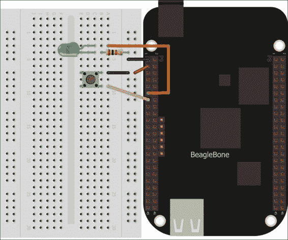
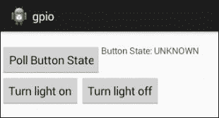
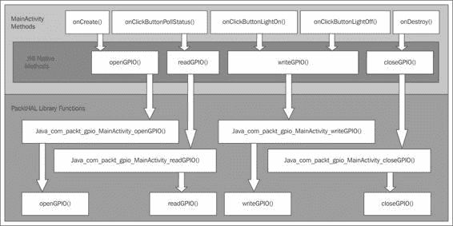

# 第三章：使用 GPIO 处理输入和输出

在上一章节中，你已经为开发硬件接口的 Android 应用准备好了开发 PC 和 BBBAndroid 系统。现在，你的开发环境已经搭建好并准备就绪，你将开始探索你的第一个能够与连接到 BBB 的硬件直接通信的应用。

**通用输入/输出**（**GPIO**）是数字电子学中最基本的接口之一。在本章的示例中，你将使用 GPIO 接收来自外部世界的数字输入信号，并发送数字输出信号作为响应。虽然这是一个小的开始，但这是发展和理解更复杂的硬件接口应用的第一步。GPIO 可以用来实现复杂且强大的接口逻辑。我们将讨论 GPIO 接口的硬件和软件方面，并解释如何在 Android 应用中调用 Java 方法以与低级硬件接口代码交互。

本章节，我们将涵盖以下主题：

+   了解 GPIO

+   构建 GPIO 接口电路

+   在你的应用中包含 PacktHAL

+   探索 GPIO 示例应用

# 了解 GPIO

在最基本的层面上，两块硬件之间的通信需要在它们之间来回传输数据。在计算机系统中，这些数据被表现为通过连接设备的电线发送的电压级别。电压来回的模式和级别形成了一种通信协议，设备使用该协议在彼此之间传输数据。

GPIO 是微控制器和微处理器提供的最基本的接口选项。BBB 处理器的某些引脚被分配为 GPIO，可以作为*输入*（监测线上的电压以接收数据）或*输出*（在线上放置特定电压以发送数据）。BBB 有数十个可用的 GPIO 引脚，这使得 GPIO 成为 Android 应用与外部世界交互的一种灵活且简单的方式，无需复杂的设备驱动程序或额外的接口硬件。

## GPIO 的细节

数字逻辑基于这样的概念：有两个离散的电压级别，分别代表*开启/高电平*和*关闭/低电平*状态。通过在这两个状态之间切换，可以在设备之间传输二进制位数据。BBB（BeagleBone Black）使用 3.3 V 的电压代表高电平，0 V（接地）的电压代表低电平。这种电压方案称为*3.3 V 逻辑电平*，它通常用于像 BeagleBoard 和 Raspberry Pi 这样的单板计算机。许多微控制器（例如，许多 Arduino 板）则使用 5 V 逻辑电平。

### 提示

**切勿对任何 BBB 引脚施加超过 3.3 V 的电压！**

向 BBB GPIO 施加超过 3.3V 的电压可能会烧毁 BBB 的处理器，因此在设计 BBB 的 GPIO 接口电路时，请务必确保你只使用最多 3.3V 的电压。P9.3/4 引脚提供 3.3V，而 P9.5/6 引脚提供 5V。当你打算使用 3.3V 引脚时，很容易不小心将面包板线连接到提供 5V 的引脚上。为了避免这个错误，可以尝试用一块胶带覆盖 P9.5/6 引脚。

BBB 的处理器有四个 GPIO 组，每组有 32 个单独的 GPIO。在 P8/9 连接器上只有 92 个引脚可用，不可能让每个 GPIO 都对外界开放。实际上，BBB 的系统参考手册显示，即使禁用了所有其他被复用到 P8/9 的功能，同时最多也只能将大约 65 个独特的 GPIO 复用到 P8/P9。还有一些其他的 GPIO 内部用于诸如点亮和闪烁 BBB 的 LED 等任务，但你应该认为只能使用通过 P8/P9 访问且不与任何标准的 BBB 功能冲突的 GPIO。

## Android 下的 GPIO 访问方法

与 BBB 上的 GPIO 交互有两种基本方法：**文件 I/O**和**内存映射**。使用文件 I/O，你通过读取和写入文件系统中的 GPIO 文件，通过内核驱动程序传递 GPIO 请求。使用内存映射，你将 GPIO 控制电阻映射到内存中，然后读取和写入这些映射的内存位置，直接操纵控制电阻。由于这两种方法都是由 Linux 内核实现的，它们在 Android 下的工作效果和在 Linux 下一样好。

### 文件 I/O 方法的优缺点

文件 I/O 方法可以由任何拥有适当权限来读写 GPIO 设备文件的过程执行。然而，像任何文件 I/O 操作一样，这可能会相当慢。

### 内存映射方法的优缺点

内存映射方法允许你直接访问控制 GPIO 的电阻。内存映射非常快（大约是文件 I/O 的 1000 倍！），但只有具有 root 权限的进程才能使用它。

由于你的应用程序在未进行一些重要的权限更改的情况下无法以 root 权限执行，因此你将无法使用内存映射来访问 GPIO。这实际上限制了你只能在应用程序中使用文件 I/O。

### 注意

PacktHAL 为 GPIO 访问实现了内存映射和文件 I/O。如果你对这两种方法的底层细节感兴趣，请检查`PacktHAL.tgz`中的`jni/gpio.c`文件。

## 为 GPIO 使用准备 Android

在第二章《与 Android 接口》中，你使用`adb`将两个预构建的文件从 PacktHAL 推送到你的 Android 系统中。这两个文件，`BB-PACKTPUB-00A0.dtbo`和`init.{ro.hardware}.rc`，配置了你的 Android 系统以启用特定的 GPIO，并允许你的应用访问它们。

### 注意

请记住，当我们提到`init.{ro.hardware}.rc`文件时，我们指的是 Android 文件系统的根目录中的`init.genericam33xx(flatteneddevice.tr`文件。

`BB-PACKTPUB-00A0.dtbo`文件是一个设备树覆盖（Device Tree overlay），它将 BBB 复用到以支持本书中的所有示例。就 GPIO 而言，这个覆盖将 P9.11 和 P9.13 引脚复用到 GPIO。在`PacktHAL.tgz`文件中，覆盖的源代码位于`cape/BB-PACKTPUB-00A0.dts`文件中。负责复用这两个 GPIO 的代码位于`fragment@0`中的`bb_gpio_pins`节点内。

```java
/* All GPIO pins are PULLUP, MODE7 */
bb_gpio_pins: pinmux_bb_gpio_pins {
    pinctrl-single,pins = <
        0x070 0x17  /* P9.11, gpio0_30, OUTPUT */
        0x074 0x37  /* P9.13, gpio0_31, INPUT */
    >;
};
```

`bb_gpio_pins`节点中使用的十六进制值的细节超出了本书的讨论范围。然而，大致的想法是它们指定了哪个引脚是感兴趣的，应该将引脚复用到哪种模式，关于上拉/下拉电阻的一些细节，它是输入引脚还是输出引脚，以及是否应该对信号进行偏斜调整。

### 注意

关于偏斜（skew）的细节以及如何进行调整超出了本书的讨论范围。如果你想了解更多关于偏斜的信息，我们建议从维基百科的相关页面开始了解（[`en.wikipedia.org/wiki/Clock_skew`](http://en.wikipedia.org/wiki/Clock_skew)）。

在启动时，这个覆盖通过`init.{ro.hardware}.rc`文件加载。然后内核知道哪些引脚被视为 GPIO。加载覆盖后，`init.{ro.hardware}.rc`文件执行一些命令，明确地“解锁”这些 GPIO 文件，通过*导出*使应用可以使用它们。导出一个 GPIO 引脚会在`/sys`文件系统中创建一系列文件，这些文件可以被读取和写入以与该 GPIO 引脚进行交互。 

通过导出一个 GPIO 引脚，然后通过`chmod`更改`/sys`文件系统中相应文件的权限，任何进程都可以读取或写入 GPIO。这正是`init.{ro.hardware}.rc`文件中的命令所做的，允许 Android 应用与 GPIO 接口。`init.{ro.hardware}.rc`文件的以下部分执行了导出和`chmod`操作：

```java
# Export GPIOs 30 and 31 (P9.11 and P9.13)
write /sys/class/gpio/export 30
write /sys/class/gpio/export 31

# Make GPIO 30 an output
write /sys/class/gpio/gpio30/direction out
# Make GPIOs 30 and 31 writeable from the FS
chmod 777 /sys/class/gpio/gpio30/value
chmod 777 /sys/class/gpio/gpio31/value
```

每个 GPIO 都有一个特定的整型标识符，由 GPIO 所属的银行（bank）及其在该银行中的位置决定。在我们的案例中，复用到 P9.11 的 GPIO 是银行 0 中的第 30 个 GPIO，而 P9.13 是银行 0 中的第 31 个 GPIO。这使得它们的整型标识符分别是 30 和 31。

### 注意

GPIO 引脚 30 和 31 只能通过`/sys`文件系统使用，因为它们在`init.{ro.hardware}.rc`文件中通过`write`命令明确导出。除非其他 GPIO 引脚也以同样的方式明确导出，否则它们将无法通过文件系统使用。

这种允许 GPIO 访问的方式非常不安全，因为它会打开 GPIO 供我们可能不希望直接访问它们的过程使用。对于实验和原型设计，这不是问题。然而，在商业系统中你绝对不应该这样做。除非你开发了一个合适的、有特权的 Android 管理器来处理 GPIO 资源，否则你必须允许*所有*进程访问 GPIO 文件，除非你定制权限，使其只能被属于特定用户或组的 app 使用。由于每个 app 都分配有自己的用户，你需要在将 app 的`.apk`文件安装到系统上后，将 GPIO 的所有者更改为正确的用户和组。

# 构建一个 GPIO 接口电路

在开始开发使用 GPIO 通信的软件之前，你首先需要构建一个 GPIO 接口的硬件电路。对于本章，你将构建一个简单的电路，包括 1k 欧姆电阻、LED 和按钮开关。这些部件的零件编号和供应商在第一章中列出，*Android 和 BeagleBone Black 的介绍*。在开始之前，请确保你有所有适当的部件，并在连接到 BBB 的 P8/P9 连接器之前，从 BBB 上移除所有电源（拔掉电源和 USB 电缆）。

### 提示

**不要拆开你的电路！**

本章节中的 GPIO 电路是第六章中更大电路的一部分，*创建一个完整的接口解决方案*。如果你按照下面示意图中的位置（在面包板的顶部）构建电路，那么在构建本书其余电路时，你可以简单地将 GPIO 组件和电线留在原位。这样，当你到达第六章时，它就已经构建好并可以工作了。

## 构建电路

你将构建的电路与以下四个 BBB 引脚接口：

+   P9.1（接地）

+   P9.3（3.3 V）

+   P9.11（GPIO）

+   P9.13（GPIO）

P9.11 引脚被配置为输出 GPIO，它驱动 LED。P9.13 引脚被配置为输入 GPIO，它根据施加在它上面的输入电压来设置其状态。这两个 GPIO 引脚都通过`BB-PACKTPUB-00A0.dtbo`覆盖层配置为使用内部上拉电阻。如果你不熟悉上拉电阻是什么，别担心。对于这些示例来说，它仅仅意味着如果 GPIO 引脚上没有连接任何东西，GPIO 的逻辑电平不会在开和关之间“浮动”。相反，逻辑电平会被“上拉”到开启状态。

### 注意

想了解更多关于上拉电阻是什么以及它是如何工作的吗？我们建议你查看这个关于上拉和下拉电阻的在线教程，教程地址为[`www.resistorguide.com/pull-up-resistor_pull-down-resistor`](http://www.resistorguide.com/pull-up-resistor_pull-down-resistor)。

面包板通常在两侧各有一个几乎贯穿整个面包板长度的垂直总线。这些总线用于为插入面包板的任何组件提供方便的电源和地线接入。



完整的 GPIO 接口电路

现在我们可以开始构建我们的电路了：

1.  将 BBB 的地线（P9.1）和 3.3V（P9.3）信号连接到面包板上的两个垂直总线上。地线总线是靠近面包板中心的垂直总线。3.3V 总线是靠近面包板边缘的垂直总线。

1.  接下来，将 LED 的阳极（或正极引脚）连接到 P9.11。LED 具有极性，因此电流只能在一个方向上通过它们流动。电流从 LED 较长的引脚（阳极）流向较短的引脚（阴极）。

1.  如果 LED 的引脚被剪成了相同的长度，你无法分辨哪个是哪个，可以摸一下 LED 塑料外壳的边缘。外壳边缘在阴极侧是平的，在阳极侧是圆的。只要阴极连接到地线，阳极连接到 GPIO 引脚，LED 就能正常工作。

1.  你必须限制 LED 的电流，以确保不会损坏 GPIO 引脚，因此在 LED 的阴极引脚和地线之间需要放置一个 1K 欧姆的电阻。电阻没有像 LED 那样的极性，所以你将其连接到面包板的方向并不重要。

    ### 注意

    如果你希望了解更多关于使用限流电阻与 LED 配合的信息，例如选择合适的电阻进行任务，我们建议你阅读 SparkFun 的教程，教程地址为[`www.sparkfun.com/tutorials/219`](https://www.sparkfun.com/tutorials/219)。

1.  既然 LED 和电阻已经连接到 BBB，你必须连接按钮开关。不同的开关具有不同数量的引脚，但我们为你推荐的开关总共有四个引脚。这些引脚形成两对，每对两个引脚。每对中的两个引脚始终是电气连接的，但当按下按钮时，一对才会与另一对电气连接。开关的两边是平滑的，另外两边每边有两个突出的引脚。单边开关上的两个突出引脚属于不同对的引脚。选择带有两个引脚的一边开关，将一个引脚连接到 P9.13，另一个引脚连接到面包板的接地总线。

你的电路现在完成了。再次检查你的接线与完整的 GPIO 接口电路图对照，以确保一切连接正确。

## 检查你的接线

完成 GPIO 电路的接线后，你应该测试它以确保它正常工作。幸运的是，你可以通过 shell 进入 BBB 并处理导出的 GPIO 针脚文件来轻松完成这个测试。我们将假设你正在使用`adb`进入 Android 系统，但使用 FTDI 访问控制台 shell 的方法完全相同。

### 提示

**如何使用 FTDI 电缆？**

如果你从未使用过 FTDI 电缆与 BBB 通信，有一个由 BeagleBoard.org 团队维护的[www.elinux.org](http://www.elinux.org)维基页面可以帮助你开始，它是[`elinux.org/Beagleboard:Terminal_Shells`](http://elinux.org/Beagleboard:Terminal_Shells)。

在本书中，我们只会使用 USB 电缆和 ADB shell 来访问 BBB。但是，学习如何使用 FTDI 来监控和排查 BBB 问题确实非常有用。

为你的 BBB 供电，然后使用 USB 电缆将 BBB 连接到你的开发系统。在 shell 进入 BBB 后，使用以下步骤开始测试你的 GPIO 电路：

1.  切换到与 P9.11（GPIO 针脚 30）复用的 GPIO 目录：

    ```java
    root@beagleboneblack:/ # cd /sys/class/gpio/gpio30

    ```

1.  使用`echo`命令通过将此 GPIO 的状态强制为 1 来打开 LED：

    ```java
    root@beagleboneblack:/ # echo 1 > value

    ```

1.  现在 LED 将会打开。使用`echo`命令通过将此 GPIO 的状态强制为 0 来关闭 LED：

    ```java
    root@beagleboneblack:/ # echo 0 > value

    ```

1.  现在 LED 将会熄灭。切换到与 P9.13（GPIO 针脚 31）复用的 GPIO 目录：

    ```java
    root@beagleboneblack:/ # cd /sys/class/gpio/gpio31

    ```

1.  使用`cat`命令检查按钮开关的当前状态。在执行此命令时，请确保你没有按下按钮：

    ```java
    root@beagleboneBlack:/ # cat value
    1

    ```

1.  现在，在按住按钮的同时执行以下`cat`命令。你应该输入整个命令，按下按钮，然后按*Enter*键在按住按钮的同时输入命令：

    ```java
    root@beagleboneblack:/ # cat value
    0

    ```

    ### 注意

    由于电路的连线方式，按钮的值看起来是反的。当按钮未被按下时，P9.13 上的上拉电阻会将 GPIO 的值拉至`1`。当按钮被按下时，P9.13 引脚连接到地线信号，并将 GPIO 改变为`0`。

如果你看到 LED 灯在开关按下和释放时点亮和熄灭，并且返回了正确的值，说明你已经正确地连好了电路。如果 LED 灯没有点亮，请确保你没有意外地交换了 LED 的阳极和阴极引脚。如果开关总是返回 0 值，请确保你已经将开关上的正确引脚对连接到地线总线和 P9.13。

# 在你的应用中包含 PacktHAL

在使用 PacktHAL 与 GPIO 接口之前，你必须了解如何在你的应用中包含 PacktHAL 支持。我们将指导你如何将 PacktHAL 代码添加到你的应用中，并构建它。PacktHAL 将与你的应用一起打包在`.apk`文件中，作为一个共享库。该库的源代码位于应用项目目录中，但它与应用的 Java 代码分开构建。在应用可以在`.apk`文件中包含并使用它之前，你必须手动构建 PacktHAL 共享库。

### 注意

我们在随书提供的每个示例应用项目中包含了一个预构建的 PacktHAL 库，这样你就可以立即开始构建和运行示例应用，而无需担心构建 PacktHAL 的细节。一旦你开始创建自己的自定义应用并修改 PacktHAL 以适应你的硬件项目时，你将需要了解如何从源代码构建 PacktHAL。

## 理解 Java 本地接口（JNI）

安卓应用是用 Java 编写的，但 PacktHAL 中的函数是用 C 本地代码编写的。本地代码是编译成本地二进制文件（如共享库或可执行文件）的代码，然后由安卓操作系统直接执行。本地代码使用安卓 NDK 提供的编译器工具链构建。本地二进制文件不像安卓应用的“一次构建，到处运行”的字节码那样可移植，但它们可以用 Java 代码无法实现的方式进行低级接口。与在任何拥有适当虚拟机的平台上可执行的 Java 字节码不同，本地代码是为特定的硬件架构（如 ARM、x86 或 PowerPC）编译的，并且只能在该架构上执行。

在本地代码中实现的功能是通过应用的 Java 代码通过**Java 本地接口**（**JNI**）调用的。JNI 是 Java 应用程序用来与本地 C/C++代码交互的一种流行的接口机制。除了其他特性之外，JNI 用于将 Java 数据类型*转换*为 C 数据类型，反之亦然。

例如，考虑 Java `String`类型。虽然 Java 有一个`String`实现，但 C 中没有等效类型。字符串必须适当地转换为一个兼容的类型，然后才能被 C 代码使用。每个 Java 类型在 C 中都由一系列等效类型表示，如`jint`、`jstring`和`jboolean`，这些类型在 Android NDK 提供的标准`jni.h`头文件中定义。

## 创建一个使用 PacktHAL 的新应用项目

以下步骤将演示如何创建一个包含 PacktHAL 的新自定义应用：

1.  启动 Eclipse ADT，选择菜单选项**文件**，然后**新建**，接着**Android 应用项目**。

1.  在**新建 Android 应用**对话框中，将`myapp`输入到**应用名称**字段。这将自动填充**项目名称**和**应用名称**字段。将**最低要求的 SDK**、**目标 SDK**和**编译使用**字段更改为**API 19: Android 4.4**。主题字段可以保持原样，或者根据你希望应用使用的主题进行更改。完成后，点击**下一步**按钮。创建一个使用 PacktHAL 的新应用项目

    新 Android 应用界面

1.  按照后续对话框屏幕操作，保留每个屏幕的默认设置，直到在最后一个屏幕上点击**完成**按钮。

为你的新应用创建的默认活动名称为`MainActivity`。创建新项目后，新的`myapp`项目的文件夹结构将位于`myapp`（`$PROJECT`）目录中，并具有以下类似的目录结构：

```java
myapp
  |
  +----.settings/
  +----assets/
  +----bin/
  +----gen/
  +----libs/
  +----res/
  +----src/
  +----...
```

首次创建应用后，将创建几个新文件夹以保存构建过程中生成的各种中间文件。创建应用后，你必须向其中添加 PacktHAL 代码并编译它。

### 在 Windows 下构建 PacktHAL

PacktHAL 必须构建成一个库，并包含在你的应用项目代码库中，以便你的应用使用。假设你将`PacktHAL.tgz`文件解压缩并解压在`c:\`中，你可以使用以下过程将 PacktHAL 代码复制到你的应用项目目录（`$PROJECT`）中：

1.  打开一个文件资源管理器窗口，浏览到`$PROJECT`目录。

1.  打开第二个文件资源管理器窗口，浏览到`c:\PacktHAL`。

1.  在`c:\PacktHAL`目录中的`jni`目录上右键单击，然后从上下文菜单中选择**复制**。

1.  在`$PROJECT`目录窗口内的空白处右键单击，然后从上下文菜单中选择**粘贴**。

既然`jni\`目录已经存在于你的`$PROJECT`目录中，你可以使用 Android NDK 构建 PacktHAL。假设你将 Android NDK 安装在`c:\android-ndk`中，你可以使用以下过程构建 PacktHAL：

1.  启动`cmd.exe`以获取命令提示窗口。使用命令提示符，切换到`$PROJECT`目录：

    ```java
    c:\> cd $PROJECT\jni

    ```

1.  使用 Android NDK 构建 PacktHAL 库：

    ```java
    c:\$PROJECT\jni> c:\android-ndk\ndk-build
    [armeabi] Compile thumb  : packtHAL <= jni_wrapper.c
    [armeabi] Compile thumb  : packtHAL <= gpio.c
    [armeabi] Compile thumb  : packtHAL <= fram.c
    [armeabi] Compile thumb  : packtHAL <= bmp183.c
    [armeabi] SharedLibrary  : libpacktHAL.so
    [armeabi] Install        : libpacktHAL.so => libs/armeabi/libpacktHAL.so

    ```

现在，PacktHAL 库已经构建完成，并作为文件`$PROJECT\libs\armeabi\libpacktHAL.so`存在于你的项目中。

### 在 Linux 下构建 PacktHAL

要使用 PacktHAL，必须将其构建成库并包含在你的应用程序项目代码库中。假设你在`$HOME`目录下解压并解包了`PacktHAL.tgz`文件，你可以使用以下命令将 PacktHAL 代码复制到你的应用程序项目目录（`$PROJECT`）中：

```java
$ cd $PROJECT
$ cp –rf $HOME/PacktHAL/jni .

```

既然你的`$PROJECT`目录中已经存在了`jni`目录，你可以使用 Android NDK 构建 PacktHAL。假设你在`$HOME/android-ndk`中安装了 Android NDK，你可以使用以下过程构建 PacktHAL：

1.  切换到`$PROJECT/jni`目录：

    ```java
    $ cd $PROJECT/jni

    ```

1.  使用 Android NDK 构建 PacktHAL 库：

    ```java
    $ ./$HOME/android-ndk/ndk-build
    [armeabi] Compile thumb  : packtHAL <= jni_wrapper.c
    [armeabi] Compile thumb  : packtHAL <= gpio.c
    [armeabi] Compile thumb  : packtHAL <= fram.c
    [armeabi] Compile thumb  : packtHAL <= bmp183.c
    [armeabi] SharedLibrary  : libpacktHAL.so
    [armeabi] Install        : libpacktHAL.so => libs/armeabi/libpacktHAL.so

    ```

现在，PacktHAL 库已经构建完成，并作为`$PROJECT/libs/armeabi/libpacktHAL.so`文件存在于你的项目中。

# 探索 GPIO 示例应用程序

在本节中，你将研究一个在 BBB 上进行 GPIO 接口的 Android 示例应用程序。该应用程序的目的是演示如何在实际应用程序中使用 PacktHAL 执行 GPIO 读写过程。PacktHAL 提供了一系列接口函数，你可以使用这些函数在 Android 应用程序中处理 GPIO。这些函数允许你读取输入 GPIO 的值并设置输出 GPIO 的值。硬件接口的低级细节在 PacktHAL 中实现，因此你可以快速轻松地让你的应用程序与 GPIO 交互。

在深入探讨 GPIO 应用程序的代码之前，你必须将代码安装到你的开发系统中，并将应用程序安装到你的 Android 系统中。该应用程序的源代码以及预编译的`.apk`包位于`chapter3.tgz`文件中，该文件可在本书的网站下载。

## 在 Windows 下安装应用程序和源代码

下载`chapter3.tgz`文件后，你必须解压并解包它。我们将假设你在下载后将`chapter3.tgz`复制到`c:\`的根目录，并从那里开始解压。我们将你的工作空间目录称为`$WORKSPACE`。

我们将假设你的`adb.exe`二进制文件在当前路径中。如果不是，通过使用`adb.exe`二进制文件的完整路径来调用`adb`：

1.  打开一个文件浏览器窗口并导航到该目录。

1.  在文件浏览器中右键点击`chapter3.tgz`文件并选择**在此处解压**。

现在存在一个名为`c:\gpio`的目录，其中包含了 GPIO 示例应用程序的所有文件。你必须将此项目导入到你的 Eclipse ADT 工作空间中：

1.  启动 Eclipse ADT。

1.  打开**文件**菜单并选择**导入**。

1.  在**导入**对话框中，展开**Android**文件夹并突出显示**将现有 Android 代码导入工作空间**。对话框底部的**下一步**按钮将变为激活状态。点击它以继续。

1.  在**导入项目**对话框中，在**根目录**文本字段中输入`c:\gpio`。然后，点击**刷新**按钮。`gpio`项目将出现在要导入的项目列表中。

1.  点击**全选**按钮，然后勾选**将项目复制到工作空间**的复选框。

1.  点击**完成**按钮，将`gpio`应用程序项目导入你的工作空间，并将`c:\gpio`目录复制到你的`$WORKSPACE`目录中。

现在，GPIO 应用程序的所有项目文件都位于那个`gpio`目录中。在`$WORKSPACE\gpio\bin`目录中提供了一个预构建的`.apk`软件包。你可以使用`adb`直接将这个`.apk`软件包安装到你的 Android 系统中：

1.  启动`cmd.exe`以获取命令提示窗口。使用命令提示符，切换到`$WORKSPACE\gpio\bin`目录：

    ```java
    c:\> cd $WORKSPACE\gpio\bin

    ```

1.  使用`adb devices`命令验证`adb`是否可以看到你的 BBB：

    ```java
    c:\$WORKSPACE\gpio\bin> adb devices
    List of devices attached
    BBBAndroid      device

    ```

1.  通过`adb`中的`install`命令将`gpio.apk`安装到你的 Android 系统中：

    ```java
    c:\$WORKSPACE\gpio\bin> adb install -d gpio.apk

    ```

1.  如果你已经安装过一次`gpio.apk`应用程序，并且现在收到`INSTALL_FAILED_ALREADY_EXISTS`的错误信息，请使用`adb`重新安装`gpio.apk`：

    ```java
    c:\$WORKSPACE\gpio\bin> adb install -d -r gpio.apk

    ```

现在，`gpio.apk`应用程序已安装在你的 Android 系统上，并且应用程序的源代码已安装在 Eclipse ADT 工作空间中。

## 在 Linux 下安装应用程序和源代码

下载`chapter3.tgz`文件后，你必须解压缩并展开它。我们将假设你在下载后已将`chapter3.tgz`复制到你的`$HOME`目录，并从那里开始解压缩。我们将你的工作空间目录称为`$WORKSPACE`。

使用 Linux 的`tar`命令来解压缩和展开`chapter3.tgz`文件：

```java
$ cd $HOME
$ tar –xvf chapter3.tgz

```

现在，在你的`$HOME`目录中存在一个名为`gpio`的目录，其中包含了 gpio 示例应用程序的所有文件。你必须按照以下步骤将其导入到你的 Eclipse ADT 工作空间中：

1.  启动 Eclipse ADT。

1.  打开**文件**菜单，选择**导入**。

1.  在**导入**对话框中，展开`Android`文件夹并选中**将现有 Android 代码导入工作空间**。对话框底部的**下一步**按钮将变为可用。点击它以继续。

1.  在**导入项目**对话框中，在**根目录**文本字段中输入`$HOME/gpio`（将`$HOME`替换为完整路径）。然后，点击**刷新**按钮。`gpio`项目将出现在要导入的项目列表中。

1.  点击**全选**按钮，然后勾选**将项目复制到工作空间**的复选框。

1.  点击**完成**按钮，将 gpio 应用程序项目导入你的工作空间，并将`$HOME/gpio`目录复制到你的`$WORKSPACE`目录中。

现在应用程序的所有项目文件都位于`$WORKSPACE/gpio`目录中。在`gpio/bin`目录中提供了一个为 gpio 项目预构建的`.apk`软件包。你可以使用`adb`直接将这个`.apk`软件包安装到你的 Android 系统中：

1.  切换到`gpio`项目的`bin`目录：

    ```java
    $ cd $WORKSPACE/gpio/bin

    ```

1.  使用`adb devices`命令验证`adb`是否可以看到你的 BBB：

    ```java
    $ adb devices
    List of devices attached
    BBBAndroid      device

    ```

1.  通过`adb`中的`install`命令将`gpio.apk`安装到您的 Android 系统上：

    ```java
    $ adb install -d gpio.apk

    ```

1.  如果您已经安装过一次`gpio.apk`应用程序，现在收到`INSTALL_FAILED_ALREADY_EXISTS`的错误消息，请使用`adb`重新安装`gpio.apk`：

    ```java
    $ adb install -d -r gpio.apk

    ```

`gpio.apk`应用程序现在已安装在您的 Android 系统上，应用程序的源代码现在也安装在了您的 Eclipse ADT 工作空间中。

## 应用程序的用户界面

在 Android 系统上启动`gpio`应用程序以查看应用程序的用户界面(UI)。如果您使用的是触摸屏保护盖，只需在屏幕上触摸 gpio 应用图标即可启动应用程序并与其 UI 交互。如果您使用 HDMI 进行视频输出，请将 USB 鼠标连接到 BBB 的 USB 端口，并使用鼠标点击 gpio 应用图标以启动应用程序。

应用程序使用一个非常简单的 UI 与 GPIOs 交互。由于它非常简单，因此应用程序只有一个默认的`MainActivity`。UI 仅由三个按钮和文本视图组成。



GPIO 示例应用程序屏幕

**轮询按钮状态**按钮检查按钮开关的当前状态，并更新**按钮状态**文本视图的值以报告该状态。在第一次按下**轮询按钮状态**按钮之前，开关状态将报告为**未知**。**打开灯光**按钮将在灯光未打开的情况下打开 LED，而**关闭灯光**按钮将关闭 LED。

文本视图在`res/layout/activity_main.xml`中有一个与之关联的 ID，这样应用程序就可以编程更新文本视图的值：

```java
<TextView
  …
  android:text="@string/button_state"
  android:id="@+id/button_state" />
```

三个按钮中的每一个都有一个定义的`onClick()`处理程序：

```java
<Button
  …
  android:text="@string/button_poll"
  android:onClick="onClickButtonPollStatus" />
<Button
  …
  android:text="@string/button_lighton"
  android:onClick="onClickButtonLightOn" />
<Button
  …
  android:text="@string/button_lightoff"
  android:onClick="onClickButtonLightOff" />
```

每个按钮的`onClick()`处理程序将触发 PacktHAL GPIO 函数之一，以读取 GPIO 的状态或将新状态写入 GPIO。

### 注意

如果您需要刷新关于各种 Android UI 元素的详细信息，网上有许多资源可以帮助您。我们建议您从官方 Android 开发者网站开始，网址是[`developer.android.com/guide/topics/ui/index.html`](http://developer.android.com/guide/topics/ui/index.html)。

## 调用 PacktHAL 函数

PacktHAL 中的 GPIO 接口功能是通过四个 C 函数实现的：

+   `openGPIO()`

+   `readGPIO()`

+   `writeGPIO()`

+   `closeGPIO()`

这些函数的原型位于应用程序项目中的`jni/PacktHAL.h`头文件中：

```java
extern int openGPIO(const int useMmap);
extern int readGPIO(const unsigned int header, const unsigned int pin);
extern int writeGPIO(const unsigned int header,
    const unsigned int pin, const unsigned int value);
extern void closeGPIO(void);
```

理想情况下，您应该将 PacktHAL 共享库加载到您的应用程序中，然后直接调用库函数来控制 GPIOs。示例应用程序实际上通过`System.loadLibrary()`调用来加载 PacktHAL 库，但随后事情变得不那么直接了，因为这些 C 函数不能直接调用。您必须指定 Java 方法，当调用这些方法时，实际上会调用 C 函数。

`MainActivity`类指定了四个带有`native`关键字的方法，用于在`MainActivity.java`中调用 PacktHAL C 函数：

```java
public class MainActivity extends Activity {
  private native boolean openGPIO();
private native void closeGPIO();
private native boolean readGPIO(int header, int pin);
private native void writeGPIO(int header, int pin, int val);

static {
System.loadLibrary("packtHAL");
}
  …
}
```

`MainActivity`中指定的这四个 Java 方法实际上并不是直接映射到 PacktHAL 中同名的 C 函数。注意，`MainActivity`中的 GPIO 方法是类范围内所有`private native`的。任何使用`native`关键字定义的方法在被调用时都会尝试调用一个本地的*JNI 封装函数*。然而，被调用的 JNI 封装函数的命名遵循一些非常特定的规则，这些规则代表了它 Java 端方法的范围。下图展示了这些 JNI 封装函数最终是如何调用 PacktHAL 内部的 GPIO 接口函数的：



`MainActivity`中的方法以及它们调用的 PacktHAL GPIO 接口函数

`MainActivity`类中名为`name()`的每个`native`方法将使用 JNI 来调用名为`Java_com_packt_gpio_MainActivity_name()`的 JNI 封装函数。这个封装函数的名字是通过将应用全限定名中的每个`.`替换为下划线来确定的。函数名中的`Java_`前缀告诉 Android 该函数是通过 Java 类中的方法调用的。关于 JNI 的命名约定有一些例外，但这个通用规则可以解决大多数情况。

### 提示

**我需要了解所有关于 JNI 的知识才能进行自己的 Android 接口项目吗？**

不一定。使用 JNI 可能会相当混乱，许多书籍和教程都详细描述了它。现在，不必担心关于 JNI 的一切都不了解。当你花时间在 Android 下进行硬件接口实验后，可以重新审视这个主题，了解更多关于 JNI 工作原理的细节。在本书中，我们将专注于提供足够的关于 JNI 的信息，以帮助你开始。

作为一个例子，在我们的`com.packtpub.gpio`示例应用中，`MainActivity`类里的 Java `openGPIO()`方法使用了 JNI 来调用封装的 C 函数`Java_com_packtpub_gpio_MainActivity_openGPIO()`。这可能有些令人困惑，但仍然是可以管理的。PacktHAL 在`jni/packt_native_gpio.c`文件中实现了这些 JNI 封装的 C 函数。查看这个源文件，你可以看到 PacktHAL 中的`Java_com_packtub_gpio_MainActivity_openGPIO()`函数是如何调用 PacktHAL 中的`openGPIO()` C 函数的：

```java
jboolean Java_com_packt_gpio_MainActivity_openGPIO(JNIEnv *env,
   jobject this)
{
  jboolean ret = JNI_TRUE;
  if ( openGPIO(0) == 0 ) {
    __android_log_print(ANDROID_LOG_DEBUG, PACKT_NATIVE_TAG,
          "GPIO Opened.");
  } else {
    __android_log_print(ANDROID_LOG_ERROR, PACKT_NATIVE_TAG,
          "openGPIO() failed!");
    ret = JNI_FALSE;
  }
  return ret;
}
```

为什么不干脆取消单独的 `openGPIO()` C 函数，并将所有硬件接口代码放入 `Java_com_packt_gpio_MainActivity_openGPIO()` 中呢？一旦你让它们正常工作，PacktHAL 中的函数如 `openGPIO()` 通常不会改变，而且你可以在 Linux 和 Android 下使用这些相同的函数。像 `Java_com_packt_gpio_MainActivity_openGPIO()` 这样的包装函数会根据它们如何以及从应用的 Java 代码何处被调用而改变其名称和实现细节。将不会改变的功能隔离在其自己的函数中是更好的选择。这样可以避免在自定义或重命名通过 JNI 调用的函数时意外破坏某些东西。

### 注意

请记住，你的应用中的 Java 方法（如 `MainActivity` 类中的 `openGPIO()`）会进行 JNI 调用，以调用具有长且复杂名称的 PacktHAL C 函数，如 `Java_com_packt_gpio_MainActivity_openGPIO()`。JNI 包装函数然后将调用 PacktHAL C 函数之一，例如 `openGPIO()`，实际控制硬件。从应用开发者的角度来看，一旦你弄清楚 JNI 包装函数的细节，几乎就像直接从 Java 应用代码调用控制硬件的 C 函数一样！

## 使用 PacktHAL GPIO 函数

现在你已经了解了如何从 Java 调用 PacktHAL GPIO 函数，接下来你将了解这些函数各自的作用以及如何使用它们。

`openGPIO()` 函数初始化应用对 GPIO 的访问。这个函数为你提供了两种不同的 GPIO 接口方法，你可以使用 `openGPIO()` 函数的 `useMmap` 参数选择其中一种方法。这两种方法是文件 I/O（通过将 `useMmap` 设置为 0）和内存映射（通过将 `useMmap` 设置为非零数字）。要从一种接口方法更改为另一种，你必须调用 `closeGPIO()` 来关闭 PacktHAL 的 GPIO 部分，然后再次调用 `openGPIO()`，并为 `useMmap` 提供不同的值。

进程必须以 `root` 身份运行，以使用内存映射直接访问 GPIO 控制电阻。由于应用不能以 root 身份运行，JNI 包装函数总是将 `0` 作为 `useMmap` 参数传递给 `openGPIO()`，以强制使用文件 I/O 与 GPIO 交互。由于这个原因，`MainActivity` 类中的 `openGPIO()` 方法不接受任何参数。

示例应用从 `MainActivity` 类的 `onCreate()` 方法中调用 `openGPIO()` 方法：

```java
protected void onCreate(Bundle savedInstanceState) {
  ... //Existing statements    
  TextView tv = (TextView) findViewById(R.id.button_state);
tv.setText("Button State: UNKNOWN");

   if(openGPIO() == false) {
      Log.e("com.packt", "Unable to open GPIO.");
        finish();
   }
}
```

对 `closeGPIO()` 方法的补充调用是由 `MainActivity` 类的 `onDestroy()` 方法完成的：

```java
protected void onDestroy() {
   closeGPIO();
}
```

`readGPIO()` 方法读取特定输入 GPIO 的状态。PacktHAL 的 `readGPIO()` 函数和 `MainActivity` 中的 `readGPIO()` 方法接受相同的两个参数。第一个参数是 BBB 上的连接器编号（8 或 9），第二个参数是该连接器上的引脚位置（1 到 42）。`readGPIO()` 方法在 `PollStatus` 按钮的 `onClick()` 处理程序内被调用：

```java
public void onClickPollStatus(View view) {
   String status = readGPIO(9, 13) == true ? "ON" : "OFF";
TextView tv = (TextView) findViewById(R.id.button_state);
tv.setText("Button State: " + status);
}
```

在`onClickPollStatus()`中，`readGPIO()`方法的调用是读取 GPIO 引脚 P9.13 的状态。这是你连接到按钮开关的 GPIO 引脚。如果当调用`readGPIO()`方法时开关被按下，将返回`true`。否则，返回`false`。

`writeGPIO()`方法用于设置输出 GPIO 的状态。PacktHAL 的`writeGPIO()`函数和`MainActivity`中的`writeGPIO()`方法都接受三个参数。第一个参数是 BBB 上的连接器编号（8 或 9），第二个参数是连接器上的引脚位置（1 到 42），第三个参数是要设置的值（0 或 1）。`writeGPIO()`方法在`LightOn`和`LightOff`按钮的`onClick`处理程序内部被调用：

```java
public void onClickButtonLightOn(View view) {
   writeGPIO(9, 11, 1);
}

public void onClickButtonLightOff(View view) {
   writeGPIO(9, 11, 0);
}
```

在这两个`onClick()`处理程序中，设置的 GPIO 是 P9.11。这是你连接到 LED 的 GPIO 引脚。`onClickButtonLightOn()`方法将 GPIO 设置为 1，打开 LED。同样，`onClickButtonLightOff()`方法将 GPIO 设置为 0，关闭 LED。

### 提示

**你准备好迎接挑战了吗？**

既然你已经了解了 gpio 应用的各个部分，为什么不尝试改变它以添加新功能呢？作为一个挑战，尝试将应用改为仅使用一个按钮来切换 LED 的状态。如果 LED 当前是关闭的，按下按钮将会打开它，反之亦然。我们在`chapter3_challenge.tgz`文件中提供了一个可能的实现，你可以在本书的网站上下载。

# 总结

在本章中，我们向你介绍了 GPIO 以及它们的工作原理。你构建了一个使用 GPIO 进行输入和输出的电路，并对电路进行了基本测试，以确保电路构建正确并且内核能够通过文件系统与电路交互。你还了解了 PacktHAL 的`init.{ro.hardware}.rc`文件和`BB-PACKTPUB-00A0.dtbo`设备树覆盖部分，它们负责配置 GPIO 并使它们可供你的应用使用。

我们向你展示了如何将 PacktHAL 添加到新创建的应用项目中，以及如何使用 Android NDK 构建 PacktHAL。然后，你学习了 JNI 如何通过 JNI 包装函数将 PacktHAL 集成到你的 Java 应用中，并探索了如何在应用内部调用并使用 PacktHAL 的每个 GPIO 功能。

在下一章中，你将学习如何将 I2C 总线设备集成到你的应用中，并开始与比 GPIO 的基本开关逻辑复杂得多的硬件进行交互。
