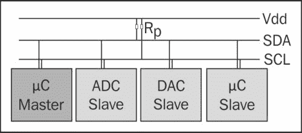
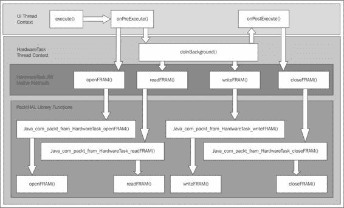

# 第四章：使用 I2C 存储和检索数据

在上一章中，你使用了 GPIO 与外部世界交换简单的数字数据。但是，如何与需要复杂的位或字节序列进行通信的更高级设备进行接口呢？

目前在嵌入式系统中使用最广泛的接口总线之一是**集成电路间**串行总线（通常简称为**IIC**、**I**2**C**或**I2C**）。在本章中，你将学习如何编写一个使用 BBB 的 I2C 接口将数据存储到 FRAM 芯片并从中检索数据的程序。我们将涵盖以下主题：

+   理解 I2C

+   BBB 上的 I2C 复用

+   在 Linux 内核中表示 I2C 设备

+   构建一个 I2C 接口电路

+   探索 I2C FRAM 示例应用

# 理解 I2C

I2C 协议最初由飞利浦半导体于 1982 年开发，作为与 IC 通信的总线，现在已经成为得到广泛支持的通用总线，被众多 IC 制造商支持。I2C 是一个多主多从总线，尽管最常见的配置是一个主设备和一条总线上的一个或多个从设备。I2C 主设备通过生成时钟信号来为总线设定节奏，并启动与从设备的通信。从设备接收主设备的时钟信号并对主设备的查询做出响应。

通过 I2C 通信只需要四根线：

+   一个时钟信号（SCL）

+   一个数据信号（SDA）

+   一个正电源电压

+   一个地线

只需要两个引脚（用于 SCL 和 SDA 信号）与多个从设备通信，这使得 I2C 成为一个吸引人的接口选择。硬件接口的一个难点是有效地分配有限的处理器引脚，以便同时与大量不同的设备进行通信。通过只需要两个处理器引脚与各种设备通信，I2C 释放了可以分配给其他任务的引脚。



一个带有单个主设备与三个从设备的 I2C 总线示例

## 使用 I2C 的设备

由于 I2C 总线的灵活性和广泛使用，许多设备使用它进行通信。诸如 EEPROM 和 FRAM ICs 等不同类型的存储设备通常通过 I2C 接口连接。例如，BBB 扩展板上的 EEPROM 都是通过 BBB 处理器的 I2C 进行访问的。温度、压力和湿度传感器，加速度计，LCD 控制器和步进电机控制器等设备都可以通过 I2C 总线获取。

# BBB 上的 I2C 复用

BBB 的 AM335X 处理器提供了三条 I2C 总线：

+   I2C0

+   I2C1

+   I2C2

BBB 通过其 P9 接头暴露 I2C1 和 I2C2 总线，但 I2C0 总线不容易访问。目前 I2C0 提供了 BBB 处理器与内置 HDMI cape 的 HDMI 帧处理器芯片之间的通信通道，因此应考虑不适用于你使用（除非你想通过在 BBB 上焊接电线直接到痕迹和芯片引脚来废除保修）。

I2C1 总线可供你一般使用，并且通常是与 I2C 接口的*首选*总线。如果 I2C1 达到其最大容量或不可用，I2C2 总线也可供你使用。

## 通过 P9 接头连接到 I2C

默认情况下，I2C1 没有复用到任何引脚上，而 I2C2 可以通过 P9.19 和 P9.20 引脚使用。I2C2 提供了外部 cape 板上的识别 EEPROM 与内核的 capemgr 之间的 I2C 通信。你可以将 I2C2 复用到其他引脚上，甚至完全禁用它，但如果你这样做，capemgr 将无法自动检测连接到 BBB 的 cape 板。通常来说，你可能不想这样做。

下图显示了 P9 接头上的每个潜在的引脚，I2C 信号可以被复用到这些位置：


在 P9 接头不同 pinmux 模式下 I2C 总线位置

## I2C 的复用

在决定如何在项目中使用 I2C 时复用你的引脚，请记住以下事项：

+   避免将任何单一的 I2C 信号复用到多个引脚上。这样做会浪费你的一个引脚，而且没有充分的理由。

+   避免将 I2C2 从其默认位置复用，因为这会阻止 capemgr 自动检测连接到 BBB 的 cape 板。

+   你可以使用默认的 I2C2 总线进行你的项目，但请注意，它的时钟为 100 KHz，地址 0x54 到 0x57 是为 cape EEPROM 保留的。

+   将 I2C1 通道复用到 P9.17 和 P9.18 会与 SPI0 通道冲突，因此如果你也希望使用 SPI，通常不希望使用这种配置。

# 在 Linux 内核中表示 I2C 设备

I2C 总线和设备在用户空间作为`/dev`文件系统中的文件暴露出来。I2C 总线作为`/dev/i2c-X`文件暴露，其中`X`是 I2C 通道的逻辑编号。虽然 I2C 总线的硬件信号清楚地编号为 0、1 和 2，但逻辑通道编号不一定与它们的硬件对应物相同。

逻辑通道编号是按照 Device Tree 中初始化 I2C 通道的顺序分配的。例如，I2C2 通道通常是由内核初始化的第二个 I2C 通道。因此，尽管它是物理 I2C 通道 2，它将是逻辑 I2C 通道 1，并作为`/dev/i2c-1`文件访问。

在 Android API 和服务层之下，Android 最终通过在`/dev`和`/sys`文件系统中打开文件，然后读取、写入或对这些文件执行`ioctl()`调用来与内核中的设备驱动交互。虽然仅使用`/dev/i2c-X`文件的`ioctl()`调用来与任何 I2C 设备交互，直接控制 I2C 总线是可能的，但这种方法很复杂，通常应避免使用。相反，你应该尝试使用一个内核驱动，该驱动在 I2C 总线上为你与设备通信。然后你可以对该内核驱动暴露的文件执行`ioctl()`调用，以轻松控制你的设备。

## 为 FRAM 使用准备 Android

在第二章《*与 Android 接口*》中，你使用`adb`将两个预构建的文件推送到你的 Android 系统中。这两个文件，`BB-PACKTPUB-00A0.dtbo`和`init.{ro.hardware}.rc`，配置你的 Android 系统以启用处理 FRAM 接口的内核设备驱动，复用引脚以启用 I2C1 总线，并允许你的应用程序访问它。

就 I2C 而言，`BB-PACKTPUB-00A0.dtbo`覆盖层将 P9.24 和 P9.26 引脚复用为 I2C SCL 和 SDA 信号。在`PacktHAL.tgz`文件中，覆盖层的源代码位于`cape/BB-PACKTPUB-00A0.dts`文件中。负责复用这两个引脚的代码位于`fragment@0`中的`bb_i2c1a1_pins`节点内：

```java
/* All I2C1 pins are SLEWCTRL_SLOW, INPUT_PULLUP, MODE3 */
bb_i2c1a1_pins: pinmux_bb_i2c1a1_pins {
    pinctrl-single,pins = <
        0x180 0x73  /* P9.26, i2c1_sda */
        0x184 0x73  /* P9.24, i2c1_scl */
    >;
};
```

虽然这设置了复用，但它并没有为这些引脚分配和配置设备驱动。`fragment@1`节点执行这个内核驱动分配：

```java
fragment@1 {
    target = <&i2c1>;
    __overlay__ {
        status = "okay";
        pinctrl-names = "default";
        pinctrl-0 = <&bb_i2c1a1_pins>;
        clock-frequency = <400000>;
        #address-cells = <1>;
        #size-cells = <0>;

        /* This is where we specify each I2C device on this bus */
        adafruit_fram: adafruit_fram0@50 {
            /* Kernel driver for this device */
            compatible = "at,24c256";
            /* I2C bus address */
            reg = <0x50>;
        };
    };
};
```

不深入过多细节，`fragment@1`中有四个设置对你来说很有兴趣：

+   第一个设置是`pinctrl-0`，它将 Device Tree 的此节点与`bb_i2c1a1_pins`节点中复用的引脚绑定

+   第二个设置是`clock-frequency`，它将 I2C 总线速度设置为 400 KHz

+   第三个设置是`compatible`，它指定了将处理我们硬件设备的特定内核驱动（对于类似 EEPROM 的设备的`24c256`驱动）

+   最后一个设置是`reg`，它指定了该设备在 I2C 总线上的地址（在我们的案例中是`0x50`）

# 构建一个 I2C 接口电路

既然你已经了解了 I2C 设备是如何连接到 BBB 的，以及 Linux 内核是如何为这些设备提供一个接口的，现在是时候将一个 I2C 设备连接到 BBB 上了。

正如我们在第一章*Android 和 BeagleBone Black 简介*中提到的，本章你将和一个 FRAM 芯片进行接口操作。具体来说，它是富士通半导体 MB85RC256V FRAM 芯片。这个 8 引脚芯片提供 32 KB 的非易失性存储。这个特定的芯片仅提供**小型外廓封装**（**SOP**），这是一种表面贴装芯片，在构建原型电路时可能难以操作。幸运的是，AdaFruit 为 FRAM 提供的开发板已经安装了该芯片，这使得原型设计变得简单轻松。

### 提示

**不要拆开你的电路！**

本章中的 FRAM 电路是第六章*创建完整的接口解决方案*中使用的更大电路的一部分。如果你按照图中的位置（面包板底部）构建电路，那么在构建本书中剩余电路时，你可以简单地将 FRAM 开发板和电线留在原位。这样，当你到达第六章时，它就已经构建好并可以工作了。

## 连接 FRAM

每个 I2C 设备必须使用一个地址来在 I2C 总线上标识自己。我们使用的 FRAM 芯片可以配置为使用 0x50 到 0x57 范围内的地址。这是 EEPROM 设备的常见地址范围。确切的地址是通过使用开发板的地址线（A0、A1、A2）来设置的。FRAM 的基准地址是 0x50。如果 A0、A1 和/或 A2 线连接到 3.3 V 信号，则分别向地址添加 0x1、0x2 和/或 0x4。对于这个接口项目，所有地址线都不连接，这导致 FRAM 在 I2C 总线上保留其基准地址 0x50。


FRAM 开发板（A0、A1 和 A2 地址线位于板子的最右侧三个端子）

### 注意

许多 I2C 设备的地址可以通过将设备的地址引脚连接到地或电压信号来进行配置。这是因为 I2C 总线上可能有相同设备的多个副本。电路设计者可以通过重新连接地址引脚，为每个设备分配不同的地址，而无需购买具有不同预分配地址且互不冲突的不同部件。

下图展示了 FRAM 开发板与 BBB 之间的连接。四个主要的 I2C 总线信号（+3.3 V、地、I2C SCL/SDA）是通过 P9 连接器的引脚实现的，因此我们将面包板放在 BBB 的 P9 侧。


完整的 I2C 接口电路

让我们开始吧：

1.  将 P9.1（地）连接到面包板的垂直地线，并将 P9.3（3.3 V）连接到面包板的垂直电源线。这些连接与你在第三章，*使用 GPIO 处理输入和输出*中创建的 GPIO 面包板电路所做的连接相同。

1.  I2C 信号，SCL 和 SDA 分别位于 P9.24 和 P9.26 引脚上。将 P9.24 引脚连接到面包板上标记为 SCL 的引脚，将 P9.26 引脚连接到标记为 SDA 的引脚。

1.  将地线连接到面包板的 GND 引脚，将电源线连接到 VCC 引脚。将**写保护**（**WP**）引脚和三个地址引脚（A0、A1、A2）保持未连接。

FRAM 面包板现在电连接到 BBB，可供使用。再次检查你的布线与完整的 FRAM 接口电路图对照，以确保一切连接正确。

## 使用 I2C 工具检查 FRAM 连接

I2C 工具是一组允许你探测和与 I2C 总线交互的实用程序。这些工具在采用 Linux 内核的系统上工作，并包含在 BBBAndroid 映像中。这些实用程序通过打开`/dev/i2c-X`设备文件并与它们进行`ioctl()`调用来与 I2C 总线交互。默认情况下，使用`i2c-tools`必须具有 root 访问权限，但 BBBAndroid 降低了`/dev/i2c-X`文件的权限，使得任何进程（包括`i2c-tools`）都可以读取和写入有关 I2C 总线的信息。

作为一个例子，让我们尝试使用`i2c-tools`中的`i2cdetect`实用程序。`i2cdetect`将扫描指定的 I2C 总线，并识别 I2C 设备所在的总线地址。使用 ADB shell，你将探测 i2c-2 物理总线，这也是第二个逻辑总线（`/dev/i2c-1`）：

```java
root@beagleboneblack:/ # i2cdetect -y -r 1
 0  1  2  3  4  5  6  7  8  9  a  b  c  d  e  f
00:          -- -- -- -- -- -- -- -- -- -- -- -- --
10: -- -- -- -- -- -- -- -- -- -- -- -- -- -- -- --
20: -- -- -- -- -- -- -- -- -- -- -- -- -- -- -- --
30: -- -- -- -- -- -- -- -- -- -- -- -- -- -- -- --
40: -- -- -- -- -- -- -- -- -- -- -- -- -- -- -- --
50: -- -- -- -- UU UU UU UU -- -- -- -- -- -- -- --
60: -- -- -- -- -- -- -- -- -- -- -- -- -- -- -- --
70: -- -- -- -- -- -- -- --

```

### 注意

`i2cdetect`的输出显示了当前总线上检测到的每个设备。任何未被使用的地址都有一个`--`标识符。在设备树中为设备驱动保留的地址，但目前没有在相应地址检测到设备，会有一个`UU`标识符。如果在特定地址检测到设备，该设备的两位十六进制地址将作为标识符出现在`i2cdetect`的输出中。

`i2cdetect`命令的输出显示，设备树已经在 i2c-2 物理总线上为四个 I2C 设备分配了驱动程序。这四个设备是 capemgr 中地址为 0x54-0x57 的 EEPROM。实际上这些设备并不存在，因为没有将 cape 板连接到 BBB，所以每个地址都有一个`UU`标识符。

在 FRAM 面包板电连接到 BBB 之后，你必须确认 FRAM 在 I2C 总线上是一个可见的设备。为此，使用`i2cdetect`检查 i2c-1 物理总线（逻辑总线 2）上存在的设备：

```java
root@beagleboneblack:/ # i2cdetect -y -r 2
 0  1  2  3  4  5  6  7  8  9  a  b  c  d  e  f
00:          -- -- -- -- -- -- -- -- -- -- -- -- --
10: -- -- -- -- -- -- -- -- -- -- -- -- -- -- -- --
20: -- -- -- -- -- -- -- -- -- -- -- -- -- -- -- --
30: -- -- -- -- -- -- -- -- -- -- -- -- -- -- -- --
40: -- -- -- -- -- -- -- -- -- -- -- -- -- -- -- --
50: 50 -- -- -- -- -- -- -- -- -- -- -- -- -- -- --
60: -- -- -- -- -- -- -- -- -- -- -- -- -- -- -- --
70: -- -- -- -- -- -- -- --

```

### 提示

**再次检查你的布线**

如果`i2cdetect`输出在 0x50 地址位置显示`UU`，则你知道 I2C 总线没有识别到连接的 FRAM。确保在将 FRAM 开发板连接到 BBB 时，你没有意外交换 SCL（P9.24）和 SDA（P9.26）电线。

# 探索 I2C FRAM 示例应用程序

在本节中，我们将检查一个与 BBB 上的 I2C 接口的示例 Android 应用程序，以连接 FRAM。此应用程序的目的是演示如何使用 PacktHAL 在实际应用程序中执行 FRAM 的读写操作。PacktHAL 提供了一组接口功能，你可以使用这些功能在你的 Android 应用程序中与 FRAM 开发板进行交互。这些功能允许你从 FRAM 检索数据块并将新数据写入 FRAM 进行存储。硬件接口的低级细节在 PacktHAL 中实现，因此你可以快速轻松地让你的应用程序与 FRAM 开发板进行交互。

在深入研究 FRAM 应用程序的代码之前，你必须将代码安装到你的开发系统中，并将应用程序安装到你的 Android 系统上。该应用程序的源代码以及预编译的`.apk`包都位于`chapter4.tgz`文件中，该文件可在 Packt 网站上下载。按照与第三章中描述的相同过程下载并添加应用程序到你的 Eclipse ADT 环境，该章节是关于使用 GPIO 处理输入和输出。

## 应用程序的用户界面

在 Android 系统上启动`fram`应用程序以查看应用程序的用户界面。如果你使用的是触摸屏保护盖，只需在屏幕上触摸**fram**应用程序图标即可启动应用程序并与其用户界面互动。如果你使用 HDMI 进行视频输出，请将 USB 鼠标连接到 BBB 的 USB 端口，并使用鼠标点击**fram**应用程序图标以启动应用程序。由于此应用程序接受用户输入文本，你可能发现连接 USB 键盘到 BBB 很方便。否则，你还可以使用屏幕上的 Android 键盘输入文本。

此应用程序的用户界面比上一章中的 GPIO 应用程序复杂一些，但仍然相当简单。由于它非常简单，因此应用程序仅有的活动是默认的`MainActivity`。用户界面包括两个文本字段，两个按钮和两个文本视图。


FRAM 示例应用程序屏幕

`activity_main.xml`文件中的顶部文本字段具有`saveEditText`标识符。`saveEditText`字段最多接受 60 个字符，这些字符将被存储到 FRAM 中。带有**保存**标签的顶部按钮具有`saveButton`标识符。此按钮有一个名为`onClickSaveButton()`的`onClick()`方法，该方法会触发与 FRAM 接口以存储`saveEditText`文本字段中的文本的过程。

底部文本字段具有 `loadEditText` 标识符。这个文本字段将显示保存在 FRAM 中的任何数据。底部带有 **Load** 标签的按钮具有 `loadButton` 标识符。这个按钮有一个 `onClick()` 方法，名为 `onClickLoadButton()`，它会触发与 FRAM 接口的过程，加载前 60 个字节的数据，然后更新 `loadEditText` 文本字段中显示的文本。

## 调用 PacktHAL FRAM 函数

PacktHAL 中的 FRAM 接口功能是通过四个 C 函数实现的：

+   `openFRAM()`

+   `readFRAM()`

+   `writeFRAM()`

+   `closeFRAM()`

这些函数的原型位于应用项目中的 `jni/PacktHAL.h` 头文件中：

```java
extern int openFRAM(const unsigned int bus, const unsigned int address);
extern int readFRAM(const unsigned int offset, const unsigned int 
    bufferSize, const char *buffer);
extern int writeFRAM(const unsigned int offset, const unsigned int 
    const char *buffer);
extern void closeFRAM(void);
```

`openFRAM()` 函数打开 `/dev` 文件系统中的文件，该文件提供了与 24c256 EEPROM 内核驱动的接口。它的对应函数是 `closeFRAM()`，一旦不再需要与 FRAM 进行硬件接口，它就会关闭这个文件。`readFRAM()` 函数从 FRAM 中读取数据缓冲区，而 `writeFRAM()` 函数将数据缓冲区写入 FRAM 以进行持久存储。这四个函数共同提供了与 FRAM 交互所需的所有必要功能。

与前一章的 `gpio` 应用一样，`fram` 应用通过 `System.loadLibrary()` 调用来加载 PacktHAL 共享库，以访问 PacktHAL FRAM 接口函数和调用它们的 JNI 包装函数。但是，与 `gpio` 应用不同，`fram` 应用的 `MainActivity` 类并没有使用 `native` 关键字指定调用 PacktHAL JNI 包装 C 函数的方法。相反，它将硬件接口留给了一个名为 `HardwareTask` 的*异步任务*类：

```java
Public class MainActivity extends Activity {

    Public static HardwareTask hwTask;

    Static {
        System.loadLibrary("packtHAL");
    }
```

## 理解 AsyncTask 类

`HardwareTask` 扩展了 `AsyncTask` 类，使用它相比于 `gpio` 应用中实现硬件接口的方式具有显著优势。`AsyncTask` 允许你执行复杂且耗时的硬件接口任务，在任务执行期间不会让应用变得无响应。`AsyncTask` 类的每个实例可以在 Android 中创建一个新的**执行线程**。这类似于其他操作系统上的多线程程序，通过创建新线程来处理文件和网络 I/O、管理 UI 和执行并行处理。

在前一章中，`gpio` 应用在其执行过程中只使用了单个线程。这个线程是所有 Android 应用中都有的主 UI 线程。UI 线程旨在尽可能快地处理 UI 事件。当你与 UI 元素交互时，UI 线程会调用该元素的处理器方法。例如，点击按钮会导致 UI 线程调用按钮的 `onClick()` 处理器。`onClick()` 处理器然后执行一段代码并返回到 UI 线程。

Android 一直在监控 UI 线程的执行。如果一个处理程序花费太长时间来完成其执行，Android 会向用户显示**应用程序无响应**（**ANR**）对话框。你*绝对*不希望出现 ANR 对话框给用户。这是你的应用在 UI 线程中的处理程序中花费太多时间而运行低效（甚至根本不运行！）的标志。


Android 中的应用程序无响应对话框

上一个章节中的`gpio`应用在 UI 线程内非常快速地读取和写入 GPIO 状态，因此触发 ANR 的风险非常小。与 FRAM 的接口是一个更慢的过程。使用 BBB 的 I2C 总线以最大速度 400 KHz 运行时，使用 FRAM 读取或写入一个字节的数据大约需要 25 微秒。对于小写入来说这并不是一个主要问题，但是读取或写入整个 32,768 字节的 FRAM 可能需要接近一秒钟来执行！

多次读取和写入整个 FRAM 很容易触发 ANR 对话框，因此有必要将这些耗时的活动移出 UI 线程。通过将你的硬件接口放入它自己的`AsyncTask`类中，你可以将这些耗时的任务执行与 UI 线程的执行解耦。这防止了你的硬件接口可能触发 ANR 对话框。

## 学习`HardwareTask`类的细节

`HardwareTask`的基类`AsyncTask`提供了许多不同的方法，你可以通过参考 Android API 文档进一步探索。对于我们硬件接口工作的四个`AsyncTask`方法立即值得关注：

+   `onPreExecute()`

+   `doInBackground()`

+   `onPostExecute()`

+   `execute()`

这四个方法中，只有`doInBackground()`方法在其自己的线程中执行。其他三个方法都在 UI 线程的上下文中执行。只有 UI 线程上下文中执行的方法能够更新屏幕 UI 元素。



`HardwareTask`方法和 PacktHAL 函数执行的线程上下文

类似于上一个章节中`gpio`应用的`MainActivity`类，`HardwareTask`类提供了四个`native`方法，用于调用与 FRAM 硬件接口相关的 PacktHAL JNI 函数：

```java
public class HardwareTask extends AsyncTask<Void, Void, Boolean> {

  private native boolean openFRAM(int bus, int address);
  private native String readFRAM(int offset, int bufferSize);
  private native void writeFRAM(int offset, int bufferSize, 
      String buffer);
  private native boolean closeFRAM();
```

`openFRAM()`方法初始化你的应用对位于逻辑 I2C 总线（`bus`参数）上特定总线地址（`address`参数）的 FRAM 的访问。一旦通过`openFRAM()`调用初始化了对特定 FRAM 的连接，所有`readFRAM()`和`writeFRAM()`调用都将应用于该 FRAM，直到进行了`closeFRAM()`调用。

`readFRAM()`方法将从 FRAM 中检索一系列字节，并将其返回为 Java `String`。从 FRAM 开始的位置偏移`offset`字节开始，共检索`bufferSize`字节。`writeFRAM()`方法将一系列字节存储到 FRAM 中。从 Java 字符串`buffer`中取出`bufferSize`个字符，从 FRAM 开始的位置偏移`offset`字节开始存储。

在`fram`应用中，`MainActivity`类中的**Load**和**Save**按钮的`onClick()`处理程序各自实例化一个新的`HardwareTask`。在`HardwareTask`实例化之后，立即调用`loadFromFRAM()`或`saveToFRAM()`方法开始与 FRAM 交互：

```java
public void onClickSaveButton(View view) {
   hwTask = new HardwareTask();
   hwTask.saveToFRAM(this);  
}

public void onClickLoadButton(View view) {
   hwTask = new HardwareTask();
   hwTask.loadFromFRAM(this);
}
```

`HardwareTask`类中的`loadFromFRAM()`和`saveToFRAM()`方法都调用基`AsyncTask`类的`execution()`方法来开始新线程的创建过程：

```java
public void saveToFRAM(Activity act) {
   mCallerActivity = act;
   isSave = true;
   execute();
}

public void loadFromFRAM(Activity act) {
   mCallerActivity = act;
   isSave = false;
   execute();
}
```

### 注意

每个的`AsyncTask`实例只能调用一次其`execute()`方法。如果您需要再次运行`AsyncTask`，则必须实例化一个新的实例，并调用新实例的`execute()`方法。这就是为什么我们在**Load**和**Save**按钮的`onClick()`处理程序中实例化一个新的`HardwareTask`实例，而不是实例化单个`HardwareTask`实例并多次调用其`execute()`方法的原因。

`execute()`方法自动调用`HardwareTask`类的`onPreExecute()`方法。`onPreExecute()`方法执行在新线程开始之前必须发生的任何初始化。在`fram`应用中，这需要禁用各种 UI 元素并调用`openFRAM()`通过 PacktHAL 初始化与 FRAM 的连接：

```java
protected void onPreExecute() {  
   // Some setup goes here
   ...    
  if ( !openFRAM(2, 0x50) ) {
     Log.e("HardwareTask", "Error opening hardware");
     isDone = true;
  }
  // Disable the Buttons and TextFields while talking to the hardware
  saveText.setEnabled(false);
  saveButton.setEnabled(false);
  loadButton.setEnabled(false); 
}
```

### 提示

**禁用您的 UI 元素**

当您执行后台操作时，您可能希望防止用户在操作完成前提供更多输入。在 FRAM 读写期间，我们不希望用户按下任何 UI 按钮或更改`saveText`文本字段中的数据。如果您的 UI 元素始终处于启用状态，用户可能会通过反复点击 UI 按钮同时启动多个`AsyncTask`实例。为防止这种情况，请禁用需要限制用户输入的任何 UI 元素，直到需要该输入为止。

一旦`onPreExecute()`方法执行完毕，`AsyncTask`基类将启动一个新线程并在该线程中执行`doInBackground()`方法。新线程的生命周期仅限于`doInBackground()`方法的执行期间。一旦`doInBackground()`返回，新线程将终止。

由于`doInBackground()`方法中执行的所有操作都在后台线程中完成，因此它是执行任何耗时的活动的完美场所，如果这些活动从 UI 线程中执行，可能会触发 ANR 对话框。这意味着访问 I2C 总线并与 FRAM 通信的缓慢的`readFRAM()`和`writeFRAM()`调用应该从`doInBackground()`中发出：

```java
protected Boolean doInBackground(Void... params) {  
   ...
   Log.i("HardwareTask", "doInBackground: Interfacing with hardware");
   try {
      if (isSave) {
         writeFRAM(0, saveData.length(), saveData);
      } else {
        loadData = readFRAM(0, 61);
      }
   } catch (Exception e) {
      ...
```

### 注意

在`readFRAM()`和`writeFRAM()`调用中使用的`loadData`和`saveData`字符串变量，都是`HardwareTask`类的类变量。`saveData`变量通过在`HardwareTask`类的`onPreExecute()`方法中的`saveEditText.toString()`调用，填充了`saveEditText`文本字段的内容。

### 提示

**如何在 AsyncTask 线程中更新 UI？**

尽管在本次示例中`fram`应用没有使用它们，但`AsyncTask`类提供了两个特殊方法`publishProgress()`和`onPublishProgress()`，值得一提。`AsyncTask`线程使用这些方法在运行时与 UI 线程通信。`publishProgress()`方法在`AsyncTask`线程中执行，并触发 UI 线程中的`onPublishProgress()`执行。这些方法通常用于更新进度条（因此得名`publishProgress`）或其他不能直接从`AsyncTask`线程更新的 UI 元素。你将在第六章，*创建一个完整的接口解决方案*中使用`publishProgress()`和`onPublishProgress()`方法。

当`doInBackground()`完成后，`AsyncTask`线程将终止。这会触发从 UI 线程调用`doPostExecute()`。`doPostExecute()`方法用于任何后线程清理以及需要更新的 UI 元素。`fram`应用使用`closeFRAM()` PacktHAL 函数来关闭通过`openFRAM()`在`onPreExecute()`方法中打开的当前 FRAM 上下文。

```java
protected void onPostExecute(Boolean result) {
   if (!closeFRAM()) {
    Log.e("HardwareTask", "Error closing hardware");
  }
   ...
```

现在必须通知用户任务已完成。如果按下**加载**按钮，则通过`MainActivity`类的`updateLoadedData()`方法更新`loadTextField`小部件中显示的字符串。如果按下**保存**按钮，则显示一个`Toast`消息，以通知用户保存成功。

```java
Log.i("HardwareTask", "onPostExecute: Completed.");
if (isSave) {
   Toast toast = Toast.makeText(mCallerActivity.getApplicationContext(), 
      "Data stored to FRAM", Toast.LENGTH_SHORT);
   toast.show();
} else {
   ((MainActivity)mCallerActivity).updateLoadedData(loadData);
}
```

### 提示

**向用户显示 Toast 反馈**

`Toast`类是向应用用户提供快速反馈的好方法。它会弹出一个在可配置时间后消失的小消息。如果你在后台执行与硬件相关的任务，并且想要在不更改任何 UI 元素的情况下通知用户任务完成，请尝试使用`Toast`消息！`Toast`消息只能由从 UI 线程中执行的方法触发。


`Toast`消息的示例

最后，`onPostExecute()`方法将重新启用所有在`onPreExecute()`中被禁用的 UI 元素：

```java
saveText.setEnabled(true);
saveButton.setEnabled(true);
loadButton.setEnabled(true);
```

`onPostExecute()`方法现在已经完成了执行，应用程序正在耐心等待用户通过按下**加载**或**保存**按钮来提出下一个`fram`访问请求。

### 小贴士

**你准备好迎接挑战了吗？**

既然你已经看到了`fram`应用程序的所有部分，为何不修改它以添加新功能呢？作为一个挑战，尝试添加一个计数器，指示用户在达到 60 个字符限制之前还可以在`saveText`文本字段中输入多少个字符。我们在`chapter4_challenge.tgz`文件中提供了一个可能的实现，你可以在 Packt 的网站上下载。

# 总结

在本章中，我们向你介绍了 I2C 总线。你构建了一个电路，将 I2C FRAM 开发板连接到 BBB，然后使用`i2c-tools`中的`i2cdetect`对电路进行了一些基本测试，以确保电路构建正确且内核能够通过文件系统与电路交互。你还了解了 PacktHAL `init.{ro.hardware}.rc`文件和 Device Tree 覆盖部分，它们负责配置并使 I2C 总线和 I2C 设备驱动可供你的应用程序使用。本章中的`fram`应用程序演示了如何使用`AsyncTask`类执行耗时硬件接口任务，而不会挂起应用程序的 UI 线程并触发 ANR 对话框。

在下一章中，你将了解到高速**串行外围设备接口**（**SPI**）总线，并使用它来与环境传感器进行接口。
