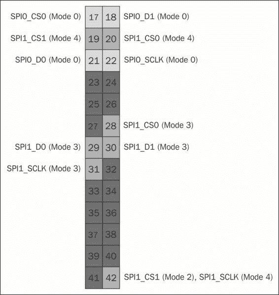
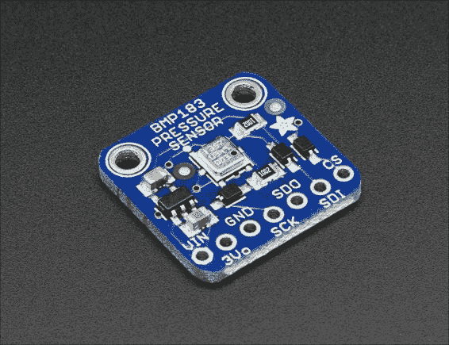
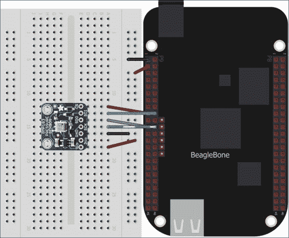
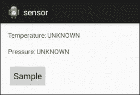

# 第五章. 使用 SPI 与高速传感器接口

在上一章中，你使用 I2C 总线与 FRAM 设备通信，该设备需要比 GPIO 使用的简单开关数字通信更复杂的通信。I2C 非常强大且灵活，但它的速度可能会比较慢。

在本章中，你将学习如何编写一个 Android 应用程序，利用 BBB 的 SPI 功能从高速传感器获取环境数据。我们将涵盖以下主题：

+   理解 SPI

+   BBB 上的 SPI 复用

+   在 Linux 内核中表示 SPI 设备

+   构建 SPI 接口电路

+   探索 SPI 传感器示例应用程序

# 理解 SPI

**串行外围设备接口**（**SPI**）总线是一种由摩托罗拉公司最初开发的高速串行总线。其目的是促进单一主设备与一个或多个从设备之间的点对点通信。SPI 总线通常使用四个信号实现：

+   `SCLK`

+   `MOSI`

+   `MISO`

+   `SS`/`CS`

与 I2C 类似，SPI 总线上的主设备通过产生时钟信号来控制主从设备之间的通信节奏。在 SPI 中，这个时钟信号被称为**串行时钟**（`SCLK`）。与 I2C 的双向数据总线不同，SPI 为每个设备使用专用的发送和接收数据线。使用专用线使得 SPI 能够实现远高于 I2C 的通信速度。主设备通过**主出从入**（`MOSI`）信号向从设备发送数据，并通过**主入从出**（`MISO`）信号从从设备接收数据。**从设备选择**（`SS`）信号，也称为**芯片选择**（`CS`），它告诉从设备是否应该保持唤醒状态并注意`SCLK`上的任何时钟信号以及通过`MOSI`发送给它的数据。这种四线 SPI 总线方案有变体，例如省略`SS`/`CS`信号的三线方案，但 BBB 在其 SPI 总线上使用四线方案。


SPI 总线上的 SPI 主设备和从设备

BBB 可以作为 SPI 的主设备或从设备，因此它没有将其 SPI 的数据输入和输出信号标记为`MISO`或`MOSI`。相反，它使用`D0`和`D1`这些信号的名字。如果 BBB 在 SPI 总线上作为主设备，`D0`是`MISO`信号，`D1`是`MOSI`信号。如果 BBB 在 SPI 总线上作为从设备，这些信号是相反的（`D1`是`MISO`，`D0`是`MOSI`）。对于本书，BBB 将始终作为 SPI 主设备。

### 提示

**我该如何记住哪个是 BBB 的 SPI 输入信号，哪个是输出信号？**

当 BBB 使用信号名称 `D0` 和 `D1` 时，记住哪个信号是 `MISO` 和哪个是 `MOSI` 可能会令人困惑。记住的一个方法是，将 `D0` 中的 `0` 视为 *O*（代表从设备输出），将 `D1` 中的 `1` 视为 *I*（代表从设备输入）。如果 BBB 是 SPI 主设备（几乎总是这种情况），那么 `D1` 就是从设备输入信号（`MOSI`），而 `D0` 就是从设备输出信号（`MISO`）。

BBB 上 SPI 的最大 `SCLK` 速度为 48 MHz，但通常使用的速度范围从 1 MHz 到 16 MHz。即使在这些降低的时钟速度下，考虑到每秒可以传输的原始数据量，SPI 也远胜于 I2C 总线的 400 KHz 时钟速度。在任何时刻，I2C 总线上只能有一个设备传输数据，但在 SPI 总线上，由于每个设备都有专用的传输信号，主设备和从设备可以同时传输数据。

# BBB 上的 SPI 复用

BBB 上的 AM335X 处理器提供了两个 SPI 总线：SPI0 和 SPI1。这两条总线都可以通过 P9 头访问。默认情况下，没有将任何 SPI 总线进行复用。下图展示了 P9 头上可能的每个引脚，这些引脚可以在不同的 pinmux 模式下复用 SPI 信号：



在不同 pinmux 模式下 P9 头上 SPI 总线的位置

在决定如何在你的项目中使用 SPI 复用引脚时，请记住以下事项：

+   如有疑问，请坚持使用复用到 P9.17、P9.18、P9.21 和 P9.22 引脚的 SPI0 总线。

+   SPI1 通道与 capemgr 使用的 I2C 总线（P9.20）和音频输出（P9.28、P9.29、P9.31）冲突。请注意，将这些引脚复用为 SPI1 可能会禁用你依赖的一些其他功能，以实现功能齐全的 Android 系统。

+   如果在你的项目中使用了其他 cape 板，请确保这些 cape 板不需要使用 SPI 总线。除非你使用 GPIO 引脚和额外的逻辑电路手动控制每个 SPI 设备的片选信号，否则每条 SPI 总线上只能存在一个设备。

# 在 Linux 内核中表示 SPI 设备

Linux 内核提供了一个名为 `spidev` 的通用 SPI 驱动程序。`spidev` 驱动程序是一个简单的接口，它抽象了 SPI 通信中涉及到的许多细节。`spidev` 驱动程序通过 `/dev` 文件系统作为 `/dev/spidevX.Y` 文件暴露出来。根据 Device Tree 中配置的 SPI 总线数量，可能存在多个版本的这些 `spidev` 文件。`spidev` 文件名中的 `X` 值指的是 SPI 控制器编号（SPI0 为 1，SPI1 为 2），而 `Y` 值指的是该控制器的 SPI 总线（第一条总线为 0，第二条总线为 1）。对于本书中的示例，你将只使用 SPI0 控制器的第一条 SPI 总线，因此 PacktHAL 将只与 `/dev/spidev1.0` 文件交互。

## 为 SPI 传感器使用准备 Android

在第二章《*与 Android 接口*》中，你使用`adb`将两个预构建的文件推送到你的 Android 系统中。这两个文件，`BB-PACKTPUB-00A0.dtbo`和`init.{ro.hardware}.rc`，配置了你的 Android 系统以启用处理 SPI 总线接口的`spidev`内核设备驱动，复用引脚以启用 SPI0 总线，并允许你的应用程序访问它们。

就 SPI 而言，`BB-PACKTPUB-00A0.dtbo`覆盖将 P9.17、P9.18、P9.21 和 P9.22 引脚复用为 SPI 的`CS0`、`D1`、`D0`和`SCLK`信号。在`PacktHAL.tgz`文件中，覆盖源代码位于`cape/BB-PACKTPUB-00A0.dts`文件中。负责复用这两个引脚的代码位于`fragment@0`中的`bb_spi0_pins`节点内。

```java
/* All SPI0 pins are PULL, MODE0 */
bb_spi0_pins: pinmux_bb_spi0_pins {
    pinctrl-single,pins = <
        0x150 0x30  /* P9.22, spi0_sclk, INPUT */
        0x154 0x30  /* P9.21, spi0_do, INPUT */
        0x158 0x10  /* P9.18, spi0_d1, OUTPUT */
        0x15c 0x10  /* P9.17, spi0_cs0, OUTPUT */
    >;
};
```

虽然这设置了复用功能，但它并没有为这些引脚分配和配置设备驱动。`fragment@2`节点执行这个内核驱动分配的任务：

```java
fragment@2 {
    target = <&spi0>;
    __overlay__ {
        #address-cells = <1>;
        #size-cells = <0>;
        status = "okay";
        pinctrl-names = "default";
        pinctrl-0 = <&bb_spi0_pins>;

        channel@0 {
            #address-cells = <1>;
            #size-cells = <0>;
            /* Kernel driver for this device */
            compatible = "spidev";

            reg = <0>;
            /* Setting the max frequency to 16MHz */
            spi-max-frequency = <16000000>;
            spi-cpha;
        };
        …
    };
};
```

不深入研究细节，`fragment@2`中有三个设置是你感兴趣的：

+   `pinctrl-0`

+   `compatible`

+   `spi-max-frequency`

第一个是`pinctrl-0`，它将 Device Tree 的这个节点与`bb_spi0_pins`节点中复用的引脚连接起来。第二个是`compatible`，它指定了将处理我们硬件设备的特定内核驱动，即`spidev`。最后是`spi-max-frequency`，它指定了此 SPI 总线的最大允许速度（16 MHz）。16 MHz 是在 BBB 的内核源提供的 Device Tree 覆盖中为`spidev`指定的最大频率。

你推送到 Android 系统的自定义`init.{ro.hardware}.rc`文件不需要为 PacktHAL 的 SPI 接口做任何特别的事情。默认情况下，BBBAndroid 使用`chmod`将`/dev/spidev*`文件的权限设置为 777（对所有人完全访问）。这并不是一个安全的做法，因为系统上的任何进程都可能打开一个`spidev`设备并开始读写硬件。然而，对于我们的目的来说，让每个进程都能访问`/dev/spidev*`文件是必要的，以允许我们的非特权示例应用程序访问 SPI 总线。

# 构建一个 SPI 接口电路

既然你已经了解了 SPI 设备是如何连接到 BBB 的，以及 Linux 内核是如何为这些设备提供接口的，现在是时候将一个 SPI 设备连接到 BBB 上了。

正如我们在第一章《*Android 与 BeagleBone Black 简介*》中提到的，本章你将和一个传感器进行接口交互。具体来说，我们将使用博世 Sensortec 的 BMP183 数字压力传感器。这个 7 针组件为用于导航、天气预报以及测量垂直高度变化等应用提供压力数据样本（16 位至 19 位分辨率）和温度数据样本（16 位分辨率）。

这个特定的芯片仅提供**LGA**（**land grid array**，地表网格阵列）封装，这种表面贴装封装在构建原型电路时可能难以操作。幸运的是，AdaFruit 为该传感器提供的开发板已经装好了芯片，这使得原型设计变得简单和容易。



传感器开发板（来源：[www.adafruit.com](http://www.adafruit.com)）

开发板将`SCLK`信号标记为`SCK`，`MOSI`为`SDI`（串行数据输入），`MISO`为`SDO`（串行数据输出），以及`SS`为`CS`（芯片选择）。为了给开发板供电，将+3.3 V 信号连接到`VCC`，并将地线连接到`GND`。开发板上的`3Vo`信号提供一个+3.3 V 信号，在我们的示例中未使用。

### 提示

**不要拆开你的电路！**

本章节中的传感器电路是第六章*创建完整的接口解决方案*中使用的更大电路的一部分。如果你按照原理图中的位置（在面包板中部）搭建电路，那么在构建本书其余电路时，你可以简单地将传感器开发板和电线留在原位。这样，当你到达第六章时，它就已经构建好并可以工作了。

## 连接传感器

下图展示了传感器开发板与 BBB 之间的连接。六个主要的 SPI 总线信号（+3.3 V、地、以及 SPI `SCLK`、`MISO`、`MOSI`和`SS`）使用 P9 连接器的引脚进行连接，因此我们将面包板放在 BBB 的 P9 侧。



完整的传感器接口电路

让我们开始吧：

1.  将 P9.1（地）连接到面包板的地线总排，将 P9.3（3.3 V）连接到面包板的电源线总排。这些连接与你在第三章*使用 GPIO 处理输入和输出*和第四章*使用 I2C 存储和检索数据*中创建的 GPIO 和 I2C 面包板电路的连接相同。

1.  四个 SPI 总线信号，`SCLK`、`MISO` (`D0`)、`MOSI` (`D1`) 和 `SS` 分别位于 P9.22、P9.21、P9.18 和 P9.17 引脚上。将 P9.22 引脚连接到开发板上标记为 SCK 的引脚，将 P9.21 引脚连接到标记为 SDO 的引脚。然后，将 P9.18 引脚连接到标记为 SDI 的引脚，并将 P9.17 引脚连接到标记为 CS 的引脚。

1.  将地线总排连接到开发板上的 GND 引脚，以及电源线总排连接到开发板上的 VCC 引脚。将开发板上的 3Vo 引脚保持未连接。

传感器开发板现在电气连接到 BBB，并准备好供您使用。请对照完整的传感器接口电路图再次检查您的布线，以确保一切连接正确。

# 探索 SPI 传感器示例应用

在本节中，您将研究一个示例 Android 应用，该应用在 BBB 上执行 SPI 总线接口。此应用程序的目的是演示如何使用 PacktHAL 在实际应用中使用一组接口函数执行 SPI 读写。这些函数允许您在 SPI 总线主设备（BBB）和 SPI 总线从设备（SPI 传感器）之间发送和接收数据。硬件接口的底层细节在 PacktHAL 中实现，因此您可以快速轻松地使您的应用与传感器交互。

在深入探讨 SPI 应用的代码之前，您必须将代码安装到您的开发系统上，并将应用安装到您的 Android 系统上。应用的源代码和预编译的 `.apk` 包位于 `chapter5.tgz` 文件中，可以从 Packt 的网站下载。按照与 第三章，*使用 GPIO 处理输入和输出* 和 *第四章，使用 I2C 存储和检索数据* 中描述的相同过程，下载并将应用添加到您的 Eclipse ADT 环境。

## 应用的用户界面

该应用使用一个非常简单的 UI 与传感器交互。由于它非常简单，因此应用默认只有一个 `MainActivity`。UI 只包含一个按钮和两个文本视图。



在从传感器接收第一组样本之前，传感器示例应用屏幕的外观

在 `activity_main.xml` 文件中，顶部文本视图的标识符为 `temperatureTextView`，底部文本视图的标识符为 `pressureTextView`。这些文本视图将显示从传感器获取的温度和压力数据。带有**采样**标签的按钮的标识符为 `sampleButton`。此按钮有一个 `onClick()` 方法，名为 `onClickSampleButton()`，它将触发与传感器接口的过程，以采样温度和压力数据，并更新 `temperatureTextView` 和 `pressureTextView` 文本视图显示的文本。

## 调用 PacktHAL 传感器功能

PacktHAL 中的传感器接口功能在 `sensor` 应用项目中的 `jni/bmp183.c` 文件中用各种 C 函数实现。这些函数不仅与传感器接口，还执行各种转换和校准任务。

前一章节中的`fram`应用程序使用了一个特定的内核驱动程序（`24c256` EEPROM 驱动程序）与 FRAM 芯片交互，因此在 PacktHAL 中实现的用户空间接口逻辑非常简单。PacktHAL 没有使用特定的传感器内核驱动程序与传感器通信，因此它必须使用通用的`spidev`驱动程序进行通信。由 PacktHAL 负责准备、发送、接收和解释每个 SPI 消息的每个字节，这些消息将发送到传感器或从传感器接收。

尽管 PacktHAL 中有许多函数来处理这些任务，但外部代码只使用其中四个函数与传感器交互：

+   `openSensor()`

+   `getSensorTemperature()`

+   `getSensorPressure()`

+   `closeSensor()`

这些函数的原型位于`jni/PacktHAL.h`头文件中：

```java
extern int openSensor(void);
extern float getSensorTemperature(void);
extern float getSensorPressure(void);
extern int closeSensor(void);
```

`openSensor()`函数通过打开`/dev/spidev1.0`并执行几个`ioctl()`调用，来初始化对 SPI 总线的访问并配置 SPI 总线的通信参数（如`SCLK`的时钟速率）。

完成此配置后，PacktHAL 内执行的 所有 SPI 通信都将使用此总线。调用对应的`closeSensor()`函数会关闭`/dev/spidev1.0`文件，这将关闭 SPI 总线并使其可供系统上的其他进程使用。`getSensorTemperature()`和`getSensorPressure()`函数执行所有 SPI 消息的准备、SPI 通信和样本转换逻辑，以获取并转换从传感器检索的样本。

### 注意

如果你正在使用一个专门设计的内核驱动程序，用于与我们所使用的特定传感器通信，那么 PacktHAL 代码中的传感器读取逻辑将会非常简单（仅有一两个`ioctl()`调用）。将 HAL 代码逻辑放置在内核中与保持在用户空间之间总是需要平衡。你推向内核的代码越多，用户空间代码就越简单快速。然而，开发内核代码可能非常困难，因此你必须权衡什么最容易实现以及什么将为你提供硬件设计所需的性能。

`sensor`应用程序与之前章节中的应用程序有几处相似之处。类似于第四章中的`fram`应用程序，*使用 I2C 存储和检索数据*，`sensor`应用程序使用从`AsyncTask`派生出来的自己的类`HardwareTask`，通过 JNI 调用 PacktHAL 中与底层传感器接口的函数。与硬件的接口是由应用程序用户按下的按钮的`onClick()`处理器触发的，这与`gpio`和`fram`应用程序的做法类似。

就像你在第三章，*处理 GPIO 输入输出*和[第四章，使用 I2C 存储和检索数据]中使用的 PacktHAL 的 GPIO 接口函数一样，`HardwareTask`中的传感器接口方法执行得非常快。实际上，并不需要从单独的线程中执行这些方法，因为它们不太可能执行得那么久，以至于会触发 ANR 对话框。然而，SPI 可以用于各种各样的设备，可能需要较长时间来发送大量数据，所以小心为上。

### 提示

**我在硬件接口时应该在什么时候使用`AsyncTask`？**

对于这个问题，简短的回答是“一直都要”。在我们介绍 GPIOs 的第三章，*处理 GPIO 输入输出*时，没有详细讲解`AsyncTask`类的细节，以免分散你的注意力，所以`gpio`应用程序在`onClick()`按钮处理程序中调用了 PacktHAL 函数。然而，要遵循的一般规则是，任何时候执行 I/O 操作都应该使用`AsyncTask`。I/O 操作特别慢，因此任何 I/O（网络通信、访问磁盘上的文件和硬件接口）都应该在自己的线程中通过`AsyncTask`完成。

## 使用`HardwareTask`类

与`gpio`和`fram`应用程序一样，传感器应用程序中的`HardwareTask`类提供了四个本地方法，用于调用与传感器硬件接口相关的 PacktHAL JNI 函数：

```java
public class HardwareTask extends AsyncTask<Void, Void, Boolean> {

  private native boolean openSensor();
  private native float getSensorTemperature();
  private native float getSensorPressure();
  private native boolean closeSensor();
```

由于 SPI 总线设置过程的细节被封装在 PacktHAL 函数中，并且对应用程序隐藏，因此这些方法不带参数。它们只是通过 PacktHAL JNI 包装函数调用其 PacktHAL 对应方法。


`HardwareTask`方法和 PacktHAL 函数执行的线程上下文

在传感器应用程序中，`MainActivity`类中的示例按钮的`onClick()`处理程序实例化了一个新的`HardwareTask`方法。在此实例化之后，立即调用`HardwareTask`的`pollSensor()`方法，以请求传感器提供当前的温度和压力数据集：

```java
    public void onClickSampleButton(View view) {
        hwTask = new HardwareTask();
        hwTask.pollSensor(this);  
    }
```

`pollSensor()`方法通过调用基类`AsyncTask`的`execution()`方法来启动硬件接口过程，并创建一个新线程：

```java
    public void pollSensor(Activity act) {
      mCallerActivity = act;
      execute();
    }
```

`AsyncTask`的`execute()`方法调用了`HardwareTask`用来通过其`openSensor()`本地方法初始化 SPI 总线的`onPreExecute()`方法。同时，在线程执行期间禁用`sampleButton`方法，以防止可能同时有多个线程尝试使用 SPI 总线与传感器通信。

```java
   protected void onPreExecute() {  
      Log.i("HardwareTask", "onPreExecute");
      ...    
     if ( !openSensor() ) {
         Log.e("HardwareTask", "Error opening hardware");
        isDone = true;
      }
      // Disable the Button while talking to the hardware
      sampleButton.setEnabled(false);
   }
```

一旦`onPreExecute()`方法完成，`AsyncTask`基类将启动一个新线程并在该线程中执行`doInBackground()`方法。对于传感器应用，这是执行任何必要的 SPI 总线通信以从传感器获取当前温度和压力样本的正确位置。`HardwareTask`类的`getSensorTemperature()`和`getSensorPressure()`本地方法通过 PacktHAL 中的`getSensorTemperature()`和`getSensorPressure()`函数从传感器获取最新的样本。

```java
    protected Boolean doInBackground(Void... params) { ) { 

      if (isDone) { // Was the hardware never opened?
        Log.e("HardwareTask", "doInBackground: Skipping hardware interfacing");
        return true;
      }

      Log.i("HardwareTask", "doInBackground: Interfacing with hardware");
      try {
        temperature = getSensorTemperature();
        pressure = getSensorPressure();
      } catch (Exception e) {
       ...
```

当`doInBackground()`完成后，`AsyncTask`线程终止。这会从 UI 线程触发调用`doPostExecute()`。现在，应用已经完成了 SPI 通信任务，并从传感器接收到了最新的温度和压力值，是时候关闭 SPI 连接了。`doPostExecute()`方法通过`HardwareTask`类的`closeSensor()`本地方法关闭 SPI 总线。然后，`doPostExecute()`方法通过`updateSensorData()`方法通知`MainActivity`类收到的新传感器数据，并重新启用`MainActivity`的**采样**按钮：

```java
   protected void onPostExecute(Boolean result) {
      if (!closeSensor()) {
        Log.e("HardwareTask", "Error closing hardware");
     }
      ...
         Toast toast =  
            Toast.makeText(mCallerActivity.getApplicationContext(),
            "Sensor data received", Toast.LENGTH_SHORT);
         toast.show();
         ((MainActivity)mCallerActivity).updateSensorData(temperature,
            pressure);
      ...
      // Reenable the Button after talking to the hardware
      sampleButton.setEnabled(true);
```

`MainActivity`类的`updateSensorData()`方法负责更新`temperatureTextView`和`pressureTextView`文本视图中的显示值，以反映最新收到的传感器值：

```java
    public void updateSensorData(float temperature, float pressure) {
      Toast toast = Toast.makeText(getApplicationContext(), 
          "Displaying new sensor data", Toast.LENGTH_SHORT);
      TextView tv = (TextView) findViewById(R.id.temperatureTextView);    
       tv.setText("Temperature: " + temperature);

    tv = (TextView) findViewById(R.id.pressureTextView);
       tv.setText("Pressure: " + pressure);

       toast.show();
    }
```

在这一点上，`sensor`应用的执行已经返回到空闲状态。如果用户再次点击**采样**按钮，将实例化另一个`HardwareTask`实例，硬件的开-采-关交互循环将再次发生。

### 提示

**你准备好迎接挑战了吗？**

既然你已经看到了传感器应用的所有部分，为什么不对其进行修改以添加一些新功能呢？作为一个挑战，尝试添加一个计数器，显示到目前为止已经采集了多少样本以及所有样本的平均温度和压力。我们在`chapter5_challenge.tgz`文件中提供了一个可能的实现，该文件可在 Packt 的网站上下载。

# 概述

在本章中，我们向你介绍了 SPI 总线。你构建了一个电路，将 SPI 压力和温度传感器开发板连接到 BBB，并了解了 PacktHAL `init.{ro.hardware}.rc`文件设备树覆盖中负责配置 SPI 总线和`spidev`设备驱动程序并为应用提供使用的那部分内容。本章中的传感器应用演示了如何使用一组简化函数隐藏应用中的 HAL 复杂任务。这些简化的 PacktHAL 函数调用可以从`AsyncTask`派生的类中执行，以便在应用内部简单地执行更复杂的接口任务。

在下一章中，你将了解到如何将 GPIO、I2C 和 SPI 组合到一个应用中，该应用能够提供一个完整的硬件解决方案，使用一个长生命周期的硬件接口线程。
