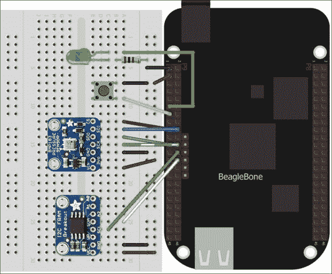
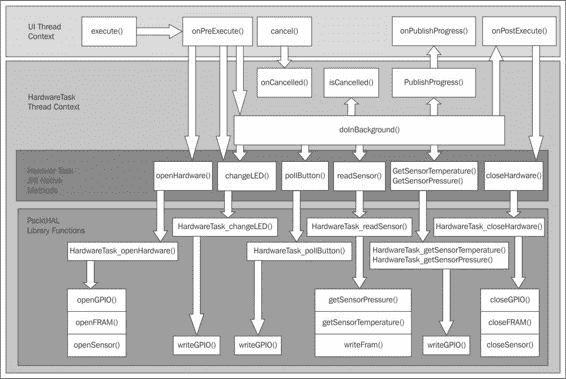

# 第六章：创建完整的接口解决方案

在本书的前几章中，你使用 GPIOs、I2C 和 SPI 与设备进行接口。你使用`AsyncTask`在后台线程中执行硬件接口，并探讨了如何构建一个应用以与这些线程交互。

在本章中，你将把这些概念结合起来，创建一个使用这三种接口方法的电路，并探索一个将所有接口结合在一起使用的应用，以构建一个复杂的系统。

在本章中，我们将讨论以下主题：

+   构建完整的接口电路

+   探索最终的示例应用

# 构建完整的接口电路

本章使用的接口电路是第 3、4 和 5 章描述的电路的组合。如果你已经成功构建了之前章节的电路，那么你已经很好地理解了本章电路的组成。如果你按照早期章节的说明紧密构建了这些电路，请将它们留在面包板上，以节省你的努力。

下图展示了传感器开发板、FRAM 开发板、LED、按钮开关、电阻与 BBB 之间的连接。如果你还没有完成，请回顾第 3、4 和 5 章，详细了解如何构建电路的 GPIO、FRAM 和 SPI 部分。



使用 GPIOs、I2C 和 SPI 组件与 BBB 进行接口的完整硬件接口电路

# 探索完整的示例应用

在本节中，你将研究一个示例 Android 应用，该应用在 BBB 上执行 GPIO、I2C 和接口。该应用旨在演示如何使用 PacktHAL 从实际应用中的一组接口函数执行各种硬件任务。与之前的示例应用不同，它们从用户那里获取输入，而这个应用直接从硬件本身获取所有输入。这需要比早期应用更复杂的方法。

在深入探讨应用代码之前，你必须在你的开发系统上安装代码，并在你的 Android 系统上安装应用。该应用的源代码以及预编译的`.apk`包位于`chapter6.tgz`文件中，可以从 Packt 网站下载。按照第三章《使用 GPIO 处理输入和输出》中描述的过程，下载并将应用添加到你的 Eclipse ADT 环境中。

## 应用的用户界面

在 Android 系统上启动`complete`应用程序以查看应用程序的 UI。如果你使用的是触摸屏保护盖，只需在屏幕上轻触`complete`应用程序的图标即可启动应用程序并与其 UI 交互。如果你使用 HDMI 进行视频输出，请将 USB 鼠标连接到 BBB 的 USB 端口，并使用鼠标点击传感器应用程序图标以启动应用程序。

应用程序使用一个非常简单的 UI，在单个活动中默认显示两个文本视图，这是`MainActivity`。


在从传感器接收到第一组样本之前，完整应用程序屏幕的外观。

这个应用程序中没有按钮或其他 UI 元素，因为用户与应用程序的唯一交互是通过电路的 GPIO 按钮开关。当用户按下开关时，应用程序会执行一系列硬件接口操作：

+   LED 灯将点亮以通知用户开关已被识别为按下状态。在列表上的所有事件发生之前，LED 灯将保持亮起。当 LED 灯亮起时，任何进一步的开关输入都会被忽略。

+   从传感器获取温度和压力样本，并将其写入 FRAM。

+   从 FRAM 读取以获取存储的温度和压力样本值。

+   温度和压力样本的值显示在应用程序的 UI 中。

+   将会发生 1 秒钟的延迟。

+   LED 灯将熄灭，此时可以再次按下开关以触发另一个样本-存储-检索-显示周期。

应用程序执行的各种操作使其接口行为比本书中之前示例应用程序更为复杂。这个应用程序不仅与单个硬件组件接口，而是同时与 GPIO、I2C 和 SPI 设备接口，以提供具有持久存储的完整传感器解决方案。然而，它基于本书中其他示例应用程序所展示的相同的基本接口概念。

## 了解应用程序中的硬件轮询。

之前的程序要么直接使用按钮的`onClick()`处理程序与硬件（GPIOs）接口，要么触发`AsyncTask`（I2C 和 SPI）的实例化和执行以与硬件接口。在这两种情况下，与硬件的接口都是由应用程序中的软件事件，即`onClick()`处理程序的执行触发的。

然而，在本章的应用程序中，我们希望响应开关被按下产生的硬件事件来触发硬件接口。监听硬件事件是接口的一个重要部分，因为它允许硬件在发生感兴趣的事件时通知我们。我们并不总是能够告诉硬件执行某项操作并期待硬件执行。有时，硬件需要通知我们发生了某个事件。

当从内核驱动程序与硬件接口时，驱动程序可以通过注册在硬件中断发生时通知其的机制来获知感兴趣的硬件事件。硬件中断会立即告诉内核硬件发生了值得注意的事情，并且内核将停止当前操作，以允许适当的内核驱动程序处理中断。

由于我们的应用程序是在用户空间执行更高级的接口逻辑，因此我们无法注册中断来通知我们感兴趣的事件发生的时间。这种硬件事件可能随时异步发生，所以应用程序必须不断轮询（或检查）开关的状态，以确定它是否被按下。通常应用程序不会轮询事件，因为它们依赖于 Android 框架在发生有趣的事情时通知它们，但是当应用程序在没有管理器帮助的情况下执行硬件接口时，轮询变得必要。

应用程序轮询硬件的速度越快，错过感兴趣硬件事件发生的几率就越小。然而，在紧密循环中不断轮询是一个糟糕的想法，因为它会不断消耗 CPU 周期（以及移动设备中的电池寿命），这些资源可以更好地用在其他地方。如果你的应用程序中包含轮询，你必须找到一个性能和资源使用之间的良好平衡。

在 UI 线程的上下文中放置一个轮询循环是一个糟糕的做法。请记住，在 UI 线程上下文中执行处理程序方法的时间过长将导致 Android 触发 ANR 对话框。为了避免这个问题，应用程序必须实例化`AsyncTask`，它在后台线程中执行硬件轮询。本书前面的示例应用程序使用了`AsyncTask`线程与硬件设备进行通信，但`AsyncTask`线程是短命的。`AsyncTask`线程的后台线程仅在它与硬件接口时活跃。一旦完成接口操作，线程就会终止。如果应用程序需要再次与硬件通信，会实例化一个新的`AsyncTask`线程并通过其`execute()`方法启动。

由于我们的应用程序必须使用`AsyncTask`不断轮询开关以检查用户输入，因此应用程序中使用的`AsyncTask`线程是一个长生命周期的线程。应用程序不是只在需要与硬件通信的时刻实例化并调用`execute()`方法，而是在每次进入**恢复状态**时实例化并执行`AsyncTask`。`AsyncTask`线程在后台继续执行，直到应用程序进入**暂停状态**。

### 注意

要了解 Android 应用活动在各种生命周期状态之间转换的详细信息，例如恢复状态和暂停状态，请参考官方 Android 开发者文档：[`developer.android.com/training/basics/activity-lifecycle/index.html`](http://developer.android.com/training/basics/activity-lifecycle/index.html)。

## 使用长生命期线程的 AsyncTask

在我们之前的示例应用中，已经使用了`AsyncTask`基类中的四种方法。这些方法用于在`AsyncTask`中实现短生命期和长生命期的线程：

+   `onPreExecute()`

+   `doInBackground()`

+   `onPostExecute()`

+   `execute()`

在本章中，你将使用`AsyncTask`类的五种附加方法。这些附加方法可用于增强短生命期线程的功能，几乎总是用于长生命期后台线程与线程通信，并在其运行时接收反馈：

+   `cancel()`

+   `onCancelled()`

+   `isCancelled()`

+   `publishProgress()`

+   `doPublishProgress()`

`cancel()`、`onCancelled()`和`isCancelled()`方法用于在应用的主活动`MainActivity`离开恢复状态时停止当前正在执行的`AsyncTask`方法。`cancel()`方法从 UI 线程上下文中调用，通知`AsyncTask`类已被取消并应停止执行。调用`cancel()`会触发在`AsyncTask`线程上下文中调用`onCancelled()`方法。然后`onCancelled()`给`AsyncTask`类一个执行任何必要清理任务的机会。`isCancelled()`方法可以在任何时候从`AsyncTask`线程上下文中调用，以确定是否已调用`cancel()`和`onCancelled()`。这个方法通常在`doInBackground()`方法内的循环中调用。

`publishProgress()`和`doPublishProgress()`方法允许`AsyncTask`线程通知 UI 线程应通过应用 UI 向用户显示的任何信息。例如，如果一个`AsyncTask`线程正在从网络复制一个大文件，这两个方法会通知 UI 线程已复制的文件部分和剩余文件传输的预计时间。UI 线程然后可以更新 UI 以显示这些信息，让应用的用户了解`AsyncTask`线程的进度。

早前章节中的示例应用没有使用这五个新的`AsyncTask`方法，因为那些应用使用的`AsyncTask`方法是短生命周期的线程，并通过`onPostExecute()`方法更新屏幕。由于`onPostExecute()`方法在 UI 线程中执行，所以那些应用中没有使用`publishProgress()`和`doPublishProgress()`的必要。那些应用中的`AsyncTask`线程在应用处于恢复状态时执行，而且线程生命周期非常短，因此没有必要使用`cancel()`或`onCancelled()`来终止线程的执行。由于那些应用在它们的`doInBackground()`方法中没有使用循环，所以也没有必要使用`isCancelled()`。

## 使用 HardwareTask 类

与前面章节中的示例应用类似，`complete`应用使用了一个从`AsyncTask`派生的`HardwareTask`类。所有硬件接口都是通过`HardwareTask`中的方法完成的。



在其中执行 HardwareTask 方法和 PacktHAL 函数的线程上下文。此图像中的 JNI 函数已经将它们的函数名前缀缩短为 HardwareTask。

传感器应用的`HardwareTask`类提供了七个`native`方法，用于调用与 GPIO、FRAM 和传感器硬件接口相关的 PacktHAL JNI 函数：

```java
public class HardwareTask extends AsyncTask<Void, Void, Boolean> {

  private native boolean openHardware();
  private native boolean pollButton();
  private native boolean changeLED(boolean lit);
  private native boolean readSensor();
  private native float getSensorTemperature();
  private native float getSensorPressure();
  private native boolean closeHardware();
```

由于大部分硬件接口的细节都被封装在 PacktHAL 函数中，并且对`complete`应用隐藏，除了一个方法之外，这些方法都不接受任何参数。它们只是通过 PacktHAL JNI 包装函数调用其对应的 PacktHAL 函数。这个例外是`changeLED()`方法，它接受一个参数来指定 LED 是打开还是关闭。

在`complete`应用中，当`MainActivity`类变为恢复状态时，`MainActivity`类的`onResume()`方法会实例化一个新的`HardwareTask`类：

```java
    public void onResume() {
        super.onResume();

        // Create our background hardware communication thread
        hwTask = new HardwareTask();
        hwTask.pollHardware(this);
    }
```

`pollHardware()`方法通过调用基`AsyncTask`类的`execution()`方法创建一个新线程，开始硬件接口过程。

```java
    public void pollHardware(Activity act) {
      mCallerActivity = act;
      execute();
    }
```

当`MainActivity`类变为暂停状态时，`MainActivity`类的`onPause()`方法会停止`AsyncTask`类的执行：

```java
    public void onPause() {
        super.onPause();

        // Release the hardware when the app is paused
        if (hwTask != null) {
          hwTask.cancel(true);
          hwTask = null;
        }
    }
```

`AyncTask`基类的`cancel()`方法通过调用`HardwareTask`中的`onCancelled()`方法开始取消正在执行的`AsyncTask`线程的过程。除了通知`AsyncTask`基类执行已被取消之外，在`HardwareTask`类中还设置了`isDone`布尔标志：

```java
    protected void onCancelled() {
        Log.i("HardwareTask", "Cancelled.");
        isDone = true;
    }
```

一旦`MainActivity`转变为恢复状态，`HardwareTask`的`pollHardware()`方法就会开始执行`AsyncTask`线程。在`onPreExecute()`中，重置`isDone`标志，并通过`openHardware()`方法初始化 GPIO、I2C 和 SPI 设备。如果硬件初始化成功，接下来会通过`changeLED()`调用关闭 LED：

```java
protected void onPreExecute() {    
    Log.i("HardwareTask", "onPreExecute");
    isDone = false;
    ...
    if (!openHardware()) {
      Log.e("HardwareTask", "Error opening hardware");
      isDone = true;
    } else {
      changeLED(false);
    }
  }
```

`onPreExecute()` 完成后，`AsyncTask` 后台线程开始运行。`doInBackground()` 方法开始执行。由于这是一个长生命周期的线程，`doInBackground()` 中有一个 `while` 循环，它会一直执行，直到被主 UI 线程取消：

```java
protected Boolean doInBackground(Void... params) { 

      ...

      // Poll the button until an error or done
      while (!isDone && !isCancelled()) {
```

循环开始时通过轮询推按按钮开关的状态。如果开关被按下，硬件接口逻辑将开始与 FRAM 和传感器通信。如果开关未被按下，则跳过接口逻辑。在这两种情况下，通过 `Thread.sleep()` 方法调用添加了短暂的延迟，以使后台线程有机会休眠并允许其他线程运行。这限制了后台线程的资源消耗，并给其他进程和线程运行的机会：

```java
      while (!isDone && !isCancelled()) {
         if (pollButton()) {
...
         }
         Thread.sleep(100);
      }
      ...        
      return false;
}
```

如果 `pollButton()` 方法表明按钮被按下，硬件接口逻辑开始执行。这会调用各种本地方法，从而调用 PacktHAL JNI 函数。

首先，`changeLED()` 函数会点亮 LED，让用户知道即将进行采样：

```java
            if (!changeLED(true)) {
               Log.e("HardwareTask", "Unable to turn LED on");
            }
```

接下来，获取传感器样本并将结果存储在 FRAM 中。`readSensor()` 本地方法与传感器交互以获取样本数据，然后将温度和压力样本存储在 FRAM 内存的前八个字节中：

```java
            if (!readSensor())
            {
               Log.e("HardwareTask", "Unable to read sensor");
            }
```

### 注意

温度数据以 4 字节的浮点数形式存储在 FRAM 的前四个字节中，压力数据以 4 字节的浮点数形式存储在 FRAM 的后四个字节中。如果你对在本地代码中如何实现这一点感兴趣，可以查看 PacktHAL 中 `jni/jni_wrapper.c` 文件中的 `Java_com_packt_complete_HardwareTask_readSensor()` 函数。

之后，访问 FRAM 以获取温度和压力样本：

```java
            temperature = getSensorTemperature();
            pressure = getSensorPressure();
```

最后，通过 `publishProgress()` 方法在主 UI 线程中更新新的样本数据。线程休眠 1 秒后，LED 熄灭。此时，`pollButton()` 检查完成，`while` 循环再次开始：

```java
            publishProgress();
            Thread.sleep(1000);
            if (!changeLED(false)) {
               Log.e("HardwareTask", "Unable to turn LED off");
            }
         } // End of pollButton() check
```

`publishProgress()` 方法触发 `HardwareTask` 的 `onProgressUpdate()` 方法，该方法在 UI 线程中执行。`onProgressUpdate()` 方法调用 `MainActivity` 类的 `updateSensorData()` 方法：

```java
   protected void onProgressUpdate(Void... values) {
      ((MainActivity)mCallerActivity).
         updateSensorData(temperature, pressure);
   }
```

`MainActivity` 类中的 `updateSensorData()` 方法会更新应用的 UI，并为用户提供 `Toast` 消息：

```java
    public void updateSensorData(float temperature, float pressure) {
      Toast toast = Toast.makeText(getApplicationContext(), 
          "Updating sensor data", Toast.LENGTH_SHORT);
      TextView tv = (TextView) findViewById(R.id.temperatureTextView);    
       tv.setText("Temperature: " + temperature);

    tv = (TextView) findViewById(R.id.pressureTextView);
       tv.setText("Pressure: " + pressure);

       toast.show();
    }
```

`HardwareTask` 类的 `doInBackground()` 方法中的主要轮询 `while` 循环最终会因为硬件接口初始化失败或被 `MainActivity` 取消的基础 `AsyncTask` 方法而退出。循环完成后，`doInBackground()` 将退出，`AsyncTask` 后台线程将终止。然后 `onPostExecute()` 方法将执行任何必要的清理工作，例如关闭硬件接口：

```java
   protected void onPostExecute(Boolean result) {
    if (!closeHardware()) {
      Log.e("HardwareTask", "Error closing hardware");
    }
       ...
    }
```

`HardwareTask` 实例现在已经完成了它的后台线程工作。如果 `MainActivity` 返回到恢复状态，将会实例化一个新的 `HardwareTask` 实例。这个 `HardwareTask` 实例将创建另一个长期运行的后台线程，硬件接口过程将重复进行。

### 提示

**你准备好迎接挑战了吗？**

既然你已经看到了完整应用程序的所有部分，为何不修改它以添加一些新的功能呢？作为一个挑战，尝试将应用程序修改为在按下按钮后持续采集样本。如果短时间按下按钮，停止采集样本。我们在 `chapter6_challenge.tgz` 文件中提供了一个可能的实现，你可以在 Packt 网站上下载。

# 总结

在本章中，我们介绍了用于硬件接口的长生命周期线程的概念。你构建了一个电路，将 GPIO 按钮开关、GPIO LED、FRAM 设备以及温度和压力传感器连接到 BBB。与之前章节中的示例应用程序不同，本章中的示例应用程序使用轮询来持续监控硬件的状态。你还探索了使用 `AsyncTask` 类的五种附加方法，用于后台线程和应用程序主 UI 线程之间的通信和控制。

现在你已经使用应用程序学习了与 Android 硬件接口的许多基本概念，是时候关注更大的画面，了解如何将你的原型解决方案转变为更持久的解决方案。

在下一章中，你将学习如何将你的解决方案与 Android 框架集成，将你的解决方案与 BBB 可用的其他 cape 结合，以及你可以用于未来接口项目中的其他接口。
