# 第二章：开始一个本地 Android 项目

> 拥有最强大工具的人，若不知如何使用，实则手无寸铁。Make、GCC、Ant、Bash、Eclipse……—任何新的 Android 程序员都需要处理这个技术生态系统。幸运的是，其中一些名字可能已经听起来很熟悉。实际上，Android 是基于许多开源组件构建的，由 Android 开发工具包及其特定的工具集：ADB、AAPT、AM、NDK-Build、NDK-GDB...掌握它们将赋予我们创建、构建、部署和调试我们自己的 Android 应用程序的能力。

在下一章深入探讨本地代码之前，让我们通过启动一个新的具体 Android 项目来发现这些工具，该项目包含本地 C/C++代码。尽管 Android Studio 是新的官方 Android IDE，但它对本地代码的支持不足，促使我们主要关注 Eclipse。

因此，在本章中，我们将要：

+   构建一个官方示例应用程序并将其部署在 Android 设备上

+   使用 Eclipse 创建我们的第一个本地 Android 项目

+   使用 Java Native Interfaces 接口将 Java 与 C/C++连接起来

+   调试一个本地 Android 应用程序

+   分析本地崩溃转储

+   使用 Gradle 设置包含本地代码的项目

到本章结束时，你应该知道如何独立开始一个新的本地 Android 项目。

# 构建 NDK 示例应用程序

开始使用新的 Android 开发环境的简单方法之一是编译和部署 Android NDK 提供的示例之一。一个可能的（而且*polygonful*！）选择是 2004 年由 Jetro Lauha 创建的**San Angeles**演示，后来被移植到 OpenGL ES（更多信息请访问[`jet.ro/visuals/4k-intros/san-angeles-observation/`](http://jet.ro/visuals/4k-intros/san-angeles-observation/)）。

# 行动时间 – 编译和部署 San Angeles 示例

让我们使用 Android SDK 和 NDK 工具来构建一个可工作的 APK：

1.  打开命令行提示符，进入 Android NDK 中的 San Angeles 示例目录。所有后续步骤都必须从这个目录执行。

    使用`android`命令生成 San Angeles 项目文件：

    ```java
    cd $ANDROID_NDK/samples/san-angeles
    android update project -p ./
    ```

    

    ### 提示

    执行此命令时，你可能会遇到以下错误：

    ```java
    Error: The project either has no target set or the target is invalid.
    Please provide a --target to the 'android update' command.

    ```

    这意味着你可能没有按照第一章，*设置你的环境*中指定的那样安装所有的 Android SDK 平台。在这种情况下，你可以使用`Android 管理工具`安装它们，或者指定你自己的项目目标，例如，`android update project --target 18 -p ./`。

1.  使用`ndk-build`编译 San Angeles 本地库：

1.  以**调试**模式构建和打包 San Angeles 应用程序：

    ```java
    ant debug

    ```

    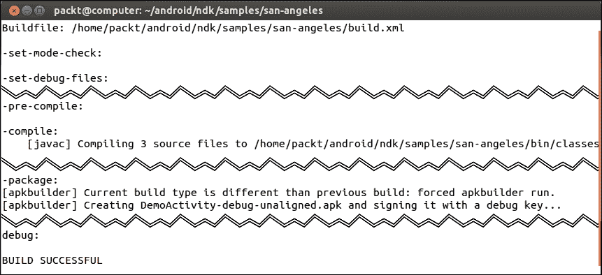

1.  确保你的 Android 设备已连接或已启动模拟器。然后部署生成的包：

    ```java
    ant installd

    ```

    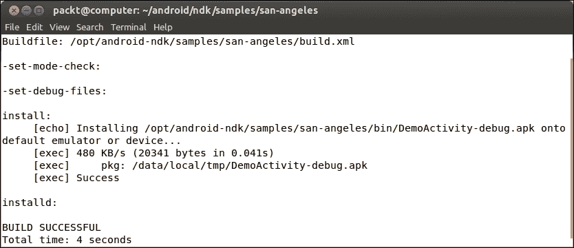

1.  在您的设备或模拟器上启动 `SanAngeles` 应用程序：

    ```java
    adb shell am start -a android.intent.action.MAIN -n com.example.SanAngeles/com.example.SanAngeles.DemoActivity

    ```

    

    ### 提示

    **下载示例代码**

    您可以从您在 [`www.packtpub.com`](http://www.packtpub.com) 的账户下载您购买的所有 Packt Publishing 书籍的示例代码文件。如果您在别处购买了这本书，可以访问 [`www.packtpub.com/support`](http://www.packtpub.com/support) 并注册，我们会直接将文件通过电子邮件发送给您。

## *刚才发生了什么？*

充满平面阴影多边形和怀旧气息的旧式 San Angeles 演示现在正在您的设备上运行。仅通过几行命令，涉及大部分 Android 开发所需的工具，就生成了一个包含原生 C/C++ 代码的完整应用程序，并编译、构建、打包、部署和启动。


让我们详细看看这个过程。

## 使用 Android 管理器生成项目文件

我们利用 Android 管理器从现有代码库生成了项目文件。以下关于此过程的详细信息：

+   `build.xml`：这是 Ant 文件，描述了如何编译并打包最终的 APK 应用程序文件（即 *Android PacKage*）。此构建文件主要包含属性和核心 Android Ant 构建文件的链接。

+   `local.properties`：这个文件包含了 Android SDK 的位置。每次 SDK 位置发生变化时，都应该重新生成这个文件。

+   `proguard-project.txt`：这个文件包含了 **Proguard** 的默认配置，Proguard 是用于 Java 代码的代码优化器和混淆器。关于它的更多信息可以在 [`developer.android.com/tools/help/proguard.html`](http://developer.android.com/tools/help/proguard.html) 找到。

+   `project.properties`：这个文件包含了应用程序的目标 Android SDK 版本。此文件默认从 `project` 目录中的预存在 `default.properties` 文件生成。如果没有 `default.properties`，则必须在 `android create` 命令中添加额外的 `–target <API Target>` 标志（例如，`--target 4` 表示 Android 4 Donut）。

### 注意

目标 SDK 版本与最低 SDK 版本不同。第一个版本描述了应用程序构建的最新 Android 版本，而后者表示应用程序允许运行的最低 Android 版本。两者都可以在 `AndroidManifest.xml` 文件（条款 `<uses-sdk>`）中可选声明，但只有目标 SDK 版本在 `project.properties` 中“重复”。

### 提示

当创建 Android 应用程序时，请仔细选择您希望支持的最低和目标 Android API，因为这可能会极大地改变您应用程序的功能以及您的受众范围。实际上，由于碎片化，目标往往在 Android 上移动得更快更多！

不以最新 Android 版本为目标的应用并不意味着它不能在该版本上运行。然而，它将无法使用所有最新的功能以及最新的优化。

Android 管理器是 Android 开发者的主要入口点。其职责与 SDK 版本更新、虚拟设备管理和项目管理相关。通过执行 `android –help` 可以从命令行详尽列出。由于我们在第一章，*设置你的环境*中已经了解了 SDK 和 AVD 管理，现在让我们关注其项目管理能力：

1.  `android create project` 允许从命令行空手起家创建新的 Android 项目。生成的项目只包含 Java 文件，不包含与 NDK 相关的文件。为了正确生成，必须指定一些额外的选项，例如：

    | 选项 | 描述 |
    | --- | --- |
    | `-a` | 主活动名称 |
    | `-k` | 应用程序包 |
    | `-n` | 项目名称 |
    | `-p` | 项目路径 |
    | `-t` | 目标 SDK 版本 |
    | `-g` 和 `-v` | 生成 Gradle 构建文件而不是 Ant，并指定其插件版本 |

    创建新项目的命令行示例如下：

    ```java
    android create project -p ./MyProjectDir -n MyProject -t android-8 -k com.mypackage -a MyActivity

    ```

1.  `android update project` 从现有源代码创建项目文件，如前面的教程所示。然而，如果它们已经存在，它还可以将项目目标升级到新的 SDK 版本（即 `project.properties` 文件）并更新 Android SDK 位置（即 `local.properties` 文件）。可用的标志略有不同：

    | 选项 | 描述 |
    | --- | --- |
    | `-l` | 要添加的库项目 |
    | `-n` | 项目名称 |
    | `-p` | 项目路径 |
    | `-t` | 目标 SDK 版本 |
    | `-s` | 更新子文件夹中的项目 |

    我们还可以使用 `-l` 标志附加新的库项目，例如：

    ```java
    android update project -p ./ -l ../MyLibraryProject

    ```

1.  `android create lib-project` 和 `android update lib-project` 管理库项目。这类项目并不适合原生 C/C++ 开发，尤其是在调试时，因为 NDK 有自己复用原生库的方式。

1.  `android create test-project`、`android update test-project` 和 `android create uitest-project` 管理单元测试和 UI 测试项目。

关于所有这些选项的更多详细信息可以在 Android 开发者网站找到，网址为 [`developer.android.com/tools/help/android.html`](http://developer.android.com/tools/help/android.html)。

## 使用 NDK-Build 编译原生代码

生成项目文件后，我们使用 `ndk-build` 编译第一个原生 C/C++ 库（也称为*模块*）。这个命令是 NDK 开发中最需要了解的基本命令，它实际上是一个 Bash 脚本，可以：

+   基于 GCC 或 CLang 设置 Android 原生编译工具链。

+   包装 `Make` 以控制原生代码构建，借助用户定义的 `Makefiles`：`Android.mk` 和可选的 `Application.mk`。默认情况下，`NDK-`

+   `Build`会在`jni`项目目录中查找，按照惯例本地 C/C++代码通常位于此处。

NDK-Build 从 C/C++源文件（在`obj`目录中）生成中间对象文件，并在`libs`目录中生成最终的二进制库（`.so`）。可以通过以下命令删除与 NDK 相关的构建文件：

```java
ndk-build clean

```

有关 NDK-Build 和 Makefiles 的更多信息，请参阅第九章，*将现有库迁移到 Android*。

## 使用 Ant 构建和打包应用程序

一个 Android 应用程序不仅仅由本地 C/C++代码组成，还包括 Java 代码。因此，我们有：

+   使用`Javac`(Java 编译器)编译位于`src`目录中的 Java 源文件。

+   Dexed 生成的 Java 字节码，即使用 DX 将其转换为 Android Dalvik 或 ART 字节码。实际上，Dalvik 和 ART 虚拟机（关于这些内容将在本章后面介绍）都基于一种特定的字节码运行，这种字节码以优化的格式存储，称为**Dex**。

+   使用 AAPT 打包 Dex 文件、Android 清单、资源（如图片等）以及最终的 APK 文件中的本地库，AAPT 也称为**Android 资源打包工具**。

所有这些操作都可以通过一个 Ant 命令汇总：`ant debug`。结果是在`bin`目录中生成一个调试模式的 APK。其他构建模式也可用（例如，发布模式），可以通过`ant help`列出。如果你想删除与 Java 相关的临时构建文件（例如，`Java .class`文件），只需运行以下命令行：

```java
ant clean

```

## 使用 Ant 部署应用程序包

使用 Ant 通过**ADB**可以部署打包的应用程序。可用的部署选项如下：

+   `ant installd` 用于调试模式

+   `ant installr` 用于发布模式

请注意，如果来自不同来源的同一应用程序的旧 APK 不能被新 APK 覆盖。在这种情况下，首先通过执行以下命令行删除先前的应用程序：

```java
ant uninstall

```

安装和卸载也可以直接通过 ADB 执行，例如：

+   `adb install` <应用程序 APK 的路径>：用于首次安装应用程序（例如，对于我们示例中的`bin/DemoActivity-debug.apk`）。

+   `adb install -r` <应用程序 APK 的路径>：用于重新安装应用程序并保留设备上的数据。

+   `adb uninstall` <应用程序包名>：用于卸载通过应用程序包名标识的应用程序（例如，对于我们示例中的`com.example.SanAngeles`）。

## 使用 ADB Shell 启动应用程序

最后，我们通过**活动管理器**（**AM**）启动了应用程序。用于启动 San Angeles 的 AM 命令参数来自`AndroidManifest.xml`文件：

+   `com.example.SanAngeles` 是应用程序包名（与我们之前展示的卸载应用程序时使用的相同）。

+   `com.example.SanAngeles.DemoActivity`是启动活动的规范类名（即简单类名与其包名相连）。以下是如何使用它们的一个简短示例：

    ```java
    <?xml version="1.0" encoding="utf-8"?>
    <manifest 
          package="com.example.SanAngeles"
          android:versionCode="1"
          android:versionName="1.0">
    ...
            <activity android:name=".DemoActivity"
                      android:label="@string/app_name">
    ```

因为 AM 位于你的设备上，所以需要通过 ADB 来运行。为此，ADB 提供了一个有限的类 Unix shell，它包含一些经典命令，如`ls`、`cd`、`pwd`、`cat`、`chmod`或`ps`以及一些 Android 特有的命令，如下表所示：

| `am` | 活动管理器不仅可以启动活动，还可以杀死活动，广播意图，开始/停止分析器等。 |
| --- | --- |
| `dmesg` | 用于转储内核信息。 |
| `dumpsys` | 用于转储系统状态。 |
| `logcat` | 用于显示设备日志信息。 |
| `run-as <用户 id> <命令>` | 使用`用户 id`权限运行命令。`用户 id`可以是应用程序包名，这可以访问应用程序文件（例如，`run-as com.example.SanAngeles ls`）。 |
| `sqlite3 <db 文件>` | 用于打开 SQLite 数据库（可以与`run-as`结合使用）。 |

ADB 可以通过以下方式之一启动：

+   使用参数中的命令，如步骤 5 中的 AM 所示，在这种情况下，Shell 运行单个命令并立即退出。

+   使用不带参数的`adb shell`命令，你可以将其作为一个经典 Shell 使用（例如，调用`am`和其他任何命令）。

ADB Shell 是一个真正的'*瑞士军刀*'，它允许你在设备上进行高级操作，特别是有了 root 权限。例如，可以观察部署在“沙箱”目录中的应用程序（即`/data/data`目录）或者列出并杀死当前运行中的进程。如果没有手机的 root 权限，可能执行的操作会更有限。更多信息请查看[`developer.android.com/tools/help/adb.html`](http://developer.android.com/tools/help/adb.html)。

### 提示

如果你了解一些关于 Android 生态系统的知识，你可能听说过已 root 的手机和未 root 的手机。**Root**手机意味着获取管理员权限，通常使用破解方法。Root 手机可以用来安装自定义的 ROM 版本（例如优化或修改过的**Cyanogen**）或者执行任何 root 用户能做的（尤其是危险的）操作（例如访问和删除任何文件）。Root 本身并不是非法操作，因为你是在修改自己的设备。然而，并不是所有制造商都欣赏这种做法，这通常会使得保修失效。

## 更多关于 Android 工具的信息

构建 San Angeles 示例应用程序可以让你一窥 Android 工具的能力。然而，在它们略显'原始'的外观背后，还有更多可能性。你可以在 Android 开发者网站找到更多信息，网址是[`developer.android.com/tools/help/index.html`](http://developer.android.com/tools/help/index.html)。

# 创建你的第一个本地 Android 项目

在本章的第一部分，我们了解了如何使用 Android 命令行工具。然而，使用 Notepad 或 VI 进行开发并不吸引人。编程应该是乐趣！为了使之有趣，我们需要我们喜欢的 IDE 来执行无聊或不实用的任务。现在，我们将了解如何使用 Eclipse 创建一个本地 Android 项目。

### 注意

本书提供的项目结果名为`Store_Part1`。

# 动手操作时间——创建一个本地 Android 项目

Eclipse 提供了一个向导来帮助我们设置项目：

1.  启动 Eclipse。在主菜单中，前往**File** | **New** | **Project…**。

1.  然后，在打开的**New project**向导中，选择**Android** | **Android Application Project**并点击**Next**。

1.  在下一个屏幕中，按如下所示输入项目属性并再次点击**Next**：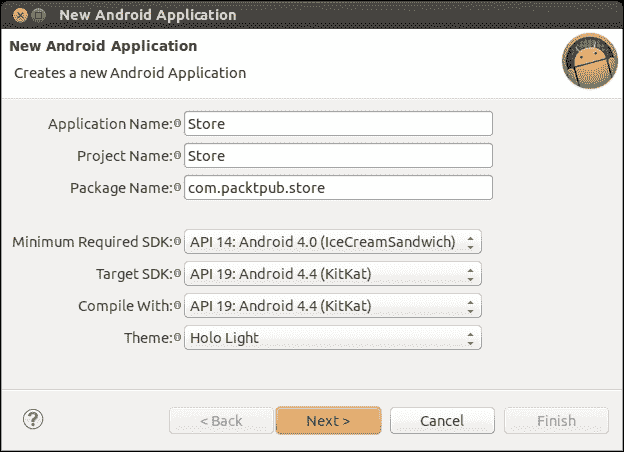

1.  点击**Next**两次，保留默认选项，以进入**Create activity**向导屏幕。选择**Blank activity with Fragment**并点击**Next**。

1.  最后，在**Blank Activity**屏幕中，按如下方式输入活动属性：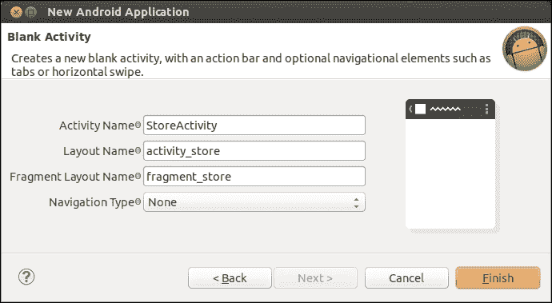

1.  点击**Finish**以验证。几秒钟后，向导消失，Eclipse 中会显示项目**Store**。

1.  为项目添加本地 C/C++支持。在**Package Explorer**视图中选择项目**Store**，并从其右键菜单中选择**Android Tools** | **Add Native Support...**。

1.  在打开的**Add Android Native Support**弹出窗口中，将库名称设置为`com_packtpub_store_Store`并点击**Finish**。

1.  项目目录中创建了`jni`和`obj`目录。第一个目录包含一个 makefile `Android.mk`和一个 C++源文件 `com_packtpub_store_Store.cpp`。

    ### 提示

    添加本地支持后，Eclipse 可能会自动将你的视角切换到 C/C++。因此，如果你的开发环境看起来与平时不同，只需检查 Eclipse 右上角的角度即可。你可以从 Java 或 C/C++的角度无障碍地处理 NDK 项目。

1.  在`src/com/packtpub/store/`目录下创建一个新的 Java 类`Store.java`。从静态代码块中加载`com_packtpub_store_Store`本地库：

    ```java
    package com.packtpub.store;

    public class Store {
     static {
     System.loadLibrary("com_packtpub_store_Store");
     }
    }

    ```

1.  编辑`src/com/packtpub/store/StoreActivity.java`。在活动的`onCreate()`中声明并初始化`Store`的新实例。由于我们不需要它们，可以删除可能由 Eclipse 项目创建向导创建的`onCreateOptionsMenu()`和`onOptionsItemSelected()`方法：

    ```java
    package com.packtpub.store;
    ...
    public class StoreActivity extends Activity {
     private Store mStore = new Store();

        @Override
        protected void onCreate(Bundle savedInstanceState) {
            super.onCreate(savedInstanceState);
            setContentView(R.layout.activity_store);

            if (savedInstanceState == null) {
                getFragmentManager().beginTransaction()
                                    .add(R.id.container,
                                         new PlaceholderFragment())
                                    .commit();
            }
        }

        public static class PlaceholderFragment extends Fragment {
            public PlaceholderFragment() {
            }

            @Override
            public View onCreateView(LayoutInflater inflater,
                                     ViewGroup container,
                                     Bundle savedInstanceState)
            {
                View rootView = inflater.inflate(R.layout.fragment_store,
                                                 container, false);
                return rootView;
            }
        }
    }
    ```

1.  连接你的设备或模拟器并启动应用程序。在**Package Explorer**视图中选择`Store`，然后从 Eclipse 主菜单导航至**Run** | **Run As** | **Android Application**。或者，点击 Eclipse 工具栏中的**Run**按钮。

1.  选择应用程序类型 **Android Application** 并点击 **OK**，进入以下界面：

## *刚才发生了什么？*

在几个步骤中，我们的第一个原生 Android 项目已经通过 Eclipse 创建并启动了。

1.  Android 项目创建向导可以帮助你快速入门。它生成了一个简单 Android 应用程序所需的最小代码。然而，默认情况下，新的 Android 项目只支持 Java 语言。

1.  借助 ADT，一个 Android Java 项目可以轻松地转变为支持原生 C/C++ 的混合项目。它生成了 NDK-Build 编译原生库所需的最小文件：

    `Android.mk` 是一个 Makefile，描述了要编译哪些源文件以及如何生成最终的原生库。

    `com_packtpub_store_Store.cpp` 是一个几乎为空的文件，包含了一个单一的包含指令。我们将在本章的下一部分解释这一点。

1.  项目设置完成后，动态加载原生库只需调用一次 `System.loadLibrary()`。这很容易在一个静态块中完成，确保在类初始化之前一次性加载库。请注意，这只有在容器类是从单个 Java 类加载器加载时才有效（通常情况下是这样的）。

使用像 Eclipse 这样的 IDE 真的可以大幅提高生产效率，让编程变得更加舒适！但如果你是一个命令行爱好者，或者想要锻炼你的命令行技能，那么第一部分，*构建 NDK 示例应用程序*，可以很容易地应用在这里。

### 介绍 Dalvik 和 ART。

说到 Android，不得不提一下 **Dalvik** 和 **ART**。

Dalvik 是一个 **虚拟机**，在其中解释 Dex 字节码（不是原生代码！）。它是任何在 Android 上运行的应用程序的核心。Dalvik 被设计为符合移动设备的限制性要求。它特别优化以使用更少的内存和 CPU。它位于 Android 内核之上，内核为硬件提供了第一层抽象（进程管理、内存管理等）。

ART 是新的 Android 运行时环境，自 Android 5 Lollipop 起取代了 Dalvik。与 Dalvik 相比，它大大提高了性能。实际上，Dalvik 在应用程序启动时 `即时` 解释字节码，而 ART 则是在应用程序安装期间 `提前` 将字节码预编译成原生代码。ART 与为早期 Dalvik 虚拟机打包的应用程序向后兼容。

Android 在设计时考虑了速度。因为大多数用户不希望在等待应用程序加载的同时，其他应用程序仍在运行，因此系统能够快速实例化多个 Dalvik 或 ART VM，这要归功于**Zygote**进程。Zygote（其名称来自生物体中第一个生物细胞，从中产生子细胞）在系统启动时开始运行。它预加载（或“预热”）所有应用程序共享的核心库以及虚拟机实例。要启动新应用程序，只需分叉 Zygote，初始 Dalvik 实例因此被复制。通过尽可能多地共享进程之间的库，降低内存消耗。

Dalvik 和 ART 本身是由为目标 Android 平台（ARM、X86 等）编译的原生 C/C++代码构成的。这意味着，只要使用相同的**应用程序二进制接口**（**ABI**）（它基本上描述了应用程序或库的二进制格式），就可以轻松地将这些虚拟机与原生 C/C++库进行接口交互。这就是 Android NDK 的作用。更多信息，请查看**Android 开源项目**（**AOSP**），即 Android 源代码，在[`source.android.com/`](https://source.android.com/)。

# Java 与 C/C++接口

原生 C/C++代码能够释放应用程序的强大功能。为此，Java 代码需要调用并运行其原生对应部分。在本部分，我们将把 Java 和原生 C/C++代码接口在一起。

### 注意

本书提供的项目名为`Store_Part2`。

# 行动时间 - 从 Java 调用 C 代码

让我们创建第一个原生方法，并从 Java 端调用它：

1.  打开`src/com/packtpub/store/Store.java`文件，并为`Store`声明一个查询原生方法。此方法返回`int`类型的条目数量。无需定义方法体：

    ```java
    package com.packtpub.store;

    public class Store {
        static {
            System.loadLibrary("com_packtpub_store_Store");
        }

     public native int getCount();
    }
    ```

1.  打开`src/com/packtpub/store/StoreActivity.java`文件，并初始化商店。使用其`getCount()`方法的值来初始化应用程序标题：

    ```java
    public class StoreActivity extends Activity {
        ...
        public static class PlaceholderFragment extends Fragment {
     private Store mStore = new Store();
         ...
            public PlaceholderFragment() {
            }

            @Override
            public View onCreateView(LayoutInflater inflater,
                                     ViewGroup container,
                                     Bundle savedInstanceState)
            {
                View rootView = inflater.inflate(R.layout.fragment_store,
                                                 container, false);
     updateTitle();
                return rootView;
            }

     private void updateTitle() {
     int numEntries = mStore.getCount();
     getActivity().setTitle(String.format("Store (%1$s)",
     numEntries));
            }
        }
    }
    ```

1.  从`Store`类生成 JNI 头文件。转到 Eclipse 主菜单，选择**运行** | **外部工具** | **外部工具配置…**。使用以下参数创建一个新的**程序**配置，如下截图所示：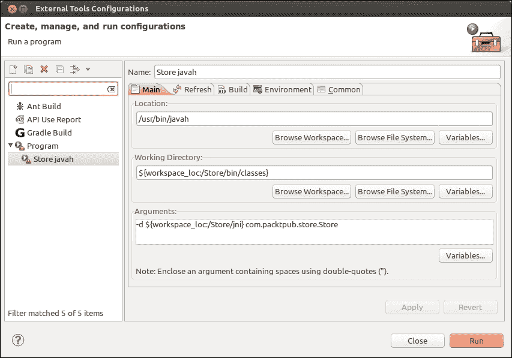

    **位置**指的是`javah`的绝对路径，这是特定于操作系统的。在 Windows 上，你可以输入`${env_var:JAVA_HOME}\bin\javah.exe`。在 Mac OS X 和 Linux 上，通常是`/usr/bin/javah`。

1.  在**刷新**标签中，勾选**完成后刷新资源**，并选择**特定资源**。使用**指定资源…**按钮，选择`jni`文件夹。最后，点击**运行**以执行`javah`。然后会生成一个名为`jni/com_packtpub_store_Store.h`的新文件。这包含了 Java 端期望的原生方法`getCount()`的原型：

    ```java
    /* DO NOT EDIT THIS FILE - it is machine generated */
    #include <jni.h>
    /* Header for class com_packtpub_store_Store */

    #ifndef _Included_com_packtpub_store_Store
    #define _Included_com_packtpub_store_Store
    #ifdef __cplusplus
    extern "C" {
    #endif
    /*
     * Class:     com_packtpub_store_Store
     * Method:    getCount
     * Signature: ()I
     */
    JNIEXPORT jint JNICALL Java_com_packtpub_store_Store_getCount
      (JNIEnv *, jobject);

    #ifdef __cplusplus
    }
    #endif
    #endif
    ```

1.  我们现在可以实现在`jni/com_packtpub_store_Store.cpp`中的方法，使其在调用时返回`0`。方法签名来自生成的头文件（你可以替换之前的任何代码），不过这里明确指定了参数名称：

    ```java
    #include "com_packtpub_store_Store.h"

    JNIEXPORT jint JNICALL Java_com_packtpub_store_Store_getCount
      (JNIEnv* pEnv, jobject pObject) {
        return 0;
    }
    ```

1.  编译并运行应用程序。

## *刚才发生了什么？*

Java 现在可以与 C/C++对话了！在上一部分，我们创建了一个混合 Android 项目。在这一部分，我们通过 Java 本地接口（JNI）将 Java 与本地代码接口。这种合作是通过**Java Native Interfaces**（**JNI**）建立的。JNI 是连接 Java 与 C/C++的桥梁。这个过程主要分为三个步骤。

在 Java 端定义本地方法原型，使用 native 关键字标记。这些方法没有方法体，就像抽象方法一样，因为它们是在本地端实现的。本地方法可以有参数、返回值、可见性（私有、保护、包保护或公共），并且可以是静态的：就像普通的 Java 方法一样。

本地方法可以在 Java 代码的任何地方被调用，前提是在调用之前已经加载了包含本地库。如果未能做到这一点，将会抛出类型为`java.lang.UnsatisfiedLinkError`的异常，这个异常是在首次调用本地方法时产生的。

使用`javah`生成一个带有相应本地 C/C++原型的头文件。尽管这不是强制的，但 JDK 提供的`javah`工具对于生成本地原型非常有用。实际上，JNI 约定既繁琐又容易出错（关于这一点在第三章，*使用 JNI 接口 Java 和 C/C++*中有更多介绍）。JNI 代码是从`.class`文件生成的，这意味着你的 Java 代码必须首先被编译。

编写本地 C/C++代码实现以执行预期操作。在这里，当查询`Store`库时，我们简单地返回`0`。我们的本地库在`libs/armeabi`目录（针对 ARM 处理器的目录）中编译，并命名为`libcom_packtpub_store_Store.so`。编译过程中生成的临时文件位于`obj/local`目录中。

尽管表面看起来很简单，但将 Java 与 C/C++接口比看上去要复杂得多。在第三章，*使用 JNI 接口 Java 和 C/C++*中，将更详细地探讨如何在本地端编写 JNI 代码。

# 调试本地 Android 应用程序

在深入探讨 JNI 之前，还有一个任何 Android 开发者都需要知道如何使用的最后一个重要工具：**调试器**。官方 NDK 提供的调试器是 GNU 调试器，也称为**GDB**。

### 注意

本书提供的项目名为`Store_Part3`。

# 动手实践——调试一个本地 Android 应用程序

1.  创建文件`jni/Application.mk`，内容如下：

    ```java
    APP_PLATFORM := android-14
    APP_ABI := armeabi armeabi-v7a x86
    ```

    ### 提示

    这些并不是 NDK 提供的唯一 ABI；还有更多的处理器架构，如 MIPS 或变体如 64 位或硬浮点。这里使用的这些是你应该关注的主要架构。它们可以轻松地在模拟器上进行测试。

1.  打开**项目属性**，进入**C/C++构建**，取消勾选**使用默认构建命令**并输入`ndk-build NDK_DEBUG=1`: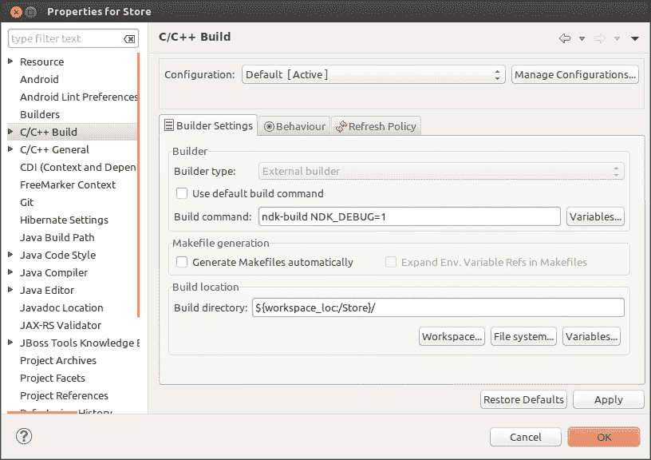

1.  在`jni/com_packtpub_store_Store.cpp`中，通过在 Eclipse 编辑器边栏双击，在`Java_com_packtpub_store_Store_getCount()`方法内部设置一个断点。

1.  在**包浏览器**或**项目浏览器**视图中选择`Store`项目，并选择**调试为** | **Android 本地应用程序**。应用程序开始运行，但可能会发现什么也没有发生。实际上，在 GDB 调试器能够附加到应用程序进程之前，很可能会达到断点。

1.  离开应用程序，并从你的设备应用菜单重新打开它。这次，Eclipse 会在本地断点处停止。查看你的设备屏幕，UI 应该已经冻结，因为主应用程序线程在本地代码中暂停了。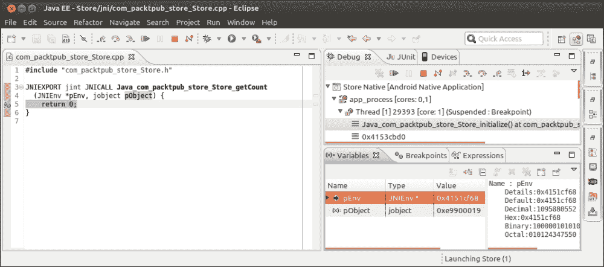

1.  在**变量**视图中检查变量，并在**调试**视图中查看调用堆栈。在**表达式**视图中输入`*pEnv.functions`并打开结果表达式，以查看`JNIEnv`对象提供的各种函数。

1.  通过 Eclipse 工具栏或快捷键*F6*来**单步跳过**当前指令（也可以使用快捷键*F7*进行**单步进入**）。以下指令将被高亮：

    +   通过 Eclipse 工具栏或快捷键*F8*来**恢复**执行。应用程序界面将再次显示在你的设备上。

    +   通过 Eclipse 工具栏或快捷键*Ctrl*+*F2*来**终止**应用程序。应用程序被杀死，**调试**视图会被清空。

## *刚才发生了什么？*

这个有用的生产力工具——调试器，现在是我们工具箱中的资产。我们可以轻松地在任何点停止或恢复程序执行，单步进入、跳过或离开本地指令，并检查任何变量。这种能力得益于 NDK-GDB，它是命令行调试器 GDB（手动使用可能比较麻烦）的包装脚本。幸运的是，GDB 得到了 Eclipse CDT 的支持，进而也得到了 Eclipse ADT 的支持。

在 Android 系统上，以及更普遍的嵌入式设备上，GDB 被配置为客户端/服务器模式，而程序作为服务器在设备上运行（`gdbserver`，它是由 NDK-Build 在`libs`目录中生成的）。远程客户端，即开发者的工作站上的 Eclipse，连接并发送远程调试命令。

## 定义 NDK 全应用设置

为了帮助 NDK-Build 和 NDK-GDB 完成它们的工作，我们创建了一个新的`Application.mk`文件。这个文件应被视为一个全局 Makefile，定义了应用程序范围的编译设置，例如以下内容：

+   `APP_PLATFORM`：应用程序针对的 Android API。这个信息应该是`AndroidManifest.xml`文件中`minSdkVersion`的重复。

+   `APP_ABI`：应用程序针对的 CPU 架构。应用程序二进制接口指定了可执行文件和库二进制文件的二进制代码格式（指令集、调用约定等）。ABIs 因此与处理器密切相关。可以通过额外的设置，如`LOCAL_ARM_CODE`来调整 ABI。

当前 Android NDK 支持的主要 ABI 如下表所示：

| **armeabi** | 这是默认选项，应该与所有 ARM 设备兼容。Thumb 是一种特殊的指令集，它将指令编码为 16 位而不是 32 位，以提高代码大小（对于内存受限的设备很有用）。与 ArmEABI 相比，指令集受到严重限制。 |
| --- | --- |
| **armeabi**（当`LOCAL_ARM_CODE = arm`时） | （或 ARM v5）应该能在所有 ARM 设备上运行。指令编码为 32 位，但可能比 Thumb 代码更简洁。ARM v5 不支持浮点加速等高级扩展，因此比 ARM v7 慢。 |
| **armeabi-v7a** | 支持如 Thumb-2（类似于 Thumb，但增加了额外的 32 位指令）和 VFP 等扩展，以及一些可选扩展，如 NEON。为 ARM V7 编译的代码不能在 ARM V5 处理器上运行。 |
| **armeabi-v7a-hard** | 这个 ABI 是 armeabi-v7a 的扩展，它支持硬件浮点而不是软浮点。 |
| **arm64-v8a** | 这是专为新的 64 位处理器架构设计的。64 位 ARM 处理器向后兼容旧的 ABI。 |
| **x86 和 x86_64** | 针对类似“PC”的处理器架构（即 Intel/AMD）。这些是在模拟器上使用的 ABI，以便在 PC 上获得硬件加速。尽管大多数 Android 设备是 ARM，但其中一些现在基于 X86。x86 ABI 用于 32 位处理器，而 x86_64 用于 64 位处理器。 |
| **mips 和 mips64** | 针对由 MIPS Technologies 制造的处理器设计，现在属于 Imagination Technologies，后者以 PowerVR 图形处理器而闻名。在撰写本书时，几乎没有设备使用这些 ABI。mips ABI 用于 32 位处理器，而 mips64 用于 64 位处理器。 |
| **all, all32 和 all64** | 这是一个快捷方式，用于为所有 32 位或 64 位 ABI 构建 ndk 库。 |

每个库和中间对象文件都会针对每个 ABI 重新编译。它们存储在各自独立的目录中，可以在`obj`和`libs`文件夹中找到。

在`Application.mk`内部还可以使用更多的标志。我们将在第九章《*将现有库移植到 Android*》中详细了解这一点。

`Application.mk`标志并不是确保 NDK 调试器工作的唯一设置；还需要手动传递`NDK_DEBUG=1`给 NDK-Build，这样它才能编译调试二进制文件并正确生成 GDB 设置文件（`gdb.setup`和`gdbserver`）。请注意，这应该更多地被视为 Android 开发工具的缺陷，而不是一个真正的配置步骤，因为通常它应该能自动处理调试标志。

## NDK-GDB 的日常使用

NDK 和 Eclipse 中的调试器支持是近期才出现的，并且在 NDK 的不同版本之间有了很大的改进（例如，之前无法调试纯本地线程）。然而，尽管现在调试器已经相当可用，但在 Android 上进行调试有时可能会出现错误、不稳定，并且相对较慢（因为它需要与远程的 Android 设备进行通信）。

### 提示

NDK-GDB 有时可能会出现疯狂的现象，在一个完全不正常的堆栈跟踪处停止在断点。这可能与 GDB 在调试时无法正确确定当前的 ABI 有关。要解决这个问题，只需在`APP_ABI`子句中放入对应设备的 ABI，并移除或注释掉其他的。

NDK 调试器在使用上也可能有些棘手，例如在调试本地启动代码时。实际上，GDB 启动不够快，无法激活断点。克服这个问题的简单方法是让本地代码在应用程序启动时暂停几秒钟。为了给 GDB 足够的时间来附加应用程序进程，我们可以例如这样做：

```java
#include <unistd.h>
…
sleep(3); // in seconds.
```

另一个解决方案是启动一个调试会话，然后简单地离开并从设备上重新启动应用程序，正如我们在之前的教程中看到的那样。这是可行的，因为 Android 应用程序的生命周期是这样的：当应用程序在后台时，它会保持存活，直到需要内存。不过，这个技巧只适用于应用程序在启动过程中没有崩溃的情况。

# 分析本地崩溃转储

每个开发人员都有过一天在他们的应用程序中遇到意外的崩溃。不要为此感到羞愧，我们所有人都经历过。作为 Android 本地开发的新手，这种情况还会发生很多次。调试器是查找代码问题的巨大工具。遗憾的是，它们在程序运行时的“实时”工作。面对难以复现的致命错误时，它们变得无效。幸运的是，有一个工具可以解决这个问题：**NDK-Stack**。NDK-Stack 可以帮助你读取崩溃转储，以分析应用程序在崩溃那一刻的堆栈跟踪。

### 注意

本书提供的示例项目名为`Store_Crash`。

# 动手时间——分析一个本地崩溃转储

让我们的应用程序崩溃，看看如何读取崩溃转储：

1.  在`jni/com_packtpub_store_Store.cpp`中模拟一个致命错误：

    ```java
    #include "com_packtpub_store_Store.h"

    JNIEXPORT jint JNICALL Java_com_packtpub_store_Store_getCount
      (JNIEnv* pEnv, jobject pObject) {
     pEnv = 0;
     return pEnv->CallIntMethod(0, 0);
    }
    ```

1.  在 Eclipse 中打开 **LogCat** 视图，选择 **所有消息（无筛选）** 选项，然后运行应用程序。日志中出现了崩溃转储。这看起来不美观！如果你仔细查看，应该能在其中找到带有应用程序崩溃时刻调用栈快照的 `backtrace` 部分。然而，它没有给出涉及的代码行：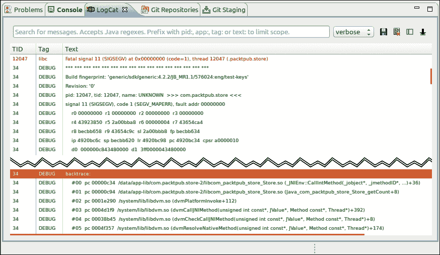

1.  从命令行提示符进入项目目录。通过使用 `logcat` 作为输入运行 NDK-Stack，找到导致崩溃的代码行。NDK-Stack 需要对应于应用程序崩溃的设备 ABI 的 `obj` 文件，例如：

    ```java
    cd <projet directory>
    adb logcat | ndk-stack -sym obj/local/armeabi-v7a

    ```

    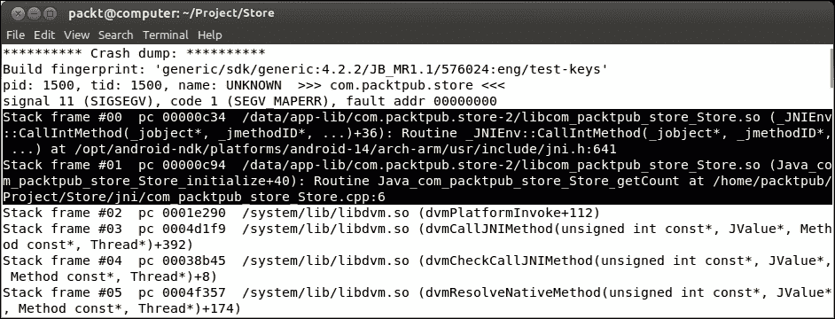

## *刚才发生了什么？*

Android NDK 提供的 NDK-Stack 工具可以帮助你定位应用程序崩溃的源头。这个工具是不可或缺的帮助，当发生严重的崩溃时，应被视为你的急救包。然而，如果它能指出*在哪里*，那么找出*为什么*就是另一回事了。

**堆栈跟踪**只是崩溃转储的一小部分。解读转储的其余部分很少是必要的，但理解其含义对提高一般文化素养有帮助。

## 解读崩溃转储

崩溃转储不仅是为了那些在二进制代码中看到穿红衣服女孩的过于有才华的开发者，也是为了那些对汇编器和处理器工作方式有基本了解的人。这个跟踪的目标是尽可能多地提供程序在崩溃时的当前状态信息。它包含：

+   第一行：**构建指纹**是一种标识符，表示当前运行的设备/Android 版本。在分析来自不同来源的转储时，这些信息很有趣。

+   第三行：**PID** 或进程标识符在 Unix 系统上唯一标识一个应用程序，以及 **TID**，即线程标识符。当在主线程上发生崩溃时，线程标识符可能与进程标识符相同。

+   第四行：表示为 **信号** 的崩溃源头是一个经典的段错误（**SIGSEGV**）。

+   **处理器寄存器**的值。寄存器保存处理器可以立即操作的值或指针。

+   **回溯**（即堆栈跟踪）与方法调用，这些调用导致了崩溃。

+   **原始堆栈**与回溯类似，但包含了堆栈参数和变量。

+   围绕主要寄存器的一些**内存字**（仅针对 ARM 处理器提供）。第一列指示内存行的位置，而其他列指示以十六进制表示的内存值。

处理器寄存器在不同处理器架构和版本之间是不同的。ARM 处理器提供：

| **rX** | **整数寄存器**，程序在这里放置它要处理的值。 |
| --- | --- |
| **dX** | **浮点寄存器**，程序在这里放置它要处理的值。 |
| **fp（或 r11）** | **帧指针**在过程调用期间保存当前堆栈帧的位置（与堆栈指针配合使用）。 |
| **ip（或 r12）** | **过程内调用暂存寄存器**可能用于某些子程序调用；例如，当链接器需要一个薄层（一小段代码）以在分支时指向不同的内存区域时。实际上，跳转到内存中其他位置的分支指令需要一个相对于当前位置的偏移量参数，这使得分支范围只有几 MB，而不是整个内存。 |
| **sp（或 r13）** | **堆栈指针**保存堆栈顶部的位置。 |
| **lr（或 r14）** | **链接寄存器**临时保存程序计数器值，以便稍后恢复。其使用的一个典型例子是函数调用，它跳转到代码中的某个位置，然后返回到其先前的位置。当然，多个链式子程序调用需要将链接寄存器入栈。 |
| **pc（或 r15）** | **程序计数器**保存着将要执行的下一个指令的地址。程序计数器在执行顺序代码时只是递增以获取下一个指令，但它会被分支指令（如 if/else，C/C++函数调用等）改变。 |
| **cpsr** | **当前程序状态寄存器**包含有关当前处理器工作模式的一些标志和额外的位标志，用于条件码（如操作结果为负值的 N，结果为 0 或相等的 Z 等），中断和指令集（拇指或 ARM）。 |

### 提示

请记住，寄存器的主要使用是一种约定。例如，苹果 iOS 在 ARMS 上使用`r7`作为帧指针，而不是`r12`。因此，在编写或重用汇编代码时一定要非常小心！

另一方面，X86 处理器提供：

| **eax** | **累加器寄存器**用于例如算术或 I/O 操作。 |
| --- | --- |
| **ebx** | **基址寄存器**是用于内存访问的数据指针。 |
| **ecx** | **计数器寄存器**用于迭代操作，如循环计数器。 |
| **edx** | **数据寄存器**是配合`eax`使用的次要累加寄存器。 |
| **esi** | **源索引寄存器**与`edi`配合使用，用于内存数组的复制。 |
| **edi** | **目的索引寄存器**与`esi`配合使用，用于内存数组的复制。 |
| **eip** | **指令指针**保存下一个指令的偏移量。 |
| **ebp** | **基指针**在过程调用期间保存当前堆栈帧的位置（与堆栈指针配合使用）。 |
| **esp** | **堆栈指针**保存堆栈顶部的位置。 |
| **xcs** | **代码段**帮助寻址程序运行的内存段。 |
| **xds** | **数据段**帮助寻址数据内存段。 |
| **xes** | **额外段**是用于寻址内存段的附加寄存器。 |
| **xfs** | **附加段**，这是一个通用数据段。 |
| **xss** | **堆栈段**保存堆栈内存段。 |

### 提示

许多 X86 寄存器是**遗留**的，这意味着它们失去了创建时的初衷。对它们的描述要持谨慎态度。

解读堆栈跟踪不是一件容易的事，它需要时间和专业知识。如果你还无法理解它的每一部分，不必过于烦恼。这只在万不得已的情况下才需要。

# 设置 Gradle 项目以编译原生代码

Android Studio 现在是官方支持的 Android IDE，取代了 Eclipse。它带有**Gradle**，这是新的官方 Android 构建系统。Gradle 引入了一种基于 Groovy 的特定语言，以便轻松定义项目配置。尽管其对 NDK 的支持还初步，但它不断改进，变得越来越可用。

现在让我们看看如何使用 Gradle 创建一个编译原生代码的 Android Studio 项目。

### 注意

本书提供的项目名为`Store_Gradle_Auto`。

# 行动时间 – 创建原生 Android 项目

通过 Android Studio 可以轻松创建基于 Gradle 的项目：

1.  启动 Android Studio。在欢迎屏幕上，选择**新建项目…**（如果已经打开了一个项目，则选择**文件** | **新建项目…**）。

1.  在**新建项目**向导中，输入以下配置并点击**下一步**：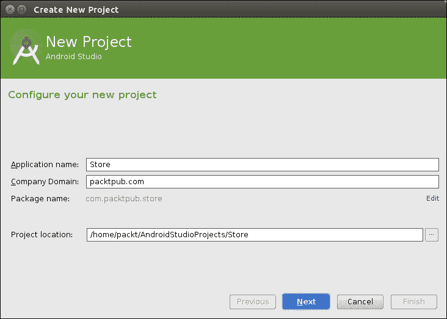

1.  然后，选择最小的 SDK（例如，API 14：冰激凌三明治），并点击**下一步**。

1.  选择**带片段的空白活动**并点击**下一步**。

1.  最后，按照以下方式输入**活动名称**和**布局名称**，然后点击**完成**：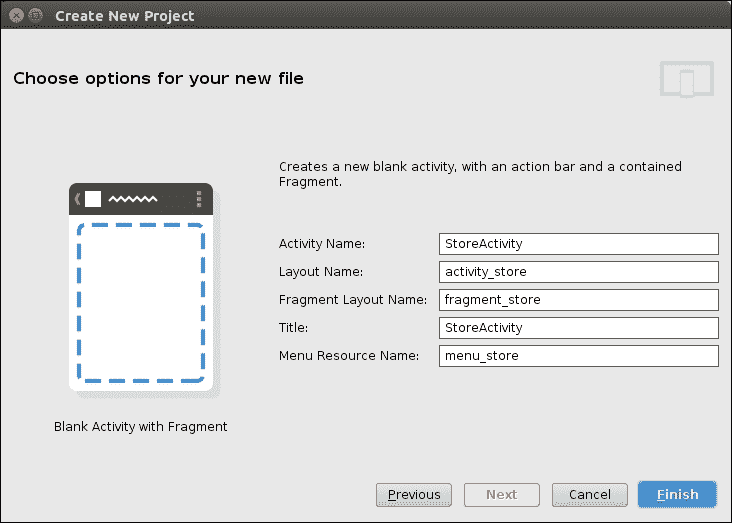

1.  然后，Android Studio 应该会打开项目：

1.  修改`StoreActivity.java`文件，并按照本章中*Java 与 C/C++接口*部分（步骤 1 和 2）创建`Store.java`。

1.  创建`app/src/main/jni`目录。复制本章*Java 与 C/C++接口*部分（步骤 4 和 5）中创建的 C 和头文件。

1.  编辑 Android Studio 生成的`app/build.gradle`文件。在`defaultConfig`中插入一个`ndk`部分来配置模块（即库）名称：

    ```java
    apply plugin: 'com.android.application'

    android {
        compileSdkVersion 21
        buildToolsVersion "21.1.2"

        defaultConfig {
            applicationId "com.packtpub.store"
            minSdkVersion 14
            targetSdkVersion 21
            versionCode 1
            versionName "1.0"
     ndk {
     moduleName "com_packtpub_store_Store"
            }
        }
        buildTypes {
            release {
                minifyEnabled false
                proguardFiles getDefaultProguardFile('proguard-android.txt'), 'proguard-rules.pro'
            }
        }
    }

    dependencies {
        compile fileTree(dir: 'libs', include: ['*.jar'])
        compile 'com.android.support:appcompat-v7:21.0.3'
    }
    ```

1.  通过点击 Android Studio 中**Gradle 任务**视图下的**installDebug**，编译并在你的设备上安装项目。

    ### 提示

    如果 Android Studio 抱怨找不到 NDK，请确保项目根目录中的`local.properties`文件包含可以指向你的 Android SDK 和 NDK 位置的`sdk.dir`和`ndk.dir`属性。

## *刚才发生了什么？*

我们创建了一个通过 Gradle 编译本地代码的第一个 Android Studio 项目。NDK 属性在 `build.gradle` 文件（例如，模块名称）的特定于 `ndk` 的部分配置。

下表展示了多个可用的设置：

| 属性 | 描述 |
| --- | --- |
| **abiFilter** | 要编译的目标 ABI 列表；默认情况下，编译所有 ABI。 |
| **cFlags** | 传递给编译器的自定义标志。关于这方面的更多信息，请参见第九章，*将现有库移植到 Android*。 |
| **ldLibs** | 传递给链接器的自定义标志。关于这方面的更多信息，请参见第九章，*将现有库移植到 Android*。 |
| **moduleName** | 这是将要构建的模块名称。 |
| **stl** | 这是用于编译的 STL 库。关于这方面的更多信息，请参见第九章，*将现有库移植到 Android*。 |

你可能已经注意到，我们没有重用 `Android.mk` 和 `Application.mk` 文件。这是因为如果在编译时给 `ndk-build` 提供了输入，Gradle 会自动生成构建文件。在我们的示例中，你可以在 `app/build/intermediates/ndk/debug` 目录下看到为 `Store` 模块生成的 `Android.mk` 文件。

NDK 自动 Makefile 生成使得在简单项目上编译本地 NDK 代码变得容易。但是，如果你想要在本地构建上获得更多控制，你可以创建自己的 Makefiles，就像本章中在“Java 与 C/C++接口”部分创建的那样。让我们看看如何操作。

### 注意

本书提供的项目名为 `Store_Gradle_Manual`。

# 动手时间 – 使用你自己的 Makefiles 与 Gradle

使用你手工制作的 Makefiles 与 Gradle 有点棘手，但并不复杂：

1.  将本章中在“Java 与 C/C++接口”部分创建的 `Android.mk` 和 `Application.mk` 文件复制到 `app/src/main/jni` 目录。

1.  编辑 `app/build.gradle` 文件。

1.  添加对 `OS` “类”的导入，并删除前一个部分中我们创建的第一个 `ndk` 部分：

    ```java
    import org.apache.tools.ant.taskdefs.condition.Os

    apply plugin: 'com.android.application'

    android {
        compileSdkVersion 21
        buildToolsVersion "21.1.2"

        defaultConfig {
            applicationId "com.packtpub.store"
            minSdkVersion 14
            targetSdkVersion 21
            versionCode 1
            versionName "1.0"
        }
        buildTypes {
            release {
                minifyEnabled false
                proguardFiles getDefaultProguardFile('proguard-android.txt'), 'proguard-rules.pro'
            }
        }
    ```

1.  仍然在 `app/build.gradle` 文件的 android 部分，插入一个包含以下内容的 `sourceSets.main` 部分： 

    +   `jniLibs.srcDir`，定义了 Gradle 将找到生成的库的位置。

    +   `jni.srcDirs`，设置为空数组以通过 Gradle 禁用本地代码编译。

        ```java
            ...
            sourceSets.main {
                jniLibs.srcDir 'src/main/libs'
                jni.srcDirs = []
            }
        ```

1.  最后，创建一个新的 Gradle 任务 `ndkBuild`，它将手动触发 `ndk-build` 命令，指定自定义目录 `src/main` 作为编译目录。

    声明 `ndkBuild` 任务与 Java 编译任务之间的依赖关系，以自动触发本地代码编译：

    ```java
        ...

     task ndkBuild(type: Exec) {
     if (Os.isFamily(Os.FAMILY_WINDOWS)) {
     commandLine 'ndk-build.cmd', '-C', file('src/main').absolutePath
     } else {
     commandLine 'ndk-build', '-C', file('src/main').absolutePath
     }
     }

     tasks.withType(JavaCompile) {
     compileTask -> compileTask.dependsOn ndkBuild
     }
    }

    dependencies {
        compile fileTree(dir: 'libs', include: ['*.jar'])
        compile 'com.android.support:appcompat-v7:21.0.3'
    }
    ```

1.  通过点击 Android Studio 中的 **installDebug** 在 **Gradle 任务** 视图下编译并安装项目到你的设备上。

## *刚才发生了什么？*

Android Gradle 插件进行的 Makefile 生成和原生源代码编译可以轻松禁用。诀窍是简单地指出没有可用的原生源代码目录。然后我们可以利用 Gradle 的强大功能，它允许轻松定义自定义构建任务及其之间的依赖关系，以执行`ndk-build`命令。这个技巧允许我们使用自己的 NDK makefiles，从而在构建原生代码时给我们提供更大的灵活性。

# 总结

创建、编译、构建、打包和部署应用程序项目可能不是最激动人心的任务，但它们是无法避免的。掌握它们将使您能够提高效率并专注于真正的目标：**编写代码**。

综上所述，我们使用命令行工具构建了第一个示例应用程序，并将其部署在 Android 设备上。我们还使用 Eclipse 创建了第一个原生 Android 项目，并通过 Java 本地接口（JNI）将 Java 与 C/C++进行接口。我们使用 NDK-GDB 调试了原生 Android 应用程序，并分析了原生崩溃转储以在源代码中找到其根源。最后，我们使用 Android Studio 创建了类似的项目，并使用 Gradle 构建它。

这首次使用 Android NDK 的实验使您对原生开发的工作方式有了很好的了解。在下一章中，我们将专注于代码，并深入探讨 JNI 协议。
