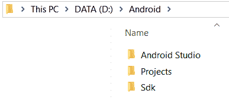
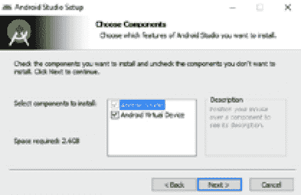
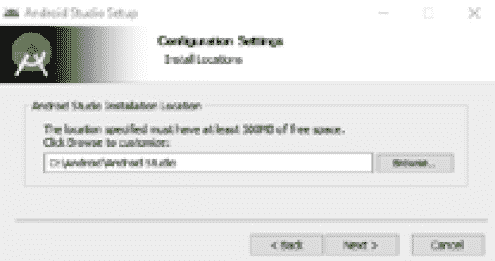
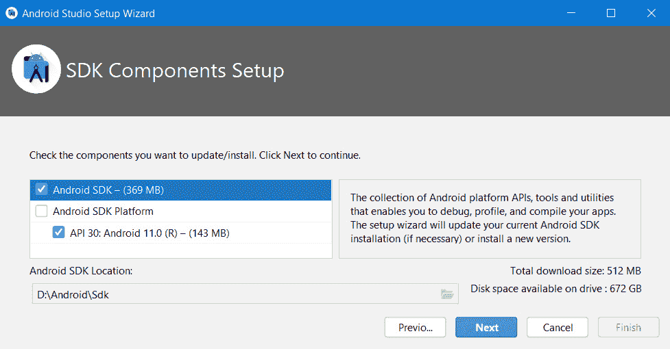
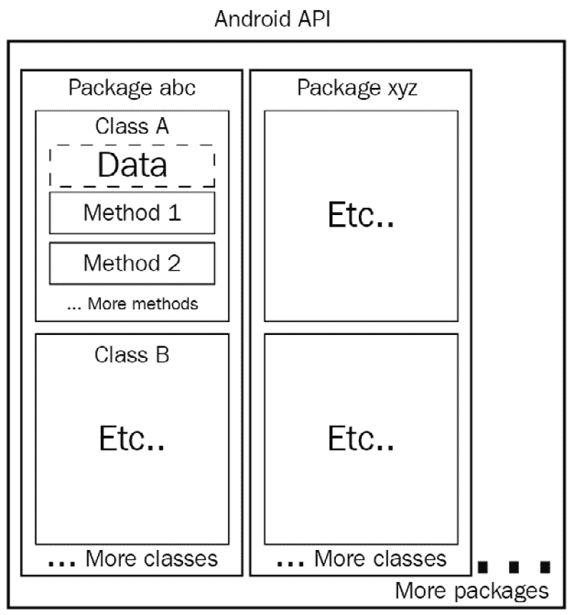
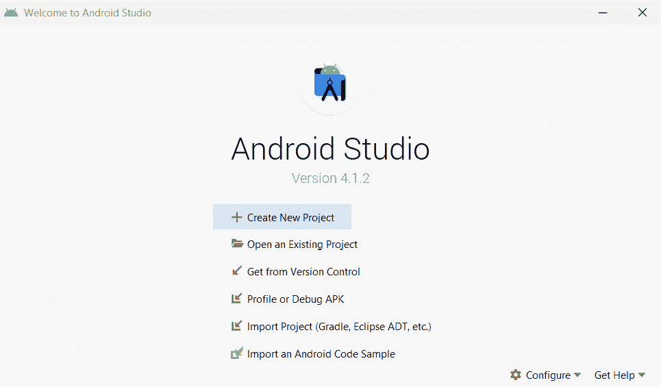
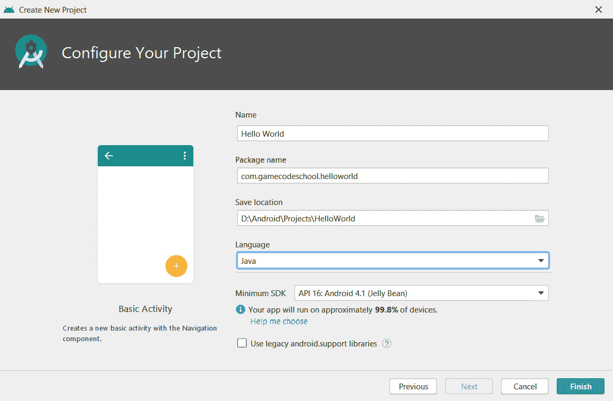
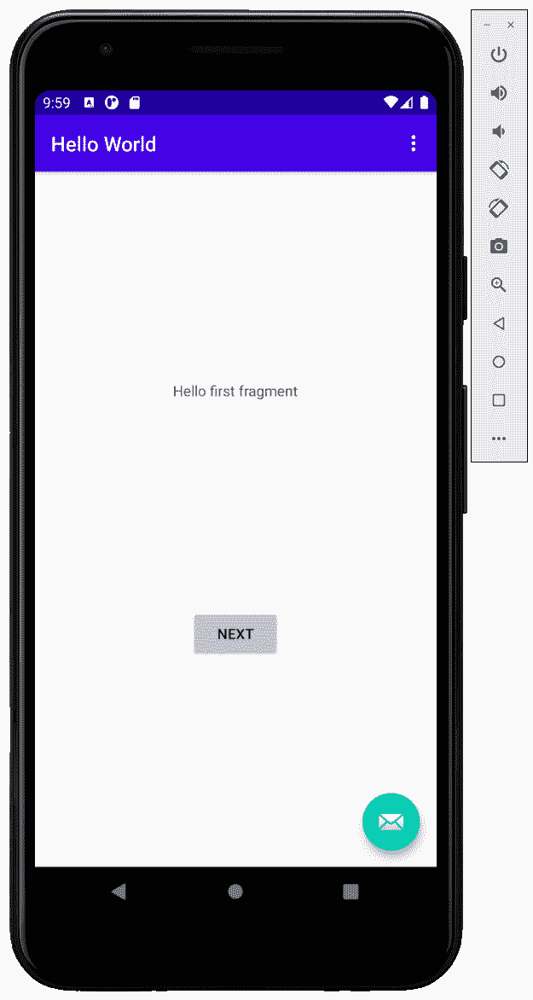

# 第一章：开始 Android 和 Java

欢迎使用《初学者的 Android 编程第三版》。在第一章中，我们将立即开始开发 Android 应用程序。我们将看看 Android 有什么好处，Android 和 Java 究竟是什么，它们如何工作和相互补充，以及作为未来开发者，这对我们意味着什么。随后，我们将快速设置所需的软件，以便我们可以构建和部署一个简单的第一个应用程序。

注意

我的目标是使本书保持最新。请查看以下网页，了解自书印刷以来 Android Studio 的任何更改讨论和提示：[`gamecodeschool.com/books/android-programming-for-beginners-3rd-edition#android-studio-updates`](http://gamecodeschool.com/books/android-programming-for-beginners-3rd-edition#android-studio-updates)。

在本章结束时，我们将完成以下内容：

+   了解了第三版的新内容

+   了解了 Java 和 Android 如何相互配合

+   设置我们的开发环境——Android Studio——它负责构建我们将在接下来学习的 Android 应用程序所涉及的所有组件

+   了解了**Java 开发工具包**（**JDK**）和 Android **应用程序编程接口**（**API**）以及我们如何通过 Android Studio 使用它们

+   构建我们的第一个 Android 应用程序

+   在 Android 模拟器上部署应用程序

+   在 Android 模拟器和真实设备上运行我们的应用程序

这是很多内容，让我们开始吧。

# 技术要求

以下是使用 Android Studio 及其相关工具进行 Android 开发的官方技术要求。但这些是绝对的最低要求。请参阅“设置 Android Studio”部分以获取更多详细信息。

Windows 的要求如下：

+   Microsoft® Windows® 7/8/10（64 位）

+   至少需要 4GB 的 RAM；建议 8GB 的 RAM

+   至少需要 2GB 的可用磁盘空间；建议 4GB（500MB 用于**集成开发环境**（**IDE**）+ 1.5GB 用于 Android **软件开发工具包**（**SDK**）和模拟器系统镜像）

+   最低屏幕分辨率为 1,280 x 800

Mac 的要求如下：

+   Mac® OS X® 10.10（Yosemite）或更高版本，最高为 10.14（macOS Mojave）

+   至少需要 4GB 的 RAM；建议 8GB 的 RAM

+   至少需要 2GB 的可用磁盘空间；建议 4GB（500MB 用于 IDE + 1.5GB 用于 Android SDK 和模拟器系统镜像）

+   最低屏幕分辨率为 1,280 x 800

Linux 的要求如下：

+   GNOME 或 KDE 桌面

+   在基于 Debian 的 gLinux 上进行了测试

+   64 位发行版，能够运行 32 位应用程序

+   GNU C 库（glibc）2.19 或更高版本

+   至少需要 4GB 的 RAM；建议 8GB 的 RAM

+   至少需要 2GB 的可用磁盘空间；建议 4GB（500MB 用于 IDE + 1.5GB 用于 Android SDK 和模拟器系统镜像）

+   最低屏幕分辨率为 1,280 x 800

您可以在 GitHub 上找到本章的代码文件[`github.com/PacktPublishing/Android-Programming-for-Beginners-Third-Edition/tree/main/chapter%2001`](https://github.com/PacktPublishing/Android-Programming-for-Beginners-Third-Edition/tree/main/chapter%2001)。

# 第三版有什么新内容？

与第一版相比，第二版增加了大量额外的主题。不幸的是，平装书只能容纳有限的页数。因此，这一版着重于改进 Java、Android 和应用开发概念的教学方式。我们重新思考了主题的解释方式，并使其比以前更加直观。此外，我设法加入了大约十几个新的迷你主题。这些内容要么是 Java 基础知识，比如在早期版本中没有涵盖的变量类型，要么是新的 Android Studio 功能，比如分析器，或者是经典的编程概念，比如方法递归和我们代码的实时调试。希望这第三版能让您的 Android 和 Java 之旅更加顺利和完整。

# 为什么选择 Java 和 Android？

当 Android 于 2008 年首次出现时，与苹果 iPhone/iPad 上更时尚的 iOS 相比，它显得有些沉闷。但通过迅速推出各种各样的手机产品，既符合实际价格敏感的人群，又符合时尚和科技精通的人群，Android 用户数量迅速增长。

对于许多人来说，包括我自己在内，为 Android 开发是最有意义的业余爱好和事业。

快速地将一个想法的原型组装起来，完善它，然后决定运行并将其连接成一个完全成熟的应用程序，这是一个如此令人兴奋和有意义的过程。任何编程都可以很有趣，我一生都在编程，但为 Android 创作某种程度上是非常有意义的。

确切地定义这种情况为什么会发生是相当困难的。也许是因为这个平台是免费和开源的。您可以在不需要大型控制性公司的许可的情况下分发您的应用程序 - 没有人可以阻止您。与此同时，您还可以在亚马逊应用商店和 Google Play 等成熟的、由公司控制的大众市场上分发应用程序。

更有可能的是，为 Android 开发带来如此良好的感觉的原因是设备本身的性质。它们是非常个人化的。您可以开发与人们生活互动的应用程序 - 教育、娱乐、讲故事等等 - 它就在他们的口袋里准备好了，在家里、工作场所或度假时。

当然，您可以为桌面构建更大的东西。但知道成千上万（甚至数百万）的人携带着您的作品并与朋友分享，这带来的不仅仅是一种兴奋。

事实上，为 Android 开发被认为是非常有技巧的，最成功的开发人员受到极大的钦佩，甚至崇敬。

如果所有这些空洞和精神上的东西对您毫无意义，那也没关系；为 Android 开发可以让您谋生，甚至让您致富。随着设备拥有量的持续增长，CPU 和 GPU 性能的不断提升，以及 Android 操作系统本身的不断演进，对专业应用程序开发人员的需求只会增长。

简而言之，最优秀的 Android 开发人员 - 更重要的是，拥有最好的想法和最大决心的 Android 开发人员 - 比以往任何时候都更受欢迎。没有人知道这些未来的 Android 应用程序开发人员是谁，他们甚至可能还没有写过他们的第一行 Java 代码。

那么，为什么不是每个人都是 Android 开发人员呢？显然，并不是每个人都会像我一样热衷于创造能够帮助人们改善生活的软件，但我猜测因为您正在阅读这篇文章，您可能会！

# 初学者的第一个绊脚石

不幸的是，对于那些和我一样热衷的人来说，进步的道路上存在一种玻璃墙，这让许多有抱负的 Android 开发人员感到沮丧。

Android 使用 Java 来制作应用程序。每本 Android 书籍，甚至那些针对所谓初学者的书籍，都假设读者至少具有中级水平的 Java 知识，大多数需要高级水平的知识。因此，良好到优秀的 Java 知识*曾经*是学习 Android 的先决条件。

不幸的是，在完全不同的上下文中学习 Java 有时可能会有点乏味，而您学到的大部分知识在 Android 世界中并不直接可转移。您可以理解为什么初学者对 Android 和 Java 经常望而却步。

但不一定非得这样。在这本书中，我已经把你在厚重的、专门针对初学者的 Java 书中学到的所有 Java 主题都精心安排成了四个多章节的应用程序和十几个快速的迷你应用程序，从一个简单的备忘录应用程序开始，然后逐渐发展成一个酷炫的绘图应用程序、一个数据库应用程序和一个可玩的游戏（可在线使用）。

如果您想成为专业的 Android 开发人员，或者只是想在学习 Java 和 Android 时更有乐趣，这本书会帮助您。

# Java 和 Android 如何协同工作

在开始我们的 Android 探索之前，我们需要了解 Android 和 Java 如何一起工作。Android 是一个复杂的系统，但你不需要深入了解它才能制作出令人惊艳的应用程序。

在我们为 Android 用 Java 编写程序之后，我们点击一个按钮，我们的代码就会被转换成另一种形式，这种形式是 Android 可以理解的形式。这种形式被称为**字节码**，转换过程被称为**编译**。

然后，当用户安装我们的应用程序时，字节码会被另一个进程（称为**Android Runtime**（**ART**））转换为机器码。这是最快的执行格式。因此，如果你曾听说过不应该使用 Java 因为它很慢，那么你知道他们是错误的。Java 对程序员来说编程速度很快，然后在安装时转换为设备快速的机器码。还有什么比这更好的呢？

ART 不仅能够使我们的应用程序执行速度超快，而且还能降低电池使用。此外，ART 系统不仅仅创建机器码然后坐下来放松；它提供了钩子进入我们的应用程序，增强了应用程序在运行时的内存管理。这使得我们的应用程序运行更高效，并且，正如我们将在*第十二章*中看到的那样，*堆栈、堆和垃圾收集器*，更容易通过处理内存管理的关键方面来编写。

ART 本身是用另一种语言编写的软件系统，运行在一个特别适应的 Linux 操作系统的版本上。因此，用户所看到的 Android 本身只是在另一个操作系统上运行的应用程序。

Android 是一个子系统的集合。典型的 Android 用户看不到 Linux 操作系统，也不知道 ART 的存在，但它们都在那里运转。

系统的 Linux 部分的目的是隐藏 Android 运行的硬件和软件的复杂性和多样性，但同时暴露出所有有用的功能。这种功能的暴露有两种方式：

+   首先，系统本身必须能够访问硬件，它确实可以。

+   其次，这种访问必须是对程序员友好且易于使用的——这是因为 Android **API**。

让我们继续谈谈 Android API。

注意

这本书是关于学习 Java 并从头开始构建 Android 应用程序的，所以我不会深入探讨 Android 的工作原理。然而，如果你想了解更多，那么维基百科页面是一个很好的参考：[`en.wikipedia.org/wiki/Android_(operating_system`](https://en.wikipedia.org/wiki/Android_(operating_system))。

## 理解 Android API

Android API 是一种使得做出非凡事情变得容易的代码。可以用一个简单的类比来理解，比如一台机器，也许是一辆汽车。当你踩油门时，引擎盖下会发生一大堆事情。我们不需要理解燃烧或燃油泵，因为一些聪明的工程师为我们制作了一个**接口**——在这种情况下，是一个机械接口：油门踏板。

例如，下面这行 Java 代码在本书的这个阶段可能看起来有点吓人，但它是 Android API 如何帮助我们的一个很好的例子：

```kt
locationManager.getLastKnownLocation(LocationManager.GPS_PROVIDER)
```

一旦你了解到这一行代码在太空搜索可用的卫星，然后与它们在地球轨道上通信，然后在地球表面检索你的精确纬度和经度，那么开始逐渐领略 Android API 与编译的字节码和 ART 的强大和深度就变得容易了。

当然，这段代码看起来有点具有挑战性——甚至在本书的这个阶段都是如此——但想象一下用其他方式与卫星交流试试看！

Android API 已经为我们编写了一大堆可以随意使用的 Java 代码。

注意

关于 Android 的代码行数有很多不同的估计。一些估计只有 100 万行，而一些估计高达 2000 万行。令人惊讶的是，尽管有如此庞大的代码量，Android 在编程圈中以“轻量级”而闻名。

我们必须问的问题，也是本书试图回答的问题是：

我们如何使用所有这些代码来做酷炫的事情？或者为了符合之前的类比，我们如何找到并操作 Android API 的踏板、方向盘和天窗？

这个问题的答案是 Java 编程语言以及 Java 旨在帮助程序员处理复杂性的事实。让我们稍微谈一下 Java 和面向对象编程（OOP）。

## Java 是面向对象的

Java 是一种编程语言，比 Android 存在的时间长得多。它是一种面向对象的语言。这意味着它使用可重用的编程对象的概念。如果这听起来像技术术语，另一个类比会有所帮助。Java 使我们和其他人（比如 Android 开发团队）能够编写可以基于现实世界事物构建的 Java 代码，这是重要的部分：它可以被重复使用。

因此，使用汽车类比，我们可以问一个问题：如果一个制造商一天制造多辆汽车，他们是否为每辆汽车重新设计每个零件？

当然，答案是否定的。他们让高技能的工程师开发完全正确的组件，经过多年的磨练、改进和提高。然后，同样的组件被反复重复使用，偶尔进行改进。

如果你对我的类比挑剔，那么你可以指出每个汽车的组件仍然必须使用现实生活中的工程师或机器人等从原材料中构建出来。

这是真的。软件工程师在编写代码时所做的是构建对象的蓝图。然后我们使用 Java 代码从他们的蓝图创建对象，一旦我们有了那个对象，我们可以配置它，使用它，与其他对象组合，以及更多。

此外，除此之外，我们也可以设计自己的蓝图并从中制作对象。然后编译器将我们的定制创建转换（制造）成字节码。嘿，变戏法！我们有了一个 Android 应用程序。

在 Java 中，蓝图被称为类。当一个类被转化为一个真正工作的“东西”时，我们称之为类的对象或实例。

对象简洁

我们可以继续进行类比。然而，我们在这一点上关心的是以下内容。

Java 是一种允许我们编写一次代码然后重复使用的语言。这非常有用，因为它节省了我们的时间，并允许我们使用其他人的代码来执行我们可能没有时间或知识来编写的任务。大多数时候，我们甚至不需要看到这些代码，甚至不知道它是如何工作的！最后一个类比：我们只需要知道如何使用代码，就像我们需要学会如何驾驶汽车一样。

因此，Android 总部的一位聪明的软件工程师编写了一个非常复杂的 Java 程序，可以与卫星通信。然后，他们考虑如何使这段代码对所有想要开发使用用户位置做酷炫事情的 Android 程序员有用。其中一件事情是使获取设备在世界上的位置成为一个简单的一行任务。

因此，我们之前看到的一行代码引发了更多我们看不到、也不需要看到的代码。这是一个使用别人的代码使我们的代码变得无限简单的例子。

注

如果你不必看到所有的代码这个事实让你失望，那么我理解你的感受。当我们学习某样东西时，有些人希望了解每一个细节。如果你也是这样的话，那么请放心，学习 Android API 内部工作原理的最佳起点是按照 API 程序员的意图来使用它。在整本书中，我会定期指出更多学习机会，让你了解 Android API 的内部工作原理。此外，我们将编写一些可重复使用的类，有点像我们自己的 API，只是我们的类将专注于我们想要我们的应用程序做的事情。

欢迎来到**面向对象编程**（**OOP**）的世界。我会在每一章中不断提到 OOP，而在 *第十章* 中有关于它如何工作的大揭示，*面向对象编程*。

## 再告诉我一遍 - Android 究竟是什么？

在 Android 上，我们编写自己的 Java 代码，同时也使用 Android API 的 Java 代码。然后，这些代码被编译成字节码，并在用户安装时由 ART 转换成机器码，而机器码又与一个名为 Linux 的底层操作系统连接，处理着不同 Android 设备的复杂和极其多样的硬件。

Android 设备的制造商和个别硬件组件显然也知道这一点，他们编写了称为**驱动程序**的高级软件，确保他们的硬件（CPU、GPU、GPS 接收器、存储芯片、硬件接口等）可以在底层 Linux 操作系统上运行。

字节码（以及其他一些资源）被放在一个称为**Android 应用程序包**（**APK**）的文件包中，这是 ART 运行以准备我们的应用程序给用户使用所需的东西。

注意

不需要记住我们的代码与硬件交互时经历的步骤的细节。只需要理解我们的 Java 代码经历了一些自动化过程，成为我们将发布到 Google Play 商店的应用程序。

接下来的问题是“所有这些 Java 编码和编译成字节码以及 APK 打包到底发生在哪里？”。让我们看看我们将要使用的开发环境。

## Android Studio

**开发环境** 是一个术语，指的是在一个地方拥有你开发所需的一切并准备就绪。我们需要两样东西才能开始：

+   我们谈到了编译我们的 Java 代码，以及其他人的 Java 代码，将其转换成用户 Android 设备上可执行的机器码。为了使用 Java 代码，我们需要一些名为**JDK**的免费软件。JDK 包括了更多其他人的代码，这些代码与 Android API 是分开的。

+   开发 Android 需要一整套工具，当然还需要 Android API。这整套要求被统称为 Android **SDK**。幸运的是，下载并安装一个应用程序就能将这些东西捆绑在一起。这个应用程序叫做 **Android Studio**。

Android Studio 是一个**集成开发环境**，将处理编译我们的代码和与 JDK 和 Android API 进行链接的所有复杂性。一旦安装了 Android Studio，我们可以在这个单一应用程序中完成所有需要的工作，并将我们讨论过的许多复杂性放在脑后。

提示

随着时间的推移，这些复杂性将变得自然而然。不需要掌握它们才能取得进一步的进展。

所以，我们最好开始使用 Android Studio。

# 设置 Android Studio

设置 Android Studio 相当简单，尽管有点冗长。拿些点心，然后按照以下步骤开始。本教程将把 Android Studio 安装到 D 驱动器上。我选择了 D 驱动器，因为这是一个大型安装，一旦我们下载了所有内容，大约有 12GB，而且许多 PC 上的 D 驱动器通常比 C 驱动器更大，有更多的可用空间。如果您希望安装在 C 驱动器（或任何其他驱动器），那么这些说明应该很容易调整：

1.  访问[`developer.android.com/studio`](https://developer.android.com/studio)并单击**下载 Android Studio**按钮。这将开始下载最新稳定版本的 Windows。您需要接受条款和条件才能开始下载。

1.  在等待下载完成时，在 D 驱动器的根目录上创建一个名为`Android`的新文件夹。在`Android`文件夹内，创建另一个名为`Android Studio`的新文件夹。返回到`Android`文件夹并创建另一个名为`Projects`的新文件夹。这是我们将在整本书中创建的所有项目文件的存放位置。创建另一个名为`Sdk`的新文件夹，这是我们将要求安装程序安装 Android SDK 的位置。现在您应该有一个看起来像这样的`D:\Android`文件夹：

图 1.1 – D:\Android 文件夹

1.  下载完成后，找到已下载的文件。它将被称为`android-studio-ide....`。双击该文件运行它。

1.  您将被要求授予安装程序管理权限，然后您可以单击**下一步**开始安装。在**选择组件**屏幕上，确保**Android Studio**和**Android 虚拟设备**选项都被选中，然后单击**下一步**按钮：

图 1.2 – 选择组件屏幕

1.  在`D:\Android\Android Studio`，然后左键单击**确定**按钮：

图 1.3 – 配置设置窗口

1.  在前面的截图中，单击**下一步**按钮。在**选择开始菜单文件夹**窗口上，单击**安装**以接受默认选项。安装的第一部分现在将进行。

1.  一旦收到**安装完成**消息，单击**下一步**按钮。然后可以单击**完成**按钮。

Android Studio 应该会自动启动。如果没有，您可以在 Windows 开始菜单中找到并启动 Android Studio 应用程序。

1.  您将收到一条消息，提示您缺少 SDK（除非这不是您第一次使用 Android Studio）。单击**下一步**继续。

1.  在`D:\Android\Sdk`，如下截图所示：

图 1.4 – SDK 组件设置屏幕

1.  单击**下一步**按钮。

1.  在**验证设置**窗口上，单击**完成**按钮。Android Studio 现在将下载一些文件并完成安装。这可能需要几分钟或更长时间，您可能会再次被提示允许访问您的 PC。

1.  当过程结束时，单击**完成**按钮。

您将看到下一个 Android Studio 欢迎屏幕：


图 1.5 – Android Studio 欢迎屏幕

如果您要直接进行下一节，那么保持此屏幕。如果愿意，可以关闭它，然后在准备好继续时，像运行任何其他应用程序一样，从 Windows 开始菜单中运行 Android Studio。

让我们谈谈 Android 应用程序包括的所有不同内容。

# 什么构成了一个 Android 应用程序？

我们已经知道，我们将编写的 Java 代码本身将使用其他人的 Java 代码，并将被编译成字节码，然后在用户的 Android 设备上转换为机器代码。除此之外，我们还将添加和编辑其他包含在最终 APK 中的文件。这些文件被称为 Android 资源。

## Android 资源

我们的应用程序将包括图像、声音和用户界面（UI）布局等资源，这些资源保存在与 Java 代码分开的文件中。我们将在本书的过程中慢慢介绍它们。

它还将包括具有我们应用程序文本内容的文件。通过单独的文件引用应用程序中的文本是一种惯例，因为这样做可以使它们易于更改，并且可以创建适用于不同语言和地理区域的应用程序。

此外，尽管有使用可视化设计工具实现应用程序的实际 UI 布局的选项，但实际上是由 Android 从基于文本的文件中读取的。

当然，Android（或任何计算机）无法像人类一样阅读和识别文本。因此，我们必须以高度组织和预定义的方式呈现我们的资源。为此，我们将使用`.xml`。

你不需要记住这一点，因为我们将在整本书中不断回到这个概念。

# Android 的 Java 代码结构

除了这些资源之外，值得注意的是，在 Android 中使用的 Java 代码具有其代码结构。我们可以利用数百万行代码。显然，这些代码需要以便于查找和引用的方式进行组织。它们被组织成特定于 Android 的**包**。

## 包

每当我们创建一个新的 Android 应用程序时，我们将选择一个称为**包**的唯一名称。我们将在*构建我们的第一个 Android 应用程序*部分中看到我们是如何做到这一点的。包通常被分成**子包**，以便与其他类似的包一起分组。我们可以简单地将其视为文件夹和子文件夹，这几乎就是它的实质。

我们可以将 Android API 提供给我们的所有包视为代码库中的代码。我们将使用的一些常见 Android 包包括以下内容：

+   `android.graphics`

+   `android.database`

+   `android.view.animation`

正如你所看到的，它们被安排和命名，以使其中的内容尽可能明显。

注意

如果你想了解 Android API 的深度和广度，可以查看 Android 包索引：[`developer.android.com/reference/packages`](https://developer.android.com/reference/packages)。

## 类

之前，我们了解到我们可以将可重用的代码蓝图转换为对象的文件称为`.java`文件扩展名。

## 方法

在 Java（因此也是 Android）中，我们将类进一步分成执行不同操作的部分。我们称这些以行动为导向的部分为方法。通常，我们将使用类的方法来访问所有这些数百万行代码中提供的功能。

我们不需要阅读代码。我们只需要知道哪个类有我们需要的内容，它属于哪个包，以及类内的哪些方法能给我们精确的结果。

下一个图表显示了 Android API 的表示。我们将编写的代码结构将类似于此示例的结构，尽管我们通常每个应用程序只有一个包。

当然，由于 Java 的面向对象性质，我们只会使用 API 中的部分功能。还要注意，每个类都有其自己独特的数据。通常，如果你想访问类中的数据，你需要有该类的对象：



图 1.6 - Android API 的表示

您不需要记住这一点，因为我们将在整本书中不断回到这个概念。

到本章结束时，我们将导入多个包，以及其中的几十个类，并且我们还将使用其中许多方法。到*第二章**结束时，首次接触：Java、XML 和 UI 设计*，我们甚至将编写我们自己的方法。现在我们可以开始第一个应用程序了。

# 构建我们的第一个 Android 应用程序

在编程中，传统上新学生的第一个应用程序会使用他们正在使用的语言/操作系统向世界打招呼。我们将快速构建一个只做这件事的应用程序，并且在*第二章**结束时，首次接触：Java、XML 和 UI 设计*，我们将超越这一点，并添加一些在用户按下按钮时响应的按钮。

注意

本章结束时的完整代码在*第一章*文件夹中的下载包中供您参考。但是，您不能简单地复制和粘贴这段代码！您仍然需要按照本章（以及所有项目开头）中解释的项目创建阶段进行操作，因为 Android Studio 在幕后做了大量工作。一旦您熟悉了这些步骤，并理解了哪些代码是由您作为程序员输入的，哪些代码/文件是由 Android Studio 生成的，那么您就能够通过复制和粘贴我在下载包中提供的文件来节省时间和输入。

按照以下步骤开始项目：

1.  以与运行任何其他应用程序相同的方式运行 Android Studio。例如，在 Windows 10 上，启动图标会出现在开始菜单中。

提示

如果提示**从…导入 Studio 设置**，请选择**不导入设置**。

1.  您将看到 Android Studio 的欢迎屏幕，如下截图所示。找到开始一个新的 Android Studio 项目选项，并单击它：

图 1.7 - Android Studio 欢迎屏幕

1.  接下来的窗口是**选择项目模板**。

这些是 Android Studio 可以根据您要开发的应用程序类型为您生成的一些有用的项目模板。我们将使用**基本活动**选项。Android Studio 将自动生成少量代码和一些资源来启动我们的项目。我们将在下一章详细讨论代码和资源。

1.  选择**基本活动**。以下是**选择项目模板**窗口，其中选择了**基本活动**选项的图片：

图 1.8 - 选择项目模板窗口

1.  确保**基本活动**被选中，就像前面的截图中一样，然后点击**下一步**。

1.  之后，Android Studio 将弹出`Hello World`，文件的位置将是我们在*设置 Android Studio*部分中创建的`Projects`文件夹。

包名可以是几乎任何你喜欢的东西。如果您有一个网站，您可以使用`com.yourdomainname`的格式。如果没有，可以使用我的域名`com.gamecodeschool.helloworld`，或者您自己编造的东西。这只有在您要发布时才重要。

为了明确起见，如果您无法清楚地看到以下截图中的细节，这里是我使用的值。请记住，根据您对包名和项目位置的选择，您的值可能会有所不同：


提示

请注意，应用程序名称中`Hello`和`World`之间有一个空格，但项目位置没有，如果有空格将无法工作。

1.  下一张截图显示了一旦您输入了所有信息的**配置您的项目**屏幕：

图 1.9 - 配置您的项目屏幕

1.  在上一张截图中，您可以看到 Android Studio 根据输入的信息自动生成了一个包名称。我的是**com.gamecodeschool.helloworld**。您的可能相同，也可能不同；这并不重要。

注意

您可以使用几种不同的语言编写安卓应用程序，包括 C++和 Kotlin。与使用 Java 相比，每种语言都有各种优缺点。学习 Java 将是其他语言的很好入门，并且 Java 也是安卓的官方语言之一。目前 Play 商店上大多数热门应用和游戏都是用 Java 编写的。

您还可以看到**最低 SDK**选项。将其保留为默认设置，但请注意，写作时默认设置可能与您的设置不同。

注意

我们已经知道安卓 SDK 是我们将用来开发应用程序的代码包集合。像任何一个好的 SDK 一样，安卓 SDK 定期更新，每次有重大更新时，版本号都会增加。简单来说，版本号越高，您可以使用的新功能就越多；版本号越低，我们的应用程序就能在更多设备上运行。目前，安卓果冻豆将为我们提供许多出色的功能，并且几乎 100%兼容当前使用的安卓设备。如果在阅读时，Android Studio 建议使用更新的 API 和安卓版本，那就选择那个吧。

如果您在未来的某个时候阅读本书，那么**最低 SDK**选项可能会默认为不同的内容，但本书中的代码仍将有效。

1.  点击**完成**按钮，我们将运行应用程序，看看我们取得了什么成就。

注意

第一次创建新项目时，Android Studio 将启动另一个下载。Android Studio 将设置用于管理项目配置和部署的 Gradle 构建系统。这只会发生在第一个项目中。本书不需要了解 Gradle 的知识，但如果您感兴趣，简单的网络搜索将会揭示更多信息。

让我们看看我们的应用程序在运行中的情况。

# 到目前为止部署应用程序

在我们探索任何代码并学习我们的第一段 Java 代码之前，您可能会惊讶地发现我们已经可以运行我们的项目了。这只是一个相当无特色的应用程序，但由于我们将尽可能频繁地运行应用程序来检查我们的进度，现在让我们看看如何做到这一点。您有三个选择：

+   在 PC 上的模拟器上运行应用程序（Android Studio 的一部分）处于调试模式。

+   在 USB 调试模式下在真实的安卓设备上运行应用程序。

+   将应用程序导出为一个完整的安卓项目，可以上传到 Play 商店。

第一个选项（调试模式）是最容易设置的，因为我们在设置 Android Studio 时已经做过了。如果您有一台性能强大的 PC，您几乎不会注意到模拟器和真实设备之间的区别。然而，屏幕触摸是由鼠标点击模拟的，对用户体验的正确测试在我们将创建的一些后续应用中是不可能的，比如绘图应用。此外，您可能更喜欢偶尔在真实设备上测试您的创作——我知道我会。

第二个选项，使用真实设备，有几个额外的步骤，但一旦设置好，就和选项 1 一样好，屏幕触摸是真实的。

最后一个选项大约需要 5 分钟（至少）来准备，然后您需要手动将创建的包放到真实设备上并在每次更改代码时安装它。

也许最好的方法是使用模拟器快速测试和调试代码的小增量，然后定期使用 USB 调试模式在真实设备上确保一切仍然如预期。只有偶尔您才需要导出一个实际可部署的包。

因此，我们现在将介绍如何使用模拟器和 USB 调试在真实设备上运行应用程序。

## 在安卓模拟器上运行和调试应用程序

按照以下简单步骤在默认的安卓模拟器上运行应用程序：

1.  从安卓工作室菜单栏中，选择**工具** | **AVD 管理器**。**AVD**代表**安卓虚拟设备**（模拟器）。你会看到以下窗口：

图 1.10 - AVD 管理器

注意列表中有一个模拟器。在我的情况下，它是**Pixel_3a_API_30_x….**如果你在将来的某个时候跟着做，可能是一个默认安装的不同模拟器。这没关系。

重要提示

模拟器应该已经通过我们之前执行的步骤安装好了。我注意到在测试一个预发布版本时，它并没有默认安装。如果在**你的虚拟设备**屏幕上没有列出模拟器，选择**工具** | **AVD 管理器** | **创建虚拟设备…** | **下一步** | **R 下载** | **接受** | **下一步**，然后将会下载并安装一个默认模拟器。安装完成后，点击**完成**，然后**下一步**，最后再次点击**完成**。现在你可以参考前面的步骤来运行模拟器。

1.  点击下一张截图中显示的绿色播放图标（右侧），等待模拟器启动：

图 1.11 - 播放图标

1.  现在，你可以点击安卓工作室快速启动栏上的播放图标，如下一张截图所示，如果提示，选择**Pixel_3a_API_30_x…**（或者你的模拟器叫什么）然后应用程序将在模拟器上启动：


图 1.12 - 安卓工作室快速启动栏上的播放图标

你完成了。这是到目前为止应用程序的外观在模拟器中。请记住，你可能（很可能）有一个不同的模拟器 - 没关系：



图 1.13 - 到目前为止应用程序的外观

显然，在我们搬到硅谷寻找资金支持之前，我们还有更多的工作要做，但这是一个很好的开始。屏幕上的消息是**你好第一个片段**。**片段**是许多安卓应用程序的构建块，我们将在整本书中进一步探讨它们。如果你点击**下一步**按钮，你将看到一个新的空布局，如果你然后点击**上一步**按钮，你将再次看到**你好第一个片段**屏幕。考虑到我们还没有写任何代码，这还不错。

在开发过程中，我们需要经常测试和调试我们的应用程序，以检查是否有任何错误、崩溃或其他意外情况。

注意

我们将在下一章中看到如何从我们的应用程序中获取错误和其他调试反馈。

确保它在你想要定位的每种设备类型/尺寸上看起来好并且运行正确是很重要的。显然，我们并不拥有成千上万种安卓设备中的每一种。这就是模拟器的用武之地。

然而，模拟器有时会有点慢和繁琐，尽管最近已经有了很大的改进。如果你想要真正感受到用户体验，那么你无法击败部署到真实设备。因此，在开发我们的应用程序时，我们将希望同时使用真实设备和模拟器。

提示

如果你计划很快再次使用模拟器，那么保持它运行以避免再次等待启动。 

如果你想在平板上尝试你的应用程序，你将需要一个不同的模拟器。

创建一个新的模拟器

如果你想为不同的安卓设备创建一个模拟器，这很简单。从主菜单中选择**工具** | **AVD 管理器**。在 AVD 管理器窗口中，左键单击**创建虚拟设备**。现在，左键单击你想创建的设备类型，**电视**，**手机**，**Wear OS**，或者**平板**。现在，简单地左键单击**下一步**，并按照说明创建你的新 AVD。下次运行你的应用程序时，新的 AVD 将出现作为运行应用程序的选项。我们将在下一章逐步创建一个新的平板模拟器。

现在我们可以看看如何将我们的应用程序放到真实设备上。

## 在真实设备上运行应用程序

首先要做的事情是访问设备制造商的网站，获取并安装设备和操作系统所需的任何驱动程序。

注意

大多数新设备不需要驱动程序。所以，你可能首先想尝试以下步骤。

接下来的几个步骤将为安卓设备进行调试设置。请注意，不同的制造商对菜单选项的结构可能略有不同。但是对于大多数设备来说，启用调试的以下顺序可能非常接近，如果不是完全相同：

1.  点击**设置**菜单选项或手机/平板上的**设置**应用。

1.  下一步将针对不同版本的安卓略有不同。**开发者选项**菜单被隐藏起来，以免困扰普通用户。你必须执行一个稍微奇怪的任务来解锁菜单选项。点击**关于设备**或**关于手机**选项。找到**构建号**选项，并重复点击，直到你收到一条消息，告诉你**你现在是开发者了！**。

注意

一些制造商有不同和晦涩的方法来完成这一步。如果这一步不起作用，可以在网上搜索你的设备和“解锁开发者选项”。

1.  返回**设置**菜单。

1.  点击**开发者选项**。

1.  点击**USB 调试**的复选框。

1.  将你的安卓设备连接到计算机的 USB 端口。

1.  点击任何地方的安卓 Studio，让安卓 Studio 检测到你的设备已连接。你现在应该在你的设备上找到一个**允许 USB 调试？**的提示；点击**允许**。

1.  点击安卓 Studio 工具栏上的播放图标，如下图所示：

图 1.14 - 来自安卓 Studio 工具栏的播放图标

1.  在提示时，点击**确定**在你选择的设备上运行应用程序。

现在我们准备学习一些 Java，并将我们自己的 Java 代码添加到 Hello World 项目中，这将在下一章中介绍。

# 常见问题

1.  那么，安卓真的不是一个操作系统，只是一个虚拟机，所有的手机和平板电脑都是真正的 Linux 机器吗？

不，安卓设备的所有不同子系统，包括 Linux、ART、库和驱动程序，共同构成了安卓操作系统。

1.  我仍然不理解所有这些技术术语，比如 ART、面向对象、APK 等等。我应该重新阅读这一章吗？

不，这并不是必要的，因为我们只是需要介绍这个行话，随着书的进展，我们将重新讨论它并澄清它。如果你理解了以下内容，你就可以继续阅读第二章，即《第一次接触：Java、XML 和 UI 设计师》：

我们将在安卓 Point Studio 中编写 Java 代码并创建其他资源，借助 JDK，将这些代码和资源转换为真正的安卓应用程序。

# 总结

到目前为止，我们已经设置了我们的安卓开发环境，创建了一个新的安卓应用，并将我们的应用部署到模拟器和真实设备上。如果你仍然有未解答的问题（你可能比章节开始时有更多的问题），不要担心，因为随着我们深入了解安卓和 Java 的世界，事情会变得更清晰。

随着章节的进展，你将建立起对所有事物如何相互关联的全面理解，成功只是一个练习和更深入了解安卓 API 的问题。

在下一章中，我们将使用可视化设计师和原始 XML 代码来编辑 UI，以及编写我们的第一个 Java 方法，并开始使用安卓 API 为我们提供的一些方法。
