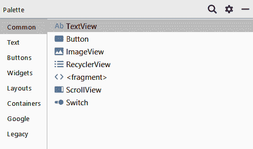
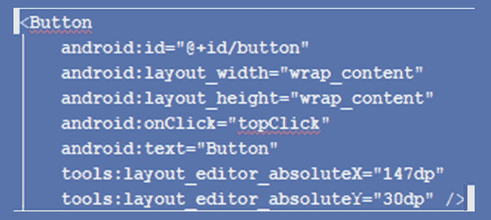

# 第二章：*第二章*：初次接触：Java、XML 和 UI 设计师

在这个阶段，我们已经拥有了一个可用的 Android 开发环境，并且已经构建并部署了我们的第一个应用程序。然而，很明显，从 Android Studio 生成的代码不会成为下一个畅销应用程序。我们需要探索这个自动生成的代码，以便开始理解 Android，然后学习如何在这个有用的模板上进行构建。为了达到这个目的，在本章中，我们将做以下事情：

+   查看如何从我们的应用程序中获得技术反馈

+   检查我们第一个应用程序的 Java 代码和 UI XML 代码

+   让我们初次体验使用 Android Studio 的**用户界面**（**UI**）设计师。

+   学习一些核心的 Java 基础知识以及它们与 Android 的关系

+   编写我们的第一个 Java 代码

首先，让我们看看如何从我们的应用程序中获得反馈。

# 技术要求

您可以在 GitHub 上找到本章的代码[`github.com/PacktPublishing/Android-Programming-for-Beginners-Third-Edition/tree/main/chapter%2002`](https://github.com/PacktPublishing/Android-Programming-for-Beginners-Third-Edition/tree/main/chapter%2002)。

# 检查 logcat 输出

在上一章中，我们提到我们的应用程序在模拟器或真实设备上以调试模式运行，因此当出现问题时，我们可以监视它并获得反馈。那么，所有这些反馈在哪里呢？

您可能已经注意到在 Android Studio 窗口底部有一大堆滚动文本。如果没有，请单击**Logcat**选项卡，如下图中标记为**1**的突出显示区域所示：

注意

模拟器必须在运行中，或者必须连接一个真实设备以调试模式运行，才能看到以下窗口。此外，如果由于某种原因重新启动了 Android Studio，并且自重新启动以来尚未执行应用程序，则**Logcat**窗口将为空。请参考第一章，在模拟器或真实设备上运行应用程序。


图 2.1 - Logcat 标签

如果您想要看到更多内容，可以将窗口拖动得更高，就像您可以在大多数其他 Windows 应用程序中一样。

这个窗口被称为**logcat**，有时也被称为**控制台**。这是我们的应用程序告诉我们用户看不到的事情发生了什么的方式。如果应用程序崩溃或出现错误，原因或原因的线索将出现在这里。如果我们需要输出调试信息，我们也可以在这里做。

注意

我们正在构建的应用程序在这个阶段不应该有任何问题，但是在将来，如果您无法弄清楚您的应用程序为什么崩溃，从 logcat 中复制并粘贴一些文本到 Google 中通常会揭示原因。

## 过滤 logcat 输出

您可能已经注意到，logcat 的大部分内容，如果不是全部，几乎是难以理解的。没关系。目前，我们只对错误感兴趣，这些错误将以红色突出显示，以及我们将在下一步中学习的调试信息。因此，为了在 logcat 窗口中看到更少不需要的文本，我们可以打开一些过滤器以使事情更清晰。

在上一张图中，我突出显示了另外两个区域，标记为**2**和**3**。区域**2**是一个下拉列表，用于控制第一个过滤器。现在左键单击它，并将其从**Verbose**更改为**Info**。我们已经大大减少了文本输出。当我们对应用程序进行了一些更改并重新部署后，我们将看到这对我们有多有用。在我们探索了构成我们项目的代码和资产之后，我们将这样做。此外，请在标记为**3**的区域中仔细检查，看看是否写着**仅显示所选应用程序**。如果没有，现在左键单击它并将其更改为**仅显示所选应用程序**。

现在我们可以看看 Android Studio 自动生成的内容，然后开始更改和添加代码，以使其个性化超出我们从项目创建阶段获得的内容。

# 探索项目 Java 和主布局 XML

我们将查看包含定义我们简单 UI 布局的代码和包含我们 Java 代码的资源文件。在这个阶段，我们不会试图理解所有这些，因为在理解之前我们需要学习更多的基础知识。然而，我们将看到这两个文件的基本内容和结构，以便我们可以将它们的内容与我们已经了解的 Android 资源和 Java 相协调。

## 检查 MainActivity.java 文件

首先让我们看看 Java 代码。如果出于某种原因，这些代码目前不可见，您可以通过左键单击**MainActivity.java**标签来查看这些代码，如下图所示：


图 2.2 - MainActivity.java 标签

由于我们不会深入研究代码的细节，带注释的截图比以文本形式重现实际代码更有用。在阅读本节时，请经常参考下一张图：


图 2.3 - Java 代码

首先要注意的是，我在代码中添加了一些空行，以便稍微间隔一下，并呈现更清晰的图像。

### 在 Android Studio 中折叠（隐藏）代码

现在看看图的左侧，标有多个部分的**9**。这指向编辑器中所有小的+和-按钮，这些按钮可以折叠和展开代码的部分。我确实折叠了一些代码的部分，而其他部分我留了出来。因此，您屏幕上看到的内容与您在图中看到的内容略有不同。在 Android Studio 中，尝试一段时间使用+和-按钮来练习隐藏和显示代码的部分。您可能希望使您的屏幕看起来像图中的样子，但这并不是继续的要求。像这样隐藏代码的技术术语是**折叠**。

### 包声明

部分`package`。每个 Java 文件顶部都会有一个包声明。

### 导入类

部分`import`。在`import`后面，我们可以看到有各种点分隔的单词。每行的最后一个单词是该行导入到我们项目中的类的名称，而每行中较早的单词是包含这些类的包和子包。

例如，下一行从`androidx.appcompat.app`包和子包中导入`AppCompatActivity`类：

```kt
import androidx.appcompat.app.AppCompatActivity;
```

注意

行尾的分号告诉编译器这是代码行的结束。

这意味着在这个文件中，我们将可以访问这些类。实际上，正是这些类被自动生成的代码用来制作我们在上一章中看到的简单应用程序。

在本章中，我们不会讨论所有这些类。现在重要的是我们可以导入这些类的概念。请注意，我们可以随时从任何包中添加额外的类，我们将在不久的将来改进我们的应用程序时这样做。

### 这个类

我们的代码的**第 3**部分称为**类声明**。以下是完整的一行；我已经突出显示了其中的一部分：

```kt
public class MainActivity extends AppCompatActivity {
```

类声明是一个类的开始。请注意高亮显示的部分，`MainActivity`。这是 Android Studio 在我们创建项目时给出的类名，也是我们之前讨论过的 Java 类的`MainActivity.java`文件名相同。

类和文件可以重命名，但由于这是我们应用程序的关键/主要活动，`MainActivity`似乎是合适的。`extends`关键字意味着我们的名为`MainActivity`的类将是`AppCompatActivity`类型。

我们可以使用一些类而不需要这个`extends`部分。我们在这里使用`extends`是因为我们想要使用`AppCompatActivity`类中的所有代码，并且还要添加我们自己的代码。所以，我们**扩展**它。所有这些以及更多内容将在*第十章**，面向对象编程*中变得更加清晰。

最后，对于`{`部分。现在看图的底部`}`部分表示类的结束。在`MainActivity`类的左花括号和右花括号之间的所有内容都是`MainActivity`类的一部分。

### 类内的方法

现在看一下代码的第五部分。这是完整的代码行，其中我们讨论的关键部分已经突出显示：

```kt
protected void onCreate(Bundle savedInstanceState) {
```

这是一个`onCreate`方法，是方法的**名称**。我们通过使用方法的名称使方法执行其代码。当我们这样做时，我们说我们正在**调用**一个方法。

尽管我们现在不关心方法名称两侧代码的细节，但你可能已经注意到`Bundle`，这是我们在`import`行导入的类之一，如果没有导入`Bundle`，Android Studio 将不知道`Bundle`是什么，它将无法使用，并且会以红色下划线表示为错误。

然后我们的代码将无法编译和运行。请注意前一行代码中的最后一件事是一个左花括号`{`。这表示`onCreate`方法中包含的代码的开始。现在跳到`}`部分。你可能已经猜到这是方法的结束。在`onCreate`方法的左花括号和右花括号之间的所有内容都是在调用该方法时执行的代码。

我们现在不需要深入了解这段代码的作用，但是总体上，它通过引用一个资源文件来设置应用程序的外观/布局，这个资源文件是在我们创建项目时由 Android Studio 自动生成的。我在前面的图中用轮廓标出了资源文件。

`onCreateOptionsMenu`和`onOptionsItemSelected`部分。

我们已经了解了足够的 Java 代码，可以取得一些进展。我们将在本章后面再次看到这段代码并进行更改。

### 到目前为止 Java 代码的总结

事实上，在我们刚刚概述的代码中包含了一些复杂的语法。然而，我们正在建立对这段代码的足够了解，以便开始快速学习 Java 和 Android，而不必先学习数百页的 Java 理论。到本书结束时，所有的代码都会有意义，但为了现在快速进展，我们只需要接受一些细节将在更长一段时间内保持神秘。

## 检查应用程序布局文件

现在我们将只看其中一个`.xml`文件。在整本书的过程中，我们将遇到几种不同的布局文件，但让我们从最容易识别的一个开始，它决定了我们应用程序的大部分外观。

在项目资源管理器窗口中，左键单击`fragment_first.xml`文件。文件的 XML 代码内容现在显示在 Android Studio 的主窗口中。

我们可以忽略**res generated**文件夹。

我们很快会探索这个 XML 代码，但首先找到并左键单击**Design**按钮（如下所示）切换到设计视图：


图 2.4 - 打开设计视图

现在我们可以看到设计视图，它显示了当应用程序在模拟器中运行时 XML 代码将导致显示的内容：


图 2.5 - 应用程序显示

前面的图应该看起来很熟悉，因为它显示了我们在上一章末运行的第一个应用程序的布局 - 与`fragment_first.xml`文件位于同一文件夹中的`fragment_second.xml`文件，你会看到我们在上一章中看到的第二个布局，上面有**Previous**按钮。实际上，与我们最初预期的相比，与布局相关的文件甚至更多，但我们将在本章和下一章中讨论它们。

本书中我们设计应用程序时所做的大部分工作都是在设计视图中完成的。然而，了解幕后发生的事情是很重要的。

设计视图是`fragment_first.xml`文件中包含的 XML 代码的图形表示。点击**Design**标签旁边的**Code**标签（在上一张图中）可以看到构成布局的 XML 代码。我已经注释了 XML 文本的屏幕截图，所以我们可以接下来讨论它：


图 2.6 - XML 文本的屏幕截图

首先要注意的是，这个文件并不代表整个布局。但它确实代表了大部分的表面积以及整个**Hello first fragment**消息和**Next**按钮。此外，在左侧，我们可以看到现在熟悉的+和-图标，以便我们可以折叠和展开代码的部分。

### UI 布局元素

如果我们首先看一下标记为`…ConstraintLayout...`的代码部分。现在，`ConstraintLayout`是一个用来包裹 UI 其他部分的 UI 元素。

在 Android 中，当我们向 UI 添加一个新元素时，我们总是以`<`开头，后面跟着元素的名称。

紧随那条看起来相当长而繁琐的代码的是定义了`layout_width`和`layout_height`。所有这些属性定义了`ConstraintLayout`元素在用户屏幕上的显示方式。`ConstraintLayout`元素的属性在第一个标记为**1b**的`>`结束。

如果我们看一下我们的 XML 截图底部，我们会看到一些标记为`</…ConstraintLayout>`的代码，标志着`ConstraintLayout`元素的结束。在元素的属性的结束`>`和`</…ConstraintLayout>`之间的任何内容都被视为元素的子元素。因此，我们可以看到我们的`ConstraintLayout`有/包含两个子元素。现在让我们来看看这些子元素。

### UI 文本元素

利用我们刚学到的知识，我们可以说 UI 元素从位置`<`开始，其名称为`<TextView...`。如果我们进一步查看我们的`TextView`元素，我们会发现它有几个属性。它有一个`text`属性，设置为`"Hello first fragment"`。当然，这就是我们的应用程序向用户显示的确切文本。它还有`layout_width`和`layout_height`属性，都设置为`"wrap_content"`。这告诉`TextView`它可以占用所需的内容空间。正如我们将在整本书中看到的，对于这个和其他 UI 元素，还有许多其他属性可用。`TextView`中的最后一个属性是`id`，我们将在下一节中看到我们和 Android 如何使用`id`属性来改进这个第一个应用程序。

注意到`/>`的代码。这标志着`TextView`元素的结束。这与`ConstraintLayout`元素的结束方式略有不同。当 XML 中的元素没有子元素时，我们可以像这样结束它：`/>`。当元素有子元素，并且其结束位置在代码中的属性定义之后时，通过重复其名称来结束元素会更清晰，像这样：`</…ConstraintLayout>`。

注意

你可能会想知道为什么`TextView`的元素名称清晰简洁（只是`TextView`），而`ConstraintView`的完整名称前面有复杂的表面混乱（`androidx.constraintlayout.widget.ConstraintLayout`）。这个`ConstraintLayout`元素是一个特殊的布局，用来确保我们的应用程序与较旧版本的 Android 兼容。正如我们将在一分钟内看到的，当我们向应用程序添加按钮时，大多数元素都有简单而简洁的名称。

### UI 按钮元素

现在我们应该能够快速识别从`<`开始的代码及其名称：`<Button...`。如果我们进一步查看我们的`Button`，我们会发现它有几个属性。它有一个文本属性，设置为`"Next"`。当然，这是用户可以点击的按钮上显示的确切文本。它还有`layout_width`和`layout_height`属性，都设置为`"wrap_content"`。这与`TextView`元素一样，使得屏幕上的按钮占据所需的内容空间。`Button`中的最后一个属性是`id`，对于按钮来说，这通常是一个至关重要的属性，甚至比 UI 的其他部分更重要。由于`id`属性可以将此按钮与其他按钮区分开，我们可以根据`id`属性中保存的值为不同的按钮编写不同的功能。我们很快就会看到这个原则在实际中的应用。

注意`/>`处的代码。正如我们所知，这标志着`Button`元素的结束。

我们将在下一节中编辑并添加到这个 XML 代码，并了解更多关于属性的知识。

注意

布局的元素通常被称为**小部件**。

# 将按钮添加到主布局文件

在这里，我们将在屏幕上添加一对按钮小部件，然后我们将看到一种快速的方法来使它们真正做些什么。我们将以两种不同的方式添加按钮，首先使用可视化设计师，其次是通过直接添加和编辑 XML 代码。

## 通过可视化设计师添加按钮

要开始添加我们的第一个按钮，打开`fragment_first.xml`文件编辑器，并通过单击**Design**选项卡（如下所示）切换回设计视图：


图 2.7 – 设计选项卡

请注意布局左侧有一个名为**Palette**的窗口，如下所示：



图 2.8 – 调色板窗口

调色板分为两部分。左侧列表显示了 UI 元素的类别，并允许您选择一个类别，右侧显示了当前选定类别中所有可用的 UI 元素。  

确保选择**Common**类别，如前图所示。现在，左键单击并按住**Button**小部件，然后将其拖放到布局的顶部中间附近。

如果不是很准确也没关系。然而，练习做对是很好的。因此，如果您对按钮的位置不满意，可以在布局上左键单击它，然后在键盘上按*Delete*键将其删除。现在您可以重复上一步，直到您有一个新的整齐放置的按钮，您对此感到满意，如下所示：


图 2.9 – 更新布局

此时，我们可以在模拟器或真实设备上运行应用程序，按钮会出现 - 有点。如果我们点击它，甚至会有一个简单的动画来表示按钮被按下和释放。如果您愿意，现在可以自由尝试一下。如果这样做，您会注意到按钮的位置不如您所期望的那样：


图 2.10 – 按钮位置不正确

现在不要担心这个明显的异常；我们将在接下来的几节中进行研究。

接下来，我们将编辑按钮的属性在**Attributes**窗口中。

### 编辑按钮的属性

通过左键单击按钮来确保按钮被选中。现在找到编辑窗口右侧的**Attributes**窗口，如下所示：


图 2.11 – 属性窗口

在前一个图中，你可以看到我们可以访问当前选定的 UI 元素的各种属性。要显示更多属性，我们点击不同类别的属性，并使用右侧的滚动条滚动。如果它们默认情况下尚未打开，请左键单击**常用属性**和**所有属性**部分的箭头以显示它们的选项。

现在你可以看到按钮的全部细节，我们可以开始编辑它。一个简单的按钮具有如此多的属性可能会让人感到惊讶。这表明了 Android API 为 UI 操作提供的多功能性和强大性。

正如你所看到的，我们可以在 UI 设计师中编辑大量不同的属性。在*第十三章**，匿名类-让 Android 小部件活起来*中，我们还将使用我们的 Java 代码编辑和操作这些属性。

现在，我们将只编辑一个属性。滚动**属性**窗口，直到在**常用属性**部分看到**onClick**属性，然后左键单击它以进行编辑，如下所示：


图 2.12-常用属性部分

注意

如果你在查找属性时遇到困难，你可以在**所有属性**部分找到它，属性按字母顺序排列。因此，**onClick**属性也可以在**所有属性**部分的冗长列表的下面三分之二处找到。

在`t`处键入`topClick`，并大写`C`。

当你完成时，**属性**窗口将如下所示：


图 2.13-onClick 选项

我们在这里做的是，在我们的代码中命名我们希望在用户点击此按钮时调用的 Java 方法。名称是任意的，但由于此按钮位于屏幕顶部，名称似乎有意义且易于记忆。我们使用的奇怪大小写是一种约定，将帮助我们保持代码清晰易读。随着代码变得越来越长和复杂，我们将看到这种约定的好处。

当然，`topClick`方法还不存在。Android Studio 非常有帮助，但有些事情我们需要自己做。在我们向 UI 添加另一个按钮之后，我们将使用 Java 代码编写此方法。此时你可以运行应用程序，它仍然可以工作。但是如果你点击按钮，它将崩溃，并且会出现错误，因为该方法不存在。Android Studio 通过用红色轮廓勾画**onClick**属性来预警我们即将发生的崩溃，如前图所示。如果你将鼠标悬停在这个红色轮廓上，你将看到问题的细节:**对应的方法处理程序...未找到**。

### 检查新按钮的 XML 代码

在为此项目添加最后一个按钮之前。点击**Code**选项卡，切换回查看制作 UI 的 XML 代码。

请注意，我们之前检查过的 XML 中有一个新的代码块。这是新代码块的图像：


图 2.14-XML 中的新代码块

还要注意以下细节，这些细节应该与我们对 XML 和 Android UI 元素的了解相对应：

+   新代码以`<Button`开头，以`/>`结尾。

+   代码具有一系列属性，定义了按钮，包括`layoutWidth`和`layoutHeight`。

+   代码包括我们刚刚添加的`onClick`属性，其值为`"topClick"`。

+   `onClick`属性的`topClick`值被下划线标记为红色，显示缺少方法错误。

+   表示按钮的代码的开始和结束都包含在`ConstraintLayout`元素中。

在设计视图中，你可以将鼠标悬停在红色下划线的`topClick`代码上，以显示问题的详细信息：**找不到对应的方法处理程序...**。

注意

在撰写本书期间，Android Studio 更新了它显示 XML 中错误的方式。目前，它用红色突出显示错误，而不是像图中和描述中所示的红色下划线。下划线在黑白打印中更清晰，所以它们被保留了。

我们可以看到问题是 Android Studio 期望在我们的 Java 代码中实现一个名为`topClick`的方法。一旦我们添加了第二个按钮，我们就会这样做。

## 通过编辑 XML 代码添加按钮

仅仅为了多样性和证明我们可以，我们现在将添加另一个按钮，只使用 XML 代码，而不是 UI 设计工具。大多数时候，我们会使用 UI 设计工具，但这个快速练习应该巩固你对 UI 设计工具和底层 XML 代码之间关系的理解。

我们将通过复制和粘贴现有按钮的代码来实现这一点。然后我们将对粘贴的代码进行一些小的编辑。

在按钮代码开始的`<Button`之前左键单击。注意代码的开始和结束现在有了轻微的高亮：


图 2.15 - 按钮代码

这已经确定了我们要复制的代码部分。现在左键单击并拖动以选择所有按钮代码，包括高亮显示的开始和结束，如下图所示：



图 2.16 - 选择所有按钮代码

按下*Ctrl + C*键盘组合键复制高亮显示的文本。将键盘光标放在现有按钮代码下方，并按*Enter*键几次留下一些空行。

按下*Ctrl + V*键盘组合键粘贴按钮代码。此时，我们有两个按钮。然而，有一些问题：


图 2.17 - 附加错误

我们在代表我们的按钮的两个代码块中都有一个额外的错误。`id`属性（在两个代码块中）被用红色下划线标出。这个错误的原因是两个按钮都有相同的`id`属性。`id`属性应该区分一个 UI 元素和所有其他 UI 元素。让我们来修复它。

## 给按钮分配唯一的 id 属性

我们可以通过调用第二个按钮`button2`来解决问题，但更有意义的是改变它们两个。编辑第一个按钮的代码，给它一个 ID 为`buttonTop`。要做到这一点，找到以下代码行（在第一个按钮中）：

```kt
android:id="@+id/button"
```

将其更改为：

```kt
android:id="@+id/buttonTop"
```

注意

注意`button`中的小写`b`和`Top`中的大写`T`。

现在在第二个按钮中找到这行代码：

```kt
android:id="@+id/button"
```

将其更改为：

```kt
android:id="@+id/buttonBottom"
```

`id`属性行上的错误已经消失。此时，你可能会认为我们可以继续解决我们缺少的方法问题了。

然而，如果你运行应用程序并快速浏览一下，你会发现我们似乎只有一个按钮。不仅如此，（如前所述）按钮的位置也不是我们期望的：


图 2.18 - 单个按钮

原因是我们没有明确地定位它们，所以它们默认为左上角。我们在**设计**选项卡上看到的位置只是设计时的位置。让我们现在改变它。

## 在布局中定位这两个按钮

我们只能看到一个按钮的原因是两个按钮都在同一个位置。第二个按钮正好覆盖了第一个按钮。即使在**设计**选项卡中（随时可以查看），按钮仍然叠在一起，尽管它们位于屏幕中间。

注意

您可能想知道为什么 UI 布局工具以这种显然反直觉的方式设计。原因是灵活性。正如我们将在接下来的两章中看到的，不仅可以在设计时以不同的方式定位 UI 元素，而且还有许多不同的布局方案供应用设计者（也就是您）选择以适应他们的计划。这种灵活性在学习 Android 时会有些尴尬，但一旦您克服了这种尴尬，就会获得很大的设计能力。不要担心：我们会一步一步地进行，直到您掌握了这个技巧。

我们将让 Android Studio 自动为我们解决问题，首先通过添加到我们的代码，然后使用 UI 设计工具。首先，让我们正确设置设计时布局。在第二个按钮的代码中，找到这行代码：

```kt
tools:layout_editor_absoluteY="30dp" />
```

将其编辑为与此相同：

```kt
tools:layout_editor_absoluteY="100dp" />
```

这个微妙的变化会使第二个按钮下移一点，但只在设计时。如果您在**设计**选项卡中查看，按钮将整齐地定位在第一个按钮的下方，但如果您在模拟器上运行应用程序，它们仍然都位于左上角并且彼此重叠。

注意

很可能，甚至是肯定的，您的布局中`dp`的精确测量值会与书中所示的略有不同。只要第二个按钮的`layout_editor_absoluteY`属性比第一个大约`70dp`，那么一切都会整洁有序。在**代码**和**设计**选项卡之间切换时，随意调整这两个按钮上的此属性，直到按钮被定位到您喜欢的位置。

当您对按钮的位置满意时，切换到**设计**选项卡，找到**推断约束**按钮，如下所示：


图 2.19 - 推断约束按钮

点击**推断约束**按钮。Android Studio 将编辑 XML。让我们简要看一下幕后发生了什么。从两个按钮的末尾，以下代码行被移除。

如果约束没有被应用，点击**清除所有约束**按钮，它位于**推断约束**的左侧；有时候 Android Studio 会混淆并需要重置现有的约束才能推断其余的：

```kt
tools:layout_editor_absoluteX="147dp"
tools:layout_editor_absoluteY="30dp" />
```

这两行代码是水平（`…absoluteX`）和垂直（`…absoluteY`）定位按钮的位置。

Android Studio 还为第一个按钮添加了四行代码，为第二个按钮添加了三行。以下是在第一个按钮开头附近添加的代码：

```kt
android:layout_marginTop="30dp"
```

这段代码导致按钮在顶部有 30 的边距。但是相对于什么来说的顶部？看看添加到第一个按钮末尾的这三行代码：

```kt
app:layout_constraintEnd_toEndOf="parent"
app:layout_constraintStart_toStartOf="parent"
app:layout_constraintTop_toTopOf="parent" />
```

注意`layout_constraintEnd_toEndOf`，`layout_constraintStart_toStartOf`和`layout_constraintTop_toTopOf`的新属性。分配给这些属性的值是`"parent"`。这会导致第一个按钮相对于*parent* UI 元素定位。父元素是包含布局：`ConstraintLayout`元素。

现在看看添加到第二（底部）按钮的三行代码。

在代码的开头附近，我们看到了这个：

```kt
android:layout_marginTop="22dp"
```

在第二个按钮的代码末尾，我们看到了这两行额外的代码：

```kt
app:layout_constraintStart_toStartOf="@+id/buttonTop"
app:layout_constraintTop_toBottomOf="@+id/buttonTop" />
```

这意味着第二个按钮相对于`buttonTop`小部件有 22 的边距。

注意

`dp`代码是一个测量/距离单位，将在*第五章**中更深入地讨论，使用 CardView 和 ScrollView 创建美丽的布局。`dp`测量的精确值可能会在您的布局上略有不同。

现在运行应用程序，您会看到我们有两个不同的按钮。一个具有`buttonTop`的`id`属性，它位于另一个按钮的上方，具有`buttonBottom`的`id`属性：


图 2.20 - 两个按钮选项

显然，布局还有更多内容，但到目前为止，我已经提到了其中一种我们可以设计应用程序 UI 的选项。我们将更仔细地研究`ConstraintLayout`布局元素，以及在*第四章**，开始使用布局和 Material Design*中探索更多的布局选项。

我们想在我们的 XML 代码中再做一些更改。

## 使按钮调用不同的方法

切换回到`buttonBottom`按钮：

```kt
android:onClick="topClick"
```

编辑代码如下：

```kt
android:onClick="bottomClick"
```

现在我们有两个按钮，一个在另一个上面。顶部按钮具有`buttonTop`的`id`属性和值为`topClick`的`onClick`属性。另一个具有`buttonBottom`的`id`属性和值为`bottomClick`的`onClick`属性。

现在，这些最后的 XML 代码更改意味着我们需要在我们的 Java 代码中编写两个方法（`topClick`和`bottomClick`）。

注意

当点击两个按钮调用相同的方法是可以的；这不是语法错误。然而，大多数按钮确实有不同的目的，因此如果我们的按钮执行不同的操作，这个练习将更有意义。

我们很快就会做到这一点，但在我们这样做之前，让我们更多地了解一下 Java 注释，并查看一些我们可以编写的 Java 代码来发送消息。我们将学会向用户发送消息以保持他们的知情和向自己发送消息以进行调试。

# 在我们的 Java 代码中留下注释

在编程中，写笔记，即代码注释，并在代码中大量使用它们总是一个聪明的主意。这是为了提醒我们在编写代码时的想法。要做到这一点，您只需附加双斜杠，然后输入您的注释，如下所示：

```kt
// This is a comment and it could be useful
```

此外，我们可以使用注释来*注释掉*一行代码。假设我们有一行代码，我们暂时想要禁用它。我们可以通过添加两个斜杠来实现，就像这样：

```kt
// The code below used to send a message
// Log.i("info","our message here");
// But now it doesn't do anything
// And I am getting ahead of where I should be
```

注意

使用注释注释掉代码应该只是一个临时措施。一旦找到正确的代码使用，注释掉的代码应该被删除，以保持代码文件的清洁和有组织。

让我们看看在 Android 中发送消息的两种不同方式，然后我们可以编写一些方法，当我们的新 UI 按钮被按下时发送消息。

# 编写消息给用户和开发人员

在本章的介绍和上一章中，我们谈到了使用其他人的代码，特别是通过 Android API 的类和它们的方法。我们看到我们可以用微不足道的代码做一些相当复杂的事情（比如与卫星通信）。

让我们开始，我们将使用 Android API 中的两个不同类来输出消息。第一个类`Log`允许我们将消息输出到 Logcat 窗口。第二个类`Toast`不是一种美味的早餐，而是会为我们的应用用户产生一个类似吐司的弹出消息。

以下是我们需要编写的代码，以向 Logcat 窗口发送消息：

```kt
Log.i("info","our message here");
```

为什么这样能够工作将在*第十章**，面向对象编程*中变得更加清晰，但现在，我们只需要知道放在两组引号之间的任何内容都将输出到 Logcat 窗口。我们很快将看到在哪里编写这种类型的代码。

以下是我们需要编写的代码，以向用户屏幕发送消息：

```kt
Toast.makeText(this, "our message",      
Toast.LENGTH_SHORT).show();
```

这是一行非常复杂的代码，它的工作原理将在*第十章**，面向对象编程*中变得更加清晰。这里重要的是，我们放在引号中的任何内容都将出现在我们的用户的弹出消息中。

让我们把一些代码，就像我们刚刚看到的那样，放到我们的应用程序中。

# 编写我们的第一个 Java 代码

所以，我们现在知道了将输出到 Logcat 或用户屏幕的代码。但是*在哪里*写这段代码呢？要回答这个问题，我们需要理解 `MainActivity.java` 中的 `onCreate` 方法在应用准备展示给用户时执行。因此，如果我们将我们的代码放在这个方法的末尾，它将在用户看到应用时执行。听起来不错。

注意

我们知道要执行方法中的代码，我们需要调用它。我们已经将我们的按钮连接起来调用了一些方法：`topClick` 和 `bottomClick`。很快我们将编写这些方法。但是谁或什么在调用 `onCreate` 呢？这个谜团的答案是，Android 操作系统本身调用 `onCreate`。当用户点击应用图标运行应用时，它会这样做。在*第六章**，Android 生命周期*中，我们将更深入地研究这一现象，清楚地了解代码何时执行。你现在不需要完全理解这一点。我只是想给你一个概述。

让我们快速尝试一下。在 Android Studio 中切换到 `MainActivity.java` 标签。

我们知道 `onCreate` 方法在应用启动之前被调用。让我们将一些代码复制粘贴到我们应用的 `onCreate` 方法中，看看当我们运行它时会发生什么。

## 将消息代码添加到 onCreate 方法

找到 `onCreate` 方法的结束大括号 `}`，并添加下面显示的高亮代码。在代码中，我没有显示 `onCreate` 方法的完整内容，而是使用 `…` 表示一些未显示的代码行。重要的是将新代码（完整显示）放在最后，但在那个结束大括号 `}` 之前：

```kt
@Override
protected void onCreate(Bundle savedInstanceState) {
…
…
…
// Your code goes here
Toast.makeText(this, "Can you see me?", 
                    Toast.LENGTH_SHORT).show();

     Log.i("info", "Done creating the app");
}
```

注意到 Android Studio 中两个 `Toast` 和 `Log` 的实例被标记为红色。它们是错误。我们知道 `Toast` 和 `Log` 是类，而类是代码的容器。

问题在于，Android Studio 在我们告诉它之前并不知道它们。我们必须为每个类添加一个 `import`。幸运的是，这是半自动的。

在 `onCreate` 方法中左键单击红色的 `Toast` 代码。现在按住 *Alt* 键，然后点击 *Enter*。在提示时，选择 `Log`。Android Studio 将在代码顶部添加 `import` 指令，与我们的其他导入一起，错误消失了。

注意

*Alt + Enter* 只是众多有用的键盘快捷键之一。以下链接是 Android Studio 的键盘快捷键参考。更具体地说，它是基于 IntelliJ Idea IDE 的。查看并收藏这个网页；在本书的过程中它将非常有价值：[`www.jetbrains.com/idea/docs/IntelliJIDEA_ReferenceCard.pdf`](http://www.jetbrains.com/idea/docs/IntelliJIDEA_ReferenceCard.pdf)。

滚动到 `MainActivity.java` 的顶部，查看添加的 `import` 指令。这里是为了方便你的：

```kt
import android.util.Log;
import android.widget.Toast;
```

以通常的方式运行应用程序，并查看 **Logcat** 窗口中的输出。

### 检查输出

下一张图显示了 Logcat 窗口中输出的屏幕截图：


图 2.21 – Logcat 窗口中的输出

查看 **Logcat** 窗口，你可以看到我们的消息 **Done creating the app** 被输出了，尽管它混在我们目前不感兴趣的其他系统消息中。当应用首次启动时，观察模拟器，你也会看到用户将看到的漂亮的弹出消息：


图 2.22 – 弹出消息

你可能会想知道为什么消息在那个时候被输出。答案是 `onCreate` 方法在应用开始响应用户之前被调用。因此，这是 Android 开发人员常见的做法，将代码放在这个方法中，为他们的应用做好准备。

现在我们将进一步编写我们自己的方法，这些方法将由 UI 中的两个按钮调用。我们将在这些新方法中放置类似的`Log`和`Toast`消息。

## 编写我们自己的 Java 方法

让我们直接开始编写我们的第一个 Java 方法，其中包含更多的`Log`和`Toast`消息。

注意

现在是一个好时机，如果你还没有的话，可以获取包含所有代码文件的下载包。您可以查看每个章节的完成代码。例如，本章的完成代码可以在*第二章*文件夹中找到。我进一步将*第二章*文件夹细分为`java`和`res`文件夹（用于 Java 和资源文件）。在有多个项目的章节中，我将进一步划分文件夹以包含项目名称。您应该在文本编辑器中查看这些文件。我的最爱是 Notepad++，可以从[`notepad-plus-plus.org/download/`](https://notepad-plus-plus.org/download/)免费下载。在文本编辑器中查看的代码比直接从书中查看更容易阅读，尤其是平装版本，尤其是代码行很长的情况下。文本编辑器还是选择代码部分复制粘贴到 Android Studio 中的好方法。您可以在 Android Studio 中打开代码，但那样您就有可能将我的代码与 Android Studio 的自动生成代码混淆。

找到`MainActivity`类的结束大括号`}`。

注意

您要寻找整个类的结束，而不是前一节中`onCreate`方法的结束。花些时间来识别新代码以及它在现有代码中的位置。

在该大括号内，输入以下突出显示的代码。

```kt
@Override
protected void onCreate(Bundle savedInstanceState) {
…
…
…
…
}
…
…
…
public void topClick(View v){
Toast.makeText(this, "Top button clicked", 
                            Toast.LENGTH_SHORT).show();
Log.i("info","The user clicked the top 
                   button");
}
public void bottomClick(View v){
Toast.makeText(this, "Bottom button clicked", 
                            Toast.LENGTH_SHORT).show();
Log.i("info","The user clicked the bottom 
                   button");
}
} // This is the end of the class
```

注意到`View`这两个词可能是红色的，表示有错误。只需使用*Alt + Enter*键组合导入`View`类并删除错误。

注意

我之所以说这里“可能”会有错误，是因为这取决于您输入代码的方式。如果您复制并粘贴了代码，那么 Android Studio 可能会自动添加`View`类导入代码。如果您输入了新代码，那么错误将出现，并且您需要使用*Alt + Enter*键解决方案。这只是 Android Studio 的一个怪癖。

以通常的方式将应用程序部署到真实设备或模拟器，并开始点击按钮，以便我们观察输出。

### 检查输出

最后，我们的应用程序在我们告诉它执行操作时确实执行了我们告诉它执行的操作。我们可以看到，我们在按钮的`onClick`属性中定义的方法名称确实在点击按钮时被调用，并且适当的消息被添加到`Toast`消息中显示给用户。

诚然，我们仍然不明白`Toast`和`Log`类是如何工作的，我们也不完全理解我们方法语法中的`public void`和`(View v)`部分（或者自动生成的代码的其他部分）。随着我们的进展，这将变得更清晰。如前所述，在*第十章**，面向对象编程*中，我们将深入探讨类的世界，在*第九章**，学习 Java 方法*中，我们将掌握与方法相关的其余语法。

像以前一样检查`onCreate`方法，以及我们自己编写的两个方法，每次点击按钮时。在下图中，您可以看到我点击了每个按钮三次：


图 2.23 - Logcat 窗口输出

现在您已经熟悉了在哪里找到**Logcat**窗口，以后我将以修剪后的文本形式呈现**Logcat**输出，因为这样更容易阅读：

```kt
The user clicked the top button
The user clicked the top button
The user clicked the top button
The user clicked the bottom button
The user clicked the bottom button
The user clicked the bottom button
```

在下一个图中，您可以看到顶部按钮已被点击，并调用了`topClick`方法，触发了弹出的`Toast`消息，如下所示：


图 2.24 – 弹出的 Toast 消息

在整本书中，我们将定期输出到**Logcat**窗口，这样我们就可以看到应用程序界面背后发生了什么。Toast 消息更多用于通知用户发生了某些事情。这可能是下载完成了，收到了新的电子邮件，或者用户可能想要被告知的其他事件。

# 常见问题

1.  你能提醒我方法是什么吗？

方法是我们的代码的容器，可以从代码的其他部分执行（调用）。方法包含在一个类中。

1.  像第一章一样，我觉得这一章很难。我需要重新阅读吗？

不，如果你成功构建了应用程序，你已经取得了足够的进步来处理下一章。你知识中的所有空白将会逐渐填补，并在书籍的进展中被光荣的领悟时刻所取代。

# 总结

在这一章中，我们取得了很多成就。的确，很多 XML 代码仍然晦涩难懂。没关系，因为在接下来的两章中，我们将真正掌握可视化设计工具，并更多地了解 XML，尽管我们的最终目标是尽量少使用 XML。

我们看到，当我们将按钮拖放到设计中时，XML 代码会为我们生成。此外，如果我们在**属性**窗口中更改属性，那么 XML 代码也会被编辑。此外，我们还看到我们可以直接在**代码**选项卡中输入（或者在我们的情况下，复制和粘贴）XML 代码，以在我们的 UI 上创建新按钮或编辑现有按钮。

我们不仅看到了我们的第一个 Java 代码，还写了注释来帮助我们记录我们的代码，并且甚至添加了自己的方法来将调试消息输出到 Logcat 窗口和弹出`Toast`消息给用户。

在下一章中，我们将全面介绍 Android Studio，确切地了解不同的事情是如何同时完成的，同时了解我们项目的资产，如文件和文件夹的结构以及我们如何管理它们。这将为我们准备好深入研究 UI 设计，包括*第四章**，开始使用布局和 Material Design*，以及*第五章**，使用 CardView 和 ScrollView 创建美丽的布局*，届时我们将为我们的应用程序构建一些重要的真实布局。
