# 第三章：探索 Android Studio 和项目结构

在本章中，我们将创建并运行另外两个 Android 项目。这些练习的目的是更深入地探索 Android Studio 和 Android 项目的结构。

当我们构建我们的应用程序准备部署时，代码和资源文件需要打包到一个**Android Package**（**APK**）文件中。因此，所有布局文件（以及我们很快会发现的其他资源）都需要在它们正确的结构中。

幸运的是，当我们从模板创建项目时，Android Studio 会为我们处理这个问题。但是，我们仍然需要知道如何找到和修改这些文件，如何添加我们自己的（有时删除）由 Android Studio 创建的文件，以及资源文件如何相互链接，有时与彼此相互链接，有时与 Java 代码（自动生成和我们自己的）相互链接。

除了了解我们项目的组成，确保我们充分利用模拟器也是有益的。

注意

模拟器在您想要确保您的应用程序在您不拥有的硬件上运行时特别有用。此外，了解一些最新功能（正如我们将在本书中了解的那样）通常需要最新的手机，模拟器是一种经济有效的方式，可以跟随所有小应用程序而不必购买最新的手机。

在本章中，我们将研究以下主题：

+   探索**空活动**项目模板的文件和文件夹结构

+   探索**基本活动**项目模板的文件和文件夹结构

+   查看**空活动**和**基本活动**模板之间的差异

+   探索 Android 模拟器

本章将使我们能够在下一章中构建和部署多个不同的**用户界面**（**UI**）设计。

# 技术要求

您可以在 GitHub 上找到本章的代码，网址为[`github.com/PacktPublishing/Android-Programming-for-Beginners-Third-Edition/tree/main/chapter%2003`](https://github.com/PacktPublishing/Android-Programming-for-Beginners-Third-Edition/tree/main/chapter%2003)。

# 项目资源管理器和项目解剖

当我们创建一个新的 Android 项目时，我们通常使用项目模板，就像我们在*第一章**，开始 Android 和 Java*中所做的那样。我们使用的模板决定了 Android Studio 将生成的文件的精确选择和内容。虽然所有项目之间存在很大的相似之处值得注意，但看到差异也有帮助。让我们构建两个模板项目，并检查文件、它们的内容以及它们是如何通过代码（**可扩展标记语言**（**XML**）和 Java）链接在一起的。我们首先创建一个**空活动**项目。

# 探索**空活动**项目模板的文件和文件夹结构

具有自动生成 UI 的最简单项目类型是**空活动**项目模板。UI 几乎是空的，但已准备好添加。当我们创建一个项目，即使是空的 UI，Android Studio 也会自动生成显示 UI 的 Java 代码。因此，当我们将其添加到空的 UI 时，它已准备好显示。

让我们创建一个**空活动**项目。这几乎与*第一章**，开始 Android 和 Java*中的过程相同，只有一个细微的差异，我会指出。

如果您从*第二章**，首次接触：Java，XML 和 UI 设计师*中打开了项目，请选择**文件** | **新建** | **新项目…**。或者，如果您在 Android Studio 欢迎屏幕上，请选择**开始一个新的 Android Studio 项目**。然后，按照以下步骤进行：

1.  在**选择项目模板**窗口上，选择**空活动**。这是与我们在*第一章**，开始 Android 和 Java*中所做的不同之处。

1.  在`空活动应用`中。

1.  其余的设置可以保持默认，所以只需单击**完成**。

Android Studio 将生成所有的代码和其他项目资源。现在，我们可以看到已经生成了什么，并将其与我们已经知道的**项目资源管理器**窗口中的预期相联系。

如果模拟器还没有运行，请通过选择**工具** | **AVD 管理器**来启动它，然后在**您的虚拟设备**窗口中启动您的模拟器。通过单击快速启动栏中的播放按钮在模拟器上运行应用程序，就像我们之前为我们的上一个项目做了几次一样。

看看应用程序，注意它与第一个项目有些不同。它是-嗯-空的：顶部没有菜单；底部没有浮动按钮。但是，它仍然有一些文字，说**Hello World!**，如下面的屏幕截图所示：

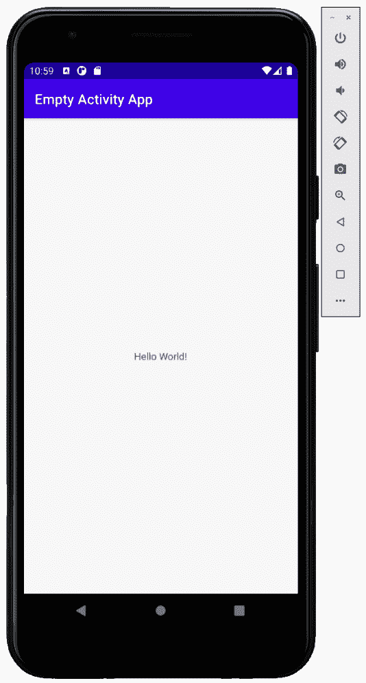

图 3.1 - 你好，世界！

现在我们有了一个全新的**空活动**项目，让我们来探索一下 Android Studio 为我们生成的文件和文件夹。

## 探索一个空活动项目

现在，是时候深入了解我们应用程序的文件和文件夹了。这将节省我们很多时间和困惑，以后在书中。然而，请注意，没有必要记住所有这些文件的位置，甚至更不需要理解文件中的代码。事实上，即使在书的最后，XML 的部分内容仍然是一个谜，但这不会阻止您设计、编码和发布令人惊叹的应用程序。

在下面的屏幕截图中，看看项目资源管理器窗口，就在项目创建后：


图 3.2 - 项目资源管理器窗口

注意前一个屏幕截图中指示的两个箭头？你可能已经猜到，这些箭头允许我们展开`app`和`Gradle Scripts`文件夹。可能你的文件夹已经展开了。为什么不尝试一下箭头，多次展开和折叠它们呢？

注意

在本书的背景下，我们不需要探索`Gradle Scripts`文件夹。Gradle 是 Android Studio 的重要组成部分，但其作用是向用户隐藏 Android Studio 执行的相当复杂的过程，例如添加资源文件，编译和构建项目等。因此，我们不需要进一步深入研究这一点。然而，如果您决定将 Android 提升到下一个水平，那么深入了解 Gradle 及其与 Android Studio 的关系是值得投资的时间。

我们将详细探讨`app`文件夹。单击`app`文件夹旁边的箭头以展开其内容，然后我们将开始探索。第一层内容如下屏幕截图所示：

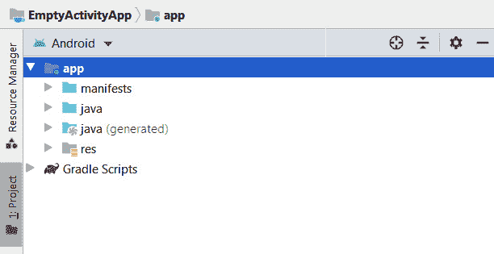

图 3.3 - 探索 app 文件夹

我们已经展示了另外四个文件夹：`manifests`、`java`、`java(generated)`和`res`。让我们从顶部开始查看所有四个文件夹。

注意

Packt 为其图书使用的样式指南建议使用`此字体`来表示文件名和文件夹名。由于我们讨论的文件和文件夹既是文件又是文件夹，并且出现在屏幕上，为了保持一致性并且更加紧凑，我选择只使用后者的字体，并且在整本书中在选择不明确的情况下都会使用这个选项。

### 清单文件夹

`manifests`文件夹里只有一个文件。展开`manifests`文件夹并双击`AndroidManifest.xml`文件。注意文件已在编辑窗口中打开，并且已添加了一个标签，这样我们就可以轻松地在这个文件和其他文件之间切换。下一个屏幕截图显示了已添加的新标签，以及`manifests`文件夹中`AndroidManifest.xml`文件中包含的 XML 代码：


图 3.4 - 添加新标签

我们不需要理解文件中的一切，但值得指出的是，我们将偶尔在这里进行修改 - 例如，当我们需要请求用户访问其设备功能的权限时。当我们想要为沉浸式体验制作全屏应用程序时，我们还将编辑此文件，比如在*第二十一章**,* *线程和启动实时绘图应用程序*中开始的绘图应用程序。

请注意，文件的结构类似于我们在上一章中看到的布局文件的结构 - 例如，有明确定义的以`<section name`开头并以`</section name>`结束的部分。这样的真实例子有`<application`和`</application>`，以及`<activity`和`</activity>`。

事实上，除了第一行之外，整个文件内容都包含在`<manifest`和`</manifest>`中。

就像我们输入计算的括号一样，这些开头和结尾部分必须匹配，否则文件将在我们的项目中引起错误。Android Studio 在这些结构的前面缩进（放置制表符）以使这些部分及其深度更加清晰。

这段代码的一些特定部分值得注意，所以我会指出其中的一些行。

下一行告诉 Android，我们想要在`mipmap`文件夹中显示给用户的图标来启动应用程序，它被称为`ic_launcher`：

```kt
android:icon="@mipmap/ic_launcher"
```

随着我们继续探索，我们将自己验证这一点。

下一行有两个值得讨论的方面。首先，它表示我们给我们的应用程序的名称；其次，该名称作为`app_name`包含在这里：

```kt
android:label="@string/app_name"
```

注意

在编程中，包括 Java 和 XML，在计算中，字符串是任何字母数字值。我们将在整本书中学到更多关于字符串的知识，从*第七章*开始，*Java 变量、运算符和表达式*。因此，我们可以猜测`app_name`标签的字母数字值是`Empty Activity App`，因为这是我们创建应用程序时称呼它的名称。

这可能听起来有点奇怪，但我们很快就会看到这个文件（及其标签），在以后的项目中，我们将向其中添加更多的标签和值。我们还将了解为什么以这种在这个阶段似乎相当复杂的方式向我们的应用程序添加文本的原因。

我们可以讨论`AndroidManifest.xml`文件中的每一行，但我们不需要这样做。让我们再看两行，因为它们彼此相关。下一行显示了我们的 Activity 的名称，这是在我们创建项目时 Android Studio 选择的。我在这里突出显示了 Activity 的名称，只是为了让它更加突出：

```kt
<activity android:name=".MainActivity">
```

接下来的这一行，出现在`<activity`和`</activity>`标签内，表示它是`activity`的一个属性，并显示这个 Activity 是在启动应用程序时应该运行的那个。它是`LAUNCHER`：

```kt
<category android:name="android.intent.category.LAUNCHER" />
```

这意味着我们的应用程序可以有多个 Activity。很多时候，如果您的应用程序有多个屏幕，比如主屏幕、设置屏幕等，它们是由多个`Activity`类的实例构建的。

关于`Activity`和`activity`的说明。在 XML 中，就像`AndroidManifest`文件一样，`activity`是小写的，但在 Java 中，`Activity`类有一个大写的`A`。这只是一种约定，不值得担心。正如我们刚才看到的，XML 中的`activity`具有一个`name`属性，其值指的是 Java `Activity`的一个实例。

让我们深入`java`文件夹。我想知道我们会在那里找到什么。

### java 文件夹

对于稍微讽刺的评论，我表示歉意。当然，我们会找到所有的 Java 代码。首先，这只包括一个文件，但随着我们的项目的增长，我们将添加更多。展开`java`文件夹，您会发现另外三个文件夹，如下面的截图所示：

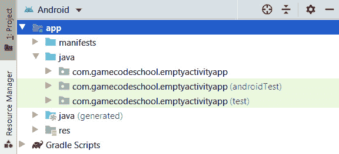

图 3.5 – 展开 java 文件夹

在本书中，我们只需要这三个文件夹中的一个——顶部的那个。这些文件夹的名称由包名称（在创建应用程序时选择）和应用程序名称组成，全部小写且没有空格（也是在创建应用程序时选择的）。

注意

有多个同名文件夹的原因是与自动化测试有关的高级原因，这超出了本书的范围。因此，你可以安全地忽略以`(androidTest)`和`(test)`结尾的文件夹。

在本书的过程中，我们感兴趣的唯一文件夹是顶部的那个，在我的屏幕上是`com.gamecodeschool.emptyactivityapp`。根据你选择的包名称和我们当前正在工作的应用程序的名称，文件夹名称会发生变化，但我们始终需要访问和添加或编辑其内容的是顶部的那个。

现在展开`com.gamecodeschool.emptyactivityapp`（或者你的文件夹名称）文件夹，查看其内容。在下一个截图中，你可以看到该文件夹只有一个文件：


图 3.6 – com.gamecodeschool.emptyactivityapp 文件夹

这个文件是`MainActivity.java`，尽管项目窗口中没有显示文件扩展名，但它在编辑器窗口上方的标签中显示。事实上，`java/packagename.appname`文件夹中的所有文件都将有一个`.java`扩展名。如果双击`MainActivity.java`文件，它将在编辑器窗口中打开，尽管我们也可以只点击编辑器窗口上方的`MainActivity.java`标签。随着我们添加更多的 Java 文件，知道它们的位置将会很有用。

检查`MainActivity.java`文件，你会发现它是我们在第一个项目中使用的 Java 文件的简化版本。它与原来的文件相同，只是方法更少，在`onCreate`方法中没有自动生成的代码。方法缺失是因为 UI 更简单，因此它们是不需要的，而且 Android Studio 没有生成它们。

为了参考，看一下下一个截图中`MainActivity.java`文件的内容。我已经在代码中勾画了一行：


图 3.7 – MainActivity.java 文件

它仍然具有在用户运行应用程序时执行的`onCreate`方法，但其中的代码要少得多，`onCreate`是唯一的方法。看一下`onCreate`方法中的最后一行代码——在继续探索`res`文件夹之前，我们将讨论这个。以下是讨论中的代码行：

```kt
setContentView(R.layout.activity_main);
```

代码正在调用一个名为`setContentView`的方法，并且正在向`setContentView`方法传递一些数据，以便`setContentView`方法中的代码可以使用。传递给`setContentView`的数据是`R.layout.activity_main`。

现在，我只想提一下`setContentView`方法是由 Android 提供的，`R.layout.activity_main`是什么？

我们将通过探索`res`文件夹来了解，但是快速提一下`Java（生成的）`文件夹，这样我们在进展中不会为此烦恼。首先要注意的是，该文件夹是在模拟器或真实设备上首次运行应用程序时自动生成的，因此如果你还没有运行应用程序，你就看不到它。

### Java（生成的）文件夹

这个文件夹包含了由 Android Studio 生成的代码，我们不需要关心其中的内容。即使是需要它的高级用户通常也只是用它作为参考。

让我们继续讨论`res`文件夹和`R.layout.activity_main`代码。

### res 文件夹

`res`文件夹是所有资源的存放地。左键单击展开`res`文件夹，我们将检查里面的内容。这是该文件夹内顶层文件夹的截图：

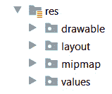

图 3.8 – res 文件夹

让我们从列表的顶部开始，看`drawable`文件夹。

#### `res/drawable`文件夹

这个名称有点透露了一些东西，但`drawable`文件夹中包含的不仅仅是图形。随着我们在书中的进展，我们确实会向这个文件夹中添加图形。但是现在，它只包含两个文件。

这些文件是`ic_launcher_foreground`和`ic_launcher_background`。我们不会检查任何文件，因为我们永远不需要修改它们，但我会简单提一下它们是什么。

如果你打开这些文件，你会发现它们非常长而且技术性很强。它们包括看起来是坐标、颜色等的列表。它们被称为**图形蒙版**，用于 Android 适应/遮罩其他图形—具体来说，在这种情况下，是应用程序的启动图标。这些文件向 Android 提供了关于如何调整应用程序启动图标的指令。

这个系统是为了让不同的设备制造商可以创建适合自己 Android 设备的蒙版。这些蒙版默认位于`drawable`文件夹中（`ic_launcher_foreground`和`ic_launcher_background`），它们是默认的自适应蒙版，为启动图标添加了视觉上令人愉悦的阴影和深度。

注意

如果自适应图标的概念对你有吸引力，那么你可以在这个链接上看到*Android 开发者*网站上的完整而非常直观的解释，网址为[`developer.android.com/guide/practices/ui_guidelines/icon_design_adaptive`](https://developer.android.com/guide/practices/ui_guidelines/icon_design_adaptive)。你不需要查看这个页面就可以继续。

我们现在对`drawable`文件夹有足够的了解，让我们继续看`layout`文件夹。

#### `res/layout`文件夹

`res`文件夹是应用程序所有资源的存放处，如图标、布局（XML 文件）、声音和字符串。让我们仔细看一下。

展开`layout`文件夹，你会看到一个名为`activity_main.xml`的布局文件，如果你打开它查看内容，你会发现它与我们在上一章中编辑的文件非常相似。这次内容更少，因为我们生成了一个`ConstraintLayout`元素，包裹着一个写着`Hello World!`的`TextView`小部件。

一定要查看内容，但这里最有趣的不是这个。仔细看文件的名称（不包括 XML 文件扩展名）：`activity_main`。

现在，回想一下`MainActivity.java`文件中的 Java 代码。这是我们说过设置 UI 的代码行。我已经突出显示了一部分代码：

```kt
setContentView(R.layout.activity_main);
```

`R.layout.activity_main`代码确实是对`res/layout`文件夹中的`activity_main`文件的引用。这是我们的 Java 代码和 XML 布局/设计之间的连接。

注意

除了`activity_main.xml`的内容之外，与第一个项目有所不同——在第一个项目的`layout`文件夹中，有多个额外的文件。在本章的后面，我们将使用第一章中使用的相同模板（**基本活动**）构建另一个项目，以了解原因。

在此之前，让我们探索最后两个文件夹及其所有子文件夹，从列表中的下一个开始：`mipmap`。

#### `res/mipmap`文件夹

`mipmap`文件夹很简单—嗯，相对简单。展开文件夹查看其内容，如下面的截图所示：

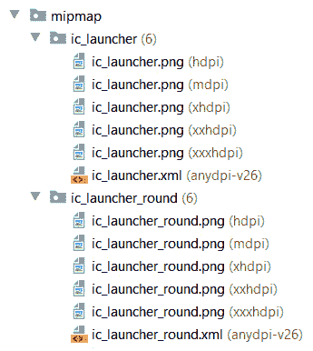

图 3.9 – mipmap 文件夹

在这里，我们可以看到两个子文件夹：`ic_launcher`和`ic_launcher_round`。`ic_launcher`的内容是我们在设备的应用程序抽屉/主屏幕中看到的常规启动图标的图形，而`ic_launcher_round`包含使用圆形图标的设备的图形。双击每个文件夹中的`.png`文件来查看。我在下一个截图中将它们并排放置，以帮助我们讨论：

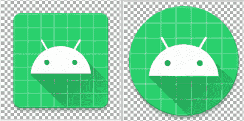

图 3.10 – 启动图标

你可能也想知道为什么每个文件夹中有五个`ic_launcher….png`文件。这是因为为不同的屏幕尺寸和分辨率提供合适缩放的图标是一个良好的做法。通过提供带有`hdpi`、`mdpi`、`xhdpi`、`xxhdpi`和`xxxhdpi`资格的图像，这允许不同的 Android 设备选择最适合用户的图标。

注意

字母`dpi`代表高、中、超高、超超高等前缀。这些被称为**限定符**，随着我们的进展，我们会看到 Android 有很多限定符，帮助我们构建适合不同 Android 设备的应用程序。

`mipmap`文件夹的最后一个谜团是，每个子文件夹中也有一个 XML 文件。打开其中一个，你会看到它们引用了我们在`drawable`文件夹中看到的`ic_launcher_foreground`和`ic_launcher_background`文件。这告诉 Android 设备从哪里获取自适应图标的详细信息。这些文件不是必需的，但它们使图标看起来更好，同时增加了它们的灵活性。

我们还有一个文件夹和它的所有文件，然后我们将充分理解 Android 应用程序的结构。

#### res/values 文件夹

打开`res/values`文件夹，可以看到我们将依次简要讨论的三个文件。所有这些文件相互关联/引用，或者与我们已经看过的其他文件相互关联。

为了完整起见，这里是`res/values`文件夹中三个文件的截图：


图 3.11 - res/values 文件夹

注意

在`values`文件夹内还有一个`themes`文件夹，但在本书的上下文中我们不需要探索这个。

理解的关键不在于记忆连接，当然也不是试图记忆或理解文件中的代码，而是要欣赏到迄今为止我们所见过的所有文件和代码之间相互关联的本质。

让我们依次查看文件的内容。

颜色.xml 文件

接下来我们将查看`colors.xml`文件的内容，如下所示：

```kt
<?xml version="1.0" encoding="utf-8"?>
<resources>
    <color name="colorPrimary">#6200EE</color>
    <color name="colorPrimaryDark">#3700B3</color>
    <color name="colorAccent">#03DAC5</color>
</resources>
```

请注意，起始和结束标签采用了我们从 XML 文件中所期望的通常模式。有一个开放的`<resources>`标签和一个闭合的`</resources>`标签。作为资源的子元素，有三对`<color> … </color>`标签。

在每个`color`标签中都有一个`name`属性和看起来很奇怪的代码，由数字和字母组成。`name`属性是颜色的名称。我们将在接下来的文件中看到各种名称的引用。

代码是定义实际颜色本身的东西。因此，当引用名称时，相关代码定义的颜色将显示在屏幕上。我们将在一会儿看到这些名称在哪里被引用。

注意

代码称为`0`到`9`和`a`到`f`，共有 16 个可能的值。如果你想了解更多并尝试使用十六进制颜色，请访问[`www.color-hex.com/color-wheel/`](http://www.color-hex.com/color-wheel/)。如果你对十六进制（基数 16）、二进制（基数 2）等数字基感到好奇，那么请看下面的文章，它解释了它们，并谈到了为什么人类通常使用十进制：[`betterexplained.com/articles/numbers-and-bases/`](https://betterexplained.com/articles/numbers-and-bases/)。你不需要阅读这些文章来继续阅读本书。

字符串.xml 文件

大多数现代应用程序都是为尽可能广泛的受众而制作的。此外，如果一个应用程序的规模或复杂性很大，那么软件公司中的角色通常被分成许多不同的团队 - 例如，为 Android 应用程序编写 Java 代码的人很可能与设计 UI 布局的人几乎没有关系。

通过将应用程序的内容与应用程序的编程分开，可以更容易地随时进行更改，还可以在不更改每个 Java 代码的情况下为多种不同的口头语言创建内容。

接下来看一下`strings.xml`文件的内容：

```kt
<resources>
    <string name="app_name">Empty Activity App</string>
</resources>
```

我们可以看到在现在熟悉的`<resources>…</resources>`标签中，有一个`<string>…</string>`标签。在`string`标签中，有一个名为`name`的属性，具有`app_name`值，然后是`Empty Activity App`的进一步值。

让我们再看一下我们之前在*清单文件夹*部分中探索过的`AndroidManifest.xml`文件中的一行。接下来是相关的代码行，但如果您想要查看完整的上下文中的代码行，请参考 Android Studio 中的文件本身：

```kt
android:label="@string/app_name"
```

`android:label`属性被赋予了`@string/app_name`的值。在 Android 中，`@string`指的是`strings.xml`文件中的所有字符串。在这个特定的应用程序中，具有`app_name`标签的`string`属性具有`Empty Activity App`的值。

因此，在应用程序运行时，`AndroidManifest.xml`文件中先前显示的代码行对屏幕产生以下影响：

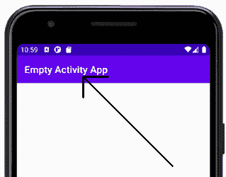

图 3.12 – AndroidManifest.xml 文件效果

虽然这个系统乍看起来可能有些复杂，但在实践中，它将设计和内容与编码分开，这是非常高效的。如果应用程序的设计者想要更改其名称，他们只需编辑`strings.xml`文件，而无需与 Java 程序员进行交互；如果应用程序中的所有文本都是作为字符串资源提供的，那么在项目进行过程中所有这些文本都可以很容易地进行更改和调整。

Android 通过允许开发人员为每种语言/区域设置不同的字符串资源文件来进一步提高了这种灵活性。这意味着开发人员可以为全球范围内的用户提供完全相同的 Java 代码。Java 程序员只需引用字符串资源的`name`属性，而不是将文本本身硬编码到 Java 中，然后其他部门可以设计文本内容并处理诸如语言翻译之类的任务。我们将在*第十八章*中使应用程序多语言化，*本地化*。

注意

在 Java 代码中直接硬编码实际文本而不是使用字符串资源是可能的，我们会不时这样做，为了方便展示一些 Java 而不必陷入编辑或添加到`strings.xml`文件中。在上一章中，当我们制作吐司消息并将文本输出到控制台时，我们就这样做了。

Android 系统允许设计者选择一系列颜色、文本、图像、声音和其他资源，轻松地为世界各地的不同地区制作其应用程序的变体。

例如，在西方文化中，绿色可以代表自然和正确性的主题；在许多中东国家，绿色代表生育力，是与伊斯兰教相关的颜色。虽然您可能在这些地区分发绿色，但您的应用程序将被认为是非常不同的。

如果您将应用程序推出到印度尼西亚，绿色在许多（尽管不是所有）印度尼西亚人中是受到文化蔑视的。接下来，您在中国推出，绿色可能会带有与不忠有关的负面含义。这是一个典型的 Java 程序员永远不会学会应对的困难局面——幸运的是，由于我们可以在 Android Studio 中分担责任的方式，他们不需要了解这一点。

颜色——因此，样式和主题——是一个非常专业的话题。虽然我们不会探索比绿色更深入的内容，但希望您能看到将编程、布局、颜色和文本内容的责任分开的好处。

值得一提的是，即使我们不会雇佣设计师、翻译员和文化专家团队，也完全有可能制作出一款受到成千上万甚至数百万用户喜爱的精彩应用。然而，即使我们不打算雇佣设计师、翻译员和文化专家团队，我们仍然必须在设计的基础上进行工作，这就是为什么我们要深入研究。

到目前为止，我们已经很好地掌握了 Android 项目的组成部分以及不同方面之间的联系。让我们再构建一个应用程序，不需要以相同的细节深入研究，而是看看不同的应用程序模板对 Android Studio 生成的基础文件造成的影响。

# 探索基本活动项目模板的文件和文件夹结构

使用自动生成 UI 的下一个最简单的项目类型是**基本活动**项目。这是我们在*第一章**《开始 Android 和 Java》*中创建的相同类型的项目。现在可以打开该项目，但是生成一个新项目同样快速，而且我们也可以在没有任何修改和添加的情况下进行检查讨论。

继续如下操作：

1.  运行 Android Studio 并左键单击**开始新的 Android Studio 项目**选项。

1.  接下来是**选择项目模板**窗口。选择**基本活动**，然后点击**下一步**。

1.  在**配置您的项目**窗口中，设置项目如下：

1.  点击**完成**按钮，我们将运行应用程序，看看我们取得了什么成就。

现在，我们可以深入研究文件。我们不会像我们为**空活动**项目那样详细查看所有内容；相反，我们只会看看文件之间的相互联系，并进行一些比较。

# 探索基本活动项目

首先让我们看看代码编辑器中`MainActivity.java`选项卡中的 Java 代码。正如前面所述，**基本活动**项目比**空活动**项目更复杂。

注意

您可以打开尽可能多的 Android Studio 实例。如果要并排比较项目，请选择**文件** | **打开**，然后选择项目，当提示时选择**新建窗口**以打开项目，而不关闭已经打开的任何项目。

首先要注意的是`onCreate`方法中有一些额外的代码。

### MainActivity.java 文件

我在*第二章**《第一次接触：Java、XML 和 UI 设计师》*中非常简要地提到了 Java 代码和 XML 代码中的这些相互联系。让我们浏览一下资源文件，并指出这些 Java 代码指向的 XML 文件。

下面是下一个显示的 Java 代码。我稍微重新格式化了一下，以便在书中更易读：

```kt
Toolbar toolbar = (Toolbar) findViewById(R.id.toolbar);
setSupportActionBar(toolbar);
FloatingActionButton fab = findViewById(R.id.fab);
fab.setOnClickListener(new View.OnClickListener() {
   @Override
   public void onClick(View view) {
         Snackbar.make(view, "Replace with your own 
          action", Snackbar.LENGTH_LONG)
                      .setAction("Action", null).show();
   }
});
```

要完全理解这段代码将需要更多的章节，但是指出这段代码使用资源文件的地方只需要一会儿，然后我们会更加了解构成我们项目的组件。

代码涉及两个资源。第一个是`Toolbar`资源，通过`R.id.toolbar`引用。第二个是`FloatingActionBar`资源，通过`R.id.fab`引用 XML 文件，我们很快就会看到。

如果我们在项目窗口中打开`res/layout`文件夹和`java`文件夹，我们会发现与**空活动**项目中的情况不同，如下图所示：

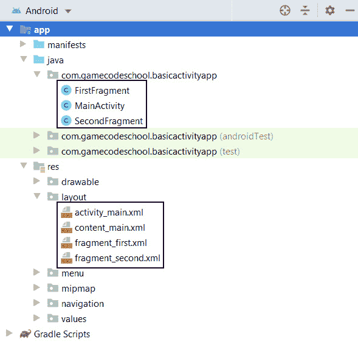

图 3.13 – res/layout 文件夹和 java 文件夹

现在有三个自动生成的 Java 文件和四个自动生成的 XML 布局文件。

请记住，这个应用有两个屏幕——第一个屏幕上有一个**Hello first fragment**消息和一个**Next**按钮；第二个屏幕上只有一个**Previous**按钮。

发生的事情是，Android Studio 不仅为每个屏幕的外观提供单独的布局文件，而且还为控制每个屏幕的代码提供单独的 Java 文件。如果你只是表面上接受了我刚才说的话，因此你会期望有两个布局文件和两个 Java 文件，但我们有更多。

正如我们已经知道的，当用户运行应用程序时，`MainActivity.java`文件的`onCreate`方法被执行。这设置了应用程序，包括布局。布局在`activity_main.xml`中，但这个文件不再控制两个主要屏幕的布局。它具有两个屏幕之间一致的元素，并将布局委托给`content_main.xml`。然后，`content_main.xml`文件定义了它所占据的屏幕区域，并将将出现在此区域的细节委托给另一个文件，即`res/navigation`文件夹中的`nav_graph.xml`文件。然后，`nav_graph.xml`文件确定使用哪个布局（`fragment_first.xml`或`fragment_second.xml`）以及哪个相应的 Java 文件将控制布局（`FirstFragment.java`或`SecondFragment.java`）。

在这个阶段，显而易见的复杂性可能会让人不知所措。我猜这可能是使得学习 Android 开发没有任何先前开发经验如此具有挑战性的原因之一。但好消息是：

+   我们不需要记住和理解所有这些相互关联的细节。

+   我们可以构建大量的应用程序而不使用其中任何部分。

+   随着我们在书中的进展，并且与这个谜题的不同部分一起工作，我们将逐渐熟悉它们。

看一下下一个图，展示了**基本活动**模板应用程序的工作原理：

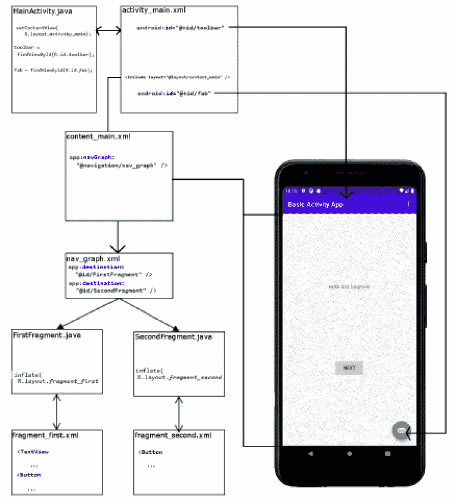

图 3.14 – 基本活动模板

如果显而易见的复杂性看起来令人沮丧，那么了解为什么要这样做可能会有所帮助。我们已经讨论过将布局与编程分开，并进一步分离文本和图形，以允许不同的团队处理应用程序的不同方面。现在，我们可以进一步分离不仅是应用程序不同屏幕之间的导航，比如主菜单屏幕、设置屏幕和其他一些屏幕，而且与每个屏幕相关的布局和编程也是分开的，因此它们也可以由不同的团队同时进行。随着我们在章节中的进展，我们会更多地讨论这个问题。

我们将研究编写单独的片段布局和控制每个片段的单独 Java 代码，以及从*第二十四章*开始，我们将更深入地了解为什么我们希望这样做，并且我们将在下一章更深入地研究`activity_main.xml`和`content_main.xml`等相互关联的布局文件。

目前，让我们更深入地看一下`MainActivity.java`文件代码如何与`activity_main.xml`布局相连接。我们会发现，虽然`activity_main.xml`文件负责放置工具栏和浮动操作按钮，但`MainActivity.java`文件负责控制用户与它们交互时发生的事情。

### activity_main.xml 文件

目前，打开`activity_main.xml`文件，你会看到有一些元素来代表`toolbar`和`fab`。引用这些元素的 Java 代码正在设置工具栏和浮动操作栏以供使用。XML 代码，正如我们所期望的那样，描述了它们的外观。

这是工具栏的 XML 代码：

```kt
<androidx.appcompat.widget.Toolbar
   android:id="@+id/toolbar"
   android:layout_width="match_parent"
   android:layout_height="?attr/actionBarSize"
   android:background="?attr/colorPrimary"
   app:popupTheme="@style/AppTheme.PopupOverlay" />
```

注意它提到了工具栏、颜色和样式，以及其他一些方面。

为了清晰起见，这是实际工作应用程序中的工具栏：

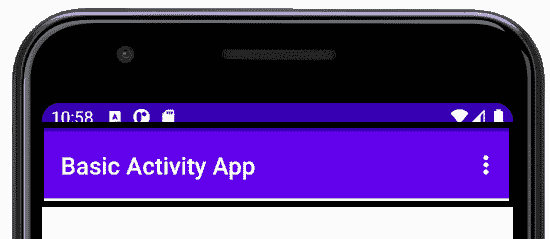

图 3.15 – 应用程序的工具栏

这是悬浮操作按钮的 XML 代码。我稍微重新格式化了代码的第一行，以便在本书的打印版本中更好地显示：

```kt
<com.google.android.material.floatingactionbutton.
FloatingActionButton
   android:id="@+id/fab"
   android:layout_width="wrap_content"
   android:layout_height="wrap_content"
   android:layout_gravity="bottom|end"
   android:layout_margin="@dimen/fab_margin"
   app:srcCompat="@android:drawable/ic_dialog_email" />
```

请注意，它具有`fab`的`id`值。通过这个`id`值，我们可以在我们的 Java 代码中访问悬浮操作按钮，具体来说，是`MainActivity.java`中的这一行：

```kt
FloatingActionButton fab = findViewById(R.id.fab);
```

在这行代码执行之后，我们的 Java 代码中的`fab`对象现在可以直接控制悬浮操作按钮及其所有属性。在*第十三章*，*匿名类 – 让 Android 小部件栩栩如生*中，我们将学习如何详细做到这一点。

这是实际应用程序中的悬浮操作按钮：


图 3.16 – 悬浮操作按钮

我没有详细解释代码，因为在这个阶段没有意义。只需开始在这里梳理相互关系：

+   XML 文件可以引用其他 XML 文件。

+   Java 可以引用 XML 文件（以及，正如我们很快将看到的，其他 Java 文件）。

+   现在，我们已经看到在 Java 中，我们可以通过其`id`属性抓取 XML 文件中特定部分的 UI 控制。

我们已经从这个文件中看到足够的内容，所以让我们继续并深入了解剩下的文件。

### MainActivity.java 中的额外方法

那么，这些方法是做什么的，它们何时被调用，由谁调用？下一个区别是这个额外的方法（再次略微重新格式化以供展示）：

```kt
@Override
public boolean onCreateOptionsMenu(Menu menu) {
   // Inflate the menu; this adds items to the 
   // action bar if it is present.
   getMenuInflater().inflate(R.menu.menu_main, menu);
   return true;
}
```

这段代码准备（膨胀）了在`menu_main.xml`文件中定义的菜单，就像`onCreate`方法一样，`onCreateOptionsMenu`方法是一个重写的方法，由操作系统直接调用。

然后，接下来是另一个方法：

```kt
@Override
public boolean onOptionsItemSelected(MenuItem item) {
   // Handle action bar item clicks here. The action bar 
      will
   // automatically handle clicks on the Home/Up button, so 
      long
   // as you specify a parent activity in 
      AndroidManifest.xml.
   int id = item.getItemId();
   //noinspection SimplifiableIfStatement
   if (id == R.id.action_settings) {
         return true;
   }
   return super.onOptionsItemSelected(item);
}
```

这个方法也被重写了，并且它也是由操作系统直接调用的。它处理用户选择菜单中的项目（选项）时发生的情况。目前，它只处理一个选项——设置选项——并且目前不执行任何操作，如下所示：

```kt
The code if (id == R.id.action_settings) {
```

这确定了`return true`代码是否执行任何选项，并且控制是否返回到被用户点击**设置**菜单选项中断的应用程序的任何部分执行之前。

我们现在已经知道了几乎足够的知识。不要担心记住所有这些连接。我们将回到每个连接，进行更深入的调查，并巩固我们对每个连接的理解。

现在，我们可以更仔细地看一下 Android 模拟器。

# 探索 Android 模拟器

随着我们的进展，熟悉如何使用 Android 模拟器会有所帮助。如果您还没有使用最新版本的 Android，甚至执行一些简单任务的方式（例如查看所有应用程序）可能与您当前的设备工作方式不同。此外，我们想知道如何使用所有模拟器附带的额外控件。

## 模拟器控制面板

您可能已经注意到当您运行模拟器时，旁边会出现一个迷你控制面板。让我们来看一些最有用的控件。看一下模拟器控制面板的截图。我已经在上面加了注释，以帮助讨论它：


图 3.17 – 模拟器控制面板

我将简要提及更明显的控件，并在必要时进行更深入的讨论：

1.  这些是窗口控件。最小化或关闭模拟器窗口。

1.  从上到下，关闭模拟器，模拟关闭实际设备的电源。接下来的两个图标分别提高和降低音量。

1.  这两个按钮允许您将模拟器向左和向右旋转。这意味着您可以测试您的应用程序在所有方向下的外观，以及在应用程序运行时如何处理方向更改。这两个图标立即下方的图标分别是截图和放大。

1.  这些图标模拟了返回按钮和主页按钮，以及查看正在运行的应用程序。请尝试一下这些按钮，因为我们将不时需要使用它们，包括在*第六章*中，*Android 生命周期*。

1.  按下此按钮以启动**高级设置**菜单，在那里您可以与传感器、**全球定位系统**（**GPS**）、电池、指纹识别器等进行交互。如果您感兴趣，可以尝试一些这些设置。

让我们来玩一下模拟器本身。

## 将模拟器用作真实设备

模拟器可以模拟真实手机的每个功能，因此可以写一本关于使用它的整本书。如果您想要编写用户喜爱的应用程序，那么了解各种 Android 设备是值得花时间去做的。我只想在这里指出一些最基本的功能，因为没有这些基本的交互，将很难跟上本书的内容。此外，如果您有一部较旧的 Android 设备，那么一些基本的功能（如访问应用程序抽屉）已经发生了变化，您可能会感到有些困惑。

### 访问应用程序抽屉

将鼠标光标放在主屏幕底部并向上拖动以访问应用程序抽屉（所有应用程序）。下面的截图显示了这个动作进行到一半的情况：

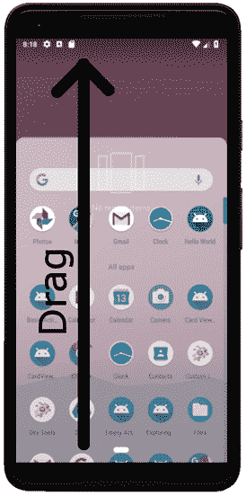

图 3.18 - 向上拖动以访问应用程序抽屉

现在，您可以运行模拟器上安装的任何应用程序。请注意，当您通过 Android Studio 运行您的应用程序之一时，它将保留在模拟器上安装，并且因此可以从应用程序抽屉中运行。但是，您在 Android Studio 中对应用程序所做的每一次更改都需要您再次点击 Android Studio 快速启动栏上的播放按钮来运行/安装应用程序 - 就像我们一直在做的那样。

### 查看活动应用程序并在应用程序之间切换

要查看活动应用程序，您可以使用模拟器控制面板，即模拟器控制面板截图上标有数字**4**的方块（*图 3.17*）。要使用手机屏幕访问相同的选项（就像在真实设备上一样），向上滑动，就像访问应用程序抽屉时一样，但只需滑动大约屏幕长度的四分之一。这个过程在下面的截图中有所说明：


图 3.19 - 向上滑动

现在，您可以通过最近的应用程序向左和向右滑动，向上滑动应用程序以关闭它，或者点击返回按钮返回到您在查看此选项之前所做的事情。请尝试一下，因为我们经常会使用这些基本功能。

# 总结

请记住，本章的目标是熟悉 Android/Android 项目的系统/结构。Android 项目是 Java 和多种资源文件的交织。资源文件可以包含 XML 来描述我们的布局、文本内容、样式和颜色，以及图像。资源可以针对世界各地的不同语言和地区进行生产。我们将在本书中看到和使用的其他资源类型包括主题和音效。

不需要记住不同资源文件和 Java 文件之间的各种连接方式。重要的是要意识到它们之间的联系，并能够检查各种类型的文件，并意识到它们何时依赖于另一个文件中的代码。每当我们从 Java 代码创建与 XML 代码的连接时，我都会再次指出连接的细节。

我们不需要学习 XML 和 Java，但我们会对它有一点点了解。Java 将是本书的重点，但我们的 Java 经常会涉及 XML 代码，因此理解并看到一些互连的示例将有助于您更快地取得进展。

我们还探索了模拟器，以便在测试我们的应用程序时充分利用它。

在下一章中，我们将使用两种不同的 Android 布局方案构建两个自定义布局。我们还将编写一些 Java 代码，以便我们可以通过点击按钮来在它们之间切换。
