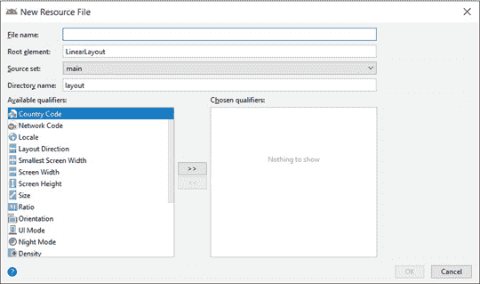
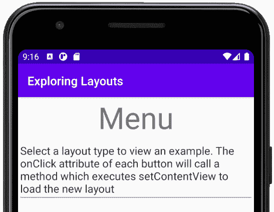
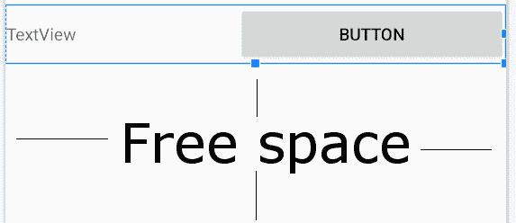
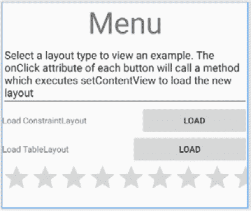
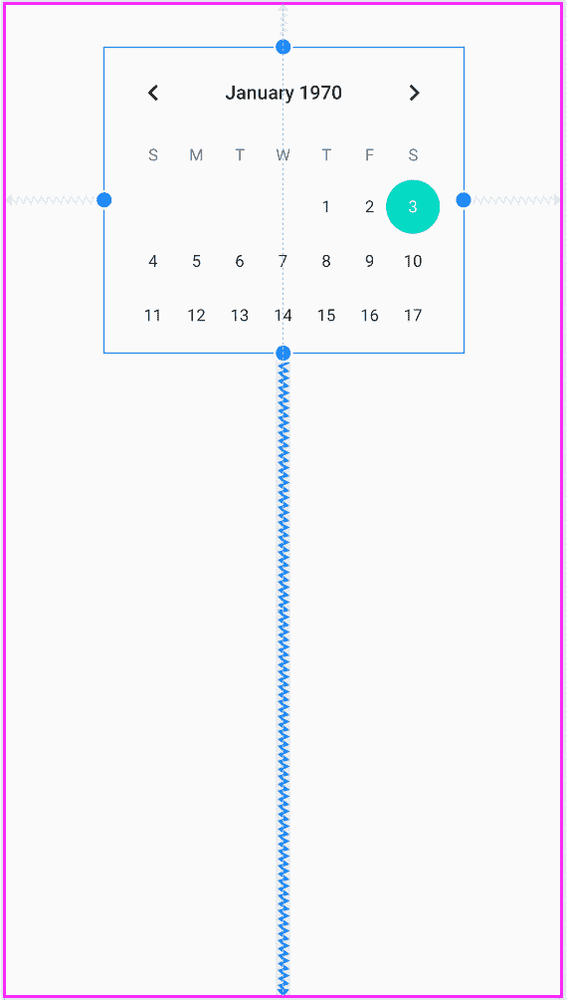
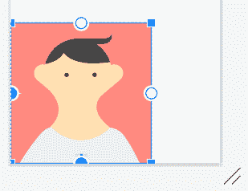
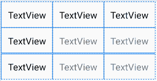

# 第四章：*第四章*：开始使用布局和 Material Design

我们已经看到了 Android Studio 的**用户界面**（**UI**）设计师，以及 Java 的实际应用。在这个动手实践的章节中，我们将构建三个更多的布局——仍然相当简单，但比我们迄今为止所做的要进一步。

在我们开始动手之前，我们将快速介绍**Material Design**的概念。

我们将看到另一种称为`LinearLayout`的布局类型，并逐步使用它来创建可用的 UI。我们将进一步使用`ConstraintLayout`，既了解约束，又设计更复杂和精确的 UI 设计。最后，我们将介绍`TableLayout`，用于在易于阅读的表格中布置数据。

我们还将编写一些 Java 代码，以在我们的应用程序/项目中在不同的布局之间切换。这是第一个将多个主题整合到一个整洁包裹中的重要应用程序。该应用程序名为**探索布局**。

在本章中，我们将讨论以下主题：

+   了解 Material Design

+   探索 Android UI 设计

+   介绍布局

+   构建`LinearLayout`并学习何时最好使用这种类型的布局

+   构建另一个稍微更高级的`ConstraintLayout`并了解更多关于使用约束的知识

+   构建`TableLayout`并填充数据以显示

+   将所有内容连接在一个名为**探索布局**的应用程序中

首先是 Material Design。

# 技术要求

您可以在 GitHub 上找到本章的代码[`github.com/PacktPublishing/Android-Programming-for-Beginners-Third-Edition/tree/main/chapter%2004`](https://github.com/PacktPublishing/Android-Programming-for-Beginners-Third-Edition/tree/main/chapter%2004)。

# 了解 Material Design

您可能听说过 Material Design，但它究竟是什么？Material Design 的目标非常简单——创建美观的 UI。然而，它也是关于使这些 UI 在 Android 设备上保持一致。Material Design 并不是一个新的想法；它直接来源于纸笔设计中使用的设计原则，例如通过阴影和深度具有视觉上令人愉悦的装饰。

Material Design 使用材料层的概念，您可以将其视为照片编辑应用程序中的图层的方式。通过一组原则、规则和指南实现一致性。必须强调的是 Material Design 是完全可选的，但也必须强调的是 Material Design 是有效的——如果您不遵循它，您的设计很可能不会受到用户的欣赏。毕竟，用户已经习惯了某种类型的 UI，而该 UI 很可能是使用 Material Design 原则创建的。

Material Design 是一个值得追求的合理标准，但在学习其细节时，我们不应该让它阻碍我们学习如何开始使用 Android。

本书将专注于完成任务，偶尔指出 Material Design 如何影响设计，以及对于那些想深入了解 Material Design 的人的更多资源。

# 探索 Android UI 设计

我们将看到，对于 Android UI 设计，我们所学到的很多内容都是依赖上下文的。给定小部件的*x*属性如何影响其外观可能取决于小部件的*y*属性，甚至取决于另一个小部件的属性。这并不容易逐字学习。最好期望通过实践逐渐取得更好和更快的结果。

例如，如果您通过拖放小部件到设计中来玩转设计师，生成的**可扩展标记语言**（**XML**）代码将会有很大的不同，这取决于您使用的布局类型。在本章中我们将看到这一点。

这是因为不同的布局类型使用不同的方法来决定其子元素的位置，例如，我们将在下面探索的`LinearLayout`与我们项目中默认添加的`ConstraintLayout`的工作方式完全不同。

这些信息起初可能看起来是一个问题，甚至是一个坏主意，而且起初确实有点尴尬。然而，我们将会逐渐了解到，这种清晰的布局选项的丰富性及其各自的特点是一件好事，因为它们给了我们几乎无限的设计潜力。您几乎可以想象不可能实现的布局是非常少的。

然而，这几乎无限的潜力也带来了一些复杂性。开始掌握这一点的最好方法是构建一些不同类型的工作示例。在本章中，我们将看到三种类型的布局，如下所述：

+   `LinearLayout`

+   `ConstraintLayout`

+   `TableLayout`

我们将看到如何利用可视化设计工具的独特功能使事情变得更容易，我们还将对自动生成的 XML 进行一些关注，以使我们的理解更全面。

# 介绍布局

我们已经在*第一章*，*开始 Android 和 Java*中看到了`ConstraintLayout`，但除此之外还有更多的布局。布局是将其他 UI 元素组合在一起的构建块。布局也可以包含其他布局。

让我们看一下 Android 中一些常用的布局，因为了解不同的布局及其优缺点将使我们更加了解可以实现什么，从而扩展我们的可能性。

我们已经看到，一旦我们设计了一个布局，就可以在我们的 Java 代码中使用`setContentView`方法将其付诸实践。

让我们构建三种不同布局类型的设计，然后使用`setContentView`并在它们之间切换。

## 创建和探索布局项目

在 Android 中最困难的事情之一不仅是找出*如何做某事*，而是找出*如何在特定上下文中做某事*。这就是为什么在本书中，除了向您展示如何做一些很酷的东西之外，我们还会将许多主题链接到跨越多个主题和章节的应用程序中。**探索布局**项目是这种类型的第一个应用程序。我们将学习如何构建多种类型的布局，同时将它们全部链接在一个方便的应用程序中。

让我们开始吧，如下所示：

1.  在 Android Studio 中创建一个新项目。如果您已经打开了一个项目，请选择**文件** | **新建项目**。在提示时，选择**在同一窗口中打开**，因为我们不需要参考以前的项目。

重要提示

如果您在 Android Studio 的起始屏幕上，可以通过单击**创建新项目**选项来创建一个新项目。

1.  确保选择**空活动**项目模板，因为我们将从头开始构建大部分 UI。单击**下一步**按钮。

1.  输入`探索布局`作为应用程序名称，然后单击**完成**按钮。

查看`MainActivity.java`文件。以下是代码，不包括`import…`语句：

```kt
public class MainActivity extends AppCompatActivity {
    @Override
    protected void onCreate(Bundle savedInstanceState) {
         super.onCreate(savedInstanceState);
         setContentView(R.layout.activity_main);
    }
}
```

找到对`setContentView`方法的调用，并删除整行代码。该行在前面的代码片段中显示为高亮显示。

这正是我们想要的，因为现在，我们可以构建我们自己的布局，探索底层的 XML，并编写我们自己的 Java 代码来显示这些布局。如果您现在运行应用程序，您将只会得到一个带有标题的空白屏幕；甚至没有一个 Hello World!的消息。

我们将要探索的第一种布局类型是`LinearLayout`类型。

## 使用 LinearLayout 构建布局

`LinearLayout`可能是 Android 提供的最简单的布局。顾名思义，其中的所有 UI 项都是线性布局的。你只有两个选择：垂直和水平。通过添加以下代码行（或通过`LinearLayout`编辑）来垂直布局：

```kt
android:orientation="vertical"
```

然后（你可能已经猜到了）将`"vertical"`更改为`"horizontal"`以水平布局。

在我们对`LinearLayout`进行任何操作之前，我们需要将其添加到布局文件中；由于我们在这个项目中构建了三个布局，所以我们还需要一个新的布局文件。

## 向项目添加 LinearLayout 布局类型

在项目窗口中，展开`res`文件夹。现在，右键单击`layout`文件夹，然后选择**新建**。注意，有一个**布局资源文件**选项，如下面的截图所示：


图 4.1 - 将 LinearLayout 添加到项目

选择`LinearLayout`，如下面的截图所示：



图 4.2 - 创建新的资源文件

在`main_menu`中。名称是任意的，但这个布局将是我们用来选择其他布局的主菜单，所以名称似乎是合适的。

点击 XML 文件中的`LinearLayout`，并将其放在`layout`文件夹中，准备好为我们构建新的主菜单 UI。新文件会自动在编辑器中打开，准备好让我们进行设计。

## 准备工作空间

点击**设计**选项卡以切换到设计视图，如果你还没有在这个视图中。通过拖动和调整窗口边框（就像大多数窗口化应用程序中一样），使调色板、设计和属性尽可能清晰，但不要超出必要的大小。下面的截图显示了我选择的大致窗口比例，以使设计我们的 UI 和探索 XML 尽可能清晰。截图中的细节并不重要：


图 4.3 - 准备工作空间

重要提示

我已经尽可能地将项目、调色板和属性窗口变窄，但没有遮挡任何内容。我还关闭了屏幕底部的构建/logcat 窗口，结果是我有一个很清晰的画布来构建 UI。

## 检查生成的 XML

点击**代码**选项卡，我们将查看当前阶段构成我们设计的 XML 代码的当前状态。以下是代码，以便我们讨论（我稍微重新格式化了一下，以使其在页面上更清晰）：

```kt
<?xml version="1.0" encoding="utf-8"?>
<LinearLayout 
xmlns:android="http://schemas.android.com/apk/res/android"
android:orientation="vertical" 
android:layout_width="match_parent"
    android:layout_height="match_parent">
</LinearLayout>
```

我们有通常的起始和结束标签，正如我们可能已经预测到的那样，它们被称为`<LinearLayout`和`</LinearLayout>`。目前还没有子元素，但有三个属性。我们知道它们是`LinearLayout`的属性而不是子元素，因为它们出现在第一个闭合`>`之前。为了清晰起见，前面的代码中突出显示了定义这个`LinearLayout`的三个属性。 

第一个属性是`android:orientation`，或者更简洁地说，我们将只提到属性而不包括`android:`部分。`orientation`属性的值为`vertical`。这意味着当我们开始向这个布局添加项目时，它将垂直从上到下排列它们。我们可以将`vertical`值更改为`horizontal`，它会从左到右排列。

接下来的两个属性是`layout_width`和`layout_height`。这些属性确定了`LinearLayout`的大小。给这两个属性的值都是`match_parent`。布局的父级是整个可用空间。通过水平和垂直匹配父级，布局将填充整个可用空间。

## 向 UI 添加一个 TextView

切换回**设计**选项卡，我们将向 UI 添加一些元素。

首先，在调色板中找到`TextView`小部件。这可以在 UI 上找到`TextView`，请注意它整齐地位于`LinearLayout`的顶部。

查看`LinearLayout`上的 XML，并且它缩进了一个制表符以使其清晰。以下是`TextView`小部件的代码，不包括`LinearLayout`的周围代码：

```kt
<TextView
   android:id="@+id/textView"
   android:layout_width="match_parent"
   android:layout_height="wrap_content"
   android:text="TextView" />
```

请注意，它有四个属性：`id`属性，以防我们需要从另一个 UI 元素或我们的 Java 代码中引用它；`layout_width`属性设置为`match_parent`，这意味着`TextView`横跨整个`LinearLayout`的宽度；`layout_height`属性设置为`wrap_content`，这意味着`TextView`的高度正好足够容纳其中的文本。最后，目前它有一个`text`元素，确定它将显示的实际文本，目前设置为“`TextView`”。

切换回**Design**选项卡，我们将进行一些更改。

我们希望这段文字成为此屏幕的标题文字，即菜单屏幕。在搜索框中输入`text`，如下截图所示。找到`text`属性并将其值更改为`Menu`：


图 4.4 - 将 TextView 添加到 UI

提示

您可以通过搜索或只是浏览选项来查找任何属性。找到要编辑的属性后，左键单击选择它，然后按键盘上的*Enter*键使其可编辑。

接下来，使用您喜欢的搜索技术找到`textSize`属性，并将`textSize`设置为`50sp`。输入这个新值后，文本大小将增加。

重要提示

`sp`值代表**可伸缩像素**。这意味着当用户在其 Android 设备上更改字体大小设置时，字体将动态重新调整大小。

现在，搜索`gravity`属性，并通过单击以下截图中指示的小箭头来展开选项：


图 4.5 - 展开 gravity 属性

通过将该值设置为**true**，将`center_horizontal`添加到 gravity 中，如下截图所示：


图 4.6 - 通过将值设置为 true 向 gravity 添加 center_horizontal

`gravity`属性指的是`TextView`本身的重力，我们的更改会使`TextView`内的实际文本居中。

重要提示

`gravity`属性与`layout_gravity`属性不同。`layout_gravity`属性设置布局内的重力，即在这种情况下是父`LinearLayout`。我们将在项目的后续部分中使用`layout_gravity`。

此时，我们已更改了`TextView`小部件的文本，增加了其大小，并使其水平居中。UI 设计师现在应该看起来像这样：


图 4.7 - 调整 UI 上的 textView

快速查看**Code**选项卡上的 XML，将显示以下代码：

```kt
<TextView
   android:id="@+id/textView"
   android:layout_width="match_parent"
   android:layout_height="wrap_content"
   android:gravity="center_horizontal"
   android:text="Menu"
   android:textSize="50sp" />
```

您可以按如下方式查看新属性：`gravity`，设置为`center_horizontal`；`text`，已更改为`Menu`；和`textSize`，设置为`50sp`。

如果运行应用程序，您可能看不到预期的结果。这是因为我们还没有在我们的 Java 代码中调用`setContentView`方法来加载 UI。您仍将看到空白的 UI。一旦我们在设计上取得了更多进展，我们将解决这个问题。

### 将多行 TextView 添加到 UI

切换回我们刚刚添加的`TextView`小部件。

使用您喜欢的搜索技术，将`text`属性设置为以下内容：`选择布局类型以查看示例。每个按钮的 onClick 属性将调用一个方法，该方法执行 setContentView 以加载新布局`。

现在，你的布局将如下所示：


图 4.8 - 添加到 UI 的多行 textView

你的 XML 将在`LinearLayout`中更新另一个子项（在`TextView`之后），看起来像这样（我稍微重新格式化了它以便在页面上呈现）：

```kt
<EditText
   android:id="@+id/editTextTextMultiLine"
   android:layout_width="match_parent"
   android:layout_height="wrap_content"
   android:ems="10"
   android:gravity="start|top"
   android:inputType="textMultiLine"
   android:text="Select a layout type to view an example. 
         The onClick attribute of each button will call a 
         method which executes setContentView to load the 
         new layout" />
```

你可以看到 UI 项的细节。查看 XML 文件，我们有一个`inputType`属性，表示这个文本是可编辑的。还有另一个我们以前没有见过的属性，那就是`ems`。`ems`属性控制每行可以输入多少个字符，值为 10 是由 Android Studio 自动选择的。然而，另一个属性`layout_width="match_parent"`覆盖了这个值，因为它导致元素扩展以适应其父元素 - 也就是屏幕的整个宽度。

当你在下一节运行应用程序时，你会看到文本确实是可编辑的，尽管对于这个演示应用程序来说，它没有实际用途。

## 将 UI 与 Java 代码连接起来（第一部分）

为了实现一个交互式的应用程序，我们将做以下三件事：

1.  我们将从`onCreate`方法中调用`setContentView`方法来显示我们运行应用程序时 UI 的进展。

1.  我们将编写另外两种自己的方法，每种方法都将在不同的布局上调用`setContentView`方法（我们还没有设计）。

1.  然后，在本章稍后设计另外两个 UI 布局时，我们将能够在点击按钮时加载它们。

因为我们将构建一个`ConstraintLayout`和一个`TableLayout`，我们将分别调用我们的新方法`loadConstraintLayout`和`loadTableLayout`。

现在让我们这样做，然后我们可以看到如何添加一些调用这些方法的按钮。

切换到`MainActivity.java`文件，然后在`onCreate`方法内添加以下突出显示的代码：

```kt
@Override
protected void onCreate(Bundle savedInstanceState) {
   super.onCreate(savedInstanceState);
   setContentView(R.layout.main_menu);
}
```

该代码使用`setContentView`方法来加载我们目前正在工作的 UI。现在你可以运行应用程序来查看以下结果：



图 4.9 - 探索布局菜单

在`MainActivity`类的`onCreate`方法之后添加这两个新方法，如下所示：

```kt
public void loadConstraintLayout(View v){
   setContentView(R.layout.activity_main);
}
public void loadTableLayout(View v){
   setContentView(R.layout.my_table_layout);
}
```

第一种方法有一个错误，第二种方法有两个错误。我们可以通过添加一个`import`语句来修复第一个错误，以便 Android Studio 知道`View`类。左键单击`View`单词以选择错误。按住*Alt*键然后点击*Enter*键。你会看到以下消息弹出：


图 4.10 - 选择导入类以消除错误

选择**导入类**。错误消失了。如果你滚动到代码的顶部，你会看到通过我们刚刚执行的快捷方式添加了一行新的代码。下面是新代码：

```kt
import android.view.View;
```

Android Studio 知道`View`类，不再有错误。

然而，第二种方法仍然有一个错误。问题在于代码调用`setContentView`方法来加载一个新的 UI（`R.layout.my_table_layout`）。由于这个 UI 布局还不存在，它会产生一个错误。你可以注释掉这个调用以消除错误，直到我们在本章后面创建文件并设计 UI 布局为止。添加注释斜杠（`//`），如下所示：

```kt
public void loadConstraintLayout(View v){
   setContentView(R.layout.activity_main);
}
public void loadTableLayout(View v){
   // setContentView(R.layout.my_table_layout);
}
```

`loadConstraintLayout`方法没有错误的原因是该方法加载了由 Android Studio 在生成项目时创建的`activity_main.xml`布局。

现在，我们想要添加一些按钮，以便单击调用我们的新方法并加载我们将要构建的新布局。但是，添加一些带有文本的按钮太容易了 - 我们以前已经做过了。我们想要做的是将一些文本与按钮对齐，使其位于文本的右侧。问题是，我们的`LinearLayout`的`orientation`属性设置为`vertical`，正如我们所见，我们添加到布局中的所有新部分都将垂直排列。

## 在布局中添加布局

解决方案是在布局中嵌套布局，以便以不同方向排列一些元素。以下是如何做到的。

从调色板的**布局**类别中，将一个**LinearLayout (Horizontal)**拖放到我们的设计中，将其放置在**多行文本**的正下方。请注意以下截图中，有一个蓝色边框占据了**多行文本**下方的所有空间：


图 4.11 - 从布局类别将 LinearLayout (Horizontal)拖放到我们的设计中，并将其放置在多行文本的正下方

这表明我们的新**LinearLayout (Horizontal)**正在填充空间。请记住这个蓝色边框区域，因为这将是我们在 UI 上放置下一个项目的地方。

现在，回到新添加的`LinearLayout`上的`TextView`小部件。请注意以下截图中，`TextView`小部件紧密地坐落在新`LinearLayout`的左上角：


图 4.12 - 从调色板的文本类别将 TextView 小部件拖放到新的 LinearLayout 中

起初，这似乎与之前的垂直`LinearLayout`发生的情况没有什么不同，它从一开始就是我们 UI 的一部分。但是当我们添加 UI 的下一个部分时，请看看会发生什么。

重要提示

用于指代在布局中添加布局的术语是`TextView`、`Button`、`LinearLayout`)或更广泛的（UI 元素、项目或小部件）。

从先前的`TextView`小部件的右侧将`Button`小部件拖放。请注意，按钮位于文本的右侧，如下所示：


图 4.13 - 从按钮类别将按钮小部件拖放到先前 TextView 小部件的右侧

接下来，通过点击其空白部分选择`LinearLayout`（水平的那个）。找到`layout_height`属性，并将其设置为`wrap_content`。请注意，`LinearLayout`现在只占用所需的空间，并且在下方有空间可以添加更多小部件。如下截图所示：



图 4.14 - 通过点击空白部分选择 LinearLayout (水平的那个)

在添加 UI 的下一部分之前，让我们配置`TextView`小部件和`Button`小部件的`text`属性。将`Button`小部件的`text`属性更改为`LOAD`。将我们新的`TextView`小部件的文本属性更改为`Load` `ConstraintLayout`。

此截图显示了当前布局的外观：


图 4.15 - 配置 TextView 小部件和 Button 小部件的文本属性

提示

那起作用了吗？是的？太棒了。您现在已经熟悉了编辑 Android 视图属性。没有？左键单击要编辑的项目（在本例中为`TextView`小部件），使用搜索图标进行搜索，或滚动查找要在`text`属性中编辑的属性），选择属性，然后按*Enter*进行编辑。现在我可以更简洁地说明如何构建未来的 UI 项目，这将使您成为 Android 忍者的旅程更快。

现在，我们可以重复自己，在刚刚完成的下方再添加一个**LinearLayout（水平）**，分别添加另一个`TextView`小部件和`Button`小部件。要这样做，请按照以下顺序进行：

1.  在上一个下面添加另一个**LinearLayout（水平）**。

1.  添加一个`LinearLayout`。

1.  将`TextView`的`text`属性更改为“加载 TableLayout”。

1.  在`TextView`小部件的右侧添加一个`Button`小部件。

1.  将`Button`小部件的`text`属性更改为`LOAD`。

1.  通过将`layout_height`属性更改为`wrap_content`来调整`LinearLayout`的大小。

1.  只是为了好玩，也为了更多地探索调色板，找到`RatingBar`小部件并将其放在设计的下方，就在最后一个`LinearLayout`下方。

现在，您的 UI 应该是这样的：



图 4.16 - 在另一个 LinearLayout（水平）中添加了另一个 TextView 小部件和 Button 小部件

让我们为布局添加一些视觉上的润色。

## 使布局看起来漂亮

在本节中，我们将探讨一些控制 UI 细节的更多属性。您可能已经注意到 UI 在某些地方看起来有点挤，而在其他地方看起来不对称。随着我们在书中的进展，我们将不断增加我们的技能来改善我们的布局，但这些简短的步骤将介绍并处理一些基础知识。

在开始下一步之前，请考虑以下提示。

提示

当您配置小部件的属性时，您可以一次选择多个小部件 - 例如，在接下来的说明中的*步骤 3*中，您可以左键单击以选择第一个`TextView`小部件，然后*Shift*和左键单击以选择第二个`TextView`小部件。然后可以同时更改两者的属性。这个提示也适用于*步骤 4*和`Button`小部件。即使小部件类型不同，只要您只编辑所有选定小部件都具有的属性，它也可以工作。因此，在接下来的*步骤 5*中，您可以同时选择并编辑`TextView`和两个`Button`小部件上的“填充”属性。

按照以下说明进行：

1.  选择“多行文本”小部件，找到并展开“填充”属性。将“填充”选项设置为`15sp`。这在“文本”周围留出了一个整洁的空间。

1.  为了在多行文本小部件下面留出一个漂亮的空间，找到并展开`Layout_Margin`属性，将`bottom`设置为`50sp`。

1.  在两个对齐的`TextView`小部件上，将`textSize`属性设置为`20sp`；`layout_gravity`设置为`center_vertical`；`layout_width`属性设置为`match_parent`；并将`layout_weight`设置为`.7`。

1.  在两个按钮上，将权重设置为`.3`。注意两个按钮现在都占据了宽度的`.3`，文本占据了`.7`的`LinearLayout`，使整体外观更加愉悦。

1.  在两个`TextView`小部件和两个`Button`小部件上，选择“填充”然后选择“填充”，并将值设置为`10dp`。

1.  在`RatingBar`小部件上，找到`Layout_Margin`属性，然后将`left`和`right`设置为`15sp`。

1.  仍然使用`RatingBar`小部件和`Layout_Margin`属性，将顶部更改为`75sp`。

现在，您可以运行应用程序，看到我们的第一个完整布局的全部荣耀，如下所示：


图 4.17 - 改进的布局

请注意，您可以使用`RatingBar`小部件，尽管在关闭应用程序时评分不会保留。

不幸的是，我们应用程序中的按钮还没有做任何事情。让我们现在修复它。

## 用 Java 代码连接 UI（第二部分）

为了让用户与我们的按钮交互，按照下面的两个步骤使布局中的按钮调用我们的方法：

1.  选择`Load ConstraintLayout`文本旁边的按钮。找到`onClick`属性并将其设置为`loadConstraintLayout`。

1.  选择`Load TableLayout`文本旁边的按钮。找到`onClick`属性并将其设置为`loadTableLayout`。

现在，按钮将调用方法，但`loadTableLayout`方法内的代码被注释掉以避免错误。随时运行应用程序并检查您是否可以通过单击`loadConstraintLayout`按钮切换到`ConstraintLayout`。但是`ConstraintLayout`目前只有一个**Hello World!**消息。

现在，我们可以继续构建这个`ConstraintLayout`。

# 使用 ConstraintLayout 构建精确的 UI

打开我们创建项目时自动生成的`ConstraintLayout`。它可能已经在编辑器顶部的选项卡中打开了。如果没有，它将在`res/layout`文件夹中。文件名是`activity_main.xml`。

检查`Hello World`中的`TextView`中的 XML。切换回`Design`选项卡，左键单击`TextView`以选择它，然后按*Delete*键将其删除。

现在，我们可以构建一个简单而复杂的 UI。当您想要非常精确地定位 UI 的部分和/或相对于其他部分而不仅仅是线性方式时，`ConstraintLayout`是最有用的。

## 添加日历视图

要开始，请查看`CalendarView`。将`CalendarView`拖放到顶部并水平居中。当您拖动`CalendarView`时，请注意它会跳到某些位置。

另外，注意显示视图对齐时的微妙视觉提示。我在下面的截图中突出显示了水平中心的视觉提示：


图 4.18 - 水平中心的视觉提示

当它水平居中时，就像前面的截图中一样，松开。现在，我们将调整它的大小。

### 在 ConstraintLayout 中调整视图大小

左键单击并按住`CalendarView`释放时显示的角落中的一个，向内拖动以减小`CalendarView`的大小，如下面的截图所示：


图 4.19 - 在 ConstaintLayout 中调整视图大小

将大小减少约一半，将`CalendarView`留在顶部并水平居中。在调整大小后，您可能需要重新定位小部件。结果应该是这样的：


图 4.20 - 重新定位小部件

您不需要将`CalendarView`放在完全相同的位置，因为练习的目的是熟悉通知您放置位置的视觉提示，而不是创建我的布局的复制品。

### 使用 Component Tree 窗口

现在，看看**Component Tree**窗口，即可视化设计师左侧和调色板下方的窗口。组件树是一种可视化 XML 布局的方式，但没有所有细节。

如果您没有看到这个，请在**Palette**选项卡底部找到一个标签，上面写着垂直的 Component Tree。单击它以打开**Component Tree**选项卡。

在下一个截图中，我们可以看到`CalendarView`向右缩进到`ConstraintLayout`的右侧，因此是一个子级。在我们构建的下一个 UI 中，我们将看到有时需要利用**Component Tree**来构建 UI。

现在，我只是想让您看到我们的`CalendarView`旁边有一个警告标志。我在这里突出显示了它：


图 4.21 - 我们的 CalendarView 旁边的警告标志

错误提示**此视图没有约束。它只有设计时位置，因此在运行时会跳转到(0,0)，除非你添加约束**。还记得当我们在*第二章**中首次向屏幕添加按钮时，它们只是移动到左上角吗？

提示

现在运行应用程序，如果你想提醒自己这个问题，请点击**加载 ConstraintLayout**按钮。

现在，我们可以通过点击我们在*第二章**中使用的**推断约束**按钮来修复这个问题。这里再次提醒一下：


图 4.22 - 点击推断约束按钮修复错误

但是学会手动添加约束是值得的，因为它为我们提供了更多的选项和灵活性。而且，当你的布局变得更加复杂时，总会有一两个项目的行为不如你所愿，手动修复几乎总是必要的。

### 手动添加约束

确保选择了 CalendarView，并注意下图中顶部、底部、左侧和右侧的四个小圆圈：


图 4.23 - 四个约束手柄

这些是 CalendarView 与屏幕的四个边缘，当应用程序运行时，我们可以将其锁定在位置上。

依次点击并拖动顶部手柄到设计的顶部，右侧手柄到设计的右侧，底部手柄到底部，左侧手柄到左侧。注意当我们应用这些约束时，CalendarView 是如何跳动的？这是因为设计师在我们放置约束时立即应用约束，所以我们可以看到它在运行时的实际效果。

注意，CalendarView 现在在中间约束了。左键单击并拖动 CalendarView 回到屏幕的上部，位置大致如下截图所示。使用视觉线索（也显示在下一个截图中）确保 CalendarView 水平居中：



图 4.24 - 使 CalendarView 水平居中

在这个阶段，你可以运行应用程序，CalendarView 将被定位为前面截图中所示。

让我们向 UI 添加更多项目并看看如何约束它们。

## 添加和约束更多的 UI 元素

从 CalendarView 中拖动一个 ImageView。当你放置 ImageView 时，会弹出一个窗口提示你选择一张图片。你可以选择任何你喜欢的图片，但是为了看到另一个 Android Studio 功能的效果，请选择列表顶部的图片**Avatar**，在**示例数据**部分。点击**确定**将图片添加到布局中。我们将在接下来的*使文本可点击部分*看到从**示例数据**部分添加图片对我们项目的影响。

将 ImageView 的左侧和底部分别约束到 UI 的左侧和底部。现在你应该处于这个位置：



图 4.25 - 将 ImageView 的左侧和底部分别约束到 UI 的左侧和底部

ImageView 在左下角被约束。现在，抓住 ImageView 上的顶部约束手柄，并将其拖动到 CalendarView 的底部约束手柄。现在的情况是：


图 4.26 – 编辑后的 UI

`ImageView` 只在水平方向上有约束，因此被固定/约束在左侧。它在`CalendarView`和 UI 底部之间垂直并且等距约束。

接下来，在`ImageView`的右侧添加一个`TextView`。将`TextView`的右侧约束到 UI 的右侧，并将`TextView`的左侧约束到`ImageView`的右侧。然后，将`TextView`的顶部约束到`ImageView`的顶部，并将`TextView`的底部约束到 UI 的底部。现在，您将得到类似于以下内容：


图 4.27 – 将 TextView 添加到 UI

重要提示

`strings.xml`文件中的所有警告，以及有关缺少`contentDescription`属性的警告。`contentDescription`属性应用于添加文本描述，以便视力受损的用户可以在应用程序中获得图像的口头描述。为了快速进展`ConstraintLayout`，我们将忽略这两个警告。我们将在*第十八章*中更正确地添加字符串资源，*本地化*，您可以在*Android 开发者*网站上阅读有关 Android Studio 的辅助功能的信息，网址为[`developer.android.com/studio/intro/accessibility`](https://developer.android.com/studio/intro/accessibility)。

您可以移动三个 UI 元素并将它们整齐地排列，就像您想要的那样。请注意，当您移动`ImageView`时，`TextView`也会随之移动，因为`TextView`受到`ImageView`的约束。但也请注意，您可以独立移动`TextView`，无论您放在哪里，这都代表了它相对于`ImageView`的新约束位置。无论一个项目受到什么约束，它的位置始终是相对于该项目的。正如我们所见，水平和垂直约束是彼此独立的。我将我的位置放在这里：


图 4.28 – 定位 TextView

提示

`ConstraintLayout`可以被认为是默认的布局类型，虽然它比其他布局更复杂，但它是最强大的，也是在我们用户设备上运行最好的。值得花时间查看一些关于`ConstraintLayout`的更多教程。特别是在*YouTube*上查看，因为视频是学习调整`ConstraintLayout`的好方法。我们将在整本书中回到`ConstraintLayout`，而且您不需要知道比我们已经涵盖的更多内容才能继续前进。

## 使文本可点击

我们的`ConstraintLayout`快要完成了。我们只想要连接回主菜单屏幕的链接。这是一个很好的机会来演示`TextView`（以及大多数其他 UI 项）也是可点击的。事实上，可点击的文本在现代 Android 应用程序中可能比传统的按钮更常见。

将`TextView`小部件的`text`属性更改为“返回菜单”。现在，找到`onClick`属性，并输入`loadMenuLayout`。

现在，在`MainActivity.java`文件中，在`loadTableLayout`方法之后添加以下方法，如下所示：

```kt
public void loadTableLayout(View v){
   //setContentView(R.layout.my_table_layout);
}
public void loadMenuLayout(View v){
   setContentView(R.layout.main_menu);
}
```

现在，每当用户点击时，`loadMenuLayout`方法将被调用，并且`setContentView`方法将在`main_menu.xml`中加载布局。

您可以运行应用程序，并在主菜单（`LinearLayout`）和`CalendarView`小部件（`ConstraintLayout`）之间来回点击，但您是否注意到以下截图中的图像似乎丢失了？


图 4.29 – UI 中缺少的图像

`TextView`小部件被整齐地定位，就好像`ImageView`小部件在那里一样，但是从前面的屏幕截图中可以看到，Android Studio 中可见的头像图标已经消失了。这是因为我们选择了**示例数据**类别中的图像。Android Studio 允许我们使用示例数据，这样我们就可以在图像可用之前继续布局我们的应用程序。这很有用，因为在应用程序的开发生命周期中通常需要制作/获取图像。

为了解决这个缺失图像的问题，我们可以在`Attributes`窗口中找到`srcCompat`属性，左键单击它，并选择不是来自`sym_def_app_icon`的任何图像，这是下一个酷炫的 Android 图标：


图 4.30 - 从 srcCompat 属性添加图标

让我们为本章构建最终布局。

# 使用 TableLayout 布局数据

现在，我们将构建一个类似电子表格的布局。它将具有整齐对齐的带有标题和数据的单元格。在真实的应用程序中，您很可能会使用来自用户的真实实时数据。由于我们只是练习不同的布局，我们不会走到这一步。

按照以下步骤：

1.  在项目窗口中，展开`res`文件夹。现在，右键单击`layout`文件夹，然后选择**New**。注意到有一个**Layout resource file**选项。

1.  选择**Layout resource file**，然后您将看到**New Resource File**对话框窗口。

1.  在`my_table_layout`中。这与我们在`loadTableLayout`方法中对`setContentView`的调用中使用的名称相同。

1.  注意`ConstraintLayout`中的`TableLayout`。

1.  单击 XML 文件中的`TableLayout`，命名为`my_table_layout`，并将其放在`layout`文件夹中，准备构建我们的基于表格的新 UI。如果 UI 设计师尚未打开，Android Studio 还将打开 UI 设计师，左侧是调色板，右侧是**Attributes**窗口。

1.  现在，您可以取消注释`MainActivity.java`文件中的`loadTableLayout`方法，如下所示：

```kt
void loadTableLayout(View v){
   setContentView(R.layout.my_table_layout);
}
```

现在，当您运行应用程序时，可以切换到具有新的`TableLayout`小部件的屏幕，尽管目前它是空白的，并且没有办法切换回主菜单屏幕；因此，您将不得不退出应用程序。

## 向 TableLayout 添加一个 TableRow 元素

从`Layouts`类别中拖放一个`TableRow`元素到 UI 设计中。请注意，这个新的`TableRow`元素的外观几乎是不可察觉的，以至于不值得在书中放置它的屏幕截图。UI 顶部只有一条蓝线。这是因为`TableRow`元素已经将其内容折叠在一起，而这些内容目前是空的。

我们可以将所选的 UI 元素拖放到这条蓝线上，但这也有点麻烦，甚至有点违反直觉。此外，一旦我们在一起有多个`TableRow`元素，情况就会变得更加困难。解决方案在于`ConstraintLayout`。

### 使用组件树进行可视化设计师无法完成的布局

将`TableRow`视为`TableLayout`的子元素。我们可以直接将新的 UI 小部件拖放到`TableRow`中，在**Component Tree**中的`TextView`小部件拖放到`TableRow`中，这样就会得到以下布局。我已经使用 Photoshop 修改了下一个屏幕截图，以便同时显示**Component Tree**和常规 UI 设计师：


图 4.31 - 将三个 TextView 小部件拖放到组件树中的 TableRow 元素上

现在，添加另外两个`TableRow`小部件（来自**Layouts**类别）。您可以通过**Component Tree**窗口或主 UI 设计师添加它们。

提示

您需要将小部件放在窗口的最左侧，否则新的`TableRow`将成为上一个`TableRow`的子级。这将使整个表格变得有些混乱。如果您意外地将`TableRow`添加为上一个`TableRow`的子级，您可以选择它，然后点击*删除*键，使用*Ctrl* + *z*键组合进行撤消，或者将位置错误的`TableRow`拖到左侧（在`Table`中而不是`TableRow`）。

现在，向每个新的`TableRow`元素添加三个`TextView`小部件。最简单的方法是通过**组件树**窗口添加它们。检查您的布局，确保它是这样的：


图 4.32 – 向每个新的 TableRow 元素添加三个 TextView 小部件

让我们通过更改一些属性使表格看起来更像您可能在应用程序中获得的真实数据表。

在`TableLayout`上，将`layout_width`和`layout_height`属性设置为`wrap_content`。这样可以去掉多余的单元格

通过编辑`textColor`属性，将所有外部（顶部和左侧）的`TextView`小部件更改为黑色。您可以通过选择第一个`TextView`，搜索其`color`属性，然后开始在`color`属性值字段中输入`black`来实现这一点。然后，您将能够从下拉列表中选择`@android:color/black`。对每个外部`TextView`小部件都这样做。

提示

请记住，您可以通过按住*Shift*键并依次左键单击每个所需的小部件来同时选择多个小部件。

找到所有`TextView`小部件的`padding`类别，并将`padding`属性更改为`10sp`。

下一个截图显示了此时在 Android Studio 中表格的样子：



图 4.33 – Android Studio 中的表格

让我们为表格添加一些最后的修饰。

## 组织表格列

此时似乎我们已经完成了，但是我们需要更好地组织数据。我们的表格，就像许多表格一样，将在左上角有一个空白单元格来分隔列和行标题。为了实现这一点，我们需要对所有单元格进行编号。为此，我们需要编辑`layout_column`属性。

提示

单元格编号从左边开始从 0 开始。

首先删除左上角的`TextView`。注意右侧的`TextView`已经移动到左上角位置。

接下来，在新的左上角`TextView`中，编辑`layout_column`属性为`1`（这将其分配给第二个单元格，因为第一个单元格是`0`，我们希望将第一个单元格留空），并且对于下一个单元格，编辑`layout_column`属性为`2`。

结果应该是这样的：


图 4.34 – 表列组织

对于下面两行单元格，从左到右将它们的`layout_column`属性从`0`更改为`2`。

如果您在编辑后想要对此行的精确代码进行澄清，请参阅以下代码片段，并记得在*第四章*文件夹中的下载包中查看整个文件的上下文。

重要提示

```kt
text attributes throughout.
<TableRow
   android:layout_width="wrap_content"
   android:layout_height="wrap_content">
   <TextView
         android:id="@+id/textView2"
         android:layout_width="wrap_content"
         android:layout_height="wrap_content"
         android:layout_column="1"
         android:padding="10sp"
         android:text="India"
         android:textColor="@android:color/black" />
   <TextView
         android:id="@+id/textView1"
         android:layout_width="wrap_content"
         android:layout_height="wrap_content"
         android:layout_column="2"
         android:padding="10sp"
         android:text="England"
         android:textColor="@android:color/black" />
</TableRow>
```

尝试完成这个练习，如果可能的话，使用**属性**窗口。

# 链接回主菜单

最后，对于这个布局，我们将添加一个按钮，链接回菜单，如下所示：

1.  通过**组件树**添加另一个`TableRow`。

1.  将一个按钮拖到新的`TableRow`上。

1.  将其`layout_column`属性编辑为`1`，使其位于行的中间。

1.  将其`text`属性编辑为`Menu`，并将其`onClick`属性编辑为匹配我们已经存在的`loadMenuLayout`方法。

现在，您可以运行应用程序并在不同的布局之间来回切换。

如果你愿意，你可以通过编辑 TextView 的所有`text`属性向表格添加一些有意义的标题和数据，就像我在下面的截图中所做的那样，它展示了在模拟器中运行的 TableLayout：


图 4.35 - 通过编辑 TextView 的所有文本属性向表格添加一些重要的标题和数据

注意

作者承认，前述数据可能被认为过于乐观。

最后，想想一个展示数据表的应用程序。很可能数据将动态地添加到表中，而不是由开发人员在设计时像我们刚刚做的那样，而更可能是由用户或来自网络上的数据库添加。在*第十六章*，*适配器和回收器*中，我们将看到如何使用适配器动态地向不同类型的布局添加数据；在*第二十七章*，*Android 数据库*中，我们还将看到如何在我们的应用程序中创建和使用数据库。

# 总结

我们在短短几十页中涵盖了许多主题。我们不仅构建了三种不同类型的布局，包括带有嵌套布局的`LinearLayout`，手动配置约束的`ConstraintLayout`，以及`TableLayout`（尽管使用的是虚假数据），而且还通过可点击的按钮和文本将所有布局连接在一起，触发我们的 Java 代码在所有这些不同的布局之间切换。

在下一章中，我们将继续讨论布局的主题。我们将回顾我们已经见过的许多属性，并且通过将多个`CardView`布局整合到一个平滑滚动的`ScrollView`布局中，构建迄今为止最美观的布局。
