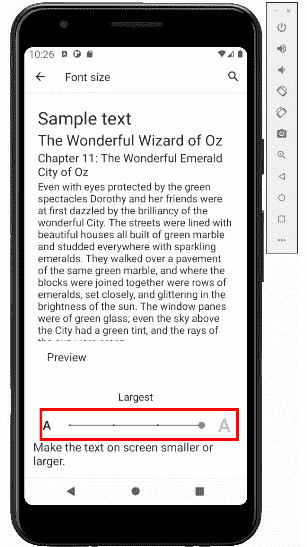
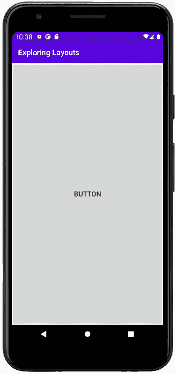
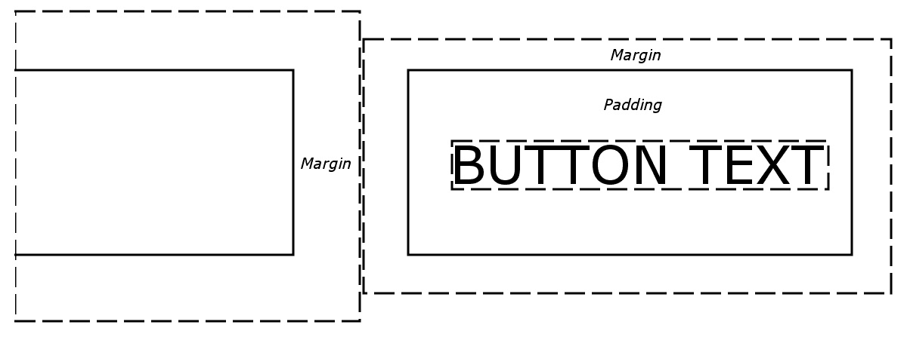
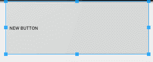
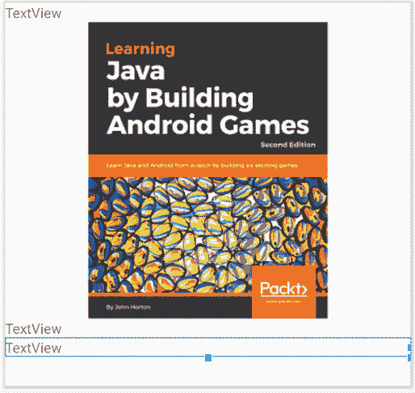
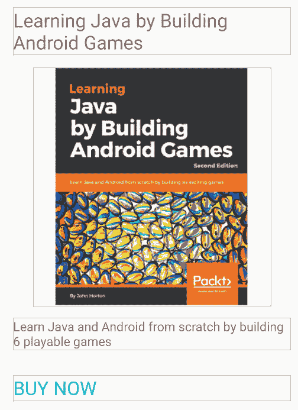
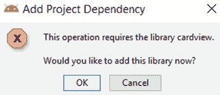
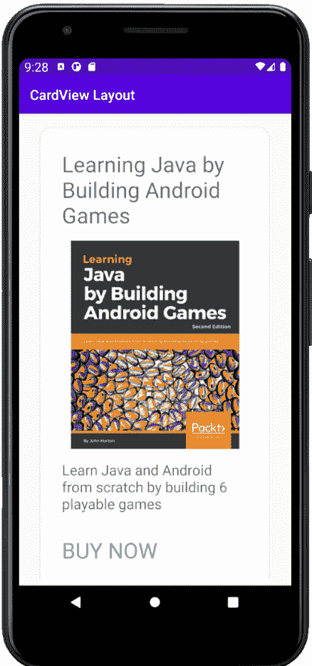
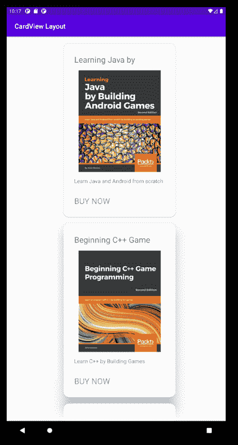

# 第五章：*第五章*：使用 CardView 和 ScrollView 创建美丽的布局

这是我们在花一些时间更专注于 Java 和面向对象编程之前的最后一个布局章节。我们将正式学习一些我们已经遇到的不同属性，并且我们还将介绍两个更酷的布局：`ScrollView`和`CardView`。最后，我们将在平板模拟器上运行`CardView`项目。

在本章中，我们将涵盖以下内容：

+   UI 属性的快速总结

+   使用`ScrollView`和`CardView`构建我们迄今为止最整洁的布局

+   创建和使用平板模拟器

让我们首先回顾一些属性。

# 技术要求

您可以在 GitHub 上找到本章的代码文件[`github.com/PacktPublishing/Android-Programming-for-Beginners-Third-Edition/tree/main/chapter%2005`](https://github.com/PacktPublishing/Android-Programming-for-Beginners-Third-Edition/tree/main/chapter%2005)。

# 属性快速总结

在过去的几章中，我们使用和讨论了相当多不同的属性。我认为快速总结和进一步调查一些更常见的属性是值得的。

## 使用 dp 进行调整

众所周知，有成千上万种不同的安卓设备。为了尝试在不同设备上使用一种通用的测量系统，安卓使用**密度无关**的**像素**，或者**dp**，作为测量单位。其工作原理是首先计算应用程序运行设备上的像素密度。

重要提示

我们可以通过将屏幕的水平分辨率除以屏幕的水平尺寸（以英寸为单位）来计算密度。这一切都是在我们的应用程序运行的设备上实时完成的。

我们只需在设置小部件的各种属性的大小时，使用`dp`和一个数字。使用密度无关的测量单位，我们可以设计布局，使其在尽可能多的不同屏幕上呈现统一的外观。

那么，这是否意味着问题解决了？我们只需在所有地方使用`dp`，我们的布局就能在任何地方工作？不幸的是，密度无关只是解决方案的一部分。在本书的其余部分中，我们将看到如何使我们的应用程序在各种不同的屏幕上呈现出色。

例如，我们可以通过向其属性添加以下代码来影响小部件的高度和宽度：

```kt
...
android:height="50dp"
android:width="150dp"
...
```

或者，我们可以使用属性窗口，并通过适当的编辑框的舒适性添加它们。

我们还可以使用相同的`dp`单位来设置其他属性，例如边距和填充。我们将在一分钟内更仔细地研究边距和填充。

## 使用 sp 调整字体大小

另一种用于调整安卓字体大小的设备相关测量单位是`sp`，该测量单位用于字体，并且与`dp`的像素密度相关方式完全相同。

安卓设备在决定您的字体大小时将使用额外的计算，这取决于您使用的`sp`值，即用户自己的字体大小设置。因此，如果您在具有正常字体大小的设备和模拟器上测试应用程序，那么视力受损的用户（或者只是喜欢大字体的用户）并且将字体设置为大号的用户将看到与您在测试期间看到的内容不同。

如果您想尝试调整安卓设备的字体大小设置，可以在模拟器或真实设备上选择**设置** | **显示** | **高级** | **字体大小**，然后尝试调整下面截图中突出显示的滑块：



图 5.1 – 使用 sp 调整字体大小

我们可以在任何具有文本的小部件中使用`sp`来设置字体大小。这包括`Button`、`TextView`和所有`textSize`属性下的 UI 元素，如下所示：

```kt
android:textSize="50sp"
```

和往常一样，我们也可以使用属性窗口来实现相同的效果。

## 使用 wrap 或 match 确定大小

我们还可以决定 UI 元素的大小，以及许多其他 UI 元素，相对于包含/父元素的行为。我们可以通过将`layoutWidth`和`layoutHeight`属性设置为`wrap_content`或`match_parent`来实现。

例如，假设我们将布局上孤立的按钮的属性设置为以下内容：

```kt
...
android:layout_width="match_parent"
android:layout_height="match_parent"
....
```

然后，按钮将在高度和宽度上都扩展以**匹配****父级**。我们可以看到下一个截图中的按钮填满了整个屏幕：

重要提示

我在项目中的上一章中添加了一个新布局上的按钮。



图 5.2 - 按钮在高度和宽度上扩展以匹配父级

更常见的是按钮的`wrap_content`，如下所示：

```kt
....
android:layout_width="wrap_content"
android:layout_height="wrap_content"
....
```

这会导致按钮的大小与它需要的一样大（以`dp`为单位，文本以`sp`为单位）。

## 使用填充和边距

如果你曾经做过任何网页设计，那么你一定对接下来的两个属性非常熟悉。**填充**是从小部件的边缘到小部件内容的开始的空间。**边距**是留在小部件外部的空间，留在其他小部件之间 - 包括其他小部件的边距，如果它们有的话。这里有一个可视化表示：



图 5.3 - 使用填充和边距

我们可以简单地为所有边设置填充和边距，就像这样：

```kt
...
android:layout_margin="43dp"
android:padding="10dp"
...
```

看一下边距和填充的命名约定略有不同。填充只是称为`padding`，但边距被称为`layout_margin`。这反映了填充只影响 UI 元素本身，但边距可以影响布局中的其他小部件。

或者，我们可以指定不同的顶部、底部、左侧和右侧边距和填充，就像这样：

```kt
android:layout_marginTop="43dp"
android:layout_marginBottom="43dp"
android:paddingLeft="5dp"
android:paddingRight="5dp"
```

为小部件指定边距和填充值是可选的，如果没有指定任何值，将假定为 0。我们还可以选择指定一些不同边的边距和填充，但不指定其他边，就像前面的例子一样。

很明显，我们设计布局的方式非常灵活，但要精确地实现这么多选项，需要一些练习。我们甚至可以指定负边距值来创建重叠的小部件。

让我们看看一些其他属性，然后我们将继续玩一个时尚布局 - `CardView`。

## 使用`layout_weight`属性

重量是相对于其他 UI 元素的相对量。因此，为了使`layout_weight`有用，我们需要在两个或更多元素上为`layout_weight`属性分配一个值。

然后，我们可以分配总共加起来为 100%的部分。这对于在 UI 的各个部分之间划分屏幕空间特别有用，我们希望它们占用的相对空间在屏幕大小不同的情况下保持不变。

使用`layout_weight`与`sp`和`dp`单位结合使用可以创建一个简单而灵活的布局。例如，看看这段代码：

```kt
<Button
        android:layout_width="match_parent"
        android:layout_height="0dp"
        android:layout_weight=".1"
        android:text="one tenth" />
<Button
        android:layout_width="match_parent"
        android:layout_height="0dp"
        android:layout_weight=".2"
        android:text="two tenths" />
<Button
        android:layout_width="match_parent"
        android:layout_height="0dp"
        android:layout_weight=".3"
        android:text="three tenths" />
<Button
        android:layout_width="match_parent"
        android:layout_height="0dp"
        android:layout_weight=".4"
        android:text="four tenths" />
```

这段代码将做什么：


图 5.4 - 使用 layout_weight 属性的 UI

请注意，所有的`layout_height`属性都设置为`0dp`。实际上，`layout_weight`正在替换`layout_height`属性。我们使用`layout_weight`的上下文很重要，否则它不起作用。还要注意，我们不必使用 1 的分数；我们可以使用整数、百分比或任何其他数字；只要它们相对于彼此，它们可能会实现你想要的效果。请注意，`layout_weight`只在某些上下文中起作用。

## 使用重力

**重力**可以成为我们的朋友，并且可以在布局中以许多方式使用。就像太阳系中的重力一样，它通过将物品朝着给定方向移动来影响物品的位置，就好像它们受到重力的影响一样。了解重力的最佳方法是查看一些示例代码和图片，看看重力能做什么。

假设我们将按钮（或另一个小部件）的`gravity`属性设置为`left|center_vertical`，就像这样：

```kt
android:gravity="left|center_vertical"
```

这将产生以下效果：



图 5.5 - 在小部件上设置重力属性

请注意，小部件的内容（在本例中为按钮的文本）确实左对齐并垂直居中。

此外，小部件可以使用`layout_gravity`元素影响其在布局元素中的位置，就像这样：

```kt
android:layout_gravity="left"
```

这将如预期地设置小部件在其布局中，就像这样：


图 5.6 - 将重力布局设置为左

先前的代码允许同一布局中的不同小部件受到影响，就好像布局具有多个不同的重力。

通过使用与小部件相同的代码，可以通过其父布局的`gravity`属性影响布局中所有小部件的内容：

```kt
android:gravity="left"
```

实际上，有许多属性超出了我们讨论的范围。我们在本书中不需要的很多属性，有些相当晦涩，你可能在整个 Android 职业生涯中都用不到它们。但其他一些是相当常用的，例如`background`、`textColor`、`alignment`、`typeface`、`visibility`和`shadowColor`。让我们现在探索一些更多的属性和布局。

# 使用 CardView 和 ScrollView 构建 UI

以通常的方式创建一个新项目，并选择`CardView Layout`。

我们将在`ScrollView`布局中设计我们的`CardView`杰作，正如其名称所示，它允许用户滚动布局的内容。

展开项目资源管理器窗口中的文件夹，以便您可以看到`res`文件夹。展开`res`文件夹以查看`layout`文件夹。

右键单击**layout**文件夹，然后选择**New**。请注意，有一个**Layout resource file**选项。选择**Layout resource file**，然后您将看到**New Resource File**对话框窗口。

在`main_layout`中。名称是任意的，但这个布局将是我们的主要布局，所以名称表明了这一点。

请注意它被设置为`ScrollView`。这种布局类型似乎与`LinearLayout`的工作方式完全相同；不同之处在于，当屏幕上有太多内容要显示时，它将允许用户通过用手指滑动来滚动内容。

在名为`main_layout`的 XML 文件中单击`ScrollView`，并将其放置在`layout`文件夹中，以便我们构建基于`CardView`的 UI。

Android Studio 将打开 UI 设计器，准备就绪。

## 使用 Java 代码设置视图

与以前一样，我们现在将通过在`MainActivity.java`文件中调用`setContentView`方法来加载`main_layout.xml`文件作为我们应用的布局。

选择`app/java/your_package_name`，其中`your_package_name`等于创建项目时自动生成的包名称。

修改`onCreate`方法中的代码，使其与下一个代码完全相同。我已经突出显示了您需要添加的行：

```kt
@Override
protected void onCreate(Bundle savedInstanceState) {
   super.onCreate(savedInstanceState);

   setContentView(R.layout.main_layout);
}
```

现在您可以运行应用程序，但除了一个空的`ScrollView`之外，什么也看不到。

## 添加图像资源

我们将需要一些图片来完成这个项目。这样我们就可以演示如何将它们添加到项目中（本节）并在`CardView`小部件中整齐地显示和格式化它们（下一节）。

你从哪里获取图片并不重要；这个练习的目的是实际的动手经验。为了避免版权和版税问题，我将使用一些来自 Packt Publishing 网站的书籍图片。这也使我能够为您提供完成项目所需的所有资源，并且应该减轻您获取自己的图片的麻烦。请随意在*第五章*`/res/drawable`文件夹中更换图片。

有三张图片：`image_1.png`，`image_2.png`和`image_3.png`。要将它们添加到项目中，请按照以下步骤进行：

1.  使用您操作系统的文件浏览器找到图片文件。

1.  将它们全部高亮显示，然后按*Ctrl* + *C*进行复制。

1.  在 Android Studio 项目资源管理器中，通过左键单击选择**res/drawable**文件夹。

1.  右键单击**drawable**文件夹，然后选择**粘贴**。

1.  在弹出窗口中询问`drawable`文件夹。

1.  再次单击**确定**以**复制指定文件**。

现在你应该能够在`drawable`文件夹中看到你的图片，以及 Android Studio 在项目创建时放置在那里的一些其他文件，如下一个截图所示：


图 5.7 - 扩展 drawable 文件夹

在我们继续讨论`CardView`小部件本身之前，让我们设计一下我们将放在卡片中的内容。

## 创建卡片的内容

我们需要做的下一件事是创建卡片的内容。将内容与布局分开是有意义的。我们将创建三个单独的布局，称为`card_contents_1`，`card_contents_2`和`card_contents_3`。它们将分别包含一个`LinearLayout`，其中将包含一张图片和一些文本。

让我们创建另外三个带有`LinearLayout`布局的布局：

1.  右键单击**layout**文件夹，然后选择**新建布局资源文件**。

1.  将文件命名为`card_contents_1`，并将**…ConstraintLayout**更改为**LinearLayout**作为根元素。

1.  点击`layout`文件夹。

1.  重复*步骤 1*到*3*两次，每次将文件名更改为`card_contents_2`，然后是`card_contents_3`。

现在，选择`sp`、`dp`和`gravity`属性使它们看起来漂亮：

1.  将一个`TextView`拖到布局的顶部。

1.  在`TextView`下方的布局中拖动一个`ImageView`。

1.  在**资源**弹出窗口中，选择**项目** | **image_1**，然后单击**确定**。

1.  在图片下面拖动另外两个`TextView`。

现在你的布局应该是这样的：



图 5.8 - 通过添加 sp、dp 和 gravity 属性使布局看起来更漂亮

现在让我们使用一些 Material Design 指南使布局看起来更吸引人：

重要提示

当您进行这些修改时，底部布局中的 UI 元素可能会消失在设计视图的底部。如果这种情况发生在您身上，请记住您可以随时从**组件树**窗口下面的调色板中选择任何 UI 元素。

1.  为顶部的`TextView`小部件设置`textSize`属性为`24sp`。

1.  在顶部的`TextView`小部件上继续工作，将`16dp`。

1.  将`text`属性设置为`Learning Java by Building Android Games`（或者适合你的图片的标题）。

1.  在`ImageView`小部件上，将`layout_width`和`layout_height`属性设置为`wrap_content`。

1.  在继续使用`ImageView`小部件时，将`layout_gravity`属性设置为`center_horizontal`。

1.  在`ImageView`小部件下方的`TextView`上，将`textSize`设置为`16sp`。

1.  在相同的`TextView`小部件上，设置`16dp`。

1.  在相同的`TextView`小部件上，将`text`属性设置为`Learn Java` `and Android from scratch by building 6 playable games`（或者描述你的图片的内容）。

1.  在底部的`TextView`小部件上，将`text`属性更改为`BUY NOW`。

1.  在相同的`TextView`小部件上，将`16dp`设置为。

1.  在相同的`TextView`小部件上，将`textSize`属性设置为`24sp`。

1.  在相同的`TextView`小部件上，将`textColor`属性设置为`@color/` `teal_200`。

1.  在包含所有其他元素的`LinearLayout`布局上，设置为`15dp`。请注意，从**组件树**窗口中选择`LinearLayout`最容易。

此时，您的布局将看起来与以下截图非常相似：



图 5.9-使用一些 Material Design 指南增强布局的吸引力

现在使用完全相同的尺寸和颜色布局其他两个文件（`card_contents_2`和`card_contents_3`）。当您获得`image_2`和`image_3`时，也要相应地更改前两个`TextView`元素上的所有`text`属性，以使标题和描述是唯一的。标题和描述并不重要；我们要学习的是布局和外观。

注意

请注意，所有尺寸和颜色都来自 Material Design 网站：[`material.io/design/introduction`](https://material.io/design/introduction)和 Android 特定的 UI 指南：[`developer.android.com/guide/topics/ui/look-and-feel`](https://developer.android.com/guide/topics/ui/look-and-feel)。在完成本书后，这些都值得学习。

现在我们可以继续进行`CardView`小部件。

## 为 CardView 定义尺寸

右键单击`dimens`（缩写为尺寸）并单击`dimens.xml`。我们将使用这个文件通过引用它们来创建一些`CardView`将使用的常见值。

为了实现这一点，我们将直接在`dimens.xml`文件中编辑 XML，使其与以下代码相同：

```kt
<?xml version="1.0" encoding="utf-8"?>
<resources>
    <dimen name="card_corner_radius">16dp</dimen>
    <dimen name="card_margin">10dp</dimen>
</resources>
```

一定要确保它与原来完全相同，因为一个小的遗漏可能会导致错误并阻止项目工作。

我们定义了两个资源，第一个称为`card_corner_radius`，值为`16dp`，第二个称为`card_margin`，值为`10dp`。

我们将从`main_layout`文件中引用这些资源，并使用它们来一致地配置我们的三个`CardView`元素。

## 将 CardView 添加到我们的布局

切换到将滚动我们应用程序内容的`ScrollView`，有点像 Web 浏览器滚动不适合一个屏幕的网页内容。

`ScrollView`有一个限制-它只能有一个直接子布局。我们希望它包含三个`CardView`小部件。

为了解决这个问题，从调色板的`布局`类别中拖动一个`LinearLayout`布局。一定要选择**LinearLayout (vertical)**，如调色板中的图标所示：


图 5.10-LinearLayout (vertical)图标

我们将把三个`CardView`放在`LinearLayout`中，然后整个内容将平稳滚动，没有任何错误。

`CardView`小部件可以在`CardView`中找到。

将`CardView`拖放到设计中的`LinearLayout`上，您可能会收到 Android Studio 中的弹出消息，也可能不会。这是消息：



图 5.11-要求添加 CardView 的弹出窗口

如果您收到此消息，请单击`CardView`功能以将其添加到否则不会具有这些功能的较旧版本的 Android。

现在您的设计中应该有一个`CardView`。在其中有内容之前，`CardView`只能在**组件树**窗口中轻松可见。

通过**组件树**选择`CardView`并配置以下属性：

1.  将`layout_width`设置为`wrap_content`。

1.  将`layout_gravity`设置为`center`。

1.  设置`@dimen/card_margin`以使用我们在`dimens.xml`文件中定义的边距值。

1.  将`cardCornerRadius`属性设置为`@dimen/card_corner_radius`，以使用我们在`dimens.xml`文件中定义的半径值。

1.  将`cardElevation`设置为`2dp`。

现在切换到**代码**选项卡，您会发现您有以下代码：

```kt
<androidx.cardview.widget.CardView
   android:layout_width="wrap_content"
   android:layout_height="match_parent"
   android:layout_gravity="center"
   android:layout_margin="@dimen/card_margin"
   app:cardCornerRadius="@dimen/card_corner_radius"
   app:cardElevation="2dp" />
```

前面的代码列表仅显示了`CardView`的代码。

目前的问题是我们的`CardView`是空的。让我们通过添加`card_contents_1.xml`的内容来解决这个问题。以下是如何做到这一点。

### 在另一个布局文件中包含布局文件

我们需要稍微编辑代码，原因如下。我们需要向代码添加一个`include`元素。`include`元素是将从`card_contents_1.xml`布局中插入内容的代码。问题在于，要添加这段代码，我们需要稍微改变`CardView` XML 的格式。当前的格式以一个单一标签开始和结束`CardView`，如下所示：

```kt
<androidx.cardview.widget.CardView
…
…/>
```

我们需要将格式更改为像这样的单独的开放和关闭标签（暂时不要更改任何内容）：

```kt
<androidx.cardview.widget.CardView
…
…
</androidx.cardview.widget.CardView>
```

这种格式的改变将使我们能够添加`include…`代码，我们的第一个`CardView`小部件将完成。考虑到这一点，编辑`CardView`的代码，确保与以下代码完全相同。我已经突出显示了两行新代码，但请注意，`cardElevation`属性后面的斜杠也已经被移除：

```kt
<androidx.cardview.widget.CardView
   android:layout_width="wrap_content"
   android:layout_height="match_parent"
   android:layout_gravity="center"
   android:layout_margin="@dimen/card_margin"
   app:cardCornerRadius="@dimen/card_corner_radius"
   app:cardElevation="2dp" >
             <include layout="@layout/card_contents_1" />
</androidx.cardview.widget.CardView>
```

现在您可以在可视化设计器中查看`main_layout`文件，并查看`CardView`元素内部的布局。然而，可视化设计器并不能展示`CardView`的真正美感。不过很快我们将会在完成的应用程序中看到所有`CardView`小部件一起滚动得很好。以下是模拟器中屏幕的截图，显示了我们目前的进展：



图 5.12 - CardView 元素内部的布局

在布局中添加另外两个`CardView`小部件，并将它们配置与第一个相同，只有一个例外。在第二个`CardView`上，将`cardElevation`设置为`22dp`，在第三个`CardView`上，将`cardElevation`设置为`42dp`。将`include`代码更改为分别引用`card_contents_2`和`card_contents_3`。

提示

您可以通过复制和粘贴`CardView` XML 并简单地修改高程和`include`代码来快速完成这一步，就像前面段落中提到的那样。

当完成后，`LinearLayout`代码中的`CardView`相关代码如下所示：

```kt
<androidx.cardview.widget.CardView
     android:layout_width="wrap_content"
     android:layout_height="match_parent"
     android:layout_gravity="center"
     android:layout_margin="@dimen/card_margin"
     app:cardCornerRadius="@dimen/card_corner_radius"
     app:cardElevation="2dp" >
     <include layout="@layout/card_contents_1" />
</androidx.cardview.widget.CardView>
<androidx.cardview.widget.CardView
     android:layout_width="wrap_content"
     android:layout_height="match_parent"
     android:layout_gravity="center"
     android:layout_margin="@dimen/card_margin"
     app:cardCornerRadius="@dimen/card_corner_radius"
     app:cardElevation="22dp" >
     <include layout="@layout/card_contents_2" />
</androidx.cardview.widget.CardView>
<androidx.cardview.widget.CardView
     android:layout_width="wrap_content"
     android:layout_height="match_parent"
     android:layout_gravity="center"
     android:layout_margin="@dimen/card_margin"
     app:cardCornerRadius="@dimen/card_corner_radius"
     app:cardElevation="42dp" >
     <include layout="@layout/card_contents_3" />
</androidx.cardview.widget.CardView>
```

现在我们可以运行应用程序，看到我们三个美丽的、凸起的`CardView`小部件在其中的效果。在下一个截图中，我已经捕捉到了它，这样您就可以看到提升设置对创建令人愉悦的深度和阴影效果的影响：


图 5.13 - 令人愉悦的深度和阴影效果

重要提示

黑白打印版本的截图可能会稍微不清晰。请务必自行构建和运行应用程序，以查看这个酷炫的效果。

让我们在平板电脑模拟器上探索我们的最新应用程序。

# 创建平板电脑模拟器

我们经常希望在多个不同的设备上测试我们的应用程序。幸运的是，Android Studio 可以轻松地创建任意数量的不同模拟器。按照以下步骤创建平板电脑模拟器。

选择**工具** | **AVD 管理器**，然后单击**创建虚拟设备...**按钮。您将看到下图所示的**选择硬件**窗口：


图 5.14 - 选择硬件窗口

从**类别**列表中选择**平板电脑**选项，然后从可用平板电脑中选择**Pixel C**平板电脑。

提示

如果您是在将来的某个时候阅读本文，Pixel C 选项可能已经更新。选择平板电脑的重要性不如练习创建平板电脑模拟器并测试我们的应用程序重要。

点击**下一步**按钮。在随后的**系统镜像**窗口上，只需点击**下一步**，因为这将选择默认系统镜像。选择自己的镜像可能会导致模拟器无法正常工作。

最后，在**Android 虚拟设备**屏幕上，您可以保留所有默认选项。如果需要，可以更改您的模拟器的**AVD 名称**选项或**启动方向**（纵向或横向）选项。当您准备好时，点击**完成**按钮。

如果您正在运行手机模拟器，请将其关闭。现在，每当您从 Android Studio 运行您的应用程序时，您将有选择 Pixel C（或您创建的任何平板电脑）的选项。这是我 Pixel C 模拟器运行`CardView`应用程序的屏幕截图：



图 5.15 - Pixel C 模拟器运行 CardView 应用程序

不算太糟，但浪费了相当多的空间，看起来有点奇怪。让我们尝试在横向模式下。如果您尝试在平板电脑横向模式下运行应用程序，结果会更糟。我们可以从中学到的是，我们将不得不为不同尺寸的屏幕和不同方向设计我们的布局。有时它们将是智能设计，可以根据不同的尺寸或方向进行调整，但通常它们将是完全不同的设计，存在于不同的布局文件中。

# 常见问题

1.  我需要精通关于 Material Design 的所有这些东西吗？

不，除非您想成为专业设计师。如果您只是想制作自己的应用程序并在 Play 商店上出售或赠送它们，那么只知道基础知识就足够了。

# 总结

在本章中，我们构建了外观美观的`CardView`布局，并将它们放在`ScrollView`中，这样用户就可以通过滑动浏览布局的内容，有点像浏览网页。为了完成本章，我们启动了一个平板模拟器，并看到如果我们想要适应不同的设备尺寸和方向，我们需要在设计布局方面变得聪明起来。在*第二十四章**，设计模式、多个布局和片段*中，我们将开始将我们的布局提升到下一个水平，并学习如何使用片段来处理如此多样的设备。

然而，在我们开始之前，学习更多关于 Java 以及如何使用它来控制我们的 UI 和与用户交互将对我们有所帮助。这将是接下来七章的重点。

当然，目前的悬而未决的问题是，尽管我们学到了很多关于布局、项目结构、Java 和 XML 之间的连接以及其他许多知识，但是我们的 UI，无论多么漂亮，实际上并没有做任何事情！我们需要认真提升我们的 Java 技能，同时学习如何在 Android 环境中应用它们。在下一章中，我们将做到这一点。我们将看到如何添加 Java 代码，以便在我们需要的时候精确执行，通过与**Android Activity 生命周期**一起工作。
