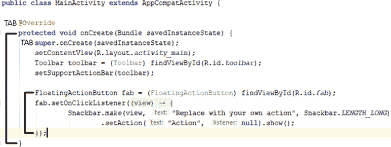
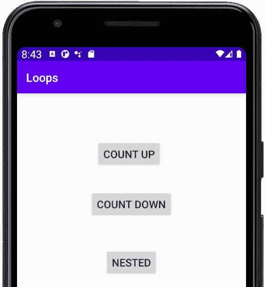

# 第八章：*第八章*：Java 决策和循环

我们刚刚学习了关于变量，我们知道如何使用表达式更改它们所持有的值，但是我们如何根据变量的值采取行动呢？

我们当然可以将新消息的数量添加到先前未读消息的数量中，但是例如，当用户已读完所有消息时，我们该如何触发应用程序内的操作呢？

第一个问题是我们需要一种方法来测试变量的值，然后在值落在一系列值范围内或是特定值时做出响应。

编程的一个常见问题是，我们需要根据变量的值执行代码的某些部分一定次数（不止一次或有时根本不执行），这取决于变量的值。

为了解决第一个问题，我们将学习如何使用`if`、`else`和`switch`在 Java 中做出决定。为了解决后者，我们将学习如何使用`while`、`do while`、`for`和`break`在 Java 中进行循环。

在本章中，我们将涵盖以下内容：

+   使用`if`、`else`、`else if`和`switch`做出决策

+   `switch`演示应用程序

+   Java 的`while`循环和`do while`循环

+   Java 的`for`循环

+   循环演示应用程序

让我们学习更多的 Java 知识。

# 技术要求

您可以在 GitHub 上找到本章中的代码文件[`github.com/PacktPublishing/Android-Programming-for-Beginners-Third-Edition/tree/main/chapter%2008`](https://github.com/PacktPublishing/Android-Programming-for-Beginners-Third-Edition/tree/main/chapter%2008)。

# 在 Java 中做出决策

我们的 Java 代码将不断做出决定。例如，我们可能需要知道用户是否有新消息，或者是否有一定数量的朋友。我们需要能够测试我们的变量，以查看它们是否满足某些条件，然后根据它们是否满足条件来执行一定的代码部分。

在本节中，随着我们的代码变得更加复杂，有助于以更易读的方式呈现它。让我们看看代码缩进，以使我们对决策的讨论更加容易。

## 为了清晰起见缩进代码

您可能已经注意到我们项目中的 Java 代码是缩进的。例如，在`MainActivity`类内的第一行代码被缩进了一个制表符。此外，每个方法内的第一行代码也被缩进。这里有一个带注释的屏幕截图，以便更清楚地说明这一点，另外一个快速的例子：



图 8.1 – 缩进的 Java 代码

还要注意，当缩进块结束时，通常是用一个闭合大括号`}`，`}`的缩进程度与开始块的代码行相同。

我们这样做是为了使代码更易读。但是，这并不是 Java 语法的一部分，如果我们不这样做，代码仍将编译。

随着我们的代码变得更加复杂，缩进和注释有助于保持代码的含义和结构清晰。我现在提到这一点是因为当我们开始学习在 Java 中做出决定的语法时，缩进变得特别有用，建议您以相同的方式缩进代码。

大部分缩进是由 Android Studio 为我们完成的，但并非全部。

现在我们知道如何更清晰地呈现我们的代码，让我们学习一些更多的运算符，然后我们可以真正开始使用 Java 做出决定。

## 更多运算符

我们已经可以使用运算符进行加（+）、减（-）、乘（*）、除（/）、赋值（=）、增量（++）和减量（--）。让我们介绍一些更有用的运算符，然后我们将直接了解如何在 Java 中使用它们。

重要提示

不要担心记住每个后面的运算符。浏览它们和它们的解释，然后快速转到下一节。在那里，我们将使用一些运算符，当我们看到它们允许我们做一些例子时，它们将变得更清晰。它们在这里以列表的形式呈现，这样在不与后面的实现讨论混在一起时更方便参考。

我们使用运算符创建一个表达式，这个表达式要么为真，要么为假。我们用括号括起来，就像这样：`(表达式在这里)`

### 比较运算符

这是比较运算符，用于测试是否相等；它要么为真，要么为假：`==`

例如，表达式`(10 == 9)`是假的。10 显然不等于 9。然而，表达式`(2 + 2 == 4)`显然是真的。

注意

除了《1984》中 2 + 2 == 5 ([`en.wikipedia.org/wiki/Nineteen_Eighty-Four`](https://en.wikipedia.org/wiki/Nineteen_Eighty-Four))。

### 逻辑 NOT 运算符

这是逻辑 NOT 运算符：`!`

它用于测试表达式的否定。否定意味着如果表达式为假，那么 NOT 运算符会使表达式为真。举个例子会有所帮助。

表达式`(!(2 + 2 == 5))`计算为真，因为 2 + 2 *不是*5。但进一步的例子`(!(2 + 2 = 4))`将是假的。这是因为 2 + 2 显然*是*4。

### 不等运算符

这是不等运算符，是另一个比较运算符：`!=`

不等运算符测试是否不相等。例如，表达式`(10 != 9)`是真的。10 不等于 9。另一方面，`(10 != 10)`是假的，因为 10 显然等于 10。

### 大于运算符

另一个比较运算符（还有一些其他的）是大于运算符。它是这样的：`>`

这个运算符测试是否一个值大于另一个值。表达式`(10 > 9)`是真的，但表达式`(9 > 10)`是假的。

### 小于运算符

你可能猜到了，这个运算符测试值是否小于其他值。这就是这个运算符的样子：`<`

表达式`(10 < 9)`是假的，因为 10 不小于 9，而表达式`(9 < 10)`是真的。

### 大于或等于运算符

这个运算符测试一个值是否大于或等于另一个值，如果其中一个为真，结果就为真。这就是这个运算符的样子：`>=`

例如，表达式`(10 >= 9)`是真的，表达式`(10 >= 10)`也是真的，但表达式`(10 >= 11)`是假的，因为 10 既不大于也不等于 11。

### 小于或等于运算符

与前一个运算符类似，这个运算符测试两个条件，但这次是小于或等于。看看下面显示的运算符，然后我们将看一些例子：`<=`

表达式`(10 <= 9)`是假的，表达式`(10 <= 10)`是真的，表达式`(10 <= 11)`也是真的。

### 逻辑 AND 运算符

这个运算符被称为逻辑 AND。它测试表达式的两个或多个单独部分，所有部分必须为真，整个表达式才为真：`&&`

逻辑 AND 通常与其他运算符一起使用，构建更复杂的测试。表达式`((10 > 9) && (10 < 11))`是真的，因为两个部分都为真。另一方面，表达式`((10 > 9) && (10 < 9))`是假的，因为表达式的一个部分为真`(10 > 9)`，另一个部分为假`(10 < 9)`。

### 逻辑 OR 运算符

这个运算符称为逻辑 OR，它与逻辑 AND 类似，只是表达式的两个或多个部分中只有一个为真，表达式才为真：`||`

让我们看一下我们用于逻辑 AND 的最后一个例子，但将`&&`换成`||`。表达式`((10 > 9) || (10 < 9))`现在是真的，因为表达式的至少一个部分是真的。

### 模数运算符

这个运算符叫做模数（`%`）。它返回两个数字相除后的余数。例如，表达式`(16 % 3 > 0)`是真的，因为 16 除以 3 是 5 余 1，而 1 当然大于 0。

在本章和本书的其余部分中，以更实际的情境看到这些运算符将有助于澄清不同的用途。现在我们知道如何使用运算符，变量和值来形成表达式。接下来，我们可以看一种结构化和组合表达式的方法来做出一些深刻的决定。

## 如何使用所有这些运算符来测试变量

所有这些运算符在没有适当使用它们来影响真实变量和代码的真实决策的方法的情况下几乎是无用的。

现在我们有了所有需要的信息，我们可以看一个假设的情况，然后实际看到一些决策的代码。

### 使用 Java 的 if 关键字

正如我们所看到的，运算符单独使用几乎没有什么意义，但可能有用的是看到我们可以使用的广泛和多样的范围的一部分。现在，当我们开始使用最常见的运算符`==`时，我们可以开始看到运算符提供给我们的强大而精细的控制。

让我们把之前的例子变得不那么抽象。见识一下 Java 的`if`关键字。我们将使用`if`和一些条件运算符以及一个小故事来演示它们的用法。接下来是一个虚构的军事情况，希望它会比之前的例子更具体。

船长快要死了，知道他剩下的下属经验不是很丰富，他决定写一个 Java 程序，在他死后传达他的最后命令。部队必须守住桥的一侧，等待增援 - 但有一些规则来决定他们的行动。

船长想要确保他的部队理解的第一个命令是：

**如果他们过桥，就射击他们。**

那么，我们如何在 Java 中模拟这种情况呢？我们需要一个布尔变量，`isComingOverBridge`。下一段代码假设`isComingOverBridge`变量已经被声明并初始化为`true`或`false`。

然后我们可以这样使用`if`：

```kt
if(isComingOverBridge){

   // Shoot them

}
```

如果`isComingOverBridge`布尔值为`true`，则在大括号内的代码将执行。如果`isComingOverBridge`为`false`，程序将在`if`块之后继续执行，而不运行其中的代码。

**否则，做这个**

船长还想告诉他的部队，如果敌人没有过桥，他们应该留在原地等待。

现在我们介绍另一个 Java 关键字，`else`。当我们想要在`if`不为真时明确执行某些操作时，我们可以使用`else`。

例如，要告诉部队如果敌人没有过桥就待在原地，我们可以写这段代码：

```kt
if(isComingOverBridge){

   // Shoot them
}else{

   // Hold position
}
```

船长随后意识到问题并不像他最初想的那么简单。如果敌人过桥，但部队太多怎么办？他的小队将被压垮和屠杀。

所以，他想出了这段代码（这次我们也会使用一些变量）：

```kt
boolean isComingOverBridge;
int enemyTroops;
int friendlyTroops;
// Code that initializes the above variables one way or another
// Now the if
if(isComingOverBridge && friendlyTroops > enemyTroops){
   // shoot them
}else if(isComingOveBridge && friendlyTroops < enemyTroops) {
   // blow the bridge
}else{
   // Hold position
}
```

前面的代码有三条可能的执行路径。第一种情况是如果敌人正在过桥，友军人数更多：

```kt
if(isComingOverBridge && friendlyTroops > enemyTroops)
```

第二种情况是如果敌军正在过桥，但超过了友军的人数：

```kt
else if(isComingOveBridge && friendlyTroops < enemyTroops)
```

然后，如果其他两种情况都不成立，将执行第三种可能的结果，由最终的`else`捕获，没有`if`条件。

读者挑战

您能发现上述代码的一个缺陷吗？这可能会让一群经验不足的部队陷入彻底的混乱？敌军和友军的数量恰好相等的可能性没有得到明确处理，因此将由最终的`else`处理，这是指当没有敌军时。我猜任何自尊的船长都会期望他的部队在这种情况下进行战斗，他可以改变第一个`if`语句以适应这种可能性：

`if(isComingOverBridge && friendlyTroops >= enemyTroops)`

最后，船长最后关心的是，如果敌人挥舞着白旗过桥，然后被迅速屠杀，那么他的士兵最终会成为战争罪犯。所需的 Java 代码是显而易见的。使用`wavingWhiteFlag`布尔变量，他编写了这个测试：

```kt
if (wavingWhiteFlag){
   // Take prisoners
}
```

但是，放置这段代码的位置不太清楚。最后，船长选择了以下嵌套解决方案，并将`wavingWhiteFlag`的测试更改为逻辑非，就像这样：

```kt
if (!wavingWhiteFlag){
   // not surrendering so check everything else

   if(isComingOverTheBridge && friendlyTroops >= 
      enemyTroops){
          // shoot them
   }else if(isComingOverTheBridge && friendlyTroops < 
                enemyTroops) {
         // blow the bridge
   }
}else{

   // this is the else for our first if
   // Take prisoners
{
// Holding position
```

这表明我们可以嵌套`if`和`else`语句，以创建相当深入和详细的决定。

我们可以继续使用`if`和`else`做出更复杂的决定，但是我们已经看到的已经足够作为介绍了。

值得指出的是，很多时候解决问题有多种方法。*正确*的方法通常是以最清晰和最简单的方式解决问题的方法。

让我们看看在 Java 中做出决定的其他方法，然后我们可以将它们全部放在一个应用程序中。

# 切换以做出决定

我们已经看到了结合 Java 运算符与`if`和`else`语句的广泛且几乎无限的可能性。但有时，在 Java 中做出决定可能有其他更好的方法。

当我们根据一系列清晰的可能性做出决定时，不涉及复杂的组合，通常使用`switch`是最好的方法。

我们开始一个`switch`决定就像这样：

```kt
switch(argument){
}
```

在上一个例子中，`argument`可以是一个表达式或一个变量。在花括号`{}`内，我们可以根据`case`和`break`元素对参数做出决定：

```kt
case x:
   // code for case x
   break;
case y:
   // code for case y
   break;
```

您可以看到在上一个例子中，每个`case`都陈述了可能的结果，每个`break`都表示该案例的结束，以及不应再评估更多`case`语句的点。

遇到的第一个`break`会跳出`switch`块，继续执行整个`switch`块的结束花括号`}`后的下一行代码。

我们还可以使用没有值的`default`来运行一些代码，以防`case`语句都不为真，就像这样：

```kt
default:// Look no value
   // Do something here if no other case statements are 
      true
   break;
```

让我们编写一个快速演示应用程序，使用`switch`。

## 切换演示应用程序

开始时，创建一个名为`Switch` `Demo`的新 Android 项目，使用上面编辑器中的**MainActivity.java**选项卡左键单击**MainActivity.java**文件，我们就可以开始编码了。

假设我们正在编写一个老式的文字冒险游戏，玩家在游戏中输入命令，比如“向东走”，“向西走”，“拿剑”等等。

在这种情况下，`switch`可以处理这种情况，例如这个示例代码，我们可以使用`default`来处理玩家输入的命令，这些命令没有特别处理。

在`}`之前的`onCreate`方法中输入以下代码：

```kt
// get input from user in a String variable called command
String command = "go east";
switch(command){
   case "go east":
         Log.i("Player: ", "Moves to the East" );
         break;
   case "go west":
         Log.i("Player: ", "Moves to the West" );
         break;
   case "go north":
         Log.i("Player: ", "Moves to the North" );
         break;
   case "go south":
         Log.i("Player: ", "Moves to the South" );
         break;

   case "take sword":
         Log.i("Player: ", "Takes the silver sword" );
         break;
   // more possible cases
   default:
         Log.i("Message: ", "Sorry I don't speak Elfish" );
         break;
}
```

运行应用程序几次。每次，将`command`的初始化更改为新内容。请注意，当您将`command`初始化为`case`语句明确处理的内容时，我们会得到预期的输出。否则，我们会得到默认的**抱歉，我不会说精灵语**消息。

如果我们有很多要执行的`case`代码，我们可以将所有代码都包含在一个方法中-也许就像在下一段代码中一样，我已经突出显示了新的一行：

```kt
   case "go west":
                         goWest();
         break;
```

当然，我们随后需要编写新的`goWest`方法。然后，当`command`初始化为`"go west"`时，`goWest`方法将被执行，当`goWest`完成时，执行将返回到`break`语句，这将导致代码继续执行`switch`块后的内容。

当然，这段代码严重缺乏与 UI 的交互。我们已经看到了如何从按钮点击中调用方法，但即使这样也不足以使这段代码在真正的应用程序中有价值。我们将在第十二章《堆栈、堆和垃圾收集器》中看到我们如何解决这个问题。

我们还有的另一个问题是，代码执行后就结束了！我们需要它不断地询问玩家的指令，不仅仅是一次，而是一遍又一遍。我们将在下一节中解决这个问题。

# 使用循环重复代码

在这里，我们将学习如何通过查看几种类型的`while`循环、`do while`循环和`for`循环，以受控且精确的方式重复执行我们代码的部分。我们还将了解使用不同类型的循环的最合适的情况。

问循环与编程有什么关系是完全合理的。但它们确实如其名所示。它们是一种重复执行代码的方式——或者循环执行相同的代码部分，尽管每次可能有不同的结果。

这可能意味着重复执行相同的操作，直到被循环的代码（if、else 和 switch，循环是 Java 的**控制流语句**的一部分。

当条件为真时执行的代码称为`do while`循环，可以用这个简单的图表来说明：


图 8.2 - 当代码中达到循环时，条件被测试

这个图表说明了当代码中达到循环时，条件被测试。如果条件为真，则执行条件代码。执行条件代码后，再次测试条件。任何时候条件为假，代码继续执行循环后的内容。这可能意味着条件代码从未执行。

我们将研究 Java 提供的所有主要类型的循环，以控制我们的代码，并使用其中一些来实现一个工作迷你应用程序，以确保我们完全理解它们。让我们先看看 Java 中的第一种和最简单的循环类型，称为`while`循环。

## while 循环

Java`while`循环具有最简单的语法。回想一下`if`语句。我们可以在`if`语句的条件表达式中放置几乎任何组合的运算符和变量。如果表达式求值为真，则执行`if`块中的代码。对于`while`循环，我们也使用一个可以求值为真或假的表达式。看看这段代码：

```kt
int x = 10;
while(x > 0){
   x--;
   // x decreases by one each pass through the loop
}
```

这里发生的是：

1.  在`while`循环之外，声明并初始化了一个名为`x`的整数，其值为`10`。

1.  然后，`while`循环开始。它的条件是`x > 0`。因此，`while`循环将执行其循环体中的代码。

1.  其循环体中的代码将继续执行，直到条件求值为假。

因此，先前的代码将执行 10 次。

在第一次通过时，`x = 10`，在第二次通过时它等于`9`，然后是`8`，依此类推。但一旦`x`等于`0`，它当然不再大于 0。此时，程序将退出`while`循环，并继续执行`while`循环后的第一行代码。

就像`if`语句一样，可能`while`循环甚至不执行一次。看看这个例子，其中`while`循环中的代码不会执行：

```kt
int x = 10;
while(x > 10){
   // more code here.
   // but it will never run 
   // unless x is greater than 10.
}
```

此外，条件表达式的复杂程度或循环体中的代码量是没有限制的。这里是另一个例子：

```kt
int newMessages = 3;
int unreadMessages = 0;
while(newMessages > 0 || unreadMessages > 0){
   // Display next message
   // etc.
}
// continue here when newMessages and unreadMessages equal 0
```

前面的`while`循环将继续执行，直到`newMessages`和`unreadMessages`都等于或小于 0。由于条件使用了逻辑或运算符`||`，其中一个条件为真将导致`while`循环继续执行。

值得注意的是，一旦进入循环体，即使表达式在中途评估为 false，循环体也会始终完成，因为直到代码尝试开始另一个循环时才会再次测试。看下面的例子：

```kt
int x = 1;
while(x > 0){
   x--;
   // x is now 0 so the condition is false
   // But this line still runs
   // and this one
   // and me!
}
```

前面的循环体将执行一次。我们还可以设置一个永远运行的`while`循环！这或许不足为奇地被称为无限循环。以下是一个无限循环的例子：

```kt
int x = 0;
while(true){
   x++; // I am going to get very big!
}
```

### 跳出循环

我们可能会像这样使用无限循环，这样我们可以决定何时从其体内的测试中退出循环。当我们准备离开循环体时，我们将使用`break`关键字。这是一个例子：

```kt
int x = 0;
while(true){
   x++; //I am going to get very big!
   break; // No, you're not- ha!
   // code doesn't reach here
}
```

你可能已经猜到，我们可以在`while`循环和我们即将看到的所有其他循环中结合使用任何决策工具，比如`if`、`else`和`switch`。看下面的例子：

```kt
int x = 0;
int tooBig = 10;
while(true){
   x++; // I am going to get very big!
   if(x == tooBig){
         break;
   } // No, you're not- ha!

   // code reaches here only until x = 10
}
```

演示`while`循环的多样性可能会简单地继续下去很多页，但在某个时候，我们想要回到做一些真正的编程。所以这是与`while`循环结合的最后一个概念。

### continue 关键字

`break` - 有一个限制。`continue`关键字将跳出循环体，但之后也会检查条件表达式，所以循环可以再次运行。举个例子：

```kt
int x = 0;
int tooBig = 10;
int tooBigToPrint = 5;
while(true){
   x++; // I am going to get very big!
   if(x == tooBig){
         break;
   } // No, you're not- ha!

   // code reaches here only until x = 10
   if(x >= tooBigToPrint){
         // No more printing but keep looping
         continue;
   }
   // code reaches here only until x = 5
   // Print out x 
}
```

## do while 循环

`do while`循环与`while`循环非常相似，唯一的区别是`do` `while`循环在*循环体之后*评估其表达式。看看下面修改的前一个图，它表示了`do while`循环的流程：


图 8.3 - do while 循环

这意味着`do while`循环在检查循环条件之前至少会执行一次条件代码：

```kt
int x= 1
do{
   x++;
}while(x < 1);
// x now = 2 
```

在上面的代码中，即使测试为 false，循环也会执行，因为测试是在循环执行之后进行的。然而，测试阻止了循环体再次执行。这导致`x`增加了一次，现在`x`等于`2`。

重要提示

请注意，`break`和`continue`也可以在`do while`循环中使用。

我们将要介绍的下一种循环类型是`for`循环。

# for 循环

`for`循环的语法比`while`或`do while`循环稍微复杂一些，因为它需要三个部分来初始化。先看看代码，然后我们将把它分解开来：

```kt
for(int i = 0; i < 10;  i++){
   //Something that needs to happen 10 times goes here
}
```

稍微复杂一点的`for`循环形式在这样表述时更清晰：

```kt
for(declaration and initialization; condition; change after each pass through loop).
```

进一步澄清，我们有以下内容：

+   `声明和初始化`：我们创建一个新的`int`变量`i`，并将其初始化为 0。

+   `条件`：就像其他循环一样，它指的是必须为真的条件，循环才能继续。

+   `每次通过循环后更改`：在例子中，`i++`表示在每次通过循环时向`i`添加/递增 1。我们也可以使用`i--`在每次通过循环时减少/递减`i`：

```kt
for(int i = 10; i > 0;  i--){
   // countdown
}
// blast off i = 0
```

重要提示

请注意，`break`和`continue`也可以在`for`循环中使用。

`for`循环控制初始化、条件评估和变量的修改。

# 循环演示应用程序

首先，创建一个名为`Loops`的新 Android 项目，使用**Empty Activity**模板，并将所有其他设置保持默认。

让我们在 UI 中添加一些按钮，使其更有趣。切换到`activity_main.xml`文件，并确保你在**Design**选项卡上，然后按照以下步骤进行：

1.  将一个按钮拖放到 UI 上，并在水平方向靠近顶部居中。

1.  在属性窗口中，更改`Count Up`。

1.  在属性窗口中，更改`countUp`。

1.  在上一个按钮的正下方放置一个新按钮，并重复*步骤 2*和*3*，但这次在**onClick**属性中使用`Count Down`作为`countDown`的文本属性。

1.  在上一个按钮的正下方放置一个新按钮，并重复*步骤 2*和*3*，但这次在**text**属性中使用**nested**，在**onClick**属性中使用**nested**。

1.  点击**推断约束**按钮以约束三个按钮的位置。

外观对于这个演示并不重要，但运行应用程序并检查布局是否与以下截图类似是很重要的：



图 8.4 – 添加到 UI 的按钮

重要提示

我还删除了“Hello World!”的`TextView`，但这并不是必要的。

重要的是，我们有三个按钮，标有**COUNT UP**、**COUNT DOWN**和**NESTED**，分别调用名为**countUp**、**countDown**和**nested**的方法。

通过左键单击编辑器上方的**MainActivity.java**标签切换到`MainActivity.java`文件，我们可以开始编写我们的方法。

在`onCreate`方法的闭合大括号之后，添加下面显示的`countUp`方法：

```kt
public void countUp(View v){
   Log.i("message:","In countUp method");

   int x = 0;
   // Now an apparently infinite while loop
      while(true){
       // Add 1 to x each time
       x++;
       Log.i("x =", "" + x);
       if(x == 3){
          // Get me out of here
          break;
       }
   }
}
```

重要提示

使用您喜欢的方法导入`Log`和`View`类：

`import android.util.Log;`

`import android.view.View;`

我们将能够从相应标记的按钮中调用我们刚刚编写的方法。

在`countUp`方法的闭合大括号之后，添加`countDown`方法：

```kt
public void countDown(View v){
   Log.i("message:","In countDown method");
   int x = 4;
   // Now an apparently infinite while loop
   while(true){
       // Add 1 to x each time
       x--;
       Log.i("x =", "" + x);
       if(x == 1){
          // Get me out of here
          break;
       }
   }
}
```

我们将能够从相应标记的按钮中调用我们刚刚编写的方法。

在`countDown`方法的闭合大括号之后，添加`nested`方法：

```kt
public void nested(View v){
   Log.i("message:","In nested method");
   // a nested for loop
   for(int i = 0; i < 3; i ++){
         for(int j = 3; j > 0; j --){
                // Output the values of i and j
                Log.i("i =" + i,"j=" + j);
         }
   }
}
```

我们将能够从相应标记的按钮中调用我们刚刚编写的方法。

现在，让我们运行应用程序并开始点击按钮。如果你从上到下依次点击每个按钮一次，你将看到以下控制台输出：

```kt
message:: In countUp method
x =: 1
x =: 2
x =: 3
message: : In countDown method
x =: 3
x =: 2
x =: 1
message: : In nested method
i =0: j=3
i =0: j=2
i =0: j=1
i =1: j=3
i =1: j=2
i =1: j=1
i =2: j=3
i =2: j=2
i =2: j=1
```

我们可以看到`countUp`方法确实做到了这一点。`int x`变量初始化为`0`，进入无限的`while`循环，并使用递增`++`运算符递增`x`。幸运的是，在循环的每次迭代中，我们使用`if (x == 3)`测试`x`是否等于`3`，并在这成立时中断。

接下来，在`countDown`方法中，我们以相反的方式做同样的事情。`int x`变量初始化为`4`，进入无限的`while`循环，并使用递减`--`运算符递减`x`。这次，在循环的每次迭代中，我们使用`if (x == 1)`测试`x`是否等于`1`，并在这成立时中断。

最后，我们在彼此之间嵌套了两个`for`循环。我们可以从输出中看到，每当`i`（由外部循环控制）增加时，`j`（由内部循环控制）从`3`减少到`1`。仔细观察这个截图，它显示了每个`for`循环的开始和结束的位置，以帮助完全理解这一点：


图 8.5 – for 循环

当然，你可以继续点击观察每个按钮的输出，时间长短由你决定。作为一个实验，尝试让循环更长，也许是`1000`。

通过彻底学习和测试循环，让我们在下一章中看看方法的更细节。

# 总结

在本章中，我们学习了如何使用`if`、`else`和`switch`来根据表达式做出决策并分支我们的代码。我们看到并练习了`while`、`for`和`do while`来重复我们代码的部分。然后我们在两个快速演示应用程序中将它们整合在一起。

在下一章中，我们将更仔细地学习 Java 方法，这是我们所有代码的所在地。
