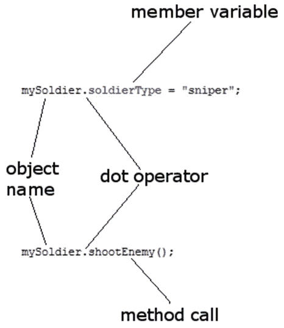
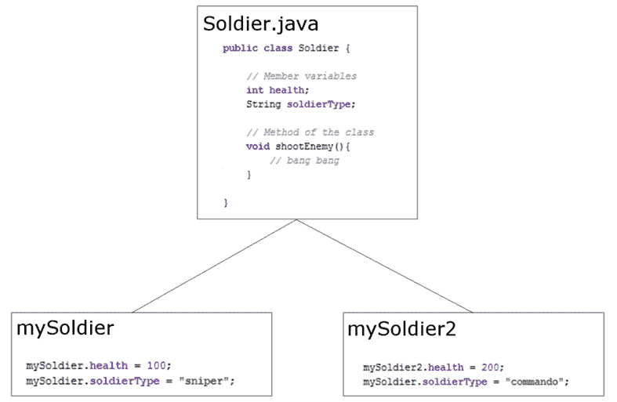

# 第十章：*第十章*：面向对象编程

在本章中，我们将发现在 Java 中，类对几乎所有事情都是基础的。我们还将开始理解为什么 Sun Microsystems 的软件工程师在 20 世纪 90 年代初让 Java 成为现在这个样子。

我们已经谈论了重用其他人的代码，特别是 Android API，但在本章中，我们将真正掌握这是如何工作的，并学习面向对象编程以及如何使用它。

总之，我们将涵盖以下主题：

+   面向对象编程是什么，包括**封装**、**继承**和**多态**

+   在应用程序中编写和使用我们的第一个类

# 技术要求

你可以在 GitHub 上找到本章的代码文件，网址为[`github.com/PacktPublishing/Android-Programming-for-Beginners-Third-Edition/tree/main/chapter%2010`](https://github.com/PacktPublishing/Android-Programming-for-Beginners-Third-Edition/tree/main/chapter%2010)。

# 重要的内存管理警告

我是在提到我们大脑的记忆。如果你试图记住本章（或下一章），你将不得不在你的大脑中腾出很多空间，你可能会忘记一些非常重要的事情——比如去工作或感谢作者告诉你不要试图记住这些东西。

一个很好的目标将是尽量*接近理解*。这样，你的理解将变得更全面。然后在需要时，你可以参考本章（或下一章）进行复习。

提示

如果你对本章的内容不完全理解也没关系！继续阅读并确保完成所有的应用程序。

# 面向对象编程

在*第一章**，开始 Android 和 Java*中，我们提到 Java 是一种面向对象的语言。面向对象的语言要求我们使用**面向对象** **编程（OOP**）。这不像汽车上的赛车扰流板或游戏 PC 上的跳动 LED 那样是可选的额外部分。它是 Java 的一部分，因此也是 Android 的一部分。

让我们多了解一点。

## OOP 究竟是什么？

面向对象编程是一种将我们的需求分解为比整体更易管理的块的编程方式。

每个块都是自包含的，但也可能被其他程序重复使用，同时与其他块一起工作。

这些块是我们所说的对象。当我们计划/编写一个对象时，我们使用一个类。一个类可以被看作是一个对象的蓝图。

我们实现一个类的对象。这被称为类的一个实例。想象一下房屋蓝图。你不能住在里面，但你可以从中建造一座房子；你建造它的一个实例。通常当我们为我们的应用设计类时，我们写它们来代表现实世界的事物。

然而，面向对象编程不仅仅是这样。它也是一种做事情的*方式*——一种定义最佳实践的方法。

面向对象编程的三个核心原则是**封装**、**多态**和**继承**。这听起来可能很复杂，但一步一步来，是相当简单的。

### 封装

封装意味着保持代码的内部工作不受使用它的代码的干扰，只允许访问你选择的变量和方法。

这意味着你的代码总是可以更新、扩展或改进，而不会影响使用它的程序，只要暴露的部分仍然以相同的方式访问。

还记得*第一章**，开始 Android 和 Java*中的这行代码吗？

```kt
locationManager.getLastKnownLocation(LocationManager.GPS_PROVIDER)
```

通过适当的封装，卫星公司或 Android API 团队需要更新他们的代码工作方式都无关紧要。只要`getLastKnownLocation`方法签名保持不变，我们就不必担心内部发生了什么。我们在更新之前编写的代码在更新后仍将正常工作。

如果汽车制造商去掉车轮，将其改为电动悬浮汽车，只要它仍然有方向盘、油门和刹车踏板，驾驶它应该不会太具有挑战性。

重要提示

当我们使用 Android API 的类时，我们是按照 Android 开发人员设计他们的类的方式来使用的。

### 多态性

**多态性**允许我们编写的代码对我们试图操作的*类型*不那么依赖，使我们的代码更清晰、更高效。多态性意味着*不同的形式*。如果我们编写的对象可以是多种类型的东西，那么我们就可以利用这一点。下一章中的一些例子将说明这一点，接下来的类比将让您从现实世界的角度看清楚。

如果我们有一个汽车工厂，只需改变给机器人的指令和放在生产线上的零件，就可以制造货车和小型卡车，那么这个工厂就是在使用多态性。

如果我们能够编写能够处理不同类型数据的代码而不必重新开始，那不是很有用吗？我们将在《第十一章》[*更多面向对象编程*]中看到一些例子。

### 继承

就像听起来的那样，`extends`关键字：

```kt
public class MainActivity extends AppCompatActivity {
```

`AppCompatActivity`类本身继承自`Activity`。因此，每次我们创建一个新的 Android 项目时，我们都是从`Activity`继承的。我们可以进一步了解它的有用之处。

想象一下，如果世界上最强壮的男人和最聪明的女人在一起。他们的孩子很可能会从基因继承中获得重大好处。在 Java 中，继承让我们可以用另一个人的代码和我们自己的代码做同样的事情，创建一个更符合我们需求的类。

## 为什么要这样做？

当正确编写时，所有这些面向对象编程允许您添加新功能，而不必过多担心它们如何与现有功能交互。当您确实需要更改一个类时，它的自包含（封装）性质意味着对程序的其他部分的影响会更少，甚至可能为零。这就是封装的部分。

您可以使用其他人的代码（例如 Android API），而不必知道或甚至关心它是如何工作的：想想一下 Android 生命周期、`Toast`、`Log`、所有 UI 小部件、监听卫星等等。例如，`Button`类有近 50 个方法-我们真的想要为一个按钮自己编写所有这些吗？最好使用别人的`Button`类。

面向对象编程允许您轻松编写高度复杂的应用程序。

通过继承，您可以创建多个类似但不同的类的版本，而无需从头开始编写类；并且您仍然可以使用原始类型对象的方法来处理新对象，这是由于多态性。

这真的很有道理。Java 从一开始就考虑到了所有这些，所以我们被迫使用所有这些面向对象编程；然而，这是一件好事。

让我们快速回顾一下类。

## 类回顾

类是一组代码行，可以包含方法、变量、循环和我们学过的所有其他 Java 语法。类是 Java 包的一部分，大多数包通常会有多个类。通常情况下，每个新类都将在其自己的`.java`代码文件中定义，文件名与类名相同-就像我们迄今为止所有的 Activity 类一样。

一旦我们编写了一个类，我们可以使用它来制作任意数量的对象。记住，类是蓝图，我们根据蓝图制作对象。房子不是蓝图，就像对象不是类一样；它是从类制作的对象。对象是一个引用变量，就像`String`变量一样，稍后我们将确切了解引用变量的含义。现在，让我们看一些实际的代码。

# 查看类的代码

假设我们正在为军方制作一个应用程序。这是供高级军官在战斗中微观管理他们的部队使用的。除其他外，我们可能需要一个代表士兵的类。

## 类的实现

这是我们假想类的真实代码。我们称之为一个类`Soldier`，如果我们真的实现了这个，我们会在一个名为`Soldier.java`的文件中这样做：

```kt
public class Soldier {

   // Member variables
   int health;
   String soldierType;
   // Method of the class
   void shootEnemy(){
             // Bang! Bang!
   }

}
```

上述是一个名为`Soldier`的类实现。有两个名为`health`的 int 变量，以及一个名为`soldierType`的 String 变量。

还有一个名为`shootEnemy`的方法。该方法没有参数，返回类型为`void`，但类方法可以是我们在*第九章**中讨论的任何形状或大小的方法。

要准确地了解成员变量和字段，当类被实例化为一个真实对象时，字段将成为对象本身的变量，我们称它们为**实例**或**成员**变量。

它们只是类的变量，无论它们被引用的名称有多么花哨。然而，字段和方法中声明的变量（称为**局部**变量）之间的区别随着我们的进展变得更加重要。

我们在*第九章**结尾简要讨论了变量作用域，学习 Java 方法*我们将在下一章再次看到所有类型的变量。让我们集中精力编写和使用一个类。

## 声明、初始化和使用类的对象

记住，`Soldier`只是一个类，不是一个实际可用的对象。它是一个士兵的蓝图，而不是一个实际的士兵对象，就像`int`、`String`和`boolean`不是变量一样；它们只是我们可以制作变量的类型。这是我们如何从我们的`Soldier`类中制作一个类型为`Soldier`的对象：

```kt
Soldier mySoldier = new Soldier();
```

在代码的第一部分中，`Soldier mySoldier`声明了一个名为`mySoldier`的类型为`Soldier`的新变量。代码的最后一部分`new Soldier()`调用了一个特殊的方法，称为**构造方法**，这个方法由编译器为所有类自动生成。

正是这个构造方法创建了一个实际的`Soldier`对象。正如你所看到的，构造方法的名称与类的名称相同。我们将在本章后面更深入地研究构造函数。

当然，两部分中间的赋值运算符`=`将第二部分的结果分配给第一部分的结果。下一张图总结了所有这些信息：


图 10.1 - 声明、初始化和使用类的对象

这与我们处理常规变量的方式并不相距太远，只是构造函数/方法调用而不是代码行末的值。要创建和使用一个非常基本的类，我们已经做得足够多了。

重要说明

正如我们将在进一步探讨时看到的，我们可以编写自己的构造函数，而不是依赖于自动生成的构造函数。这给了我们很多力量和灵活性，但现在我们将继续探讨最简单的情况。

就像普通变量一样，我们也可以像这样分两部分完成。

```kt
Soldier mySoldier;
mySoldier = new Soldier();
```

这是我们可能分配和使用假想类的变量的方式：

```kt
mySoldier.health = 100;
mySoldier.soldierType = "sniper";
// Notice that we use the object name mySoldier.
// Not the class name Soldier.
// We didn't do this:
// Soldier.health = 100; 
// ERROR!
```

在这里，点运算符`.`用于访问类的变量。这就是我们调用方法的方式 - 再次，通过使用对象名称，而不是类名称，后跟点运算符：

```kt
mySoldier.shootEnemy();
```

我们可以用图表总结点运算符的使用：



图 10.2 - 点运算符

提示

我们可以将类的方法视为它可以*做*的事情，将其实例/成员变量视为它*了解*自身的事情。

我们也可以继续制作另一个`Soldier`对象并访问它的方法和变量：

```kt
Soldier mySoldier2 = new Soldier();
mySoldier2.health = 150;
mySoldier2.soldierType = "special forces";
mySoldier2.shootEnemy();
```

重要的是要意识到`mySoldier2`是一个完全独立的对象，具有完全不同的实例变量，与`mySoldier`不同：



图 10.3 - 士兵对象

这里还有一个关键点，即前面的代码不会在类本身内部编写。例如，我们可以在名为`Soldier.java`的外部文件中创建`Soldier`类，然后使用我们刚刚看到的代码，可能在`MainActivity`类中。

当我们在一分钟内在实际项目中编写我们的第一个类时，这将变得更加清晰。

还要注意，所有操作都是在对象本身上进行的。我们必须创建类的对象才能使它们有用。

重要提示

像往常一样，这个规则也有例外。但它们是少数，我们将在下一章中看到这些例外。实际上，到目前为止，我们已经看到了两个例外。我们已经看到的例外是`Toast`和`Log`类。它们的具体情况将很快得到解释。

让我们通过编写一个真正的基本类来更深入地探索基本类。

# 基本类应用

将使用我们的应用程序的将军需要不止一个`Soldier`对象。在我们即将构建的应用程序中，我们将实例化和使用多个对象。我们还将演示使用变量和方法上的点运算符，以表明不同的对象具有自己的实例变量。

您可以在代码下载中获取此示例的完整代码。它在*第十章*`/Basic Classes`文件夹中。但是，继续阅读以创建您自己的工作示例会更有用。

使用`Basic` `Classes`创建一个项目。现在我们将创建一个名为`Soldier`的新类：

1.  右键单击项目资源管理器窗口中的`com.yourdomain.basicclasses`（或者您的包名称）文件夹。

1.  选择**New | Java Class**。

1.  在`Soldier`中按下*Enter*键。

为我们创建了一个新的类，其中包含一个代码模板，准备将我们的实现放入其中，就像下一个代码所示的那样。

```kt
package com.yourdomain.basicclasses;
public class Soldier {
}
```

注意，Android Studio 将类放在与我们应用程序的其他 Java 文件相同的包/文件夹中。

现在我们可以编写它的实现。

按照所示，在`Soldier`类的开放和闭合大括号内编写以下类实现代码。要输入的新代码已经高亮显示：

```kt
public class Soldier {
    int health;
    String soldierType;
    void shootEnemy(){
        //let's print which type of soldier is shooting
        Log.i(soldierType, " is shooting");
    }
}
```

现在我们有了一个类，即将来的`Soldier`类型对象的蓝图，我们可以开始建立我们的军队。在编辑窗口中，单击`setContentView`方法调用后的`onCreate`方法。输入以下代码：

```kt
// First, we make an object of type soldier
Soldier rambo = new Soldier();
rambo.soldierType = "Green Beret";
rambo.health = 150;
// It takes a lot to kill Rambo
// Now we make another Soldier object
Soldier vassily = new Soldier();
vassily.soldierType = "Sniper";
vassily.health = 50;
// Snipers have less health
// And one more Soldier object
Soldier wellington = new Soldier();
wellington.soldierType = "Sailor";
wellington.health = 100;
// He's tough but no green beret
```

现在我们有了极其多样化和不太可能的军队，我们可以使用它并验证每个对象的身份。

在上一步中的代码下面输入以下代码：

```kt
Log.i("Rambo's health = ", "" + rambo.health);
Log.i("Vassily's health = ", "" + vassily.health);
Log.i("Wellington's health = ", "" + wellington.health);
rambo.shootEnemy();
vassily.shootEnemy();
wellington.shootEnemy();
```

现在我们可以运行我们的应用程序。所有输出将显示在 logcat 窗口中。

这就是它的工作原理。首先，我们创建了我们的新`Soldier`类。然后我们实现了我们的类，包括声明两个字段（成员变量），一个`int`变量和一个名为`health`和`soldierType`的`String`变量。

我们的类中还有一个名为`shootEnemy`的方法。让我们再次看一下，并检查发生了什么：

```kt
void shootEnemy(){
        //let's print which type of soldier is shooting
        Log.i(soldierType, " is shooting");
}
```

在方法的主体中，我们打印到 logcat 窗口：首先是`soldierType`，然后是文本`" is shooting"`。这里很棒的是，字符串`soldierType`会根据我们在`shootEnemy`方法上调用的对象不同而不同。

接下来，我们声明并创建了三个`Soldier`类型的新对象。它们是`rambo`，`vassily`和`wellington`。

最后，我们为`health`和`soldierType`的每个值初始化了不同的值。

这是输出：

```kt
Rambo's health =: 150
Vassily's health =: 50
Wellington's health =: 100
Green Beret: is shooting
Sniper: is shooting
Sailor: is shooting
```

注意，每次访问每个`Soldier`对象的`health`变量时，它都会打印我们分配的值，证明尽管这三个对象是相同类型的，但它们是完全独立的个体实例/对象。

也许更有趣的是对`shootEnemy`的三次调用。逐个地，我们的`Soldier`对象的`shootEnemy`方法被调用，并且我们将`soldierType`变量打印到 logcat 窗口。该方法对每个单独的对象都有适当的值，进一步证明我们有三个不同的对象（类的实例），尽管它们是从同一个`Soldier`类创建的。

我们看到每个对象都是完全独立的。然而，如果我们想象我们的应用中有整个军队的`Soldier`对象，那么我们意识到我们需要学习处理大量对象（以及常规变量）的新方法。

想想管理 100 个独立的`Soldier`对象。当我们有成千上万的对象时呢？此外，这并不是很动态。我们现在编写代码的方式依赖于我们（开发人员）知道将由将军（用户）指挥的士兵的确切细节。我们将在*第十五章**，数组、映射和随机数*中看到解决方案。

## 我们的第一个类还可以做更多的事情

我们可以像处理其他变量一样处理类。我们可以在方法签名中使用类作为参数，就像这样：

```kt
public void healSoldier(Soldier soldierToBeHealed){
   // Use soldierToBeHealed here
   // And because it is a reference the changes
   // are reflected in the actual object passed into
   // the method.
   // Oops! I just mentioned what 
   // a reference variable can do
   // More info in the FAQ, chapter 11, and onwards
}
```

当我们调用方法时，当然必须传递该类型的对象。以下是对`healSoldier`方法的假设调用：

```kt
healSoldier(rambo);
```

当然，前面的例子可能会引发问题，比如，`healSoldier`方法应该是一个类的方法吗？

```kt
fieldhospital.healSoldier(rambo);
```

可能是，也可能不是。这将取决于情况的最佳解决方案是什么。我们将看到更多的面向对象编程，然后对许多类似的难题的最佳解决方案应该更容易呈现出来。

而且，你可能会猜到，我们也可以将对象用作方法的返回值。以下是更新后的假设`healSoldier`签名和实现可能看起来像的样子：

```kt
Soldier healSoldier(Soldier soldierToBeHealed){
   soldierToBeHealed.health++;
   return soldierToBeHealed;
}
```

实际上，我们已经看到类被用作参数。例如，这是我们来自*第二章**，初次接触：Java、XML 和 UI 设计师*的`topClick`方法。它接收了一个名为`v`的`View`类型的对象：

```kt
public void topClick(View v){
```

然而，在`topClick`方法的情况下，我们没有对传入的`View`类型的对象做任何操作。部分原因是因为我们不需要，部分原因是因为我们不知道可以对`View`类型的对象做什么 - 至少目前还不知道。

正如我在本章开头提到的，你不需要理解或记住本章的所有内容。掌握面向对象编程的唯一方法就是不断地使用它。就像学习口语一样 - 学习和研究语法规则会有所帮助，但远不及口头交流（或书面交流）来得有用。如果你差不多懂了，就继续下一章吧。

# 常见问题

1.  我真的等不及了。引用到底是什么！？

它实际上就是在普通（非编程）语言中的引用。它是一个标识/指向数据的值，而不是实际的数据本身。一个思考它的方式是，引用是一个内存位置/地址。它标识并提供对内存中该位置/地址上的实际数据的访问。

1.  如果它不是实际的对象，而只是一个引用，那么我们怎么能调用它的方法，比如`mySoldier.shootEnemy()`呢？

Java 在幕后处理了确切的细节，但你可以把引用看作是对象的控制器，你想对对象做的任何事情都必须通过控制器来做，因为实际的对象/内存本身不能直接访问。关于这一点，*第十二章**，栈、堆和垃圾收集器*中有更多内容。

# 总结

我们终于编写了我们的第一个类。我们已经看到我们可以在与类同名的 Java 文件中实现一个类。类本身在我们实例化一个类的对象/实例之前并不起作用。一旦我们有了一个类的实例，我们就可以使用它的变量和方法。正如我们在基本类应用程序中证明的那样，每个类的实例都有自己独特的变量，就像当你买一辆工厂生产的汽车时，你会得到自己独特的方向盘、卫星导航和加速条纹。

所有这些信息都会引发更多的问题。面向对象编程就是这样。因此，让我们尝试通过再次查看变量和封装、多态性以及继承来巩固所有这些类的内容，下一章将展示它们的实际应用。然后我们可以进一步学习类，并探讨静态类（例如 Log 和 Toast）以及抽象类和接口等更高级的概念。
