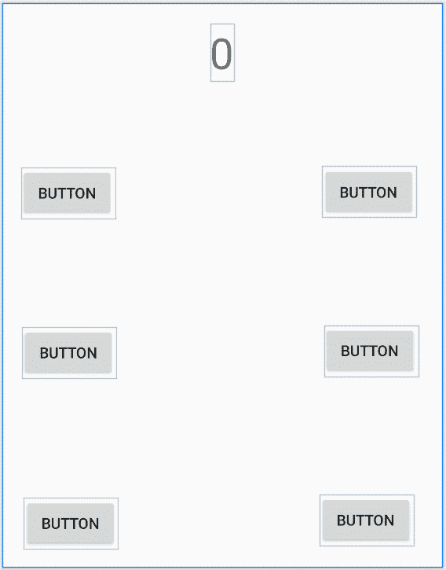
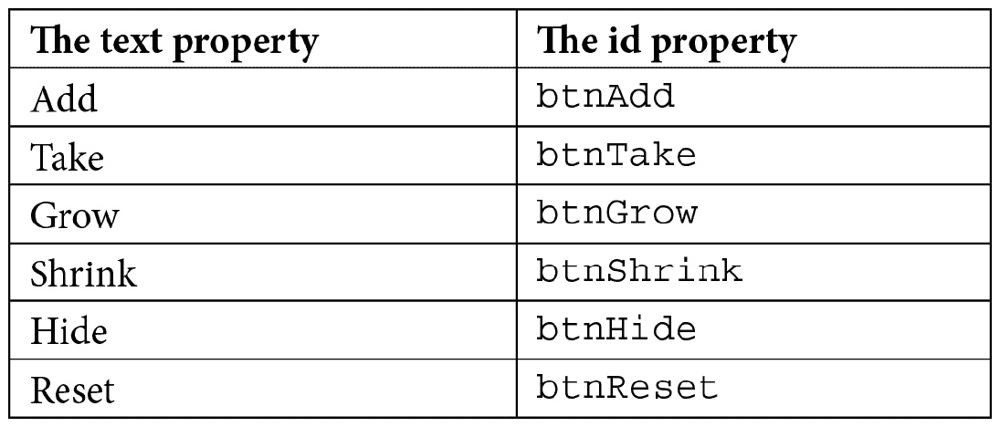
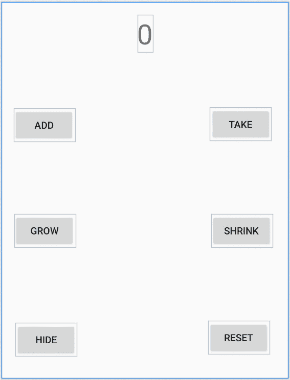
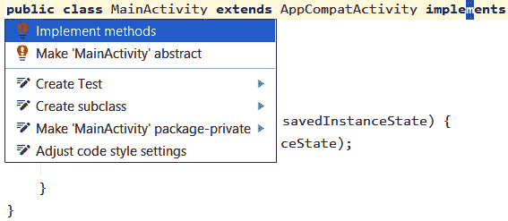

# 第十二章：栈、堆和垃圾收集器

在本章结束时，Java 和我们的 XML 布局之间的缺失链接将被完全揭示，让我们有能力像以前一样向我们的应用程序添加各种小部件，但这一次，我们将能够通过我们的 Java 代码来控制它们。

在本章中，我们将控制一些简单的 UI 元素，如`Button`和`TextView`，在下一章中，我们将进一步操作一系列 UI 元素。

为了让我们理解发生了什么，我们需要更多地了解 Android 设备的内存以及其中的两个区域 - **栈**和**堆**。

在本章中，我们将学习以下内容：

+   Android UI 元素是类

+   垃圾回收

+   我们的 UI 在堆上？

+   特殊类型的类，包括内部和匿名

回到那个新闻快讯。

# 技术要求

您可以在 GitHub 上找到本章的代码文件[`github.com/PacktPublishing/Android-Programming-for-Beginners-Third-Edition/tree/main/chapter%2012`](https://github.com/PacktPublishing/Android-Programming-for-Beginners-Third-Edition/tree/main/chapter%2012)。

# 所有的 Android UI 元素也是类

当我们的应用程序运行并且从`onCreate`方法中调用`setContentView`方法时，布局从 XML 中`inflated`，UI 类的实例被加载到内存中作为可用对象。它们存储在一个称为堆的内存部分中。堆由**Android Runtime**（**ART**）系统管理。

## 重新介绍引用

但是所有这些 UI 对象/类在哪里？我们在代码中肯定看不到它们。我们怎么能得到它们？

每个 Android 设备内部的 ART 负责为我们的应用程序分配内存。此外，它将不同类型的变量存储在不同的位置。

我们在方法中声明和初始化的变量存储在被称为**栈**的内存区域。在谈论栈时，我们可以继续使用我们现有的仓库类比。我们已经知道如何使用简单的表达式在栈上操作变量。所以，让我们谈谈堆和那里存储的东西。

重要事实

所有类的对象都是引用类型变量，只是指向存储在堆上的实际对象的引用 - 它们不是实际的对象。

把堆想象成同一个仓库的另一个区域。堆有大量的地板空间用于奇形怪状的对象，用于较小对象的货架，有很多长排有较小尺寸的小隔间等等。这就是对象存储的地方。问题是我们无法直接访问堆。把它想象成仓库的受限区域。你实际上不能去那里，但你可以*引用*那里存储的东西。让我们看看引用变量到底是什么。

这是我们通过引用引用和使用的变量。引用可以宽松但有用地定义为地址或位置。对象的引用（地址或位置）在栈上。

因此，当我们使用点运算符时，我们要求 Android 在一个特定的位置执行任务，这个位置存储在引用中。

为什么我们要一个这样的系统？直接把我的对象放在栈上。原因如下。

### 快速休息一下，扔掉垃圾

这就是整个栈和堆的作用。

正如我们所知，ART 系统为我们跟踪所有的对象，并将它们存储在我们仓库的一个专门区域，称为堆。在我们的应用程序运行时，ART 会定期扫描栈，我们仓库的常规货架，并匹配指向堆上对象的引用。它发现没有匹配引用的对象，就会销毁它。或者用 Java 术语来说，它进行**垃圾回收**。

想象一辆非常挑剔的垃圾车驶过我们堆的中间，扫描对象以匹配引用（在栈上）。没有引用？你现在是垃圾。

如果一个对象没有引用变量，我们无法做任何事情，因为我们无法访问它。垃圾收集系统通过释放未使用的内存帮助我们的应用程序更有效地运行。

如果这个任务留给我们，我们的应用程序将更加复杂。

因此，在方法中声明的变量是局部变量，位于堆栈上，并且仅在它们声明的方法内部可见。成员变量（在对象中）位于堆上，并且可以在任何有引用到它的地方引用它，并且访问规范（封装）允许。

### 关于堆栈和堆的七个事实

让我们快速看一下我们对堆栈和堆的了解：

1.  局部变量和方法位于堆栈上，局部变量局限于它们声明的特定方法。

1.  实例/类变量在堆上（与它们的对象一起），但对对象的引用（其地址）是堆栈上的局部变量。

1.  我们控制堆栈上的内容。我们可以使用堆上的对象，但只能通过引用它们。

1.  垃圾收集器通过清除和更新堆来保持堆的清晰。

1.  您不会删除对象，但 ART 系统在认为适当时会发送垃圾收集器。当不再有有效引用时，对象将被垃圾收集。因此，当引用变量（局部或实例）从堆栈中移除时，其相关对象变得可供垃圾收集。当 ART 系统决定时机合适（通常非常迅速），它将释放 RAM 内存以避免耗尽。

1.  如果我们尝试引用一个不存在的对象，我们将得到一个**NullPointerException**，应用程序将崩溃。

让我们继续看看这些信息对我们控制 UI 有什么好处。

## 那么这个堆的东西如何帮助我呢？

在 XML 布局中设置了`id`属性的任何 UI 元素都可以使用`findViewById`方法从堆中检索到其引用，该方法是 Activity/`AppCompatActivity`类的一部分。由于它是我们在所有应用程序中扩展的类的一部分，因此我们可以访问它，正如这段代码所示：

```kt
Button myButton = findViewById(R.id.myButton);
```

上述代码假设在 XML 布局中有一个`Button`小部件，其`id`属性设置为`myButton`。`myButton`对象现在直接引用 XML 布局中`id`属性设置为`myButton`的小部件。

请注意，`findViewById`方法也是多态的，任何扩展`View`类的类都可以从 UI 中检索，并且碰巧*UI*面板中的所有内容都扩展了`View`。

敏锐的读者可能会注意到，我们在检索从抽象`Animal`继承的`Elephant`实例时，不使用强制转换来确保我们得到一个`Button`对象（而不是`TextView`或其他`View`后代）：

```kt
someElephant = (Elephant) feed(someElephant);
```

这是因为`View`类使用了 Java 的**泛型自动类型推断**。这是一个我们不会在本书中涵盖的高级主题，但它意味着强制转换是自动的，我们不需要编写更多的冗长代码，如下所示：

```kt
Button myButton = (Button) findViewById(R.id.myButton);
```

抓取 UI 中任何东西的引用的能力令人兴奋，因为这意味着我们可以开始使用这些对象具有的所有方法。以下是一些我们可以用于`Button`对象的方法的示例：

```kt
myButton.setText
myButton.setHeight
myButton.setOnCLickListener
myButton.setVisibility
```

重要提示

`Button`类本身有大约 50 个方法！

如果您认为在经过 11 章之后，我们终于要开始在 Android 上做一些有趣的事情，那么您是对的！

## 从我们的布局中使用按钮和 TextView 小部件

要跟随这个项目，创建一个新的 Android Studio 项目，称之为`Java Meet UI`，选择空活动模板，并将所有其他选项保持默认。通常情况下，您可以在*第十二章*`/Java Meet UI`文件夹中找到 Java 代码和 XML 布局代码。

首先，让我们按照以下步骤构建一个简单的 UI：

1.  在 Android Studio 的编辑窗口中，切换到`activity_main.xml`，确保你在**设计**选项卡上。

1.  删除自动生成的**TextView**，即那个写着“Hello world!”的。

1.  在布局的顶部中心添加一个**TextView**小部件。

1.  将其设置为`0`，`40sp`。注意`id`属性值的大小写。它有一个大写的`V`。

1.  现在在布局上拖放六个按钮，使其尽可能接近下一个屏幕截图。确切的布局并不重要：

图 12.1 - 布局设置

1.  当布局设置好后，点击**推断约束**按钮来约束所有的 UI 项目。

1.  依次编辑每个按钮的属性（从左到右，从上到下），并按照下表中所示设置`text`和`id`属性。表后面的图片应该清楚地显示了哪个按钮有哪些值。



完成后，你的布局应该看起来像下一个屏幕截图：



图 12.2 - 最终布局

按钮上的精确位置和文本并不是很重要，但是`id`属性的值必须与表中的值相同。原因是我们将使用这些 ID 来从我们的 Java 代码中获取对这个布局中的按钮和`TextView`的引用。

切换到编辑器中的**MainActivity.java**选项卡，我们将编写代码。

修改这一行：

```kt
public class MainActivity extends AppCompatActivity{
to
public class MainActivity extends AppCompatActivity implements
   View.OnClickListener{
```

提示

你需要导入`View`类。确保在继续下一步之前做到这一点，否则你会得到混乱的结果。

```kt
import android.view.View;
```

注意我们刚刚修改的整行都被下划线标出了错误。现在，因为我们已经将`MainActivity`转换为`OnClickListener`，通过将其添加为一个接口，我们必须实现`OnClickListener`所需的抽象方法。这个方法叫做`onClick`。当我们添加`onClick`方法时，错误就会消失。

我们可以让 Android Studio 为我们添加它，方法是在带有错误的行的任何地方左键单击，然后使用键盘组合*Alt* + *Enter*。左键单击**实现方法**选项，如下一个屏幕截图所示。



图 12.3 - 实现方法

现在，左键单击`onClick`方法。错误已经消失，我们可以继续添加代码。我们还有一个空的`onClick`方法，很快我们将看到我们将如何处理它。

现在我们将声明一个名为`value`的`int`类型变量，并将其初始化为`0`。我们还将声明六个`Button`对象和一个`TextView`对象。我们将给它们与我们 UI 布局中的`id`属性值完全相同的 Java 变量名。这种名称关联并不是必需的，但它对于跟踪我们的 Java 代码中的哪个`Button`将持有对我们的 XML UI 布局中的哪个`Button`的引用是有用的。

此外，我们将它们全部声明为`private`访问权限，因为我们知道它们在这个类之外不会被需要。

在继续输入代码之前，请注意所有这些变量都是`MainActivity`类的成员。这意味着我们在上一步修改的类声明之后立即输入所有下面显示的代码。

将所有这些变量都变成成员/字段意味着它们具有类范围，我们可以在`MainActivity`类的任何地方访问它们。这对这个项目非常重要，因为我们需要在`onCreate`方法和我们的新`onClick`方法中使用它们。

在`MainActivity`类的开头大括号`{`后和`onCreate`方法前输入我们刚刚讨论过的下面的代码：

```kt
// An int variable to hold a value
private int value = 0;
// A bunch of Buttons and a TextView
private Button btnAdd;
private Button btnTake;
private TextView txtValue;
private Button btnGrow;
private Button btnShrink;
private Button btnReset;
private Button btnHide;
```

提示

记得使用*ALT* + *Enter*键盘组合来导入新的类。

`import android.widget.Button;`

`import android.widget.TextView;`

接下来，我们要准备好所有的变量以准备行动。这样做的最佳位置是`onCreate`方法，因为我们知道这将在应用程序显示给用户之前由 Android 调用。这段代码使用`findViewById`方法将我们的每个 Java 对象与 UI 布局中的一个项目关联起来。

它通过返回与堆上的 UI 小部件关联的对象的引用来实现。它“知道”我们要找的是哪一个，因为我们使用`id`属性值作为参数。例如，`...(R.id.btnAdd)`将返回我们在布局中创建的文本为**ADD**的`Button`小部件。

在`onCreate`方法中的`setContentView`调用后，输入以下代码：

```kt
// Get a reference to all the buttons in our UI
// Match them up to all our Button objects we declared earlier
btnAdd = findViewById(R.id.btnAdd);
btnTake = findViewById(R.id.btnTake);
txtValue = findViewById(R.id.txtValue);
btnGrow = findViewById(R.id.btnGrow);
btnShrink = findViewById(R.id.btnShrink);
btnReset = findViewById(R.id.btnReset);
btnHide = findViewById(R.id.btnHide);
```

现在我们已经有了对所有`Button`小部件和`TextView`小部件的引用，所以现在我们可以开始使用它们的方法。在接下来的代码中，我们使用`setOnClickListener`方法在每个`Button`引用上，使 Android 将用户的任何点击传递到我们的`onClick`方法。

这样做是因为当我们实现`View.OnClickListener`接口时，我们的`MainActivity`类实际上*成为了*一个`OnClickListener`。

因此，我们只需依次在每个按钮上调用`setOnClickListener`。作为提醒，`this`参数是对`MainActivity`的引用。因此，方法调用表示：“嘿，Android，我想要一个`OnClickListener`，我希望它是`MainActivity`类。”

现在 Android 知道要在哪个类上调用`onClick`。如果我们没有先实现接口，下面的代码将无法工作。此外，我们必须在 Activity 启动之前设置这些监听器，这就是为什么我们在`onCreate`中这样做的原因。

很快，我们将添加代码到`onClick`方法中，以处理当按钮被点击时发生的情况，并且我们将看到如何区分所有不同的按钮。

在上一个代码之后，在`onCreate`方法内添加以下代码：

```kt
// Listen for all the button clicks
btnAdd.setOnClickListener(this);
btnTake.setOnClickListener(this);
txtValue.setOnClickListener(this);
btnGrow.setOnClickListener(this);
btnShrink.setOnClickListener(this);
btnReset.setOnClickListener(this);
btnHide.setOnClickListener(this);
```

现在滚动到 Android Studio 在我们实现`OnClickListener`接口后为我们添加的`onClick`方法。在其中添加`float size;`变量声明和一个空的`switch`块，使其看起来像下面的代码。要添加的新代码已经突出显示：

```kt
public void onClick(View view){
            // A local variable to use later
      float size;
      switch(view.getId()){

      }
}
```

记住，`switch`将检查是否有一个`case`与`switch`语句内的条件匹配。

在上一个代码中，`switch`条件是`view.getId()`。让我们逐步解释一下。`view`变量是一个指向`View`类型对象的引用，它是由 Android 通过`onClick`方法传递的：

```kt
public void onClick(View view)
```

`View`是`Button`、`TextView`等的父类。因此，或许正如我们所期望的那样，调用`view.getId()`将返回被点击并触发对`onClick`的调用的 UI 小部件的`id`属性。

然后我们只需要为我们想要响应的每个`Button`引用提供一个`case`语句（和适当的操作）。

接下来我们将看到的是前三个`case`语句。它们处理`R.id.btnAdd`、`R.id.btnTake`和`R.id.btnReset`情况：

+   `R.id.btnAdd`情况下的代码简单地增加了`value`变量，然后做了一些新的事情。

它调用`txtValue`对象上的`setText`方法。这是参数：`(""+ value)`。这个参数使用一个空字符串，并将存储在`value`中的任何值添加（连接）到其中。这会导致我们的`TextView txtValue`显示存储在`value`中的任何值。

+   `R.id.btnTake`)做的事情完全相同，只是从`value`中减去 1 而不是加 1。

+   第三个`case`语句处理将`value`归零，并再次更新`txtValue`的`text`属性。

然后，在每个`case`的末尾，都有一个`break`语句。在这一点上，`switch`块被退出，`onClick`方法返回，生活恢复正常-直到用户的下一次点击。

在左花括号`{`后的`switch`块中输入我们刚讨论过的代码：

```kt
case R.id.btnAdd:
   value ++;
   txtValue.setText(""+ value);
   break;
case R.id.btnTake:
   value--;
   txtValue.setText(""+ value);
   break;
case R.id.btnReset:
   value = 0;
   txtValue.setText(""+ value);
   break;
```

下面的两个`case`语句处理`R.id.btnGrow`和`R.id.btnShrink`。新的更有趣的是使用的两种新方法。

`getTextScaleX`方法返回其所用对象中文本的水平比例。我们可以看到它所用的对象是我们的`TextView txtValue`。代码行开头的`size =`将返回的值赋给我们的`float`变量`size`。

在每个`case`语句的下一行代码改变了文本的水平比例，使用了`setTextScaleX`。当`size + 1`时，当`size - 1`时。

总体效果是允许这两个按钮通过每次点击来增大或缩小`txtValue`小部件中的文本比例 1。

输入我们刚讨论过的下面的下一个两个`case`语句：

```kt
case R.id.btnGrow:
   size = txtValue.getTextScaleX();
   txtValue.setTextScaleX(size + 1);
   break;
case R.id.btnShrink:
   size = txtValue.getTextScaleX();
   txtValue.setTextScaleX(size - 1);
   break;
```

在我们下面要编写的最后一个`case`语句中，我们有一个`if-else`块。条件需要稍微解释一下，所以让我们提前看一下：

```kt
if(txtValue.getVisibility() == View.VISIBLE)
```

要评估的条件是`txtValue.getVisibility() == View.VISIBLE`。在`==`运算符之前的条件的第一部分返回我们的`txtValue TextView`的`visibility`属性。返回值将是`View`类中定义的三个可能的常量值之一。它们是`View.VISIBLE`，`View.INVISIBLE`和`View.GONE`。

如果`TextView`在 UI 上对用户可见，则该方法返回`View.VISIBLE`，条件将被评估为`true`，并且`if`块将被执行。

在`if`块内，我们在`txtValue`对象上使用`setVisibility`方法，并使用`View.INVISIBLE`参数使其对用户不可见。

除此之外，我们将`btnHide`小部件上的文本更改为`setText`方法。

在`if`块执行完毕后，`txtValue`是不可见的，我们的 UI 上有一个按钮显示为`if`语句将为 false，`else`块将执行。在`else`块中，我们将情况反转。我们将`txtValue`设置回`View.VISIBLE`，并将`btnHide`上的`text`属性设置为**HIDE**。

如果这有任何不清楚的地方，只需输入代码，运行应用程序，然后在看到它实际运行后再回顾这段代码和解释：

```kt
case R.id.btnHide:
   if(txtValue.getVisibility() == View.VISIBLE)
   {
         // Currently visible so hide it
         txtValue.setVisibility(View.INVISIBLE);
         // Change text on the button
         btnHide.setText("SHOW");
   }else{
         // Currently hidden so show it
         txtValue.setVisibility(View.VISIBLE);
         // Change text on the button
         btnHide.setText("HIDE");
   }
   break;
```

我们已经有了 UI 和代码，所以现在是时候运行应用程序，尝试所有的按钮了。

## 运行应用程序

以通常的方式运行应用程序。注意，`value`向任一方向增加或减少 1，然后在`TextView`小部件中显示结果。在下一个截图中，我点击了**ADD**按钮三次。


图 12.4 - 添加按钮示例

请注意，将`value`变量设置为 0，并在`TextView`小部件上显示它。在下一个截图中，我点击了**GROW**按钮八次。


图 12.5 - 增长按钮示例

最后，`TextView`小部件在再次点击时将其自身文本更改为`TextView`。

提示

我不会打扰你展示一张隐藏的图片。一定要尝试这个应用程序。

请注意，在这个应用程序中不需要`Log`或`Toast`类，因为我们最终是使用我们的 Java 代码操纵 UI。让我们通过探索内部和匿名类来更深入地使用我们的代码操纵 UI。

# 内部和匿名类

在我们继续下一章并构建具有大量不同小部件的应用程序之前，这些小部件将实践和强化我们在本章学到的一切，我们将对**匿名**和**内部**类进行非常简要的介绍。

当我们在*第十章**中实现了我们的基本类演示应用程序，面向对象编程时，我们在一个单独的文件中声明和实现了该类，该文件必须与我们的`MainActivity`类具有相同的名称。这是创建常规类的方法。

我们还可以在一个类中声明和实现其他类。除了*如何*我们这样做之外，当然，唯一剩下的问题是为什么我们要这样做？

当我们实现内部类时，内部类可以访问封闭类的成员变量，封闭类也可以访问内部类的成员。

这通常使我们的代码结构更加直观。因此，内部类有时是解决问题的方法。

此外，我们还可以在我们的类的方法中声明和实现一个完整的类。当我们这样做时，我们使用稍微不同的语法，并且不使用类名。这就是**匿名**类。

在本书的其余部分，我们将看到内部类和匿名类的实际应用，并在使用它们时进行彻底讨论。

# 常见问题

1.  我并没有完全理解，实际上我现在有比章节开始时更多的问题。我该怎么办？

你已经了解了足够的面向对象编程知识，可以在 Android 和其他类型的 Java 编程中取得相当大的进步。如果你现在迫切想了解更多关于面向对象编程的知识，有很多书籍专门讨论面向对象编程。然而，实践和熟悉语法将有助于达到相同的效果，并且更有趣。这正是我们将在本书的其余部分做的事情。

# 总结

在本章中，我们终于让我们的代码和 UI 进行了一些真正的交互。事实证明，每当我们向我们的 UI 添加一个小部件时，我们都在添加一个我们可以在 Java 代码中引用的类的实例。所有这些对象都存储在内存的一个单独区域中，称为堆 - 以及我们自己的任何类。

现在我们可以学习并使用一些更有趣的小部件。我们将在下一章中看到大量的小部件，然后在本书的其余部分继续介绍更多新的小部件。
