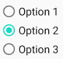
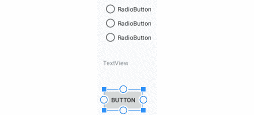
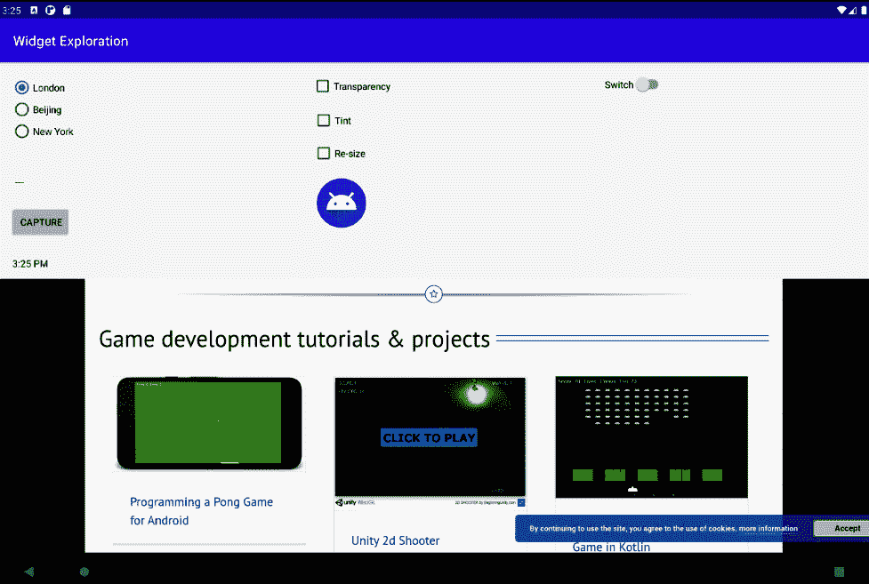
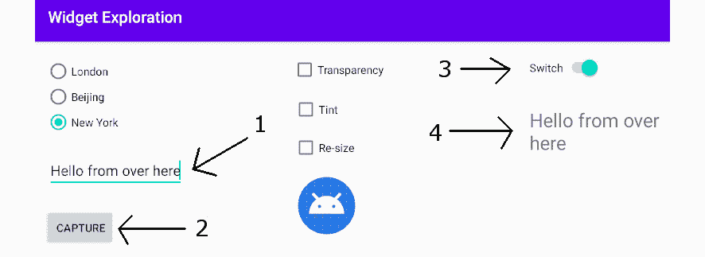

# 第十三章：*第十三章*：匿名类-让 Android 小部件活起来

这一章本来可以被称为*更多 OOP*，因为匿名类仍然是这个主题的一部分。然而，正如您将看到的，匿名类为我们提供了如此多的灵活性，特别是在与**用户界面**（**UI**）交互时，我认为它们值得有一章专门介绍它们及它们在 Android 中的关键用途。

现在我们已经对 Android 应用的布局和编码有了一个很好的概述，再加上我们新获得的对**面向对象编程**（**OOP**）的见解，以及我们如何可以从 Java 代码中操作 UI，我们准备尝试使用调色板上的更多小部件以及匿名类。

面向对象编程有时是一个棘手的事情，匿名类对于初学者来说可能有点尴尬。然而，通过逐渐学习这些新概念，然后反复练习，随着时间的推移，它们将成为我们的朋友。

在本章中，我们将通过回到 Android Studio 调色板，查看半打我们根本没有看到过或者还没有完全使用过的小部件，来进行大量的多样化。

一旦我们做到了这一点，我们将把它们全部放入一个布局中，并用 Java 代码练习操作它们。

在本章中，我们将重点关注以下主题：

+   声明和初始化布局小部件

+   只使用 Java 代码创建小部件

+   `EditText`，`ImageView`，`RadioButton`（和`RadioGroup`），`Switch`，`CheckBox`和`TextClock`小部件

+   使用 WebView

+   如何使用匿名类

+   使用所有前述小部件和一些匿名类创建小部件演示迷你应用程序

让我们开始一个快速回顾。

# 技术要求

您可以在 GitHub 上找到本章的代码文件，网址为 https://github.com/PacktPublishing/Android-Programming-for-Beginners-Third-Edition/tree/main/chapter%2013。

# 声明和初始化对象

我们知道，当我们从`onCreate`方法调用`setContentView`方法时，Android 会将所有小部件和布局膨胀，并将它们转换为堆上的*真正*的 Java 对象。

此外，我们知道要使用堆中的小部件，我们必须首先声明正确类型的对象，然后使用它来通过其唯一的`id`属性获取对堆上的 UI 小部件对象的引用。

例如，我们通过`id`属性为`txtTitle`的`TextView`小部件获取一个引用，并将其赋值给一个新的 Java 对象，称为`myTextView`，如下所示：

```kt
// Grab a reference to an object on the heap
TextView myTextView = findViewById(R.id.txtTitle);
```

现在，使用我们的`myTextView`实例变量，我们可以做任何`TextView`类设计的事情。例如，我们可以设置文本显示如下：

```kt
myTextView.setText("Hi there");
```

此外，我们可以按如下方式使其消失：

```kt
// Bye bye
myTextView.setVisibility(View.GONE)
```

我们可以再次更改它的文本并使其重新出现：

```kt
myTextView.setText("BOO!");
// Surprise
myTextView.setVisibility(View.VISIBLE)
```

值得一提的是，我们可以在 Java 中操纵在前几章中使用 XML 设置的任何属性。此外，我们已经暗示过-但实际上没有看到-使用纯 Java 代码从无到有地创建小部件。

# 在纯 Java 中创建 UI 小部件而不使用 XML

我们还可以从不是指向布局中对象的 Java 对象创建小部件。我们可以在代码中声明、实例化和设置小部件的属性，如下所示：

```kt
Button myButton = new Button();
```

上述代码通过使用`new()`关键字创建了一个新的`Button`。唯一的注意事项是`Button`必须是布局的一部分，才能被用户看到。因此，我们可以从 XML 布局中获取对布局元素的引用，或者在代码中创建一个新的布局。

如果我们假设我们的 XML 中有一个`id`属性等于`linearLayout1`的`LinearLayout`，我们可以将我们之前代码行中的`Button`放入其中，如下所示：

```kt
// Get a reference to the LinearLayout
LinearLayout linearLayout = (LinearLayout)
   findViewById(R.id.linearLayout);
// Add our Button to it
linearLayout.addView(myButton);
```

我们甚至可以通过纯 Java 代码创建一个完整的布局，首先创建一个新布局，然后创建我们想要添加的所有小部件。最后，我们在具有我们小部件的布局上调用`setContentView`方法。

在下面的代码中，我们用纯 Java 创建了一个布局，尽管它非常简单，只有一个`LinearLayout`里面有一个`Button`：

```kt
// Create a new LinearLayout
LinearLayout linearLayout = new LinearLayout();
// Create a new Button
Button myButton = new Button();
// Add myButton to the LinearLayout
linearLayout.addView(myButton);
// Make the LinearLayout the main view
setContentView(linearLayout);
```

显而易见的是，仅使用 Java 设计详细和细致的布局会更加麻烦，更难以可视化，并且通常不是通常的做法。然而，有时我们会发现以这种方式做事情是有用的。

我们现在已经相当高级了，涉及到布局和小部件。然而，很明显，调色板中还有许多其他小部件，我们尚未探索或与之交互。所以，让我们解决这个问题。

# 探索调色板 – 第一部分

让我们快速浏览一下调色板中以前未探索/未使用的一些项目。然后，我们可以将它们拖放到布局中，查看它们可能有用的一些方法。然后，我们可以实现一个项目来使用它们。

我们在上一章已经探索了`Button`和`TextView`小部件。让我们更仔细地看看一些其他小部件。

## EditText 小部件

`EditText`小部件就像其名称所示。如果我们向用户提供`EditText`小部件，他们确实可以在其中*编辑* *文本*。我们在早期的章节中已经看过这个了；然而，我们实际上并没有做任何事情。我们没有探索的是如何捕获其中的信息，或者我们将在哪里输入这个捕获文本的代码。

以下代码块假设我们已经声明了一个`EditText`类型的对象，并使用它来获取我们 XML 布局中的`EditText`小部件的引用。例如，我们可能会为按钮点击编写类似以下代码的代码，例如，表单的提交按钮。但是，它可以放在我们认为对我们的应用程序必要的任何地方：

```kt
String editTextContents = editText.getText()
// editTextContents now contains whatever the user entered
```

我们将在下一个迷你应用程序中在实际环境中使用它。

## ImageView 小部件

到目前为止，我们已经几次将图像放到我们的布局中，但以前从未从我们的 Java 代码中获取引用或对其进行任何操作。获取对`ImageView`小部件的引用的过程与任何其他小部件相同：

+   声明一个对象。

+   使用`findViewById`方法和有效的`id`属性获取引用，例如以下内容：

```kt
ImageView imageView = findViewById(R.id.imageView);
```

然后，我们可以使用类似以下的代码对我们的图像做一些相当不错的事情：

```kt
// Make the image 50% TRANSPARENT
imageView.setAlpha(.5f);
```

重要提示

看起来奇怪的`f`只是让编译器知道值是`float`类型，这是`setAlpha`方法所需的。

在上述代码中，我们在`imageView`上使用了`setAlpha`方法。`setAlpha`方法接受一个介于 0 和 1 之间的值。完全透明的图像为 0，而完全不透明的图像为 1。

提示

还有一个重载的`setAlpha`方法，它接受一个从 0（完全透明）到 255（不透明）的整数值。我们可以在需要时选择最合适的方法。如果您想了解方法重载的内容，请参考*第九章*，*学习 Java 方法*。

我们将在下一个应用程序中使用`ImageView`类的一些方法。

## 单选按钮和组

当用户需要选择两个或更多互斥的选项时，会使用`RadioButton`小部件。这意味着当选择一个选项时，其他选项就不会被选择，就像在老式收音机上一样。请看下面截图中带有几个`RadioButton`小部件的简单`RadioGroup`：



图 13.1 – RadioButton 小部件

当用户选择一个选项时，其他选项将自动取消选择。我们通过将`RadioButton`小部件放置在 UI 布局中的`RadioGroup`中来控制它们。当然，我们可以使用可视化设计工具简单地将一堆`RadioButtons`拖放到`RadioGroup`中。当我们在`ConstraintLayout`布局中这样做时，XML 将类似于以下内容：

```kt
<RadioGroup
     android:layout_width="wrap_content"
     android:layout_height="wrap_content"
     tools:layout_editor_absoluteX="122dp"
     tools:layout_editor_absoluteY="222dp" >
     <RadioButton
          android:id="@+id/radioButton1"
          android:layout_width="match_parent"
          android:layout_height="wrap_content"
          android:text="Option 1" />
     <RadioButton
          android:id="@+id/radioButton2"
          android:layout_width="match_parent"
          android:layout_height="wrap_content"
          android:text="Option 2" />
     <RadioButton
          android:id="@+id/radioButton3"
          android:layout_width="match_parent"
          android:layout_height="wrap_content"
          android:text="Option 3" />
</RadioGroup>
```

请注意，正如前面的代码所强调的，每个`RadioButton`实例都设置了适当的`id`属性。然后，我们可以像这段代码所示的那样引用它们：

```kt
// Get a reference to all our widgets
RadioButton rb1 = findViewById(R.id.radioButton1);
RadioButton rb2 = findViewById(R.id.radioButton2);
RadioButton rb3 = findViewById(R.id.radioButton3);
```

然而，在实践中，正如你将看到的，我们几乎可以仅通过`RadioGroup`引用来管理几乎所有的事情。此外，你将了解到我们可以为`RadioGroup`小部件分配一个`id`属性以实现这个目的。

你可能会想，我们怎么知道它们被点击了呢？或者，你可能会想知道是否跟踪被选中的那个可能会很尴尬。我们需要一些来自 Android API 和 Java 的帮助，以匿名类的形式。

# 匿名类

在*第十二章**，堆栈、堆和垃圾收集器*中，我们简要介绍了匿名类。在这里，我们将更详细地讨论它，并探讨它如何帮助我们。当`RadioButton`小部件是`RadioGroup`小部件的一部分时，它们的所有视觉外观都是为我们协调好的。我们所需要做的就是在任何给定的`RadioButton`小部件被按下时做出反应。当然，就像任何其他按钮一样，我们需要知道它们何时被点击。

`RadioButton`小部件的行为与常规的`Button`不同，仅仅监听`onClick`（在实现`OnClickListener`之后）的点击是行不通的，因为`RadioButton`并非设计为这样。

我们需要做的是使用另一个 Java 特性。我们需要实现一个类，也就是一个匿名类，唯一的目的是监听`RadioGroup`小部件上的点击。下面的代码块假设我们有一个名为`radioGroup`的`RadioGroup`小部件的引用。这是代码：

```kt
radioGroup.setOnCheckedChangeListener(
   new RadioGroup.OnCheckedChangeListener() {

         @Override
         public void onCheckedChanged(RadioGroup group, 
                int checkedId) {

                // Handle clicks here
         }
   }
);
```

前面的代码，特别是从`{`到`}`的`RadioGroup.OnCheckedChangedListener`被称为**匿名**类。这是因为它没有名字。

如果我们将前面的代码放在`onCreate`方法中，那么令人惊讶的是，当调用`onCreate`时代码并不运行。它只是准备好新的匿名类，以便在`radioGroup`上处理任何点击。我们现在将更详细地讨论这一点。

这个类更正式地称为**匿名内部**类，因为它在另一个类内部。内部类可以是匿名的或者有名字的。我们将在*第十六章*中学习有名字的内部类，*适配器和回收器*。

我记得第一次看到匿名类时，我想躲进橱柜里。然而，它并不像一开始看起来那么复杂。

我们正在为`radioGroup`添加一个监听器。这与我们在*第十二章*中实现`View.OnClickListener`的效果非常相似，*堆栈、堆和垃圾收集器*。然而，这一次，我们声明并实例化了一个监听器类，准备好监听`radioGroup`，同时重写了所需的方法，这种情况下是`onCheckedChanged`。这就像`RadioGroup`中的`onClick`等效。

让我们逐步了解这个过程：

1.  首先，我们在`radioGroup`实例上调用`setOnCheckedChangedListener`方法：

```kt
radioGroup.setOnCheckedChangeListener(
```

1.  然后，我们提供一个新的匿名类实现，将该类的重写方法的细节作为参数传递给`setOnCheckedChangedListener`方法：

```kt
new RadioGroup.OnCheckedChangeListener() {

      @Override
      public void onCheckedChanged(RadioGroup group, 
             int checkedId) {

             // Handle clicks here
      }
}
```

1.  最后，我们有方法的闭合括号，当然，还有分号标记代码行的结束。我们将它呈现在多行上的唯一原因是为了使其更易读。就编译器而言，它可以全部合并在一起：

```kt
);
```

如果我们使用前面的代码来创建和实例化一个类，监听我们的`RadioGroup`的点击，也许在`onCreate`方法中，它将在整个 Activity 的生命周期内监听和响应。现在我们需要学习的是如何处理我们重写的`onCheckedChanged`方法中的点击。

请注意，`onCheckedChanged`方法的一个参数（在`radioGroup`被按下时传入）是`int checkedId`。这保存了当前选定的`RadioButton`小部件的`id`属性。这正是我们需要的 – 好吧，几乎是。

也许令人惊讶的是，`checkedId`是一个`int`。Android 将所有 ID 存储为`int`，即使我们使用字母数字字符声明它们，比如`radioButton1`和`radioGroup`。

当应用程序编译时，所有我们人性化的名称都会转换为整数。那么，我们如何知道哪个整数值指的是哪个`id`属性值，比如`radioButton1`或`radioButton2`？

我们需要做的是获取整数标识符的实际对象的引用。我们可以通过使用`int CheckedId`参数来实现，然后询问对象其人性化的`id`属性值。我们可以这样做：

```kt
RadioButton rb = group.findViewById(checkedId);
```

现在，我们可以使用`getId`方法检索当前选定的`RadioButton`小部件的熟悉的`id`属性值，我们现在已经将其存储在`rb`中：

```kt
rb.getId();
```

因此，我们可以通过使用`switch`块和`case`来处理任何`RadioButton`小部件的点击，对于每个可能被按下的`RadioButton`小部件，我们可以使用`rb.getId()`作为`switch`块的表达式。

以下代码显示了我们刚讨论的`onCheckedChanged`方法的全部内容：

```kt
// Get a reference to the RadioButton 
// that is currently checked
RadioButton rb = group.findViewById(checkedId);
// Switch based on the 'friendly' id from the XML layout
switch (rb.getId()) {
   case R.id.radioButton1:
          // Do something here
          break;
   case R.id.radioButton2:
          // Do something here
          break;
   case R.id.radioButton3:
          // Do something here
          break;
}
// End switch block
```

为了使这更清晰，我们将在下一个工作应用程序中实时查看它的运行情况，我们可以按下按钮。

让我们继续探索调色板。

# 探索调色板和更多匿名类 – 第二部分

现在我们已经了解了匿名类是如何工作的，特别是与`RadioGroup`和`RadioButton`一起，我们可以继续探索调色板，并查看匿名类如何与更多 UI 小部件一起工作。

## Switch

`Switch`（不要与小写的`switch` Java 关键字混淆）小部件就像`Button`小部件一样，只是它有两种可能的状态可以读取和响应。

`Switch`小部件的一个明显用途是显示或隐藏某些内容。请记住，在我们的 Java Meet UI 应用程序中，在*第十二章*中，*堆栈、堆和垃圾收集器*，我们使用了`Button`小部件来显示和隐藏`TextView`小部件。

每次我们隐藏或显示`TextView`小部件时，我们都会更改`Button`小部件上的`text`属性，以清楚地表明如果再次点击它会发生什么。对于用户来说，以及对我们作为程序员来说，更直观、更简单的做法可能是使用`Switch`小部件，如下所示：


图 13.2 – Switch 小部件

以下代码假设我们已经有一个名为`mySwitch`的对象，它是布局中`Switch`对象的引用。我们可以像在我们的 Java Meet UI 应用程序中*第十二章*中那样显示和隐藏`TextView`小部件。

为了监听并响应点击，我们再次使用匿名类。但是，这一次，我们使用`CompoundButton`版本的`OnCheckedChangedListener`，而不是`RadioGroup`版本。

我们需要重写`onCheckedChanged`方法，该方法有一个名为`isChecked`的布尔参数。`isChecked`变量对于关闭来说只是`false`，对于打开来说只是`true`。

以下是我们如何更直观地替换*第十二章*中的文本隐藏/显示代码，*堆栈、堆和垃圾收集器*：

```kt
mySwitch.setOnCheckedChangeListener(
   new CompoundButton.OnCheckedChangeListener() {

         public void onCheckedChanged(
                CompoundButton buttonView, boolean 
                isChecked) {

                if(isChecked){
                      // Currently visible so hide it
                      txtValue.setVisibility(View.
                      INVISIBLE);

                }else{
                      // Currently hidden so show it
                      txtValue.setVisibility(View. 
                      VISIBLE);
                }
         }
   }
);
```

如果匿名类代码看起来有点奇怪，不要担心，因为随着您不断使用它，它会变得更加熟悉。现在我们将在查看`CheckBox`小部件时这样做。

## 复选框

这是一个`CheckBox`小部件。它可以是选中的，也可以是未选中的。在下面的屏幕截图中，它是选中的：


图 13.3 - CheckBox 小部件

使用`CheckBox`小部件，我们可以简单地在特定时刻检测其状态（选中或未选中）-例如，在特定按钮被点击时。以下代码让我们可以看到这种情况是如何发生的，再次使用内部类作为监听器：

```kt
myCheckBox.setOnCheckedChangeListener(
   new CompoundButton.OnCheckedChangeListener() {

         public void onCheckedChanged(
                CompoundButton buttonView, boolean 
                isChecked) {
                if (myCheckBox.isChecked()) {
                      // It's checked so do something
                } else {
                      // It's not checked do something else
                }
         }
   }
);
```

在前面的代码中，我们假设`myCheckBox`已经被声明和初始化。然后，我们使用了与`Switch`相同类型的匿名类，以便检测和响应点击。

## TextClock

在我们的下一个应用程序中，我们将使用`TextClock`小部件展示一些它的特性。我们需要直接添加 XML，因为这个小部件不能从调色板中拖放。`TextClock`小部件看起来类似于以下截图：


图 13.4 - TextClock 小部件

让我们看一个使用`TextClock`的例子。这是我们如何将其时间设置为与布鲁塞尔，欧洲的时间相同的方法：

```kt
tClock.setTimeZone("Europe/Brussels");
```

上面的代码假设`tClock`是布局中`TextClock`小部件的引用。

## 使用 WebView

WebView 是一个非常强大的小部件。它可以用来在应用的 UI 中显示网页。你甚至可以只用几行代码来实现一个基本的网页浏览器应用程序。

提示

通常情况下，你不会实现一个完整的网页浏览器；相反，你会使用用户首选的网页浏览器。

要简单地获取 XML 中存在的`WebView`小部件的引用并显示一个网站，你只需要两行代码。这段代码加载了我的网站- [`gamecodeschool.com`](https://gamecodeschool.com) - 假设布局中有一个`id`属性设置为`webView`的`WebView`小部件：

```kt
WebView webView = findViewById(R.id.webView);
webView.loadUrl("https://gamecodeschool.com");
```

有了所有这些额外的信息，让我们制作一个比我们迄今为止更广泛地使用 Android 小部件的应用程序。

# 小部件探索应用程序

到目前为止，我们已经讨论了七个小部件：`EditText`、`ImageView`、`RadioButton`（和`RadioGroup`）、`Switch`、`CheckBox`、`TextClock`和`WebView`。让我们制作一个可工作的应用程序，并对每个小部件做一些真实的事情。我们还将再次使用`Button`小部件和`TextView`小部件。

请记住，你可以在下载包中找到已完成的代码。这个应用程序可以在*第十三章*`/小部件探索`中找到。

## 设置小部件探索项目和 UI

首先，我们将设置一个新项目并准备 UI 布局。这些步骤将在屏幕上排列所有小部件并设置`id`属性，准备好引用它们。在开始之前，看一下目标布局是很有用的-当它正在运行时。看一下以下截图：


图 13.5 - 小部件探索布局

这个应用程序将演示这些小部件：

+   单选按钮允许用户将时钟显示的时间更改为三个时区中的一个选择。

+   `TextView`小部件（在右侧）显示`EditText`小部件（在左侧）中当前的内容。

+   这三个`CheckBox`小部件将为 Android 机器人图像添加和删除视觉效果。

+   `Switch`小部件将打开和关闭`TextView`小部件，显示在`EditText`小部件中输入的信息，并在按下按钮时捕获。

+   `WebView`小部件将占据应用程序的整个宽度和下半部分。在添加小部件到布局时要记住这一点；尽量将它们全部放在上半部分。

确切的布局位置并不重要，但指定的`id`属性必须完全匹配。如果你只想查看/使用代码，你可以在下载包的*第十三章*`/小部件探索`文件夹中找到所有文件。

因此，让我们执行以下步骤来设置一个新项目并准备 UI 布局：

1.  创建一个名为`Widget Exploration`的新项目。设置`API 17:Android 4.2 (Jelly Bean)`。然后，使用一个空活动，并保持所有其他设置为默认值。我们使用`API 17`是因为`TextClock`小部件的一个功能需要我们这样做。我们仍然可以支持超过 99%的所有 Android 设备。

1.  切换到`activity_main.xml`布局文件，并确保您处于设计视图中。删除默认的`TextView`小部件。

1.  使用显示在设计视图上方的下拉控件（如下面的屏幕截图所示），选择横向方向的平板电脑。我选择了**Pixel C**选项：

图 13.6 - 选择方向选项

重要提示

有关如何制作平板模拟器的提醒，请参阅*第三章*，*探索 Android Studio 和项目结构*。有关如何操作模拟器方向的其他建议，请参阅*第五章*，*使用 CardView 和 ScrollView 创建美丽的布局*。

1.  从调色板的**按钮**类别中拖动一个**开关**小部件到布局的右上角附近。然后，在这下面，添加一个**TextView**小部件。您的布局的右上角现在应该看起来类似于以下的屏幕截图：

图 13.7 - 将开关小部件添加到布局

1.  拖动三个`sym_def_app_icon`以使用 Android 图标作为`ImageView`的图像。布局的中间部分现在应该看起来类似于以下的屏幕截图。有关最终布局的更多上下文，请参考显示完成的应用程序的屏幕截图：

图 13.8 - 复选框小部件

1.  将**RadioGroup**拖到布局的左上角。

1.  在**RadioGroup**内添加三个**RadioButton**小部件。可以使用**组件树**窗口轻松完成此步骤。

1.  在**RadioGroup**下面，从调色板的**文本**类别中拖动一个**纯文本**小部件。请记住，尽管它的名字是这样，但这是一个允许用户在其中输入一些文本的小部件。稍后，我们将学习如何捕获和使用输入的文本。

1.  在**纯文本**小部件下面添加一个**按钮**小部件。您的布局的左侧应该看起来类似于以下的屏幕截图：

图 13.9 - 添加一个按钮小部件

1.  现在，为我们刚刚布置的小部件添加以下属性：

重要提示

请注意，一些属性可能已经默认正确。


1.  倒数第二个小部件有点不同，所以我认为我们应该单独处理它。在左侧的按钮小部件下方再添加一个常规的`TextView`小部件，并将其`id`属性设置为`textClock`。请记住，与所有其他小部件一样，保持此小部件在垂直方向上大约中点以上。如果需要，重新调整其上方的一些小部件。

1.  切换到代码视图，并找到我们正在处理的`TextView`小部件 - 其`id`属性值为`textClock`的那个。

1.  观察 XML 代码的开头，如下面的代码片段所示，其中突出显示了一些关键部分：

```kt
<TextView to TextClock, and we have deleted the text property and replaced it with the format that we would like for our clock. 
```

1.  切换到**设计**选项卡。

1.  现在是最后一个小部件的时间了。从`WebView`小部件中拖动一个`WebView`小部件。实际上，如果你仔细观察，你会发现`WebView`小部件似乎不见了。事实上，如果你仔细观察，你会发现`WebView`小部件在布局的左上角有一个微小的指示。我们将稍微不同地配置`WebView`小部件的位置和大小。

1.  确保在组件树窗口中选择了`WebView`小部件。

1.  将`id`属性更改为`webView`（如果尚未是此值）。

1.  为了使下一步正常工作，所有其他小部件都必须受到约束。因此，单击**推断约束**按钮以确保所有其他小部件。

1.  目前，我们的`WebView`小部件没有受到任何约束，也无法抓取我们需要的约束手柄。现在，在属性窗口中找到**布局**部分，如下面的屏幕截图所示：

图 13.10 – 添加约束

1.  单击上一个屏幕截图中突出显示的添加约束到底部按钮。现在，我们有一个约束，其中`WebView`小部件的底部受到布局底部的约束。这几乎是完美的，但默认边距设置得非常高。

1.  在属性窗口中找到`layout_margin_bottom`属性，并将其更改为`0dp`。

1.  在属性窗口中将`layout_height`属性更改为`400dp`。请注意，当此项目完成时，如果您的`WebView`小部件太高或太矮，那么您可以回来调整此值。

1.  调整您的布局，使其尽可能地类似于以下参考图。但是，如果您具有正确的 UI 类型和正确的`id`属性，即使布局不完全相同，代码仍将起作用。请记住，`WebView`小部件是不可见的，但是一旦我们进行了一些编码，它将占据屏幕的下半部分。


图 13.11 – 调整布局

我们刚刚布置并设置了布局所需的属性。除了一些小部件类型对我们来说是新的，布局略微更加复杂之外，这里没有我们以前没有做过的事情。

现在我们可以开始在我们的 Java 代码中使用所有这些小部件了。

## 编写 Widget Exploration 应用程序的代码

此应用程序需要许多`import`语句。因此，让我们现在添加它们，以免每次都提到它们。添加以下`import`语句：

```kt
import android.graphics.Color;
import android.graphics.PorterDuff;
import androidx.appcompat.app.AppCompatActivity;
import android.os.Bundle;
import android.util.Log;
import android.view.Menu;
import android.view.MenuItem;
import android.view.View;
import android.widget.AnalogClock;
import android.widget.Button;
import android.widget.CheckBox;
import android.widget.CompoundButton;
import android.widget.EditText;
import android.widget.ImageView;
import android.widget.RadioButton;
import android.widget.RadioGroup;
import android.widget.Switch;
import android.widget.TextClock;
import android.widget.TextView;
```

让我们在 Java 代码中获取我们将在 UI 中使用的所有部分的引用。

### 获取对 UI 的所有部分的引用

下一块代码看起来相当长而杂乱，但我们所做的只是获取布局中每个小部件的引用。当我们使用它们时，我们将更详细地讨论代码。

在下一块代码中唯一新的是，一些对象被声明为`final`。这是必要的，因为它们将在匿名类中使用。

但是`final`不是意味着对象不能被更改吗？

如果您回忆*第十一章**，更多面向对象编程*，我们学到声明为`final`的变量不能被更改，也就是说，它们是常量。那么，我们如何改变这些对象的属性呢？请记住，对象是引用类型变量。这意味着它们引用堆上的一个对象。它们不是对象本身。我们可以将它们视为持有对象的地址。地址是不会改变的。我们仍然可以使用地址引用堆上的对象，并随意更改实际对象。让我们进一步使用地址的类比。如果您住在特定地址，如果地址是最终的，那么您就不能搬到新房子。但是，您在该地址上可以做任何事情。例如，您仍然可以重新布置您的房子，也许重新粉刷客厅，并在厨房放浴缸，把沙发放在屋顶上。

在`onCreate`方法中的`setContentView`方法调用之后立即输入以下代码：

```kt
// Get a reference to all our widgets
RadioGroup radioGroup =
findViewById(R.id.radioGroup);
final EditText editText = 
findViewById(R.id.editText);
final Button button = 
findViewById(R.id.button);
final TextClock tClock = 
findViewById(R.id.textClock);
final CheckBox cbTransparency = 
findViewById(R.id.checkBoxTransparency);
final CheckBox cbTint = 
findViewById(R.id.checkBoxTint);
final CheckBox cbReSize = 
findViewById(R.id.checkBoxReSize);
final ImageView imageView = 
findViewById(R.id.imageView);
Switch switch1 = (Switch) findViewById(R.id.switch1);
final TextView textView = 
findViewById(R.id.textView);
// Hide the TextView at the start of the app
textView.setVisibility(View.INVISIBLE);
```

我们现在在我们的 Java 代码中引用了我们需要操作的布局中的所有 UI 元素。

### 编写复选框的代码

现在，我们可以创建一个匿名类来监听和处理复选框的点击。接下来的三个代码块分别实现了每个复选框的匿名类。然而，每个以下三个代码块中的不同之处在于我们如何响应点击；我们将依次讨论每个。

#### 更改透明度

第一个复选框标记为`imageView`中的`setAlpha`方法，以更改其透明度。`setAlpha`方法以 0 到 1 之间的浮点值作为参数。

0 是不可见的，1 表示完全不透明。因此，当选中此复选框时，我们将 alpha 设置为`.1`，这意味着图像几乎不可见。当取消选中时，我们将其设置为`1`，这意味着它完全可见，没有透明度。`onCheckedChanged`的`boolean isChecked`参数包含`true`或`false`，以显示复选框是否被选中。

在`onCreate`方法中的上一个代码块之后添加以下代码：

```kt
/*
   Now we need to listen for clicks
   on the button, the CheckBoxes 
   and the RadioButtons
*/
// First the check boxes using an anonymous class
cbTransparency.setOnCheckedChangeListener(new 
CompoundButton.OnCheckedChangeListener(){
   public void onCheckedChanged(
   CompoundButton buttonView, boolean isChecked){
         if(cbTransparency.isChecked()){
                // Set some transparency
                imageView.setAlpha(.1f);
         }else{
                imageView.setAlpha(1f);
         }
   }
});
```

在下一个匿名类中，我们将处理标记为**Tint**的复选框。

#### 更改颜色

在`onCheckedChanged`方法中，我们使用`imageView`中的`setColorFilter`方法在图像上叠加一个颜色层。当`isChecked`为 true 时，我们叠加一个颜色，当`isChecked`为 false 时，我们移除它。

`setColorFilter`方法接受`Color`类中的`argb`颜色。`argb`方法的四个参数分别是 alpha、red、green 和 blue 的值。这四个值创建了一种颜色。在我们的情况下，值`150`，`255`，`0`，`0`创建了强烈的红色色调。另外，值`0`，`0`，`0`，`0`则完全没有色调。

重要说明

要了解更多关于`Color`类的信息，请访问 Android 开发者网站[`developer.android.com/reference/android/graphics/Color.html`](http://developer.android.com/reference/android/graphics/Color.html)。此外，要更详细地了解 RGB 颜色系统，请参考以下维基百科页面：[`en.wikipedia.org/wiki/RGB_color_model`](https://en.wikipedia.org/wiki/RGB_color_model)。

在`onCreate`方法中的上一个代码块之后添加以下代码：

```kt
// Now the next checkbox
cbTint.setOnCheckedChangeListener(new 
CompoundButton.OnCheckedChangeListener() {
   public void onCheckedChanged(CompoundButton 
   buttonView, boolean isChecked) {
         if (cbTint.isChecked()) {
                // Checked so set some tint
                imageView.setColorFilter(
                Color.argb(150, 255, 0, 0));
         } else {
                // No tint needed
                imageView.setColorFilter(Color.argb(0, 0, 
                0, 0));
         }
   }
});
```

现在我们将看看如何调整 UI 的比例。

#### 更改大小

在处理标记为`setScaleX`方法的匿名类中，可以调整机器人图像的大小。当我们在`imageView`中调用`setScaleX(2)`和`setScaleY(2)`时，我们将使图像的大小加倍，而`setScaleX(1)`和`setScaleY(1)`将使其恢复正常。

在`onCreate`方法中的上一个代码块之后添加以下代码：

```kt
// And the last check box
cbReSize.setOnCheckedChangeListener(
new CompoundButton.OnCheckedChangeListener() {
   public void onCheckedChanged(
   CompoundButton buttonView, boolean isChecked) {
         if (cbReSize.isChecked()) {
                // It's checked so make bigger
                imageView.setScaleX(2);
                imageView.setScaleY(2);
         } else {
                // It's not checked make regular size
                imageView.setScaleX(1);
                imageView.setScaleY(1);
         }
   }
});
```

现在我们将处理这三个单选按钮。

### 编写单选按钮

由于它们是`RadioGroup`小部件的一部分，我们可以处理它们的方式比处理`CheckBox`对象要简洁得多。我们是这样做的。

首先，我们确保它们一开始是清除的，通过在`radioGroup`中调用`clearCheck()`。然后，我们创建`OnCheckedChangedListener`类型的匿名类，并重写`onCheckedChanged`方法。

当点击`RadioGroup`中的任何`RadioButton`小部件时，将调用此方法。我们需要做的就是获取被点击的`RadioButton`小部件的`id`属性，并做出相应的响应。我们可以通过使用一个`switch`语句来实现这一点，有三种可能的情况，每种情况对应一个`RadioButton`。

您会记得当我们第一次谈论`RadioButton`小部件时，我们提到`onCheckedChanged`方法的`checkedId`参数中提供的值是一个整数。这就是为什么我们必须首先从`checkedId`参数创建一个新的`RadioButton`实例的原因：

```kt
RadioButton rb = 
(RadioButton) group.findViewById(checkedId);
```

然后，我们可以在新的`RadioButton`实例上调用`getId`作为`switch`块的条件：

```kt
switch (rb.getId())
```

然后，在每个`case`选项中，我们使用带有适当 Android 时区代码的`setTimeZone`方法。

提示

您可以在[`gist.github.com/arpit/1035596`](https://gist.github.com/arpit/1035596)查看所有 Android 时区代码。

看一下以下代码，它包含了我们刚刚讨论的所有内容。在先前输入的处理复选框的代码之后，将其添加到`onCreate`方法中：

```kt
// Now for the radio buttons
// Uncheck all buttons
radioGroup.clearCheck();
radioGroup.setOnCheckedChangeListener(new RadioGroup.OnCheckedChangeListener() {
@Override
public void onCheckedChanged(
RadioGroup group, int checkedId) {
         RadioButton rb =
         group.findViewById(checkedId);

                switch (rb.getId()) {
                      case R.id.radioButtonLondon:
                            tClock.setTimeZone(
                            "Europe/London");
                            break;
                      case R.id.radioButtonBeijing:
                            tClock.setTimeZone("Etc/GMT-
                            8");
                            break;
                      case R.id.radioButtonNewYork:

                            tClock.setTimeZone(
                            "America/New_York");
                            break; 
                }// End switch block
   }
});
```

现在来点新鲜的东西。

### 使用匿名类处理普通按钮

在下一段代码中，我们将编写并使用一个匿名类来处理普通`Button`的点击。我们调用`button.setOnclickListener`，就像以前一样。但是，这一次，我们不是像以前那样将`this`作为参数传递，而是创建一个全新的`View.OnClickListener`类型的类，并覆盖`onClick`方法作为参数 - 就像我们以前的其他匿名类一样。

提示

在这种情况下，这种方法是可取的，因为只有一个按钮。如果我们有很多按钮，那么让`MainActivity`实现`View.OnClickListener`，然后覆盖`onClick`方法以处理所有点击的方法可能更可取，就像我们以前做过的那样。

在`onClick`方法中，我们使用`setText`方法在`textView`上设置`text`属性，并使用`editText`的`getText`方法获取`EditText`小部件中当前的文本。

在`onCreate`方法中的先前代码块之后添加以下代码：

```kt
/*
   Let's listen for clicks on our "Capture" Button.
   We can do this with an anonymous class as well.
   An interface seems a bit much for one button.
*/
button.setOnClickListener(new View.OnClickListener() {
   @Override
   public void onClick(View v) {
          // We only handle one button
          // So, no switching required

          // Change the text on the TextView 
          // to whatever is currently in the EditText
          textView.setText(editText.getText());
   }
});
```

### 编写 Switch 小部件

接下来，我们将创建另一个匿名类来监听和处理`Switch`小部件的更改。

当`isChecked`变量为`true`时，我们显示`textView`；当它为`false`时，我们隐藏它。

在`onCreate`方法中的先前代码块之后添加以下代码：

```kt
// Show or hide the TextView
switch1.setOnCheckedChangeListener(
   new CompoundButton.OnCheckedChangeListener() {

   public void onCheckedChanged(
         CompoundButton buttonView, boolean isChecked) {

         if(isChecked){
                textView.setVisibility(View.VISIBLE);
         }else{
                textView.setVisibility(View.INVISIBLE);
         }
   }
});
```

现在我们可以继续进行`WebView`小部件。

# 使用 WebView

您的清单必须包括`INTERNET`权限。这是我们添加它的方式。

打开`AndroidManifest.xml`文件，并添加以下突出显示的代码行，显示了一些上下文：

```kt
<?xml version="1.0" encoding="utf-8"?>
<manifest xmlns:android="http://schemas.android.com/apk/res/android"
    package="com.gamecodeschool.widgetexploration">
    <uses-permission android:name="android
      .permission.INTERNET" />
    <application
     …
     …
```

最后，我们将添加另外两行代码，以便获取对`WebView`小部件的引用并加载网站。修改代码以加载您喜欢的任何网站应该是一个相对简单的过程。在`onCreate`方法的末尾添加以下代码行：

```kt
WebView webView = (WebView) findViewById(R.id.webView);
webView.loadUrl("https://gamecodeschool.com");
```

现在我们可以运行我们的应用程序并尝试所有功能。

# 运行 Widget Exploration 应用程序

以通常的方式在平板模拟器上运行应用程序。

提示

Android 模拟器可以通过在 PC 上按下*Ctrl + F11*键组合或在 Mac 上按下*Ctrl + fn+ F11*来旋转为横向模式。

这是整个应用程序，包括现在可见的`WebView`小部件：



图 13.12 - 最终应用程序布局

尝试选中单选按钮，看看时区在时钟上的变化。在下图中，我将一些裁剪的屏幕截图合在一起，以显示选择新时区时时间的变化：


图 13.13 - 时区

要测试**CAPTURE**按钮、可编辑文本和开关，请按照以下步骤进行（我们也在相邻的屏幕截图中列出了它们）：

1.  在`EditText`小部件（位于左侧）中输入不同的值。

1.  点击**CAPTURE**按钮。

1.  确保`Switch`小部件是打开的。

1.  查看消息：



图 13.14 - 测试 CAPTURE 按钮

您可以通过不同的选中和未选中复选框的组合来更改前面的图表外观，并且您可以使用上面的开关来隐藏和显示`TextView`小部件。以下屏幕截图显示了当您选择**Tint**和**Re-size**选项时`ImageView`小部件会发生什么：


图 13.15 - 测试 ImageView 小部件

糟糕！图标的大小增加得太多，以至于它与**Re-size**复选框重叠。

提示

透明度在印刷书籍中并不清晰，所以我没有展示“透明度”框被选中的视觉示例。一定要在模拟器或真实设备上尝试一下。

# 总结

在本章中，我们学到了很多，并且探索了大量的小部件。我们学会了如何在 Java 代码中实现小部件而不需要任何 XML，并且我们使用了我们的第一个匿名类来处理小部件上的点击，并将我们所有新的小部件技能应用到一个工作中的应用程序中。

现在，让我们继续看看另一种显著增强我们 UI 的方式。

在下一章中，我们将看到一个全新的 UI 元素，我们不能简单地从调色板中拖放，但我们仍然会得到来自 Android API 的大量帮助。接下来是对话框窗口。此外，我们还将开始制作迄今为止最重要的应用程序，即备忘录、待办事项列表和个人笔记的“自我备忘录”应用程序。
