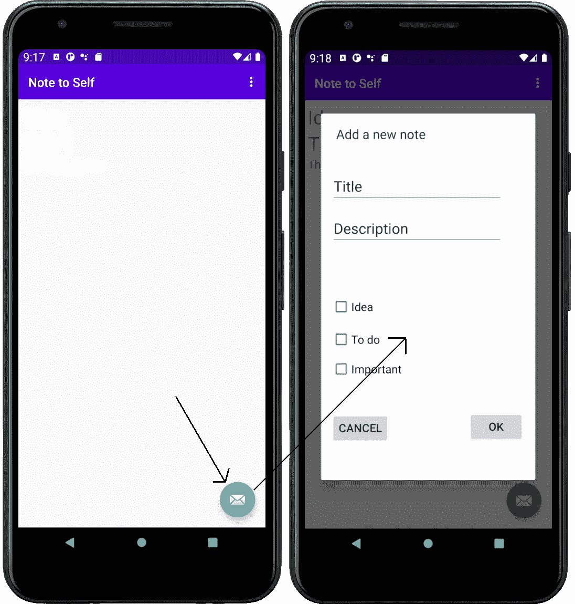
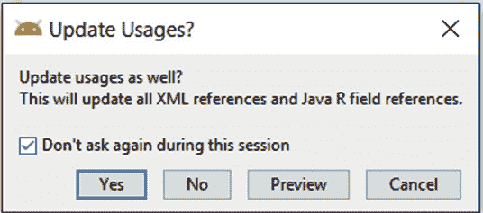
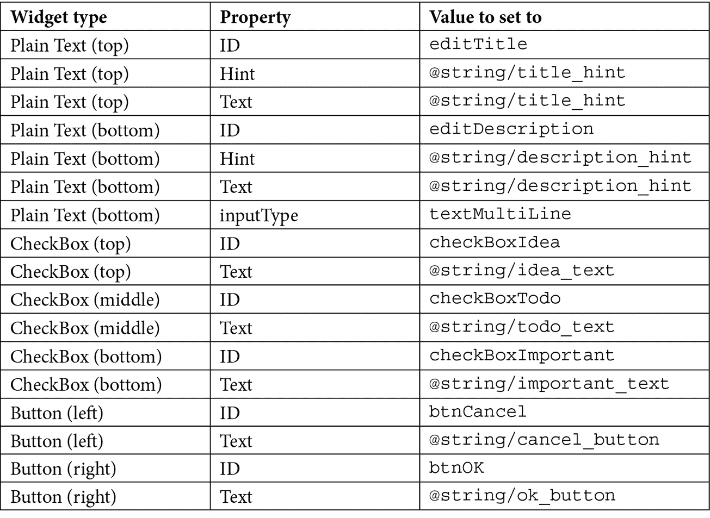
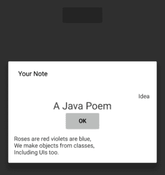

# 第十四章：*第十四章*：Android 对话框窗口

在本章中，我们将学习如何向用户呈现弹出对话框窗口。然后，我们可以将我们所知道的全部内容放入我们的第一个应用程序**Note to Self**的第一阶段。接下来的四章（直到*第十八章**,* *本地化*）中，我们将探索最新的 Android 和 Java 功能，并利用我们新获得的知识来增强 Note to Self 应用程序的每个阶段。

每一章还将构建一系列与此主要应用程序分开的较小的应用程序。那么，这一章对您有什么意义呢？好吧，我们将涵盖以下主题：

+   使用弹出对话框框架创建一个简单的应用程序

+   使用`DialogFragment`类开始 Note to Self 应用程序

+   在我们的项目中添加字符串资源，而不是在布局中硬编码文本

+   首次使用 Android 命名约定，使我们的代码更易读

+   实现更复杂的对话框以捕获用户输入

让我们开始吧。

# 技术要求

您可以在 GitHub 上找到本章中的代码文件，网址为[`github.com/PacktPublishing/Android-Programming-for-Beginners-Third-Edition/tree/main/chapter%2014`](https://github.com/PacktPublishing/Android-Programming-for-Beginners-Third-Edition/tree/main/chapter%2014)。

# 对话框窗口

在我们的应用程序中，我们经常需要在弹出窗口中向用户显示一些信息，甚至要求确认某个操作。这就是所谓的**对话框**窗口。如果您快速扫描 Android Studio 中的调色板，您可能会惊讶地发现根本没有提到对话框。

在 Android 中，对话框比简单的小部件甚至整个布局更高级。它们是可以拥有自己的布局和其他**用户界面**（**UI**）元素的类。

在 Android 中创建对话框窗口的最佳方式是使用`FragmentDialog`类。

注意

片段是 Android 中一个广泛而重要的主题，我们将在本书的后半部分花费大量时间来探索和使用它们。

为用户创建一个整洁的弹出对话框（使用`FragmentDialog`）是对片段的一个很好的介绍，而且一点也不复杂。

## 创建对话框演示项目

我们之前提到，在 Android 中创建对话框的最佳方式是通过`FragmentDialog`类。

为此，在 Android Studio 中使用空活动模板创建一个新项目，并将其命名为`Dialog Demo`。正如您所期望的那样，该项目的完整代码位于下载包的*第十四章*`/Dialog Demo`文件夹中。

## 编写一个 DialogFragment 类

通过右键单击包含`MainActivity.java`文件的包名称（与`MainActivity.java`文件相同的包名称）在 Android Studio 中创建一个新类。选择`MyDialog`。按下*Enter*键创建类。

首先要做的是将类声明更改为扩展`DialogFragment`。完成后，您的新类应该类似于以下代码块：

```kt
public class MyDialog extends DialogFragment {    
}
```

现在，让我们一点一点地向这个类添加代码，并解释每一步发生了什么。现在，我们需要导入`DialogFragment`类。您可以通过按住*Alt*键然后点击*Enter*，或者在`MyDialog.java`文件顶部的包声明之后添加以下突出显示的代码行来实现这一点：

```kt
package com.gamecodeschool.dialogdemo;
import androidx.fragment.app.DialogFragment;
public class MyDialog extends DialogFragment {
}
```

就像在 Android API 中的许多类一样，`DialogFragment`为我们提供了可以重写以与该类发生的不同事件交互的方法。

添加以下突出显示的代码以重写`onCreateDialog`方法。仔细研究它，我们将在下一步中检查发生了什么：

```kt
public class MyDialog extends DialogFragment {
   @Override
   public Dialog onCreateDialog(Bundle savedInstanceState) {
// Use the Builder class because this dialog 
   // has a simple UI
AlertDialog.Builder builder = 
          new AlertDialog.Builder(getActivity());
   }
}
```

您需要按照通常的方式导入`Dialog`、`Bundle`和`AlertDialog`类，或者通过手动添加以下突出显示的代码来导入：

```kt
import android.app.Dialog;
import android.os.Bundle;
import androidx.appcompat.app.AlertDialog;
import androidx.fragment.app.DialogFragment;
```

注意

代码中仍然有一个错误，因为我们忘记了 onCreateDialog 方法的 return 语句。当我们完成了方法的其余部分编码后，我们将在稍后添加这个 return 语句。

在前面的代码中，我们首先添加了重写的 onCreateDialog 方法。当我们稍后通过 MainActivity 类中的代码向用户显示对话框时，Android 将调用此方法。

然后，在 onCreateDialog 方法内部，我们得到了一个新的类。我们声明并初始化了一个 AlertDialog.Builder 类型的对象，它需要 MainActivity 的引用传递给它的构造函数。这就是为什么我们使用 getActivity()方法作为参数。

getActivity 方法是 Fragment 类（因此也是 DialogFragment）的一部分，它返回一个对 Activity 的引用，该 Activity 将创建 DialogFragment。在这种情况下，就是我们的 MainActivity 类。

现在我们已经声明并初始化了 builder，让我们看看我们可以用 builder 做些什么。

### 使用链接配置 DialogFragment

现在我们可以使用 builder 对象来完成其余的工作。在下面的代码片段中有一些奇怪的地方。如果您快速扫描下面的三个代码块，您会注意到缺少分号`;`。事实上，这三个代码块对于编译器来说只是一行。

我们以前见过这种情况，但情况没有那么明显；也就是说，当我们创建一个 Toast 消息并在其末尾添加.show()方法时。这被称为链接。这是指我们在同一个对象上按顺序调用多个方法。这相当于编写多行代码；只是这种方式更简洁。

在我们添加的先前代码之后，在 onCreateDialog 方法中添加以下代码（使用链接）。检查新代码，我们将在下面讨论它：

```kt
// Dialog will have "Make a selection" as the title
builder.setMessage("Make a selection")

// An OK button that does nothing
.setPositiveButton("OK", new DialogInterface.OnClickListener() {
   public void onClick(DialogInterface dialog, int id) {
          // Nothing happening here
   }
})
// A "Cancel" button that does nothing 
.setNegativeButton("Cancel", new DialogInterface.OnClickListener() {

   public void onClick(DialogInterface dialog, int id) {
          // Nothing happening here either

   }

});
```

此时，您需要导入 DialogInterface 类。使用 Alt | Enter 技术，或者在其他 import 语句中添加以下代码行：

```kt
import android.content.DialogInterface;
```

以下是我们刚刚添加的代码的每个部分的解释：

1.  在三个使用链接的代码块中的第一个代码块中，我们调用 builder.setMessage。这将设置用户在对话框中看到的主要消息。另外，请注意，可以在链接方法调用的各个部分之间添加注释，因为编译器会忽略这些注释。

1.  然后，我们使用.setPositiveButton 方法向对话框添加一个按钮，该方法的第一个参数将按钮的文本设置为“确定”。第二个参数是一个匿名类，称为 DialogInterface.OnClickListener，它处理按钮的任何点击。请注意，我们不打算向 onClick 方法添加任何代码。在这里，我们只是想看到这个简单的对话框；我们将在下一个项目中进一步进行。

1.  接下来，我们在同一个 builder 对象上调用另一个方法。这次是 setNegativeButton 方法。同样，两个参数将“取消”设置为按钮的文本，并添加一个匿名类来监听点击。同样，出于演示目的，我们不会在重写的 onClick 方法中采取任何行动。在调用 setNegativeButton 方法之后，我们最终看到一个分号标记着代码行的结束。

最后，我们将编写 return 语句以完成该方法，并消除我们一开始就有的错误。在 onCreateDialog 方法的最后（但在最终大括号内部）添加 return 语句，如下面的代码片段所示：

```kt
…
// Create the object and return it
return builder.create();
}// End of onCreateDialog
```

这行代码的最后效果是将我们新的、完全配置好的对话框窗口返回给 MainActivity 类（它首先调用 onCreateDialog 方法）。我们将稍后检查并添加这个调用代码。

现在，我们有了扩展 FragmentDialog 的 MyDialog 类。我们所需要做的就是声明一个 MyDialog 的实例，实例化它，并调用它重写的 createDialog 方法。

## 使用 DialogFragment 类

在转向代码之前，让我们向布局中添加一个按钮。执行以下步骤：

1.  切换到`activity_main.xml`标签，然后切换到**设计**标签。

1.  拖动`id`属性设置为`button`。

1.  点击`MyDialog`类是目前的关键课程。

现在切换到`MainActivity.java`标签，我们将使用匿名类处理对这个新按钮的点击，就像我们在*第十三章*中的*匿名类 - 让 Android 小部件活跃*中的 Widget Exploration 应用程序中所做的那样。我们这样做是因为布局中只有一个按钮，这似乎比实现更复杂的`OnClickListener`接口替代方案更合理和更紧凑（就像我们在*第十二章*中为 Java Meet UI 演示应用程序所做的那样，*堆栈、堆和垃圾收集器*）。

请注意，在以下代码块中，匿名类与我们先前为其实现了接口的类型完全相同。将此代码添加到`onCreate`方法中：

```kt
/*
   Let's listen for clicks on our regular Button.
   We can do this with an anonymous class.
*/
Button button = (Button) findViewById(R.id.button);
button.setOnClickListener(
   new View.OnClickListener() {

         @Override
         public void onClick(View v) {
                // We only handle one button
                // Therefor no switching required
                MyDialog myDialog = new MyDialog();
                myDialog.show(getSupportFragmentManager(), 
                "123");
                // This calls onCreateDialog
                // Don't worry about the strange looking 
                   123
                // We will find out about this in chapter 
                   18
         }
   }
);
```

注意

以下`import`语句是此代码所需的：

`import android.view.View;`

`import android.widget.Button;`

请注意，代码中唯一发生的事情是`onClick`方法创建了`MyDialog`的一个新实例，并调用了它的`show`方法。毫不奇怪，这将显示我们的对话框窗口，就像我们在`MyDialog`类中配置的那样。

`show`方法需要一个对`FragmentManager`的引用，我们可以使用`getSupportFragmentManager`来获取。这是跟踪和控制活动的所有`Fragment`实例的类。我们还传入一个标识符：`"123"`。

当我们更仔细地查看片段时，将会透露有关`FragmentManager`的更多细节。我们将在*第二十章*的*Android 片段*部分进行。*绘图图形*。

注意

我们使用`getSupportFragmentManager`方法的原因是，我们通过扩展`AppCompatActivity`来支持旧设备。如果我们简单地扩展`Activity`，那么我们可以使用`getFragmentManager`类。缺点是应用程序将无法在许多设备上运行。

现在我们可以运行应用程序，并欣赏我们的新对话框窗口，当我们点击布局中的按钮时它会出现。请注意，单击对话框窗口中的任一按钮都将关闭它。这是默认行为。以下截图显示了我们的对话框在 Pixel C 平板模拟器上的运行情况：


图 14.01 - 对话框在运行中

接下来，我们将制作另外两个实现对话框的类，作为我们多章节的*Note to Self*应用的第一阶段。我们将了解到对话框窗口几乎可以有我们选择的任何布局，而不必依赖于`Dialog.Builder`类给我们的简单布局。

# *Note to Self*应用程序

欢迎来到我们将在本书中实施的三个主要应用程序中的第一个。当我们执行这些项目时，我们将比较专业地执行它们。我们将使用 Android 命名约定、字符串资源和适当的封装。

有时，当您试图学习新的 Android/Java 主题时，这些东西可能会有些过度。然而，它们是有用的，尽快在真实项目中开始使用它们是很重要的。最终，它们会变得自然而然，我们的应用程序质量会受益。

## 使用命名约定和字符串资源

在*第三章*中，*探索 Android Studio 和项目结构*，我们讨论了在布局文件中使用字符串资源而不是硬编码文本。这样做有一些好处，但也相对冗长。

由于这是我们的第一个真实项目，现在是一个很好的时机以正确的方式做事，这样我们就可以获得这样做的经验。如果您想快速了解字符串资源的好处，请返回*第三章*，*探索 Android Studio 和项目结构*。

命名约定是我们代码中用于命名变量、方法和类的约定或规则。在本书中，我们已经宽松地应用了 Android 的命名约定。由于这是我们的第一个真实应用程序，我们将在应用这些命名约定时稍微严格一些。

特别要注意的是，当变量是类的成员时，我们将使用小写的`m`作为前缀。

注意

您可以在 https://source.android.com/source/code-style.html 找到有关 Android 命名约定和代码风格的更多信息。

## 如何获取“Note to Self”应用程序的代码文件

完整的应用程序，包括所有代码和资源，可以在*第十八章*`/Note to self`文件夹中找到下载包中。由于我们将在接下来的五章中实现此应用程序，因此在每章结束时查看部分完成的可运行应用程序可能会有所帮助。部分完成的可运行应用程序及其所有相关代码和资源可以在各自的文件夹中找到：

*第十四章*`/Note to self`

*第十六章*`/Note to self`

*第十七章*`/Note to self`

*第十八章*`/Note to self`

注意

*第十五章*中没有“Note to Self”代码，*数组映射和随机数*。这是因为，即使我们将学习“Note to Self”中使用的主题，我们也不会在*第十六章*中进行任何更改，*适配器和回收器*。

如果您正在跟着做，并打算从头到尾构建“Note to Self”应用程序，我们将构建一个名为`Note to self`的项目。但是，这并不妨碍您随时查看每章项目的代码文件，进行一些复制和粘贴。只是要注意，在说明的各个时间点，您将被要求删除或替换前一章的偶尔一行代码。

因此，即使您复制和粘贴的次数多于编写代码的次数，请务必全文阅读说明，并参考书中的代码，以获取可能有用的额外注释。

在每一章中，代码将被呈现为如果您已经完全完成了上一章，将显示来自早期章节的代码，必要时作为我们新代码的有用上下文。

每一章都不会完全致力于“Note to Self”应用程序 - 我们将学习其他通常相关的事物，并构建一些更小/更简单的应用程序。因此，当我们开始“Note to Self”实现时，理论上我们将为此做好准备。

## 完成的应用程序

以下屏幕截图来自已完成的应用程序。当然，在开发的各个阶段，它看起来会略有不同。必要时，我们将参考更多屏幕截图，作为提醒或查看开发过程中的差异。

完成的应用程序将允许用户点击应用程序右下角的浮动操作按钮，以打开对话框窗口添加新的便签。以下屏幕截图显示了此功能的突出显示：



图 14.02 - 浮动操作按钮

在左侧，您可以查看要点击的按钮，在右侧，您可以查看用户可以添加新便签的对话框窗口。

最终，随着用户添加更多的笔记，他们将在应用程序的主屏幕上拥有所有已添加的笔记的列表，如下屏幕截图所示。用户可以选择笔记是**重要**，**想法**和/或**待办事项**：


图 14.03 –主屏幕上的笔记

您将能够滚动列表并点击一个笔记，以在专门用于该笔记的另一个对话框窗口中查看它。以下屏幕截图显示了显示笔记的对话框窗口：


图 14.04 –显示所选笔记

还将有一个简单（即非常简单）的**设置**屏幕，可以从菜单中访问。它将允许用户配置笔记列表是否以分隔线格式化。以下是**设置**菜单选项的操作：


图 14.05 –设置菜单选项

现在我们确切地知道我们要构建什么，我们可以继续并开始实施它。

## 构建项目

现在让我们创建我们的新项目。使用基本活动模板。正如我们在*第三章*中讨论的那样，*探索 Android Studio 和项目结构*，此模板将生成一个简单的菜单和一个浮动操作按钮，这两者都在此项目中使用。将项目命名为`Note to Self`。

## 准备字符串资源

在这里，我们将创建所有的字符串资源，我们将从布局文件中引用它们，而不是硬编码 UI 小部件的`text`属性，这是我们一直在做的。

要开始，请在项目资源管理器中的`res/values`文件夹中打开`strings.xml`文件。您将看到自动生成的资源。添加以下突出显示的字符串资源，我们将在项目的其余部分中在应用程序中使用它们。在闭合的`</resources>`标签之前添加以下代码：

```kt
...
<resources>
    <string name="app_name">Note to Self</string>
    <string name="action_settings">Settings</string>
    <!-- Strings used for fragments for navigation -->
    <string name="first_fragment_label">First 
               Fragment</string>
    <string name="second_fragment_label">Second 
               Fragment</string>
    <string name="next">Next</string>
    <string name="previous">Previous</string>
    <string name="hello_first_fragment">Hello first 
               fragment</string>
    <string name="hello_second_fragment">Hello second 
               fragment. Arg: %1$s</string>
    <string name="action_add">add</string>
    <string name="title_hint">Title</string>
    <string name="description_hint">Description</string>
    <string name="idea_text">Idea</string>
    <string name="important_text">Important</string>
    <string name="todo_text">To do</string>
    <string name="cancel_button">Cancel</string>
    <string name="ok_button">OK</string>

    <string name="settings_title">Settings</string>
    <string name="theme_title">Theme</string>
    <string name="theme_light">Light</string>
    <string name="theme_dark">Dark</string>
</resources>
```

在上述代码中，请注意每个字符串资源都有一个唯一的`name`属性，它使其与所有其他字符串资源区分开，并提供一个有意义的、有希望的、可记住的线索，以表示它所代表的实际字符串值。正是这些名称值，我们将在布局文件中引用。

我们将不需要再访问这个文件了。

## 编写 Note 类

这是应用程序的基本数据结构。这是一个我们将从头开始编写的类，它具有我们需要表示用户笔记之一的所有成员变量。在*第十五章*中，*数组映射和随机数*，我们将学习一些新的 Java，以便了解如何让用户拥有数十、数百甚至数千条笔记。

通过右键单击与您的包名称相同的文件夹来创建一个新类。预期的是，它也包含`MainActivity.java`文件。选择`Note`。按下*Enter*键创建类。

将以下突出显示的代码添加到新的`Note`类中：

```kt
public class Note {
    private String mTitle;
    private String mDescription;
    private boolean mIdea;
    private boolean mTodo;
    private boolean mImportant;
}
```

请注意，根据 Android 约定，我们的成员变量名都以`m`为前缀。另外，我们不希望任何其他类直接访问这些变量，所以它们都声明为`private`。

因此，我们将需要为我们的每个成员添加一个 getter 和一个 setter 方法。将以下 getter 和 setter 方法添加到`Note`类中：

```kt
public String getTitle() {
   return mTitle;
}
public void setTitle(String mTitle) {
   this.mTitle = mTitle;
}
public String getDescription() {
   return mDescription;
}
public void setDescription(String mDescription) {
   this.mDescription = mDescription;
}
public boolean isIdea() {
   return mIdea;
}
public void setIdea(boolean mIdea) {
   this.mIdea = mIdea;
}
public boolean isTodo() {
   return mTodo;
}
public void setTodo(boolean mTodo) {
   this.mTodo = mTodo;
}
public boolean isImportant() {
   return mImportant;
}
public void setImportant(boolean mImportant) {
   this.mImportant = mImportant;
}
```

在上述列表中有相当多的代码，但没有什么复杂的。每个方法都指定了`public`访问权限，因此可以被任何具有对`Note`类型对象的引用的其他类使用。此外，对于每个变量，都有一个名为`get...`的方法和一个名为`set...`的方法。布尔类型变量的 getter 命名为`is...`。如果你仔细想想，这是一个合乎逻辑的名字，因为返回的答案要么是 true，要么是 false。

每个 getter 都只返回相关变量的值。每个 setter 都将相关变量的值设置为传递给方法的任何值。

注意

实际上，我们应该稍微增强我们的 setter，以确保传入的值在合理范围内。例如，我们可能希望检查并强制执行`String mTtile`和`String mDescription`的最大或最小长度。这留作读者的练习回来完成。

让我们设计这两个对话框窗口的布局。

## 实施对话框设计

现在，我们将做一些我们以前做过很多次的事情，但这次是出于新的原因。正如我们所知，我们将有两个对话框窗口：一个用于用户输入新的笔记，另一个用于查看他们选择的笔记。

我们可以以与我们设计所有先前布局相同的方式设计这两个对话框窗口的布局。当我们开始为`FragmentDialog`类创建 Java 代码时，我们将学习如何将这些布局结合起来。

首先，让我们为“新笔记”对话框添加一个布局。执行以下步骤：

1.  右键单击`dialog_new_note`以选择**文件名：**字段。

1.  默认情况下，左键单击`ConstraintLayout`类型，作为其根元素。

1.  在按照以下说明进行操作时，请参考目标设计图。我已经使用 Photoshop 完成了布局，包括我们即将自动生成的约束条件，以及隐藏约束条件以增加清晰度的布局：

图 14.06 – 新笔记的完成布局

1.  从**文本**类别中拖放一个**纯文本**小部件到布局的左上角。然后，在其下方添加另一个**纯文本**小部件。暂时不用担心任何属性。

1.  从**按钮**类别中拖放三个**复选框**小部件，一个放在另一个下面。查看之前的参考图以获得指导。现在，暂时不用担心任何属性。

1.  将两个**按钮**拖放到布局中。第一个将直接放在上一步中最后一个**复选框**小部件的下方；第二个将水平放置，与第一个**按钮**对齐，但在布局的右侧。

1.  整理布局，使其尽可能接近参考设计图。然后，点击**推断约束条件**按钮来修复您选择的位置。

1.  现在，我们可以设置所有的`text`、`id`和`hint`属性。您可以使用以下表格中的值来完成这一步。请记住，我们正在使用字符串资源来为`text`和`hint`属性赋值：

注意

当您编辑第一个`id`属性（接下来我们将要做的）时，可能会弹出一个窗口询问您是否确认更改。勾选**本次会话中不再询问**框，然后点击**是**继续：



图 14.07 – 确认更改



我们现在有一个有组织的布局，准备好供我们的 Java 代码显示。确保您记住不同小部件的`id`属性值。当我们编写 Java 代码时，我们将看到它们的作用。重要的是，我们的布局看起来很好，并且每个相关项目都有一个`id`属性值，这样我们就可以引用它。

让我们创建“显示笔记”对话框的布局：

1.  右键单击`dialog_show_note`以选择**文件名：**字段。

1.  默认情况下，左键单击`ConstraintLayout`类型以选择其根元素。

1.  在按照以下说明进行操作时，请参考目标设计图。我已经使用 Photoshop 完成了布局，包括我们即将自动生成的约束条件，以及隐藏约束条件以增加清晰度的布局：

图 14.08 - 显示笔记对话框的完成布局

1.  首先，拖放三个**TextView**小部件，使它们在布局顶部垂直对齐。

1.  接下来，拖放另一个`TextView`小部件。

1.  在上一个小部件的下方但靠左添加另一个**TextView**小部件。

1.  现在在布局的中心水平放置一个**Button**，但靠近底部。

1.  整理布局，使其尽可能接近参考图表，然后点击**Infer Constraints**按钮来修复你选择的位置。

1.  配置以下表中的属性：


注意

你可能想要通过稍微拖动它们来调整一些 UI 元素的最终位置，因为我们调整了它们的大小和内容。首先，点击`btnOK`到按钮 ID，可能会弹出一个对话框说这个 ID 已经存在，点击**Continue**来忽略弹出窗口。

现在我们有一个布局，可以用来向用户显示一个笔记。请注意，我们可以重复使用一些字符串资源。我们的应用程序变得越来越大，以这种方式做事情就越有益处。

## 编写对话框

现在我们已经为我们的两个对话框窗口（“显示笔记”和“新笔记”）设计好了，我们可以利用我们对`FragmentDialog`类的了解来实现一个类来代表用户可以交互的每个对话框窗口。

我们将从“新笔记”屏幕开始。

### 编写 DialogNewNote 类

通过右键单击包含所有`.java`文件的项目文件夹，选择`DialogNewNote`来创建一个新类。

首先，更改类声明并扩展`DialogFragment`。然后，重写`onCreateDialog`方法，这是这个类中所有其余代码的位置。为了实现这一点，确保你的代码与以下代码片段相同：

```kt
public class DialogNewNote extends DialogFragment { 
   @Override
   public Dialog onCreateDialog(Bundle savedInstanceState) {

         // All the rest of the code goes here

   }
}
```

注意

你还需要添加这些新的导入：

`import androidx.fragment.app.DialogFragment;`

`import android.app.Dialog;`

`import android.os.Bundle;`

我们暂时在新类中有一个错误，因为我们需要一个`return`语句；然而，我们马上就会解决这个问题。

在下一段代码中，首先，我们声明并初始化一个`AlertDialog.Builder`对象，方式与我们之前创建对话框窗口时一样。然而，这一次，我们将比以前更少地依赖这个对象。

接下来，我们初始化一个`LayoutInflater`对象，我们将使用它来填充我们的 XML 布局。通过“填充”，我们只是指的是如何将我们的 XML 布局转换为 Java 对象。一旦完成了这一步，我们就可以以通常的方式访问所有的小部件。我们可以将`inflater.inflate`方法视为替换对话框的`setContentView`方法。然后，在第二行，我们使用`inflate`方法做到了这一点。

添加我们刚刚讨论的三行代码：

```kt
AlertDialog.Builder builder = 
   new AlertDialog.Builder(getActivity());
LayoutInflater inflater = 
   getActivity().getLayoutInflater();

View dialogView = 
   inflater.inflate(R.layout.dialog_new_note, null);
```

注意

为了使用前面三行代码中的新类，你需要添加以下`import`语句：

`import androidx.appcompat.app.AlertDialog;`

`import android.view.View;`

`import android.view.LayoutInflater;`

现在我们有一个名为`dialogView`的`View`对象，它包含了我们的`dialog_new_note.xml`布局文件中的所有 UI 元素。

在上一段代码之后，我们将添加下面的代码块，接下来我们将解释。

这段代码将以通常的方式获取每个 UI 小部件的引用。以下代码中的许多对象被声明为`final`，因为它们将被用于匿名类，正如我们之前学到的那样，这是必要的。请记住，它是引用是`final`的（也就是说，它不能改变）；我们仍然可以改变它们指向的堆上的对象。 

在上一段代码之后添加以下代码：

```kt
final EditText editTitle = 
dialogView.findViewById(R.id.editTitle);
final EditText editDescription = 
dialogView.findViewById(R.id.editDescription);
final CheckBox checkBoxIdea =
dialogView.findViewById(R.id.checkBoxIdea);
final CheckBox checkBoxTodo =
dialogView.findViewById(R.id.checkBoxTodo);
final CheckBox checkBoxImportant = 
dialogView.findViewById(R.id.checkBoxImportant);
Button btnCancel = 
dialogView.findViewById(R.id.btnCancel);
Button btnOK = 
dialogView.findViewById(R.id.btnOK);
```

注意

添加以下`import`代码语句，使你刚刚添加的代码无错误：

`import android.widget.Button;`

`import android.widget.CheckBox;`

`import android.widget.EditText;`

在下一个代码块中，我们将使用`builder`（我们的构建器实例）设置对话框的消息。然后，我们将编写一个匿名类来处理对`btnCancel`按钮的点击。在重写的`onClick`方法中，我们将简单地调用`dismiss()`，这是`DialogFragment`的一个公共方法，用于关闭对话框窗口。如果用户单击**取消**，这正是我们需要的。

添加我们刚讨论过的以下代码：

```kt
builder.setView(dialogView).setMessage("Add a new note");
// Handle the cancel button
btnCancel.setOnClickListener( new View.OnClickListener() {
   @Override
   public void onClick(View v) {
         dismiss();
   }
});
```

现在，我们将添加一个匿名类来处理用户单击`btnOK`时发生的情况。

首先，我们创建了一个名为`newNote`的新`Note`实例。然后，我们将`newNote`的每个成员变量设置为表单的适当内容。

在此之后，我们做了一些新的事情。我们使用`getActivity`方法创建对`MainActivity`类的引用。然后，我们使用该引用调用`MainActivity`中的`createNewNote`方法。

注意

请注意，我们还没有编写`createNewNote`方法，直到本章后面我们才会这样做。

发送到此方法的参数是我们新初始化的`newNote`对象。这将使用户的新笔记发送回`MainActivity`。我们将在本章后面学习如何处理这个。

最后，我们调用`dismiss`来关闭对话框窗口。

在前面的代码之后添加我们刚讨论过的以下代码：

```kt
btnOK.setOnClickListener(new View.OnClickListener() {

   @Override
   public void onClick(View v) {

         // Create a new note
         Note newNote = new Note();
         // Set its variables to match the 
         // user's entries on the form
         newNote.setTitle(editTitle.
                getText().toString());

         newNote.setDescription(editDescription.
                getText().toString());

         newNote.setIdea(checkBoxIdea.isChecked());
         newNote.setTodo(checkBoxTodo.isChecked());
         newNote.setImportant(checkBoxImportant.
                isChecked());
         // Get a reference to MainActivity
         MainActivity callingActivity = 
                (MainActivity) getActivity();

         // Pass newNote back to MainActivity
         callingActivity.createNewNote(newNote);
         // Quit the dialog
         dismiss();
   }
});
return builder.create();
```

这是我们的第一个对话框。我们还没有将其连接到`MainActivity`中，我们还需要实现`createNewNote`方法。我们将在创建下一个对话框后立即执行此操作。

### 编写 DialogShowNote 类

通过右键单击包含所有`.java`文件的项目文件夹并选择`DialogShowNote`来创建一个新类。

首先，更改类声明并扩展`DialogFragment`。然后，重写`onCreateDialog`方法。由于该类的大部分代码都在`onCreateDialog`方法中，因此实现签名和空主体，如下面的代码片段所示，我们稍后会重新访问它。

请注意，我们声明了一个`Note`类型的成员变量`mNote`。添加`sendNoteSelected`方法和初始化`mNote`的一行代码。此方法将由`MainActivity`调用，并将用户单击的`Note`对象传递给它。

添加我们刚讨论过的代码。然后，我们可以查看并编写`onCreateDialog`的细节：

```kt
public class DialogShowNote extends DialogFragment {
    private Note mNote;
    @Override
    public Dialog onCreateDialog(Bundle savedInstanceState) {
        // All the other code goes here
    }
    // Receive a note from the MainActivity
    public void sendNoteSelected(Note noteSelected) {
        mNote = noteSelected;
    }
}
```

注意

此时，您需要导入以下类：

`import android.app.Dialog;`

`import android.os.Bundle;`

`import androidx.fragment.app.DialogFragment;`

接下来，我们声明并初始化了一个`AlertDialog.Builder`的实例。另外，就像我们对`DialogNewNote`类所做的那样，我们声明并初始化了一个`LayoutInflater`实例，然后使用它来创建一个具有对话框布局的`View`对象。在这种情况下，它是来自`dialog_show_note.xml`的布局。

最后，在以下代码中，我们获取对每个 UI 小部件的引用，并将`text`属性设置为`mNote`的适当成员变量的`txtTitle`和`textDescription`，该成员变量在`sendNoteSelected`方法中初始化。

将我们刚讨论过的代码添加到`onCreateDialog`方法中：

```kt
// All the other code goes here
AlertDialog.Builder builder = 
      new AlertDialog.Builder(getActivity());
LayoutInflater inflater = 
      getActivity().getLayoutInflater();

View dialogView = 
      inflater.inflate(R.layout.dialog_show_note, null);
TextView txtTitle = 
       dialogView.findViewById(R.id.txtTitle);
TextView txtDescription = 
       dialogView.findViewById(R.id.txtDescription);
txtTitle.setText(mNote.getTitle());
txtDescription.setText(mNote.getDescription());
TextView txtImportant = 
       dialogView.findViewById(R.id.textViewImportant);
TextView txtTodo = 
       dialogView.findViewById(R.id.textViewTodo);
TextView txtIdea = 
       dialogView.findViewById(R.id.textViewIdea);
```

注意

添加以下`import`语句，以便前面代码中的所有类都可用：

`import android.view.LayoutInflater;`

`import android.view.View;`

`import android.widget.TextView;`

`import androidx.appcompat.app.AlertDialog;`

我们将添加的以下代码也在`onCreateDialog`方法中。它检查所显示的笔记是否“重要”，然后相应地显示或隐藏`txtImportant TextView`。然后我们对`txtTodo`和`txtIdea`做同样的事情。

在仍然在`onCreateDialog`方法中时，在前一个代码块之后添加此代码：

```kt
if (!mNote.isImportant()){
   txtImportant.setVisibility(View.GONE);
}
if (!mNote.isTodo()){
   txtTodo.setVisibility(View.GONE);
}
if (!mNote.isIdea()){
   txtIdea.setVisibility(View.GONE);
}
```

现在，当用户单击`onClick`方法时，我们只需要`dismiss`（关闭）对话框窗口，该方法简单地调用`dismiss`方法，关闭对话框窗口。

在上一个代码块之后，将此代码添加到`onCreateDialog`方法中：

```kt
Button btnOK = (Button) dialogView.findViewById(R.id.btnOK);
builder.setView(dialogView).setMessage("Your Note");
btnOK.setOnClickListener(new View.OnClickListener() {
   @Override
   public void onClick(View v) {
         dismiss();
   }
});
return builder.create();
```

注意

使用这行代码导入`Button`类：

`import android.widget.Button;`

我们现在有两个准备就绪的对话框窗口。我们只需要向`MainActivity`类添加一些代码来完成工作。首先，让我们进行一些项目清理。

### 删除不需要的自动生成片段

现在我们将整理项目的文件和结构。请记住，我们用于生成此项目的基本活动模板具有许多功能。有些是我们需要的，而有些则不需要。我们希望浮动操作按钮位于布局的右下角，并且希望主菜单与`content_main.xml`文件一起，我们将删除对片段的引用以及其所有导航选项。

打开`content_main.xml`布局文件。在`content_main.xml`文件中，找到**nav_host_fragment**元素。选择它，然后按键盘上的*Delete*键。现在，我们有一个更干净的 UI，可以用于未来的开发。

## 显示我们的新对话框

打开`MainActivity.java`文件。在`MainActivity`类声明之后添加一个新的临时成员变量。这不会出现在最终的应用程序中；这样我们就可以尽快测试我们的对话框窗口：

```kt
// Temporary code
Note mTempNote = new Note();
```

现在，将此方法添加到`MainActivity`类中，以便我们可以从`DialogNewNote`类接收一个新的笔记：

```kt
public void createNewNote(Note n){
   // Temporary code
   mTempNote = n;
}
```

要将笔记发送到`DialogShowNote`方法，我们需要在`content_main.xml`布局文件中添加一个 ID 为`button`的按钮。打开`content_main.xml`布局文件。

为了清楚起见，我们将把这个按钮的`text`属性更改为`Show Note`，如下所示：

+   将一个按钮拖放到`content_main.xml`布局中，并将`id`属性配置为`button`，`text`属性配置为`Show Note`。

+   单击**推断约束**按钮，使按钮停留在您放置的位置。此时此刻，此按钮的确切位置并不重要。

注意

只是为了澄清，这是一个用于测试目的的临时按钮，不会出现在最终的应用程序中。在开发结束时，我们将能够从滚动列表中点击笔记的标题。

在`onCreate`方法中，我们将设置一个匿名类来处理我们临时按钮的点击。`onClick`方法中的代码将执行以下操作：

+   创建一个名为`dialog`的新`DialogShowNote`实例。

+   在`dialog`上调用`sendNoteSelected`方法，将`mTempNote`作为参数传入，这是我们的`Note`对象。

+   最后，它将调用`show`，为我们的新对话框注入生命并展示给用户。

将我们刚刚描述的代码添加到`onCreate`中：

```kt
// Temporary code
Button button = findViewById(R.id.button);
button.setOnClickListener(new View.OnClickListener() {
   @Override
   public void onClick(View v) {
         // Create a new DialogShowNote called dialog
         DialogShowNote dialog = new DialogShowNote();

         // Send the note via the sendNoteSelected method
         dialog.sendNoteSelected(mTempNote);

         // Create the dialog
         dialog.show(getSupportFragmentManager(), "123");
   }
});
```

注意

使用这行代码添加`Button`类：

`import android.widget.Button;`

现在我们可以在点击按钮时召唤我们的`DialogShowNote`对话框窗口。运行应用程序，并点击具有`dialog_show_note.xml`布局的`DialogShowNote`对话框：


图 14.09 – DialogShowNote 对话框

承认，考虑到我们在本章中所做的大量编码，这并不是什么了不起的东西。然而，当我们让`DialogNewNote`类工作时，我们将能够看到`MainActivity`类如何在这两个对话框之间交互和共享数据。

接下来，让`DialogNewNote`对话框可用。

### 编写浮动操作按钮

这将很容易。浮动操作按钮已经在布局中为我们提供。提醒一下，浮动操作按钮是圆形图标，上面有一个信封图像，就像前面截图的右下角所示。

它在`activity_main.xml`文件中。这是定位和定义其外观的 XML 代码。请注意，在浮动操作按钮的代码之前，有一行代码（已突出显示）包括`content_main.xml`文件。这目前包含我们的**Show Note**按钮，并最终将包含我们复杂的滚动列表：

```kt
…
…
<include layout="@layout/content_main" />
<com.google.android.material
     .floatingactionbutton.FloatingActionButton

     android:id="@+id/fab"
     android:layout_width="wrap_content"
     android:layout_height="wrap_content"
     android:layout_gravity="bottom|end"
     android:layout_margin="@dimen/fab_margin"
     app:srcCompat="@android:drawable/ic_dialog_email" />
…
…
```

Android Studio 甚至提供了一个匿名类来处理浮动操作按钮上的任何点击。我们只需要向这个已提供的类的`onClick`方法添加一些代码，就可以使用`DialogNewNote`类。

浮动操作按钮通常用于应用程序中的核心操作。例如，在电子邮件应用程序中，它可能用于启动新的电子邮件。或者，在笔记应用程序中，它可能用于添加新的笔记。所以，现在让我们这样做。

在`MainActivity.java`文件中，找到 Android Studio 在`MainActivity`类的`onCreate`方法中提供的自动生成代码。以下是完整的代码：

```kt
fab.setOnClickListener(new View.OnClickListener() {
   @Override
   public void onClick(View view) {
            Snackbar.make(view, "Replace with your own 
action", 
                          Snackbar.LENGTH_LONG)
.setAction("Action", 
                          null).show();

   }
});
```

在上述代码片段中，请注意突出显示的行并将其删除。现在，在删除的代码位置添加以下代码：

```kt
DialogNewNote dialog = new DialogNewNote();
dialog.show(getSupportFragmentManager(), "");
```

新代码创建了一个`DialogNewNote`类型的新对话框窗口，然后显示给用户。

现在我们可以运行应用程序。点击浮动操作按钮，并添加一个类似于以下截图的笔记：


图 14.10 – 添加新笔记

接下来，我们可以点击**显示笔记**按钮，以在对话框中查看它，如下所示：



图 14.11 – 显示笔记对话框窗口

请注意，如果您添加第二个笔记，它将覆盖第一个，因为我们只有一个`Note`对象。我们需要学习更多的 Java 知识来解决这个问题。

# 总结

在本章中，我们讨论并实现了使用`DialogFragment`类的对话框窗口的常见 UI 设计。

然后，我们更进一步，通过实现更复杂的对话框来启动 Note to Self 应用程序，这些对话框可以从用户那里获取信息。我们看到`DialogFragment`类使我们能够在对话框中设计任何 UI。

在下一章中，我们将处理一个明显的问题，即用户只能有一个笔记。我们将通过探索 Java 数组及其近亲`ArrayList`，以及另一个与数据相关的 Java 类`Map`来解决这个问题。
