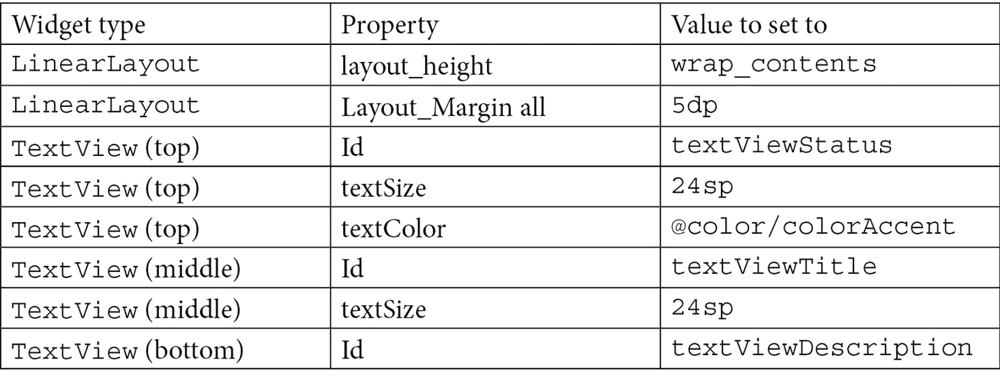
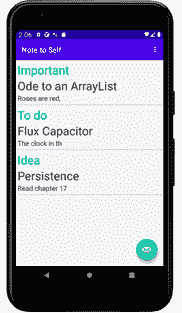

# 第十六章：*第十六章*：适配器和回收器

在这个简短的章节中，我们将取得很大进展。我们将首先学习适配器和列表的理论 - 如何在 Java 代码中扩展`RecyclerAdapter`类并添加一个作为列表的`RecyclerView`实例到我们的 UI - 然后通过 Android API 的明显魔术将它们绑定在一起，以便`RecyclerView`显示`RecyclerAdapter`的内容并允许用户滚动内容。你可能已经猜到，我们将使用这种技术来显示我们的 Note to Self 应用程序中的笔记列表。

在本章中，我们将涵盖以下内容：

+   研究适配器的理论并将其绑定到我们的 UI

+   使用`RecyclerView`实现布局

+   为在`RecyclerView`中使用的列表项布局

+   使用`RecyclerAdapter`实现适配器

+   将适配器绑定到`RecyclerView`

+   将笔记存储在`ArrayList`中，并在`RecyclerView`中显示它们

+   讨论如何进一步改进 Note to Self 应用程序

很快我们将拥有一个自我管理的布局，用来保存和显示所有的笔记，所以让我们开始吧。

# 技术要求

您可以在 GitHub 上找到本章的代码文件，网址为[`github.com/PacktPublishing/Android-Programming-for-Beginners-Third-Edition/tree/main/chapter%2016.`](https://github.com/PacktPublishing/Android-Programming-for-Beginners-Third-Edition/tree/main/chapter%2016 )

# RecyclerView 和 RecyclerAdapter

在*第五章*，*使用 CardView 和 ScrollView 创建美丽的布局*，我们使用了`ScrollView`，并用一些`CardView`小部件填充它，以便我们可以看到它滚动。我们可以利用我们刚学到的关于数组和`ArrayList`的知识，创建一个`TextView`小部件数组，用它们填充一个`ScrollView`，并在每个`TextView`中放置一个笔记的标题。这听起来像是在 Note to Self 应用程序中显示每个笔记的完美解决方案。

我们可以在 Java 代码中动态创建`TextView`小部件，将它们的`text`属性设置为笔记的标题，然后将`TextView`小部件添加到`ScrollView`中包含的`LinearLayout`中。然而，这并不完美。

## 显示大量小部件的问题

这可能看起来不错，但如果有数十、数百甚至数千个笔记怎么办？我们不能在内存中拥有数千个`TextView`小部件，因为 Android 设备可能会因为尝试处理如此大量的小部件和它们的数据而耗尽内存，或者至少变得非常缓慢。

现在，想象一下我们（我们确实想要）希望`ScrollView`中的每个笔记显示它是重要的、待办事项还是想法。以及笔记文本的简短片段呢？

我们需要设计一些聪明的代码，从多个`ArrayList`实例中加载和销毁`Note`对象和每个笔记的多个`TextView`小部件。这是可以做到的，但要高效地完成远非易事。

## 显示大量小部件的问题的解决方案

幸运的是，这是移动开发人员如此常见的问题，以至于 Android API 内置了解决方案。

我们可以在我们的 UI 布局中添加一个名为`RecyclerView`的单个小部件（类似于环保的`ScrollView`，但也带有助推器）。`RecyclerView`类被设计为解决我们讨论的问题的解决方案。此外，我们需要使用一种特殊类型的类与`RecyclerView`进行交互，该类了解`RecyclerView`的工作原理。

我们将使用适配器与之交互。我们将使用`RecyclerAdapter`类，扩展它，自定义它，然后使用它来控制我们的`ArrayList`实例（其中将保存我们的`Note`实例）的数据并在`RecyclerView`中显示它。

让我们更多地了解一下`RecyclerView`和`RecyclerAdapter`类的工作原理。

## 如何使用 RecyclerView 和 RecyclerAdapter

我们已经知道如何存储几乎无限的笔记；我们可以在`ArrayList`实例中这样做，尽管我们还没有实现它。我们也知道有一个名为`RecyclerView`的 UI 布局，专门设计用于从`ArrayList`实例中显示潜在的长列表数据。我们只需要看看如何将所有这些付诸实践。

要向我们的布局添加`RecyclerView`小部件，我们可以简单地从调色板上拖放它到我们的 UI 上，以通常的方式。现在不要这样做。让我们先讨论一下。

如果您在`content_main.xml`中的按钮下面添加了一个`RecyclerView`小部件，那么 UI 设计师中的`RecyclerView`小部件将如下所示：


图 16.1 - RecyclerView 小部件

然而，这种外观更多地代表了可能性，而不是应用程序的实际外观。如果我们在添加`RecyclerView`小部件后立即运行应用程序，我们只会得到一个`RecyclerView`小部件所在的空白区域。

要实际使用`RecyclerView`，我们需要做的第一件事是决定列表中的每个项目的外观。它可以是一个单独的`TextView`小部件，也可以是一个完整的布局。我们将使用`LinearLayout`。为了清晰和具体，我们将使用一个`LinearLayout`，它包含我们的`RecyclerView`中每个项目的三个`TextView`小部件。这将允许我们显示笔记状态（重要、想法或待办事项）、笔记标题以及来自实际笔记内容的短片段文本。

需要在其自己的 XML 文件中定义列表项，然后`RecyclerView`可以容纳此列表项布局的多个实例。

当然，这些都没有解释我们如何克服管理显示在哪个列表项中的数据的复杂性，以及如何从`ArrayList`中检索数据。

这些数据处理由我们自己定制的`RecyclerAdapter`类来处理。`RecyclerAdapter`类实现了`Adapter`接口。我们不需要知道`Adapter`内部是如何工作的；我们只需要重写必要的方法，然后`RecyclerAdapter`将负责与我们的`RecyclerView`小部件进行通信。

将`RecyclerAdapter`的实现连接到`RecyclerView`肯定比将 20 个`TextView`实例拖放到`ScrollView`上要复杂得多 - 但一旦完成，我们就可以忘记它，它将继续工作并自行管理，而不管我们向`ArrayList`中添加了多少笔记。它还具有处理诸如整洁格式和检测列表中点击了哪个项目等功能。

我们需要重写`RecyclerAdapter`类的一些方法，并添加一些我们自己的代码。

## 我们将如何使用 RecyclerAdapter 和笔记的 ArrayList 设置 RecyclerView

让我们先看一下所需步骤的概要，以便知道可以期望什么。为了使整个过程正常运行，我们将执行以下操作：

1.  删除临时按钮和相关代码，然后向我们的布局添加一个具有特定`id`属性的`RecyclerView`小部件。

1.  创建一个 XML 布局来表示列表中的每个项目。我们已经提到列表中的每个项目将是一个包含三个`TextView`小部件的`LinearLayout`。

1.  创建一个扩展`RecyclerAdapter`的新类，并向多个重写的方法添加代码，以控制其外观和行为，包括使用我们的列表项布局和充满`Note`实例的`ArrayList`。

1.  向`MainActivity`类添加代码，以使用`RecyclerAdapter`类和`RecyclerView`小部件，并将其绑定到我们的`ArrayList`实例。

1.  向`MainActivity`添加一个`ArrayList`以保存我们所有的笔记，并更新`createNewNote`方法，以将在`DialogNewNote`类中创建的任何新笔记添加到这个`ArrayList`中。

让我们详细地走一遍每一步。

# 向 Note to Self 项目添加 RecyclerView、RecyclerAdapter 和 ArrayList

打开“Note to Self”项目。作为提醒，如果您想要查看完成本章后的代码和工作中的应用程序，可以在*第十六章*`/Note to self`文件夹中找到。

注意

由于本章中所需的操作在不同的文件、类和方法之间跳转，我鼓励您通过在首选文本编辑器中保持打开以供参考的下载包中的文件来跟随。

## 删除临时的“显示笔记”按钮并添加 RecyclerView

接下来的几个步骤将清除我们在*第十四章**Android 对话框窗口*中添加的临时代码，并设置我们的`RecyclerView`小部件，以便在本章后面绑定到`RecyclerAdapter`：

1.  在`content_main.xml`文件中，删除之前为测试目的添加的 ID 为`button`的临时`Button`。

1.  在`MainActivity.java`文件的`onCreate`方法中，删除`Button`实例声明和初始化以及处理其点击的匿名类，因为此代码现在会创建错误。我们将在本章后面删除一些临时代码。删除以下代码：

```kt
// Temporary code
Button button = (Button) findViewById(R.id.button);
button.setOnClickListener(new View.OnClickListener() {
   @Override
   public void onClick(View v) {
         // Create a new DialogShowNote called dialog
         DialogShowNote dialog = new DialogShowNote();
         // Send the note via the sendNoteSelected 
         method
         dialog.sendNoteSelected(mTempNote);
         // Create the dialog
         dialog.show(getSupportFragmentManager(), 
         "123");
   }
});
```

1.  现在切换回设计视图中的`content_main.xml`文件，并从调色板的**容器**类别中拖放一个**RecyclerView**小部件到布局中。

1.  将其`id`属性设置为`recyclerView`。

现在我们已经从项目中删除了临时的 UI 方面，并且我们有了一个完整的`RecyclerView`小部件，具有一个准备从我们的 Java 代码中引用的唯一`id`值。

## 为 RecyclerView 创建列表项

接下来，我们需要一个布局来表示`RecyclerView`小部件中的每个项目。如前所述，我们将使用一个包含三个`TextView`小部件的`LinearLayout`。

使用以下步骤创建一个用于在我们的`RecyclerView`中使用的列表项：

1.  右键单击`LinearLayout`中的`listitem`。

1.  确保您在`orientation`属性上选择了`vertical`。

1.  查看下一个屏幕截图，以了解我们在本节剩余步骤中要实现的内容。我已经对其进行了注释，以显示完成应用程序中每个部分的内容：

图 16.2 - 用于在我们的 RecyclerView 中使用的列表项

1.  将三个`TextView`小部件拖放到布局中，依次排列。第一个（顶部）将保存笔记状态/类型（想法、重要或待办事项）。第二个（中间）将保存笔记标题，第三个（底部）将保存笔记本身的文本片段。

1.  根据以下表格配置`LinearLayout`和`TextView`小部件的各种属性：

现在我们有了一个用于主布局的`RecylerView`小部件和一个用于`RecyclerView`列表中每个项目的布局。我们可以继续编写我们的`RecyclerAdapter`类实现。

## 编写 RecyclerAdapter 类的代码

现在我们将创建并编写一个全新的类。让我们称之为我们的新类`NoteAdapter`。在与`MainActivity`类（以及所有其他类）相同的文件夹中创建一个名为`NoteAdapter`的新类。

通过添加这些`import`语句并将其扩展为`RecyclerView.Adapter`类来编辑`NoteAdapter`类的代码，然后添加这两个重要的成员变量。编辑`NoteAdapter`类，使其与我们刚刚讨论过的以下代码相同：

```kt
import android.view.LayoutInflater;
import android.view.View;
import android.view.ViewGroup;
import android.widget.TextView;
import java.util.List;
import androidx.recyclerview.widget.RecyclerView;
public class NoteAdapter extends 
   RecyclerView.Adapter<NoteAdapter.ListItemHolder> {

    private List<Note> mNoteList;
    private MainActivity mMainActivity;
}
```

注意到类声明被红色下划线标出，显示我们的代码中有错误。错误是因为我们需要重写`RecylerView.Adapter`类（我们正在扩展的类）的一些抽象方法。

注意

我们在*第十一章*中讨论了抽象类及其方法，*更多面向对象的编程*。

这样做的最快方法是点击类声明，按住*Alt*键，然后点击*Enter*键。选择**实现方法**，如下面的截图所示：


图 16.3 - 选择实现方法

然后，点击**确定**以让 Android Studio 自动生成所需的方法。

这个过程添加了以下三个方法：

+   `onCreateViewHolder`方法，在需要列表项布局时调用。

+   `onBindViewHolder`方法，在将`RecyclerAdapter`绑定到布局中的`RecyclerView`时调用。

+   `getItemCount`方法，将用于返回`ArrayList`中`Note`实例的数量。现在它只返回`0`。

很快我们将为这些方法中的每一个添加代码，以在指定的时间做必要的工作。

但是，请注意，我们的代码中仍然存在多个错误，包括自动生成的方法以及类声明。此时代码编辑器的截图可能会有用：


图 16.4 - 我们代码中的多个错误

错误是因为`NoteAdapter.ListItemHolder`类不存在。当我们扩展`NoteAdapter`时，我们添加了`ListItemHolder`。这是我们选择的类类型，将用作每个列表项的持有者。目前它不存在，因此出现错误。当我们要求 Android Studio 实现缺失的方法时，也会自动生成具有相同原因的两个方法。

让我们通过开始编写所需的`ListItemHolder`类来解决问题。如果`ListItemHolder`实例与`NoteAdapter`共享数据/变量对我们有用，因此我们将`ListItemHolder`创建为内部类。

点击类声明中的错误，然后选择**创建类'ListItemHolder'**，如下截图所示：


图 16.5 - 选择创建类'ListItemHolder'

以下代码已添加到`NoteAdapter`类中：

```kt
public class ListItemHolder {
}
```

但是类声明仍然有一个错误，如下截图所示：


图 16.6 - 类声明错误

错误消息显示`ListItemHolder`，但`ListItemHolder`必须扩展`RecyclerView.ViewHolder`才能用作参数化类型。

修改`ListItemHolder`类的声明以匹配此代码：

```kt
public class ListItemHolder extends 
   RecyclerView.ViewHolder 
   implements View.OnClickListener {
}
```

现在`NoteAdapter`类声明中的错误已经消失，但因为我们实现了`View.OnClickListener`，我们需要实现`onClick`方法。此外，`ViewHolder`没有提供默认构造函数，所以我们需要添加。将以下`onClick`方法（暂时为空）和此构造方法（暂时为空）添加到`ListItemHolder`类中：

```kt
public ListItemHolder(View view) {
   super(view);
}
@Override
public void onClick(View view) {
}
```

注意

确保您将代码添加到内部的`ListItemHolder`类而不是`NoteAdapter`类。

经过多次调整和自动生成，我们最终拥有了一个无错误的`NoteAdapter`类，其中包括重写的方法和一个内部类，我们可以编写代码来使我们的`RecyclerAdapter`类工作。此外，我们可以编写代码来响应每个`ListItemHolder`实例的点击（在`onClick`方法中）。

### 编写 NoteAdapter 构造函数

接下来，我们将编写`NoteAdapter`构造方法，该方法将初始化`NoteAdapter`类的成员。将此构造方法添加到`NoteAdapter`类中：

```kt
public NoteAdapter(MainActivity mainActivity, 
                            List<Note> noteList) {

   mMainActivity = mainActivity;
   mNoteList = noteList;
}
```

首先，注意构造函数的参数。它接收一个`MainActivity`实例以及一个`List`。这意味着当我们使用这个类时，我们需要发送一个对这个应用程序的主要活动（`MainActivity`）的引用，以及一个`List`/`ArrayList`。我们很快就会看到我们很快会在`MainActivity`类中编写的`Note`实例的`ArrayList`引用。然后，`NoteAdapter`将永久持有对所有用户笔记的引用。

### 编写 onCreateViewHolder 方法

接下来，我们将调整自动生成的`onCreateViewHolder`方法。将两行代码添加到`onCreateViewHolder`方法中，并研究自动生成的参数：

```kt
@NonNull
@Override
public NoteAdapter.ListItemHolder onCreateViewHolder(
         @NonNull ViewGroup parent, int viewType) {

   View itemView = LayoutInflater.from(parent.getContext())
.inflate(R.layout.listitem, parent, 
                  false);

   return new ListItemHolder(itemView);
}
```

此代码通过使用`LayoutInflater`和我们新设计的`listitem`布局来初始化`itemView`。然后返回一个新的`ListItemHolder`实例，其中包含一个已经膨胀并且可以立即使用的布局。

### 编写 onBindViewHolder 方法

接下来，我们将调整`onBindViewHolder`方法。添加突出显示的代码使方法与此代码相同，并确保也研究方法的参数：

```kt
@Override
public void onBindViewHolder(
@NonNull NoteAdapter.ListItemHolder holder, int position) {
   Note note = mNoteList.get(position);
   holder.mTitle.setText(note.getTitle());
   // Show the first 15 characters of the actual note
   // Unless a short note then show half
if(note.getDescription().length() > 15) {
holder.mDescription.setText(note.getDescription()
.substring(0, 15));
}
else{
          holder.mDescription.setText(note.getDescription()
          .substring(0, note.getDescription().length() /2 ));
}
   // What is the status of the note?
   if(note.isIdea()){
          holder.mStatus.setText(R.string.idea_text);
   }
   else if(note.isImportant()){
          holder.mStatus.setText(R.string.important_text);
   }
   else if(note.isTodo()){
          holder.mStatus.setText(R.string.todo_text);
   }
}
```

首先，代码检查笔记是否超过 15 个字符，如果是，则将其截断，以便在列表中看起来合理。

然后，它检查笔记的类型（想法、待办事项或重要）并从字符串资源中分配适当的标签。

这段新代码在`holder.mTitle`、`holder.mDescription`和`holder.mStatus`变量中留下了一些错误，因为我们需要将它们添加到我们的`ListItemHolder`内部类中。我们很快就会做到这一点。

### 编写 getItemCount

修改此自动生成方法中的`return`语句，使其与下一行显示的突出显示的代码相同：

```kt
@Override
public int getItemCount() {
   return mNoteList.size();
}
```

此代码在类内部使用，并提供`ArrayList`中当前项目的数量。

### 编写 ListItemHolder 内部类

现在我们可以转向内部类`ListItemHolder`。通过添加以下突出显示的代码来调整`ListItemHolder`内部类：

```kt
public class ListItemHolder 
   extends RecyclerView.ViewHolder 
   implements View.OnClickListener {

   TextView mTitle;
   TextView mDescription;
   TextView mStatus;
   public ListItemHolder(View view) {
          super(view);
          mTitle = 
                view.findViewById(R.id.textViewTitle);

mDescription = 
                view.findViewById(R.id.textViewDescription);

mStatus = 
                view.findViewById(R.id.textViewStatus);
          view.setClickable(true);
          view.setOnClickListener(this);
   }
   @Override
   public void onClick(View view) {
          mMainActivity.showNote(getAdapterPosition());
   }
}
```

`ListItemHolder`构造函数只是获取布局中每个`TextView`小部件的引用。最后两行代码将整个视图设置为可点击，以便操作系统在点击持有者时调用我们讨论的下一个方法`onClick`。

在`onClick`方法中，`mMainActivity.showNote`方法的调用存在错误，因为该方法尚不存在，但我们将在下一节中修复这个问题。该调用将在适当的`DialogFragment`实例中显示被点击的笔记。

## 编写 MainActivity 以使用 RecyclerView 和 RecyclerAdapter 类

现在，切换到编辑窗口中的`MainActivity`类。将这三个新成员添加到`MainActivity`类中，并删除下面注释掉的临时代码：

```kt
// Temporary code
//Note mTempNote = new Note();
private List<Note> noteList = new ArrayList<>();
private RecyclerView recyclerView;
private NoteAdapter mAdapter;
```

如果尚未添加，请添加以下`import`指令：

```kt
import androidx.recyclerview.widget.RecyclerView;
import java.util.ArrayList;
import java.util.List;
```

这三个成员是我们所有`Note`实例的`ArrayList`，我们的`RecyclerView`实例以及我们的类`NoteAdapter`的一个实例。

### 向“onCreate”方法添加代码

在处理浮动操作按钮的代码之后，将以下突出显示的代码添加到`onCreate`方法中（为了上下文再次显示）：

```kt
fab.setOnClickListener(new View.OnClickListener() {
   @Override
   public void onClick(View view) {
         DialogNewNote dialog = new DialogNewNote();
         dialog.show(getSupportFragmentManager(), "");
   }
});
recyclerView = 
   findViewById(R.id.recyclerView);
mAdapter = new NoteAdapter(this, noteList);
RecyclerView.LayoutManager mLayoutManager = 
   new LinearLayoutManager(getApplicationContext());

recyclerView.setLayoutManager(mLayoutManager);
recyclerView.setItemAnimator(new DefaultItemAnimator());
// Add a neat dividing line between items in the list
recyclerView.addItemDecoration(
   new DividerItemDecoration(this, LinearLayoutManager.VERTICAL));
// set the adapter
recyclerView.setAdapter(mAdapter);
```

前面的代码将需要以下三个`import`指令：

```kt
import androidx.recyclerview.widget.LinearLayoutManager;
import androidx.recyclerview.widget.DefaultItemAnimator;
import androidx.recyclerview.widget.DividerItemDecoration;
```

在前面的代码中，我们使用布局中的`RecyclerView`实例初始化`recyclerView`引用。通过调用我们编写的构造函数来初始化我们的`NoteAdapter`（`mAdapter`）并注意到对`MainActivity`（`this`）和`ArrayList`实例的引用被传递进来，正如我们之前编写的类所要求的那样。

接下来，我们创建一个新对象`LayoutManager`。在下一行代码中，我们在`recyclerView`上调用`setLayoutManager`并传入这个新的`LayoutManager`实例。现在我们可以配置`recyclerView`的一些属性。

`setItemAnimator`和`addItemDecoration`方法使每个列表项在列表中的每个项目之间都有一个分隔线，视觉上更加美观。稍后，当我们构建设置屏幕时，我们将让用户选择添加和删除这个分隔线。

我们要做的最后一件事是调用`setAdapter`方法，将我们的适配器与我们的视图结合起来。

现在我们将对`addNote`方法进行一些更改。

### 修改 addNote 方法

在`addNote`方法中，删除我们在*第十四章**Android 对话框窗口*中添加的临时代码（显示为注释），并添加下面显示的新突出显示的代码：

```kt
public void createNewNote(Note n){
   // Temporary code
   //mTempNote = n;
   noteList.add(n);
   mAdapter.notifyDataSetChanged();
}
```

新突出显示的代码将一个笔记添加到`ArrayList`中，而不仅仅是初始化一个孤立的`Note`对象，现在已经被注释掉。然后，我们需要调用`notifyDataSetChanged`方法，让我们的适配器知道已经添加了一个新的笔记。

### 编写 showNote 方法

添加这个新方法，它是从`NoteAdapter`类中使用传递给`NoteAdapter`构造函数的对该类的引用来调用的。更具体地说，当用户点击`RecyclerView`中的项目时，它是从`ListerItemHolder`内部类中调用的。将`showNote`方法添加到`MainActivity`类中：

```kt
public void showNote(int noteToShow){
   DialogShowNote dialog = new DialogShowNote();
   dialog.sendNoteSelected(noteList.get(noteToShow));
   dialog.show(getSupportFragmentManager(), "");
}
```

注意

`NoteAdapter.java`文件中的所有错误现在都已经消失。

刚刚添加的代码将启动一个新的`DialogShowNote`实例，并传入由`noteToShow`指向的特定所需的笔记。

# 运行应用程序

您现在可以运行应用程序，并输入一个新的笔记，如下面的截图所示：


图 16.7 – 添加新笔记

当您输入了几种类型的笔记后，列表（`RecyclerView`）将看起来像这样：



图 16.8 – 笔记列表

读者挑战

我们本可以花更多时间来格式化我们的两个对话框窗口的布局。为什么不参考*第五章**使用 CardView 和 ScrollView 创建美丽的布局*，以及 Material Design 网站，做得比我们迄今为止做得更好呢？此外，您可以通过使用`CardView`而不是`LinearLayout`来增强`RecyclerView`类/笔记列表。

不要花太长时间添加新的笔记，因为有一个小问题。关闭并重新启动应用程序。哦，所有的笔记都消失了！

# 常见问题解答

1.  我仍然不明白`RecyclerAdapter`是如何工作的 – 为什么？

这是因为我们实际上没有讨论它。我们没有讨论背后的细节的原因是我们不需要知道它们。如果我们重写了所需的方法，就像我们刚刚看到的那样，一切都会正常工作。这就是`RecyclerAdapter`和我们使用的大多数其他类的意图：隐藏实现，公开方法来暴露必要的功能。

1.  我需要了解`RecyclerAdapter`类和其他类的内部情况吗？

确实，关于`RecyclerAdapter`（以及我们在本书中使用的几乎每个类）还有更多细节，我们没有空间来讨论。阅读您使用的类的官方文档是一个好习惯。您可以在这里阅读有关 Android API 的所有类的更多信息：[`developer.android.com/reference`](https://developer.android.com/reference)。

# 总结

现在我们已经添加了保存多个笔记的能力，并实现了显示它们的能力。

我们通过学习和使用`RecyclerAdapter`类来实现了这一点，该类实现了`Adapter`接口，允许我们将`RecyclerView`和`ArrayList`绑定在一起，无需我们（程序员）担心这些类的复杂代码，而我们甚至看不到。

在下一章中，我们将开始让用户的笔记在他们退出应用程序或关闭设备时保持。此外，我们将创建一个设置屏幕，并看看我们如何使设置也持久。我们将使用不同的技术来实现这些目标。
