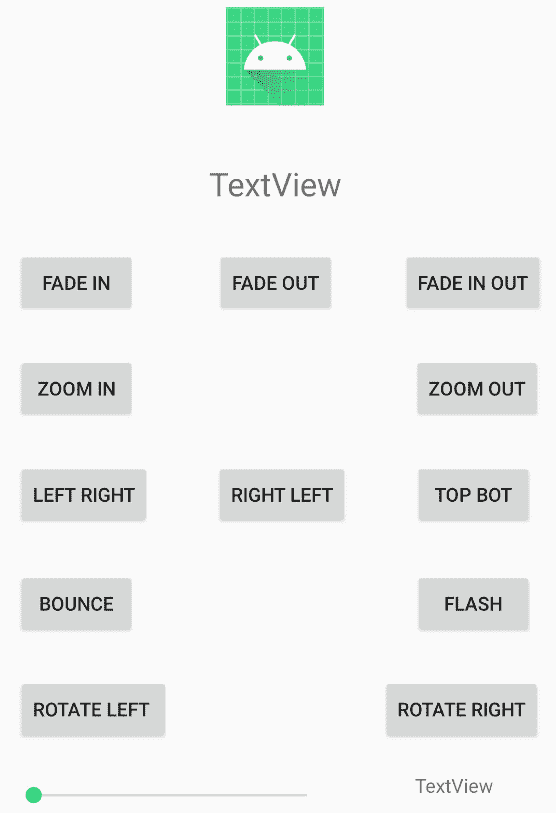
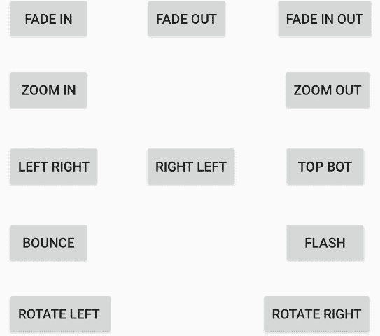
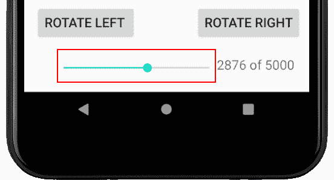
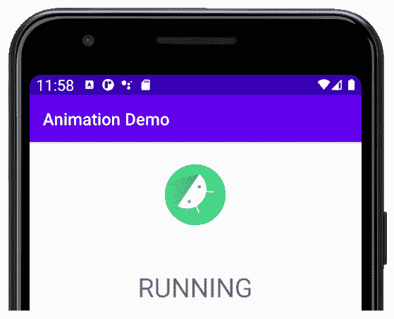

# 第十九章：动画和插值

在这里，我们将看到如何使用`Animation`类使我们的 UI 变得不那么静态，更有趣一些。正如我们所期望的那样，Android API 将允许我们用相对简单的代码做一些相当先进的事情，`Animation`类也不例外。

这一章大致可以分为以下几个部分：

+   介绍了 Android 中动画的工作原理和实现方式

+   介绍了一个我们尚未探索的 UI 小部件，`SeekBar`

+   创建一个工作动画应用程序

首先，让我们探索一下 Android 中的动画是如何工作的。

# 技术要求

您可以在 GitHub 上找到本章中的代码文件[`github.com/PacktPublishing/Android-Programming-for-Beginners-Third-Edition/tree/main/chapter%2019`](https://github.com/PacktPublishing/Android-Programming-for-Beginners-Third-Edition/tree/main/chapter%2019)。

# Android 中的动画

在 Android 中创建动画的正常方式是通过 XML。我们可以编写 XML 动画，然后在 Java 中加载和播放它们，放在指定的 UI 小部件上。因此，例如，我们可以编写一个动画，在 3 秒内淡入淡出五次，然后在`ImageView`或任何其他小部件上播放该动画。我们可以将这些 XML 动画看作脚本，因为它们定义了类型、顺序和时间。

让我们探索一下我们可以分配给动画的一些不同属性，然后如何在我们的 Java 代码中使用它们，最后，我们可以制作一个漂亮的动画应用程序来尝试一切。

## 在 XML 中设计酷炫的动画

我们已经学会了 XML 不仅可以用来描述 UI 布局，还可以用来描述动画，但让我们来看看具体是如何做到的。我们可以陈述动画的属性，描述小部件的起始和结束外观。然后我们的 Java 代码可以通过引用包含它的 XML 文件的名称并将其转换为可用的 Java 对象来加载 XML，这与 UI 布局非常相似。

这里我们快速浏览一下一些动画属性对，我们可以陈述以创建动画。在我们查看了一些 XML 之后，我们将看到如何在 Java 中使用它。

### 淡入淡出

Alpha 是透明度的度量。因此，通过陈述起始的`fromAlpha`和结束的`toAlpha`值，我们可以淡入淡出物品。值为`0.0`是不可见的，而`1.0`是对象的正常外观。在两者之间稳定移动会产生淡入效果：

```kt
<alpha
   android:fromAlpha="0.0"
   android:toAlpha="1.0" />
```

### 移动

我们可以通过类似的技术在我们的 UI 中移动一个对象。`fromXDelta`和`toXDelta`的值可以设置为被动画化对象大小的百分比。

以下代码将使一个对象从左到右移动，距离等于对象本身的宽度：

```kt
<translate 
   android:fromXDelta="-100%"
   android:toXDelta="0%"/>
```

此外，还有用于上下动画的`fromYDelta`和`toYDelta`属性。

### 缩放或拉伸

`fromXScale`和`toXScale`将增加或减少对象的比例。例如，以下代码将改变对象，使动画从正常大小到不可见：

```kt
<scale
   android:fromXScale="1.0"
   android:fromYScale="0.0"/>
```

举个例子，我们可以使用`android:fromYScale="0.1"`将对象缩小到其通常大小的十分之一，或者使用`android:fromYScale="10.0"`将其放大十倍。

### 控制持续时间

当然，如果这些动画只是瞬间到达它们的结论，那么它们中的任何一个都不会特别有趣。因此，为了使我们的动画更有趣，我们可以设置它们的持续时间（以毫秒为单位）。毫秒是一秒的千分之一。我们还可以通过设置`startOffset`（也以毫秒为单位）来使时间更容易，特别是与其他动画相关联。

下面的代码将在我们开始动画的 1/3 秒后开始动画，并且需要 2/3 秒才能完成：

```kt
   android:duration="666"
   android:startOffset="333"
```

### 旋转动画

如果要使某物旋转，只需使用`fromDegrees`和`toDegrees`。下面的代码可能会让小部件在一个完整的圆圈中旋转，因为当然，一个圆圈有 360 度：

```kt
   <rotate android:fromDegrees="360"
           android:toDegrees="0"
   />
```

### 重复动画

在一些动画中，重复可能很重要，也许是一种摇摆或抖动效果，所以我们可以添加一个 `repeatCount` 属性。此外，我们可以通过设置 `repeatMode` 来指定动画的重复方式。

以下代码将重复一个动画 10 次，每次都会改变动画的方向。`repeatMode` 属性是相对于动画的当前状态的。这意味着，如果你，例如，将一个按钮从 0 度旋转到 360 度，动画的第二部分（第一次重复）将从 360 度反向旋转回到 0。动画的第三部分（第二次重复）将再次反向旋转，从 0 度到 360 度：

```kt
   android:repeatMode="reverse"
   android:repeatCount="10"
```

使用 360 度旋转的例子，前面的代码将使一个小部件向右旋转 360 度，然后再向左旋转 360 度，重复五次。这是 10 次重复，每次都会反向旋转。

### 将动画的属性与 set 结合

要结合这些效果的组，我们需要使用 `set`。这段代码展示了我们如何将刚刚看到的所有先前代码片段组合成一个实际的 XML 动画，它将编译：

```kt
<?xml version="1.0" encoding="utf-8"?>
<set xmlns:android="http://schemas.android.com/apk/res/android"
             ...All our animations go here
</set>
```

然而，我们还没有看到任何 Java 代码来使这些动画生动起来。让我们现在来解决这个问题。

## 实例化动画并用 Java 代码控制它们

下面的 Java 代码片段展示了我们如何声明一个 `Animation` 类型的对象，用一个名为 `fade_in.xml` 的 XML 文件中的动画对其进行初始化，并在一个 `ImageView` 小部件上启动动画。很快我们将在一个项目中这样做，并看看在哪里放置 XML 动画：

```kt
// Declare an Animation object
Animation animFadeIn;
// Initialize it 
animFadeIn = AnimationUtils.loadAnimation(
getApplicationContext(), R.anim.fade_in);
// Get an ImageView from the UI in the usual way
ImageView findViewById(R.id.imageView);
// Start the animation on the ImageView
imageView.startAnimation(animFadeIn);
```

我们已经有了相当强大的动画和控制功能，比如时间控制。但是 Android API 还给了我们更多。

## 更多动画特性

我们可以监听动画的状态，就像我们可以监听按钮的点击一样。我们还可以使用 **插值器** 来使我们的动画更加生动和愉悦。让我们先看看监听器。

### 监听器

如果我们实现 `AnimationListener` 接口，我们确实可以通过覆盖告诉我们发生了什么的三种方法来监听动画的状态。然后我们可以根据这些事件来采取行动。

`OnAnimationEnd` 宣布动画结束，`onAnimationRepeat` 每次动画开始重复时调用，也许可以预料到，`onAnimationStart` 在动画开始动画时调用。如果在动画的 XML 中设置了 `startOffset`，这可能不是 `startAnimation` 被调用的时间：

```kt
@Override
public void onAnimationEnd(Animation animation) {
   // Take some action here
}
@Override
public void onAnimationRepeat(Animation animation) {

   // Take some action here
}
@Override
public void onAnimationStart(Animation animation) {

   // Take some action here
}
```

我们将在动画演示应用中看到 `AnimationListener` 是如何工作的，以及如何将另一个小部件 `SeekBar` 付诸实践。

### 动画插值器

如果你能回想起高中时的一些激动人心的关于计算加速度的课程，你可能会记得。如果我们以恒定的速度对某物进行动画，乍一看，事情可能看起来还不错。如果我们将动画与另一个使用渐进加速的动画进行比较，那么后者几乎肯定会更令人愉悦。

有可能，如果我们没有被告知两个动画之间唯一的区别是一个使用了加速度，另一个没有，我们可能无法说出为什么我们更喜欢它。我们的大脑更容易接受符合我们周围世界规范的事物。这就是为什么添加一点真实世界的物理学，比如加速度和减速度，会改善我们的动画。

然而，我们最不想做的事情就是开始做一堆数学计算，只是为了将一个按钮滑动到屏幕上或者让一些文本在圆圈中旋转。

这就是 **插值器** 的用武之地。它们是我们可以在 XML 中的一行代码中设置的动画修改器。

一些插值器的例子是 `accelerate_interpolator` 和 `cycle_interpolator`：

```kt
android:interpolator="@android:anim/accelerate_interpolator"android:interpolator="@android:anim/cycle_interpolator"/>
```

接下来我们将把一些插值器，以及一些 XML 动画和相关的 Java 代码，付诸实践。

注意

您可以在开发者网站上了解更多关于插值器和 Android `Animation`类的信息：[`developer.android.com/guide/topics/resources/animation-resource.html`](http://developer.android.com/guide/topics/resources/animation-resource.html)。

# 动画演示应用程序 - 介绍 SeekBar

这就够了理论，尤其是对于应该是视觉的东西。让我们构建一个动画演示应用程序，探索我们刚刚讨论过的一切以及更多内容。

这个应用程序涉及大量不同文件中的少量代码。因此，我已经尽量明确哪些代码在哪个文件中，这样你就可以跟踪发生了什么。这也将使我们为这个应用程序编写的 Java 更容易理解。

该应用程序将演示旋转、淡入淡出、平移、动画事件、插值器和使用`SeekBar`小部件控制持续时间。解释`SeekBar`小部件的最佳方法是构建它，然后观察它的运行。

## 布局动画演示

使用**空活动**模板创建一个名为`Animation Demo`的新项目，将所有其他设置保持默认。如果您希望通过复制和粘贴布局、Java 代码或动画 XML 来加快速度，可以在*第十九章*文件夹中找到所有内容。

使用完成布局的下一个参考截图来帮助你完成接下来的步骤：



图 19.1 - 完成的布局

以下是为此应用程序布局 UI 的方法：

1.  在编辑器窗口的设计视图中打开`activity_main.xml`。

1.  删除默认的`TextView`。

1.  在布局的顶部中心添加一个`ImageView`小部件。使用之前的参考截图来指导你。在弹出的**资源**窗口中选择**项目** | **ic_launcher**，使用`@mipmap/ic_launcher`在提示时在`ImageView`小部件中显示 Android 机器人。

1.  将`ImageView`小部件的`id`属性设置为`imageView`。

在`ImageView`小部件的正下方，添加一个`TextView`小部件。将`id`属性设置为`textStatus`。我通过拖动其边缘使我的`TextView`小部件变大，并将其`textSize`属性更改为`40sp`。

1.  现在我们将添加大量`id`属性值，稍后在教程中将它们添加到它们。按照下一个截图来布局 12 个按钮。修改每个按钮的`text`属性，使其与下一个截图中的文本相同。如果截图不够清晰，下一步中具体详细说明了`text`属性：

图 19.2 - 文本属性

注意

为了加快按钮布局的过程，首先只是大致布局它们，然后从下一步中添加`text`属性，然后微调按钮位置以获得整洁的布局。

1.  按照截图中的文本值添加文本。以下是从左到右，从上到下的所有值：`淡入`，`淡出`，`淡入淡出`，`放大`，`缩小`，`左右`，`右左`，`上下`，`弹跳`，`闪烁`，`向左旋转`和`向右旋转`。

1.  从`id`属性到`seekBarSpeed`添加一个`SeekBar`小部件，并将`max`属性设置为`5000`。这意味着当用户从左向右拖动时，滑块将保存一个在`0`和`5000`之间的值。我们将看到如何读取和使用这些数据。

1.  我们想要使`SeekBar`小部件更宽。为了实现这一点，您可以使用与任何小部件相同的技术；只需拖动小部件的边缘。然而，由于滑块很小，很难增加其大小而不小心选择约束手柄。为了解决这个问题，您可以通过按住*Ctrl*键并向前滚动鼠标中键来放大设计。然后，您可以抓住滑块的边缘，而不触摸约束手柄。我在下一个截图中展示了这一操作：

图 19.3 - 抓住滑块的边缘

1.  现在在`SeekBar`小部件的右侧添加一个`TextView`小部件，并将其`id`属性设置为`textSeekerSpeed`。

1.  调整位置，使其看起来像这些步骤开始时的参考图像，然后单击**推断约束**按钮以锁定位置。当然，如果您想要练习，也可以手动完成这一步骤。

1.  接下来，将以下`id`属性添加到按钮中，这些按钮由您已经设置的文本属性标识。如果在输入这些值时被问及是否要**更新用法…**，请选择**是**：

当我们在几节时间内编写`MainActivity`类时，我们将看到如何使用这个新加入的 UI（`SeekBar`）。

## 编写 XML 动画

右键单击**目录名称**字段中的`anim`，然后左键单击**确定**。

现在，右键单击新的`fade_in`，然后左键单击**确定**。删除整个内容并添加以下代码以创建动画：

```kt
<?xml version="1.0" encoding="utf-8"?>
<set xmlns:android="http://schemas.android.com/apk/res/android"
android:fillAfter="true" >
<alpha
android:fromAlpha="0.0"
android:interpolator="
@android:anim/accelerate_interpolator"
android:toAlpha="1.0" />
</set>
```

右键单击`fade_out`，然后左键单击**确定**。删除整个内容并添加以下代码以创建动画：

```kt
<?xml version="1.0" encoding="utf-8"?>
<set xmlns:android="http://schemas.android.com/apk/res/android"
android:fillAfter="true" >
   <alpha
         android:fromAlpha="1.0"
         android:interpolator="
         @android:anim/accelerate_interpolator"
         android:toAlpha="0.0" />
</set>
```

右键单击`fade_in_out`，然后左键单击**确定**。删除整个内容并添加以下代码以创建动画：

```kt
<?xml version="1.0" encoding="utf-8"?>
<set xmlns:android="http://schemas.android.com/apk/res/android"
    android:fillAfter="true" >
<alpha
android:fromAlpha="0.0"
android:interpolator="
@android:anim/accelerate_interpolator"
android:toAlpha="1.0" />
<alpha
android:fromAlpha="1.0"
android:interpolator="
@android:anim/accelerate_interpolator"
android:toAlpha="0.0" />
</set>
```

右键单击`zoom_in`，然后左键单击**确定**。删除整个内容并添加以下代码以创建动画：

```kt
<set xmlns:android="http://schemas.android.com/apk/res/android"
    android:fillAfter="true" >
    <scale
        android:fromXScale="1"
        android:fromYScale="1"
        android:pivotX="50%"
        android:pivotY="50%"
        android:toXScale="6"
        android:toYScale="6" >
    </scale>
</set>
```

右键单击`zoom_out`，然后左键单击**确定**。删除整个内容并添加以下代码以创建动画：

```kt
<?xml version="1.0" encoding="utf-8"?>
<set xmlns:android="http://schemas.android.com/apk/res/android">
    <scale
        android:fromXScale="6"
        android:fromYScale="6"
        android:pivotX="50%"
        android:pivotY="50%"
        android:toXScale="1"
        android:toYScale="1" >
    </scale>
</set>
```

右键单击`left_right`，然后左键单击**确定**。删除整个内容并添加以下代码以创建动画：

```kt
<?xml version="1.0" encoding="utf-8"?>
<set xmlns:android="http://schemas.android.com/apk/res/android">
    <translate 

        android:fromXDelta="-500%"
        android:toXDelta="0%"/>
</set>
```

右键单击`right_left`，然后左键单击**确定**。删除整个内容并添加以下代码以创建动画：

```kt
<?xml version="1.0" encoding="utf-8"?>
<set xmlns:android="http://schemas.android.com/apk/res/android">
    <translate 
        android:fillAfter="false"
        android:fromXDelta="500%"
        android:toXDelta="0%"/>
</set>
```

右键单击`top_bot`，然后左键单击**确定**。删除整个内容并添加以下代码以创建动画：

```kt
<?xml version="1.0" encoding="utf-8"?>
<set xmlns:android="http://schemas.android.com/apk/res/android">
    <translate 
        android:fillAfter="false"
        android:fromYDelta="-100%"
        android:toYDelta="0%"/>
</set>
```

右键单击`flash`，然后左键单击**确定**。删除整个内容并添加以下代码以创建动画：

```kt
<?xml version="1.0" encoding="utf-8"?>
<set xmlns:android="http://schemas.android.com/apk/res/android">
    <alpha android:fromAlpha="0.0"
        android:toAlpha="1.0"
        android:interpolator="
        @android:anim/accelerate_interpolator"
        android:repeatMode="reverse"
        android:repeatCount="10"/>
</set>
```

右键单击`bounce`，然后左键单击**确定**。删除整个内容并添加以下代码以创建动画：

```kt
<?xml version="1.0" encoding="utf-8"?>
<set xmlns:android="http://schemas.android.com/apk/res/android"
    android:fillAfter="true"
    android:interpolator="
    @android:anim/bounce_interpolator">
    <scale
        android:fromXScale="1.0"
        android:fromYScale="0.0"
        android:toXScale="1.0"
        android:toYScale="1.0" />
</set>
```

右键单击`rotate_left`，然后左键单击`pivotX="50%"`和`pivotY="50%"`。这使得旋转动画在将要被动画化的小部件上居中。我们可以将其视为设置动画的中心点：

```kt
<?xml version="1.0" encoding="utf-8"?>
<set xmlns:android="http://schemas.android.com/apk/res/android">
    <rotate android:fromDegrees="360"
        android:toDegrees="0"
        android:pivotX="50%"
        android:pivotY="50%"
        android:interpolator="
        @android:anim/cycle_interpolator"/>
</set>
```

右键单击`rotate_right`，然后左键单击**确定**。删除整个内容并添加以下代码以创建动画：

```kt
<?xml version="1.0" encoding="utf-8"?>
<set xmlns:android="http://schemas.android.com/apk/res/android">
    <rotate android:fromDegrees="0"
        android:toDegrees="360"
        android:pivotX="50%"
        android:pivotY="50%"
        android:interpolator="
        @android:anim/cycle_interpolator"/>
</set>
```

现在我们可以编写 Java 代码，将动画添加到我们的 UI 中。

## 将动画演示应用程序与 Java 连接起来

打开`MainActivity.java`文件。现在，在类声明下面，我们可以声明以下用于动画的成员变量：

```kt
Animation animFadeIn;
Animation animFadeOut;
Animation animFadeInOut;
Animation animZoomIn;
Animation animZoomOut;
Animation animLeftRight;
Animation animRightLeft;
Animation animTopBottom;
Animation animBounce;
Animation animFlash;
Animation animRotateLeft;
Animation animRotateRight;
```

现在在上述代码之后为 UI 小部件添加这些成员变量：

```kt
ImageView imageView;
TextView textStatus;
Button btnFadeIn;
Button btnFadeOut;
Button btnFadeInOut;
Button zoomIn;
Button zoomOut;
Button leftRight;
Button rightLeft;
Button topBottom;
Button bounce;
Button flash;
Button rotateLeft;
Button rotateRight;
SeekBar seekBarSpeed;
TextView textSeekerSpeed;
```

注意

此时，您需要添加以下`import`语句：

`import android.view.animation.Animation;`

`import android.widget.Button;`

`import android.widget.ImageView;`

`import android.widget.SeekBar;`

`import android.widget.TextView;`

接下来，我们添加一个`int`成员变量，用于跟踪滑块的当前值/位置：

```kt
int seekSpeedProgress;
```

现在，在`setContentView`方法调用之后，让我们从`onCreate`方法中调用两个新方法：

```kt
@Override
protected void onCreate(Bundle savedInstanceState) {
   super.onCreate(savedInstanceState);
   setContentView(R.layout.activity_main);
   loadAnimations();
   loadUI();
}
```

在这一点上，两行新代码将有错误，直到我们实现这两个新方法。

现在我们将实现 `loadAnimations` 方法。虽然这个方法中的代码相当庞大，但也非常简单。我们所做的就是使用 `AnimationUtils` 类的静态 `loadAnimation` 方法来初始化我们每个 `Animation` 引用中的一个 XML 动画。还要注意，对于 `animFadeIn` 的 `Animation` 引用，我们还在其上调用了 `setAnimationListener`。我们将很快编写监听事件的方法。

添加 `loadAnimations` 方法：

```kt
private void loadAnimations(){
   animFadeIn = AnimationUtils.loadAnimation(
   this, R.anim.fade_in);
   animFadeIn.setAnimationListener(this);
   animFadeOut = AnimationUtils.loadAnimation(
   this, R.anim.fade_out);
   animFadeInOut = AnimationUtils.loadAnimation(
   this, R.anim.fade_in_out);
   animZoomIn = AnimationUtils.loadAnimation(
   this, R.anim.zoom_in);
   animZoomOut = AnimationUtils.loadAnimation(
   this, R.anim.zoom_out);
   animLeftRight = AnimationUtils.loadAnimation(
   this, R.anim.left_right);
   animRightLeft = AnimationUtils.loadAnimation(
   this, R.anim.right_left);
   animTopBottom = AnimationUtils.loadAnimation(
   this, R.anim.top_bot);
   animBounce = AnimationUtils.loadAnimation(
   this, R.anim.bounce);
   animFlash = AnimationUtils.loadAnimation(
   this, R.anim.flash);
   animRotateLeft = AnimationUtils.loadAnimation(
   this, R.anim.rotate_left);
   animRotateRight = AnimationUtils.loadAnimation(
   this, R.anim.rotate_right);
}
```

注意

在这一点上，您需要导入一个新的类：

`import android.view.animation.AnimationUtils;`

在三个部分中实现 `loadUI` 方法。首先，让我们以通常的方式引用 XML 布局的部分：

```kt
private void loadUI(){
   imageView = findViewById(R.id.imageView);
   textStatus = findViewById(R.id.textStatus);
   btnFadeIn = findViewById(R.id.btnFadeIn);
   btnFadeOut = findViewById(R.id.btnFadeOut);
   btnFadeInOut = findViewById(R.id.btnFadeInOut);
   zoomIn = findViewById(R.id.btnZoomIn);
   zoomOut = findViewById(R.id.btnZoomOut);
   leftRight = findViewById(R.id.btnLeftRight);
   rightLeft = findViewById(R.id.btnRightLeft);
   topBottom = findViewById(R.id.btnTopBottom);
   bounce = findViewById(R.id.btnBounce);
   flash = findViewById(R.id.btnFlash);
   rotateLeft = findViewById(R.id.btnRotateLeft);
   rotateRight = findViewById(R.id.btnRotateRight);
```

现在我们将为每个按钮添加一个点击监听器。在 `loadUI` 方法的最后一个块之后立即添加以下代码：

```kt
btnFadeIn.setOnClickListener(this);
btnFadeOut.setOnClickListener(this);
btnFadeInOut.setOnClickListener(this);
zoomIn.setOnClickListener(this);
zoomOut.setOnClickListener(this);
leftRight.setOnClickListener(this);
rightLeft.setOnClickListener(this);
topBottom.setOnClickListener(this);
bounce.setOnClickListener(this);
flash.setOnClickListener(this);
rotateLeft.setOnClickListener(this);
rotateRight.setOnClickListener(this);
```

注意

我们刚刚添加的代码在所有代码行中都创建了错误。我们现在可以忽略它们，因为我们很快就会修复它们并讨论发生了什么。

`loadUI` 方法的第三部分和最后一部分设置了一个匿名类来处理 `SeekBar` 小部件。我们本可以像监听按钮点击和动画事件一样将其添加为 `MainActivity` 类的一个接口，但是对于像这样的单个 `SeekBar` 小部件，直接处理它是有意义的。

我们将重写三个方法，这是实现 `OnSeekBarChangeListener` 接口时所需的：

+   一个检测 seek bar 位置变化的方法叫做 `onProgressChanged`

+   一个检测用户开始改变位置的方法叫做 `onStartTrackingTouch`

+   一个检测用户完成使用 seek bar 的方法叫做 `onStopTrackingTouch`

为了实现我们的目标，我们只需要向 `onProgressChanged` 方法添加代码，但是我们仍然必须重写它们全部。

在 `onProgressChanged` 方法中，我们所做的就是将 seek bar 的当前值分配给 `seekSpeedProgress` 成员变量，以便可以从其他地方访问它。然后我们使用这个值以及通过调用 `seekBarSpeed.getMax()` 获得的 `SeekBar` 小部件的最大可能值，并将消息输出到 `textSeekerSpeed` `TextView` 小部件。

将我们刚刚讨论过的代码添加到 `loadUI` 方法中：

```kt
seekBarSpeed = findViewById(R.id.seekBarSpeed);
textSeekerSpeed = findViewById(R.id.textSeekerSpeed);
seekBarSpeed.setOnSeekBarChangeListener(new SeekBar.OnSeekBarChangeListener() {
   @Override
   public void onProgressChanged(SeekBar seekBar, 
   int value, boolean fromUser) {
         seekSpeedProgress = value;
         textSeekerSpeed.setText("" 
         + seekSpeedProgress 
         + " of " 
         + seekBarSpeed.getMax());
   }
   @Override
   public void onStartTrackingTouch(SeekBar seekBar) {
   }
   @Override
   public void onStopTrackingTouch(SeekBar seekBar) {
   }
});
}
```

现在我们需要修改 `MainActivity` 类的声明以实现两个接口。在这个应用程序中，我们将监听点击和动画事件，所以我们将使用的两个接口是 `View.OnClickListener` 和 `Animation.AnimationListener`。请注意，要实现多个接口，我们只需用逗号分隔接口。

通过添加我们刚刚讨论过的以下突出显示的代码来修改 `MainActivity` 类的声明：

```kt
public class MainActivity extends AppCompatActivity 
   implements View.OnClickListener, 
   Animation.AnimationListener {
```

在这个阶段，我们可以添加并实现这些接口所需的方法 - 首先是 `AnimationListener` 的以下方法：`onAnimationEnd`，`onAnimationRepeat` 和 `onaAnimationStart`。我们只需要向这两个方法中添加一点代码。在 `onAnimationEnd` 中，我们将 `textStatus` 的 `text` 属性设置为 `STOPPED`，在 `onAnimationStart` 方法中，我们将 `textStatus` 的 `text` 属性设置为 `RUNNING`。这将演示我们的动画监听器确实在监听和工作：

```kt
@Override
public void onAnimationEnd(Animation animation) {
   textStatus.setText("STOPPED");
}
@Override
public void onAnimationRepeat(Animation animation) {
}
@Override
public void onAnimationStart(Animation animation) {
   textStatus.setText("RUNNING");
}
```

`onClick` 方法非常长，但并不复杂。UI 中处理每个按钮的每个 `case` 简单地根据 seek bar 的当前位置设置动画的持续时间，设置动画以便监听事件，然后启动动画。

注意

您需要使用您喜欢的技术导入 `View` 类：

`import android.view.View;`

添加我们刚刚讨论过的 `onClick` 方法，然后我们就完成了这个小应用程序：

```kt
@Override
public void onClick(View v) {
switch(v.getId()){
   case R.id.btnFadeIn:
         animFadeIn.setDuration(seekSpeedProgress);
         animFadeIn.setAnimationListener(this);
         imageView.startAnimation(animFadeIn);
         break;
   case R.id.btnFadeOut:
         animFadeOut.setDuration(seekSpeedProgress);
         animFadeOut.setAnimationListener(this);
         imageView.startAnimation(animFadeOut);
         break;
   case R.id.btnFadeInOut:
         animFadeInOut.setDuration(seekSpeedProgress);
         animFadeInOut.setAnimationListener(this);
         imageView.startAnimation(animFadeInOut);
         break;
   case R.id.btnZoomIn:
         animZoomIn.setDuration(seekSpeedProgress);
         animZoomIn.setAnimationListener(this);
         imageView.startAnimation(animZoomIn);
         break;
   case R.id.btnZoomOut:
         animZoomOut.setDuration(seekSpeedProgress);
         animZoomOut.setAnimationListener(this);
         imageView.startAnimation(animZoomOut);
         break;
   case R.id.btnLeftRight:
         animLeftRight.setDuration(seekSpeedProgress);
         animLeftRight.setAnimationListener(this);
         imageView.startAnimation(animLeftRight);
         break;
   case R.id.btnRightLeft:
         animRightLeft.setDuration(seekSpeedProgress);
         animRightLeft.setAnimationListener(this);
         imageView.startAnimation(animRightLeft);
         break;
   case R.id.btnTopBottom:
         animTopBottom.setDuration(seekSpeedProgress);
         animTopBottom.setAnimationListener(this);
         imageView.startAnimation(animTopBottom);
         break;
   case R.id.btnBounce:
         /*
            Divide seekSpeedProgress by 10 because with
            the seekbar having a max value of 5000 it
            will make the animations range between
            almost instant and half a second 
            5000 /  10 = 500 milliseconds
         */
         animBounce.setDuration(seekSpeedProgress / 10);
         animBounce.setAnimationListener(this);
         imageView.startAnimation(animBounce);
         break;
   case R.id.btnFlash:
         animFlash.setDuration(seekSpeedProgress / 10);
         animFlash.setAnimationListener(this);
         imageView.startAnimation(animFlash);
         break;
   case R.id.btnRotateLeft:
         animRotateLeft.setDuration(seekSpeedProgress);
         animRotateLeft.setAnimationListener(this);
         imageView.startAnimation(animRotateLeft);
         break;
   case R.id.btnRotateRight:
         animRotateRight.setDuration(seekSpeedProgress);
         animRotateRight.setAnimationListener(this);
         imageView.startAnimation(animRotateRight);
         break;
}
}
```

现在运行应用程序。将 seek bar 移动到大致中心，以便动画运行一段合理的时间，如下一张截图所示：



图 19.4 – 将寻找栏移动到大致中心

点击**放大**按钮以查看效果，如下一个截图所示：


图 19.5 – 放大效果

注意 Android 机器人上的文本如何在适当的时间从**RUNNING**更改为**STOPPED**。现在点击其中一个**旋转**按钮，以查看下一个显示的效果：



图 19.6 – 旋转按钮

大多数其他动画在截图中无法展现出自己的价值，所以一定要自己尝试它们。

# 常见问题

1.  我现在知道如何对小部件进行动画处理，但是我自己创建的形状或图像呢？

`ImageView`可以容纳任何您喜欢的图像。只需将图像添加到`drawable`文件夹，然后在`ImageView`小部件上设置适当的`src`属性。然后可以对`ImageView`中显示的任何图像进行动画处理。

1.  但如果我想要比这更灵活的功能，比如绘图应用程序甚至游戏呢？

要实现这种功能，我们需要了解另一个通用的计算概念（`Paint`，`Canvas`和`SurfaceView`）。我们将学习如何从单个像素到形状绘制任何东西，然后在屏幕上移动它们，从下一章开始，*第二十章*，*绘图图形*。

# 总结

现在我们掌握了另一个增强应用程序的技巧，并且知道 Android 中的动画非常简单。我们可以在 XML 中设计动画并将文件添加到`anim`文件夹中。之后，我们可以在 Java 代码中使用`Animation`对象获取对 XML 中动画的引用。

然后，我们可以使用 UI 中小部件的引用，并使用`setAnimation`为其设置动画，并传入`Animation`对象。通过在小部件的引用上调用`startAnimation`来开始动画。

我们还看到可以控制动画的时序，以及监听动画事件。

在下一章中，我们将学习如何在 Android 中绘制图形。这将是关于图形的几章中的开始，我们将构建一个儿童风格的绘图应用程序。

| **现有文本属性** | **要设置的 id 属性值** |
| --- | --- |
| 淡入 | `btnFadeIn` |
| 淡出 | `btnFadeOut` |
| 淡入淡出 | `btnFadeInOut` |
| 放大 | `btnZoomIn` |
| 缩小 | `btnZoomOut` |
| 左右 | `btnLeftRight` |
| 右左 | `btnRightLeft` |
| 上下 | `btnTopBottom` |
| 弹跳 | `btnBounce` |
| 闪烁 | `btnFlash` |
| 向左旋转 | `btnRotateLeft` |
| 向右旋转 | `btnRotateRight` |
