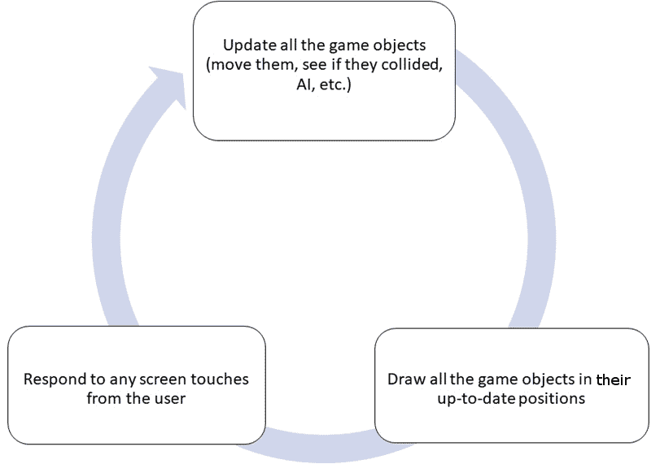
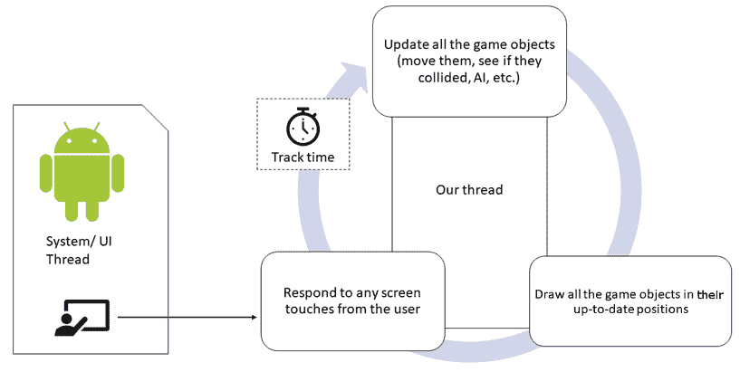

# 第二十一章：*第二十一章*：线程和启动 Live Drawing 应用程序

在本章中，我们将开始我们的下一个应用程序。这个应用程序将是一个儿童绘画应用程序，用户可以用手指在屏幕上绘画。但是，这个绘画应用程序将略有不同。用户绘制的线条将包括成千上万个粒子的粒子系统。我们将称这个项目为 Live Drawing。

为了实现这一点，我们将执行以下操作：

+   开始使用 Live Drawing 应用程序

+   了解实时交互，有时被称为游戏循环

+   了解线程

+   编写一个准备在下一章绘制的实时系统

让我们开始吧。

# 技术要求

您可以在 GitHub 上找到本章中的代码文件，网址为[`github.com/PacktPublishing/Android-Programming-for-Beginners-Third-Edition/tree/main/chapter%2021`](https://github.com/PacktPublishing/Android-Programming-for-Beginners-Third-Edition/tree/main/chapter%2021)。

# 创建 Live Drawing 项目

要开始，请在 Android Studio 中创建一个名为`Live Drawing`的新项目。使用**空活动**项目。

现在我们将考虑文件的名称和屏幕房地产。在这个项目中，我们将学习一些新东西。对于我们的 Activity 类，使用默认名称并不总是合适的。在这个项目中，Activity 类不会是最重要的类，`MainActivity`似乎不是一个合适的名称。让我们重命名它。

## 将 MainActivity 重构为 LiveDrawingActivity

对于我们的代码的所有不同部分使用有意义的名称是一个很好的做法。对于这个项目，我认为`MainActivity`有点模糊和不确定。我们可以将其使用，但让我们将其重命名为更有意义的名称。这也将让我们看到如何将`MainActivity`文件名更改为`LiveDrawingActivity`，Android Studio 将更改`AndroidManifest.xml`文件和`MainActivity.java`（即将更改为`LiveDrawingActivity.java`）文件中的一些代码。

在项目面板中，右键单击`MainActivity`文件，然后选择**重构** | **重命名**。在弹出窗口中，将**MainActivity**更改为**LiveDrawingActivity**。将所有其他选项保持为默认值，然后单击**重构**按钮。

请注意，项目面板中的文件名已如预期更改，但`AndroidManifest.xml`文件中的多个实例以及`LiveDrawingActivity.java`文件中的多个实例也已更改为`LiveDrawingActivity`。如果您感兴趣，现在可以扫描这些文件以查看这一点，但无论如何，我们将在即将到来的章节中更详细地讨论这两个文件。

注意

重构是一个重要的工具，了解幕后发生的更多事情对于避免混淆至关重要。

## 将游戏锁定到全屏和横向方向

我们希望使用用户 Android 设备提供的每个像素，因此我们将对`AndroidManifest.xml`文件进行更改，这允许我们为应用程序使用一个样式，隐藏用户界面中的所有默认菜单。

从`manifests`文件夹中打开`AndroidManifest.xml`文件。在`AndroidManifest.xml`文件中，找到以下代码行：`android:name=".LiveDrawingActivity">。`

将光标放在先前显示的关闭`>`之前。按*Enter*键几次，将`>`移动到先前显示的其余行下方几行。

在`".LiveDrawingActivity"`下方，但在新定位的`>`之前，键入或复制并粘贴下一行代码，以使游戏在没有默认用户界面的情况下运行。

请注意，代码行显示在两行上，因为它太长而无法适应打印页面，但在 Android Studio 中，您应该将其输入为一行：

```kt
android:theme=
"@android:style/Theme.Holo.Light.NoActionBar.Fullscreen"
```

这是一组繁琐的步骤，所以在这里我向您展示了这个文件的更大范围，其中我们刚刚添加的代码也被突出显示，以提供额外的上下文。如前所述，我不得不将一些代码行显示为两行：

```kt
…
<activity android:name=".LiveDrawingActivity"
     android:theme=
     "@android:style/
     Theme.Holo.Light.NoActionBar.Fullscreen"
     >
     <intent-filter>
          <action android:name="android.intent.action.MAIN"
          />
<category android:name= "android.intent.category.LAUNCHER" />
     </intent-filter>
</activity>
…
```

现在我们的应用程序将使用设备提供的所有屏幕空间，而不需要任何额外的菜单。我们还将看到一些新的 Java 代码，使我们的应用程序占据屏幕的每一个像素。

### 创建一些占位符类

这个应用程序只包含 Java 文件。到本章结束时的所有代码都可以在下载包的*第二十一章*文件夹中找到。

接下来，我们将创建一些空类，我们将在接下来的两章项目中编写。创建一个名为`LiveDrawingView`的新类，一个名为`ParticleSystem`的新类，以及一个名为`Particle`的新类。

让我们稍微展望一下。

## 展望 Live Drawing 应用程序

由于这个应用程序更加深入，并且需要实时响应，因此需要使用稍微更深入的结构。起初，这似乎是一个复杂，但从长远来看，它甚至可以使我们的代码更简单、更容易理解。

在 Live Drawing 应用程序中，我们将有四个类：

+   `LiveDrawingActivity`：Android API 提供的`Activity`类是与操作系统交互的类。我们已经看到了当用户点击应用程序图标启动应用程序时，操作系统是如何与`onCreate`交互的。我们不再使用一个叫做`MainActivity`的类来处理所有事情，而是使用一个基于 Activity 的类来处理应用程序的启动和关闭，以及通过获取屏幕分辨率来帮助初始化。这个类将是`Activity`类型是有意义的。然而，很快你会看到，我们将委托触摸交互给另一个类，这个类也将处理几乎每个方面的应用程序。这将为我们介绍一些新的有趣的概念。 

+   `LiveDrawingView`：这是负责绘图和创建实时环境的类，允许用户在他们的创作移动和发展的同时进行交互。

+   `ParticleSystem`：这个类将管理`Particle`类的成千上万个实例。

+   `Particle`：这个类将是最简单的。它将在屏幕上有一个位置和一个方向。当`LiveDrawingView`类提示时，它将每秒更新大约 60 次。

现在我们可以开始编码了。

## 编写 LiveDrawingActivity 类

让我们开始编写基于`Activity`的类。当我们重构`MainActivity`时，我们将这个类称为`LiveDrawingActivity`。

用以下代码替换`LiveDrawingActivity`类的内容（不包括包声明）：

```kt
import android.app.Activity;
import android.graphics.Point;
import android.os.Bundle;
import android.view.Display;
import android.view.Window;
public class LiveDrawingActivity extends Activity {
    private LiveDrawingView mLiveDrawingView;
    @Override
    protected void onCreate(Bundle savedInstanceState) {
        super.onCreate(savedInstanceState);
        requestWindowFeature(Window.FEATURE_NO_TITLE);
        Display display = getWindowManager()
        .getDefaultDisplay();
        Point size = new Point();
        display.getSize(size);
        mLiveDrawingView = new LiveDrawingView(
        this, size.x, size.y);
        setContentView(mLiveDrawingView);
    }
}
```

代码显示了一些错误，我们很快会讨论它们。

第一行新代码是这样的：

```kt
requestWindowFeature(Window.FEATURE_NO_TITLE);
```

这行代码从用户界面中移除了标题。当我们运行这个应用程序时，屏幕将完全为空。

代码以以下方式获取设备的像素数（宽和高）。再看一下下一行新代码：

```kt
Display display = getWindowManager().getDefaultDisplay();
```

我们创建了一个名为`display`的`Display`类型的对象，并用调用`getWindowManager`和`getDefaultDisplay`方法的结果依次初始化它，这些方法都是`Activity`类的一部分。

然后我们创建了一个名为`size`的`Point`类型的新对象。我们将`size`作为参数发送给`display.getSize`方法。`Point`类型有一个`x`和`y`成员变量，因此`size`对象也有，经过第三行代码后，它现在保存了显示器的宽度和高度（以像素为单位）。

现在我们将屏幕分辨率隐藏在`size`对象中的`x`和`y`变量中。

接下来的新事物是，我们声明了我们的`LiveDrawingView`类的一个实例。目前，这是一个空类：

```kt
private LiveDrawingView mLiveDrawingView;
```

接下来，在`onCreate`方法中，我们像这样初始化`mLiveDrawingView`：

```kt
mLiveDrawingView = new LiveDrawingView(this, size.x, size.y);
```

我们正在向`LiveDrawingView`构造函数传递三个参数。显然，我们还没有编写构造函数，我们知道默认构造函数不带参数。因此，在我们修复它之前，这行代码将导致错误。

传递的参数很有趣。首先是`this`，它是对`LiveDrawingActivity`类的引用。`LiveDrawingView`类将需要使用它需要这个引用的方法。

第二个和第三个参数是水平和垂直屏幕分辨率。我们的应用程序需要这些来执行诸如检测屏幕边缘和将绘图对象缩放到适当大小等任务是有意义的。当我们开始编写`LiveDrawingView`构造函数时，我们将进一步讨论这些参数。

接下来，看一下接下来的一行：

```kt
setContentView(mLiveDrawingView);
```

这是在 Canvas Demo 应用程序中，我们将`ImageView`设置为应用程序的内容。请记住，`Activity`类的`setContentView`方法必须接受一个`View`对象，而`ImageView`是一个`View`。前一行代码似乎在暗示我们将使用我们的`LiveDrawingView`类作为应用程序的可见内容。但是`LiveDrawingView`，尽管名字是这样，但它还不是`View`。至少目前还不是。

在我们向`LiveDrawingActivity`添加几行代码之后，我们将修复构造函数和不是`View`问题。

读者挑战

你能猜到解决方案可能是哪种 OOP 概念吗？

添加这两个重写的方法，然后我们将讨论它们。将它们添加到`onCreate`方法的右大括号下面，但在`LiveDrawingActivity`类的右大括号之前添加：

```kt
@Override
protected void onResume() {
   super.onResume();
   // More code here later in the chapter
}
@Override
protected void onPause() {
   super.onPause();
   // More code here later in the chapter
}
```

我们所做的是重写`Activity`类的另外两个方法。我们将看到为什么我们需要这样做以及我们将在这些方法内部做什么。这里要注意的一点是，通过添加这些重写的方法，我们给了操作系统在另外两种情况下通知我们用户意图的机会。就像我们在 Note to Self 应用程序中保存和加载数据时所做的那样。

在这一点上，转到`LiveDrawingView`类是有意义的，这是该应用程序的主要类。我们将在本章末回到`LiveDrawingActivity`类。

## 编写 LiveDrawingView 类

我们要做的第一件事是解决`LiveDrawingView`类不是`View`类型的问题。更新类声明如下所示：

```kt
class LiveDrawingView extends SurfaceView {
```

注意

您需要导入`android.view.SurfaceView`类。

`SurfaceView`是`View`的后代，现在`LiveDrawingView`也是`View`的一种类型，通过继承。再次看看已添加的`import`语句。这种关系如下所示：

```kt
import android..SurfaceView
```

注意

请记住，正是由于多态性，我们可以将`View`的后代发送到`LiveDrawingActivity`类中的`setContentView`方法，而正是由于继承，`LiveDrawingView`类现在是`SurfaceView`的一种类型。

有很多`View`的后代可以扩展以解决这个初始问题，但随着我们继续，我们将看到`SurfaceView`类具有一些非常特定的功能，非常适合实时交互应用程序，这使得这个选择对我们来说是正确的。

我们在这个类和`LiveDrawingActivity`类中仍然有错误。这两个错误都是由于缺少合适的构造方法。

这里有一张屏幕截图显示了`LiveDrawingView`类中的错误，因为我们扩展了`SurfaceView`：


图 21.1 - LiveDrawingView 类中的错误

`LiveDrawingActivity`中的错误更明显；我们调用了一个不存在的方法。然而，前面截图中显示的错误不太容易理解。现在让我们讨论`LiveDrawingView`类声明中的错误。

`LiveDrawingView`类，现在是一个`SurfaceView`，必须提供一个构造函数，因为如 OOP 章节中所述，一旦你提供了自己的构造函数，默认（无参数）构造函数就不复存在了。由于`SurfaceView`类实现了几种不同的构造函数，我们必须明确实现其中的一个或编写我们自己的。因此出现了之前的错误。

由于没有提供的`SurfaceView`构造函数正是我们所需要的，我们将提供我们自己的构造函数。

注意

如果你想知道如何知道提供了哪些构造函数和关于 Android 类的其他细节，只需谷歌一下。输入类名，后跟`API`。谷歌几乎总会提供一个指向 Android 开发者网站相关页面的链接作为最顶部的结果。这是`SurfaceView`页面的直接链接：[`developer.android.com/reference/android/view/SurfaceView.html`](https://developer.android.com/reference/android/view/SurfaceView.html)。查看**Public constructors**标题下，你会看到一些可选的构造函数。

`LiveDrawingActivity`还要求我们创建一个构造函数，与我们尝试在`LiveDrawingActivity`类中初始化的方式匹配：

```kt
mLiveDrawingView = new LiveDrawingView(this, size.x, size.y);
```

让我们添加一个构造函数，与从`LiveDrawingActivity`传入`this`和屏幕分辨率的调用匹配，并一次解决两个问题。

## 编写`LiveDrawingView`类

记住，`LiveDrawingView`类无法看到`LiveDrawingActivity`类中的变量。通过使用构造函数，`LiveDrawingActivity`提供了对自身（`this`）以及包含在`size.x`和`size.y`中的像素屏幕大小的引用。将此构造函数添加到`LiveDrawingView.java`文件中。代码必须放在类的开头和结尾的大括号内。这是一种约定，但不是必须的，将构造函数放在其他方法之上，但在成员变量声明之后：

```kt
// The LiveDrawingView constructor
// Called when this line:
// mLiveDrawingView = new LiveDrawingView(this, size.x, size.y);
// is executed from LiveDrawingActivity
public LiveDrawingView(Context context, int x, int y) {
        // Super... calls the parent class
        // constructor of SurfaceView
        // provided by the Android API
        super(context);
}
```

注意

使用以下代码导入`Context`类：

`import android.content.Context;`

现在我们的`LiveDrawingView`类或初始化它的`LiveDrawingActivity`类中没有错误。

在这个阶段，我们可以运行应用程序，看看使用`LiveDrawingView`作为`setContentView`中的`View`是否有效，并且我们有一个美丽的空白屏幕，准备在上面绘制我们的粒子系统。如果你愿意，可以尝试一下，但我们将编写`LiveDrawingView`类，使其做一些事情，包括在构造函数中添加代码，接下来。

在这个项目的过程中，我们将不断回到这个类。我们现在要做的是准备好基本知识，以便在下一章中编写`ParticleSystem`实例后添加它们。

为了实现这一点，首先我们将添加一堆成员变量，然后我们将在构造函数内部添加一些代码，以便在`LiveDrawingActivity`实例化/创建时设置类。

接下来，我们将编写`draw`方法，它将揭示我们需要采取的新步骤，以便每秒在屏幕上绘制 60 次，并且我们还将看到一些熟悉的代码，使用了我们上一章的老朋友`Canvas`、`Paint`和`drawText`。

在这一点上，我们需要讨论更多的理论 - 诸如我们将如何计时粒子的动画以及如何锁定这些时间而不干扰 Android 的平稳运行等事情。这最后两个主题，**游戏循环**和**线程**，将允许我们添加本章的最终代码，并见证我们的粒子系统绘画应用程序的运行 - 尽管只有一点点文本。

注意

游戏循环是一个概念，描述了允许虚拟系统在允许用户改变/交互的同时更新和绘制自己的能力。

### 添加成员变量

按照下面所示的变量添加到`LiveDrawingView`声明之后但在构造函数之前，然后导入必要的额外类：

```kt
// Are we debugging?
private final boolean DEBUGGING = true;
// These objects are needed to do the drawing
private SurfaceHolder mOurHolder;
private Canvas mCanvas;
private Paint mPaint;
// How many frames per second did we get?
private long mFPS;
// The number of milliseconds in a second
private final int MILLIS_IN_SECOND = 1000;
// Holds the resolution of the screen
private int mScreenX;
private int mScreenY;
// How big will the text be?
private int mFontSize;
private int mFontMargin;
// The particle systems will be declared here later
// These will be used to make simple buttons
```

添加以下`import`代码：

```kt
import android.graphics.Canvas;
import android.graphics.Paint;
import android.view.SurfaceHolder;
```

确保学习代码，然后我们可以讨论它。

我们使用在成员变量名之前添加`m`的命名约定。当我们在方法中添加局部变量时，这将有助于区分它们。

另外，请注意所有变量都声明为`private`。你可以愉快地删除所有`private`访问修饰符，代码仍然可以工作，但由于我们没有必要从这个类的外部访问任何这些变量，因此通过声明它们为`private`来保证它永远不会发生是明智的。

第一个成员变量是`DEBUGGING`。我们将其声明为`final`，因为我们不希望在应用程序执行期间更改其值。请注意，将其声明为`final`并不妨碍我们在希望在调试和非调试之间切换时手动更改其值。

我们声明的接下来的三个类的实例将处理屏幕上的绘图。请注意我突出显示的新类：

```kt
// These objects are needed to do the drawing
private SurfaceHolder mOurHolder;
private Canvas mCanvas;
private Paint mPaint;
```

`SurfaceHolder`类是必需的，以便进行绘图。它实际上是*持有*绘图表面的对象。当我们编写`draw`方法时，我们将看到它允许我们使用的方法来在屏幕上绘制。

接下来的两个变量让我们对实现平滑和一致的动画有了一些了解。再次列出如下：

```kt
// How many frames per second did we get?
private long mFPS;
// The number of milliseconds in a second
private final int MILLIS_IN_SECOND = 1000;
```

`mFPS`变量的类型是`long`，因为它将保存一个巨大的数字。计算机从 1970 年以来以毫秒为单位来测量时间 - 关于这一点，我们在谈论游戏循环时会详细讨论。但现在，我们需要知道，监控和测量每一帧动画的速度是确保粒子移动正常的关键。

第一个`mFPS`将在每一帧动画中重新初始化，大约每秒 60 次。它将被传递到每个粒子系统（每一帧动画）中，以便它知道经过了多少时间。

`MILLIS_IN_SECOND`变量初始化为`1000`。一秒钟确实有`1000`毫秒。我们将在计算中使用这个变量，因为它会使我们的代码比使用字面值`1000`更清晰。它声明为`final`，因为一秒钟的毫秒数显然永远不会改变。

我们刚刚添加的代码的下一部分为了方便起见再次显示如下：

```kt
// Holds the resolution of the screen
private int mScreenX;
private int mScreenY;
// How big will the text be?
private int mFontSize;
private int mFontMargin;
```

变量`mScreenX`和`mScreenY`将保存屏幕的水平和垂直分辨率。请记住，它们是从`LiveDrawingActivity`传递到构造函数中的。

接下来的两个变量`mFontSize`和`mMarginSize`将根据屏幕大小（以像素为单位）进行初始化，以保存像素值，使我们的文本格式整齐，并且比为每个文本位进行不断的计算更简洁。

现在我们可以开始在构造函数中初始化一些这些变量。

### 编写 LiveDrawingView 构造函数

将突出显示的代码添加到构造函数中。确保也学习代码，然后我们可以讨论它：

```kt
public LiveDrawingView(Context context, int x, int y) {
   // Super... calls the parent class
   // constructor of SurfaceView
   // provided by Android
   super(context);
   // Initialize these two members/fields
   // With the values passed in as parameters
   mScreenX = x;
   mScreenY = y;
   // Font is 5% (1/20th) of screen width
   mFontSize = mScreenX / 20;
   // Margin is 1.3% (1/75th) of screen width
   mFontMargin = mScreenX / 75;
   // getHolder is a method of SurfaceView
    mOurHolder = getHolder();
   mPaint = new Paint();
   // Initialize the two buttons
   // Initialize the particles and their systems
}
```

我们刚刚添加到构造函数的代码首先使用传递的参数值（`x`和`y`）来初始化`mScreenX`和`mScreenY`。我们的整个`LiveDrawingView`类现在可以在需要时访问屏幕分辨率。以下是这两行代码：

```kt
// Initialize these two members/fields
   // With the values passed in as parameters
   mScreenX = x;
   mScreenY = y;
```

接下来，我们将`mFontSize`和`mFontMargin`初始化为屏幕宽度的像素分数。这些值有点随意，但它们有效，并且我们将使用这些变量的各种倍数来使文本在屏幕上整齐对齐。以下是我所指的两行代码：

```kt
   // Font is 5% (1/20th) of screen width
   mFontSize = mScreenX / 20;
   // Margin is 1.3% (1/75th) of screen width
   mFontMargin = mScreenX / 75;
```

接下来，我们初始化了我们的`Paint`和`SurfaceHolder`对象。`Paint`使用了默认构造函数，就像我们之前做过的那样，但`mHolder`使用了`getHolder`方法，这是`SurfaceView`类的一个方法。`getHolder`方法返回一个初始化为`mHolder`的引用，所以`mHolder`现在就是那个引用。简而言之，`mHolder`现在已经准备好使用了。我们可以访问这个方便的方法，因为`LiveDrawingView`是一个`SurfaceView`：

```kt
   // getHolder is a method of SurfaceView
   mOurHolder = getHolder();
   mPaint = new Paint();
```

在我们像以前一样使用`Paint`和`Canvas`类之前，我们需要在`draw`方法中做更多的准备工作。我们很快就会看到具体是什么。请注意注释，指示我们最终将初始化粒子系统以及两个控制按钮的位置。

让我们准备好开始绘制。

### 编写`draw`方法

在构造方法之后立即添加下面显示的`draw`方法。代码中会有一些错误。我们将处理它们，然后我们将详细介绍`draw`方法在`SurfaceView`类中的工作原理，因为其中有一些看起来完全陌生的代码，以及一些熟悉的代码。这是要添加的代码：

```kt
// Draw the particle systems and the HUD
private void draw() {
if (mOurHolder.getSurface().isValid()) {
// Lock the canvas (graphics memory) ready to draw
         mCanvas = mOurHolder.lockCanvas();
         // Fill the screen with a solid color
         mCanvas.drawColor(Color.argb(255, 0, 0, 0));
         // Choose a color to paint with
         mPaint.setColor(Color.argb(255, 255, 255, 255));
         // Choose the font size
         mPaint.setTextSize(mFontSize);
         // Draw the particle systems
         // Draw the buttons
         // Draw the HUD
         if(DEBUGGING){
                printDebuggingText();
         }
          // Display the drawing on screen
         // unlockCanvasAndPost is a method of
         SurfaceHolder
         mOurHolder.unlockCanvasAndPost(mCanvas);
    }
}
```

我们有两个错误。一个是`Color`类需要导入。您可以按照通常的方式修复这个问题，或者手动添加下一行代码。无论您选择哪种方法，以下额外的行需要添加到文件顶部的代码中：

```kt
import android.graphics.Color;
```

让我们处理另一个错误。

#### 添加`printDebuggingText`方法

第二个错误是调用`printDebuggingText`。这个方法还不存在。让我们现在添加它。

在`draw`方法之后添加以下代码：

```kt
private void printDebuggingText(){
   int debugSize = mFontSize / 2;
   int debugStart = 150;
   mPaint.setTextSize(debugSize);
   mCanvas.drawText("FPS: " + mFPS ,
         10, debugStart + debugSize, mPaint);
   // We will add more code here in the next chapter
}
```

先前的代码使用局部变量`debugSize`来保存成员变量`mFontSize`的一半。这意味着`mFontSize`（用于 HUD）是根据屏幕分辨率动态初始化的，`debugSize`始终是它的一半。然后在开始绘制文本之前，使用`debugSize`变量设置字体的大小。`debugStart`变量只是一个垂直开始打印调试文本的好位置的猜测。

然后使用这两个值来定位屏幕上显示当前每秒帧数的一行文本。由于这个方法是从`draw`中调用的，而`draw`又将从游戏循环中调用，所以这行文本将每秒刷新 60 次。

注意

在非常高或非常低分辨率的屏幕上，您可能需要尝试不同的文本大小，以找到更适合您屏幕的大小。

让我们来探索`draw`方法中的这些新代码，以及我们如何可以使用`SurfaceView`来处理所有的绘图需求，`LiveDrawingView`类是从`SurfaceView`派生出来的。

### 理解`draw`方法和`SurfaceView`类

从方法的中间开始，逐渐向外工作，我们有一些熟悉的东西，比如调用`drawColor`、`setTextSize`和`drawText`方法。我们还可以看到注释，指示我们最终将添加代码来绘制粒子系统和 HUD：

+   `drawColor`代码用纯色清除屏幕。

+   `setTextSize`方法设置了绘制 HUD 的文本大小。

+   一旦我们更深入地探索了粒子系统，我们将编写绘制 HUD 的代码。我们将让玩家知道他们的绘图包括多少个粒子和系统。

然而，完全新的是`draw`方法的开头的代码。这里是它：

```kt
if (mOurHolder.getSurface().isValid()) {
// Lock the canvas (graphics memory) ready to draw
mCanvas = mOurHolder.lockCanvas(); 
…
…
```

`if`语句包含对`getSurface`的调用，并将其与`isValid`的调用链接在一起。如果这行返回`true`，则确认我们要操作的内存区域以表示我们的绘图帧是可用的，代码将继续在`if`语句内部执行。

这些方法内部发生了什么（特别是第一个方法）是非常复杂的。它们是必需的，因为我们所有的绘制和其他处理（比如移动对象）都将与检测用户输入的代码和监听操作系统的消息异步进行。这在之前的项目中并不是问题，因为我们的代码只是绘制了一个帧然后等待。

现在我们希望每秒执行 60 次代码，我们需要确认我们可以访问内存 - 在访问之前。

这引发了更多关于这段代码如何异步运行的问题。这将在我们不久后讨论线程时得到解答。现在，只需知道这行代码检查我们的代码的某个其他部分或 Android 本身是否正在使用所需的内存部分。如果空闲，那么 `if` 语句内的代码将执行。

此外，在 `if` 语句内执行的第一行代码调用了 `lockCanvas` 方法，以便如果另一个应用程序或 Android 尝试在我们的代码访问内存时访问它，它将无法访问。然后我们进行所有的绘制。

最后，在 `draw` 方法中，最后有这样一行代码（以及注释）：

```kt
// Display the drawing on screen
// unlockCanvasAndPost is a method of SurfaceHolder
mOurHolder.unlockCanvasAndPost(mCanvas);
```

`unlockCanvasAndPost` 方法将我们新装饰的 `Canvas` 对象 (`mCanvas`) 发送到屏幕上进行绘制，并释放锁定，以便代码的其他部分可以再次使用它 - 尽管在整个过程重新开始之前只是非常短暂的时间。这个过程在每一帧动画中都会发生。

我们现在理解了 `draw` 方法中的代码；然而，我们仍然没有调用 `draw` 方法的机制。事实上，我们甚至没有调用一次 `draw` 方法。我们需要讨论游戏循环和线程。

# 游戏循环

游戏循环到底是什么？几乎每个实时绘图/图形游戏都有一个游戏循环。即使你可能怀疑没有游戏循环的游戏，比如回合制游戏，仍然需要将玩家输入与绘图和人工智能同步，同时遵循底层操作系统的规则。

需要不断更新应用中的对象，也许是通过移动它们，在同时响应用户输入的同时绘制所有对象的当前位置。一个图表可能会有所帮助：



图 21.2 – 游戏循环

我们的游戏循环包括三个主要阶段：

1.  通过移动它们、检测碰撞和处理粒子移动和状态变化等方式更新所有游戏/绘图对象。

1.  基于刚刚更新的数据，绘制动画帧的最新状态。

1.  响应用户的屏幕触摸。

我们已经有一个用于处理循环的 `draw` 方法。这表明我们也将有一个方法来进行所有的更新。我们很快将编写一个 `update` 方法的大纲。此外，我们知道我们可以响应屏幕触摸，尽管我们需要稍微调整之前所有项目的代码，因为我们不再在 Activity 中工作，也不再在布局中使用传统的 UI 小部件。

还有一个问题，就是（我简要提到过的）所有的更新和绘制都是异步进行的，与屏幕触摸的检测和操作系统的监听是分开的。

注意

只是为了明确，异步意味着它不会同时发生。我们的游戏代码将通过与 Android 和用户界面共享执行时间来运行。CPU 将在我们的代码和 Android/用户输入之间非常快速地来回切换。

但是这三个阶段究竟如何循环执行？我们将如何编写这个异步系统，其中可以调用 `update` 和 `draw` 方法，以及如何使循环以正确的速度（帧率）运行？

正如我们可能猜到的那样，编写一个高效的游戏循环并不像一个 `while` 循环那样简单。

注意

然而，我们的游戏循环也将包含一个 `while` 循环。

我们需要考虑时机，开始和结束循环，以及不要让操作系统变得无响应，因为我们正在垄断整个 CPU 在我们的循环中。

但是我们何时以及如何调用我们的`draw`方法？我们如何测量和跟踪帧速率？考虑到这些问题，我们完成的游戏循环可能可以更好地用下一个图表表示。注意引入了**线程**的概念。



图 21.3 - 完成的游戏循环

现在我们知道我们想要实现什么，让我们学习一下线程。

# 线程

那么，什么是线程？在编程中，你可以把线程想象成故事中的线索一样。在故事的一个线索中，我们可能有主要角色在前线与敌人作战，而在另一个线索中，士兵的家人正在日复一日地生活。当然，一个故事不一定只有两个线索；我们可以引入第三个线索。也许故事还讲述了政治家和军事指挥官做出决策。这些决策会微妙地或者不那么微妙地影响其他线索中发生的事情。

编程线程就像这样。我们在程序中创建部分/线程来控制不同的方面。在 Android 中，当我们需要确保一个任务不会干扰应用程序的主（UI）线程，或者当我们有一个需要很长时间才能完成并且不能中断主线程执行的后台任务时，线程尤其有用。我们引入线程来代表这些不同的方面，因为有以下原因：

+   从组织的角度来看，它们是有意义的。

+   它们是一种被证明有效的程序结构方式。

+   我们所工作的系统的性质迫使我们使用它们。

在 Android 中，我们同时出于这三个原因使用线程。这是有意义的，它有效，而且我们必须这样做，因为 Android 系统的设计要求如此。

通常，我们在不知情的情况下使用线程。这是因为我们使用的类会代表我们使用线程。我们在*第十九章*中编写的所有动画，*动画和插值*，都在线程中运行。在 Android 中的另一个例子是`SoundPool`类，它在一个线程中加载声音。我们将在*第二十三章**，支持不同版本的 Android，声音效果和 Spinner 小部件*中看到或听到`SoundPool`的实际效果，我们已经看到并将再次看到，我们的代码不必处理我们即将学习的线程方面，因为这一切都由类内部处理。然而，在这个项目中，我们需要更深入地参与其中。

在实时系统中，考虑一个线程同时接收玩家的按钮点击以左右移动，同时监听来自操作系统的消息，比如调用`onCreate`（以及我们即将看到的其他方法）作为一个线程，另一个线程负责绘制所有图形并计算所有移动。

## 线程问题

具有多个线程的程序可能会出现问题。就像故事中的线索一样，如果没有适当的同步，事情可能会出错。如果我们的士兵在战斗甚至战争开始之前就进入了战斗，那会怎么样？很奇怪。

假设我们有一个变量`int x`，它代表程序中三个线程使用的关键数据。如果一个线程稍微超前于自己，并使数据对其他两个线程来说是“错误”的，会发生什么。这个问题是由多个线程竞争完成而引起的**正确性**问题，因为它们毕竟只是愚蠢的代码。

正确性问题可以通过对线程和锁定的密切监督来解决。**锁定**意味着暂时阻止一个线程的执行，以确保事情以同步的方式工作 - 就像冻结士兵登上战舰直到船靠岸并放下跳板，避免尴尬的溅水。

多线程程序的另一个问题是`int x`的问题，但那一刻从未到来，最终整个程序都停滞了。

您可能已经注意到，第一个问题（正确性）的解决方案是第二个问题（死锁）的原因。

幸运的是，这个问题已经为我们解决了。就像我们使用`Activity`类并重写`onCreate`来知道何时需要创建我们的应用程序一样，我们也可以使用其他类来创建和管理我们的线程。就像`Activity`一样，我们只需要知道如何使用它们 - 而不需要知道它们的工作原理。

那么，当你不需要知道时，我为什么告诉你所有这些关于线程的东西，你是正确的。只是因为我们将编写看起来不同并且以不熟悉的方式结构化的代码。如果我们能做到以下几点，那么我们将毫不费力地编写我们的 Java 代码来创建和在我们的线程中工作：

+   理解线程的一般概念，这只是一个故事线程的同义词，几乎同时发生

+   学习使用线程的几个规则

有一些不同的 Android 类处理线程。不同的线程类在不同情况下效果最佳。

我们需要记住的是，我们将编写几乎同时运行的程序的部分。

注意

你说的“几乎”是什么意思？发生的情况是 CPU 在线程之间切换，但这几乎是同时/异步发生的。然而，这发生得如此之快，以至于我们除了同时性/同步性之外无法感知任何东西。当然，在故事线程的类比中，人们确实是完全同步行动的。

让我们来看看我们的线程代码将是什么样子。现在先不要向项目添加任何代码。我们可以这样声明一个`Thread`类型的对象：

```kt
Thread ourThread;
```

初始化并启动它：

```kt
ourThread = new Thread(this);
ourThread.start();
```

这个线程的问题还有一个谜团。看看初始化线程的构造函数。这是代码的一行，以方便您再次查看：

```kt
ourThread = new Thread(this);
```

看一下传递给构造函数的突出参数。我们传入`this`。请记住，代码将进入`LiveDrawingView`类，而不是`LiveDrawingActivity`。因此，我们可以推断`this`是对`LiveDrawingView`类的引用（它扩展了`SurfaceView`）。

在 Android 总部的书呆子编写`Thread`类时，他们似乎很难想象有一天我们会编写我们的`LiveDrawingView`类。那么这怎么可能呢？

`Thread`类需要完全不同的类型传递到它的构造函数中。`Thread`构造函数需要一个`Runnable`类型的对象。

注意

您可以通过查看 Android 开发者网站上的`Thread`类来确认这一事实：[`developer.android.com/reference/java/lang/Thread.html#Thread(java.lang.Runnable`](https://developer.android.com/reference/java/lang/Thread.html#Thread(java.lang.Runnable))。

您还记得我们在*第十一章*中谈到的接口吗，*更多面向对象的编程*？作为提醒，我们可以使用`implements`关键字和类声明后面的接口名称来实现接口，就像在这段代码中一样：

```kt
class someClass extends someotherClass implements Runnable{
```

然后我们必须实现接口的抽象方法。`Runnable`只有一个方法。就是`run`方法。

注意

您可以通过查看 Android 开发者网站上的`Runnable`接口来确认这一事实：[`developer.android.com/reference/java/lang/Runnable.html`](https://developer.android.com/reference/java/lang/Runnable.html)。

然后我们可以使用 Java 的`@override`关键字来改变操作系统允许我们的线程对象运行其代码时发生的情况：

```kt
class someClass extends someotherClass implements Runnable{
   @override
run(){
         // Anything in here executes in a thread
         // No skill needed on our part
         // It is all handled by Android, the Thread class
         // and the Runnable interface
}
}
```

在重写的`run`方法中，我们将调用两个方法：一个是我们已经启动的`draw`，另一个是`update`。`update`方法是我们所有的计算和人工智能的地方。代码看起来会有点像这样——暂时不要添加：

```kt
@override
public void run() {

    // Update the drawing based on
    // user input, physics,
    // collision detection and artificial intelligence
    update();

    // Draw all the particle systems in their updated 
    locations
    draw();

}
```

在适当的时候，我们也可以像这样停止我们的线程：

```kt
ourThread.join();
```

现在`run`方法中的所有内容都在一个单独的线程中执行，使默认或 UI 线程监听触摸和系统事件。我们很快将看到这两个线程如何相互通信在绘图项目中。

请注意，所有这些代码的确切位置将进入我们的应用程序尚未解释，因为在真实项目中向您展示会更容易得多。

# 使用线程实现游戏循环

现在我们已经学习了游戏循环和线程，我们可以把它们全部放在一起，在 Living Drawing 项目中实现我们的游戏循环。

我们将添加整个游戏循环的代码，包括在`LiveDrawingActivity`类中编写两个方法来启动和停止控制循环的线程。

注意

你能猜到基于 Activity 的类将如何在`LiveDrawingView`类中启动和停止线程吗？

## 实现 Runnable 并提供 run 方法

通过实现`Runnable`来更新类声明，就像我们之前讨论过的那样，并且如下面的下一个突出显示的代码所示：

```kt
class LiveDrawingView extends SurfaceView implements Runnable{
```

注意到我们的代码中出现了一个新错误。将鼠标指针悬停在`Runnable`一词上，您将看到一条消息，告诉您我们需要再次实现`run`方法，就像我们在讨论接口时讨论过的那样。按照一会儿的示例添加空的`run`方法，包括`@override`标签。

如果它在`LiveDrawingView`类的大括号内而不是在另一个方法内，那么添加的位置并不重要。我把我的添加在构造方法之后，因为它靠近顶部，很容易找到。在本章中我们将对其进行相当多的编辑。按照下面的示例添加空的`run`方法：

```kt
// When we start the thread with:
// mThread.start();
// the run method is continuously called by Android
// because we implemented the Runnable interface
// Calling mThread.join();
// will stop the thread
@Override
public void run() {
}
```

错误已经消失，现在我们可以声明和初始化一个`Thread`对象。

## 编写线程

在`LiveDrawingView`类中的所有其他成员下面，声明一些更多的成员变量和实例，如下所示：

```kt
// Here is the Thread and two control variables
private Thread mThread = null;
// This volatile variable can be accessed
// from inside and outside the thread
private volatile boolean mDrawing;
private boolean mPaused = true;
```

现在我们可以启动和停止线程。想一想我们可能在哪里做到这一点。记住应用程序需要响应操作系统启动和停止应用程序。

## 启动和停止线程

现在我们需要启动和停止线程。我们已经看到了我们需要的代码，但是什么时候和在哪里应该这样做呢？让我们编写两个方法，一个用于启动，一个用于停止，然后我们可以进一步考虑何时以及从何处调用这些方法。在`LiveDrawingView`类中添加这两个方法。如果它们的名称听起来很熟悉，那并非偶然：

```kt
// This method is called by LiveDrawingActivity
// when the user quits the app
public void pause() {
   // Set mDrawing to false
   // Stopping the thread isn't
   // always instant
   mDrawing = false;
   try {
         // Stop the thread
         mThread.join();
   } catch (InterruptedException e) {
         Log.e("Error:", "joining thread");
   }
}
// This method is called by LiveDrawingActivity
// when the player starts the app
public void resume() {
   mDrawing = true;
   // Initialize the instance of Thread
   mThread = new Thread(this);
   // Start the thread
   mThread.start();
}
```

正在发生的事情在评论中稍微透露了一些——你读了评论吗？我们现在有了`pause`和`resume`方法，它们使用我们之前讨论过的相同代码来停止和启动`Thread`对象。

注意新方法是`public`的，因此可以从类外部访问到任何具有`LiveDrawingView`实例的其他类。记住`LiveDrawingActivity`有完全声明和初始化的`LiveDrawingView`实例吗？

让我们使用 Android Activity 生命周期来调用这两个新方法。

## 使用 Activity 生命周期来启动和停止线程

更新`LiveDrawingActivity`中重写的`onResume`和`onPause`方法，如下所示，带有突出显示的代码行：

```kt
@Override
protected void onResume() {
   super.onResume();
   // More code here later in the chapter
   mLiveDrawingView.resume();
}
@Override
protected void onPause() {
   super.onPause();
   // More code here later in the chapter
   mLiveDrawingView.pause();
}
```

现在我们的线程将在操作系统恢复和暂停我们的应用程序时启动和停止。请记住，`onResume`在应用程序创建后第一次调用`onCreate`之后被调用，而不仅仅是在从暂停中恢复后调用。`onResume`和`onPause`中的代码使用`mLiveDrawingView`对象来调用其`resume`和`pause`方法，这反过来又有代码来启动和停止线程。然后，这段代码触发线程的`run`方法执行。就是在这个`run`方法（在`LiveDrawingView`中）中，我们将编写我们的游戏循环。现在让我们来做这个。

## 编写 run 方法

虽然我们的线程已经设置好并准备就绪，但因为`run`方法是空的，所以什么也不会发生。按照下面所示的方式编写`run`方法：

```kt
@Override
public void run() {
   // mDrawing gives us finer control
   // rather than just relying on the calls to run
   // mDrawing must be true AND
   // the thread running for the main 
// loop to execute
   while (mDrawing) {
         // What time is it now at the start of the loop?
         long frameStartTime = System.currentTimeMillis();
         // Provided the app isn't paused
         // call the update method
         if(!mPaused){
                update();
                // Now the particles are in 
                // their new positions

         }
         // The movement has been handled and now 
         // we can draw the scene.
         draw();
         // How long did this frame/loop take?
         // Store the answer in timeThisFrame
         long timeThisFrame = 
                System.currentTimeMillis() - 
                frameStartTime;
         // Make sure timeThisFrame is at least 1 
         // millisecond because accidentally dividing 
         // by zero crashes the app
         if (timeThisFrame > 0) {
                // Store the current frame rate in mFPS
                // ready to pass to the update methods of
                // of our particles in the next frame/loop
                mFPS = MILLIS_IN_SECOND / timeThisFrame;
         }
   }
}
```

请注意，Android Studio 中有两个错误。这是因为我们还没有编写`update`方法。让我们快速添加一个空方法（带有注释）。我在`run`方法之后添加了我的：

```kt
private void update() {
   // Update the particles
}
```

现在让我们详细讨论`run`方法中的代码如何通过逐步查看整个内容来实现我们游戏循环的目标。

这个第一部分初始化了一个`while`循环，条件是`mDrawing`，它包裹在`run`中的其余代码中，所以线程需要被启动（才能调用`run`），并且`mDrawing`需要为`true`才能执行`while`循环：

```kt
@Override
public void run() {
   // mPlaying gives us finer control
   // rather than just relying on the calls to run
   // mPlaying must be true AND
   // the thread running for the main 
   // loop to execute
   while (mPlaying) {
```

`while`循环内的第一行代码声明并初始化一个名为`frameStartTime`的局部变量，其值为当前时间。`System`类的静态方法`currentTimeMillis`返回这个值。如果以后我们想要测量一帧花费了多长时间，那么我们需要知道它是什么时候开始的：

```kt
   // What time is it now at the start of the loop?
   long frameStartTime = System.currentTimeMillis();
```

接下来，在`while`循环中，我们检查应用程序是否暂停，只有当应用程序没有暂停时，才会执行下面的代码。如果逻辑允许在这个块中执行，那么就会调用`update`：

```kt
         // Provided the app isn't paused
         // call the update method
         if(!mPaused){
                update();
                // Now the particles are in 
                // their new positions
         }
```

在前面的`if`语句之外，调用`draw`方法来绘制所有对象的刚更新的位置。此时，另一个局部变量被声明并初始化为完成整个帧（更新和绘制）所花费的时间长度。这个值是通过再次使用`currentTimeMillis`获取当前时间，并从中减去`frameStartTime`来计算的：

```kt
         // The movement has been handled and collisions
         // detected now we can draw the scene.
         draw();
         // How long did this frame/loop take?
         // Store the answer in timeThisFrame
         long timeThisFrame = 
                System.currentTimeMillis() - 
                frameStartTime;
```

下一个`if`语句检测`timeThisFrame`是否大于零。如果线程在对象初始化之前运行，该值可能为零。如果你看一下`if`语句中的代码，它通过将经过的时间除以`MILLIS_IN_SECOND`来计算帧速率。如果除以零，应用程序将崩溃，这就是我们进行检查的原因。

一旦`mFPS`得到分配给它的值，我们就可以在下一帧中使用它传递给所有粒子的`update`方法，我们将在下一章中编写。它们将使用这个值来确保它们根据其目标速度和帧所花费的时间长度精确地移动：

```kt
         // Make sure timeThisFrame is at least 1 
         // millisecond because accidentally dividing 
         // by zero crashes the app
         if (timeThisFrame > 0) {
                // Store the current frame rate in mFPS
                // ready to pass to the update methods of
                // the particles in the next frame/loop
                mFPS = MILLIS_IN_SECOND / timeThisFrame;
         }
   }
}
```

在每一帧中初始化`mFPS`的计算结果是，`mFPS`将保存 1 的分数。因此，当我们在每个粒子对象中使用这个值时，我们将能够使用这个计算：

```kt
mSpeed / mFPS 
```

为了确定任何给定帧的经过时间，由于帧速率波动，`mFPS`将保存不同的值，并为游戏对象提供适当的数字来计算每次移动。

# 运行应用程序

在 Android Studio 中点击播放按钮，最后两章的辛勤工作和理论将会生动地展现出来。这是我们的应用程序在平板模拟器上运行的开端：


图 21.4 - 运行应用程序

你可以看到我们现在已经创建了一个实时系统，具有我们的游戏循环和一个线程。如果你在真实设备上运行这个应用程序，你将很容易地在这个阶段实现每秒 60 帧。

# 总结

这可能是迄今为止最技术性的一章。线程、游戏循环、计时、使用接口以及 Activity 生命周期等等……这是一个非常长的主题清单。

如果这些事物之间的确切相互关系并不完全清楚，那也没关系。你只需要知道，当用户启动和停止应用程序时，`LiveDrawingActivity`类将通过调用`LiveDrawingView`类的`pause`和`resume`方法来处理启动和停止线程。它通过重写的`onPause`和`onResume`方法来实现，这些方法由操作系统调用。

一旦线程运行起来，`run`方法内的代码将与监听用户输入的 UI 线程一起执行。当我们同时从`run`方法调用`update`和`draw`方法，并跟踪每帧所需的时间时，我们的应用程序就准备好了。

我们只需要允许用户向他们的艺术品添加一些粒子，然后我们可以在每次调用`update`方法时更新它们，并在每次调用`draw`方法时绘制它们。

在下一章中，我们将编写、更新和绘制`Particle`和`ParticleSystem`类。此外，我们将编写用户与应用程序进行交互（进行一些绘图）的代码。
