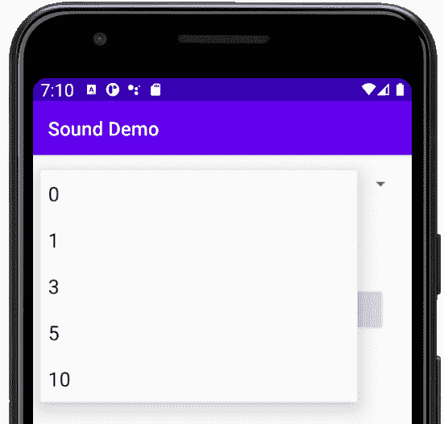

# 第二十三章：支持不同版本的 Android，声音效果和 Spinner 小部件

在本章中，我们将学习如何检测和处理不同版本的 Android。然后，我们将能够研究`SoundPool`类以及根据应用程序运行的 Android 设备的 Android 版本使用它的不同方式。在这一点上，我们可以将我们学到的一切都投入到制作一个很酷的声音演示应用程序中，这也将向我们介绍一个新的 UI 小部件**Spinner**。

总之，在本章中，我们将涵盖以下内容：

+   学习如何处理不同版本的 Android

+   学习如何使用 Android 的`SoundPool`类

+   编写一个基于声音的应用程序，同时使用`SpinnerView`小部件

让我们开始吧。

# 处理不同版本的 Android

在本书的大部分时间里，我们没有注意支持旧的 Android 设备，主要原因是我们一直在使用的 API 的最新部分在如此高比例的设备上运行（超过 99%），以至于似乎不值得。除非你打算在古老的 Android 遗物应用中开辟一个利基，否则这似乎是一个明智的做法。然而，关于播放声音，Android API 最近进行了一些相对较新的修改。

实际上，这并不是一个立即的大问题，因为比这更新的设备仍然可以使用 API 的旧部分。但是，特别处理这些兼容性差异是一个很好的做法，因为最终，有一天，旧的部分可能在新版本的 Android 上不起作用。

在此时此地讨论这个的主要原因是，Android Lollipop 之前和之后的声音处理中的轻微差异给了我们一个很好的借口，让我们看看我们如何在我们的代码中处理这样的事情。

我们将看看如何使我们的应用与最新的设备和早期的 Lollipop 设备兼容。

我们将使用的类来发出一些声音是`SoundPool`类。首先，让我们看一些检测当前 Android 版本的简单代码。

## 检测当前的 Android 版本

我们可以使用`Build.Version`类的静态变量来确定当前的 Android 版本，并且我们可以通过将其与该版本的适当`Build.VERSION_CODES`变量进行比较来确定它是否比特定版本更新。如果这个解释有点啰嗦，那就看看我们如何确定当前版本是否等于或更新（更大）于 Lollipop：

```kt
if (Build.VERSION.SDK_INT >= Build.VERSION_CODES.LOLLIPOP) {

   // Lollipop or newer code goes here 

} else {
   // Code for devices older than lollipop here

}
```

现在让我们看看如何在比 Lollipop 更新的 Android 设备和比 Lollipop 更老的 Android 设备上发出一些声音。

# SoundPool 类

`SoundPool`类允许我们保存和操作一系列音效 - 简而言之，一组声音。该类处理从解压声音文件（如`.wav`或`.ogg`）到通过整数 ID 保持标识引用，当然还包括播放声音的一切。当播放声音时，它是以非阻塞的方式进行的（在幕后使用线程），不会干扰我们的应用程序的流畅运行或用户与之的交互。

我们需要做的第一件事是将音效添加到游戏项目的`main`文件夹中名为`assets`的文件夹中。我们很快就会真正做到这一点。

接下来，在我们的 Java 代码中，声明一个`SoundPool`类型的对象和一个用作我们打算使用的每个音效的 ID 的`int`。我们还声明另一个名为`nowPlaying`的`int`，我们可以用它来跟踪当前正在播放的声音，我们很快就会看到我们是如何做到这一点的：

```kt
// create an ID
SoundPool sp;
int nowPlaying =-1;
int repeats = 2;
int idFX1 = -1;
float volume = 1;// Volumes rage from 0 through 1
```

现在我们将看一下我们初始化`SoundPool`的两种不同方式，这取决于设备使用的 Android 版本。这是使用我们编写不同版本的 Android 代码的绝佳机会。

## 以新方式初始化 SoundPool

新的方法涉及我们使用`AudioAttributes`对象来设置我们想要的声音池的属性。

在第一个代码块中，我们使用链接并在一个对象上调用四个单独的方法来初始化我们的`AudioAttributes`对象(`audioAttributes`)：

```kt
// Instantiate a SoundPool dependent on Android version
if (Build.VERSION.SDK_INT >= Build.VERSION_CODES.LOLLIPOP) {

   // The new way
   // Build an AudioAttributes object
AudioAttributes audioAttributes = 
      // First method call
new AudioAttributes.Builder()
// Second method call
         .setUsage
         (AudioAttributes.USAGE_ASSISTANCE_SONIFICATION)
          // Third method call
          .setContentType
          (AudioAttributes.CONTENT_TYPE_SONIFICATION)
          // Fourth method call
          .build();// Yay! A semicolon
   // Initialize the SoundPool
   sp = new SoundPool.Builder()
         .setMaxStreams(5)
         .setAudioAttributes(audioAttributes)
         .build();
} 
```

在代码中，我们使用链接和这个类的`Builder`方法来初始化一个`AudioAttributes`对象，让它知道它将用于与`USAGE_ASSISTANCE_SONIFICATION`进行 UI 交互。

我们还使用`CONTENT_TYPE_SONIFICATION`值，让该类知道它是用于响应声音，例如用户按钮点击，碰撞或类似情况。

现在我们可以通过传入`AudioAttributes`对象(`audioAttributes`)和我们可能想要播放的最大同时声音数量来初始化`SoundPool`(`sp`)本身。

第二个代码块将另外四个方法链接到初始化`sp`，包括调用`setAudioAttributes`，该方法使用我们在之前链接方法块中初始化的`audioAttributes`对象。

现在我们可以编写一个`else`代码块，其中当然包含了旧方法的代码。

## 以旧方式初始化 SoundPool

不需要`AudioAttributes`对象；只需通过传入同时播放的声音数量来初始化`SoundPool`(`sp`)。最后一个参数是声音质量，传入`0`就足够了。这比新方法简单得多，但在我们可以做出的选择方面也不够灵活：

```kt
else {
   // The old way
   sp = new SoundPool(5, AudioManager.STREAM_MUSIC, 0);
}
```

注意

我们可以使用旧方法，较新版本的 Android 也可以处理它。但是，我们会收到有关使用已弃用方法的警告。这就是官方文档对此的说法。

此外，新方法提供了更多功能，正如我们所看到的。无论如何，这是一个很好的借口来查看处理不同版本 Android 的一些简单代码。

现在我们可以加载（解压缩）声音文件到我们的`SoundPool`中。

### 加载声音文件到内存

与我们的线程控制一样，我们需要将我们的代码包装在`try`-`catch`块中。这是有道理的，因为读取文件可能因我们无法控制的原因而失败，而且我们被迫这样做是因为我们使用的方法会抛出异常，否则我们编写的代码将无法编译。

在`try`块中，我们声明并初始化了`AssetManager`和`AssetFileDescriptor`类型的对象。

通过使用`AssetManager`对象的`openFd`方法初始化`AssetFileDescriptor`实例，该方法实际上解压缩声音文件。然后我们初始化我们的 ID(`idFX1`)，同时将`AssetFileDescriptor`的内容加载到我们的`SoundPool`中。

`catch`块只是向控制台输出一条消息，让我们知道是否出了什么问题。请注意，无论 Android 版本如何，此代码都是相同的：

```kt
try{

   // Create objects of the 2 required classes
   AssetManager assetManager = this.getAssets();
   AssetFileDescriptor descriptor;
   // Load our fx in memory ready for use
   descriptor = assetManager.openFd("fx1.ogg");
   idFX1 = sp.load(descriptor, 0);
}catch(IOException e){

   // Print an error message to the console
   Log.d("error", "failed to load sound files");
}
```

我们准备制造一些噪音。

### 播放声音

在这一点上，我们的`SoundPool`实例中有一个音效，并且我们有一个 ID 可以用来引用它。

无论我们如何构建`SoundPool`对象，这段代码都是相同的，这就是我们播放声音的方式。请注意，在下一行代码中，我们使用相同方法的返回值来初始化`nowPlaying`变量。

因此，以下代码同时播放声音并将正在播放的 ID 的值加载到`nowPlaying`中：

```kt
nowPlaying = sp.play(idFX1, volume, volume, 0, repeats, 1);
```

注意

不需要将 ID 存储在`nowPlaying`中来播放声音，但正如我们将要看到的那样，它也有其用途。

`play`方法的参数如下：

+   音效的 ID

+   左扬声器音量和右扬声器音量

+   相对于其他声音的优先级

+   重复播放声音的次数

+   它播放的速率/速度（1 是正常速率）

在我们制作声音演示应用之前，还有一件事。

### 停止声音

使用`stop`方法在声音仍在播放时停止声音也非常简单。请注意，可能在任何给定时间有多个音效正在播放，因此`stop`方法需要声音效果的 ID 来停止：

```kt
sp.stop(nowPlaying);
```

当您调用`play`时，如果要跟踪当前播放的声音，只需存储其 ID，以便以后可以与其交互。很快我们将看到，在 Pong 游戏中播放声音的代码看起来更像这样：

```kt
sp.play(mBeepID, 1, 1, 0, 0, 1);
```

上一行代码将简单地以最大音量播放所选的声音（`mBeepID`），具有最低的优先级，直到以正常速度结束且不重复。

现在我们可以制作声音演示应用程序。

# 声音演示应用程序介绍 Spinner 小部件

当然，谈到声音效果，我们需要一些实际的声音文件。您可以使用 Bfxr 制作自己的声音效果（下面解释），也可以使用提供的声音效果。该应用程序的声音效果位于*第二十三章*`/Sound Demo`文件夹中的下载包的`assets`文件夹中。但您可能想制作自己的声音效果。

## 制作声音效果

有一个名为 Bfxr 的开源应用程序，可以让我们制作自己的声音效果。以下是使用 Bfxr 制作自己的声音效果的快速指南。从[www.bfxr.net](http://www.bfxr.net)免费获取一份副本。

注意

请注意，声音演示应用程序的声音效果已经在*第二十三章*`/assets`文件夹中提供给您。除非您愿意，否则您无需创建自己的声音效果。学习如何使用它仍然是值得的。

按照网站上的简单说明进行设置。尝试其中一些内容以制作酷炫的声音效果：

注意

这是一个非常简化的教程。您可以使用 Bfxr 做更多事情。要了解更多，请阅读上一个 URL 网站上的提示。如果您在下载 Bfxr 时遇到问题，可以使用该网站创建所有您的声音效果，或者只使用提供的示例。

1.  运行 Bfxr：

图 23.1 – Bfxr 页面

1.  尝试所有生成该类型随机声音的预设类型。当您有接近所需声音时，继续下一步：

图 23.2 – 不同效果

1.  使用滑块微调音调、持续时间和其他方面的新声音：

图 23.3 – 调整您的声音

1.  通过单击`.wav`按钮保存您的声音：

图 23.4 – 导出 Wav 按钮

1.  Android 与 OGG 格式的声音非常兼容，因此在要求命名文件时，请在文件名末尾使用`.ogg`扩展名。

1.  重复*步骤 2*至*5*，创建三个酷炫的音效。将它们命名为`fx1.ogg`，`fx2.ogg`和`fx3.ogg`。我们使用`.ogg`文件格式，因为它比 WAV 等格式更压缩。

一旦您的声音文件准备好，我们就可以继续进行应用程序。

## 布置声音演示

我将更简洁地描述我们正在适应的项目的部分，比以前的项目更简洁。但是，每当有新概念时，我一定会详细解释。我想现在你应该可以轻松地将一些小部件拖放到`ConstraintLayout`上并更改它们的`text`属性。

完成以下步骤。如果您遇到任何问题，可以在下载包的*第二十三章*文件夹中复制或查看代码：

1.  创建一个新项目，命名为`Sound Demo`，从`activity_main.xml`文件中选择`TextView`。

1.  现在我们将在`activity_main.xml`文件中构建布局，所以请确保处于设计视图中。按照从上到下，然后从左到右的顺序，拖放`text`属性，如下一张截图所示：

图 23.5 – 在 activity_main.xml 文件中构建布局

1.  单击**推断约束**按钮。

1.  使用以下表格设置它们的属性：

1.  接下来，在 values 文件夹中的 strings.xml 文件中添加以下突出显示的代码。我们在上一步中使用了名为 spinner_options 的字符串资源数组作为上一步中 options 属性的选项。它将表示可以从我们的 Spinner 小部件中选择的选项：

```kt
<resources>
    <string name="app_name">Sound Demo</string>
    <string name="hello_world">Hello world!</string>
    <string-array name="spinner_options">
      <item>0</item>
      <item>1</item>
      <item>3</item>
      <item>5</item>
      <item>10</item>
    </string-array>
    </resources>
```

现在运行应用程序，最初您将看不到任何我们以前没有看到的东西。但是，如果您点击下拉列表，您将看到我们称为 spinner_options 的字符串数组中的选项。我们可以使用下拉列表来控制播放音效时音效重复的次数：



图 23.6 - 下拉列表选项

让我们编写 Java 代码使这个应用程序工作，包括我们如何与我们的下拉列表交互。

使用操作系统的文件浏览器，转到项目的 app\src\main 文件夹，并添加一个名为 assets 的新文件夹。

在下载包的/assets 文件夹中有三个预先准备好的音频文件*第二十三章*。将这三个文件放入您刚创建的 assets 目录中，或者使用您自己创建的文件。重要的是它们的文件名是 fx1.ogg，fx2.ogg 和 fx3.ogg。

## 编写声音演示

首先，我们将更改类声明，以便我们可以有效地处理所有小部件的交互。编辑声明以实现 View.OnClickListener，如下所示：

```kt
public class MainActivity extends AppCompatActivity 
implements View.OnClickListener {
```

我们将很快添加所需的 onClick 方法。

现在，我们为我们的 SoundPool、音效 ID、nowPlaying int（如前所述），还将添加一个 float 来保存音量值，介于 0（静音）和 1（相对于设备当前音量的最大音量）之间。我们还将添加一个 int 叫做 repeats，它不出所料地保存我们将重复播放给定音效的次数的值：

```kt
SoundPool sp;
int idFX1 = -1;
int idFX2 = -1;
int idFX3 = -1;
int nowPlaying = -1;
float volume = .1f;
int repeats = 2;
```

现在，在 onCreate 方法中，我们可以以通常的方式获取引用并为我们的按钮设置点击侦听器。将以下代码添加到项目中：

```kt
Button buttonFX1 = findViewById(R.id.btnFX1);
buttonFX1.setOnClickListener(this);
Button buttonFX2 = findViewById(R.id.btnFX2);
buttonFX2.setOnClickListener(this);
Button buttonFX3 = findViewById(R.id.btnFX3);
buttonFX3.setOnClickListener(this);
Button buttonStop = findViewById(R.id.btnStop);
buttonStop.setOnClickListener(this);
```

仍然在 onCreate 中，我们可以根据设备使用的 Android 版本初始化我们的 SoundPool（sp）。将以下代码添加到项目中：

```kt
// Instantiate our SoundPool based on the version of Android
if (Build.VERSION.SDK_INT >= Build.VERSION_CODES.LOLLIPOP) {
   AudioAttributes audioAttributes = 
      new AudioAttributes.Builder()
   .setUsage(AudioAttributes. 
   USAGE_ASSISTANCE_SONIFICATION)

   .setContentType(
   AudioAttributes.CONTENT_TYPE_SONIFICATION)
                .build();
   sp = new SoundPool.Builder()
                .setMaxStreams(5)
                .setAudioAttributes(audioAttributes)
                .build();
} else {
   sp = new SoundPool(5, AudioManager.STREAM_MUSIC, 0);
}
```

注意

使用您喜欢的方法为前面的代码添加以下 import 语句：

导入 android.media.AudioAttributes;

导入 android.media.AudioManager;

导入 android.media.SoundPool;

导入 android.os.Build;

导入 android.view.View;

导入 android.widget.Button;

接下来，依次加载我们的每个音效，并使用一个值来初始化我们的 ID，该值指向我们加载到 SoundPool 中的相关音效。整个过程都包裹在 try-catch 块中。将以下代码添加到项目中：

```kt
try{
   // Create objects of the 2 required classes
   AssetManager assetManager = this.getAssets();
   AssetFileDescriptor descriptor;
   // Load our fx in memory ready for use
   descriptor = assetManager.openFd("fx1.ogg");
   idFX1 = sp.load(descriptor, 0);
   descriptor = assetManager.openFd("fx2.ogg");
   idFX2 = sp.load(descriptor, 0);
   descriptor = assetManager.openFd("fx3.ogg");
   idFX3 = sp.load(descriptor, 0);
}catch(IOException e){
   // Print an error message to the console
   Log.e("error", "failed to load sound files");
}
```

注意

使用您喜欢的方法为前面的代码添加以下 import 语句：

导入 android.content.res.AssetFileDescriptor;

导入 android.content.res.AssetManager;

导入 android.util.Log;

导入 java.io.IOException;

然后我们看看我们将如何处理 SeekBar 小部件。正如您可能已经期待的那样，我们将使用一个匿名类。我们使用 OnSeekBarChangeListener 类并重写 onProgressChanged，onStartTrackingTouch 和 onStopTrackingTouch 方法。

我们只需要在 onProgressChanged 方法中添加代码。在这个方法中，我们只是改变我们的音量变量的值，然后在我们的 SoundPool 对象上使用 setVolume 方法，传入当前播放的音效和左右声道的音量。将以下代码添加到项目中：

```kt
// Now setup the seekbar
SeekBar seekBar = findViewById(R.id.seekBar);
seekBar.setOnSeekBarChangeListener(new SeekBar.OnSeekBarChangeListener() {
   @Override
   public void onProgressChanged(SeekBar seekBar, 
   int value, boolean fromUser) {
         volume = value / 10f;
         sp.setVolume(nowPlaying, volume, volume);
   }
   @Override
   public void onStartTrackingTouch(SeekBar seekBar) {
   }
   @Override
   public void onStopTrackingTouch(SeekBar seekBar) {
   }
});
```

注意

使用您喜欢的方法为前面的代码添加以下 import 语句：

导入 android.widget.SeekBar;

在 SeekBar 代码之后是 Spinner 代码和另一个匿名类来处理用户交互。我们使用 AdapterView.OnItemSelectedListener 来重写 onItemSelected 和 onNothingSelected 方法。

我们所有的代码都放在`onItemSelected`方法中，该方法创建一个名为`temp`的临时字符串，然后使用`Integer.ValueOf`方法将字符串转换为`int`，我们可以用它来初始化`repeats`变量。将以下代码添加到项目中：

```kt
// Now for the spinner
final Spinner spinner = (Spinner) findViewById(R.id.spinner);
spinner.setOnItemSelectedListener(
new AdapterView.OnItemSelectedListener() {
   @Override
   public void onItemSelected(AdapterView<?> 
   parentView, View selectedItemView, 
   int position, long id) {
         String temp = String.valueOf(
         spinner.getSelectedItem());
         repeats = Integer.valueOf(temp);
   }
   @Override
   public void onNothingSelected(AdapterView<?> parentView) {

   }
});
```

注意

使用您喜欢的方法为以前的代码添加以下`import`语句：

导入 android.widget.AdapterView;

导入 android.widget.Spinner;

这就是`onCreate`的全部内容。

现在实现`onClick`方法，这是必需的，因为这个类实现了`View.OnClickListener`接口。简单地说，每个按钮都有一个`case`语句。有一个`case`语句来播放我们的三种声音效果，设置音量和设置重复次数。请注意，对`play`的每次调用的返回值都存储在`nowPlaying`中。当用户按下`stop`时，`nowPlaying`的当前值会导致最近启动的声音效果停止。将以下代码添加到项目中：

```kt
@Override
public void onClick(View v) {
   switch (v.getId()){
         case R.id.btnFX1:
                sp.stop(nowPlaying);
                nowPlaying = sp.play(idFX1, volume, 
                volume, 0, repeats, 1);
                break;
         case R.id.btnFX2:
                sp.stop(nowPlaying);
                nowPlaying = sp.play(idFX2, 
                volume, volume, 0, repeats, 1);
                break;
         case R.id.btnFX3:
                sp.stop(nowPlaying);
                nowPlaying = sp.play(idFX3, 
                volume, volume, 0, repeats, 1);
                break;
         case R.id.btnStop:
                sp.stop(nowPlaying);
                break;
   }
}
```

现在我们可以运行应用程序。如果听不到任何声音，请确保设备的音量已调高。

点击适当的按钮以播放所需的声音效果。更改音量和重复次数，当然，尝试使用**STOP**按钮停止它。

还要注意，当一个声音效果正在播放时，您可以重复点击多个播放按钮，声音将同时播放，直到我们设置的最大流数（`5`）。

# 总结

在本章中，我们仔细研究了`SoundPool`类，包括如何检测用户使用的 Android 版本并相应地改变我们的代码。然后，我们利用所有这些知识完成了声音演示应用程序。

在下一章中，我们将学习如何使我们的应用程序与多种不同的布局配合工作。
