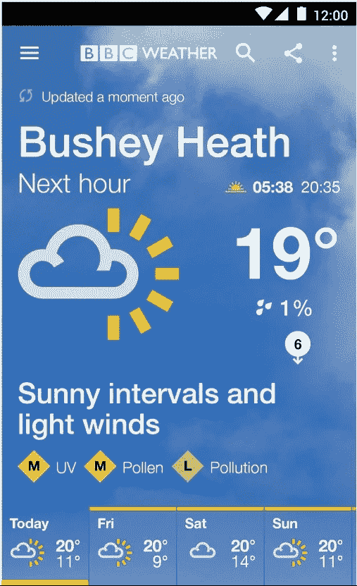
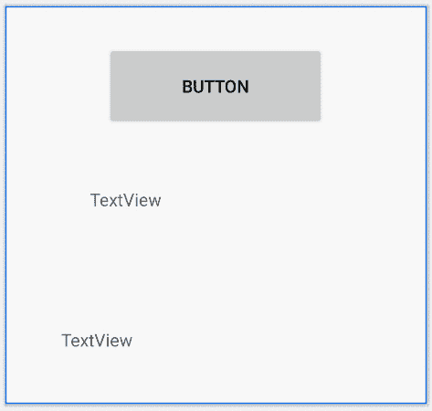
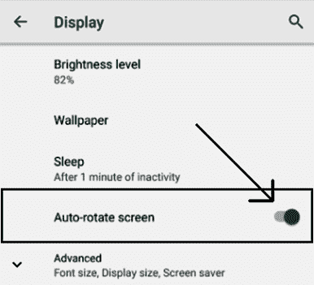
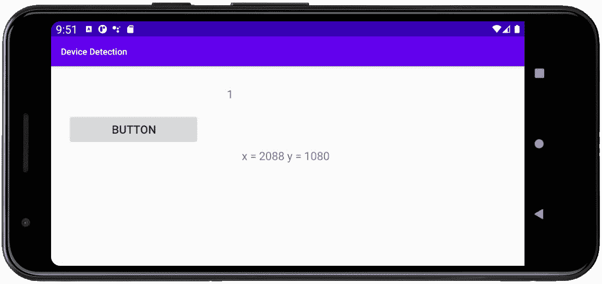
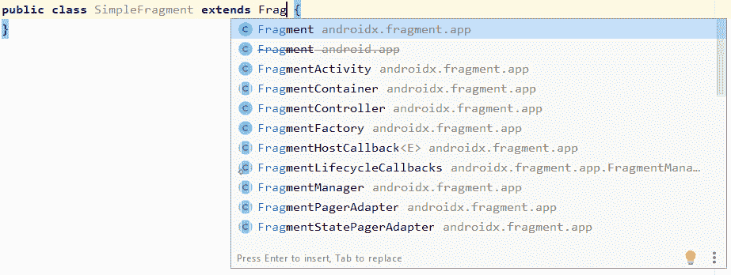

# 第二十四章：*第二十四章*：设计模式、多种布局和片段

从我们刚开始设置 Android Studio 的时候，我们已经走了很长的路。那时，我们一步一步地进行了所有操作，但随着我们的进展，我们试图展示的不仅仅是如何将 x 添加到 y 或将功能 a 添加到应用程序 b，而是让你能够以自己的方式使用所学到的知识来实现自己的想法。

乍一看，这一章可能看起来枯燥而技术性，但这一章更多地关乎你未来的应用程序，而不是迄今为止书中的任何内容。我们将看一下 Java 和 Android 的一些方面，你可以将其用作框架或模板，以制作更加令人兴奋和复杂的应用程序，同时保持代码的可管理性。这是成功现代应用程序的关键。此外，我将建议进一步学习的领域，这本书中根本没有足够的空间来涉及。

在这一章中，我们将学习以下内容：

+   模式和模型-视图-控制器

+   Android 设计指南

+   开始使用真实世界的设计和处理多种不同的设备

+   片段简介

让我们开始吧。

# 技术要求

你可以在 GitHub 上找到本章的代码文件[`github.com/PacktPublishing/Android-Programming-for-Beginners-Third-Edition/tree/main/chapter%2024`](https://github.com/PacktPublishing/Android-Programming-for-Beginners-Third-Edition/tree/main/chapter%2024)。

# 介绍模型-视图-控制器模式

模型-视图-控制器模式涉及将我们应用程序的不同方面分离成称为层的明确部分。Android 应用程序通常使用模型-视图-控制器模式。模式只是一种公认的结构代码和其他应用资源（如布局文件、图像、数据库等）的方式。

模式对我们很有用，因为通过遵循模式，我们可以更有信心地做正确的事情，也不太可能因为将自己编码到尴尬的境地而不得不撤销大量的辛苦工作。

在计算机科学中有许多模式，但了解模型-视图-控制器（MVC）就足以创建一些专业构建的 Android 应用程序。

我们已经部分地使用了 MVC，所以让我们依次看看这三个层：

+   `Note`类以及它的 getter、setter 和 JSON 代码是数据和逻辑。

+   Android API 的`View`类层次结构。

+   控制器：控制器是视图和模型之间的部分。它与两者进行交互并保持它们分开。它包含了所谓的应用逻辑。如果用户点击按钮，应用层决定如何处理它。当用户点击“确定”以添加新的注释时，应用层监听视图层上的交互。它捕获视图中包含的数据并将其传递给模型层。

注

设计模式是一个庞大的主题。有许多不同的设计模式，如果你想对这个主题有一个适合初学者的介绍，我会推荐《Head First Design Patterns》。如果你想深入了解设计模式的世界，那么你可以尝试《Design Patterns: Elements of Reusable Object-Oriented Software》，这本书被认为是一种设计模式的权威，但阅读起来要困难得多。

随着书籍的进展，我们还将开始更多地利用我们已经讨论过但尚未充分利用的面向对象编程方面。我们将一步一步地做到这一点。

# Android 设计指南

应用程序设计是一个广阔的主题。这是一个只能在一本专门的书中开始教授的主题。而且，就像编程一样，只有通过不断的练习、审查和改进，你才能开始擅长应用程序设计。

那么，我所说的设计到底是什么意思呢？我指的是您将小部件放在屏幕上的位置，使用哪些小部件，它们应该是什么颜色，大小应该是多少，如何在屏幕之间进行过渡，滚动页面的最佳方式，何时以及使用哪些动画插值器，您的应用程序应该分成哪些屏幕，以及还有更多其他内容。

希望本书能让您有能力*实施*您对上述问题的所有选择。不幸的是，本书没有足够的空间，作者可能也没有足够的技能来教您如何*做出*这些选择。

注意

您可能会想，“我应该怎么办？”继续制作应用程序，不要让缺乏设计经验和知识阻止您！甚至将您的应用程序发布到应用商店。但请记住，还有这样一个完全不同的话题 - 设计 - 如果您的应用程序真的要成为世界一流的应用程序，那就需要一些关注。

即使在中等规模的开发公司中，设计师很少也是程序员，即使是非常小的公司也经常会外包他们的应用程序的设计（或设计师可能会外包编码）。

设计既是艺术又是科学，Google 已经证明他们认识到这一点，为现有设计师和新设计师提供了高质量的支持。

注意

我强烈建议您访问并收藏这个网页：[`developer.android.com/design/`](https://developer.android.com/design/)。它非常详细和全面，完全专注于 Android，并提供了大量的资源，包括图像、调色板和指南。

使理解设计原则成为短期目标。使提高您的实际设计技能成为一项持续的任务。访问并阅读以设计为重点的网站，并尝试实施您发现令人兴奋的想法。

然而，最重要的是，不要等到您成为设计专家才开始制作应用程序。继续将您的想法付诸实践并发布它们。要求每个应用程序的设计都比上一个稍微好一点。

我们将在接下来的章节中看到，并且已经看到，Android API 为我们提供了一整套超时尚的 UI，我们可以利用这些 UI，只需很少的代码或设计技能。这些 UI 在很大程度上使您的应用程序看起来就像是由专业人员设计的。

# 现实世界的应用程序

到目前为止，我们已经构建了十几个或更多不同复杂度的应用程序。其中大部分我们都是在手机上设计和测试的。

当然，在现实世界中，我们的应用程序需要在任何设备上都能良好运行，并且必须能够处理在纵向或横向视图（在所有设备上）发生的情况。

此外，我们的应用程序通常不能只是在不同设备上“正常工作”和“看起来还行”就足够了。通常，我们的应用程序需要根据设备是手机还是平板电脑，以及是横向还是纵向方向，而表现出明显不同的 UI 和行为。

注意

Android 支持大屏幕电视、通过 Wear API 支持智能手表、虚拟现实和增强现实，以及物联网中的“物品”。本书不涵盖后两种情况，但在本书结束时，作者猜测您将准备好涉足这些话题，如果您选择的话。

看看 BBC 天气应用程序在 Android 手机上以纵向方向运行的截图。看看基本布局，也研究所显示的信息，因为我们将很快将其与平板应用程序进行比较：



图 24.1 - BBC 天气应用程序在 Android 手机上以纵向方向运行

目前，上一张截图的目的并不是为了向您展示具体的 UI 功能，而是为了让您能够将其与下一张截图进行比较。看看在平板电脑上以横向方向运行的完全相同的应用程序：


图 24.2 – BBC 天气应用在 Android 手机上横向方向运行

请注意，与手机应用程序相比，平板电脑 UI 有一个额外的信息面板。这个额外的面板在前面的截图中被突出显示。

这个截图的重点再次不是特定的 UI，甚至我们如何实现类似的 UI，而是 UI 是如此不同，它们很容易被认为是完全不同的应用程序。然而，如果您下载这个应用程序，平板电脑和手机是相同的下载。

Android 允许我们设计这样的真实应用程序，其中不仅布局针对不同的设备类型/方向/大小是不同的，而且（这一点很重要）行为也是不同的。使这一切成为可能的 Android 秘密武器是`片段`。

谷歌说：

“片段代表活动中的行为或用户界面的一部分。您可以在单个活动中组合多个片段，以构建多窗格 UI，并在多个活动中重用片段。

您可以将片段视为活动的模块化部分，它具有自己的生命周期，接收自己的输入事件，并且您可以在活动运行时添加或删除它（有点像可以在不同活动中重复使用的“子活动”）。

片段必须始终嵌入在活动中，片段的生命周期受主机活动的生命周期直接影响。

我们可以在不同的 XML 文件中设计多个不同的布局，我们很快就会这样做。我们还可以在我们的 Java 代码中检测设备方向和屏幕分辨率，因此我们可以动态地做出布局方面的决策。

让我们尝试使用设备检测，然后我们将首次查看片段。

# 设备检测迷你应用

了解检测和响应设备及其不同属性（屏幕、方向等）的最佳方法是制作一个简单的应用程序：

1.  创建一个新的`设备检测`。将所有其他设置保留为默认设置。

1.  在设计选项卡中打开`activity_main.xml`文件，并删除默认的`TextView`。

1.  拖动`detectDevice`。我们将在一分钟内编写这个方法。

1.  拖动两个`txtOrientation`和`txtResolution`。

1.  检查您是否有一个看起来像下一个截图的布局：

注意

我拉伸了我的小部件（主要是水平方向），并增加了`textSize`属性到`24sp`，以使它们在屏幕上更清晰，但这对于应用程序的正确工作并不是必需的。



图 24.3– 布局检查

1.  单击**推断约束**按钮以固定 UI 元素的位置。

现在我们将做一些新的事情。我们将专门为横向方向构建一个布局。

在 Android Studio 中，确保在编辑器中选择了`activity_main.xml`文件，并找到如下所示的**预览方向**按钮：


图 24.4 – 创建横向变化

单击它，然后选择**创建横向变化**。

现在，您有一个新的布局 XML 文件，名称相同，但是是横向模式。布局在编辑器中看起来是空白的，但正如我们将看到的那样，情况并非如此。查看项目资源管理器中的`layout`文件夹，并注意确实有两个名为`activity_main`的文件，其中一个（我们刚刚创建的新文件）带有**land**后缀。这在下一个截图中显示：


图 24.5 – activity_main 文件夹

选择这个新文件（带有**land**后缀的文件），现在查看组件树。它在下一个截图中显示：


图 24.6 – 组件树

看起来布局已经包含了我们所有的小部件 - 我们只是无法在设计视图中看到它们。这种异常的原因是，当我们创建横向布局时，Android Studio 复制了纵向布局，包括所有的约束。纵向约束很少与横向约束匹配。

要解决这个问题，点击**删除所有约束**按钮；它是**推断约束**按钮左侧的按钮。现在 UI 没有约束了。所有的 UI 小部件将会混乱地出现在左上角。一次一个，重新排列它们，使其看起来像下一个截图。我不得不手动添加约束来使这个设计工作，所以我在下一个截图中展示了约束：


图 24.7 - 添加约束

点击`/Device Detection/layout-land`文件夹。

注意

外观并不重要，只要您能看到两个`TextView`小部件的内容并点击按钮即可。

现在我们有了两种不同方向的基本布局，我们可以把注意力转向编写 Java 代码。

## 编写 MainActivity 类

在`MainActivity`类声明之后，添加以下成员变量，以保存对我们两个`TextView`小部件的引用：

```kt
private TextView txtOrientation;
private TextView txtResolution;
```

注意

此时导入`TextView`类：

`import android.widget.TextView;`

现在，在`MainActivity`类的`onCreate`方法中，在调用`setContentView`之后，添加以下代码：

```kt
// Get a reference to our TextView widgets
txtOrientation = findViewById(R.id.txtOrientation);
txtResolution = findViewById(R.id.txtResolution);
```

在`onCreate`之后，添加处理我们按钮点击并运行检测代码的方法：

```kt
public void detectDevice(View v){
   // What is the orientation?
   Display display = 
   getWindowManager().getDefaultDisplay();
   txtOrientation.setText("" + display.getRotation());
   // What is the resolution?
   Point xy = new Point();
   display.getSize(xy);
   txtResolution.setText("x = " + xy.x + " y = " + xy.y);
}
```

注意

导入以下三个类：

`import android.graphics.Point;`

`import android.view.Display;`

`import android.view.View;`

这段代码通过声明和初始化一个名为`display`的`Display`类型的对象来工作。这个对象（`display`）现在保存了关于设备特定显示属性的大量数据。

`getRotation`方法的结果输出到顶部的`TextView`小部件中。

然后，代码初始化了一个名为`xy`的`Point`类型的对象。`getSize`方法然后将屏幕分辨率加载到`xy`中。然后使用`setText`方法将水平（`xy.x`）和垂直（`xy.y`）分辨率输出到`TextView`小部件中。

注意

您可能还记得我们在 Kids 绘画应用中使用了`Display`和`Point`类。

每次点击按钮，两个`TextView`小部件都将被更新。

### 解锁屏幕方向

在我们运行应用程序之前，我们要确保设备没有锁定在纵向模式（大多数新手机默认情况下是这样）。从模拟器的应用抽屉（或您将要使用的设备）中，点击**设置**应用程序，选择**显示**，并使用开关将**自动旋转屏幕**设置为开启。我在下一个截图中展示了这个设置：



图 24.8 - 自动旋转屏幕

## 运行应用程序

现在您可以运行应用程序并点击按钮：


图 24.9 - 点击按钮

使用模拟器控制面板上的旋转按钮之一，将设备旋转到横向：


图 24.10 - 旋转设备

注意

您还可以在 PC 上使用*Ctrl* + *F11*，在 Mac 上使用*Ctrl* + *FN* + *F11*。

现在再次点击按钮，您将看到横向布局的效果：



图 24.11 - 横向布局

您可能会注意到的第一件事是，当您旋转屏幕时，屏幕会短暂地变空白。这是 Activity 重新启动并再次调用`onCreate`方法 - 这正是我们需要的。它在横向布局上调用`setContentView`方法，而`MainActivity`中的代码引用具有相同 ID 的小部件，所以完全相同的代码可以工作。

注意

不要花太多时间思考这个问题，因为我们将在本章后面讨论它。

如果 0 和 1 的结果对设备方向不够明显，它们指的是`Surface`类的`public static final`变量 - `Surface.ROTATION_0`等于 0，`Surface.ROTATION_180`等于 1。

注意

请注意，如果您将屏幕向左旋转，那么您的值将是 1 - 与我的相同，但如果您将其向右旋转，您将看到值 3。如果您将设备旋转到倒置的纵向模式，您将获得值 4。

然后我们可以根据这些检测测试的结果编写一个`switch`块，并加载不同的布局。

但正如我们刚才看到的，Android 通过允许我们将特定布局添加到带有配置限定符的文件夹中（例如**land**，代表横向）来简化这一过程。

# 配置限定符

我们已经在*第三章*中遇到了配置限定符，例如`layout-large`和`layout-xhdpi`，*探索 Android Studio 和项目结构*。在这里，我们将刷新并扩展对它们的理解。

我们可以通过使用配置限定符开始减少对控制器层的影响来影响应用程序布局。有关大小、方向和像素密度的配置限定符。要利用配置限定符，我们只需按照通常的方式设计布局，针对我们首选的配置进行优化，然后将该布局放入 Android 识别为特定配置的文件夹中。

例如，在前一个应用程序中，将布局放入`land`文件夹会告诉 Android 在设备处于横向方向时使用布局。

上述声明可能会显得有些模糊。这是因为 Android Studio 的`layout`和`layout-land`文件夹如下所示：


图 24.12 - 布局和布局-横向文件夹

切换回**Android**视图或保持在**项目文件**视图上 - 任何您喜欢的。

因此，如果我们想要为横向和纵向创建不同的布局，我们将在`res`文件夹中创建一个名为`layout-land`的文件夹（或者使用我们在前一个应用程序中使用的快捷方式），并在其中放置我们专门设计的布局。

当设备处于纵向位置时，将使用`layout`文件夹中的常规布局，当设备处于横向位置时，将使用`layout-land`文件夹中的布局。

如果我们要为不同尺寸的屏幕设计，我们将布局放入以下名称的文件夹中：

+   `layout-small`

+   `layout-normal`

+   `layout-large`

+   `layout-xlarge`

如果我们要为不同像素密度的屏幕设计，我们可以将 XML 布局放入文件夹中，文件夹的名称如下：

+   `layout-ldpi` 用于低 DPI 设备

+   `layout-mdpi` 用于中等 DPI 设备

+   `layout-hdpi` 用于高 DPI 设备

+   `layout-xhdpi` 用于超高 DPI 设备

+   `layout-xxhdpi` 用于超超高 DPI 设备

+   `layout-xxxhdpi` 用于超高 DPI 设备

+   `layout-nodpi` 用于未另外适配 DPI 的设备

+   `layout-tvdpi` 用于电视

低、高或超高 DPI 等的确切资格可以在下一个信息框中的链接中进行研究。这里的重点是原则。

值得指出的是，我们刚才讨论的远远不是关于配置限定符的全部故事，与设计一样，值得将其列入进一步研究的事项清单。

注意

通常，Android 开发者网站上有大量关于处理不同设备布局的详细信息。请尝试此链接以获取更多信息：[`developer.android.com/guide/practices/screens_support`](https://developer.android.com/guide/practices/screens_support)。

## 配置限定符的限制

前一个应用程序和我们对配置限定符的讨论在许多情况下确实非常有用。然而，不幸的是，配置限定符和在代码中检测属性只解决了我们 MVC 模式的视图层中的问题。

正如讨论的那样，我们的应用程序有时需要具有不同的*行为*以及布局。这可能意味着我们的 Java 代码在控制器层（在我们以前的大多数应用程序中为`MainActivity`）中有多个分支，并且可能召唤出对于每种不同情况都有不同代码的巨大的`if`或`switch`块的可怕愿景。

幸运的是，这不是这样做的方式。对于这种情况，实际上对于大多数应用程序，Android 都有片段。

# 片段

片段很可能会成为您制作的几乎每个应用程序的主打。它们非常有用，有很多使用它们的理由，一旦您习惯了它们，它们就变得非常简单，几乎没有理由不使用它们。

片段是应用程序的可重用元素，就像任何类一样，但正如之前提到的，它们具有特殊功能，例如能够加载它们自己的视图/布局以及它们自己的生命周期方法，这使它们非常适合实现我们在*真实世界应用程序*部分讨论的目标，并为不同的设备（如我们查看的天气应用程序）拥有不同的布局和代码。

让我们深入了解片段，一次一个特性。

## 片段也有生命周期

我们可以设置和控制片段，就像我们对活动所做的那样，覆盖适当的生命周期方法：

+   `onCreate`：在`onCreate`方法中，我们可以初始化变量并几乎可以做所有我们通常在`Activity onCreate`方法中做的事情。这个方法的一个重要例外是初始化我们的 UI。

+   `onCreateView`：在这个方法中，我们将像其名称所示一样，获取对我们的任何 UI 小部件的引用，设置匿名类以监听点击，以及更多其他内容，我们很快就会看到。

+   `onAttach`和`onDetach`：这些方法在将`Fragment`投入使用/停止使用之前调用。

+   `onResume`，`onStart`，`onPause`和`onStop`：在这些方法中，我们可以执行某些操作，例如创建或删除对象或保存数据，就像我们在基于它们的`Activity`中所做的那样。

注意

如果您想详细了解`Fragment`的生命周期，请访问 Android 开发者网站上的此链接：[`developer.android.com/guide/components/fragments`](https://developer.android.com/guide/components/fragments)。

这一切都很好，但我们需要一种方法来首先创建我们的片段，并能够在正确的时间调用这些方法。

## 使用 FragmentManager 管理片段

`FragmentManager`类是`Activity`的一部分。我们使用它来初始化`Fragment`，将片段添加到活动的布局中，并结束`Fragment`。我们之前在初始化`FragmentDialog`时简要看到了`FragmentManager`。

注意

在 Android 中学习很难避免碰到`Fragment`类，就像在学习 Java 时不断碰到 OOP/类一样困难，等等。

以下突出显示的代码显示了我们如何使用`FragmentManager`（它已经是`Activity`的一部分）作为参数来创建弹出对话框：

```kt
button.setOnClickListener(new View.OnClickListener() {
   @Override
   public void onClick(View v) {
         // Create a new DialogShowNote called dialog
         DialogShowNote dialog = new DialogShowNote();

         // Send the note via the sendNoteSelected method
         dialog.sendNoteSelected(mTempNote);

         // Create the dialog
         dialog.show(getFragmentManager(), "123");
   }
});
```

当时，我要求您不要关心方法调用的参数。方法调用的第二个参数是`Fragment`的 ID。我们将看到如何更广泛地使用`FragmentManager`，以及如何使用`Fragment` ID。

`FragmentManager`确实做到了其名称所暗示的。这里重要的是`Activity`只有一个`FragmentManager`，但它可以处理许多片段。这正是我们需要在单个应用程序中拥有多个行为和布局的情况。

FragmentManager 还调用其负责的片段的各种生命周期方法。这与 Android 调用的 Activity 生命周期方法是不同的，但又密切相关，因为 FragmentManager 调用许多 Fragment 生命周期方法是作为对 Activity 生命周期方法的响应。通常情况下，如果我们在每种情况下做出适当的响应，我们就不需要太担心何时以及如何做出响应。

注意

片段将成为我们未来许多，如果不是所有应用程序的基本部分。然而，就像我们对命名约定、字符串资源和封装性所做的那样，出于简单学习目的或在应用程序很小且使用片段会过度的情况下，我们将不使用片段。当然，学习片段时将是一个例外。

# 我们的第一个 Fragment 应用程序

让我们以尽可能简单的形式构建 Fragment，以便在后面的章节中，在我们开始在各个地方生成真正有用的 Fragment 之前，我们可以理解正在发生的事情。

注意

我敦促所有读者浏览并构建此项目。从一个文件跳到另一个文件，仅仅阅读可能会使它看起来比实际复杂得多。当然，你可以从下载包中复制粘贴代码，但也请按照步骤创建自己的项目和类。片段并不太难，但它们的实现，正如它们的名字所暗示的那样，有点分散。

使用空活动模板创建一个名为`Simple Fragment`的新项目，并将其余设置保持默认。

切换到`activity_main.xml`并删除默认的`TextView`小部件。

现在确保通过在 fragmentHolder 中左键单击它来选择根 ConstraintLayout。现在我们将能够在我们的 Java 代码中获取对此布局的引用，并且正如 id 属性所暗示的那样，我们将向其添加一个 Fragment。

现在我们将创建一个布局，该布局将定义我们片段的外观。右键单击 LinearLayout 中的 fragment_layout，然后左键单击 LinearLayout。

添加一个单独的按钮。

现在我们有一个简单的布局供我们的 Fragment 使用，让我们写一些 Java 代码来创建实际的片段。

注意

请注意，您可以通过从调色板中简单拖放来创建一个片段，但以这种方式做事情会更不灵活和可控，而灵活性和控制性是片段的重要优势，正如我们将在接下来的章节中看到的那样。通过创建一个扩展 Fragment 的类，我们可以从中制作任意多的片段。

在项目资源管理器中，右键单击包含`MainActivity`文件的文件夹。从上下文菜单中，选择`SimpleFragment`。

注意

请注意，有各种预编码状态的选项可快速实现 Fragment 类的创建，但现在它们可能会稍微模糊此应用程序的学习目标。

在我们的新`SimpleFragment`类中，更改代码以扩展 Fragment。在输入代码时，将要求您选择要导入的特定 Fragment 类，如下一张屏幕截图所示：



图 24.13 - 选择特定的 Fragment 类

选择顶部选项，即`androidx.fragment.app`。

注意

在这个类中，我们将需要以下所有的导入语句。之前的步骤已经添加了 androidx.fragment.app.Fragment 类：

导入 androidx.fragment.app.Fragment;

导入 android.os.Bundle;

导入 android.view.LayoutInflater;

导入 android.view.View;

导入 android.view.ViewGroup;

导入 android.widget.Button;

导入 android.widget.Toast;

现在添加一个名为`myString`的单个字符串变量和一个名为`myButton`的按钮变量作为成员。

现在重写`onCreate`方法。在`onCreate`方法内，将`myString`初始化为`Hello from SimpleFragment`。到目前为止我们的代码（不包括包声明和`import`语句）将会像下面的代码一样：

```kt
public class SimpleFragment extends Fragment {
   // member variables accessible from anywhere in this 
   fragment
   String myString;
   Button myButton;

    @Override
    public void onCreate(Bundle savedInstanceState){
        super.onCreate(savedInstanceState);

        myString = "Hello from SimpleFragment";
    }
}
```

在前面的代码中，我们创建了一个名为`myString`的成员变量，然后在`onCreate`方法中初始化它。这非常像我们在之前的应用程序中只使用`Activity`时所做的事情。

然而，不同之处在于我们没有设置视图或尝试获取对我们的`Button`成员变量`myButton`的引用。

在使用`Fragment`时，我们需要在`onCreateView`方法中执行此操作。现在让我们重写一下，看看我们如何设置视图并获取对我们的`Button`小部件的引用。

在`onCreate`方法之后将此代码添加到`SimpleFragment`类中：

```kt
@Override
public View onCreateView(LayoutInflater inflater, ViewGroup
container, Bundle savedInstanceState) {
   View view = inflater.inflate(R.layout.fragment_layout, 
   container, false);
   myButton = view.findViewById(R.id.button);

   return view;
}
```

要理解上一段代码，我们首先必须查看`onCreateView`方法的签名。首先，注意方法的开始声明必须返回一个`View`类型的对象：

```kt
public View onCreateView...
```

接下来，我们有三个参数。让我们先看前两个：

```kt
(LayoutInflater inflater, ViewGroup container,...
```

我们需要一个`LayoutInflater`引用，因为我们不能调用`setContentView`方法，因为`Fragment`类没有提供这样的方法。在`onCreateView`的主体中，我们使用`inflater`的`inflate`方法来充气我们包含在`fragment_layout.xml`中的布局，并用结果初始化`view`（一个`View`类型的对象）。

我们在`inflate`方法中也使用了传入`onCreateView`的`container`。`container`变量是对`activity_main.xml`中的布局的引用。

可能会觉得`activity_main.xml`是包含的布局，但正如我们将在本章后面看到的那样，`ViewGroup container`参数允许*任何*具有*任何*布局的`Activity`成为我们片段的容器。这是非常灵活的，使我们的`Fragment`代码在很大程度上可重用。

我们传递给`inflate`的第三个参数是`false`，这意味着我们不希望我们的布局立即添加到包含的布局中。我们很快将从代码的另一个部分自己做这个。

`onCreateView`的第三个参数是`Bundle savedInstanceState`，它可以帮助我们维护片段保存的数据。

现在我们有了包含在`view`中的充气布局，我们可以使用它来获取对我们的`Button`小部件的引用，就像这样：

```kt
myButton = view.findViewById(R.id.button);
```

并将`view`实例用作调用代码的返回值，如有需要：

```kt
return view;
```

现在我们可以添加一个匿名类来监听我们按钮上的点击，就像通常一样。在`onClick`方法中，我们显示一个弹出的`Toast`消息，以演示一切都按预期工作。

在`onCreateView`方法的`return`语句之前添加此代码，如下面的代码所示：

```kt
@Override
public View onCreateView(LayoutInflater inflater, 
ViewGroup container, 
Bundle savedInstanceState) {
View view = inflater.inflate(R.layout.fragment_layout,
container, false);
myButton = view.findViewById(R.id.button);
myButton.setOnClickListener(
   new View.OnClickListener() {

      @Override
      public void onClick(View v) {
               Toast.makeText(getActivity(),
myString , 
               Toast.LENGTH_SHORT).
               show();
                 }
          });
return view;
}
```

注意

作为提醒，`getActivity()`方法调用作为`makeText`中的参数，获取了包含`Fragment`的`Activity`的引用。这是显示`Toast`消息所需的。我们在 Note to Self 应用程序中的`FragmentDialog`类中也使用了`getActivity`方法。

我们现在还不能运行我们的应用程序；它不会工作，因为还需要一步。我们需要创建一个`SimpleFragment`类的实例并适当地初始化它。这就是`FragmentManager`类将被介绍的地方。

这段代码通过调用`getSupportFragmentManager`创建了一个新的`FragmentManager`。然后，代码根据我们的`SimpleFragment`类创建了一个新的`Fragment`，并使用`FragmentManager`传入了将容纳它的布局（在`Activity`内部）的 ID。

在`MainActivity.java`的`onCreate`方法中添加此代码，就在调用`setContentView`方法之后：

```kt
// Get a fragment manager
FragmentManager fManager = getSupportFragmentManager();
// Create a new fragment using the manager
// Passing in the id of the layout to hold it
Fragment frag = fManager.findFragmentById(R.id.fragmentHolder);
// Check the fragment has not already been initialized
if(frag == null){
     // Initialize the fragment based on our SimpleFragment
     frag  = new SimpleFragment();
     fManager.beginTransaction()
               .add(R.id.fragmentHolder, frag)
               .commit();
}
```

注意

您需要将以下`import`语句添加到`MainActivity`类中：

`import androidx.fragment.app.Fragment;`

`import androidx.fragment.app.FragmentManager;`

`import android.os.Bundle;`

现在运行应用程序，惊叹于我们的可点击按钮，它使用`Toast`类显示消息，并且需要两个布局和两个完整的类来创建：


图 24.14 - 使用 Toast 类显示消息

如果你记得在*第二章**中实现了更多的功能，而且代码更少，那么很明显我们需要对 Fragment 进行现实检查，以充分理解为什么我们要这样做的答案！

# Fragment 现实检查

那么，这个`Fragment`到底对我们有什么作用呢？我们的第一个`Fragment`迷你应用程序如果没有使用`Fragment`，外观和功能将是一样的。

事实上，使用`Fragment`类使整个事情变得更加复杂！我们为什么要这样做呢？

我们知道`Fragment`实例或片段可以添加到`Activity`的布局中。

我们知道`Fragment`不仅包含自己的布局（视图），还包含自己的代码（控制器），虽然由`Activity`托管，但`Fragment`实例几乎是独立的。

我们的快速应用程序只显示了一个`Fragment`实例在运行中，但我们可以有一个`Activity`来托管两个或更多的片段。然后，我们在单个屏幕上有效地有两个几乎独立的控制器。

然而，最有用的是，当`Activity`启动时，我们可以检测我们的应用程序运行的设备的属性 - 可能是手机或平板电脑；纵向或横向。然后，我们可以使用这些信息来决定同时显示一个或两个片段。

这不仅帮助我们实现本章开头讨论的*真实应用程序*部分中讨论的功能，而且还允许我们使用完全相同的`Fragment`代码来实现两种可能的情况！

这确实是片段的本质。我们通过将功能（控制器）和外观（视图）配对成一堆片段来创建一个完整的应用程序，我们可以以几乎不费吹灰之力的方式以不同的方式重复使用它们。

当然，可以预见到一些障碍，所以看看这个常见问题解答。

# 经常问的问题

1.  缺失的环节是，如果所有这些片段都是完全独立的控制器，那么我们需要更多地了解如何实现我们的模型层。如果我们只是有一个`ArrayList`，就像“Note to Self”应用程序一样，`ArrayList`实例将会放在哪里？我们如何在片段之间共享它（假设所有片段都需要访问相同的数据）？

我们可以使用一种更加优雅的解决方案来创建一个模型层（数据本身和维护数据的代码）。当我们探索*第二十六章**中的 NavigationView 布局，以及*第二十七章**中的 Android 数据库*时，我们将看到这一点。

# 总结

现在我们对 Fragment 的用途有了广泛的了解，以及我们如何开始使用它们，我们可以开始深入了解它们的使用方式。在下一章中，我们将完成几个以不同方式使用多个 Fragment 的应用程序。
