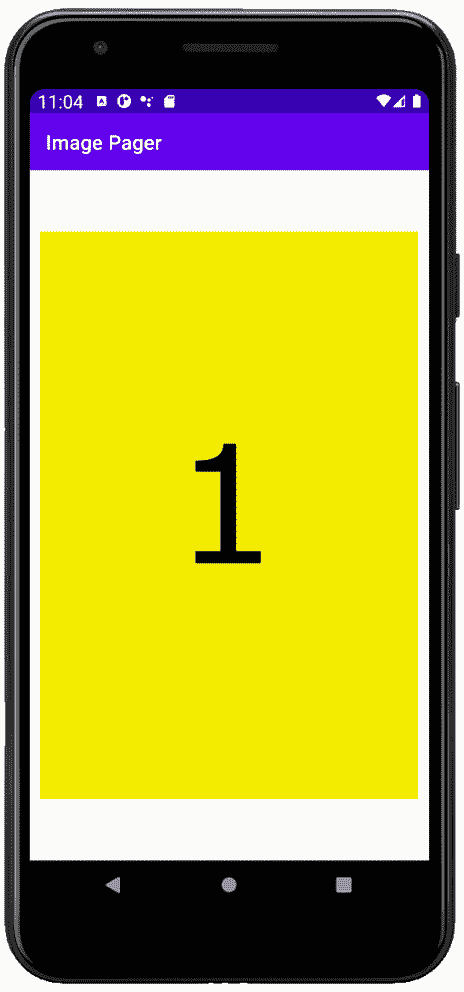
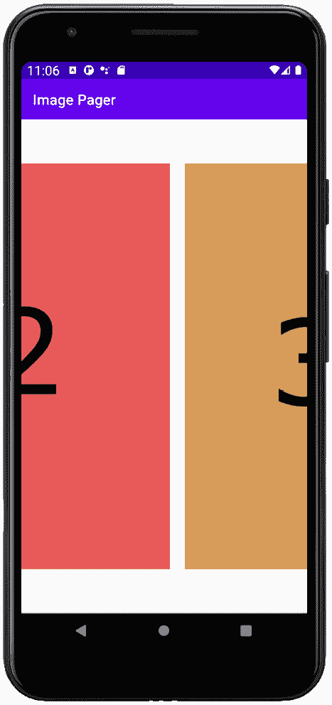

# 第二十五章：构建一个简单的图片库应用

`RecyclerView`小部件，我们可以有选择地加载当前页面所需的数据，也许是前一页和下一页的数据。

正如您所期望的，Android API 提供了一些解决方案来以相当简单的方式实现分页。

在本章中，我们将学习如何做到以下几点：

+   实现像照片库应用中可能找到的图片一样的分页和滑动。

首先，让我们看一个滑动的例子。

# 技术要求

您可以在 GitHub 上找到本章的代码文件，网址为[`github.com/PacktPublishing/Android-Programming-for-Beginners-Third-Edition/tree/main/chapter%2025`](https://github.com/PacktPublishing/Android-Programming-for-Beginners-Third-Edition/tree/main/chapter%2025)。

# 愤怒的小鸟经典滑动菜单

在这里，我们可以看到著名的愤怒的小鸟关卡选择菜单展示了滑动/分页的效果：


图 25.1 – 愤怒的小鸟关卡选择菜单

让我们构建一个分页应用。

# 构建一个图片库/幻灯片应用

在 Android Studio 中创建一个名为`Image Pager`的新项目。使用**空活动**模板，并将其余设置保持默认。

这些图片位于*第二十五章*`/Image Pager/drawable`文件夹中的下载包中。下一张截图显示了它们在 Windows 文件资源管理器中的情况：


图 25.2 – 添加图片

将图片添加到 Android Studio 中的 Project Explorer 中的`drawable`文件夹中，或者您可以添加更有趣的图片，也许是您拍摄的一些照片。

## 实现布局

对于一个简单的图片分页应用，我们使用`PagerAdapter`类。我们可以将其视为像`RecyclerAdapter`一样，但用于图片，因为它将处理`ViewPager`小部件中的图像数组的显示。这很像`RecyclerAdapter`如何处理`ListView`中`ArrayList`的内容的显示。我们只需要重写适当的方法。

要使用`PagerAdapter`实现图片库，我们首先需要在主布局中添加一个`ViewPager`小部件。为了确切地了解需要什么，这是`activity_main.xml`的实际 XML 代码。编辑`activity_main.xml`使其看起来完全像这样：

```kt
<RelativeLayout xmlns:android=
   "http://schemas.android.com/apk/res/android"
    android:layout_width="fill_parent"
    android:layout_height="fill_parent" >
    <androidx.viewpager.widget.ViewPager
        android:id="@+id/pager"
        android:layout_width="wrap_content"
        android:layout_height="wrap_content" />
</RelativeLayout>
```

名为`androidx.ViewPager.widget.ViewPager`的类是在`ViewPager`之前发布的 Android 版本中提供此功能的类。

接下来，就像我们需要一个布局来表示列表项一样，我们需要一个布局来表示一个项目，这里是一个图片，在`ViewPager`中。以通常的方式创建一个新的布局文件，命名为`pager_item.xml`。添加一个带有 ID 为`imageView`的`ImageView`。

使用可视化设计工具来实现这一点，或者将以下 XML 复制到`pager_item.xml`中：

```kt
<?xml version="1.0" encoding="utf-8"?>
<RelativeLayout
    xmlns:android="http://schemas.android.com/apk/res/android"
    android:layout_width="fill_parent"
    android:layout_height="fill_parent" >
    <ImageView
        android:id="@+id/imageView"
        android:layout_width="match_parent"
        android:layout_height="match_parent" />
</RelativeLayout>
```

现在我们可以开始编写我们的`PagerAdapter`类了。

## 编写 PagerAdapter 类

接下来，我们需要扩展`PagerAdapter`来处理图片。创建一个名为`ImagePagerAdapter`的新类，并使其扩展`PagerAdapter`。

将以下导入添加到`ImagePagerAdapter`类的顶部。我们经常依赖使用*Alt* + *Enter*快捷键来添加导入。这次我们做的有些不同，因为有一些非常相似的类，它们不适合我们的目标。

将以下导入添加到`ImagePagerAdapter`类中：

```kt
import android.content.Context;
import android.view.LayoutInflater;
import android.view.View;
import android.view.ViewGroup;
import android.widget.ImageView;
import android.widget.RelativeLayout;
import androidx.viewpager.widget.PagerAdapter;
import androidx.viewpager.widget.ViewPager;
```

这是类声明，添加了`extends...`代码以及一些成员变量。这些变量是我们不久将要使用的`Context`对象和一个名为`images`的`int`数组。之所以使用`int`数组来存储图像，是因为我们将为每个图像存储`int`标识符。我们将在几个代码块后看到这是如何工作的。最后一个成员变量是一个`LayoutInflater`实例，您可能猜到它将用于填充`pager_item.xml`的每个实例。

扩展`PagerAdapter`类并添加我们刚刚讨论过的成员变量：

```kt
public class ImagePagerAdapter extends PagerAdapter {
    Context context;
    int[] images;
    LayoutInflater inflater;
}
```

现在我们需要一个构造函数，通过从`MainActivity`类接收`Context`以及图像的`int`数组并用它们初始化成员变量来设置`ImagerPagerAdapter`。

在`ImagePagerAdapter`类中添加构造方法：

```kt
public ImagePagerAdapter(
   Context context,  int[] images) {

   this.context = context;
   this.images = images;
}
```

现在我们必须重写`PagerAdapter`的必需方法。在上一个代码之后，添加重写的`getCount`方法，它简单地返回数组中图像 ID 的数量。这个方法是类内部使用的：

```kt
@Override
public int getCount() {
   return images.length;
}
```

现在我们必须重写`isViewFromObject`方法，根据当前`View`实例是否与传入的参数作为当前`Object`相关联，返回一个布尔值。同样，这是一个类内部使用的方法。在上一个代码之后，添加这个`Override`方法：

```kt
@Override
public boolean isViewFromObject(View view, Object object) {
   return view == object;
}
```

现在我们必须重写`instantiateItem`方法；这是我们要做的大部分工作。首先，我们声明一个新的`ImageView`对象，然后初始化我们的`LayoutInflater`成员。接下来，我们使用`LayoutInflater`实例从我们的`pager_item.xml`布局文件中声明和初始化一个新的`View`实例。

在这之后，我们获取`pager_item.xml`布局中`ImageView`小部件的引用。现在，根据`instantiateItem`方法的`position`参数和`images`数组中的适当 ID 整数，我们可以将适当的图像添加为`ImageView`小部件的内容。

最后，我们使用`addView`方法将布局添加到`PagerAdapter`实例，并从该方法返回。

添加我们刚刚讨论过的方法：

```kt
@Override
public Object instantiateItem(
   ViewGroup container, int position) {
   ImageView image;
   inflater = (LayoutInflater) 
         context.getSystemService(
         Context.LAYOUT_INFLATER_SERVICE);

   View itemView = inflater.inflate(
         R.layout.pager_item, container, false);
   // get reference to imageView in pager_item layout
   image = 
         itemView.findViewById(R.id.imageView);
   // Set an image to the ImageView
   image.setImageResource(images[position]);
   // Add pager_item layout as the current page to the 
   ViewPager
   ((ViewPager) container).addView(itemView);
   return itemView;
}
```

我们必须重写的最后一个方法是`destroyItem`方法，当类需要根据`position`参数的值移除适当的项时，可以调用该方法。

在上一个代码之后，在`ImagePagerAdapter`类的闭合大括号之前添加`destroyItem`方法：

```kt
@Override
public void destroyItem(ViewGroup container, 
   int position, 
   Object object) {

   // Remove pager_item layout from ViewPager
   container.removeView((RelativeLayout) object);
}
```

正如我们在编写`ImagePagerAdapter`类时所看到的，它几乎没有什么。只是正确实现`ImagePagerAdapter`类使用的重写方法，以帮助在幕后顺利运行。

现在我们可以编写`MainActivity`类，它将使用我们的`ImagePagerAdapter`实现。

## 编写 MainActivity 类

最后，我们可以编写我们的`MainActivity`类。与`ImagePagerAdapter`类一样，为了清晰起见，手动将以下`import`语句添加到`MainActivity.java`类中，然后再类声明之前，如下所示：

```kt
import androidx.appcompat.app.AppCompatActivity;
import androidx.viewpager.widget.PagerAdapter;
import androidx.viewpager.widget.ViewPager;
```

我们需要一些成员变量。毫不奇怪，我们需要一个`ViewPager`实例，它将用于保存布局中`ViewPager`的引用。此外，我们还需要一个刚刚编码的类的`ImagePagerAdapter`引用。我们还需要一个`int`数组来保存图像 ID 的数组。

调整`MainActivity`类如下：

```kt
public class MainActivity extends AppCompatActivity {
   ViewPager viewPager;
   PagerAdapter adapter;
   int[] images;
   @Override
   public void onCreate(Bundle savedInstanceState) {
          super.onCreate(savedInstanceState);
          ...
```

所有其他的代码都放在`onCreate`方法中。我们使用每个添加到`drawable-xhdpi`文件夹中的图像来初始化我们的`int`数组。

我们通常使用`findViewById`方法来初始化`ViewPager`。我们还通过传入`MainActivity`类的引用和`images`数组来初始化我们的`ImagePagerAdapter`实例，这是我们之前编写的构造函数所需的。最后，我们使用`setAdapter`方法将适配器绑定到 pager。

编写`onCreate`方法，使其看起来像下面的代码：

```kt
@Override
public void onCreate(Bundle savedInstanceState) {
   super.onCreate(savedInstanceState);
   setContentView(R.layout.activity_main);
   // Grab all the images and stuff them in our array
   images = new int[] { R.drawable.image1,
                R.drawable.image2,
                R.drawable.image3,
                R.drawable.image4,
                R.drawable.image5,
                R.drawable.image6 };
   // get a reference to the ViewPager in the layout
   viewPager = findViewById(R.id.pager);
   // Initialize our adapter
   adapter = new 
          ImagePagerAdapter(MainActivity.this, images);
   // Binds the Adapter to the ViewPager
   viewPager.setAdapter(adapter);
}
```

现在我们准备运行应用程序。

## 运行图库应用程序

在这里，我们可以看到我们`int`数组中的第一张图片：



图 25.3 – 第一张图片

向右和向左轻轻滑动，看到图像平稳过渡的愉悦方式：



图 25.4 – 滑动查看图片

这就是本章的全部内容。让我们回顾一下我们所做的事情。

# 总结

在本章中，我们看到了如何使用分页器来创建简单的图库，只需几行代码和一些非常简单的布局。我们之所以能够如此轻松地实现这一点，是因为有了`ImagePagerAdapter`类。

在下一章中，我们将看到另一个非常酷的 UI 元素，它在许多最新的 Android 应用程序中使用，可能是因为它看起来很棒，而且非常实用，使用起来非常愉快。`NavigationView`布局将使我们能够设计和实现具有完全不同行为（代码）的不同布局。让我们来看看`NavigationView`布局。
