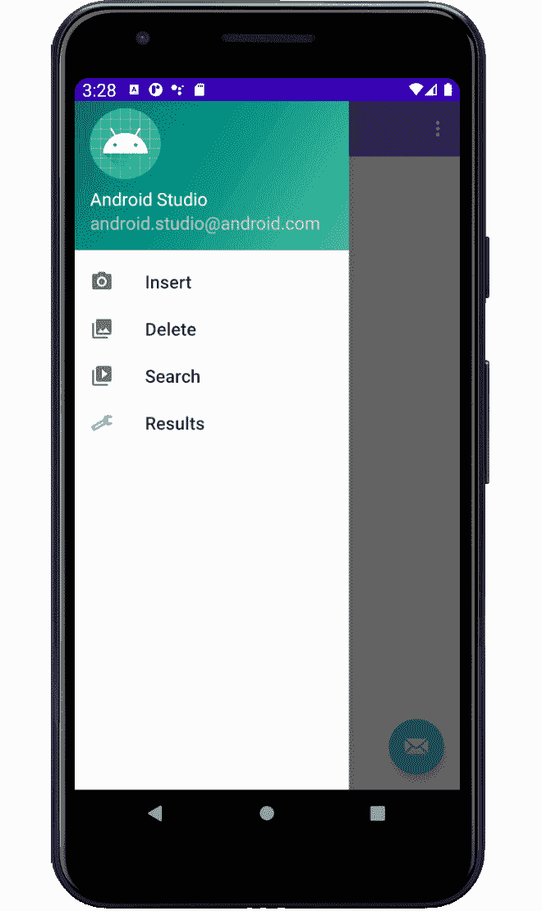
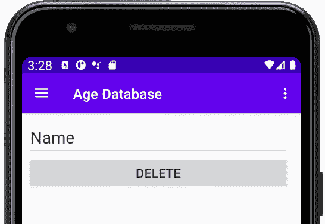
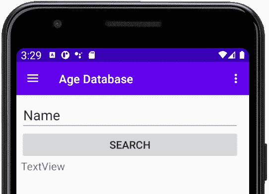
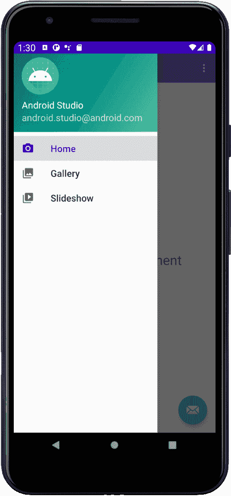
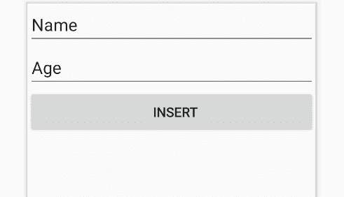
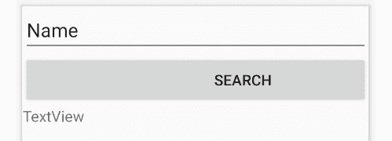

# 第二十六章：使用导航抽屉和片段进行高级 UI

在本章中，我们将看到（可以说是）最先进的 UI。`NavigationView`小部件或导航抽屉，因为它滑出其内容的方式，可以通过在创建新项目时选择它作为模板来简单地创建。我们将这样做，然后我们将检查自动生成的代码并学习如何与其交互。然后，我们将使用我们对`Fragment`的所有了解来为每个“抽屉”填充不同的行为和视图。然后在下一章中，我们将学习数据库，为每个`Fragment`添加一些新功能。

以下是本章我们将要做的事情：

+   介绍`NavigationView`

+   开始使用简单的数据库应用程序

+   基于自动生成的 Android Studio 模板实现`NavigationView`项目

+   向`NavigationView`添加多个片段和布局

让我们来看看这个非常酷的 UI 模式。

# 技术要求

您可以在 GitHub 上找到本章的代码文件[`github.com/PacktPublishing/Android-Programming-for-Beginners-Third-Edition/tree/main/chapter%2026`](https://github.com/PacktPublishing/Android-Programming-for-Beginners-Third-Edition/tree/main/chapter%2026)。

# 介绍 NavigationView

`NavigationView`有什么好处？嗯，可能会吸引你的第一件事是它可以看起来非常时尚。看看下一个屏幕截图，展示了 Google Play 应用中`NavigationView`的操作：


图 26.1–NavigationView 在操作中

老实说，从一开始，我们的 UI 不会像 Google Play 应用程序中的那样花哨。但是我们的应用程序中将存在相同的功能。

这个 UI 的另一个很棒的地方是它在需要时滑动隐藏/显示自己的方式。正是因为这种行为，它可以是一个相当大的尺寸，使得它在放置选项时非常灵活，当用户完成后，它会完全消失，就像一个抽屉一样。

如果您还没有尝试过，我建议现在尝试一下 Google Play 应用程序，看看它是如何工作的。

您可以从屏幕的左边缘滑动手指，抽屉会慢慢滑出。当然，您也可以以相反的方向将其滑开。

在导航抽屉打开时，屏幕的其余部分会略微变暗（如前一个屏幕截图所示），帮助用户专注于提供的导航选项。

您还可以在打开导航抽屉时在任何地方点击，它会自动滑开，为应用程序的其余部分留出整个屏幕。

抽屉也可以通过点击左上角的菜单图标打开。

我们还可以调整和完善导航抽屉的行为，这是本章末尾我们将看到的。

# 检查简单的数据库应用程序

在本章中，我们将专注于创建`NavigationView`并用四个`Fragment`类实例及其各自的布局填充它。在下一章中，我们将学习并实现数据库功能。

数据库应用程序的屏幕如下。这是我们`NavigationView`布局的全部荣耀。请注意，当使用`NavigationView` Activity 模板时，默认情况下提供了许多选项和大部分外观和装饰。



图 26.2–NavigationView 布局

四个主要选项是我们将添加到 UI 中的内容。它们是**插入**，**删除**，**搜索**和**结果**。布局如下所示，并描述了它们的目的。

## 插入

第一个屏幕允许用户将人名和他们的年龄插入到数据库中：


图 26.3–插入

这个简单的布局有两个`EditText`小部件和一个按钮。用户将输入姓名和年龄，然后点击**插入**按钮将它们添加到数据库中。

## 删除

这个屏幕更简单。用户将在`EditText`小部件中输入姓名，然后点击按钮：



图 26.4 – 删除

如果输入的姓名在数据库中存在，则该条目（姓名和年龄）将被删除。

## 搜索

这个布局与上一个布局基本相同，但目的不同：



图 26.5 – 搜索

用户将在`EditText`小部件中输入姓名，然后点击**搜索**按钮。如果数据库中存在该姓名，则将显示该姓名以及匹配的年龄。

## 结果

这个屏幕显示了整个数据库中的所有条目：


图 26.6 – 结果

让我们开始使用导航抽屉。

# 开始简单数据库项目

在 Android Studio 中创建一个新项目。将其命名为`Age Database`，使用**Navigation Drawer Activity**模板。在我们做任何其他事情之前，值得在模拟器上运行应用程序，看看作为模板的一部分自动生成了多少内容：


图 26.7 – 主页

乍一看，它只是一个普通的布局，带有一个`TextView`小部件。但是从屏幕左边缘滑动或按菜单按钮，导航抽屉布局就会显现出来：



图 26.8 – 导航页面

现在我们可以修改选项并为每个选项插入一个带有布局的`Fragment`。为了理解它是如何工作的，让我们检查一些自动生成的代码。

# 探索自动生成的代码和资源

打开`res/menu`文件夹。注意有一个额外的文件名为`activity_main_drawer.xml`。接下来的代码是从这个文件中摘录出来的，所以我们可以讨论它的内容：

```kt
<group android:checkableBehavior="single">
     <item
          android:id="@+id/nav_home"
          android:icon="@drawable/ic_menu_camera"
          android:title="@string/menu_home" />
     <item
          android:id="@+id/nav_gallery"
          android:icon="@drawable/ic_menu_gallery"
          android:title="@string/menu_gallery" />
     <item
          android:id="@+id/nav_slideshow"
          android:icon="@drawable/ic_menu_slideshow"
          android:title="@string/menu_slideshow" />
</group>
```

注意`group`标签中有四个`item`标签。现在注意从上到下的`title`标签与自动生成的导航抽屉菜单中的三个文本选项完全对应。还要注意，在每个`item`标签中，有一个`id`标签，因此我们可以在我们的 Java 代码中引用它们，以及一个`icon`标签，它对应于`drawable`文件夹中的一个图标，并且是在导航抽屉中选项旁边显示的图标。

还有一些我们不会使用的自动生成的文件。

让我们编写基于`Fragment`的类和它们的布局。

# 编写片段类和它们的布局

我们将创建四个类，包括加载布局的代码以及实际的布局，但在学习了下一章关于 Android 数据库之后，我们不会将任何数据库功能放入 Java 中。

在我们有了四个类和它们的布局之后，我们将看到如何从导航抽屉菜单中加载它们。到本章结束时，我们将拥有一个完全工作的导航抽屉，让用户在片段之间切换，但是片段在下一章之前实际上没有任何功能。

## 创建类和布局的空文件

通过右键单击`layout`文件夹并选择`content_insert`，第二个`content_delete`，第三个`content_search`和第四个`content_results`来创建四个带有垂直`LinearLayout`作为父视图的布局文件。除了`LinearLayout`选项和文件名之外，所有选项都可以保持默认值。

现在你应该有四个包含`LinearLayout`父视图的新布局文件。

让我们编写相关的 Java 类。

## 编写类

通过右键单击包含`MainActivity.java`文件的文件夹，并选择`InsertFragment`，`DeleteFragment`，`SearchFragment`和`ResultsFragment`来创建四个新类。从名称上就可以明白哪些片段将显示哪些布局。

为了明确起见，让我们向每个类添加一些代码，使类扩展`Fragment`并加载其关联的布局。

打开`InsertFragment.java`并编辑它以包含以下代码：

```kt
import android.os.Bundle;
import android.view.LayoutInflater;
import android.view.View;
import android.view.ViewGroup;
import androidx.fragment.app.Fragment;
public class InsertFragment extends Fragment {

   @Override
   public View onCreateView(
                LayoutInflater inflater, 
                ViewGroup container, 
                Bundle savedInstanceState) {

          View v = inflater.inflate(
                      R.layout.content_insert, 
                      container, false);

          // Database and UI code goes here in next chapter
          return v;
    }
}
```

打开`DeleteFragment.java`并编辑它以包含以下代码：

```kt
import android.os.Bundle;
import android.view.LayoutInflater;
import android.view.View;
import android.view.ViewGroup;
import androidx.fragment.app.Fragment;
public class DeleteFragment extends Fragment {

   @Override
   public View onCreateView(
                LayoutInflater inflater, 
                ViewGroup container, 
                Bundle savedInstanceState) {

          View v = inflater.inflate(
                      R.layout.content_delete, 
                      container, false);

         // Database and UI code goes here in next chapter

         return v;
    }
}
```

打开`SearchFragment.java`并编辑它以包含以下代码：

```kt
import android.os.Bundle;
import android.view.LayoutInflater;
import android.view.View;
import android.view.ViewGroup;
import androidx.fragment.app.Fragment;
public class SearchFragment extends Fragment{
   @Override
    public View onCreateView(
                LayoutInflater inflater, 
                ViewGroup container, 
                Bundle savedInstanceState) {

           View v = inflater.inflate(
                      R.layout.content_search,
                      container, false);

           // Database and UI code goes here in next 
           chapter

         return v;
    }
}
```

打开`ResultsFragment.java`并编辑它以包含以下代码：

```kt
import android.os.Bundle;
import android.view.LayoutInflater;
import android.view.View;
import android.view.ViewGroup;
import androidx.fragment.app.Fragment;
public class ResultsFragment extends Fragment {
    @Override
    public View onCreateView(
                LayoutInflater inflater, 
                ViewGroup container, 
                Bundle savedInstanceState) {

         View v = inflater.inflate(
                      R.layout.content_results, 
                      container, false);
         // Database and UI code goes here in next chapter

         return v;
    }
}
```

每个类完全没有功能，除了在`onCreateView`方法中，从关联的布局文件加载适当的布局。

让我们向之前创建的布局文件添加 UI。

## 设计布局

正如我们在本章开始时所看到的，所有的布局都很简单。使您的布局与我的完全相同并不是必要的，但是 ID 值必须相同，否则我们在下一章中编写的 Java 代码将无法工作。

## 设计 content_insert.xml

从调色板的`Text`类别中拖放两个`Plain Text`小部件到布局中。请记住，`Plain Text`小部件是`EditText`实例。现在在两个`Plain Text`小部件之后将一个`Button`小部件拖放到布局中。

根据此表配置小部件：


这是您的布局在 Android Studio 的设计视图中应该是什么样子的：



图 26.9 - 插入布局

## 设计 content_delete.xml

将`Plain Text`拖放到布局中，下面是一个`Button`小部件。根据此表配置小部件：


这是您的布局在 Android Studio 的设计视图中应该是什么样子的：


图 26.10 - 删除布局

## 设计 content_search.xml

将一个`Plain Text`，然后是一个按钮，然后是一个常规的`TextView`拖放到布局中，然后根据此表配置小部件：


这是您的布局在 Android Studio 的设计视图中应该是什么样子的：



图 26.11 - 搜索布局

## 设计 content_results.xml

将单个`TextView`小部件（这次不是`Plain Text`/`EditText`）拖放到布局中。我们将在下一章中看到如何将整个列表添加到这个单个`TextView`小部件中。

根据此表配置小部件：


这是您的布局在 Android Studio 的设计视图中应该是什么样子的：


图 26.12 - 结果布局

现在我们可以使用基于`Fragment`的类及其布局。

# 使用 Fragment 类及其布局

这个阶段有三个步骤。首先，我们需要编辑导航抽屉布局的菜单，以反映用户的选项。接下来，我们需要在布局中添加一个`View`实例，以容纳当前`Fragment`实例，最后，我们需要在`MainActivity.java`中添加代码，以在用户点击菜单时在不同的`Fragment`实例之间切换。

## 编辑导航抽屉菜单

在项目资源管理器的`res/menu`文件夹中打开`activity_main_drawer.xml`文件。编辑我们之前看到的`group`标签内的代码，以反映我们的菜单选项**插入**，**删除**，**搜索**和**结果**：

```kt
<group android:checkableBehavior="single">
   <item
         android:id="@+id/nav_insert"
         android:icon="@drawable/ic_menu_camera"
         android:title="Insert" />
   <item
         android:id="@+id/nav_delete"
         android:icon="@drawable/ic_menu_gallery"
         android:title="Delete" />
   <item
         android:id="@+id/nav_search"
         android:icon="@drawable/ic_menu_slideshow"
         android:title="Search" />
   <item
         android:id="@+id/nav_results"
         android:icon="@drawable/ic_menu_camera"
         android:title="Results" />
</group>
```

请注意，结果项重用了相机图标。如果您希望添加自己的唯一图标，这是您的挑战。

现在我们可以在主布局中添加一个布局，以容纳当前活动的片段。

## 向主布局添加一个持有者

打开`content_main.xml`文件在`layout`文件夹中。找到以下现有的代码，这是当前不适合我们用途的当前片段持有者：

```kt
<fragment
     android:id="@+id/nav_host_fragment"
     android:name="androidx.navigation
          .fragment.NavHostFragment"
     android:layout_width="match_parent"
     android:layout_height="match_parent"
     app:defaultNavHost="true"
     app:layout_constraintLeft_toLeftOf="parent"
     app:layout_constraintRight_toRightOf="parent"
     app:layout_constraintTop_toTopOf="parent"
     app:navGraph="@navigation/mobile_navigation" />
```

删除前面的代码，并在`ConstraintLayout`的结束标签之前用以下 XML 代码替换它：

```kt
    <FrameLayout
        android:id="@+id/fragmentHolder"
        android:layout_width="368dp"
        android:layout_height="495dp"
        tools:layout_editor_absoluteX="8dp"
        tools:layout_editor_absoluteY="8dp">
    </FrameLayout>
```

切换到设计视图并单击**推断约束**按钮以固定新布局。

现在我们有一个`id`属性为`fragmentHolder`的`FrameLayout`小部件，我们可以获取其引用并加载所有我们的`Fragment`实例布局。

## 编写 MainActivity.java 类

用以下内容替换所有现有的`import`指令：

```kt
import android.os.Bundle;
import com.google.android.material.
            floatingactionbutton.FloatingActionButton;
import com.google.android.material.snackbar.Snackbar;
import android.view.View;
import com.google.android.material.navigation.
        NavigationView;
import androidx.core.view.GravityCompat;
import androidx.drawerlayout.widget.DrawerLayout;
import androidx.appcompat.app.ActionBarDrawerToggle;
import androidx.appcompat.app.AppCompatActivity;
import androidx.appcompat.widget.Toolbar;
import androidx.fragment.app.FragmentTransaction;
import android.view.MenuItem;
```

打开`MainActivity.java`文件并编辑整个代码以匹配以下内容。

注意

最快的方法可能是删除除我们刚刚添加的`import`指令之外的所有内容。

接下来我们将讨论代码，因此请仔细研究变量名称和各种类及其相关方法。

```kt
public class MainActivity extends AppCompatActivity
        implements NavigationView.
OnNavigationItemSelectedListener {
    @Override
    protected void onCreate(Bundle savedInstanceState) {
        super.onCreate(savedInstanceState);
        setContentView(R.layout.activity_main);
        Toolbar toolbar = findViewById(R.id.toolbar);
        setSupportActionBar(toolbar);
        FloatingActionButton fab = findViewById(R.id.fab);
        fab.setOnClickListener(new View.OnClickListener() {
            @Override
            public void onClick(View view) {
                Snackbar.make(view, "
                Replace with your own action", 
                Snackbar.LENGTH_LONG)
                        .setAction("Action", null).show();
            }
        });
        DrawerLayout drawer = 
        findViewById(R.id.drawer_layout);
        ActionBarDrawerToggle toggle = new 
        ActionBarDrawerToggle(
                this, drawer, toolbar, 
                      R.string.navigation_drawer_open, 
                      R.string.navigation_drawer_close);

        drawer.addDrawerListener(toggle);
        toggle.syncState();
        NavigationView navigationView 
        = findViewById(R.id.nav_view);
        navigationView
        .setNavigationItemSelectedListener(this);
    }
}
```

在前面的代码中，`onCreate`方法处理了我们 UI 的一些方面。 代码获取了与我们刚刚看到的布局相对应的`DrawerLayout`小部件的引用。 代码还创建了一个`ActionBarDrawerToggle`的新实例，它允许控制/切换抽屉。 接下来，引用被捕获到导航抽屉本身的布局文件（`nav_view`），代码的最后一行设置了`NavigationView`上的监听器。

现在按照以下方式添加`onBackPressed`方法：

```kt
@Override
public void onBackPressed() {
     DrawerLayout drawer = 
     findViewById(R.id.drawer_layout);
     if (drawer.isDrawerOpen(GravityCompat.START)) {
          drawer.closeDrawer(GravityCompat.START);
     } else {
          super.onBackPressed();
     }
}
```

`onBackPressed`方法是 Activity 的一个重写方法，它处理用户在设备上按返回按钮时发生的情况。 代码关闭抽屉（如果打开），如果没有打开，则简单地调用`super.onBackPressed`。 这意味着如果抽屉打开，返回按钮将关闭抽屉，如果已经关闭，则具有默认行为。

添加`onCreateOptionsMenu`和`onOptionsItemSelected`方法，这些方法在此应用程序中并没有真正使用，但将为`options`按钮添加默认功能：

```kt
@Override
public boolean onCreateOptionsMenu(Menu menu) {
     // Inflate the menu; this adds items to the action bar 
     if it is present.
     getMenuInflater().inflate(R.menu.main, menu);
     return true;
}
@Override
public boolean onOptionsItemSelected(MenuItem item) {
     // Handle action bar item clicks here. The action bar 
     will
     // automatically handle clicks on the Home/Up button, 
     so long
     // as you specify a parent activity in 
     AndroidManifest.xml.
     int id = item.getItemId();
     //noinspection SimplifiableIfStatement
     if (id == R.id.action_settings) {
          return true;
     }
     return super.onOptionsItemSelected(item);
}
```

现在添加下面显示的`onNavigatioItemSelected`方法：

```kt
@Override
public boolean onNavigationItemSelected(MenuItem item) {
     // Handle navigation view item clicks here.
     // Create a transaction
     FragmentTransaction transaction = 
          getSupportFragmentManager().beginTransaction();
     int id = item.getItemId();
     if (id == R.id.nav_insert) {
          // Create a new fragment of the appropriate type
          InsertFragment fragment = new InsertFragment();
          // What to do and where to do it
          transaction.replace(R.id.fragmentHolder, 
          fragment);
     } else if (id == R.id.nav_search) {
          SearchFragment fragment = new SearchFragment();
          transaction.replace(R.id.fragmentHolder, 
          fragment);
     } else if (id == R.id.nav_delete) {
          DeleteFragment fragment = new DeleteFragment();
          transaction.replace(R.id.fragmentHolder, 
          fragment);
     }  else if (id == R.id.nav_results) {
          ResultsFragment fragment = new ResultsFragment();
          transaction.replace(R.id.fragmentHolder, 
          fragment);
     }
     // Ask Android to remember which
     // menu options the user has chosen
     transaction.addToBackStack(null);
     // Implement the change
     transaction.commit();
     DrawerLayout drawer = 
     findViewById(R.id.drawer_layout);
     drawer.closeDrawer(GravityCompat.START);
     return true;
}
```

让我们来看看`onNavigationItemSelected`方法中的代码。 大部分代码应该看起来很熟悉。 对于我们的每个菜单选项，我们都创建了一个相应类型的新`Fragment`，并将其插入到具有`fragmentHolder`属性值的`RelativeLayout`中。

最后，对于`MainActivity.java`文件，`transaction.addToBackStack`方法意味着所选的`Fragment`实例将被记住，以便与其他实例一起使用。 这样做的结果是，如果用户选择`insert`片段，然后选择`results`片段，然后点击返回按钮，那么应用程序将返回用户到`insert`片段。

现在可以运行应用程序并使用导航抽屉菜单在所有不同的`Fragment`实例之间切换。 它们看起来就像本章开头的屏幕截图一样，但目前还没有任何功能。

# 总结

在本章中，我们看到了拥有吸引人和令人愉悦的 UI 是多么简单，尽管我们的`Fragment`实例目前还没有任何功能，但一旦我们学会了数据库，它们就已经准备好了。

在下一章中，我们将学习关于数据库的一般知识，Android 应用程序可以使用的特定数据库，然后我们将为我们的`Fragment`类添加功能。
