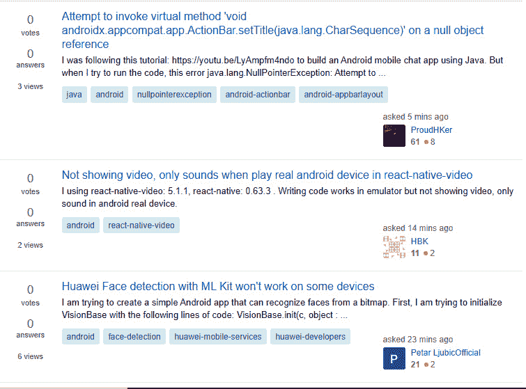

# 第二十八章：在你离开之前快速聊一下

我们的旅程就快结束了。这一章提供了一些想法和指针，你可能在匆忙制作自己的应用之前想要看一看：

+   发布

+   制作你的第一个应用

+   继续学习

+   谢谢

# 发布

你已经足够了解如何设计你自己的应用。你甚至可以对本书中的应用进行一些修改。

我决定不提供在 Google Play 商店上发布的逐步指南，因为这些步骤并不复杂。然而，它们相当深入和有点费力。大部分步骤涉及输入关于你和你的应用的个人信息以及图片。这样的教程可能会是这样的：

1.  填写这个文本框。

1.  现在填写这个文本框。

1.  上传这张图片。

1.  等等。

这样做不太有趣，也不太有用。

要开始，你只需要访问[`play.google.com/apps/publish`](https://play.google.com/apps/publish)并支付一次性的适度费用（大约 25 美元，根据你所在地区的货币而定）。这样你就可以终身发布游戏。

注意

如果你想要一个发布的清单，可以查看这个链接，https://developer.android.com/distribute/best-practices/launch/launch-checklist.html，但你会发现这个过程很直观（尽管很冗长）。

# 制作一个应用！

如果你只是把这一件事付诸实践，你就可以忽略这一章中的其他一切：

*不要等到你成为专家才开始制作应用！*

开始构建你的梦想应用，一个拥有所有功能的应用，将会在 Google Play 上风靡一时。然而，一个简单的建议是：先做一些规划！但不要太多；然后开始吧。

在一旁有一些更小、更容易实现的项目：你可以向朋友和家人展示这些项目，并探索你还不熟悉的 Android 领域。如果你对这些应用有信心，你可以将它们上传到 Google Play。如果你担心它们会被评论员接受，那就把它们免费发布，并在描述中注明“只是一个原型”或类似的内容。

如果你的经历和我的一样，你会发现当你阅读、学习和制作应用时，你会发现你的梦想应用可以在很多方面得到改进，你可能会被激发重新设计它，甚至重新开始。

如果你这样做，我可以保证下一次构建应用时，你会用一半的时间做出两倍好的成果，至少是这样！

# 继续学习

如果你觉得自己已经走了很长的路，那么你是对的。然而，总是有更多东西需要学习。

## 继续阅读

你会发现，当你制作你的第一个应用时，你会突然意识到你的知识中存在一个需要填补的空白，以使某个功能得以实现。这是正常的，也是可以预料的，所以不要让它吓到你。想一想如何描述这个问题，并在谷歌上搜索解决方案。

你可能会发现项目中的特定类会变得超出实际和可维护的范围。这表明有更好的方式来构建结构，并且可能有一个现成的设计模式可以让你的生活更轻松。

为了预防这几乎是不可避免的，为什么不立即学习一些模式呢？一个很好的来源是*Head First: Java Design Patterns*，可以从所有好的书店购买。

## GitHub

GitHub 允许你搜索和浏览其他人编写的代码，并查看他们是如何解决问题的。这很有用，因为查看类的文件结构，然后经常深入研究它们，通常可以显示如何从一开始规划你的应用程序，并防止你走上错误的道路。你甚至可以获得一个 GitHub 应用程序，让你可以在手机或平板电脑上舒适地进行这些操作。或者，你可以配置 Android Studio 来保存和分享你的项目到 GitHub。例如，在主页[www.github.com](http://www.github.com)上搜索“Android 片段”，你将看到超过 1,000 个相关项目，你可以浏览：

图 28.1 – Android 片段结果

## Stack Overflow

如果你遇到困难，遇到奇怪的错误，或者遇到无法解释的崩溃，通常最好的去处是谷歌。这样做，你会惊讶地发现 Stack Overflow 似乎经常出现在搜索结果中，并且有充分的理由。

Stack Overflow 允许用户发布他们问题的描述以及示例代码，以便社区可以回答。然而，根据我的经验，很少有必要发布问题，因为几乎总会有人遇到完全相同的问题。

Stack Overflow 特别适合处理最前沿的问题。如果新的 Android Studio 版本有 bug，或者新版本的 Android API 似乎没有做应该做的事情，那么你几乎可以肯定，全世界成千上万的其他开发者也遇到了和你一样的问题。然后，一些聪明的编程人员，通常来自 Android 开发团队本身，会提供答案。

Stack Overflow 也适合进行一些轻松的阅读。前往主页[www.stackoverflow.com](http://www.stackoverflow.com)，在搜索框中输入`Android`，你将看到 Stack Overflow 社区最新问题的列表：

图 28.2 – Android 列表

我并不是建议你立即投入并开始尝试回答所有问题，但阅读问题和建议会教会你很多东西，你可能会发现，你比你期望的更经常地有解决方案，或者至少有解决方案的想法。

## Android 用户论坛

此外，值得注册一些 Android 论坛并偶尔访问它们，以了解用户的视角下的热门话题和趋势。我不会在这里列出任何论坛，因为只需要快速搜索即可。

如果你对这个话题很认真，那么你可以参加一些 Android 会议，在那里你可以与成千上万的其他开发者交流并参加讲座。如果你对此感兴趣，可以在网上搜索 droidcon、Android Developer Days 和 GDG DevFest。

## 更高级的学习

你现在可以阅读更多其他 Android 书籍。我在本书开头提到，几乎没有书籍，甚至可以说没有一本书，教会读者如何在没有 Java 经验的情况下学习 Android 编程。这就是我写这本书的原因。

现在你已经对面向对象编程和 Java 有了很好的理解，还对应用程序设计和 Android API 有了简要介绍，你现在可以阅读针对已经了解如何在 Java 中编程的人的 Android“初学者”书籍了，就像你现在所做的那样。

这些书籍充满了很好的例子，你可以构建或仅仅阅读，以巩固你在本书中学到的知识，以不同的方式使用你的知识，当然，也学到一些全新的东西。

也许值得进一步阅读一些纯 Java 书籍。也许很难相信，在刚刚浏览了大约 750 页之后，Java 还有很多内容没有时间在这里涵盖。

我可以列举一些书名，但在亚马逊上拥有最多积极评价的书籍往往是值得探索的书籍。

# 我的其他渠道

请保持联系！

+   [gamecodeschool.com](http://gamecodeschool.com)

+   [facebook.com/gamecodeschool](http://facebook.com/gamecodeschool)

+   [twitter.com/gamecodeschool](http://twitter.com/gamecodeschool)

+   [youtube.com/c/Gamecodeschool/videos](http://youtube.com/c/Gamecodeschool/videos)

+   [linkedin.com/in/gamecodeschool](http://linkedin.com/in/gamecodeschool)

# 再见，谢谢你

我写这本书的时候非常开心。我知道这是陈词滥调，但也是真的。然而，最重要的是，我希望你能从中获益，并将其作为你未来编程之路的垫脚石。

也许你正在阅读这本书是为了一点乐趣或者发布一个应用程序的荣誉，或者作为编程工作的垫脚石，或者你真的会开发一个在 Google Play 上风靡一时的应用程序。

无论如何，我非常感谢你购买了这本书，我祝愿你未来的努力一切顺利。

我认为每个人都有一个应用程序的潜力，你只需要付出足够的努力将它发挥出来。
