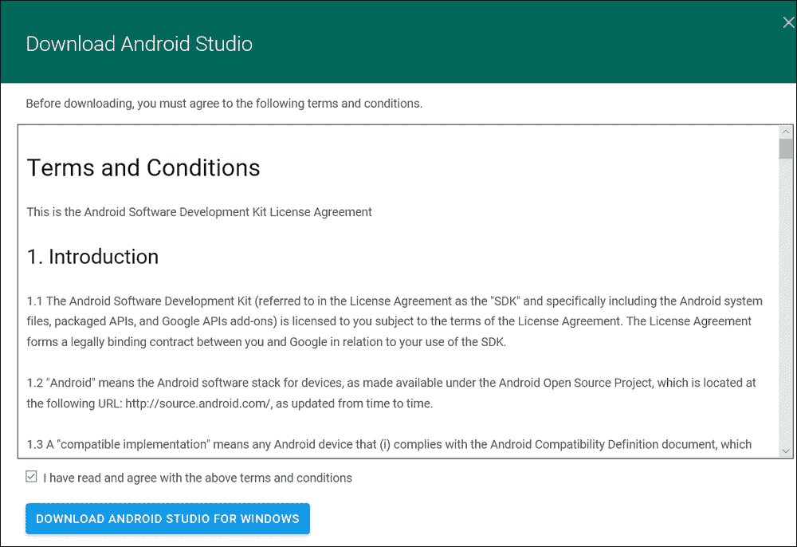
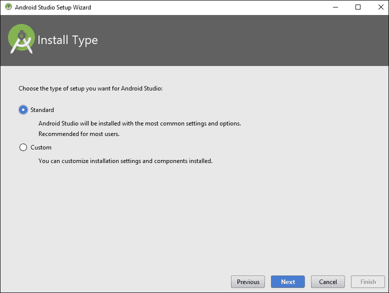
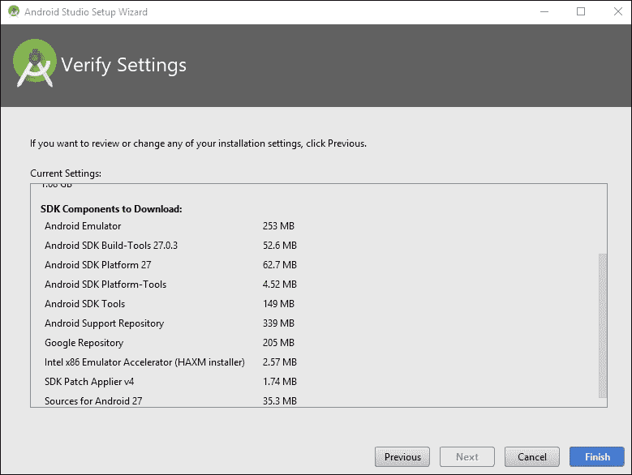
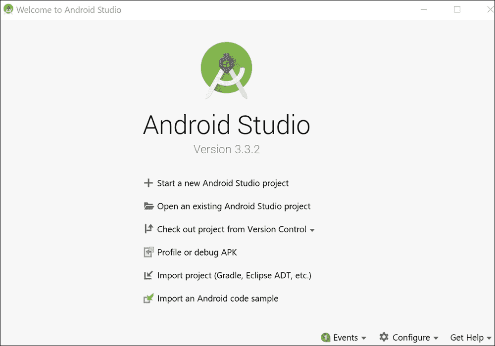
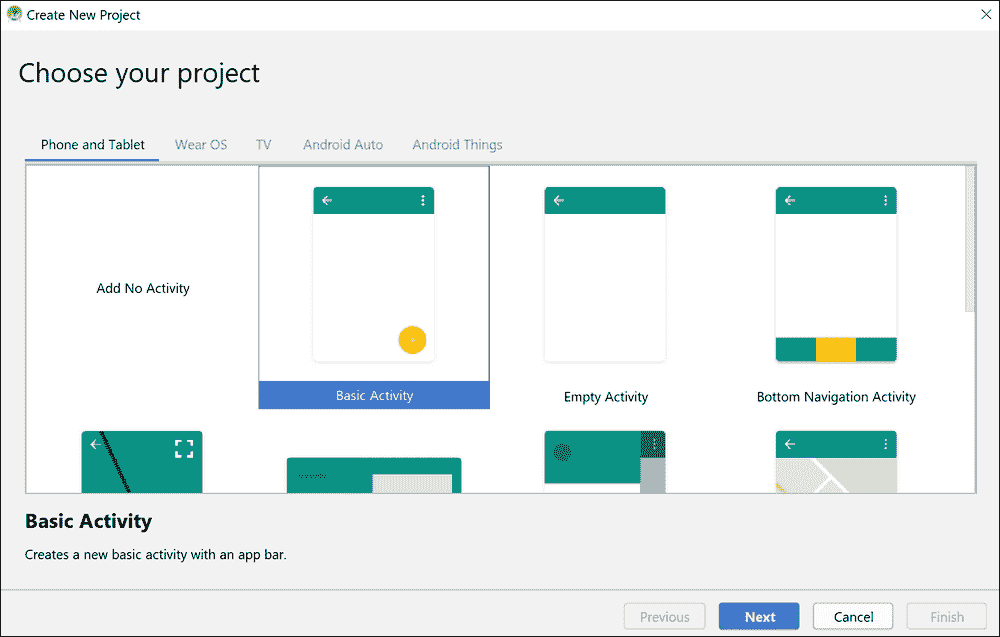
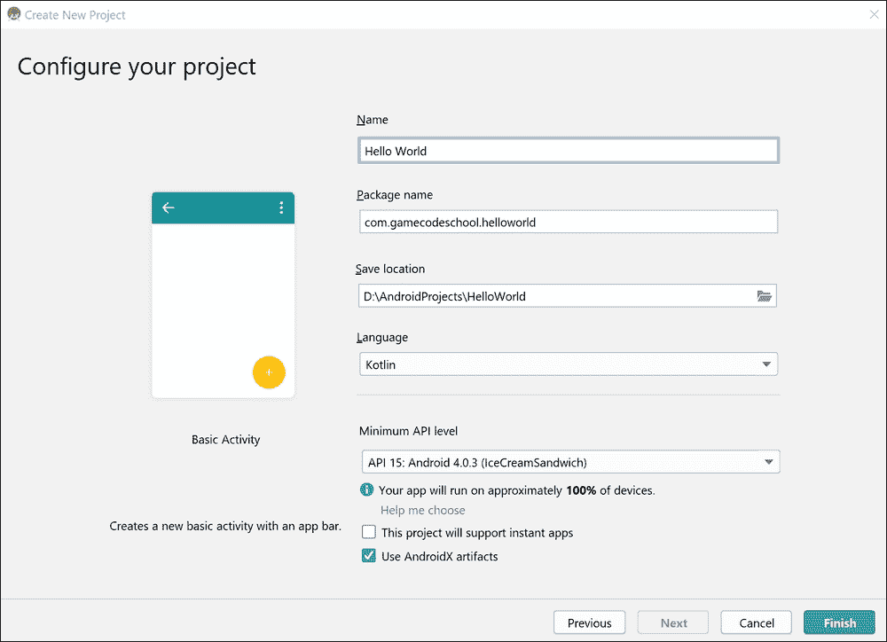
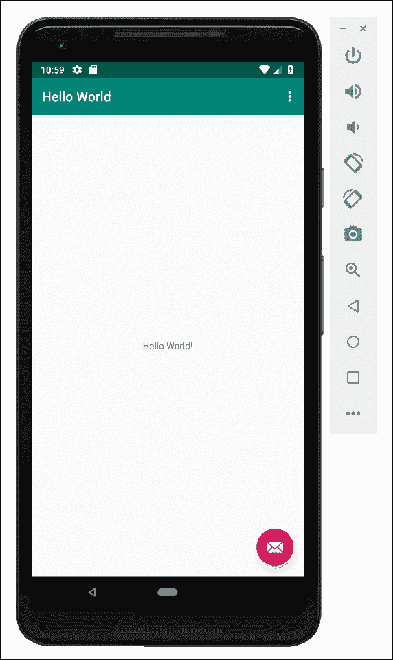

# 第一章：开始使用安卓和 Kotlin

欢迎来到*令人兴奋的安卓和 Kotlin 世界*！在这第一章中，我们将立即开始开发安卓应用程序，不会浪费任何时间。

我们将看看安卓有什么好处，安卓和 Kotlin 是什么，它们如何协同工作和互补，以及对我们作为未来开发者意味着什么。接下来，我们将设置所需的软件，以便我们可以构建和部署一个简单的第一个应用程序。

在本章中，我们将涵盖以下主题：

+   学习 Kotlin 和安卓如何协同工作

+   设置我们的开发环境，安卓 Studio

+   学习什么是安卓应用程序

+   学习 Kotlin

+   构建我们的第一个安卓应用程序

+   部署安卓模拟器

+   在安卓模拟器和真实设备上运行我们的应用程序

这是一个很多内容要学习的，所以让我们开始吧。

# 为什么使用 Kotlin 和安卓？

当安卓于 2008 年首次出现时，与苹果 iPhone/iPad 上更时尚的 iOS 相比，它显得有些沉闷。但是，通过一系列与实用、价格敏感的消费者以及时尚意识和技术精通的消费者产生共鸣的手机产品，安卓用户数量迅速增加。

对于许多人来说，包括我自己在内，为安卓开发是最有回报的业余爱好和商业。

快速地将一个想法的原型组合起来，完善它，然后决定运行并将其连接成一个完整的应用程序，这是一个令人兴奋和有回报的过程。任何编程都可以很有趣 - 我一生都在编程 - 但为安卓创造东西却是非常有回报的。

确切地定义为什么会这样很难。也许是因为这个平台是免费和开放的。你可以在不需要大型控制公司的许可下分发你的应用程序 - 没有人能阻止你。同时，你也可以在亚马逊应用商店和谷歌 Play 等成熟的、由公司控制的大众市场上分发应用。

然而，更有可能的是，为什么为安卓开发会给人如此好的感觉是因为设备本身的性质。它们是非常个人化的。你可以开发与人们生活互动的应用程序，教育、娱乐、讲故事等等，它就在他们的口袋里准备好了 - 在家里、工作场所或度假中。

你当然可以为桌面构建更大的东西，但知道成千上万（甚至数百万）的人将你的作品装在口袋里并与朋友分享，这不仅仅是一种兴奋。

开发应用程序不再被认为是怪异、书呆子或隐居。事实上，为安卓开发被认为是非常有技巧的，最成功的开发者受到极大的钦佩，甚至崇敬。

如果所有这些空洞的、精神上的东西对你毫无意义，那也没关系；为安卓开发可以让你谋生，甚至让你致富。随着设备拥有量的持续增长，CPU 和 GPU 性能的不断提升，以及安卓操作系统本身的不断演进，对专业应用程序开发者的需求只会增长。

简而言之，最优秀的安卓开发者 - 更重要的是，拥有最佳创意和最大决心的安卓开发者 - 比以往任何时候都更受欢迎。没有人知道这些未来的安卓应用程序开发者是谁，他们甚至可能还没有写下他们的第一行代码。

那么，为什么不是每个人都是安卓开发者呢？显然，并不是每个人都会像我一样对创造能够帮助改善人们生活的软件充满热情，但我猜测，因为你正在阅读这篇文章，你可能会。

# 初学者的第一个绊脚石

不幸的是，对于那些和我一样对此充满热情的人来说，进步的道路上存在一种玻璃墙，这让许多有抱负的安卓开发者感到沮丧。

Android 要求有志成为开发者的人选择三种编程语言来制作应用程序。每一本 Android 书籍，即使是针对所谓的初学者，也都假设读者至少具有中级水平的 Kotlin、C++或 Java，大多数需要高级水平。因此，良好到优秀的编程知识被视为学习 Android 的先决条件。

不幸的是，在完全不同的环境中学习这些语言有时可能会有点乏味，而你学到的大部分知识也不能直接转移到 Android 的世界中。你可以理解为什么初学者对 Android 往往感到厌倦。

这本书不需要这样。在这本书中，我精心安排了你在厚重的 Kotlin 初学者专著中学到的所有 Kotlin 主题，并将它们重新制作成了三个多章节的应用程序和十多个快速的迷你应用程序，从一个简单的备忘录应用程序开始，逐渐发展到一个酷炫的绘图应用程序和一个数据库应用程序。

如果你想成为一名专业的 Android 开发者，或者只是想在学习 Kotlin 和 Android 时更有乐趣，这本书会帮助你。

# Kotlin 和 Android 是如何协同工作的

**Android 软件开发工具包**（**SDK**）主要是用 Java 编写的，因为 Kotlin 是新生力量；但是当我们告诉 Android Studio 将我们的 Kotlin 代码转换成可工作的应用程序时，它会与 SDK 中的 Java 合并在一起，形成一种中间形式，然后转换成一种称为 DEX 代码的格式，这是 Android 设备用来转换成运行应用程序的。对于我们开发者来说，这是无缝的，但了解这一点（也许是相当有趣的）是值得的。

无论你是用 Kotlin 还是 Java 编写应用程序，最终的 DEX 代码都是一样的。然而，使用 Kotlin 有一些显著的优势。

Kotlin 是以俄罗斯圣彼得堡附近的一个岛屿命名的。Kotlin 与苹果的 Swift 语言非常相似，因此现在学习 Kotlin 将为学习 iPhone/iPad 开发奠定良好的基础。

Kotlin 是最简洁的语言，因此最不容易出错，这对初学者来说非常好。Kotlin 也是最有趣的语言，主要是因为简洁性意味着你可以更快地得到结果，而且代码更少。谷歌认为 Kotlin 是官方（一流）的 Android 语言。Kotlin 还有一些其他优点，使其更不容易出错，也不太可能出现导致崩溃的错误。随着我们的学习，我们将发现这些优点的细节。

许多最先进、创新和流行的应用程序都是使用 Kotlin 编写的。其中一些例子包括 Kindle、Evernote、Twitter、Expedia、Pinterest 和 Netflix。

在我们开始 Android 之旅之前，我们需要了解 Android 和 Kotlin 是如何协同工作的。在我们用 Java 或 Kotlin 为 Android 编写程序之后，我们点击一个按钮，我们的代码就会被转换成另一种形式，这种形式是 Android 可以理解的。这种形式被称为**达尔维克可执行代码**，或**DEX**代码，转换过程被称为**编译**。当应用程序安装在设备上时，DEX 代码会被操作系统再次转换成优化的可执行状态。

### 注意

我们将在本章后面设置开发环境后立即看到这个过程。

Android 是一个复杂的系统，但你不需要深入了解它就能开始制作令人惊叹的应用程序。

### 提示

只有在长时间的使用和互动之后才能完全理解。

要开始，我们只需要了解基础知识。Android 运行在一个经过特殊适配的 Linux 操作系统上。因此，用户在 Android 上看到的只是在另一个操作系统上运行的应用程序。

Android 是一个系统中的系统。典型的 Android 用户看不到 Linux 操作系统，很可能甚至不知道它的存在。

其中一个目的是隐藏 Android 运行的硬件和软件的复杂性和多样性，但同时暴露出所有有用的功能。这些功能的暴露以两种方式进行：

+   首先，操作系统本身必须完全访问硬件，它已经做到了。

+   其次，这种访问必须对程序员友好且易于使用，这是因为 Android **应用程序编程接口**（**API**）。

让我们继续深入了解 Android API。

## Android API

Android API 是使得做出非凡事情变得容易的代码。一个简单的类比可以用一台机器来画出，也许是一辆汽车。当你踩油门时，引擎盖下会发生一大堆事情。我们不需要理解燃烧或燃油泵，因为一些聪明的工程师为我们做了一个**接口**；在这种情况下，是一个机械接口——油门踏板。

例如，下面这行代码在书的这个阶段可能看起来有点吓人，但它是一个很好的例子，说明了 Android API 如何帮助我们：

```kt
locationManager.getLastKnownLocation(LocationManager.GPS_PROVIDER)
```

一旦你学会了这一行代码搜索太空中可用的卫星，与它们在地球轨道上通信，然后获取你在地球表面的精确纬度和经度，你就能轻松地窥见 Android API 的强大和深度。

这段代码在书的这个阶段看起来有点具有挑战性，甚至令人费解，但试想以其他方式与卫星交流！

Android API 已经编写了大量代码供我们随意使用。

我们必须问的问题，也是这本书试图回答的问题是：我们如何使用所有这些代码来做酷炫的事情？或者，为了符合之前的类比，我们如何找到和操作 Android API 的踏板、方向盘，以及最重要的是天窗？

这个问题的答案就是 Kotlin 编程语言，以及 Kotlin 被设计来帮助程序员处理复杂性，避免错误，并快速取得进展。让我们深入了解 Kotlin 和**面向对象编程**（**OOP**）。

## Kotlin 是面向对象的

Kotlin 是一种**面向对象**的语言。这意味着它使用可重用的编程对象的概念。如果这听起来像技术术语，另一个类比将有所帮助。Kotlin 使我们和其他人（比如 Android API 开发团队）能够编写可以基于现实世界事物构建的代码，这是重要的部分——它可以**重复使用**。

因此，使用汽车的类比，我们可以问以下问题：如果一个制造商一天制造多辆汽车，他们是否为每辆汽车重新设计每个零件？

当然，答案是否定的。他们会找到高技能的工程师来开发完全正确的组件，经过多年的磨练、改进和提高。然后，这些相同的组件会一次又一次地被重复使用，偶尔也会被改进。

如果你对我的类比挑剔的话，你可以指出每个汽车的组件仍然必须使用真实的工程师或机器人从原材料中构建。这是真的。

软件工程师编写代码时所做的是为一个对象建立一个蓝图。然后我们使用代码从他们的蓝图中创建一个对象，一旦我们有了那个对象，我们可以配置它，使用它，将它与其他对象组合，以及其他更多的操作。

此外，我们可以自己设计蓝图并从中制作对象。然后编译器将我们定制的创作转化为 DEX 代码。嘿，变魔术！我们有了一个 Android 应用。

在 Kotlin 中，蓝图被称为**类**。当一个类被转化为一个真正工作的“东西”时，我们称它为该类的**对象**或**实例**。

### 注意

**简而言之，对象。**

我们可以继续进行类比。就我们目前而言，Kotlin（以及大多数现代编程语言）是一种允许我们编写一次代码，然后可以重复使用的语言。

这非常有用，因为它节省了我们的时间，并且允许我们使用其他人的代码来执行我们可能没有时间或知识来编写的任务。大多数情况下，我们甚至不需要看到这段代码，甚至不需要知道它是如何工作的！

最后一个类比。我们只需要知道如何使用那段代码，就像我们需要学会开车一样。

因此，Android 总部的一些聪明的软件工程师编写了一个非常复杂的程序，可以与卫星通信，因此，通过一行代码，我们就可以在地球表面获得我们的位置。不错。

大部分 Android API 是用另一种语言（Java）编写的，但这对我们来说并不重要，因为我们在使用更简洁的 Kotlin 时可以完全访问到这些功能（用 Java 编码）。Android Studio 和 Kotlin 编译器会在幕后处理复杂性。

软件工程师已经考虑了如何使这段代码对所有想要开发使用用户位置进行酷炫操作的 Android 程序员有用。他们将做的一件事是使功能变得简单，比如将设备的位置获取到世界上变成一个简单的一行任务。

因此，我们之前看到的一行代码会启动许多我们看不到、也不需要看到的代码。这是一个使用别人的代码来使我们的代码变得无限简单的例子。

### 提示

如果你不必看到所有的代码让你感到失望，那么我理解你的感受。当我们学习某些东西时，有些人希望了解每一个细节。如果你是这样的人，那么请放心，学习 Android API 内部工作的最佳起点是按照 API 程序员的意图使用它。此外，在整本书中，我将定期指出更多的学习机会，让你了解 Android API 的内部工作。此外，我们将编写自己可重用的类，有点像我们自己的 API，只是我们的类将专注于我们希望我们的应用程序执行的任务。

欢迎来到**OOP**的世界。我将在每一章中不断提到 OOP，并且在第十章中会有一个重大揭示，*面向对象编程*。

## 再跟我说一遍，Android 到底是什么？

在 Android 上完成任务，我们编写了自己的代码，这也使用了 Android API 的代码。然后，这些代码被编译成 DEX 代码，其余的由 Android 设备处理，而 Android 设备又运行在一个称为 Linux 的底层操作系统上，该操作系统处理着不同的 Android 设备的复杂和极其多样的硬件。

Android 设备的制造商和各个硬件组件的制造商显然也知道这一点，并且他们编写了称为**驱动程序**的高级软件，以确保他们的硬件（例如 CPU、GPU、GPS 接收器、存储芯片和硬件接口）可以在底层的 Linux 操作系统上运行。

DEX 代码（以及其他一些资源）被放在一个称为**Android 应用程序包**（**APK**）的文件包中，这就是设备运行我们的应用所需的内容。

### 提示

不需要记住我们的代码与硬件交互时经历的步骤的细节。只需要理解我们的代码经历了一些自动化过程，成为了我们将发布到 Google Play 商店的应用程序。

接下来的问题是：所有这些编码和编译成 DEX 代码，以及 APK 打包，究竟是在哪里进行的？让我们看看我们将要使用的开发环境。

## Android Studio

**开发环境**是一个术语，指的是在一个地方拥有你开发所需的一切，并且已经准备就绪。

开发 Android 需要一整套工具，当然还需要 Android API。这整套要求统称为 SDK。幸运的是，下载和安装一个单一应用程序将把这些东西捆绑在一起。这个应用程序就是 Android Studio。

Android Studio 是一个**集成开发环境**（**IDE**），将处理编译代码和与 Android API 链接的所有复杂性。安装完 Android Studio 后，我们可以在这个单一应用程序内完成所有需要做的事情，并将我们讨论过的许多复杂性放到脑后。

### 提示

随着时间的推移，这些复杂性将变得很自然。不需要立即掌握它们以继续进展。

所以，最好还是用上 Android Studio。

# 设置 Android Studio

设置 Android Studio 相当简单，尽管有点费时。拿些点心，按照以下步骤开始：

1.  访问[developer.android.com/studio/index.html](http://developer.android.com/studio/index.html)。点击大的**下载 Android Studio**按钮继续：

1.  勾选复选框接受条款和条件，然后点击**下载 Android Studio for Windows**按钮：

1.  下载完成后，运行刚刚下载的文件。文件名以`android-studio-ide…`开头，文件名的结尾会根据当前阅读时的版本而有所不同。

1.  点击**下一步 >**按钮继续：

1.  保持默认选项，如下截图所示，然后点击**下一步 >**按钮：

1.  接下来，我们需要选择安装 Android Studio 的位置，如下截图所示：

安装向导建议**500MB 的可用空间**，但你可能已经注意到前一个屏幕建议了 2.1GB。然而，在安装过程的后期还有更多的要求。此外，如果你的 Android Studio 部分和项目文件都在同一硬盘上，那会更容易一些。

出于这些原因，我建议至少有 4GB 的可用空间。如果需要切换驱动器以适应这一点，那么使用**浏览..**按钮浏览到硬盘上合适的位置。

### 提示

记下你选择的位置。

1.  当你准备好了，点击**下一步 >**按钮。

1.  在接下来的窗口中，选择**Android Studio**将出现在开始菜单中的文件夹。你可以保持默认设置，如下：

1.  点击**安装**。这一步可能需要一些时间，特别是在旧机器上或者如果你的网络连接较慢。当这个阶段完成时，你会看到以下屏幕：

1.  点击**下一步 >**。

1.  Android Studio 现在已安装 - 有点。勾选**启动 Android Studio**复选框，然后点击**完成**按钮：

1.  你会看到**欢迎**屏幕，如下截图所示：

1.  点击**下一步**按钮。

1.  选择**标准**安装类型，如下截图所示：

1.  点击**下一步**按钮。

1.  选择你喜欢的配色方案。我选择了**IntelliJ**，如下截图所示：

1.  点击**下一步**。

1.  现在你会看到**验证设置**屏幕：

1.  点击**完成**按钮。Android Studio 现在将开始一些更多的下载，可能需要一些时间。

1.  当 Android Studio 准备好时，您将有运行它的选项。在这一点上，点击**完成**按钮。Android Studio 很可能已经准备好了。如果您要直接进行下一节，可以将其保持打开，或者在下一节的指示下关闭它，然后重新打开它。

## 最后一步 - 目前为止

使用您喜欢的文件管理软件，也许是 Windows 资源管理器，创建一个名为`AndroidProjects`的文件夹。将其放在您安装 Android Studio 的相同驱动器的根目录下。因此，如果您在`C:/Program Files/Android`安装了 Android Studio，那么请在`C:/AndroidProjects`创建您的新文件夹。

或者，如果您在`D:/Program Files/Android`安装了 Android Studio，那么请在`D:/AndroidProjects`创建您的新文件夹。

### 提示

请注意，下一节的截图显示了`D:`驱动器上的`AndroidProjects`文件夹。这是因为我的`C:`驱动器有点满了。两者都可以。我在一个有足够空间的 C:驱动器上的借来的 PC 上进行了安装教程的屏幕截图，因为那是 Android Studio 的默认位置。将其保持在与 Android 安装相同的驱动器上更整洁，可能会避免未来的问题，所以如果可以的话，请这样做。

请注意`Android`和`Projects`之间没有空格，并且两个单词的第一个字母都是大写的。大写是为了清晰起见，而省略空格是 Android Studio 所要求的。

Android Studio 和我们需要的支持工具已经安装并准备就绪。我们现在离构建我们的第一个应用程序非常接近了。

现在，让我们稍微了解一下 Android 应用程序的组成。

# 什么构成了 Android 应用程序？

我们已经知道，我们将编写 Kotlin 代码，该代码将使用其他人的代码，并编译为 DEX 代码，该代码将在我们的用户 Android 设备上使用。除此之外，我们还将添加和编辑其他文件，这些文件将包含在最终的 APK 中。这些文件被称为**Android 资源**。

## Android 资源

正如本章前面提到的，我们的应用程序将包括资源，例如图像、声音和用户界面布局，这些资源将保存在与 Kotlin 代码分开的文件中。我们将在本书的过程中慢慢介绍它们。

它们还将包括我们应用程序的文本内容的文件。约定俗成的是通过单独的文件引用应用程序中的文本，因为这样可以很容易地进行更改，并且可以创建适用于多种不同语言和地理区域的应用程序。

此外，尽管我们可以选择使用可视化设计师来实现应用程序的**用户界面**（**UI**）布局，但 Android 实际上是从基于文本的文件中读取它们的。

Android（或任何计算机）无法像人类那样阅读和识别文本。因此，我们必须以高度组织和预定义的方式呈现我们的资源。为此，我们将使用**可扩展标记语言**（**XML**）。XML 是一个庞大的主题；幸运的是，它的整个目的是既适合人类阅读又适合机器阅读。我们不需要学习这种语言；我们只需要注意（然后遵守）一些规则。此外，大多数时候，当我们与 XML 交互时，我们将通过 Android Studio 提供的一个整洁的可视化编辑器来进行。我们可以通过文件扩展名为`.xml`来判断我们是否在处理 XML 资源。

您不需要记住这一点，因为我们将不断地在本书中回到这个概念。

# Android 代码的结构

除了这些资源之外，值得注意的是 Android 的代码结构。我们可以利用数百万行代码。显然，这些代码需要以便于查找和引用的方式进行组织。它们被组织成特定于 Android 的**包**。

## 包

每当我们创建一个新的 Android 应用程序时，我们都会选择一个唯一的名称，称为**包**。我们很快就会看到我们是如何做到这一点的，在标题为*我们的第一个 Android 应用*的部分中。包通常被分成**子包**，以便它们可以与其他类似的包一起分组。我们可以简单地将它们想象成文件夹和子文件夹，这几乎就是它们的实际情况。

我们可以将 Android API 提供给我们的所有包想象成来自代码库的代码。我们将使用的一些常见的 Android 包包括以下内容：

+   `android.graphics`

+   `android.database`

+   `android.view.animation`

正如你所看到的，它们被安排和命名，以使其中的内容尽可能明显。

### 提示

如果你想了解 Android API 的深度和广度，可以查看[`developer.android.com/reference/packages`](https://developer.android.com/reference/packages)上的 Android 包索引。

## 类

早些时候，我们了解到我们可以将可重用的代码蓝图转换为对象，这些蓝图被称为**类**。类包含在这些包中。在我们的第一个应用程序中，我们将看到如何轻松地**导入**其他人的包，以及从这些包中导入特定的类供我们的项目使用。一个类通常包含在与类同名的文件中。

## 函数

在 Kotlin 中，我们进一步将我们的类分成执行不同操作的部分，我们称这些面向操作的部分为**函数**。正是类的函数将用于访问 Android 代码中数百万行提供的功能。

我们不需要阅读代码。我们只需要知道哪个类有我们需要的东西，它在哪个包中，以及类内的哪个函数能给我们准确的结果。

我们可以以相同的方式来思考我们将自己编写的代码的结构，尽管通常每个应用程序只有一个包。

当然，由于 Kotlin 的面向对象的特性，我们只会使用 API 中的部分内容。还要注意，每个类都有自己独特的**数据**。通常，如果你想要访问类中的数据，你需要拥有该类的对象。

### 提示

你不需要记住这些，因为我们将在本书中不断回到这个概念。

本章结束时，我们将导入多个包，以及其中的一些类。到第二章结束时，我们甚至将编写我们自己的函数。

# 我们的第一个 Android 应用

现在我们可以开始我们的第一个应用程序了。在编程中，传统上新学生的第一个应用程序会使用他们正在使用的语言/操作系统向世界问好。我们将快速构建一个可以做到这一点的应用程序，并且在第二章中，*Kotlin, XML 和 UI 设计师*，我们将超越这一点，并添加一些在用户点击时响应的按钮。

### 注意

本章结束时的完整代码在`Chapter01`文件夹的下载包中供您参考。但是，您不能简单地复制和粘贴这些代码。您仍然需要按照本章（以及所有项目的开始）中解释的项目创建阶段进行操作，因为 Android Studio 在幕后做了大量工作。一旦您熟悉了这些步骤，并理解了哪些代码是由您，程序员，输入的，哪些代码/文件是由 Android Studio 生成的，那么您就可以通过从我在下载包中提供的文件中复制和粘贴来节省时间和输入。

按照以下步骤启动项目：

1.  以与运行其他应用程序相同的方式运行 Android Studio。例如，在 Windows 10 上，启动图标会出现在开始菜单中。

### 提示

如果提示**从…导入 Studio 设置**：选择**不导入设置**。

1.  您将看到 Android Studio 的欢迎屏幕，如下截图所示。找到**开始新的 Android Studio 项目**选项，然后单击它:

1.  之后，Android Studio 将弹出**选择您的项目**窗口，如下所示:

1.  我们将使用**基本活动**选项，就像在上一张截图中选择的那样。Android Studio 将自动生成一些代码和一些资源来启动我们的项目。我们将在下一章详细讨论代码和资源。选择**基本活动**，然后点击**下一步**。

1.  接下来的屏幕是**配置您的项目**屏幕，在这里我们将执行以下步骤以及一些其他操作:

1.  命名新项目

1.  提供公司域作为包名，以区分我们的项目和其他任何项目，以防我们决定将其发布到 Play 商店

1.  选择计算机上项目文件的位置

1.  选择我们首选的编程语言

1.  我们的项目名称将是`Hello World`，文件的位置将是我们在*设置 Android Studio*部分中创建的`AndroidProjects`文件夹。 

1.  包名可以是几乎任何您喜欢的东西。如果您有网站，可以使用`com.yourdomain.helloworld`的格式。如果没有，可以使用`com.gamecodeschool.helloworld`，或者您随意编造的东西。这只有在您决定发布时才重要。

1.  为了清楚起见，如果您无法清楚地看到以下截图中的细节，这里是我使用的值。请记住，您的值可能会根据您选择的公司域和项目保存位置而有所不同:

| 选项 | 输入的值 |
| --- | --- |
| 名称: | `Hello World` |
| 包名: | `com.gamecodeschool.helloworld` |
| 语言: | Kotlin |
| 保存位置: | `D:\AndroidProjects\HelloWorld` |
| 最低 API 级别: | 保持默认值 |
| 此项目将支持即时应用程序: | 保持默认值 |
| 使用 AndroidX 构件: | 选择此选项 |

### 注意

请注意，应用程序名称中的"Hello"和"World"之间有一个空格，但项目位置没有，如果有空格则无法工作。

关于**最低 API 级别**设置，我们已经知道 Android SDK 是我们将用于开发应用程序的代码包集合。像任何好的 SDK 一样，Android SDK 定期更新，每次进行重大更新时，版本号都会增加。简单来说，版本号越高，您可以使用的功能就越新；版本号越低，我们的应用程序就能在更多设备上运行。目前，默认的**API 15, Android 4.0.3 (IceCreamSandwich)**版本将为我们提供许多出色的功能，并且几乎与当前使用的 Android 设备兼容。如果在阅读时，Android Studio 建议使用更新的 API，则请使用该 API。

如果您在未来的某个时候阅读本书，那么**最低 API**选项可能会默认为不同的内容，但本书中的代码仍将有效。

在您输入所有信息后，下面的截图显示了**配置您的项目**屏幕:



### 注意

您可以使用几种不同的语言编写 Android 应用程序，包括 C++和 Java。与使用 Kotlin 相比，每种语言都有各种优缺点。学习 Kotlin 将是对其他语言的很好介绍，而且 Kotlin 也是 Android 的最新（也可以说是最好的）官方语言。

1.  单击**完成**按钮，Android Studio 将为我们准备新项目。这可能需要几秒钟或几分钟，具体取决于您的计算机性能。

在这个阶段，您可能已经准备好继续了，但是，根据安装过程的不同，您可能需要点击一些额外的按钮。

### 提示

这就是为什么我提到我们只是*可能*完成了安装和设置。

在 Android Studio 的底部窗口中查看是否有以下消息：

### 注意

请注意，如果您在 Android Studio 底部没有看到类似以下截图中显示的水平窗口，您可以跳过这两个额外的步骤。

## 可能的额外步骤 1


如果需要，点击**安装缺少的平台并同步项目**，接受许可协议，然后点击**下一步**，接着点击**完成**。

## 可能的额外步骤 2

您可能会收到另一条类似的消息：


如果出现上述消息，请点击**安装构建工具...**，然后点击**完成**。

### 提示

您可以通过单击 Android Studio 底部的**消息**选项卡来整理屏幕，并关闭底部的水平窗口，但这并不是强制性的。

# 到目前为止，部署应用程序

在我们探索任何代码并学习我们的第一部分 Kotlin 之前，您可能会惊讶地发现我们已经可以运行我们的项目。这将是一个相当简陋的屏幕，但由于我们将尽可能频繁地运行应用程序来检查我们的进度，让我们现在看看如何做到这一点。您有三个选项：

+   在 PC 上的模拟器上运行应用程序（Android Studio 的一部分）处于调试模式

+   在 USB 调试模式下在真实的 Android 设备上运行应用程序

+   将应用程序导出为可以上传到 Play 商店的完整 Android 项目

第一个选项（调试模式）是最容易设置的，因为我们在设置 Android Studio 的过程中已经完成了。如果您有一台功能强大的 PC，您几乎看不到模拟器和真实设备之间的区别。然而，屏幕触摸是由鼠标点击模拟的，并且在一些后期的应用程序中无法进行用户体验的有效测试，比如绘图应用程序。此外，您可能更喜欢在真实设备上测试您的创作 - 我知道我是这样的。

第二个选项，使用真实设备，有一些额外的步骤，但一旦设置好，就和第一个选项一样好，屏幕触摸是真实的。

最后一个选项大约需要五分钟（至少）来准备，然后您需要手动将创建的包放到真实设备上并安装它（每次更改代码时）。

最好的方法可能是使用模拟器快速测试和调试代码的小增量，然后定期在真实设备上使用 USB 调试模式，以确保一切仍然如预期。只有偶尔你会想要导出一个实际可部署的包。

### 提示

如果您的 PC 特别慢或 Android 设备特别老旧，您可以只使用一个选项或另一个选项来运行本书中的项目。请注意，慢的 Android 手机可能会正常运行，但非常慢的 PC 可能无法处理后期应用程序的模拟器运行，并且您将受益于在手机/平板电脑上运行它们。

出于这些原因，我现在将介绍如何使用模拟器和 USB 调试在真实设备上运行应用程序。

## 在 Android 模拟器上运行和调试应用程序

按照以下简单步骤在默认的 Android 模拟器上运行应用程序：

1.  在 Android Studio 的主菜单栏中，选择**工具** | **AVD 管理器**。AVD 代表 Android 虚拟设备（模拟器）。您将看到以下窗口：

1.  注意列表中是否有一个模拟器。在我的情况下，它是**Pixel 2 XL API 28**。如果您在将来的某个时候阅读本书，它将是默认安装的不同模拟器。这并不重要。单击以下截图中显示的绿色播放图标（右侧），然后等待模拟器启动：

1.  现在，你可以点击 Android Studio 快速启动栏上的播放图标，如下截图所示，然后在提示时选择**Pixel 2 XL API 28**（或者你的模拟器叫什么）应用程序将在模拟器上启动：

你完成了。这是目前在模拟器中的应用程序外观。请记住，你可能（很可能）有一个不同的模拟器，这没关系：



显然，在我们搬到硅谷寻找财务支持之前，我们还有很多工作要做，但这是一个良好的开始。

我们需要经常测试和调试我们的应用程序，以便在开发过程中检查任何错误、崩溃或其他意外情况。

### 注意

我们将在下一章中看到如何从我们的应用程序中获取错误和其他调试反馈。

确保它在你想要定位的每种设备类型/尺寸上看起来好看并且运行正确是很重要的。显然，我们并不拥有成千上万种 Android 设备中的每一种。这就是模拟器的用武之地。

然而，模拟器有时会有点慢和繁琐，尽管最近已经有了很大的改进。如果我们想要真正感受到用户体验，那么我们无法击败部署到真实设备。因此，在开发我们的应用程序时，我们既想使用真实设备，又想使用模拟器。

### 提示

如果你计划不久后再次使用模拟器，请保持其运行，以避免等待它再次启动。

如果你想在平板电脑上尝试你的应用程序，你需要一个不同的模拟器。

### 注意

**创建新的模拟器**

为不同的 Android 设备创建模拟器很简单。从主菜单中选择**工具** | **AVD 管理器**。在**AVD 管理器**窗口中，左键单击**创建新的虚拟设备**。现在左键单击你想要创建的设备类型 - **电视**，**手机**，**Wear OS**或**平板电脑**。现在只需左键单击**下一步**，按照说明创建你的新 AVD。下次运行你的应用程序时，新的 AVD 将出现为运行应用程序的选项。

现在我们可以看看如何将我们的应用程序放到真实设备上。

## 在真实设备上运行应用程序

首先要做的事情是访问你的设备制造商的网站，获取并安装你的设备和操作系统所需的任何驱动程序。

### 提示

大多数新设备不需要驱动程序，所以你可能首先想尝试以下步骤。

接下来的几个步骤将为 Android 设备设置调试。请注意，不同的制造商对菜单选项的结构略有不同。但是对于大多数设备来说，启用调试的以下顺序可能非常接近，如果不是完全相同：

1.  点击你手机/平板上的**设置**菜单选项或**设置**应用程序。

1.  这一步对不同版本的 Android 略有不同。**开发者选项**菜单被隐藏起来，以免给普通用户带来麻烦。你必须执行一个稍微奇怪的任务来解锁菜单选项。点击**关于设备**或**关于手机**选项。找到**构建号**选项，重复点击它，直到你收到一条消息，告诉你**你现在是开发者了！**

### 提示

一些制造商有不同的、晦涩的方法来完成这一步。如果这一步不起作用，请搜索你的设备和“解锁开发者选项”。

1.  返回**设置**菜单。

1.  点击**开发者选项**。

1.  点击**USB 调试**的复选框。

1.  将你的 Android 设备连接到计算机的 USB 端口。

1.  从 Android Studio 工具栏中点击播放图标，如下截图所示：

1.  在提示时，点击确定在你选择的设备上运行应用程序。

现在我们准备好学习一些 Kotlin，并将我们自己的 Kotlin 代码添加到 Hello World 项目中。

# 常见问题

问：那么，Android 实际上并不是一个操作系统；它只是一个虚拟机，所有 Android 手机和平板电脑实际上都是 Linux 机器吗？

答：不，Android 设备的所有不同子系统，包括 Linux、库和驱动程序，构成了 Android 操作系统。

# 总结

到目前为止，我们已经建立了一个 Android 开发环境，并在模拟器和真实设备上创建和部署了一个应用程序。如果您仍然有未解答的问题（您可能比本章开始时还有更多问题），不要担心，因为随着我们深入了解 Android 和 Kotlin 的世界，事情会变得更清晰。

随着章节的进展，您将建立起对所有内容如何相互关联的全面理解，然后成功只是一个练习和更深入了解 Android API 的问题。

在下一章中，我们将使用可视化设计师和原始 XML 代码来编辑 UI，同时编写我们的第一个 Kotlin 函数，并且我们将使用 Android API 为我们提供的一些函数。
