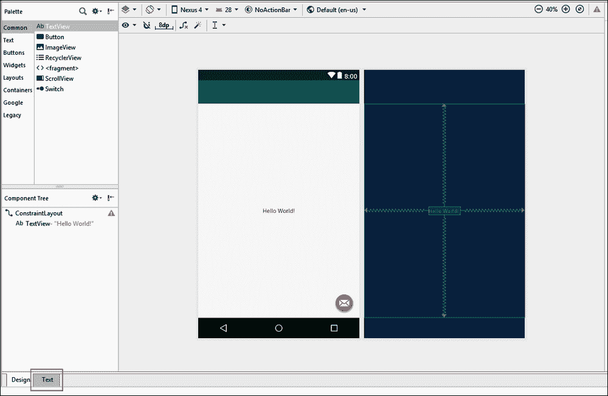
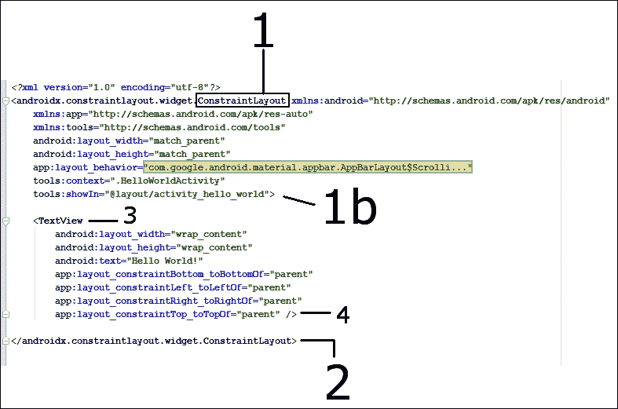
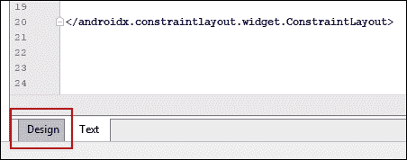
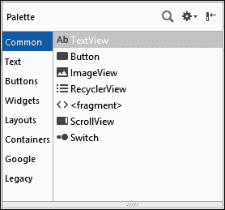
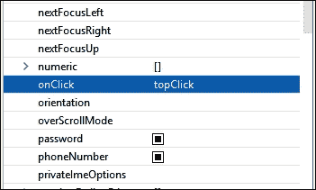
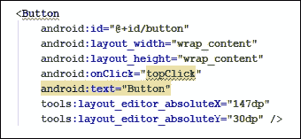
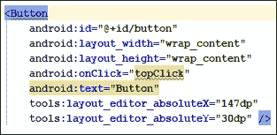
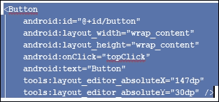
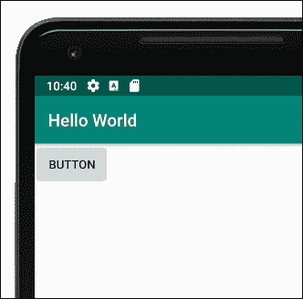
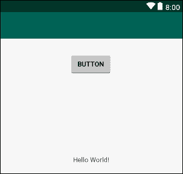

# 第二章：Kotlin，XML 和 UI 设计师

在这个阶段，我们已经有了一个可用的 Android 开发环境，并且已经构建并部署了我们的第一个应用程序。然而，显然，由 Android Studio 自动生成的代码不会成为下一个畅销的 Google Play 应用程序。我们需要探索这些自动生成的代码，以便开始了解 Android，然后学习如何构建这个有用的模板。为了达到这个目的，我们将在本章中进行以下操作：

+   了解如何从我们的应用程序中获得技术反馈。

+   检查我们第一个应用程序的 Kotlin 代码和用户界面（UI）XML 代码。

+   第一次尝试使用 Android UI 设计师。

+   编写我们的第一个 Kotlin 代码。

+   学习一些核心的 Kotlin 基础知识以及它们与 Android 的关系。

首先，让我们看看如何从我们的应用程序中获得反馈。

# 检查日志输出

在上一章中，我们提到我们的应用程序在模拟器或真实设备上以调试模式运行；这样我们就可以监视它，并在出现问题时获得反馈。那么，所有这些反馈在哪里呢？

您可能已经注意到 Android Studio 窗口底部有很多滚动文本。如果没有，请点击 logcat 选项卡，如下面截图中标有 1 的区域所示：

### 提示

请注意，模拟器必须在运行状态，或者真实设备必须以调试模式连接，才能看到下面的窗口。此外，如果由于某种原因重新启动了 Android Studio，并且尚未执行应用程序，则 logcat 窗口将为空。请参考第一章，在模拟器或真实设备上运行应用程序：


如果需要查看更多内容，您可以像大多数其他 Windows 应用程序一样，拖动窗口使其更高。

这个窗口称为 logcat，有时也被称为控制台。这是我们的应用程序告诉我们用户看不到的情况。如果应用程序崩溃或出现错误，原因或线索将出现在这里。如果我们需要输出调试信息，我们也可以在这里进行。

### 提示

如果你不明白为什么你的应用程序崩溃了，将 logcat 中的一部分文本复制粘贴到 Google 中通常会揭示原因。

## 过滤 logcat 输出

您可能已经注意到，logcat 的大部分内容，如果不是全部，几乎是难以理解的。没关系；现在，我们只对将在红色中突出显示的错误和我们将在下面学习的调试信息感兴趣。为了在 logcat 窗口中看到更少的无关文本，我们可以打开一些过滤器以使事情更清晰。

在上一张截图中，我还突出显示了另外两个区域，标记为 2 和 3。区域 2 是控制第一个过滤器的下拉列表。现在左键单击它，并将其从 Verbose 更改为 Info。我们已经大大减少了文本输出。当我们对应用程序进行了一些更改并重新部署后，我们将看到这是有用的。在我们探索构成我们项目的代码和资产之后，我们将这样做。另外，请确保标记为 3 的区域显示为“仅显示所选应用程序”。如果不是，请左键单击它，并将其更改为“仅显示所选应用程序”。

现在我们可以看一下 Android Studio 自动生成的内容，然后开始修改和添加代码，以个性化我们从项目创建阶段得到的内容。

# 探索项目的 Kotlin 代码和主要布局的 XML 代码

我们将查看包含定义简单 UI 布局的代码的资源文件，以及包含我们 Kotlin 代码的文件。在这个阶段，我们不会试图理解所有内容，因为在理解之前我们需要学习更多的基础知识。然而，我们将看到这两个文件的基本内容和结构，以便将它们的内容与我们已经了解的 Android 资源和 Kotlin 知识相协调。

## 检查 MainActivity.kt 文件

首先让我们看一下 Kotlin 代码。你可以通过左键单击`MainActivity.kt`标签来查看这段代码，如下面的截图所示：


由于我们不会详细讨论代码的细节，带注释的截图比以文本形式重现实际代码更有用。在阅读本节时，请经常参考以下截图：


首先要注意的是，我在代码中添加了一些空行，以便排版和呈现更清晰的图像。

### 在 Android Studio 中折叠（隐藏）代码

现在，看一下 Android Studio 窗口的左侧（不是前面的截图），观察编辑器左侧的所有**+**和**-**按钮，可以折叠和展开代码的部分：


我已经折叠了一些代码部分，留下了其他部分可见。因此，你屏幕上看到的与前面的截图略有不同。在 Android Studio 中，尝试一段时间使用左侧的**+**和**–**按钮，练习隐藏和显示代码的部分。你可能能够让你的屏幕看起来像前面的截图，但这并不是继续的要求。像这样隐藏代码的技术术语称为**折叠**。

### 包声明

第**1**部分称为**包声明**，正如你所看到的，它是我们在创建项目时选择的包名称，前面加上`package`这个词。每个 Kotlin 文件的顶部都会有一个包声明。

### 导入类

第**2**部分是六行代码，都以`import`开头。在`import`之后，我们可以看到各种用点分隔的单词。每行的最后一个单词是该行导入到我们项目中的类的名称，而每行中较早的单词都是包和子包，其中包含这些类。

例如，下一行导入了`androidx.appcompat.app`包和子包中的`AppCompatActivity`类：

```kt
import androidx.appcompat.app.AppCompatActivity
```

这意味着在我们的项目中，我们将可以访问这些类。实际上，正是这些类被自动生成的代码用来制作我们在上一章中看到的简单应用程序。

在本章中我们不会讨论所有这些类。重要的是我们可以导入这些类，这使我们能够立即获得更多功能。请注意，我们可以随时从任何包中添加额外的类，并且在不久的将来我们将这样做以改进我们的应用程序。

### 类声明

我们的代码的第**3**部分称为**类声明**。以下是完整的那一行；我已经突出显示了其中的一部分，如下所示：

```kt
class MainActivity : AppCompatActivity() {
```

类声明是类的开始。请注意，突出显示的部分`MainActivity`是在创建项目时自动生成的名称，也与`MainActivity.kt`文件名相同。这正如我们之前讨论过的 Kotlin 类一样。

冒号(`:`)表示我们的名为`MainActivity`的类将是`AppCompatActivity`类型。这表明，虽然这个文件中的代码行数不多，但我们也使用了更多的代码，这些代码来自`AppCompatActivity`类。所有这些以及更多内容将在第十章*面向对象编程*中变得清晰。

最后，对于第**3**部分，看一下行末的左花括号：`{`。现在看看我们代码截图的第**4**部分。这个右花括号(`}`)表示类的结束。在左右花括号之间的所有内容，`{...},`都是类的一部分。

### 类内的函数

现在看看代码的第**5**部分。这是完整的代码行，其中突出显示了我们当前讨论的关键部分：

```kt
override fun onCreate(savedInstanceState: Bundle?) {
```

这是一个函数**签名**。高亮显示的部分`onCreate`是函数**名称**。Kotlin 的`fun`关键字清楚地表明这是函数的开始。我们通过使用函数的名称来执行其代码。当我们这样做时，我们说我们正在**调用**一个函数。

尽管我们现在不会关心函数名两侧的代码部分，但你可能已经注意到`Bundle`，这是我们在代码的第**2**部分中导入的类之一。如果我们删除相关的`import`行，Android Studio 将不知道`Bundle`类是什么，它将无法使用，并且会以红色下划线突出显示为错误。

然后我们的代码将无法编译和运行。请注意，前面代码行的最后一件事是一个左花括号（`{`）。这表示`onCreate`函数中包含的代码的开始。现在跳到我们代码的第**6**部分，您将看到一个右花括号（`}`）。您可能已经猜到这是函数的结束。在`onCreate`函数的左右花括号之间的所有代码都是在调用函数时执行的代码。

我们现在不需要深入了解这段代码的作用，但是总体上，它通过引用一些由 Android Studio 在创建项目时自动生成的资源文件来设置应用的外观和布局。我在前面的截图中用标号**9**标出了这些资源文件的轮廓。

部分**7**和**8**也是我折叠起来以使截图和讨论更简单的函数。它们的名称分别是`onCreateOptionsMenu`和`onOptionsItemSelected`。

我们对我们的 Kotlin 代码了解足够多，可以取得一些进展。我们将在本章后面再次看到这段代码并进行更改。

### 到目前为止的 Kotlin 代码摘要

确实，在前面的代码中包含了一些复杂的语法。然而，我们正在建立对这段代码的足够了解，以便我们可以在其中工作，并开始快速学习 Kotlin 和 Android，而不必先阅读数百页的 Kotlin 理论。到本书结束时，所有的代码都会让人明白。但为了现在快速进展，我们只需要接受一些细节将在稍后一段时间内仍然是个谜。

## 检查主布局文件

现在我们将只看其中一个`.xml`文件。在本书的整个过程中，我们将遇到几个不同的布局文件，但让我们从最重要的一个开始，它决定了我们应用的外观。

单击我们一直在讨论的`MainActivity.kt`标签旁边的`content_main.xml`标签。

在右侧的主窗口中，您将看到我们应用的**设计**视图，如下截图所示：



我们在设计应用程序时所做的大部分工作将在这个设计视图中完成。然而，了解背后发生了什么是很重要的。

设计视图是`content_main.xml`文件中包含的 XML 代码的图形表示。单击**Text**标签（如前面截图底部附近所示）以查看构成布局的 XML 代码。我已经注释了 XML 文本的截图，以便我们可以接下来讨论它：



首先要注意的是，这个文件并不代表整个布局。但它确实代表了大部分的表面积和中心的**Hello World**消息。此外，在左侧，我们可以看到现在熟悉的**+**和**-**图标，以便我们可以折叠和展开代码的各个部分。

### UI 布局元素

如果我们首先看一下标记为**1**的代码部分，我们会看到的第一件事是`…ConstraintLayout...`。`ConstraintLayout`元素是用于包装 UI 的 UI 元素。

### 注意

有更多技术和具体的方式来指代我们用户界面设计的不同“元素”。随着我们的进展，我们将介绍诸如小部件、视图和视图组等术语。

当我们在 Android 中的 UI 中添加一个新元素时，我们总是以左尖括号（`<`）开头，后面跟着元素的名称。

紧随这行看起来相当长而繁琐的代码之后的代码定义了这个元素将具有的**属性**。这可能包括数十种不同的东西，取决于它是什么类型的 UI 元素。在这里，除了其他一些 XML 之外，我们可以看到诸如`layout_width`、`layout_height`和`showIn`之类的东西。所有这些属性定义了`ConstraintLayout`元素将如何出现在用户的屏幕上。`ConstraintLayout`元素的属性在第一个右尖括号（`>`）处结束，标记为**1b**。

如果我们看一下 XML 截图的底部，我们会看到标记为**2**的代码。这段代码`</…ConstraintLayout>`标志着`ConstraintLayout`元素的结束。在元素的属性的右尖括号（`>`）和定义其结束的`</…ConstraintLayout>`代码之间的任何内容都被视为元素的**子元素**。因此，我们可以看到我们的`ConstraintLayout`元素有（或包含）一个子元素。现在让我们来看看这个子元素。

### UI 文本元素

利用我们刚刚学到的知识，我们可以推断出在截图的位置**3**开始的 UI 元素称为`TextView`元素。就像它的父元素一样，它以左尖括号（`<`）和它的名称开始：`<TextView...`。如果我们进一步查看我们的`TextView`元素，我们会发现它有几个属性。它有一个`text`属性，设置为`"Hello world!"`。当然，这就是我们的应用向用户显示的确切文本。它还有`layout_width`和`layout_height`属性，都设置为`"wrap_content"`。这告诉`TextView`元素，它可以占用所需的内容空间，但不会超过。正如我们将在本书中看到的，对于这个和其他 UI 元素，还有许多其他属性可用。

请注意我们的 XML 截图上**4**位置的代码是`/>`。这标志着`TextView`元素的结束。这与`ConstraintLayout`元素的结束方式略有不同。当 XML 中的元素没有子元素时，我们可以像这样结束它：`/>`。当元素有子元素并且其结束位置在其属性定义的代码之后时，通过重复其名称来结束元素会更清晰，像这样：`</…ConstraintLayout>`。

### 注意

您可能想知道为什么`TextView`元素的元素名称简短而简洁（只是`TextView`），而`ConstraintView`元素的完整名称前面有明显复杂的杂乱（`androidx.constraintlayout.widget.ConstraintLayout`）。这个`ConstraintLayout`元素是布局的特殊版本，用于确保我们的应用与较旧版本的 Android 兼容。正如我们将在一分钟内看到的，当我们向应用添加按钮时，大多数元素都有简单而简洁的名称。

我们将在下一节中编辑这段代码，并了解更多关于属性的知识，同时探索另一种类型的 UI 元素——即`Button`元素。

# 将按钮添加到主布局文件

在这里，我们将在屏幕上添加一对按钮，然后探索一种快速的方法让它们做一些事情。我们将以两种不同的方式添加按钮；首先，使用可视化设计师，其次，通过直接添加和编辑 XML 代码。

## 通过可视化设计师添加按钮

要开始添加我们的第一个按钮，请点击我们刚刚讨论过的 XML 代码下方的**Design**选项卡，切换回设计视图。按钮在以下截图中被突出显示：



注意，在布局的左侧，我们有一个名为**Palette**的窗口：



调色板窗口分为两部分。左侧列表显示了 UI 元素的类别，并允许您选择类别，而右侧显示了当前选定类别中所有可用的 UI 元素。

确保选择了**Common**类别，如前面的截图所示。现在，左键单击并按住**Button**小部件，然后将其拖放到布局的顶部和中心附近。

它不需要完全一样；然而，练习做对是很好的。所以，如果你对按钮的位置不满意，那么你可以左键单击它在布局上进行选择，然后在键盘上按下*Delete*键将其删除。现在你可以重复上一步，直到你有一个你满意的整齐放置的按钮，就像下图所示：


此时，我们可以在模拟器上或真实设备上运行应用程序，按钮将会出现。如果我们点击它，甚至会有一个简单的动画来表示按钮被按下和释放。如果你愿意，现在可以尝试一下。

为了使应用程序更有趣，我们将使用**Attributes**窗口编辑按钮的属性。

### 编辑按钮的属性

确保按钮被左键单击选择。现在找到编辑窗口右侧的**Attributes**窗口，如下所示：


在前面的截图中，您可以看到我们可以访问一些按钮的属性，尽管不是全部。要显示更多属性，请单击**查看所有属性**链接（如前面的截图所示）。

现在你可以看到按钮的全部细节，我们可以开始编辑它。看起来似乎很惊讶，看到一个按钮这样一个明显简单的东西有如此多的属性。这是 Android API 为 UI 操作提供的多功能性和强大性的体现。看下面的截图，显示了我们最近添加的按钮的完整属性列表：


此外，注意即使前面的截图并没有显示所有内容，你可以使用**Attributes**窗口右侧的滚动条来显示更多属性。

正如你所看到的，我们可以在 UI 设计师中编辑的不同属性有很多。在第十二章中，*将我们的 Kotlin 连接到 UI 和空值性*，我们还将使用我们的 Kotlin 代码编辑和操作这些属性。现在，我们只编辑一个属性。滚动**Attributes**窗口，直到找到**onClick**属性，然后左键单击它进行编辑，如下图所示：


### 提示

属性按字母顺序排列，**onClick**大约在冗长列表的三分之二处。

在**onClick**属性的编辑框中键入`topClick`，然后在键盘上按*Enter*。确保使用相同的大小写，包括略微反直觉的小写`t`和大写`C`。

当完成时，**Attributes**窗口将如下截图所示：



我们在这里做的是在我们的代码中命名了我们想要在用户点击该按钮时调用（或执行）的 Kotlin 函数。名称是任意的，但是，由于这个按钮位于屏幕顶部，名称似乎有意义且易于记忆。我们使用的奇怪大小写是一种约定，将帮助我们保持代码清晰易读。随着我们的代码变得越来越长和复杂，我们将看到这种做法的好处。

当然，`topClick`函数目前还不存在。Android Studio 非常有帮助，但有一些事情我们需要自己做。在添加第二个按钮到我们的 UI 后，我们将使用 Kotlin 代码编写这个函数。此时，您可以运行应用程序，它仍然可以工作，但如果单击按钮，应用程序将崩溃，并显示错误消息，因为该函数不存在。

## 检查新按钮的 XML 代码

在为该项目添加最终按钮之前，单击编辑器下方的**Text**选项卡，切换回查看构成我们 UI 的 XML 代码：


请注意，在我们之前检查的 XML 代码中有一个新的代码块。以下是新代码块的屏幕截图：



请注意以下细节，这些细节应该与我们对 XML 和 Android UI 元素的了解相对应：

+   新代码以`<Button`开头，以`/>`结束。

+   新代码具有一系列属性，定义了按钮，包括`layoutWidth`和`layoutHeight`。

+   代码包括我们添加的带有值“topClick”的`onClick`属性。

+   `onClick`属性的`topClick`值被红色下划线标出，显示错误，因为函数目前还不存在。

+   按钮代码的开始和结束被包含在`ConstraintLayout`元素中。

### 注意

`dp` 是一个测量/距离的单位，将在第五章中更深入地讨论，*使用 CardView 和 ScrollView 创建美丽的布局*。

将鼠标悬停在下划线的`topClick`值上，以显示问题的详细信息，如下面的屏幕截图所示：


我们可以确认问题是，Android Studio 期望我们的代码中实现一个名为`topClick`的函数。在添加第二个按钮后，我们将这样做。

## 通过编辑 XML 代码添加按钮

为了多样化，并证明我们可以，我们现在将只使用 XML 代码添加另一个按钮，而不使用 UI 设计师。大多数时候，我们会使用 UI 设计师，但这个快速练习应该巩固 UI 设计师和底层 XML 代码之间的关系。

我们将通过复制和粘贴现有按钮的代码来实现这一点。然后，我们将对粘贴的代码进行一些小的编辑。

在以`<Button`开头的按钮代码之前单击左键。请注意，代码的开头和结尾现在有轻微的高亮显示：



这已经确定了我们要复制的代码部分。现在，左键单击并拖动以选择所有按钮代码，包括高亮显示的开头和结尾，如下一个屏幕截图所示：



按下*Ctrl* + *C*组合键复制突出显示的文本。将光标放在现有按钮代码下方，然后按几次*Enter*键，留下一些额外的空行。

按下*Ctrl* + *V*组合键粘贴按钮代码。此时，我们有两个按钮；但是，有一些问题：


我们在代表我们的按钮的两个代码块中都有额外的错误。`id`属性（在两个代码块中）被红色下划线标出。这个错误的原因是两个按钮都有相同的`id`属性。`id`属性应该将 UI 元素与所有其他 UI 元素区分开来，所以它们不能相同。让我们试着解决这个问题。

## 给按钮唯一的 id 属性

我们可以通过将第二个按钮称为`button2`来解决问题，但更有意义的是改变它们两个。编辑第一个按钮的代码，给它一个`id`属性为`buttonTop`。为此，找到第一个按钮中的以下代码行：

```kt
android:id="@+id/button"
```

然后，将代码行更改为以下内容：

```kt
android:id="@+id/buttonTop"
```

### 提示

注意`button`中的小写`b`和`Top`中的大写`T`。

现在找到第二个按钮中的以下代码行：

```kt
android:id="@+id/button"
```

然后，将代码行更改为以下内容：

```kt
android:id="@+id/buttonBottom"
```

`id`属性行上的错误已经消失。此时，你可能会认为我们可以继续解决我们的缺失功能问题。

然而，如果你运行应用程序并快速浏览一下，你会发现我们似乎只有一个按钮。不仅如此，按钮的位置也不是我们期望的：



这样做的原因是我们没有明确地定位它们，所以它们默认位于屏幕的左上角。我们在**设计**选项卡上看到的位置只是设计时的位置。所以，现在让我们来改变它。

## 在布局中定位这两个按钮

我们只能看到一个按钮的原因是，两个按钮都在同一个位置。第二个按钮正好覆盖在第一个按钮上。因此，即使在**设计**选项卡中（随时可以查看），按钮仍然重叠在一起，尽管它们位于屏幕中间：



### 注意

你可能会想知道为什么 UI 布局工具被设计成这种看似反直觉的方式；原因是灵活性。正如你将在接下来的两章中看到的，不仅可以在设计时以不同的方式定位 UI 元素，而且还有一系列不同的布局方案供应用程序设计者（也就是你）选择，以适应他们的计划。这种灵活性在学习 Android 时会导致一些尴尬，但一旦你克服了这种尴尬，就会获得很强大的设计能力。但不要担心，我们会一步一步地进行，直到你掌握了这个技巧。

我们将让 Android Studio 自动为我们解决问题，首先添加到我们的代码，然后使用 UI 设计工具。首先，让我们正确设置设计时布局。在第二个按钮的代码中，找到以下代码行：

```kt
tools:layout_editor_absoluteY="30dp" />
```

现在将其编辑为与以下代码行相同：

```kt
tools:layout_editor_absoluteY="100dp" />
```

### 提示

根据你放置第一个按钮的确切位置，Android Studio 中的值可能与刚刚讨论的值不同。如果第二个按钮比第一个按钮高大约 70dp，那么你可以继续进行这个练习。

这个微小的改变会使第二个按钮向下移动一点，但只在设计时有效。如果你在**设计**选项卡中查看，按钮将整齐地放置在第一个按钮的下方，但如果你在模拟器上运行应用程序，它们仍然都在屏幕的左上角，并且彼此重叠。

切换到**设计**选项卡，找到如下截图所示的**推断约束**按钮：


点击**推断约束**按钮。Android Studio 将编辑 XML 代码。让我们简要看一下幕后发生了什么。从代表按钮的代码部分的末尾，删除了以下代码行：

```kt
tools:layout_editor_absoluteX="147dp"
tools:layout_editor_absoluteY="30dp" />
```

这两行代码是水平（`…absoluteX`）和垂直（`…absoluteY`）定位按钮的原因。

Android Studio 还向第一个按钮添加了四行代码，向第二个按钮添加了三行代码。以下是在第一个按钮附近添加的代码：

```kt
android:layout_marginTop="30dp"
```

### 提示

`dp`的确切值可能会有所不同，具体取决于您放置按钮的位置。

这段代码导致按钮在顶部有一个`30`的边距。但是在什么顶部呢？看看以下添加到第一个按钮末尾的三行代码：

```kt
app:layout_constraintEnd_toEndOf="parent"
app:layout_constraintStart_toStartOf="parent"
app:layout_constraintTop_toTopOf="parent" />
```

注意`layout_constraintEnd_toEndOf`，`layout_constraintStart_toStartOf`和`layout_constraintTop_toTopOf`的新属性。分配给这些属性的值是`"parent"`。这导致第一个按钮相对于父 UI 元素进行定位。父元素是包含所有其他元素的布局；在这种情况下，父元素是`ConstraintLayout`元素。

现在看看添加到第二个（底部）按钮的三行代码。

在代码的开头附近，我们看到以下内容：

```kt
android:layout_marginTop="22dp"
```

### 提示

再次强调，`dp`的确切值可能会有所不同，具体取决于您放置按钮的位置。

在第二个按钮的代码末尾，我们看到以下两行额外的代码：

```kt
app:layout_constraintStart_toStartOf="@+id/buttonTop"
app:layout_constraintTop_toBottomOf="@+id/buttonTop" />
```

这意味着第二个按钮相对于`buttonTop`的位置有一个`22`的边距。

现在运行应用程序，您将看到我们有两个不同的按钮。一个具有`buttonTop`的`id`属性，它在具有`buttonBottom`的`id`属性的另一个按钮上方：


显然，布局比我目前提到的要复杂得多，但您已经初步了解了 Android Studio 提供的选项，用于设计我们应用程序的 UI。我们将更仔细地研究`ConstraintLayout`，并在第四章*开始布局和材料设计*中探索更多的布局选项。

我们想对我们的 XML 代码进行一些修改。

## 使按钮调用不同的函数

切换回**Text**标签，并在第二个（`buttonBottom`）按钮中找到下一行代码：

```kt
android:onClick="topClick"
```

接下来，编辑代码如下：

```kt
android:onClick="bottomClick"
```

现在我们有两个按钮，一个在另一个上面。顶部按钮的`id`属性为`buttonTop`，`onClick`属性的值为`topClick`。另一个按钮的`id`属性为`buttonBottom`，`onClick`属性的值为`bottomClick`。

这些最后的 XML 代码更改现在意味着我们需要在 Kotlin 代码中提供两个函数（`topClick`和`bottomClick`）。

### 提示

从技术上讲，当点击两个按钮时调用相同的函数是可以的-这不是语法错误。然而，大多数按钮确实有不同的目的，因此如果我们的按钮执行不同的操作，这个练习将更有意义。

我们很快就会做到，但在我们这样做之前，让我们先了解一下 Kotlin 注释，并查看一些我们可以编写的 Kotlin 代码，以向用户发送消息，并为调试目的向自己发送消息。

# 在我们的 Kotlin 代码中留下注释

在编程中，写代码注释是一个聪明的主意，并且在你的代码中大量使用它们。这是为了提醒我们在编写代码时的想法。要做到这一点，你只需添加双斜杠，然后输入你的注释，如下所示：

```kt
// This is a comment and it could be useful
```

此外，我们可以使用注释来注释掉一行代码。假设我们有一行代码暂时想要禁用；我们可以通过添加两个斜杠来实现，如下所示：

```kt
// The code below used to send a message
// Log.i("info","our message here")
// But now it doesn't do anything
// And I am getting ahead of where I should be
```

### 提示

使用注释注释掉代码应该只是一个临时措施。一旦找到正确的代码使用，注释掉的代码应该被删除，以保持代码文件的清洁和有组织性。

让我们来看看在 Android 中发送消息的两种不同方式，然后我们可以编写一些函数，当我们的 UI 按钮被按下时发送消息。

# 向用户和开发者编码消息

在本章的介绍和上一章中，我们谈到了一些关于使用其他人的代码的事情，特别是通过安卓 API 的类和它们的函数。我们看到我们可以用相当少量的代码做一些相当复杂的事情（比如与卫星通信）。

为了让我们开始编码，我们将使用安卓 API 中的两个不同类，这些类允许我们输出消息。第一个类`Log`允许我们将消息输出到 logcat 窗口。第二个类`Toast`不是一种美味的早餐款待，而是会为我们的应用程序用户产生一个类似吐司的弹出消息。

这是我们需要编写的代码，以便将消息发送到 logcat：

```kt
Log.i("info","our message here")
```

为什么这样做有效将在第十章*面向对象编程*中变得更清晰，但现在，我们只需要知道我们放在引号之间的任何内容都将输出到 logcat 窗口。我们很快就会看到在哪里放置这种类型的代码。

这是我们需要编写的代码，以便向用户屏幕发送消息：

```kt
Toast.makeText(this, "our message",
   Toast.LENGTH_SHORT).show()
```

这是一行非常复杂的代码，它的工作原理将在第九章*Kotlin 函数*中变得更清晰。这里重要的是，我们放在引号之间的任何内容都将出现在一个弹出消息中供我们的用户查看。

让我们把一些代码（就像我们刚刚看到的）真正放入我们的应用程序中。

# 编写我们的第一个 Kotlin 代码

因此，我们现在知道了将输出到 logcat 或用户屏幕的代码。但是，我们应该把代码放在哪里呢？要回答这个问题，我们需要理解`MainActivity.kt`中的`onCreate`函数在应用程序准备展示给用户时执行。因此，如果我们将我们的代码放在这个函数的末尾，它将在用户看到它时运行；听起来不错。

### 提示

我们知道要执行函数中的代码，我们需要**调用**它。我们已经将我们的按钮连接起来调用一些函数，比如`topClick`和`bottomClick`。很快，我们将编写这些函数。但是谁或什么在调用`onCreate`呢？这个谜团的答案是，安卓本身在用户点击应用图标运行应用时调用`onCreate`。在第六章*安卓生命周期*中，我们将深入探讨，清楚地了解代码何时执行。你现在不需要完全理解这一点；我只是想给你一个概述。

让我们快速尝试一下；切换到安卓工作室中的`MainActivity.kt`选项卡。

我们知道`onCreate`函数是在应用程序真正启动之前调用的。让我们将一些代码复制粘贴到我们的 Hello World 应用程序的`onCreate`函数中，看看当我们运行它时会发生什么。

## 向`onCreate`函数添加消息代码

找到`onCreate`函数的闭合大括号（`}`），并在下面的代码块中添加突出显示的代码。在代码中，我没有显示`onCreate`函数的完整内容，而是使用`…`表示未显示的一些行代码。重要的是将新代码（完整显示）放在最后，但在闭合大括号（`}`）之前：

```kt
override fun onCreate(savedInstanceState: Bundle?) {
…
…
…
 // Your code goes here
 Toast.makeText(this, "Can you see me?", 
 Toast.LENGTH_SHORT).show()

 Log.i("info", "Done creating the app")
}
```

注意，在安卓工作室中，`Toast`和`Log`的实例被标记为红色。它们是错误。我们知道`Toast`和`Log`是类，而类是代码的容器。

问题是，安卓工作室在我们告诉它之前并不知道它们。我们必须为每个类添加一个`import`指令。幸运的是，这是半自动的。

在`Toast`上单击左键；现在按住*Alt*键，然后点击*Enter*键。您需要执行此步骤两次，一次是为`Toast`，一次是为`Log`。安卓工作室将`import`指令添加到我们其他导入的代码顶部，并且错误消失了。

### 提示

*Alt* + *Enter*只是许多有用的键盘快捷键之一。以下是 Android Studio 的键盘快捷键参考。更具体地说，这是基于的 IntelliJ Idea IDE 的键盘快捷键。收藏这个网页；在本书的过程中它将是无价的：[`www.jetbrains.com/idea/docs/IntelliJIDEA_ReferenceCard.pdf`](http://www.jetbrains.com/idea/docs/IntelliJIDEA_ReferenceCard.pdf)。

滚动到`MainActivity.kt`的顶部，查看添加的`import`指令。以下是为您方便起见：

```kt
import android.util.Log
import android.widget.Toast
```

以通常的方式运行应用程序，并查看**logcat**窗口中的输出。

### 检查输出

以下是 logcat 窗口中输出的屏幕截图：


查看 logcat，您会看到我们的消息 - **完成创建应用程序** - 已输出，尽管它混杂在我们目前不感兴趣的其他系统消息中。如果您在应用程序首次启动时观看模拟器，您还将看到用户将看到的整洁弹出消息：


您可能想知道为什么消息在那个时间输出。简单的答案是`onCreate`函数在应用程序开始响应用户之前被调用。在 Android 开发人员中，将代码放在此函数中以准备好应用程序并为用户输入做好准备是常见做法。

现在，我们将进一步迈出一步，编写我们自己的函数，这些函数由我们的 UI 按钮调用。我们将在其中放置类似的`Log`和`Toast`消息。

## 编写我们自己的 Kotlin 函数

让我们直接开始编写我们的第一个 Kotlin 函数，并在其中添加一些`Log`和`Toast`消息。

### 提示

如果您还没有这样做，现在是获取包含所有代码文件的下载包的好时机。您可以查看每个章节的完成代码。例如，本章的完成代码可以在`Chapter02`文件夹中找到。我进一步将`Chapter02`文件夹细分为`kotlin`和`res`文件夹（用于 Kotlin 和资源文件）。在有多个项目的章节中，我将进一步划分文件夹以包含项目名称。您应该在文本编辑器中查看这些文件。我的最爱是 Notepad++，可以从[`notepad-plus-plus.org/download/`](https://notepad-plus-plus.org/download/)免费下载。在文本编辑器中查看代码比直接从书中阅读更容易，尤其是平装版本，尤其是代码行很长的情况下。文本编辑器还是将代码部分选择复制并粘贴到 Android Studio 中的绝佳方式。您可以在 Android Studio 中打开代码，但这样您就有可能将我的代码与 Android Studio 的自动生成代码混淆。

识别`MainActivity`类的闭合大括号（`}`）。

### 提示

请注意，您要寻找的是整个类的结尾，而不是`onCreate`函数的结尾，就像前一节一样。花点时间来识别新代码以及它在现有代码中的位置。

在那个大括号内，输入以下突出显示的代码：

```kt
override fun onCreate(savedInstanceState: Bundle?) {
…
…
…
…
}

…
…
…
fun topClick(v: View) {
 Toast.makeText(this, "Top button clicked", 
 Toast.LENGTH_SHORT).show()

 Log.i("info", "The user clicked the top button")
}

fun bottomClick(v: View) {
 Toast.makeText(this, "Bottom button clicked", 
 Toast.LENGTH_SHORT).show()

 Log.i("info", "The user clicked the bottom button")
}

} // This is the end of the class
```

注意，两个`View`实例是红色的，表示错误。只需使用*Alt* + *Enter*键组合导入`View`类并删除错误。

以通常的方式将应用程序部署到真实设备或模拟器，并开始点击按钮，以便我们观察输出。

### 检查输出

最后，我们的应用程序有所作为！我们可以看到我们在按钮`onClick`属性中定义的函数名称确实在按钮被点击时被调用；适当的消息被添加到**logcat**窗口；并且适当的`Toast`消息显示给用户。

诚然，我们仍然不理解为什么`Toast`和`Log`真正起作用，也不完全理解我们函数语法中的`(v: View)`部分，或者自动生成的代码的其余部分。随着我们的进展，这将变得清晰起来。如前所述，在第十章 *面向对象编程*中，我们将深入探讨类的世界，在第九章 *Kotlin 函数*中，我们将掌握与函数相关的其余语法。

查看 logcat 输出；您可以看到`onCreate`函数之前记录了一个日志条目，以及我们自己编写的两个函数，每次点击按钮时都会记录。在下面的屏幕截图中，您可以看到我点击了每个按钮三次：


由于您现在已经熟悉了**logcat**窗口的位置，因此在未来，我将以修剪后的文本形式呈现 logcat 输出，因为这样更容易阅读：

```kt
The user clicked the top button
The user clicked the top button
The user clicked the top button
The user clicked the bottom button
The user clicked the bottom button
The user clicked the bottom button
```

在下面的屏幕截图中，您可以看到顶部按钮已被点击，并且`topClick`函数被调用，触发了弹出的`Toast`消息：


在本书中，我们将定期输出到 logcat，以便我们可以看到我们应用程序 UI 背后发生了什么。`Toast`消息更多是用于通知用户发生了某事。这可能是下载完成，新邮件到达，或者其他需要他们注意的事件。

# 常见问题

Q.1）你能提醒我函数是什么吗？

A）函数是我们的代码的容器，可以从代码的其他部分执行（调用）它们。

Q.2）像第一个问题一样，我觉得这一章很难。我需要重新阅读吗？

A）不，如果您成功构建了应用程序，您已经取得了足够的进步来处理下一章的所有内容。我们知识中的所有空白将逐渐填补，并随着书籍的进展而被美好的领悟时刻所取代。

# 总结

在这个练习中，我们取得了很多成就。的确，XML 代码仍然普遍难以理解。没关系，因为在接下来的两章中，我们将真正掌握可视化设计师，并更多地了解 XML 代码，尽管最终我们的目标是尽可能少地使用 XML 代码。

我们已经看到，当我们将按钮拖放到设计中时，XML 代码会为我们生成。此外，如果我们在**属性**窗口中更改属性，那么 XML 代码也会被编辑。此外，我们可以直接输入（或者在我们的情况下，复制和粘贴）XML 代码来创建新的按钮或编辑现有按钮。

我们已经看到并编写了我们的第一个 Kotlin 代码，包括帮助我们记录代码的注释，并且我们甚至添加了自己的函数来输出调试消息到 logcat 和弹出`Toast`消息给用户。

在下一章中，我们将全面介绍 Android Studio，以了解不同的操作在哪里完成。此外，我们将了解项目的资产（如文件和文件夹）的结构以及如何管理它们。这将为我们更深入地研究 UI 设计做好准备，第四章 *开始布局和 Material Design* 和第五章 *CardView 和 ScrollView 创建美丽的布局*，在这两章中，我们将为我们的应用程序构建一些重要的真实布局。
