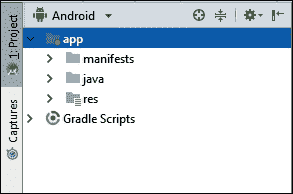
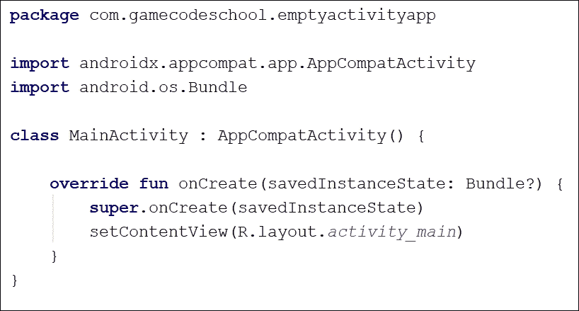
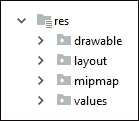
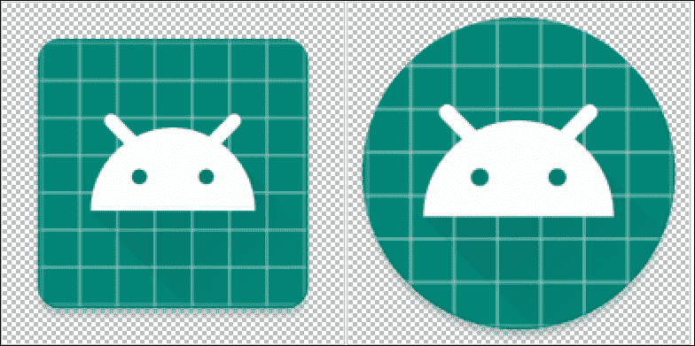
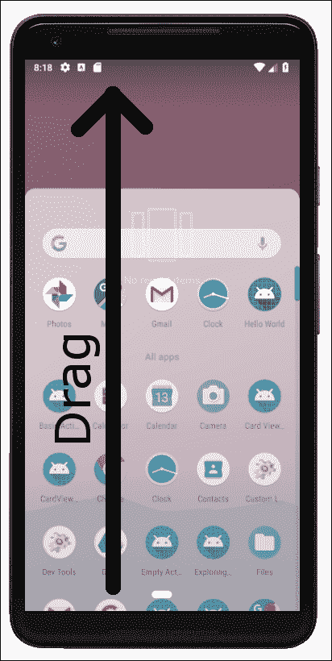
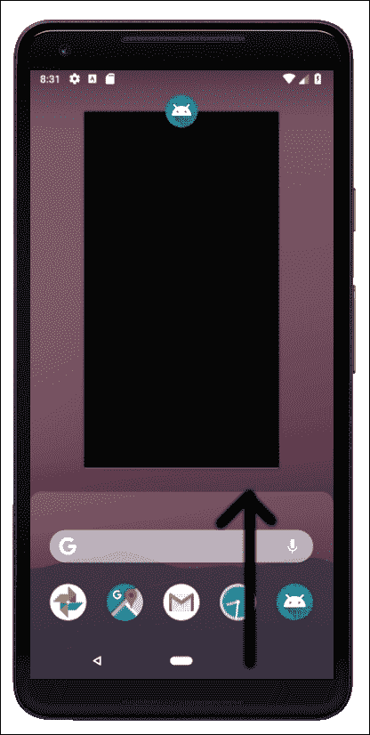

# 第三章：探索 Android Studio 和项目结构

在本章中，我们将创建并运行另外两个 Android 项目。这些练习的目的是更深入地探索 Android Studio 和 Android 项目的结构。

当我们构建应用程序准备部署时，代码和资源文件需要像在 APK 文件中那样打包起来。因此，所有布局文件和其他资源（我们很快将要看到的）都需要处于正确的结构中。

幸运的是，当我们从模板创建项目时，Android Studio 会为我们处理这些。然而，我们仍然需要知道如何找到和修改这些文件，如何添加我们自己的文件，有时还需要删除 Android Studio 创建的文件，以及资源文件如何相互关联 - 有时是彼此之间，有时是与 Kotlin 代码（即自动生成的 Kotlin 代码以及我们自己的代码）之间。

除了了解我们项目的组成，确保我们充分利用模拟器也将是有益的。

### 提示

模拟器在您希望确保您的应用程序在您未拥有的硬件上运行时特别有用。此外，了解一些最新功能（正如我们将在本书中了解到的）通常需要最新的手机，模拟器是一种经济有效的方式，可以让您在不购买最新手机的情况下跟随所有迷你应用程序。

在本章中，我们将执行以下操作：

+   探索**空活动**项目模板的文件和文件夹结构。

+   查看**空活动**和**基本活动**模板之间的区别。

+   了解如何充分利用模拟器。

本章将使我们能够在下一章中构建和部署多个不同的布局。

# Android Studio 快速导览

要开始，请查看 Android Studio 的这个带注释的图解。我们将重新熟悉我们已经看过的部分，并了解我们尚未讨论的部分：


正式指出并命名 Android Studio**用户界面**（**UI**）的各个部分将是有益的，这样我就可以按名称引用它们，而不是一直描述它们的位置并展示截图。因此，让我们从**1**开始逐个介绍它们：

1.  这是**项目**窗口，也是本章的主要焦点。它使我们能够探索项目的文件夹、代码和资源，并且也被称为项目资源管理器窗口。在这里双击一个文件以打开文件并在图中的区域**3**添加一个新标签。这里的文件和文件夹结构与最终打包到完成的 APK 文件中的结构非常相似。

### 提示

正如我们将看到的，虽然 Android 项目的文件夹结构保持不变，但文件、文件名和文件内容差异很大。因此，在本章中，我们将探索两个项目，然后随着我们在本书中的进展，再看更多的项目。

1.  这是**编辑器**窗口。正如我们已经看到的，**编辑器**窗口会根据我们正在编辑的内容而呈现出不同的形式。如果我们正在编辑 Kotlin，那么我们可以看到我们的代码被整齐地格式化并准备好进行编辑；如果我们正在设计 UI，则它会为我们提供可视化编辑视图或文本/XML 代码视图。您还可以在此窗口中查看和编辑图形和其他文件。

1.  这些标签允许我们在项目中不同的文件之间切换。**编辑器**窗口将显示我们在这里选择的文件。我们可以通过在**项目**窗口中双击文件来在此部分添加另一个标签。

1.  这使我们能够在当前正在编辑的文件的**设计**和**文本**（代码）视图之间切换。

1.  这个窗口根据图表第六部分中选择的选项而有所不同。通常，在本书中，我们会在**构建**窗口和**Logcat**窗口之间切换，以查看我们的项目是否已经编译和启动，以及调试输出和应用程序的任何错误或崩溃报告。

1.  这个 UI 区域用于在第五部分描述的不同显示之间进行切换。

### 注意

在 Android Studio 中有更多的选项卡，但在本书的上下文中我们不需要它们。

现在我们知道如何明确地引用 UI 的各个部分，让我们把注意力转向**项目**/**项目资源管理器**窗口。

# 项目资源管理器和项目解剖

当我们创建一个新的 Android 项目时，我们通常会使用项目模板，就像我们在第一章中所做的那样，*开始使用 Android 和 Kotlin*。我们使用的模板决定了 Android Studio 将生成的文件的精确选择和内容。虽然所有项目之间存在很大的相似之处值得注意，但了解差异也有帮助。让我们构建两个不同的模板项目，并检查文件、它们的内容以及通过代码（XML 和 Kotlin）如何链接在一起。

## 空活动项目

最简单的项目类型是自动生成 UI 的**空活动**项目。在这里，UI 是空的，但可以添加内容。也可以生成一个完全没有 UI 的项目。当我们创建一个项目时，即使 UI 为空，Android Studio 也会自动生成 Kotlin 代码来显示 UI。因此，当我们添加内容时，它已经准备好显示。

让我们创建一个**空活动**项目。这几乎与我们在第一章中所做的过程相同，*开始使用 Android 和 Kotlin*，但有一个我会指出的细微差别：

1.  在 Android Studio 中，选择**文件** | **新建** | **新项目…**。

1.  在**选择您的项目**屏幕上，选择**空活动**模板，然后点击**下一步**。

1.  将**名称**字段更改为`空活动应用`。

1.  选择与上一个项目相同的包名称和保存位置。

1.  确保选择**Kotlin**作为语言。

1.  勾选**使用 AndroidX 构件**复选框，就像我们之前做的那样。

1.  其余设置可以保留为默认设置，所以只需点击**下一步**。

Android Studio 将生成所有代码和其他项目资源。现在我们可以看到已生成的内容，并将其与项目资源管理器窗口中的预期内容进行比较。

如果模拟器尚未运行，请通过选择**工具** | **AVD 管理器**来启动它，然后在**Android 虚拟设备**窗口中启动您的模拟器。通过在快速启动栏中点击播放按钮在模拟器上运行应用程序：


看看这个应用程序，注意它与第一个项目有些不同。它是空的；顶部没有菜单，底部没有浮动按钮。但是，它仍然有**Hello World!**文本：

### 注意

不要担心参考第一个项目；我们很快就会再建立一个类似的项目。


现在我们有了一个全新的**空活动应用**项目，让我们探索 Android Studio 为我们生成的文件和文件夹。

## 探索空活动项目

现在，是时候深入了解我们应用程序的文件和文件夹了。这将节省我们很多时间和困惑，以后在书中。请注意，无需记住所有这些文件的位置，甚至更不需要理解文件中的代码。事实上，XML 代码的部分内容在书的最后仍然是个谜，但这不会阻止您设计、编码和发布令人惊叹的应用程序。

创建项目后，请查看项目资源管理器窗口：


注意前面截图中指示的两个箭头。你可能已经猜到，这些箭头允许我们展开`app`和`Gradle Scripts`文件夹。

### 注意

在本书的背景下，我们不需要探索`Gradle Scripts`文件夹。Gradle 是 Android Studio 的重要组成部分，但其作用是隐藏用户不需要了解的复杂过程，例如添加资源文件，编译和构建项目。因此，我们不需要深入研究这一点。然而，如果您决定将 Android 提升到下一个水平，那么深入了解 Gradle 及其与 Android Studio 的关系是值得投资时间的。

我们将更详细地探索`app`文件夹。单击`app`文件夹旁边的箭头以展开其内容，我们将开始探索。第一级内容显示在以下截图中：



我们已经揭示了另外三个文件夹：`manifests`、`java`和`res`。让我们从顶部开始仔细查看这三个文件夹。

### 注意

我们将把我们的 Kotlin 代码放在`java`文件夹中。此外，自从 Android Studio 3.3 版本发布以来，还有一个名为`generatedjava`的文件夹，但我们不需要探索它。

### manifests 文件夹

`manifests`文件夹里面只有一个文件。展开`manifests`文件夹，双击`AndroidManifest.xml`文件。注意文件已在编辑窗口中打开，并添加了一个选项卡，以便我们可以轻松地在此文件和其他文件之间切换。以下截图显示了新添加的选项卡，以及`manifests`文件夹中`AndroidManifest.xml`文件中包含的 XML 代码：


我们不需要理解文件中的所有内容，但值得指出的是，我们将偶尔在这里进行修改，例如，当我们需要请求用户许可以访问其设备的某些功能时，例如消息应用或图像文件夹。当我们想要为游戏等全屏应用进行沉浸式体验时，我们也会编辑此文件。

注意文件的结构与我们在上一章中看到的布局文件的结构非常相似。例如，有明确定义的部分，以`<section name`开头，以`</section name>`结尾。这样的真实示例包括`<application`和`</application>`，以及`<activity`和`</activity>`。

事实上，除了第一行之外，整个文件内容都包含在`<manifest`和`</manifest>`中。

就像我们将计算的括号输入计算器一样，这些开放和关闭部分必须匹配，否则文件将在我们的项目中引起错误。Android Studio 会在行前缩进（即放置制表符），以使结构中的各个部分及其深度更清晰。

这段代码的一些特定部分值得注意，所以我将指出其中的一些行。

以下行告诉 Android，我们希望在他们的应用抽屉/主屏幕中向用户显示的图标，并且用户可以使用它来启动应用，它包含在`mipmap`文件夹中，名为`ic_launcher`：

```kt
android:icon="@mipmap/ic_launcher"
```

随着我们继续探索，我们将自己验证这一点。

下一行有两个值得讨论的方面。首先，它表示我们给我们的应用的名称；其次，这个名称作为一个**字符串**包含在`app_name`标签中：

```kt
android:label="@string/app_name"
```

### 提示

在编程中，包括 Kotlin 和 XML，字符串可以是任何字母数字值。我们将在整本书中学习更多关于字符串的知识，从第七章开始。

因此，我们可以猜测`app_name`标签的字母数字值是`Empty Activity App`，因为这是我们创建应用程序时的名称。

这可能听起来很不寻常，但我们很快就会看到这个文件以及它的标签。在以后的项目中，我们还会为其添加更多的标签和值。我们也会明白为什么我们以这种看似复杂的方式向我们的应用程序添加文本的原因。

我们可以讨论`AndroidManifest.xml`文件中的每一行，但我们不需要这样做。让我们看看另外两行，因为它们是相关的。下一行指示了我们的 Activity 的名称，这是在创建项目时自动生成的。我已经突出显示了 Activity 名称，以使其更加突出：

```kt
<activity android:name=".MainActivity">
```

出现在`<activity`和`</activity>`标签内的下一行表示它是`activity`文件的属性。这告诉我们，这个 Activity 是在应用程序启动时应该运行的 Activity；它是`LAUNCHER`。

```kt
<category android:name="android.intent.category.LAUNCHER" />
```

这意味着我们的应用程序可以有多个 Activity。很多时候，如果你的应用程序有多个屏幕，比如主屏幕或设置屏幕，这些屏幕是由多个 Activity 类的实例构建的。

### 注意

在 XML 中，比如`AndroidManifest`文件，`activity`是小写的；但在 Kotlin 中，`Activity`类的`A`是大写的。这只是一种约定，不需要担心。

正如你刚刚看到的，XML 中的`activity`具有一个`name`属性，其值指向 Kotlin `Activity`的一个实例。

现在让我们深入`java`文件夹。

### java 文件夹

在这里，我们将找到所有的 Kotlin 代码。起初，这只包括一个文件，但随着我们的项目进一步发展，我们会添加更多文件。展开`java`文件夹，你会发现另外三个文件夹，如下截图所示：


对于本书，我们只需要这三个文件夹中的一个；也就是顶层文件夹。这些文件夹的名称由包名（在创建应用程序时选择）和应用程序名称组成，以小写形式呈现，没有空格（这也是在创建应用程序时选择的）。

### 提示

有多个同名文件夹的原因是由于自动化测试，这超出了本书的范围。因此，你可以安全地忽略以`(androidTest)`和`(test)`结尾的文件夹。

我们在本书中感兴趣的唯一文件夹是顶层文件夹，对于我的屏幕上的这个应用程序来说，它是`com.gamecodeschool.emptyactivityapp`。根据你选择的包名和我们当前正在工作的应用程序的名称，文件夹的名称会发生变化，但我们始终需要访问并添加或编辑其内容的是顶层文件夹。

现在展开`com.gamecodeschool.emptyactivityapp`（或者你的应用程序名称）文件夹以查看其内容。在下面的截图中，你可以看到该文件夹只有一个文件：


这是`MainActivity.kt`文件，尽管项目窗口中没有显示文件扩展名，但在编辑器窗口上方的标签中是有的。事实上，本书中`java/packagename.appname`文件夹中的所有文件都将有`.kt`扩展名。

如果你双击`MainActivity.kt`文件，它会在编辑器窗口中打开，尽管我们也可以直接点击编辑器窗口上方的`MainActivity.kt`标签。随着我们向项目中添加更多的 Kotlin 文件，知道它们的存放位置将会很有用。

检查`MainActivity.kt`文件，你会发现它是第一个项目中我们使用的 Kotlin 文件的简化版本。它是一样的，只是在`onCreate`函数中有更少的函数和更少的代码。函数缺失是因为 UI 更简单，不需要它们；因此，Android Studio 没有生成它们。

参考一下以下截图中`MainActivity.kt`文件的内容：



文件仍然有`onCreate`函数，在应用程序运行时运行，但代码更少，`onCreate`是唯一的函数。在`onCreate`函数的最后一行代码上看一下，我们将在继续探索`res`文件夹之前讨论这行代码：

```kt
setContentView(R.layout.activity_main)
```

代码调用了一个名为`setContentView`的函数，并将一些数据传递给`setContentView`，以便`setContentView`函数中的代码可以使用。传递给`setContentView`的数据是`R.layout.activity.main`。

目前，我只是提一下`setContentView`函数是由 Android API 提供的，它是准备并向用户显示 UI 的函数。那么，`R.layout.activity_main`到底是什么？

让我们通过探索`res`文件夹来找出答案。

### res 文件夹

`res`文件夹是所有资源的存放地。左键单击展开`res`文件夹，我们将检查里面的内容。这是`res`文件夹内顶层文件夹的截图：



让我们从列表的顶部开始；也就是说，从`drawable`文件夹开始。

### res/drawable 文件夹

名称有点透露了一些，但`drawable`文件夹中不仅仅包含图形。随着我们在本书中的进展，我们确实会向这个文件夹中添加图形；但是，目前它只包含两个文件。

这些文件是`ic_launcher_foreground`和`ic_launcher_background`。我们不会检查这些文件，因为我们永远不需要修改它们，但我会快速提一下它们是什么。

如果你打开这些文件，你会发现它们非常长且技术性很强。它们包括坐标、颜色等列表。它们被称为**图形蒙版**。

它们被 Android 用来适应或蒙版其他图形；在这种情况下，是应用程序的启动器图标。这些文件是给 Android 的指令，告诉它如何调整应用程序的启动器图标。

这个系统是为了让不同的设备制造商可以创建适合自己 Android 设备的蒙版。这些蒙版默认位于`drawable`文件夹中（`ic_launcher_foreground`和`ic_launcher_background`），是默认的自适应蒙版，可以为启动器图标添加视觉上令人愉悦的阴影和深度。

### 提示

如果自适应图标的概念对你有吸引力，那么你可以参考 Android 开发者网站上关于自适应图标的完整且非常直观的解释。

现在我们已经对`drawable`有了足够的了解，让我们继续学习`layout`。

### res/layout 文件夹

展开`layout`文件夹，你会看到我们在上一章中编辑过的熟悉的布局文件。这次内容更少，因为我们生成了一个空活动项目。它并不完全为空，因为它仍然包含一个`ConstraintLayout`布局，包裹着一个显示`Hello World!`的`TextView`小部件。

确保查看内容-你会发现它看起来如你所料，但这里感兴趣的不是内容。仔细看一下文件的名称（不包括 XML 文件扩展名）：`activity_main`。

现在回想一下`MainActivity.kt`文件中的 Kotlin 代码。以下是设置 UI 的代码行；我已经突出显示了代码的一部分：

```kt
setContentView(R.layout.activity_main);
```

`R.layout.activity_main`代码确实是对`res`/`layout`文件夹中的`activity_main`文件的引用。这是我们的 Kotlin 代码和 XML 布局/设计之间的连接。

在第一个项目中有一个不同之处；在第一个项目的`layout`文件夹中，有一个额外的文件。在本章后面，我们将使用相同的模板（基本活动）构建另一个项目，以理解为什么。

在这之前，让我们探索最后两个文件夹及其所有子文件夹，从列表中的下一个`mipmap`开始。

### res/mipmap 文件夹

`mipmap`文件夹很简单 - *相当*简单。展开文件夹，查看其内容，如下截图所示：


在这里，你可以看到两个子文件夹；它们是`ic_launcher`和`ic_launcher_round`。`ic_launcher`的内容包括我们在设备的应用抽屉/主屏幕中看到的常规启动器图标的图形，而`ic_launcher_round`则包含使用圆形图标的设备的图形，而不是方形图标。双击每个文件夹中的一个`.png`文件，我在这个截图中将它们并排放置，以帮助我们的讨论：



你可能也想知道为什么每个文件夹中都有五个`ic_launcher….png`文件。原因是为不同尺寸和分辨率的屏幕提供合适比例的图标是一个良好的做法。使用`hdpi`、`mdpi`、`xhdpi`、`xxhdpi`和`xxxhdpi`资格的图像允许不同的 Android 设备选择最适合用户的图标。

### 注意

`dpi`代表**每英寸点数**，`h`、`m`、`xh`、`xxh`和`xxxh`前缀代表高、中、超高、超超高等。这些被称为**限定符**，随着你在本书中的学习，你会发现 Android 有很多限定符，这些限定符帮助我们构建适合用户选择的各种不同设备的应用程序。

`mipmap`文件夹中的最后一个谜团是每个子文件夹中还有一个 XML 文件。打开其中一个，你会看到它们引用了我们在`drawable`文件夹中看到的`ic_launcher_foreground`和`ic_launcher_background`文件。这告诉 Android 设备从哪里获取自适应图标的详细信息。这些文件不是必需的，但它们使图标看起来更好，并增加了外观的灵活性。

我们还有一个文件夹及其所有文件要探索，然后我们将最终理解 Android 应用程序的结构。

### res/values 文件夹

打开`res`/`values`文件夹，可以看到三个文件，我们将依次简要讨论。所有这些文件相互关联，并引用了我们已经看过的其他文件。

为了完整起见，这里是`res`/`values`文件夹中三个文件的截图：


理解的关键不在于记住连接，当然也不在于试图记住或理解文件中的代码，而是要欣赏到目前为止我们所看到的所有文件和代码之间相互关联的本质。

让我们逐个查看文件的内容。

#### colors.xml 文件

接下来，看一下`colors.xml`文件的内容：

```kt
<?xml version="1.0" encoding="utf-8"?>
<resources>
    <color name="colorPrimary">#008577</color>
    <color name="colorPrimaryDark">#00574B</color>
    <color name="colorAccent">#D81B60</color>
</resources>
```

请注意，起始和结束标签采用了我们从 XML 文件中期望的通常模式。作为资源的子元素，有三对`<color> … </color>`标签。

每个`color`标签中都包含一个`name`属性和一些由数字和字母组成的奇怪代码。`name`属性是颜色的名称。我们将在接下来的另一个文件中看到，这个文件中的各种名称是从另一个文件中引用的。

代码是定义实际颜色的内容。因此，当引用名称时，屏幕上显示的是相关代码定义的颜色。

### 注意

该代码被称为十六进制代码，因为在代码的每个位置上，可以使用值`0`到`9`和字母`a`到`f`，共 16 个可能的值。如果您想了解更多关于十六进制`颜色`的信息，请访问[`www.color-hex.com/color-wheel/`](http://www.color-hex.com/color-wheel/)。如果您对十六进制（基数 16）、二进制（基数 2）和其他数字基数感到好奇，请查看这篇文章，该文章解释了它们，并讨论了为什么人类通常使用十进制：[`betterexplained.com/articles/numbers-and-bases/`](https://betterexplained.com/articles/numbers-and-bases/)。

我们将在稍后看到这些名称是如何被引用的。

#### strings.xml 文件

大多数现代应用程序都是为尽可能广泛的受众而制作的。此外，如果应用程序规模或复杂度较大，则软件公司中的角色通常被划分为许多不同的团队。例如，为 Android 应用程序编写 Kotlin 代码的人很可能与设计 UI 布局的人几乎没有关系。

通过将应用程序的内容与应用程序的编程分开，可以更容易地随时进行更改，并且还可以为多种不同的语言创建内容，而无需为每种语言修改 Kotlin 代码。

看一下`strings.xml`文件的以下内容：

```kt
<resources>
    <string name="app_name">Empty Activity App</string>
</resources>
```

您可以看到，在现在熟悉的`<resources>…</resources>`标签内，有一个`<string>…</string>`标签。在`string`标签内，有一个名为`name`的属性，其值为`app_name`，然后是`Empty Activity App`的进一步值。

让我们再看一下我们之前在清单文件夹部分探讨过的`AndroidManifest.xml`文件中的一行。所讨论的行显示在以下代码中，但如果您想要查看完整的上下文中的行，请参考 Android Studio 中的文件本身：

```kt
android:label="@string/app_name"
```

`android:label`属性被赋予了`@string/app_name`的值。在 Android 中，`@string`指的是`strings.xml`文件中的所有字符串。在这个特定的应用程序中，具有`app_name`标签的`string`属性具有`Empty Activity App`的值。

因此，先前在`AndroidManifest.xml`文件中显示的代码行在应用程序运行时对屏幕产生以下影响：


虽然这个系统起初可能看起来很复杂，但在实践中，它将设计和内容与编码分离开来，这样做非常高效。如果设计人员想要更改应用程序的名称，他们只需编辑`strings.xml`文件。无需与 Kotlin 程序员互动，而且，如果应用程序中的所有文本都以字符串资源的形式提供，那么在项目进行过程中所有这些文本都可以轻松地进行更改和调整。

Android 通过允许开发人员为每种语言和区域设置使用不同的文件来存储字符串资源，进一步提高了灵活性。这意味着开发人员可以使用完全相同的 Kotlin 代码来满足整个星球上的快乐用户。Kotlin 程序员只需引用字符串资源的`name`属性，而不是将文本本身硬编码，然后其他部门可以设计文本内容并处理诸如翻译之类的任务。我们将在第十八章*本地化*中使应用程序支持多种语言。

### 注意

有可能直接在 Kotlin 代码中硬编码实际文本，而不是使用字符串资源，大多数情况下，我们会这样做，以便轻松演示一些 Kotlin 代码，而不必陷入编辑或添加到`strings.xml`文件中。

我们已经了解了关于`strings.xml`的足够信息，可以继续探索空项目模板的最终文件。

#### styles.xml 文件

在这里，您可以看到这个项目模板的互连拼图的各个部分最终汇聚在一起。研究`styles.xml`文件中的代码，然后我们可以讨论它：

```kt
<resources>
<!-- Base application theme. -->
<style name="AppTheme" 
parent="Theme.AppCompat.Light.DarkActionBar">
   <!-- Customize your theme here. -->
   <item name="colorPrimary">@color/colorPrimary</item>
   <item name="colorPrimaryDark">@color/colorPrimaryDark</item>
   <item name="colorAccent">@color/colorAccent</item>
</style>
</resources>
```

这是另一个资源文件，但它是在引用我们之前看到的`colors.xml`文件。请注意，这里有一个`style`标签，它包含多个`item`标签；每个`item`标签都有一个名称，比如`colorPrimary`，`colorPrimaryDark`或`colorAccent`。然后，每个名称都被赋予一个值，比如`@color/colorPrimary`。

你可能想知道发生了什么；`@color`指的是`colors.xml`文件，`colorPrimary`，`colorPrimaryDark`和`colorAccent`指的是在该文件中用十六进制值定义的实际颜色。但为什么要创建颜色并给它们命名，然后在另一个文件中定义`item`实例并将这些颜色分配给`item`实例呢？为什么不直接将十六进制颜色值分配给每个`item`呢？

看一下代码块的顶部，了解这种看似不必要的复杂性背后的原因。我再次展示了相关的代码行，这样我们可以更容易地讨论它们：

```kt
<style name="AppTheme" 
parent="Theme.AppCompat.Light.DarkActionBar">
```

正在进行的是已经定义了项目，并且这些项目包含在`style`元素中。正如你所看到的，样式被称为`AppTheme`。此外，该样式有一个名为`Theme.AppCompat.Light.DarkActionBar`的父级。

该系统允许设计师选择一系列颜色，然后在`colors.xml`文件中定义它们。然后他们可以进一步构建使用这些颜色的不同组合的样式 - 通常每个应用程序会有多个样式。样式还可以与主题（`parent = "..."`）相关联。这个父主题可以是完全由应用设计师的样式和颜色设计的，也可以是 Android 的默认主题之一，比如`Theme.AppCompat.Light.DarkActionBar`。

UI 设计师可以简单地在`AndroidManifest.xml`文件中引用样式，就像这一行：

```kt
android:theme="@style/AppTheme"
```

UI 设计师可以愉快地调整颜色和它们的使用方式（项目），而不会干扰 Kotlin 代码。这也允许为世界不同地区创建不同的样式，而不需要对实际布局文件（在本例中为`activity_main.xml`）进行任何更改。

例如，在西方文化中，绿色可以代表自然和正确性等主题；在许多中东国家，绿色代表生育，是与伊斯兰教相关的颜色。虽然你可能会在这两个地区都使用绿色，但你的应用将被认为是非常不同的。

如果你在印度尼西亚推出你的应用，你会发现绿色在许多（尽管不是所有）印尼人中是受到文化鄙视的。接下来，如果你在中国推出，你会发现绿色可能会带有与不忠的配偶有关的负面含义。这是典型程序员永远不会学会应对的困难。而且，幸运的是，由于我们可以在 Android Studio 中分配责任的方式，他们不需要学会。

因此，颜色、样式和主题是非常专业的主题。虽然我们不会深入探讨比绿色更深入的内容，但希望你能看到一个分离了编程、布局、颜色和文本内容责任的系统的好处。

### 提示

我认为在这一点上值得一提的是，图片也可以根据不同的区域划分，以便在同一个应用程序中，不同地区的用户看到不同的图片。而且，如果你在想，是的，这将意味着为每个区域提供不同的分辨率（比如`hdpi`和`xhdpi`等）。

值得一提的是，完全有可能制作出一款受到成千上万甚至数百万用户喜爱的应用，而不需要为每个地区单独定制。然而，即使我们不打算雇佣设计师、翻译人员和文化专家，我们仍然必须在这个旨在使他们能够工作的系统中工作，这就是为什么我们要深入探讨。

在这个阶段，我们已经很好地掌握了 Android 项目中的内容以及它们之间的联系。现在让我们构建另一个应用程序，以查看不同应用程序模板对 Android Studio 生成的基础文件的影响。

# 基本活动项目

下一个最简单的项目类型是自动生成 UI 的基本活动项目。这是我们在第一章中创建的相同类型的项目，*开始使用 Android 和 Kotlin*。现在可以打开该项目，但建议生成一个新项目，以便我们可以在没有任何修改和添加干扰讨论的情况下进行检查。

让我们创建一个基本活动项目，如下所示：

1.  在 Android Studio 中，选择**文件** | **新建** | **新项目…**。

1.  在**选择您的项目**屏幕上，选择**基本活动**模板，然后点击**下一步**。

1.  将**名称**字段更改为`基本活动应用`。

1.  选择与上一个项目相同的包名称，并将位置保存为之前的项目。

1.  确保选择**Kotlin**作为语言。

1.  像之前一样，勾选**使用 AndroidX 构件**复选框。

1.  其余设置可以保持默认，所以只需点击**下一步**。

现在我们可以深入研究文件。我们不会像我们在空活动项目中那样详细地查看所有内容；我们只会查看差异和额外的部分。

## 探索基本活动项目

让我们首先比较 Kotlin 代码。查看代码编辑器中的`MainActivity.kt`选项卡。它们都包含一个名为`MainActivity`的类。不同之处在于函数的数量和`onCreate`函数的内容。

如前所述，基本活动项目比空活动项目更复杂。

### 提示

您可以打开尽可能多的 Android Studio 实例。如果要并排比较项目，请选择**文件** | **打开**，然后选择项目，然后在提示时选择**新建窗口**，以打开项目而不关闭已经打开的任何项目。

第一个不同之处在于`onCreate`函数中有一些额外的代码。

### MainActivity.kt 文件

我在第二章中非常简要地提到了存在于 Kotlin 代码和 XML 代码中的相互关系。让我们浏览资源文件，并指出这段 Kotlin 代码指向的 XML 文件。

这是`onCreate`函数中相关的 Kotlin 代码；我稍微重新格式化了它，以便在书中更易读：

```kt
setSupportActionBar(toolbar)

fab.setOnClickListener { view ->
   Snackbar.make(view, "Replace with your own action",
               Snackbar.LENGTH_LONG)
               .setAction("Action", null).show()
}
```

完全理解这段代码需要更多的章节，但只需指出这段代码使用资源文件的地方只需要一会儿，然后我们就会更加了解构成我们项目的组件。

与空活动项目相比，该代码引用了两个更多的资源。第一个是`工具栏`，第二个是`浮动操作按钮`，两者都引用了我们将在下一步中看到的 XML 文件。

如果您在项目窗口中打开`res`/`layout`文件夹，您会发现它们看起来与空活动项目中的情况有些不同：


现在有两个自动生成的文件。我们将探索`content_main.xml`文件，并很快理解为什么需要它。

### activity_main.xml 文件

现在，打开`activity_main.xml`文件，您会看到一些元素代表`工具栏`和`浮动操作按钮`。通过引用这些元素，Kotlin 代码正在设置工具栏和浮动操作按钮以供使用。正如我们所期望的那样，XML 代码描述了它们的外观。

这是工具栏的 XML 代码：

```kt
<androidx.appcompat.widget.Toolbar
   android:id="@+id/toolbar"
   android:layout_width="match_parent"
   android:layout_height="?attr/actionBarSize"
   android:background="?attr/colorPrimary"
   app:popupTheme="@style/AppTheme.PopupOverlay" />
```

请注意，它引用了`Toolbar`、颜色和样式，以及其他一些内容。它是以`android:id…`开头的那一行，它声明了一个类型为`Toolbar`的小部件及其`@+id/toolbar`值，这使得它可以通过 Kotlin 代码中的`toolbar`实例名称访问。

为了清晰起见，这是实际工作中应用中的工具栏：


这是浮动操作按钮的 XML 代码。我稍微重新格式化了代码的第一行为两行：

```kt
<com.google.android.material.floatingactionbutton.
         FloatingActionButton

   android:id="@+id/fab"
   android:layout_width="wrap_content"
   android:layout_height="wrap_content"
   android:layout_gravity="bottom|end"
   android:layout_margin="@dimen/fab_margin"
   app:srcCompat="@android:drawable/ic_dialog_email" />
```

请注意，它具有`fab`的`id`属性。通过这个`id`属性，我们可以在我们的 Kotlin 代码中访问浮动操作按钮。

现在，我们的 Kotlin 代码中的`fab`可以直接控制浮动操作按钮及其所有属性。在第十三章*让 Android 小部件活起来*中，我们将详细学习如何做到这一点。

这是实际应用中的浮动操作按钮：


很明显，我还没有详细解释代码；在这个阶段没有意义。相反，要注意这些相互关联，如下所示：

+   XML 文件可以引用其他 XML 文件。

+   Kotlin 可以引用 XML 文件（以及，正如我们将很快看到的，其他 Kotlin 文件）。

+   在 Kotlin 中，我们可以通过其`id`属性控制 XML 文件中的特定部分。

我们已经从这个文件中看到足够了；让我们继续并深入了解剩下的文件。

### MainActivity.kt 中的额外函数

那么，这些函数是做什么的，它们何时被调用，以及谁确切地调用它们呢？

下一个不同之处是这个额外的函数，如下所示：

```kt
override fun onCreateOptionsMenu(menu: Menu): Boolean {
  // Inflate the menu; this adds items to 
  // the action bar if it is present.
  menuInflater.inflate(R.menu.menu_main, menu)
  return true
}
```

这段代码准备（膨胀）了在`menu_main.xml`文件中定义的菜单。和`onCreate`一样，这个函数也被重写，并且直接由操作系统调用。

然后还有另一个函数，如下所示：

```kt
override fun onOptionsItemSelected(item: MenuItem): Boolean {
  // Handle action bar item clicks here. The action bar will
  // automatically handle clicks on the Home/Up button, so long
  // as you specify a parent activity in AndroidManifest.xml.
  return when (item.itemId) {
        R.id.action_settings -> true
        else -> super.onOptionsItemSelected(item)
  }
}
```

这个函数也被重写，并且直接由操作系统调用。它处理用户选择菜单中的项目（或选项）时发生的情况。目前，它只处理一个选项，即设置选项，目前不执行任何操作。

前面的代码确定了是否单击了设置菜单选项；如果是，那么`return`代码执行，控制返回到被用户单击**设置**菜单选项中断之前执行的应用程序的任何部分。我们将在第八章*Kotlin 决策和循环*中更多地了解 Kotlin 的`when`关键字。

我们现在几乎知道足够了；不要担心记住所有这些连接。我们将回到每个连接，深入调查，并巩固我们对每个连接的理解。

那么，为什么我们需要`res`/`layout`文件夹中的第二个文件呢？

### content_main.xml 文件

`MainActivity.kt`文件在`R.layout.activity_main`上调用了`setContentView`。然后，`activity_main`有这行代码被突出显示：

```kt
…
</com.google.android.material.appbar.AppBarLayout>

<include layout="@layout/content_main" />

<com.google.android.material.floatingactionbutton
  .FloatingActionButton
…
```

代码的高亮行确实`include`了`content_main`文件。因此，在应用栏添加到布局后，执行分支到`content_main`，在那里，所有的 XML 代码都转换为 UI；然后，执行返回到`activity_main`，并且浮动操作栏添加到布局中。在第五章*使用 CardView 和 ScrollView 创建美丽的布局*中，我们将使用`include`，当我们构建一些整洁的滚动`CardView`布局并将定义`CardView`的代码与`CardView`的实际内容分开时。

# 探索 Android 模拟器

随着我们的进展，熟悉如何使用 Android 模拟器确实有所帮助。如果您还没有使用过最新版本的 Android，甚至执行简单任务（如查看所有应用程序）的方式可能与您当前的设备工作方式不同。此外，我们还想知道如何使用所有模拟器附带的额外控件。

## 模拟器控制面板

您可能注意到了当您运行模拟器时，旁边会出现一个迷你控制面板。让我们看一下一些最有用的控件。看一下这个模拟器控制面板的截图。我已经做了标注以帮助讨论：


我只会提到一些更明显的控件，并在必要时深入一些：

1.  这些是窗口控件。它们最小化或关闭模拟器窗口。

1.  从上到下，第一个按钮用于关闭模拟器，模拟关闭实际设备的电源。接下来的两个图标分别是调高和调低音量。

1.  这两个按钮允许您将模拟器向左和向右旋转。这意味着您可以测试您的应用在所有方向上的外观，以及应用在运行时如何处理方向变化。这两个按钮下面的图标分别是截图和放大。这是模拟器在水平旋转后的样子：

1.  这些图标模拟返回按钮、主页按钮和查看运行中应用程序按钮。尝试一下这些按钮-我们有时需要使用它们，包括在第六章中，*Android 生命周期*。

1.  按照标注图像中标有**5**的按钮，启动高级设置菜单，您可以与传感器、GPS、电池和指纹识别器等进行交互。如果您感兴趣，可以尝试一些这些设置：

让我们玩一下模拟器本身。

## 使用模拟器作为真实设备

模拟器可以模拟真实手机的每个功能，因此可以单独撰写一本关于它的书。如果您想编写用户喜爱的应用程序，那么了解各种 Android 设备是值得花时间去做的。我只想在这里指出一些最基本的功能，因为没有这些基本交互，将很难跟上本书的内容。此外，如果您有一部旧的 Android 设备，那么一些基本的操作（如访问应用抽屉）已经发生了变化，您可能会感到有些困惑。

### 访问应用抽屉

将鼠标光标放在主屏幕底部并向上拖动，以访问应用抽屉（包括所有应用程序）；以下截图显示了这个动作进行到一半的情况：



现在您可以运行模拟器上安装的任何应用。请注意，当您通过 Android Studio 运行您的应用程序之一时，它将保留在模拟器上安装，并且可以从应用抽屉中运行。但是，您在 Android Studio 中对应用程序所做的每一次更改都需要您再次运行或安装应用程序，方法是单击 Android Studio 快速启动栏上的播放按钮，就像我们一直在做的那样。

### 查看活动应用程序和在应用程序之间切换

要查看活动应用程序，您可以使用模拟器控制面板，也就是截图上标有数字**4**的方块。要使用手机屏幕访问相同的选项（就像您在真实设备上所做的那样），向上滑动，就像访问应用抽屉一样，但只需滑动屏幕长度的四分之一，如下截图所示：



现在您可以通过最近的应用程序向左或向右滑动，向上滑动应用程序以关闭它，或者点击返回按钮返回到您在查看此选项之前所做的事情。请尝试一下，因为我们在本书中经常会使用这些基本功能。

# 摘要

请记住，本章的目标是熟悉 Android 系统和 Android 项目的结构。Android 项目是 Kotlin 和大量资源文件的复杂交织。资源文件可以包含 XML 来描述我们的布局、文本内容、样式和颜色，以及图像。资源可以针对世界各地的不同语言和地区进行生产。我们将在整本书中看到并使用的其他资源类型包括主题和音效。

记住不同资源文件和 Kotlin 文件相互关联的不同方式并不重要。重要的是意识到它们是相互关联的，并且能够检查各种类型的文件，并意识到它们何时依赖于另一个文件中的代码。每当我们从 Kotlin 代码创建连接到 XML 代码时，我都会再次指出连接的细节。

我们不需要额外学习 XML，而是会在接下来的 25 章中对其有一些了解。Kotlin 将是本书的重点，但我们的 Kotlin 代码将经常涉及 XML 代码，因此理解并看到一些相互关联的示例将使您更快地取得进展。

我们还探索了模拟器，以便在测试我们的应用程序时充分利用它。

在下一章中，我们将使用三种不同的 Android 布局方案构建三个自定义布局。我们还将编写一些 Kotlin 代码，以便我们可以通过点击按钮在它们之间进行切换。
