# 第四章：开始使用布局和材料设计

我们已经看到了安卓工作室的 UI 设计师，以及 Kotlin 的一些实际应用。在这个动手实践的章节中，我们将构建三个更多的布局-仍然相当简单，但比我们迄今为止所做的更进一步。

在我们开始动手之前，我们将快速介绍**材料设计**的概念。

我们将看看另一种布局类型，称为`LinearLayout`，并通过使用它来创建可用的 UI 来详细介绍它。我们将进一步使用`ConstraintLayout`，既了解约束，又设计更复杂和精确的 UI 设计。最后，我们将介绍`TableLayout`，以便在易于阅读的表格中布置数据。

我们还将编写一些 Kotlin 代码，以在一个应用程序/项目中在不同的布局之间进行切换。这是第一个将多个主题整合到一个整洁包裹中的重要应用程序。该应用程序名为“探索布局”。

在本章中，我们将涵盖以下主题：

+   材料设计

+   构建`LinearLayout`并学习何时最好使用此类型

+   构建另一个稍微更高级的`ConstraintLayout`，并了解更多关于使用约束的信息

+   构建`TableLayout`并填充数据以显示

+   将所有内容链接在一个名为“探索布局”的单个应用程序中

首先是材料设计。

# 材料设计

你可能听说过材料设计，但它究竟是什么？材料设计的目标很简单，就是实现美观的用户界面。然而，它也是为了使这些用户界面在安卓设备上保持一致。材料设计并不是一个新的想法。它直接采用了纸和笔设计中使用的设计原则，比如具有视觉上令人愉悦的装饰，如阴影和深度。

材料设计使用材料层的概念，您可以将其视为照片编辑应用程序中的图层。一套原则、规则和指南实现了一致性。必须强调材料设计完全是可选的，但也必须强调材料设计是有效的，如果您不遵循它，用户很可能不喜欢您的设计。毕竟，用户已经习惯了某种类型的 UI，而该 UI 很可能是使用材料设计原则创建的。

因此，材料设计是一个值得努力的合理标准，但在学习材料设计的细节时，我们不应该让它阻碍我们学习如何开始使用安卓。

本书将专注于完成任务，同时偶尔指出材料设计如何影响我们的做法，并指向更深入了解材料设计的进一步资源。

# 探索安卓 UI 设计

我们将看到在安卓 UI 设计中，我们学到的很多东西都是依赖上下文的。给定小部件的 x 属性如何影响其外观可能取决于小部件的 y 属性，甚至取决于另一个小部件的属性。这并不容易直接学习。最好期望通过实践逐渐取得更好和更快的结果。

例如，如果您通过将小部件拖放到设计中来玩转设计师，生成的 XML 代码将根据您使用的布局类型而有很大不同。随着我们在本章中的进行，我们将看到这一点。

这是因为不同的布局类型使用不同的方法来决定其子元素的位置。例如，我们将在下一节中探索的`LinearLayout`与我们项目中默认添加的`ConstraintLayout`的工作方式完全不同，第一章中已经介绍了*开始使用安卓和 Kotlin*。

这些信息可能起初看起来像是一个问题，甚至是一个坏主意，当然可能有点尴尬。然而，我们将开始学习的是，这种清晰的布局选项的丰富性及其各自的怪癖是一件好事，因为它们为我们提供了几乎无限的设计潜力。您几乎可以想象不可能实现的布局很少。

然而，正如所暗示的，这种几乎无限的潜力伴随着一些复杂性。开始掌握这一点的最佳方法是构建几种类型的工作示例。在本章中，我们将看到三种 - `LinearLayout`，`ConstraintLayout`和`TableLayout`。我们将看到如何使用可视化设计师的独特功能使事情变得更容易，并且我们还将对自动生成的 XML 进行一些关注，以使我们的理解更全面。

# 布局

我们已经看到了`ConstraintLayout`，但还有更多。布局是将其他 UI 元素/小部件组合在一起的构建块。布局本身可以包含其他布局。

让我们看一些在 Android 中常用的布局，因为了解不同的布局及其优缺点将使我们更加了解可以实现什么，因此将扩展我们对可能性的认识。

我们已经看到，一旦我们设计了一个布局，我们就可以在 Kotlin 代码中使用`setContentView`函数将其付诸实践。

让我们使用不同的布局类型构建三种设计，然后将`setContentView`付诸实践并在它们之间切换。

# 创建“探索布局”项目

在 Android 中最困难的事情之一不仅是找出如何做某事，而是在其他事物中找出如何做某事。这就是为什么在本书中，除了向您展示如何做一些很酷的东西之外，我们还将把许多主题链接到跨越多个主题和章节的应用程序中。**探索布局**项目是这种类型的第一个应用程序。我们将学习如何构建多种类型的布局，同时将它们全部链接在一个方便的应用程序中：

1.  在 Android Studio 中创建一个新项目。如果您已经打开了一个项目，请选择**文件** | **新建项目**。在提示时，选择**在同一窗口中打开**，因为我们不需要参考我们之前的项目。

### 提示

如果您在 Android Studio 的启动屏幕上，只需点击**开始新的 Android Studio 项目**选项即可创建一个新项目。

1.  选择**空活动**项目模板，因为我们将从头开始构建大部分 UI。点击**下一步**按钮。

1.  为项目命名为“探索布局”。

1.  其余所有设置与我们之前使用的三个项目相同。

1.  点击**完成**按钮。

查看`MainActivity.kt`文件。以下是整个代码，不包括`import…`语句：

```kt
class MainActivity : AppCompatActivity() {

    override fun onCreate(savedInstanceState: Bundle?) {
        super.onCreate(savedInstanceState)
        setContentView(R.layout.activity_main)
    }
}
```

找到`setContentView`的调用并删除整行。该行在上一个代码中显示为高亮显示。

这正是我们想要的，因为现在我们可以构建自己的布局，探索底层的 XML，并编写自己的 Kotlin 代码来显示这些布局。如果您现在运行该应用程序，您将只获得一个带有标题的空白屏幕；甚至没有“Hello World！”消息。

我们将要探索的第一种布局类型是`LinearLayout`。

# 使用 LinearLayout 构建菜单

`LinearLayout`可能是 Android 提供的最简单的布局。顾名思义，其中的所有 UI 项都是线性布局的。您只有两个选择 - 垂直和水平。通过添加以下代码行（或通过属性窗口进行编辑），您可以配置`LinearLayout`以垂直布局：

```kt
android:orientation="vertical"
```

然后（您可能已经猜到了）将`"vertical"`更改为`"horizontal"`以水平布局。

在我们可以对`LinearLayout`执行任何操作之前，我们需要将其添加到布局文件中。而且，由于我们在此项目中构建了三个布局，因此我们还需要一个新的布局文件。

## 向项目添加 LinearLayout

在项目窗口中，展开`res`文件夹。现在右键单击`layout`文件夹，然后选择**New**。注意到有一个**Layout resource file**选项，如下截图所示：


选择**Layout resource file**，然后会看到**New Resource File**对话框窗口：

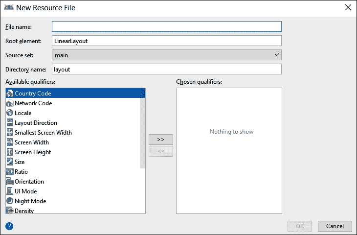

在**File name**字段中输入`main_menu`。名称是任意的，但这个布局将成为我们的“主”菜单，用于选择其他布局，所以这个名称似乎合适。

请注意，它已经选择了**LinearLayout**作为**Root** **element**选项。

单击**OK**按钮，Android Studio 将在名为`main_menu`的 XML 文件中生成一个新的`LinearLayout`，并将其放置在`layout`文件夹中，准备好构建我们的新主菜单 UI。Android Studio 还将打开带有左侧调色板和右侧属性窗口的 UI 设计器。

## 准备工作区

通过拖动和调整窗口边界的大小（就像大多数窗口化应用程序一样），调整窗口的大小，使调色板、设计和属性尽可能清晰，但不要超出必要的范围。这个小截图显示了我选择的大致窗口比例，以使设计我们的 UI 和探索 XML 尽可能清晰。截图中的细节并不重要：

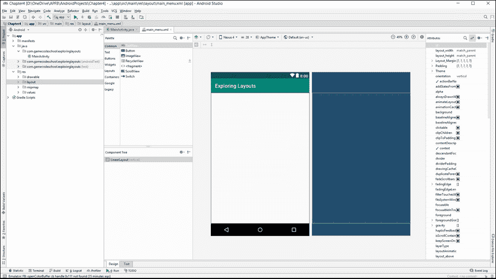

请注意，我已经尽可能地缩小了项目、调色板和属性窗口，但没有遮挡任何内容。我还关闭了屏幕底部的构建/logcat 窗口，结果是我有一个很清晰的画布来构建 UI。

## 检查生成的 XML

单击**Text**选项卡，我们将查看当前阶段形成我们设计的 XML 代码的当前状态。以下是代码，以便我们进一步讨论：

```kt
<?xml version="1.0" encoding="utf-8"?>
<LinearLayout 

 android:orientation="vertical" 
 android:layout_width="match_parent"
 android:layout_height="match_parent">

</LinearLayout>
```

我们有通常的起始和结束标签，正如我们可以预测的那样，它们是`<LinearLayout`和`</LinearLayout>`。目前还没有子元素，但有三个属性。我们知道它们是`LinearLayout`的属性，而不是子元素，因为它们出现在第一个闭合`>`之前。为了清晰起见，前面的代码中突出显示了定义这个`LinearLayout`的三个属性。

第一个属性是`android:orientation`，或者更简洁地说，我们将只是提到没有`android:`部分的属性。`orientation`属性的值是`vertical`。这意味着，当我们开始向这个布局添加项目时，它将垂直地从上到下排列它们。我们可以将值从`vertical`更改为`horizontal`，它将从左到右布局。

接下来的两个属性是`layout_width`和`layout_height`。这些属性确定了`LinearLayout`的大小。给定给这两个属性的值都是`match_parent`。布局的父级是整个可用空间。因此，通过水平和垂直匹配父级，布局将填充整个可用空间。

## 向 UI 添加一个 TextView

切换回**Design**选项卡，我们将向 UI 添加一些元素。

首先，在调色板中找到**TextView**。这可以在**Common**和**Text**类别中找到。左键单击并将**TextView**拖放到 UI 上，注意它整齐地位于`LinearLayout`的顶部。

查看**Text**选项卡上的 XML，并确认它是`LinearLayout`的子元素，并且缩进了一个制表符以清晰地表示这一点。以下是`TextView`的代码，没有周围的`LinearLayout`代码：

```kt
<TextView
   android:id="@+id/textView"
   android:layout_width="match_parent"
   android:layout_height="wrap_content"
   android:text="TextView" />
```

请注意，它有四个属性：`id`，以防我们需要从另一个 UI 元素或我们的 Kotlin 代码中引用它；`layout_width`设置为`match_parent`，这意味着`TextView`横跨整个`LinearLayout`的宽度；`layout_height`属性设置为`wrap_content`，这意味着`TextView`的高度恰好足够容纳其中的文本；最后，目前，它具有一个`text`元素，用于确定它将显示的实际文本，目前仅设置为`TextView`。

切换回设计选项卡，我们将进行一些更改。

我们希望这段文本成为此屏幕的标题文本，即主菜单屏幕。在属性窗口中，单击搜索图标，输入`text`到搜索框中，并将**text**属性更改为`Menu`，如下截图所示：

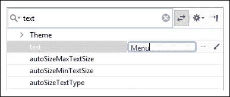

### 提示

您可以通过搜索或滚动选项来查找任何属性。找到要编辑的属性后，左键单击选择它，然后按键盘上的*Enter*键使其可编辑。

接下来，使用您喜欢的搜索技术找到`textSize`属性，并将`textSize`设置为`50sp`。输入新值后，文本大小将增加。

`sp`代表可伸缩像素。这意味着当用户在其 Android 设备上更改字体大小设置时，字体将动态重新调整大小。

现在，搜索**gravity**属性，并通过单击以下截图中指示的小箭头展开选项：

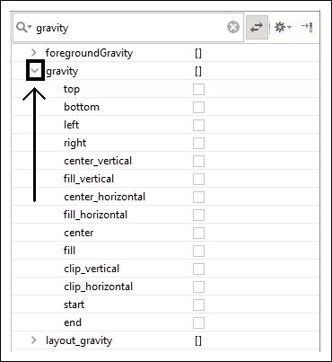

将**gravity**设置为**center_horizontal**，如下截图所示：


`gravity`属性指的是`TextView`本身的重力，我们的更改会使`TextView`内的实际文本移动到中心。

### 提示

请注意，`gravity`与`layout_gravity`是不同的。`layout_gravity`属性设置了布局内的重力：在这种情况下，是父`LinearLayout`。我们将在项目的后续部分使用`layout_gravity`。

此时，我们已更改了`TextView`的文本，增加了其大小，并使其水平居中。UI 设计师现在应该如下图所示：

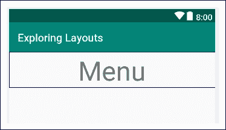

快速浏览**Text**选项卡，查看 XML 代码，会发现以下代码：

```kt
<TextView
   android:id="@+id/textView"
   android:layout_width="match_parent"
   android:layout_height="wrap_content"
   android:gravity="center_horizontal"
   android:text="Menu"
   android:textSize="50sp" />
```

您可以看到新的属性如下：`gravity`设置为`center_horizontal`；文本更改为`Menu`；`textSize`设置为`50sp`。

如果运行应用程序，可能看不到预期的效果。这是因为我们在 Kotlin 代码中没有调用`setContentView`来加载 UI。您仍然会看到空白的 UI。我们将在 UI 有了更多进展后解决这个问题。

## 将多行 TextView 添加到 UI

切换回**Design**选项卡，在调色板的**Text**类别中找到**Multiline Text**，并将其拖放到刚刚添加的`TextView`下方的设计中。

使用您喜欢的搜索技术，将**text**设置为`选择布局类型以查看示例。每个按钮的 onClick 属性将调用一个函数，该函数执行 setContentView 以加载新布局`。

您的布局现在将如下截图所示：


您的 XML 将在`TextView`之后的`LinearLayout`中更新为另一个子元素，代码如下：

```kt
<EditText
   android:id="@+id/editText"
   android:layout_width="match_parent"
   android:layout_height="wrap_content"
   android:ems="10"
   android:inputType="textMultiLine"
   android:text="Select a layout type to view an example. 
         The onClick attribute of each button will call a function 
         which executes setContentView to load the new layout" />
```

您可以查看 UI 项的详细信息，结果发现**多行文本**的调色板上的描述并不明显，究竟是什么。查看 XML 后，我们发现有一个`inputType`属性，表示用户可以编辑此文本。还有另一个我们以前没有见过的属性，那就是`ems`。`ems`属性控制每行可以输入多少个字符，而`10`的值是 Android Studio 自动选择的。然而，另一个属性`layout_width="match_parent"`覆盖了这个值，因为它使元素扩展以适应其父元素；换句话说，覆盖整个屏幕的宽度。

当您运行应用程序（在下一节中），您将看到文本确实是可编辑的-尽管对于这个演示应用程序的目的来说，它没有实际用途。

# 用 Kotlin 代码连接 UI（第一部分）

为了实现一个交互式的应用程序，我们将做以下三件事：

1.  我们将从`onCreate`函数中调用`setContentView`来显示我们运行应用程序时的 UI 进度。

1.  我们将编写另外两个我们自己的函数，每个函数将在不同的布局上调用`setContentView`（我们还没有设计）。

1.  然后，在本章后面，当我们设计另外两个 UI 布局时，我们将能够在点击按钮时加载它们。

因为我们将构建一个`ConstraintLayout`和一个`TableLayout`，所以我们将分别调用我们的新函数`loadConstraintLayout`和`loadTableLayout`。

现在让我们这样做，然后我们将看到如何添加一些按钮，调用这些函数以及一些整齐格式的文本。

在`onCreate`函数中，添加以下突出显示的代码：

```kt
override fun onCreate(savedInstanceState: Bundle?) {
   super.onCreate(savedInstanceState)

 setContentView(R.layout.main_menu)
}
```

该代码使用`setContentView`函数来加载我们当前正在工作的 UI。现在您可以运行应用程序，看到以下结果：

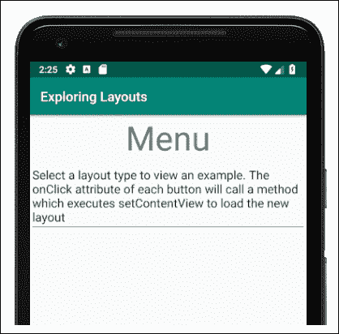

在`MainActivity`类的`onCreate`函数之后，添加这两个新函数：

```kt
fun loadConstraintLayout(v: View) {
  setContentView(R.layout.activity_main)
}

fun loadTableLayout(v: View) {
  setContentView(R.layout.my_table_layout)
}
```

第一个函数有一个错误，第二个函数有两个错误。第一个我们可以通过添加一个`import`语句来修复，以便 Android Studio 意识到`View`类。左键单击`View`单词选择错误。按住*Alt*键，然后点击*Enter*键。您将看到以下弹出窗口：

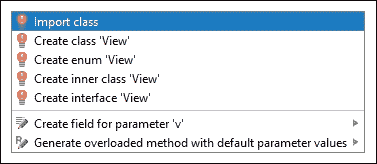

选择**导入类**。错误现在已经消失。如果您滚动到代码的顶部，您将看到刚才执行的快捷方式添加了一行新代码。以下是新代码：

```kt
import android.view.View
```

Android Studio 不再将`View`类视为错误。

然而，第二个函数仍然有一个错误。问题在于该函数调用`setContentView`函数来加载一个新的 UI（`R.layout.my_table_layout`）。由于此 UI 布局尚不存在，因此会产生错误。您可以注释掉此调用以消除错误，直到我们在本章后面创建文件并设计 UI 布局。添加双斜杠（`//`），如下面的代码中所突出显示的那样：

```kt
fun loadTableLayout(v: View) {
  //setContentView(R.layout.my_table_layout)
}
```

现在我们可以添加一些按钮，我们可以点击这些按钮来调用我们的新函数，并加载我们即将构建的新布局。但是，添加一对带有一些文本的按钮太容易了-我们以前已经做过了。我们想要做的是将一些文本与按钮对齐，使其位于文本的右侧。问题在于我们的`LinearLayout`的`orientation`属性设置为`vertical`，正如我们所见，我们添加到布局中的所有新部分都将垂直排列。

# 在布局中添加布局

将一些元素以不同方向布局的解决方案是在布局中嵌套布局。以下是如何做到的。

从调色板的**布局**类别中，将**LinearLayout（水平）**拖放到设计中，将其放置在**多行文本**的下方。注意，有一个蓝色边框占据了**多行文本**下方的所有空间：

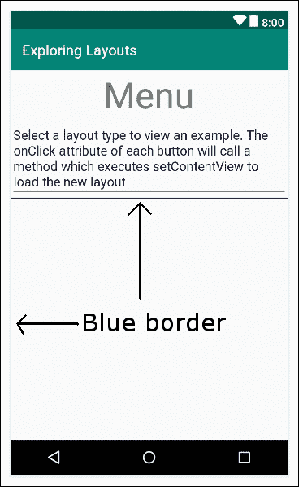

这表明我们的新**LinearLayout（水平）**正在填充空间。请记住这个蓝色边框区域，因为我们将在 UI 上放置下一个项目。

现在，返回到调色板的**Text**类别，并将一个**TextView**拖放到我们刚刚添加的新**LinearLayout**中。请注意，`TextView`紧密地位于新`LinearLayout`的左上角：


起初，这似乎与我们 UI 中一开始的垂直`LinearLayout`发生的情况没有什么不同。但是当我们添加 UI 的下一个部分时，看看会发生什么。

### 注意

用于指代在布局中添加布局的术语是**嵌套**。应用于 UI 上的任何项目（例如按钮和文本）的 Android 术语是**视图**，而包含视图的任何内容都是**视图组**。由于**视图**和**视图组**这两个术语在某些情境下并不总是清晰表达其含义，我通常会具体指称 UI 的部分（如`TextView`、`Button`和`LinearLayout`）或更广泛地（UI 元素、项目或小部件）。

从**Button**类别中，将一个**Button**拖放到先前`TextView`的右侧。请注意，按钮位于文本的右侧，如下图所示：


接下来，通过单击其空白部分选择`LinearLayout`（水平的）。找到`layout_height`属性并将其设置为`wrap_content`。注意，`LinearLayout`现在只占用所需的空间：


在添加 UI 的下一部分之前，让我们配置`TextView`和`Button`的`text`属性。将`Button`的`text`属性更改为`LOAD`。将我们的新`TextView`的文本属性更改为`Load ConstraintLayout`。

### 提示

你自己解决了如何实现之前的指令吗？是的？太棒了！现在你已经熟悉了编辑 Android 视图属性。没有？左键单击要编辑的项目（在本例中为`TextView`），使用搜索图标搜索或滚动查找要在**属性**窗口中编辑的属性（在本例中为`text`属性），选择属性，然后按*Enter*进行编辑。现在我可以更简洁地说明如何构建未来的 UI 项目，这将使你成为 Android 忍者的旅程更快。

现在我们可以重复自己，在刚刚完成的另一个**LinearLayout（水平）**中添加另一个`TextView`和`Button`属性。要这样做，请按顺序执行以下步骤：

1.  在前一个下方再添加一个**LinearLayout（水平）**

1.  在新的`LinearLayout`中添加一个**TextView**

1.  将`TextView`的`text`属性更改为`Load TableLayout`

1.  在`TextView`的右侧添加一个`Button`

1.  将`Button`的`text`属性更改为`LOAD`

1.  通过将`layout_height`属性更改为`wrap_content`来调整`LinearLayout`的大小

现在我们有两个整齐（水平）对齐的文本和按钮。

只是为了好玩，也为了更多地探索调色板，找到调色板的**小部件**类别，并将一个**RatingBar**拖放到最终`LinearLayout`的下方。现在，你的 UI 应该看起来与下一个截图非常相似：


### 注意

在前两个截图中，我还没有更改两个`Button`元素的`text`属性。其他所有内容应该与你的一样。

让我们为布局添加一些视觉上的修饰。

# 使布局看起来漂亮

在本节中，我们将探讨一些控制 UI 细节的更多属性。您可能已经注意到 UI 在某些地方看起来有点挤，而在其他地方看起来不对称。随着我们在书中的进展，我们将不断增加我们的技能来改善我们的布局，但这些简短的步骤将介绍并处理一些基础知识：

1.  选择`多行文本`，然后展开`Padding`属性。将`all`选项设置为`15sp`。这样在文本周围留出了整洁的空间。

1.  为了在`多行文本`下方留出一个漂亮的空间，找到并展开`Layout_Margin`属性，将`bottom`设置为`100sp`。

1.  在与按钮对齐/相关的两个`TextView`小部件上，将`textSize`属性设置为`20sp`，`layout_gravity`设置为`center_vertical`，`layout_width`设置为`match_parent`，`layout_weight`设置为`.7`。

1.  在两个按钮上，将权重设置为`.3`。注意现在两个按钮的宽度都是`.3`，文本占据`LinearLayout`的`.7`，整体外观更加美观。

1.  在`RatingBar`上，找到`Layout_Margin`属性，然后将`left`和`right`设置为`15sp`。

1.  仍然使用`RatingBar`和`Layout_Margin`属性，将`top`更改为`75sp`。

现在，您可以运行应用程序，看到我们的第一个完整布局的全部荣耀。

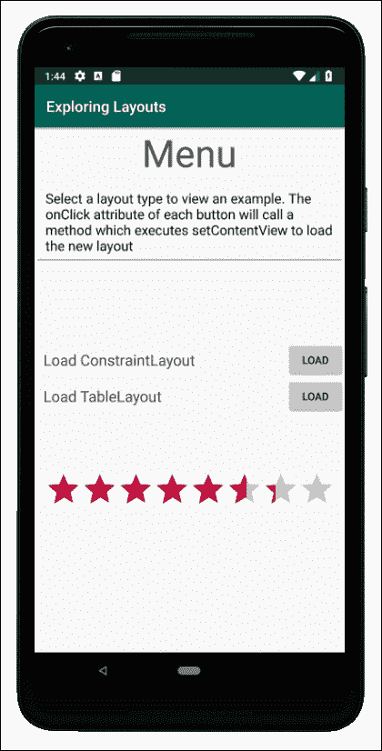

请注意，您可以玩`RatingBar`，尽管在关闭应用程序时评分不会保留。

### 提示

作为读者挑战，找到一个或两个属性，可以进一步改善`LoadConstraintLayout`和`LoadTableLayout`文本的外观。它们看起来离屏幕边缘有点近。参考第五章开头的快速摘要部分，*使用 CardView 和 ScrollView 创建美丽的布局*。

不幸的是，按钮目前还没有功能。让我们解决这个问题。

# 使用 Kotlin 代码连接 UI（第二部分）

选择`Load ConstraintLayout`文本旁边的按钮。找到`onClick`属性，将其设置为`loadConstraintLayout`。

选择`Load TableLayout`文本旁边的按钮。找到`onClick`属性，将其设置为`loadTableLayout`。

现在，按钮将调用函数，但`loadTableLayout`函数内的代码已被注释掉以避免错误。随时运行应用程序，看看您是否可以通过单击`loadConstraintLayout`按钮切换到`ConstraintLayout`。但它只有一个**Hello World**消息。

现在我们可以继续构建这个`ConstraintLayout`。

# 使用 ConstraintLayout 构建精确的 UI

打开创建项目时自动生成的`ConstraintLayout`。它可能已经在编辑器顶部的选项卡中。如果没有，它将在`res`/`layout`文件夹中。它的名称是`activity_main.xml`。

检查**Text**选项卡中的 XML，并注意它是空的，除了一个说`Hello World`的`TextView`。切换回**Design**选项卡，左键单击`TextView`以选择它，然后按*Delete*键将其删除。

现在我们可以构建一个简单而复杂的 UI。当您想要非常精确地定位 UI 的部分和/或相对于其他部分时，`ConstraintLayout`非常有用。

## 添加日历视图

首先，在调色板的**Widgets**类别中找到`CalenderView`。将`CalenderView`拖放到靠近顶部且水平居中的位置。当您拖动`CalenderView`时，注意它会跳到某些位置。

还要注意视图对齐时的微妙视觉提示。我在以下截图中突出显示了水平中心的视觉提示：

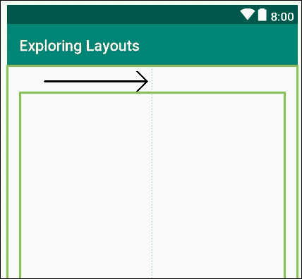

当它水平居中时，释放它，就像截图中一样。现在，我们将调整它的大小。

## 在 ConstraintLayout 中调整视图大小

左键单击并按住一个角落的方块，当你放开`CalenderView`时会显示出来，向内拖动以减小`CalenderView`的大小：

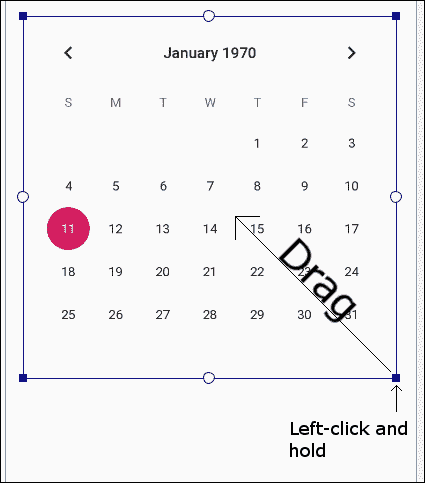

将大小减小约一半，将`CalenderView`留在屏幕顶部，水平居中。在调整大小后，你可能需要重新调整一下位置，就像下面的图示一样：

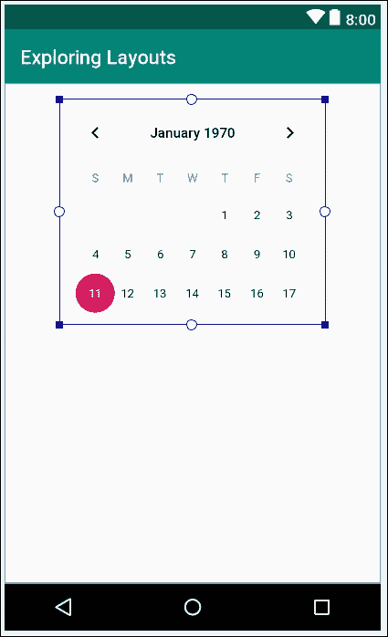

你不需要把`CalenderView`放在和我完全一样的位置。练习的目的是熟悉指示你放置位置的视觉线索，而不是创建一个和我的布局一模一样的副本。

## 使用组件树窗口

现在看一下**组件树**窗口 - 就在可视化设计师的左边和调色板下面。组件树是一种可视化 XML 布局的方式，但没有所有的细节。

在下面的截图中，我们可以看到`CalenderView`向右缩进到`ConstraintLayout`的右侧，因此是一个子元素。在我们构建的下一个 UI 中，我们将看到我们有时需要利用**组件树**来构建 UI。

目前，我只是想让你观察一下我们的`CalenderView`旁边有一个警告标志。我在下面的截图中已经用颜色标出来了：


错误提示说**此视图没有约束。它只有设计时的位置，因此在运行时会跳转到(0,0)，除非你添加约束**。还记得我们在第二章中首次将按钮添加到屏幕上时，它们只是简单地消失在左上角吗？

### 提示

现在运行应用程序，如果你想提醒自己这个问题，点击**加载 ConstraintLayout**按钮。

现在，我们可以通过点击**推断约束**按钮来修复这个问题，就像我们在第二章中使用的那样，*Kotlin、XML 和 UI 设计师*。这里再次提醒一下：


但学会手动添加约束是值得的，因为它为我们提供了更多的选项和灵活性。随着你的布局变得更加复杂，总会有一两个项目不按照你的意愿行事，手动修复几乎总是必要的。

## 手动添加约束

确保`CalenderView`被选中，并观察顶部、底部、左侧和右侧的四个小圆圈：

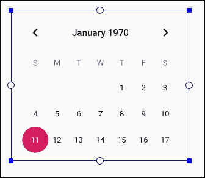

这些是约束手柄。我们可以点击并拖动它们，将它们锚定到 UI 的其他部分或屏幕的边缘。通过将`CalenderView`与屏幕的四个边缘锚定，我们可以在应用程序运行时将其锁定到位置。

依次点击并拖动顶部手柄到设计的顶部，右侧手柄到设计的右侧，底部手柄到设计的底部，左侧手柄到设计的左侧。

观察到`CalenderView`现在被约束在中心。左键单击并拖动`CalenderView`回到屏幕的上部某个位置，就像下面的图示一样。使用视觉线索（也显示在下面的截图中）确保`CalenderView`水平居中：


在这个阶段，你可以运行应用程序，`CalenderView`将会被定位到前面截图中显示的位置。

让我们向 UI 添加几个项目，并看看如何约束它们。

## 添加和约束更多的 UI 元素

从调色板的**小部件**类别中拖动一个`ImageView`，并将其放置在`CalenderView`的下方和左侧。当你放置`ImageView`时，会弹出一个窗口提示你选择一个图像。选择**项目** | **ic_launcher**，然后点击**确定**。

将`ImageView`的左侧和底部约束到 UI 的左侧和底部。现在，您应该处于以下位置：

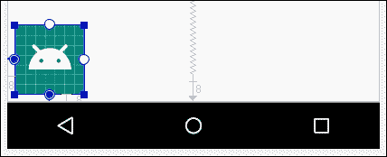

`ImageView`在左下角被约束。现在，抓住`ImageView`上的顶部约束手柄，并将其拖动到`CalenderView`的底部约束手柄。现在的情况是这样的：


`ImageView`只在一个侧面水平约束，因此被固定/约束在左侧。它还在垂直方向上被约束，并且在`CalenderView`和 UI 的底部之间是均匀约束的。

接下来，在`ImageView`的右侧添加一个`TextView`。将`TextView`的右侧约束到 UI 的右侧，并将`TextView`的左侧约束到`ImageView`的右侧。将`TextView`的顶部约束到`ImageView`的顶部，并将`TextView`的底部约束到 UI 的底部。现在，您将得到类似以下图表的东西：

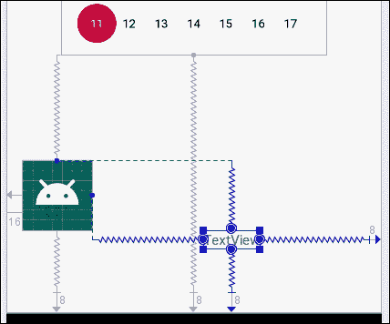

注意，**Component Tree**窗口中关于未约束项的所有警告都消失了。

### 注意

有关硬编码字符串的警告，因为我们直接向布局添加文本而不是`strings.xml`文件，并且有关缺少**contentDescription**属性的警告。**contentDescription**属性应该用于添加文本描述，以便视觉障碍用户可以在应用中获得图像的口头描述。为了快速推进`ConstraintLayout`，我们将忽略这两个警告。我们将在第十八章*本地化*中正确添加字符串资源，并且您可以在 Android 开发者网站的 Android Studio 上阅读有关辅助功能的信息，网址为[`developer.android.com/studio/intro/accessibility`](https://developer.android.com/studio/intro/accessibility)。

您可以移动三个 UI 元素并将它们整齐地排列，就像您想要的那样。请注意，当您移动`ImageView`时，`TextView`也会随之移动，因为`TextView`被约束到`ImageView`。但也请注意，您可以独立移动`TextView`，并且无论您放置在哪里，这都代表了它相对于`ImageView`的新约束位置。无论项被约束到什么，其位置始终相对于该项。而且，正如我们所看到的，水平和垂直约束是彼此独立的。我将我的位置放置如下图所示：

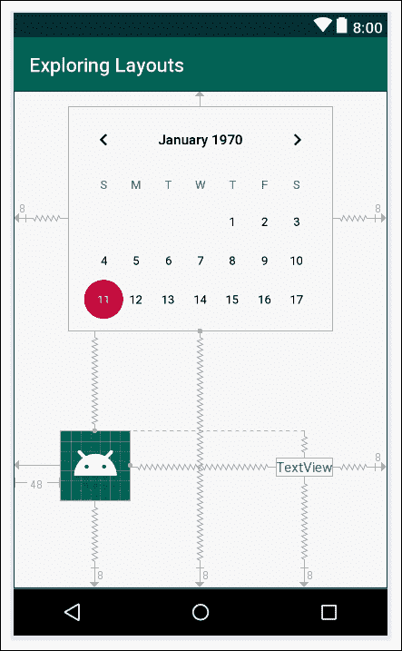

### 提示

`ConstraintLayout`是最新的布局类型，虽然它比其他布局更复杂，但它是最强大的，也是在用户设备上运行最好的。值得花更多时间查看有关`ConstraintLayout`的更多教程。特别是在 YouTube 上查看，因为视频是学习调整`ConstraintLayout`的好方法。我们将在整本书中回到`ConstraintLayout`，而且您不需要知道比我们已经涵盖的更多内容才能继续前进。

## 使文本可点击

我们几乎完成了我们的`ConstraintLayout`。我们只想要将一个链接返回到主菜单屏幕。这是一个很好的机会来演示`TextView`（以及大多数其他 UI 项）也是可点击的。实际上，可点击的文本在现代 Android 应用程序中可能比传统的按钮更常见。

将`TextView`的`text`属性更改为`返回菜单`。现在，找到`onClick`属性并输入`loadMenuLayout`。

现在，在`MainActivity.kt`文件中添加以下函数，就在`loadTableLayout`函数之后，如下所示：

```kt
fun loadTableLayout(v: View) {
  //setContentView(R.layout.my_table_layout)
}

fun loadMenuLayout(v: View) {
 setContentView(R.layout.main_menu)
}

```

现在，每当用户点击“返回菜单”文本时，`loadMenuLayout`函数将被调用，`setContentView`函数将加载`main_menu.xml`中的布局。

你可以运行应用程序，在主菜单（`LinearLayout`）和`CalenderView`小部件（`ConstraintLayout`）之间来回切换。

让我们为本章构建最终的布局。

# 使用 TableLayout 布局数据

在项目窗口中，展开`res`文件夹。现在，右键单击`layout`文件夹，然后选择**新建**。注意，有一个**布局资源文件**的选项。

选择**布局资源文件**，你会看到**新建资源文件**对话框窗口。

在**文件名**字段中输入`my_table_layout`。这与我们在`loadTableLayout`函数中调用`setContentView`时使用的名称相同。

注意它已经选择了**LinearLayout**作为**根**元素选项。删除`LinearLayout`，并在其位置键入`TableLayout`。

点击**确定**按钮，Android Studio 将在名为`my_table_layout`的 XML 文件中生成一个新的`TableLayout`，并将其放在`layout`文件夹中，准备为我们构建基于表格的新 UI。Android Studio 还将打开 UI 设计师（如果尚未打开），左侧是调色板，右侧是属性窗口。

现在，取消注释`loadTableLayout`函数：

```kt
fun loadTableLayout(v: View) {
  setContentView(R.layout.my_table_layout)
}
```

现在，当你运行应用程序时，你可以切换到基于`TableLayout`的屏幕，尽管目前它是空白的。

## 向 TableLayout 添加 TableRow

从**布局**类别中将一个`TableRow`元素拖放到 UI 设计中。注意，这个新的`TableRow`的外观几乎是看不见的，以至于不值得在书中插入图表。UI 顶部只有一条蓝线。这是因为`TableRow`已经将自己围绕其内容折叠起来，而目前内容是空的。

我们可以将选择的 UI 元素拖放到这条蓝线上，但这也有点别扭，甚至有点违反直觉。此外，一旦我们在一起有多个`TableRow`元素，情况就会变得更加困难。解决方案在于**组件树**窗口，我们在构建`ConstraintLayout`时简要介绍过。

## 当视觉设计师无法完成时使用组件树

查看**组件树**，注意你可以看到`TableRow`作为`TableLayout`的子级。我们可以直接将 UI 拖放到**组件树**中的`TableRow`上。在**组件树**中将三个`TextView`对象拖放到`TableRow`上，这样就会得到以下布局。我已经用 photoshop 修改了以下截图，以展示**组件树**和常规 UI 设计师在同一图表中：


现在添加另外两个`TableRow`对象（从**布局**类别）。你可以通过**组件树**窗口或 UI 设计师添加它们。

### 提示

你需要将它们放在窗口的最左边，否则新的`TableRow`将成为前一个`TableRow`的子级。这将使整个表格有点混乱。如果你意外地将`TableRow`添加为前一个`TableRow`的子级，你可以选择它，然后点击*删除*键，使用*Ctrl* + Z 键组合来撤消，或者将位置错误的`TableRow`拖到左边（在**组件树**中）使其成为表格的子级 - 这是应该的。

现在，为每个新的`TableRow`项目添加三个`TextView`对象。最简单的方法是通过**组件树**窗口添加它们。检查你的布局，确保它与以下截图中的一样：

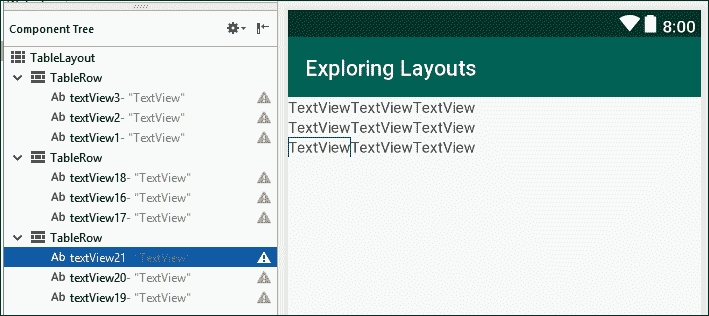

让表格看起来更像是一个真正的数据表，通过改变一些属性。

在`TableLayout`上，将`layout_width`和`layout_height`属性设置为`wrap_content`。这样就可以去掉多余的单元格。

通过编辑`textColor`属性将所有外部（沿顶部和左侧）的`TextView`对象的颜色更改为黑色。您可以通过选择第一个`TextView`，搜索其`color`属性，然后在`color`属性值字段中输入`black`来实现这一点。然后，您将能够从下拉列表中选择`@android:color/black`。对每个外部`TextView`元素都要这样做。

编辑每个`TextView`的`padding`并将`all`属性更改为`10sp`。

## 组织表格列

此时似乎我们已经完成了，但是我们需要更好地组织数据。我们的表格，像许多表格一样，将在左上角有一个空白单元格来分隔列和行标题。为了实现这一点，我们需要对所有单元格进行编号。为此，我们需要编辑`layout_column`属性。

### 提示

单元格编号从左边开始编号为零。

首先删除左上角的`TextView`。注意右侧的`TextView`已经移动到左上角位置。

接下来，在新的左上角`TextView`中，编辑`layout_column`属性为`1`（这将把它分配给第二个单元格，因为第一个是`0`，我们想要留下第一个为空），然后，对于下一个单元格，编辑`layout_column`属性为`2`。

对于接下来的两行单元格，将它们的`layout_column`属性从左到右从`0`更改为`2`。

如果您想要在编辑后了解此行的确切代码，请参阅以下片段，并记得在`Chapter04`的`/LayoutExploration`文件夹中查看整个文件的上下文：

```kt
<TableRow
   android:layout_width="wrap_content"
   android:layout_height="wrap_content">

   <TextView
         android:id="@+id/textView2"
         android:layout_width="wrap_content"
         android:layout_height="wrap_content"
         android:layout_column="1"
         android:padding="10sp"
         android:text="India"
         android:textColor="@android:color/black" />

   <TextView
         android:id="@+id/textView1"
         android:layout_width="wrap_content"
         android:layout_height="wrap_content"
         android:layout_column="2"
         android:padding="10sp"
         android:text="England"
         android:textColor="@android:color/black" />

</TableRow>
```

尝试完成这个练习，但是如果可能的话，请使用**属性**窗口。

## 链接回主菜单

最后，对于这个布局，我们将添加一个按钮，链接回主菜单。通过**组件树**添加另一个`TableRow`。将按钮拖放到新的`TableRow`上。编辑其`layout_column`属性为`1`，使其位于行的中间。编辑其`text`属性为`Menu`，并编辑其`onClick`属性以匹配我们已经存在的`loadMenuLayout`函数。

现在，您可以运行应用程序并在不同的布局之间来回切换。

如果您愿意，您可以通过编辑`TextView`小部件的所有`text`属性来向表格添加一些有意义的标题和数据，就像我在下面的截图中所做的那样，显示了在模拟器中运行的`TableLayout`：

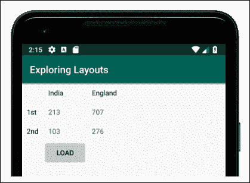

最后，思考一下一个呈现数据表的应用程序。很可能数据将动态地添加到表中，而不是由开发人员在设计时添加，而更可能是由用户或来自网络数据库的数据。在第十六章*适配器和回收器*中，我们将看到如何使用适配器动态地向不同类型的布局添加数据，而在第二十七章*Android 数据库*中，我们还将看到如何在我们的应用程序中创建和使用数据库。

# 摘要

我们在几十页中涵盖了许多主题。我们不仅构建了三种不同类型的布局，包括具有嵌套布局的`LinearLayout`，手动配置约束的`ConstraintLayout`，以及`TableLayout`（尽管使用的是假数据），而且我们还通过可点击的按钮和文本将所有布局连接在一起，触发我们的 Kotlin 代码在所有这些不同的布局之间切换。

在下一章中，我们将继续讨论布局的主题。我们将回顾我们所见过的许多属性，并通过将多个`CardView`布局整合到平滑滚动的`ScrollView`布局中，构建迄今为止最美观的布局。
