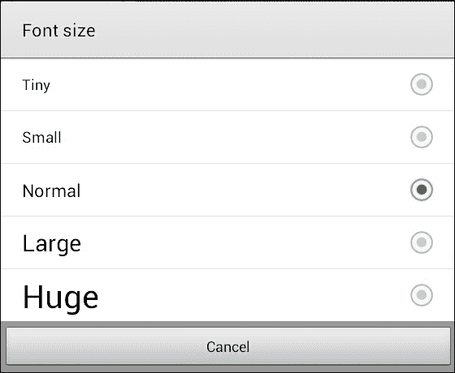
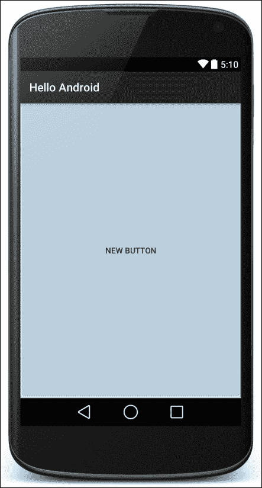
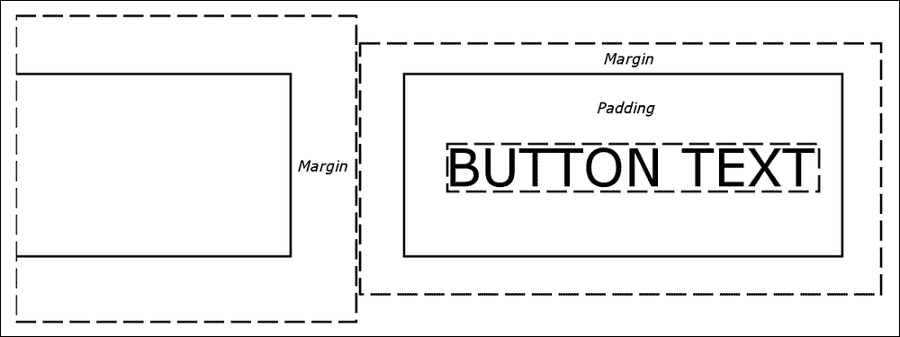
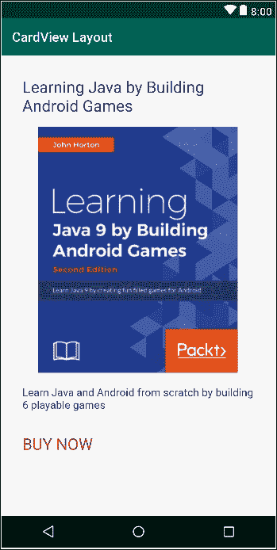
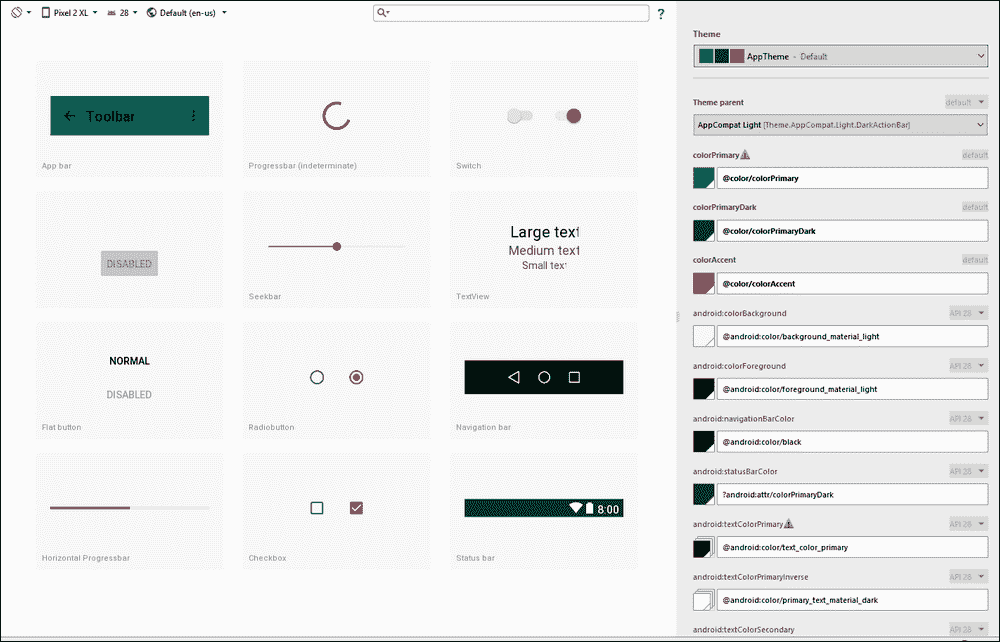
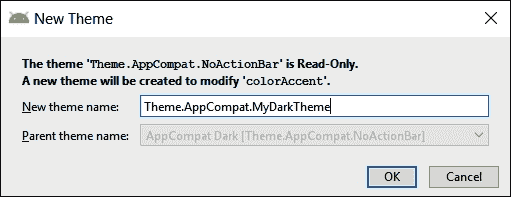
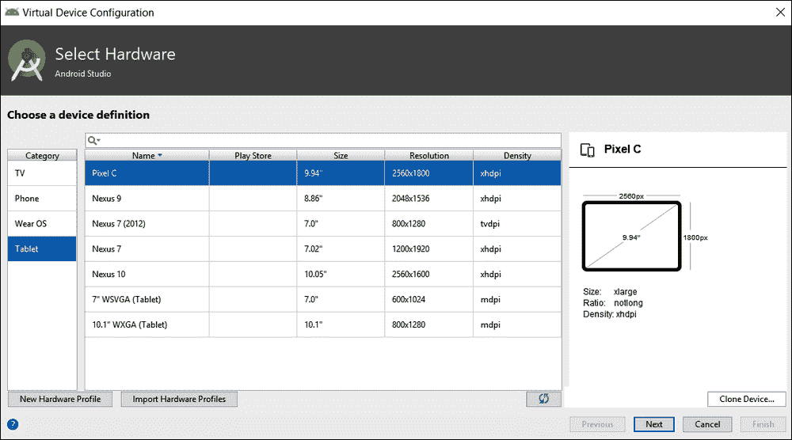

# 第五章。使用 CardView 和 ScrollView 创建美丽的布局

这是我们在专注于 Kotlin 和面向对象编程之前关于布局的最后一章。我们将对我们已经看到的一些不同属性进行正式学习，并且还将介绍两种更酷的布局：`ScrollView`和`CardView`。最后，我们将在平板模拟器上运行`CardView`项目。

在本章中，我们将涵盖以下主题：

+   编译 UI 属性的快速总结

+   使用`ScrollView`和`CardView`构建迄今为止最漂亮的布局

+   切换和自定义主题

+   创建和使用平板模拟器

让我们首先回顾一些属性。

# 属性-快速总结

在过去的几章中，我们已经使用和讨论了相当多不同的属性。我认为值得对一些更常见的属性进行快速总结和进一步调查。

## 使用 dp 进行大小调整

众所周知，有成千上万种不同的 Android 设备。Android 使用**密度无关像素**或**dp**作为测量单位，以尝试拥有一个可以跨不同设备工作的测量系统。其工作原理是首先计算应用程序运行的设备上的像素密度。

### 提示

我们可以通过将屏幕的水平分辨率除以屏幕的水平尺寸（以英寸为单位）来计算密度。这一切都是在我们的应用程序运行的设备上动态完成的。

我们只需在设置小部件的各种属性的大小时，使用`dp`与数字结合即可。使用密度无关的测量，我们可以设计布局，使其在尽可能多的不同屏幕上呈现统一的外观。

那么问题解决了吗？我们只需在所有地方使用`dp`，我们的布局就能在任何地方正常工作了吗？不幸的是，密度独立性只是解决方案的一部分。在本书的其余部分中，我们将看到如何使我们的应用程序在各种不同的屏幕上看起来很棒。

例如，我们可以通过向其属性添加以下代码来影响小部件的高度和宽度：

```kt
...
android:height="50dp"
android:width="150dp"
...
```

或者，我们可以使用属性窗口，并通过适当的编辑框的舒适性来添加它们。您使用哪种选项将取决于您的个人偏好，但有时在特定情况下，一种方式会感觉比另一种方式更合适。无论哪种方式都是正确的，当我们在制作应用程序时，我通常会指出一种方式是否比另一种方式*更好*。

我们还可以使用相同的`dp`单位来设置其他属性，例如边距和填充。我们将在一分钟内更仔细地研究边距和填充。

## 使用 sp 调整字体大小

另一个用于调整 Android 字体大小的设备相关单位是**可伸缩像素**或**sp**。`sp`测量单位用于字体，并且与`dp`完全相同，具有像素密度相关性。

Android 设备在决定您的字体大小时将使用额外的计算，这取决于您使用的`sp`值和用户自己的字体大小设置。因此，如果您在具有正常大小字体的设备和模拟器上测试应用程序，那么视力受损的用户（或者只是喜欢大字体的用户）并且将其字体设置为大号的用户将看到与您在测试期间看到的内容不同。

如果您想尝试调整 Android 设备的字体大小设置，可以通过选择**设置 | 显示 | 字体大小**来进行调整：



正如我们在前面的屏幕截图中看到的，有相当多的设置，如果您尝试在**巨大**上进行设置，差异是巨大的！

我们可以在任何具有文本的小部件中使用`sp`设置字体大小。这包括`Button`，`TextView`以及调色板中**Text**类别下的所有 UI 元素，以及其他一些元素。我们可以通过设置`textSize`属性来实现：

```kt
android:textSize="50sp"
```

与往常一样，我们也可以使用属性窗口来实现相同的效果。

## 使用 wrap 或 match 确定大小

我们还可以决定 UI 元素的大小以及许多其他 UI 元素与包含/父元素的关系。我们可以通过将`layoutWidth`和`layoutHeight`属性设置为`wrap_content`或`match_parent`来实现。

例如，假设我们将布局上的一个孤立按钮的属性设置为以下内容：

```kt
...
android:layout_width="match_parent"
android:layout_height="match_parent"
....
```

然后，按钮将在高度和宽度上扩展以匹配父级。我们可以看到下一张图片中的按钮填满了整个屏幕：



按钮更常见的是`wrap_content`，如下面的代码所示：

```kt
....
android:layout_width="wrap_content"
android:layout_height="wrap_content"
....
```

这将导致按钮的大小与其需要的内容一样大（宽度和高度为`dp`，文本为`sp`）。

## 使用填充和边距

如果您曾经做过任何网页设计，您将非常熟悉接下来的两个属性。**填充**是从小部件的边缘到小部件中内容的开始的空间。**边距**是留在小部件外的空间，用于其他小部件之间的间隔-包括其他小部件的边距，如果它们有的话。这是一个可视化表示：



我们可以简单地为所有边指定填充和边距，如下所示：

```kt
...
android:layout_margin="43dp"
android:padding="10dp"
...
```

注意边距和填充的命名约定略有不同。填充值只称为`padding`，但边距值称为`layout_margin`。这反映了填充只影响 UI 元素本身，但边距可以影响布局中的其他小部件。

或者，我们可以指定不同的顶部、底部、左侧和右侧的边距和填充，如下所示：

```kt
android:layout_marginTop="43dp"
android:layout_marginBottom="43dp"
android:paddingLeft="5dp"
android:paddingRight="5dp"
```

为小部件指定边距和填充值是可选的，如果没有指定任何值，将假定为零。我们还可以选择指定一些不同边的边距和填充，但不指定其他边，就像前面的示例一样。

很明显，我们设计布局的方式非常灵活，但要精确地使用这些选项，需要一些练习。我们甚至可以指定负边距值来创建重叠的小部件。

让我们再看看一些属性，然后我们将继续玩一个时尚布局`CardView`。

## 使用`layout_weight`属性

权重是相对于其他 UI 元素的相对量。因此，要使`layout_weight`有用，我们需要在两个或更多元素上为`layout_weight`属性分配一个值。

然后，我们可以分配总共加起来为 100%的部分。这对于在 UI 的各个部分之间划分屏幕空间特别有用，我们希望它们占用的相对空间在屏幕大小不同的情况下保持不变。

将`layout_weight`与`sp`和`dp`单位结合使用可以创建简单灵活的布局。例如，看看这段代码：

```kt
<Button
        android:layout_width="match_parent"
        android:layout_height="0dp"
        android:layout_weight="0.10"
        android:text="one tenth" />

<Button
        android:layout_width="match_parent"
        android:layout_height="0dp"
        android:layout_weight="0.20"
        android:text="two tenths" />

<Button
        android:layout_width="match_parent"
        android:layout_height="0dp"
        android:layout_weight="0.30"
        android:text="three tenths" />

<Button
        android:layout_width="match_parent"
        android:layout_height="0dp"
        android:layout_weight="0.40"
        android:text="four tenths" />
```

这段代码将会做什么：


注意，所有`layout_height`属性都设置为`0dp`。实际上，`layout_weight`属性正在替换`layout_height`属性。我们使用`layout_weight`的上下文很重要（否则它不起作用），我们很快就会在一个真实的项目中看到这一点。还要注意，我们不必使用一的分数；我们可以使用整数、百分比和任何其他数字。只要它们相对于彼此，它们可能会实现您想要的效果。请注意，`layout_weight`仅在某些上下文中起作用，随着我们构建更多的布局，我们将看到它在哪些上下文中起作用。

## 使用重力

重力可以成为我们的朋友，并且可以在布局中以许多方式使用。就像太阳系中的重力一样，它通过将物品朝特定方向移动来影响物品的位置，就好像它们受到重力的作用一样。了解重力的作用最好的方法是查看一些示例代码和图表：

```kt
android:gravity="left|center_vertical"
```

如果按钮（或其他小部件）的`gravity`属性设置为`left|center_vertical`，就像前面的代码所示，它将产生以下效果：


注意小部件的内容（在本例中为按钮的文本）确实是左对齐和垂直居中的。

此外，小部件可以通过`layout_gravity`元素影响其在布局元素中的位置，如下所示：

```kt
android:layout_gravity="left"
```

这将设置小部件在其布局中，如预期的那样：


前面的代码允许同一布局中的不同小部件受到影响，就好像布局具有多个不同的重力一样。

通过使用与小部件相同的代码，可以通过其父布局的`gravity`属性来影响布局中所有小部件的内容：

```kt
android:gravity="left"
```

实际上，有许多属性超出了我们讨论的范围。我们在本书中不需要的属性很多，有些相当晦涩，所以您可能在整个 Android 生涯中都不需要它们。但其他一些属性是相当常用的，包括`background`、`textColor`、`alignment`、`typeface`、`visibility`和`shadowColor`。让我们现在探索一些更多的属性和布局。

# 使用 CardView 和 ScrollView 构建 UI

以通常的方式创建一个新项目。将项目命名为`CardView Layout`，并选择**空活动**项目模板。将其余所有设置保持与之前的所有项目相同。

为了能够编辑我们的主题并正确测试结果，我们需要生成我们的布局文件，并编辑 Kotlin 代码，通过调用 `onCreate` 函数中的 `setContentView` 函数来显示它。我们将在 `ScrollView` 布局内设计我们的 `CardView` 杰作，正如其名字所示，允许用户滚动布局内容。

右键单击`layout`文件夹，然后选择**新建**。注意有一个**布局资源文件**的选项。选择**布局资源文件**，然后您将看到**新资源文件**对话框窗口。

在**文件名**字段中输入 `main_layout`。名称是任意的，但这个布局将是我们的主要布局，所以名称很明显。

注意它被设置为**LinearLayout**作为**根**元素选项。将其更改为 `ScrollView`。这种布局类型似乎就像 `LinearLayout` 一样工作，除了当屏幕上有太多内容要显示时，它将允许用户通过用手指滑动来滚动内容。

点击**确定**按钮，Android Studio 将在名为 `main_layout` 的 XML 文件中生成一个新的 `ScrollView` 布局，并将其放置在 `layout` 文件夹中，准备好为我们构建基于 `CardView` 的 UI。

您可以在下一个截图中看到我们的新文件：


Android Studio 还将打开准备就绪的 UI 设计器。

## 使用 Kotlin 代码设置视图

与以前一样，我们现在将通过在`MainActivity.kt`文件中调用`setContentView`函数来加载`main_layout.xml`文件作为我们应用程序的布局。

选择`MainActivity.kt`选项卡。如果选项卡不是默认显示的，您可以在项目资源管理器中找到它，路径为`app/java/your_package_name`，其中`your_package_name`等于您创建项目时选择的包名称。

修改`onCreate`函数中的代码，使其与下面的代码完全一样。我已经突出显示了您需要添加的行：

```kt
override fun onCreate(savedInstanceState: Bundle?) {
   super.onCreate(savedInstanceState)
   setContentView(R.layout.main_layout);
}
```

现在可以运行该应用程序，但除了一个空的`ScrollView`布局外，没有其他可见的内容。

## 添加图像资源

我们将需要一些图像来完成这个项目。这样我们就可以演示如何将它们添加到项目中（本节），并在`CardView`布局中整洁地显示和格式化它们（下一节）。

您从哪里获取图像并不重要。这个练习的目的是实际的动手经验。为了避免版权和版税问题，我将使用 Packt Publishing 网站上的一些书籍图像。这也使我能够为您提供完成项目所需的所有资源，如果您不想麻烦获取自己的图像的话。请随意在`Chapter05/CardViewLayout/res/drawable`文件夹中更换图像。

有三个图像：`image_1.png`，`image_2.png`和`image_3.png`。要将它们添加到项目中，请按照以下步骤操作。

1.  使用操作系统的文件浏览器查找图像文件。

1.  将它们全部高亮显示，然后按*Ctrl* + *C*进行复制。

1.  在 Android Studio 项目资源管理器中，通过左键单击选择`res/drawable`文件夹。

1.  右键单击`drawable`文件夹，选择**粘贴。**

1.  在弹出窗口中询问您**选择目标目录**，单击**确定**接受默认目标，即`drawable`文件夹。

1.  再次单击**确定**以**复制指定的文件**。

现在您应该能够在`drawable`文件夹中看到您的图像，以及 Android Studio 在创建项目时放置在那里的其他一些文件，如下一个截图所示：


在我们继续进行`CardView`之前，让我们设计一下我们将放在其中的内容。

## 为卡片创建内容

我们接下来需要做的是为我们的卡片创建内容。将内容与布局分开是有意义的。我们将创建三个单独的布局，称为`card_contents_1`，`card_contents_2`和`card_contents_3`。它们将分别包含一个`LinearLayout`，其中将包含实际的图像和文本。

让我们再创建三个带有`LinearLayout`的布局：

1.  右键单击`layout`文件夹，选择**新建布局资源文件**。

1.  将文件命名为`card_contents_1`，并确保**LinearLayout**被选为**根元素**

1.  单击**确定**将文件添加到`layout`文件夹

1.  重复步骤一到三两次，每次更改文件名为`card_contents_2`和`card_contents_3`

现在，选择`card_contents_1.xml`选项卡，并确保您处于设计视图中。我们将拖放一些元素到布局中以获得基本结构，然后我们将添加一些`sp`，`dp`和 gravity 属性使它们看起来漂亮：

1.  将一个`TextView`小部件拖放到布局的顶部。

1.  将一个`ImageView`小部件拖放到`TextView`小部件下方的布局中。

1.  在**资源**弹出窗口中，选择**项目** | **image_1**，然后单击**确定**。

1.  在图像下方再拖放两个**TextView**小部件。

1.  现在您的布局应该是这样的：

现在，让我们使用一些材料设计指南使布局看起来更吸引人。

### 提示

当您进行这些修改时，底部布局的 UI 元素可能会从设计视图的底部消失。如果这种情况发生在您身上，请记住您可以随时从调色板下方的**组件树**窗口中选择任何 UI 元素。或者，参考下一个提示。

另一种减少问题的方法是使用更大的屏幕，如下面的说明所述：

### 提示

我将默认设备更改为**Pixel 2 XL**以创建上一个截图。我会保持这个设置，除非我特别提到我正在更改它。它允许在布局上多出一些像素，这样布局就更容易完成。如果您想做同样的事情，请查看设计视图上方的菜单栏，单击设备下拉菜单，并选择您的设计视图设备，如下截图所示：


1.  将`TextView`小部件的`textSize`属性设置为`24sp`。

1.  将**Layout_Margin** | **all**属性设置为`16dp`。

1.  将`text`属性设置为**通过构建 Android 游戏学习 Java**（或者适合您图像的标题）。

1.  在`ImageView`上，将`layout_width`和`layout_height`设置为`wrap_content`。

1.  在`ImageView`上，将`layout_gravity`设置为`center_horizontal`。

1.  在`ImageView`下方的`TextView`上，将`textSize`设置为`16sp`。

1.  在相同的`TextView`上，将**Layout_Margin** | **all**设置为`16dp`。

1.  在相同的`TextView`上，将`text`属性设置为`通过构建 6 个可玩游戏从零开始学习 Java 和 Android`（或者描述您的图像的内容）。

1.  在底部的`TextView`上，将`text`属性更改为`立即购买`。

1.  在相同的`TextView`上，将**Layout_Margin** | **all**设置为`16dp`。

1.  在相同的`TextView`上，将`textSize`属性设置为`24sp`。

1.  在相同的`TextView`上，将`textColor`属性设置为`@color/colorAccent`。

1.  在包含所有其他元素的`LinearLayout`上，将`padding`设置为`15dp`。请注意，从**Component Tree**窗口中选择`LinearLayout`是最容易的。

1.  此时，您的布局将非常类似于以下截图：

现在，使用完全相同的尺寸和颜色布局其他两个文件（`card_contents_2`和`card_contents_3`）。当您收到**资源**弹出窗口以选择图像时，分别使用`image_2`和`image_3`。还要更改前两个`TextView`元素上的所有`text`属性，以使标题和描述是唯一的。标题和描述并不重要；我们学习的是布局和外观。

### 提示

请注意，所有尺寸和颜色都来自[`material.io/design/introduction`](https://material.io/design/introduction)上的材料设计网站，以及[`developer.android.com/guide/topics/ui/look-and-feel`](https://developer.android.com/guide/topics/ui/look-and-feel)上的 Android 特定 UI 指南。与本书一起学习或在完成本书后不久进行学习都是非常值得的。

现在我们可以转向`CardView`。

## 为 CardView 定义尺寸

右键单击`values`文件夹，然后选择**New** | **Values resource file**。在**New Resource File**弹出窗口中，将文件命名为`dimens.xml`（表示尺寸）并单击**OK**。我们将使用这个文件来创建一些常见的值，我们的`CardView`对象将通过引用它们来使用。

为了实现这一点，我们将直接编辑 XML。编辑`dimens.xml`文件，使其与以下代码相同：

```kt
<?xml version="1.0" encoding="utf-8"?>
<resources>
    <dimen name="card_corner_radius">16dp</dimen>
    <dimen name="card_margin">10dp</dimen>
</resources>
```

确保它完全相同，因为一个小的遗漏或错误可能导致错误并阻止项目工作。

我们定义了两个资源，第一个称为`card_corner_radius`，值为`16dp`，第二个称为`card_margin`，值为`10dp`。

我们将在`main_layout`文件中引用这些资源，并使用它们来一致地配置我们的三个`CardView`元素。

## 将 CardView 添加到我们的布局

切换到`main_layout.xml`选项卡，并确保您处于设计视图中。您可能还记得，我们现在正在使用一个`ScrollView`，它将滚动我们应用的内容，就像 Web 浏览器滚动网页内容一样，内容无法适应一个屏幕。

`ScrollView`有一个限制 - 它只能有一个直接的子布局。我们希望它包含三个`CardView`元素。

为了解决这个问题，从调色板的`Layouts`类别中拖动一个`LinearLayout`。确保选择**LinearLayout (vertical)**，如调色板中的图标所示：


我们将在`LinearLayout`内添加我们的三个`CardView`对象，然后整个内容将平稳滚动，没有任何错误。

`CardView`可以在调色板的**Containers**类别中找到，所以切换到那里并找到`CardView`。

将`CardView`对象拖放到设计中的`LinearLayout`上，您将在 Android Studio 中收到一个弹出消息。这是这里所示的消息：


点击**确定**按钮，Android Studio 将在后台进行一些工作，并向项目添加必要的部分。Android Studio 已经向项目添加了一些更多的类，具体来说，这些类为旧版本的 Android 提供了`CardView`功能，否则这些功能是不具备的。

现在你应该在设计中有一个`CardView`对象。在它里面没有内容的情况下，`CardView`对象只能在**组件树**窗口中轻松地看到。

通过**组件树**窗口选择`CardView`对象，并配置以下属性：

+   将`layout_width`设置为`wrap_content`

+   将`layout_gravity`设置为`center`

+   将**Layout_Margin** | **all**设置为`@dimens/card_margin`

+   将`cardCornerRadius`设置为`@dimens/card_corner_radius`

+   将`cardEleveation`设置为`2dp`

现在，切换到**文本**选项卡，你会发现你有一个非常类似于下面代码的东西：

```kt
<androidx.cardview.widget.CardView
   android:layout_width="wrap_content"
   android:layout_height="wrap_content"
   android:layout_gravity="center"
   android:layout_margin="@dimen/card_margin"
   app:cardCornerRadius="@dimen/card_corner_radius"
   app:cardElevation="2dp" />
```

前面的代码列表只显示了`CardView`对象的代码。

当前问题是我们的`CardView`对象是空的。让我们通过添加`card_contents_1.xml`的内容来解决这个问题。以下是如何做到这一点。

## 在另一个布局中包含布局文件

我们需要稍微编辑代码，原因如下。我们需要向代码中添加一个`include`元素。`include`元素是将从`card_contents_1.xml`布局中插入内容的代码。问题在于，要添加这段代码，我们需要稍微改变`CardView` XML 的格式。当前的格式是用一个单一的标签开始和结束`CardView`对象，如下所示：

```kt
<androidx.cardview.widget.CardView
…
…/>
```

我们需要将格式更改为像这样的单独的开放和关闭标签（暂时不要更改任何内容）：

```kt
<androidx.cardview.widget.CardView
…
…
</androidx.cardview.widget.CardView>
```

这种格式的改变将使我们能够添加`include…`代码，我们的第一个`CardView`对象将完成。考虑到这一点，编辑`CardView`的代码，确保与以下代码完全相同。我已经突出显示了两行新代码，但也请注意，`cardElevation`属性后面的斜杠也已经被移除：

```kt
<androidx.cardview.widget.CardView
   android:layout_width="wrap_content"
   android:layout_height="wrap_content"
   android:layout_gravity="center"
   android:layout_margin="@dimen/card_margin"
   app:cardCornerRadius="@dimen/card_corner_radius"
   app:cardElevation="2dp" >

 <include layout="@layout/card_contents_1" />

</androidx.cardview.widget.CardView>

```

你现在可以在可视化设计师中查看`main_layout`文件，并查看`CardView`对象内的布局。可视化设计师无法展现`CardView`的真实美感。我们很快就会在完成的应用程序中看到所有`CardView`小部件很好地滚动。以下是我们目前的进度截图：


在布局中再添加两个`CardView`小部件，并将它们配置成与第一个相同，只有一个例外。在第二个`CardView`对象上，将`cardElevation`设置为`22dp`，在第三个`CardView`对象上，将`cardElevation`设置为`42dp`。同时，将`include`代码更改为分别引用`card_contents_2`和`card_contents_3`。

### 提示

你可以通过复制和粘贴`CardView` XML 并简单修改高程和`include`代码来快速完成这一步，就像前面的段落中提到的那样。

现在我们可以运行应用程序，看到我们三个漂亮的、高架的`CardView`小部件在运行中的效果。在下面的截图中，我将两个截图并排放置，这样你就可以看到一个完整的`CardView`布局的效果（在左边），以及右边的图像中，高程设置产生的效果，产生了非常令人愉悦的深度和阴影效果：


### 注意

这张图片在黑白印刷版本的书中可能会有些不清晰。一定要构建并运行应用程序，以查看这个很酷的效果。

现在我们可以尝试编辑应用程序的主题。

# 主题和材料设计

从技术上讲，创建一个新主题非常容易，我们很快就会看到如何做到这一点。然而，从艺术角度来看，这更加困难。选择哪些颜色能很好地搭配在一起，更不用说适合你的应用程序和图像，这更加困难。幸运的是，我们可以求助于材料设计。

材料设计为 UI 设计的每个方面都提供了指南，所有这些指南都有很好的文档。甚至我们在`CardView`项目中使用的文本和填充的大小都是从材料设计指南中获取的。

材料设计不仅使您能够设计自己的配色方案，而且还提供了现成的配色方案调色板。

### 提示

这本书不是关于设计，尽管它是关于实施设计。为了让您开始，我们设计的目标可能是使我们的 UI 独特并在同一时间脱颖而出，同时使其对用户来说舒适甚至熟悉。

主题是由 XML `style`项构建的。我们在第三章中看到了`styles.xml`文件，*探索 Android Studio 和项目结构*。`styles`文件中的每个项目都定义了外观并为其命名，例如`colorPrimary`或`colorAccent`。

剩下的问题是，我们如何选择颜色，以及如何在主题中实现它们？第一个问题的答案有两种可能的选择。第一个答案是参加设计课程，并花费接下来的几年时间学习 UI 设计。更有用的答案是使用内置主题之一，并根据材料设计指南进行自定义，该指南在[`developer.android.com/guide/topics/ui/look-and-feel/`](https://developer.android.com/guide/topics/ui/look-and-feel/)中对每个 UI 元素进行了深入讨论。

我们现在将执行后者。

## 使用 Android Studio 主题设计师

从 Android Studio 主菜单中，选择**工具** | **主题编辑器**。在左侧，注意显示主题外观的 UI 示例，右侧是编辑主题方面的控件：



如前所述，创建自己的主题最简单的方法是从现有主题开始，然后进行编辑。在**主题**下拉菜单中，选择您喜欢外观的主题。我选择了**AppCompat** **Dark**：


选择右侧要更改颜色的任何项目，并在随后的屏幕中选择颜色：


您将被提示为新主题选择一个名称。我称我的为`Theme.AppCompat.MyDarkTheme`：



现在，单击**修复**文本以将您的主题应用于当前应用程序，如下图所示：


然后可以在模拟器上运行应用程序，查看主题的效果：


到目前为止，我们所有的应用都在手机上运行。显然，Android 设备生态系统的一个重要部分是平板电脑。让我们看看如何在平板电脑模拟器上测试我们的应用程序，以及预览这个多样化生态系统可能会给我们带来的一些问题，然后我们可以开始学习如何克服这些问题。

# 创建平板电脑模拟器

选择**工具** | **AVD 管理器**，然后单击**创建虚拟设备...**按钮在**您的虚拟设备**窗口上。您将在以下屏幕截图中看到**选择硬件**窗口：



从**类别**列表中选择**平板电脑**选项，然后从可用平板电脑选择中突出显示**Pixel C**平板电脑。这些选择在上一个屏幕截图中突出显示。

### 提示

如果您在将来某个时候阅读此内容，Pixel C 选项可能已经更新。选择平板电脑的重要性不如练习创建平板电脑模拟器并测试您的应用程序。

点击**下一步**按钮。在接下来的**系统映像**窗口中，只需点击**下一步**，因为这将选择默认的系统映像。选择自己的映像可能会导致模拟器无法正常工作。

最后，在**Android 虚拟设备**屏幕上，您可以将所有默认选项保持不变。如果愿意，可以更改模拟器的**AVD 名称**或**启动方向**（纵向或横向）：

创建平板模拟器

当您准备好时，点击**完成**按钮。

现在，每当您从 Android Studio 运行您的应用程序时，您将有选择**Pixel C**（或您创建的任何平板电脑）的选项。这是我 Pixel C 模拟器运行`CardView`应用程序的屏幕截图：


还不错，但有相当多的浪费空间，看起来有点稀疏。让我们尝试横向模式。如果您尝试在平板电脑上以横向模式运行应用程序，结果会更糟。我们可以从中学到的是，我们将不得不为不同大小的屏幕和不同方向设计我们的布局。有时，这些将是智能设计，可以适应不同的大小或方向，但通常它们将是完全不同的设计。

# 常见问题

问：我需要掌握关于材料设计的所有知识吗？

答：不需要。除非你想成为专业设计师。如果你只想制作自己的应用程序并在 Play 商店上出售或免费提供它们，那么只知道基础知识就足够了。

# 总结

在本章中，我们构建了美观的`CardView`布局，并将它们放在`ScrollView`布局中，以便用户可以通过布局的内容进行滑动，有点像浏览网页。最后，我们启动了一个平板模拟器，并看到如果我们想要适应不同的设备大小和方向，我们需要在布局设计上变得聪明起来。在第二十四章中，*设计模式，多个布局和片段*，我们将开始将我们的布局提升到下一个水平，并学习如何通过使用 Android 片段来应对如此多样化的设备。

然而，在这样做之前，更好地了解 Kotlin 以及如何使用它来控制我们的 UI 并与用户交互将对我们有所裨益。这将是接下来七章的重点。

当然，此时的悬而未决的问题是，尽管学到了很多关于布局、项目结构、Kotlin 和 XML 之间的连接以及其他许多内容，但是我们的 UI，无论多么漂亮，实际上并没有做任何事情！我们需要严肃地提升我们的 Kotlin 技能，同时学习如何在 Android 环境中应用它们。

在下一章中，我们将做到这一点。我们将看看如何通过与**Android Activity 生命周期**一起工作，添加 Kotlin 代码，以便在我们需要的确切时刻执行它。
