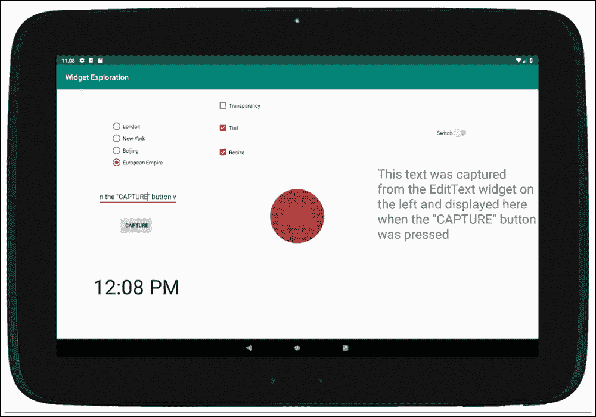
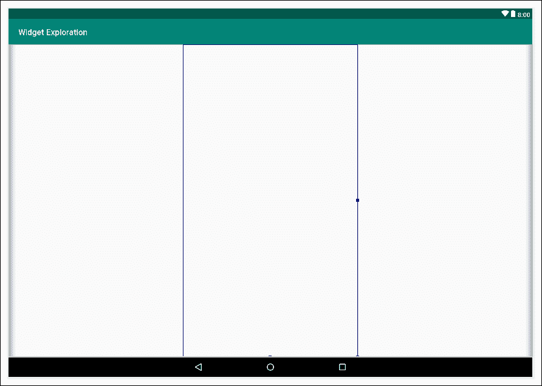
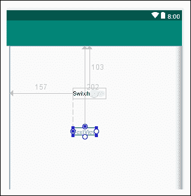
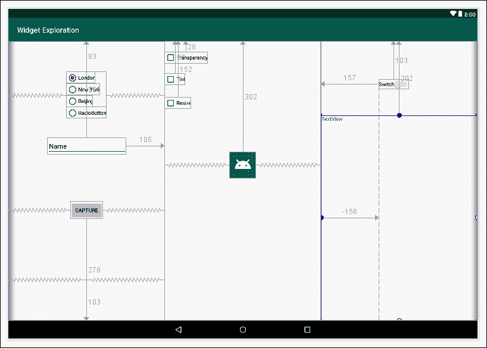
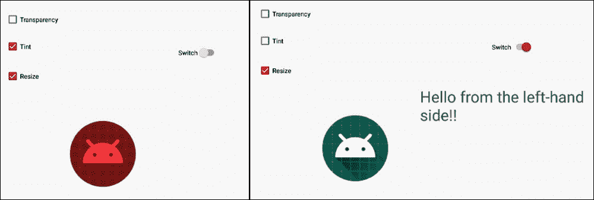

# 第十三章：让 Android 小部件活起来

现在我们对 Android 应用的布局和编码有了很好的概述，以及我们对面向对象编程（OOP）的新见解以及如何从 Kotlin 代码中操作 UI，我们准备从 Android Studio 调色板中尝试更多的小部件。

有时，面向对象编程是一件棘手的事情，本章介绍了一些对初学者来说可能很尴尬的话题。然而，通过逐渐学习这些新概念并反复练习，它们将随着时间成为我们的朋友。

在本章中，我们将通过回到 Android Studio 调色板并查看半打小部件来扩大范围，这些小部件我们要么根本没有见过，要么还没有完全使用过。

一旦我们这样做了，我们将把它们全部放入布局，并练习用我们的 Kotlin 代码操纵它们。

在本章中，我们将涵盖以下主题：

+   刷新我们对声明和初始化布局小部件的记忆

+   看看如何只用 Kotlin 代码创建小部件

+   看看`EditText`，`ImageView`，`RadioButton`（和`RadioGroup`），`Switch`，`CheckBox`和`TextClock`小部件

+   学习如何使用 lambda 表达式

+   使用所有前述小部件和大量 lambda 表达式制作小部件演示迷你应用程序

让我们先快速回顾一下。

# 声明和初始化来自布局的对象

我们知道当我们在`onCreate`函数中调用`setContentView`时，Android 会膨胀所有小部件和布局，并将它们转换为堆上的*真实*实例。

我们知道要使用来自堆的小部件，我们必须具有正确类型的对象，通过其唯一的`id`属性。有时，我们必须明确从布局中获取小部件。例如，要获取具有`id`属性`txtTitle`并将其分配给一个名为`myTextView`的新对象的`TextView`类的引用，我们可以这样做：

```kt
// Grab a reference to an object on the Heap
val myTextView = findViewById<TextView>(R.id.txtTitle)
```

`myTextView`实例声明的左侧应该对前三章中声明的其他类的实例都很熟悉。这里的新东西是我们依赖函数的返回值来提供实例。`findViewById`函数确实返回在膨胀布局时在堆上创建的实例。所需的实例由与布局中小部件的`id`属性匹配的函数参数标识。看起来奇怪的`<TextView>`语法是`TextView`的**转换**，因为函数返回超类类型`View`。

现在，使用我们的`myTextView`实例变量，我们可以做任何`TextView`类设计的事情；例如，我们可以设置文本如下所示：

```kt
myTextView.text = "Hi there"
```

然后，我们可以让它消失，就像这样：

```kt
// Bye bye
myTextView.visibility = View.GONE
```

现在再次更改其文本并使其重新出现，如下所示：

```kt
myTextView.text = "BOO!"

// Surprise
myTextView.visibility = View.VISIBLE
```

值得一提的是，我们可以在 Kotlin 中操纵任何在以前章节中使用 XML 代码设置的属性。此外，我们已经暗示过，但实际上还没有看到，我们可以只使用代码从无中创建小部件。

# 从纯 Kotlin 创建 UI 小部件而不使用 XML

我们还可以从不是指向布局中对象的 Kotlin 对象创建小部件。我们可以在代码中声明、实例化和设置小部件的属性，如下所示：

```kt
Val myButton = Button()
```

上述代码创建了一个新的`Button`实例。唯一的注意事项是`Button`实例必须是布局的一部分，才能被用户看到。因此，我们可以通过与以前使用`findViewById`函数相同的方式从 XML 布局中获取对布局元素的引用，或者可以在代码中创建一个新的布局。

假设我们的 XML 中有一个`id`属性等于`linearLayout1`的`LinearLayout`，我们可以将前一行代码中的`Button`实例合并到其中，如下所示：

```kt
// Get a reference to the LinearLayout
val linearLayout = 
   findViewById<LinearLayout>(R.id.linearLayout)

// Add our Button to it
linearLayout.addView(myButton)
```

我们甚至可以通过首先创建一个新布局，然后添加所有我们想要添加的小部件，最后在具有所需小部件的布局上调用`setContentView`来纯粹使用 Kotlin 代码创建整个布局。

在下面的代码片段中，我们使用纯 Kotlin 创建了一个布局，尽管它非常简单，只有一个`LinearLayout`内部有一个`Button`实例：

```kt
// Create a new LinearLayout
val linearLayout = LinearLayout()

// Create a new Button
val myButton = Button()

// Add myButton to the LinearLayout
linearLayout.addView(myButton)

// Make the LinearLayout the main view of the app
setContentView(linearLayout)
```

这可能是显而易见的，但仍然值得一提的是，仅使用 Kotlin 设计详细和微妙的布局会更加麻烦，更难以可视化，而且不是最常见的方式。然而，有时我们会发现以这种方式做事情是有用的。

现在我们已经相当高级了，涉及到布局和小部件。然而，很明显，调色板中还有许多其他小部件（和 UI 元素）我们尚未探索或交互（除了将它们放在布局中并没有做任何处理）；所以，让我们解决这个问题。

# 探索调色板-第一部分

让我们快速浏览一下调色板中以前未探索和未使用的项目，然后我们可以将其中一些拖放到布局中，看看它们可能具有的有用功能。然后我们可以实现一个项目来利用它们。

我们已经在上一章中探索了`Button`和`TextView`。现在让我们更仔细地看看它们旁边的一些小部件。

## EditText 小部件

`EditText`小部件就像其名称所示。如果我们向用户提供`EditText`小部件，他们确实可以编辑其中的文本。我们在早期章节中看到了这一点，但我们并没有做任何处理。我们没有看到的是如何捕获其中的信息，或者我们可以在哪里输入这个捕获文本的代码。

代码的下一个块假设我们已经声明了一个类型为`EditText`的对象，并使用它来获取 XML 布局中`EditText`小部件的引用。我们可能会为按钮点击编写类似以下代码的内容，也许是表单的“提交”按钮，但它可以放在我们应用程序中认为必要的任何地方：

```kt
val editTextContents = editText.text
// editTextContents now contains whatever the user entered
```

我们将在下一个应用程序中看到`EditText`小部件的真实情境。

## ImageView 小部件

到目前为止，我们已经在布局上放置了几次图像，但在代码中我们还没有引用过它，也没有做任何处理。获取`ImageView`小部件的引用的过程与获取其他小部件的引用相同：

1.  声明一个对象。

1.  使用`findViewById`函数和有效的`id`属性获取引用，如下所示：

```kt
val imageView = findViewById<ImageView>(R.id.imageView)
```

然后，我们可以使用类似以下的代码对图像进行一些有趣的操作：

```kt
// Make the image 50% TRANSPARENT
imageView.alpha = .5f
```

### 注意

看起来奇怪的`f`值只是让编译器知道该值是`Float`类型，这是`alpha`属性所需的。

在前面的代码中，我们使用了`imageView`的`alpha`属性。`alpha`属性需要一个介于 0 和 1 之间的值。0 表示完全透明，而 1 表示完全不透明。我们将在下一个应用程序中使用`ImageView`的一些功能。

## RadioButtons 和 RadioGroups

当用户需要从两个或多个互斥的选项中进行选择时，使用`RadioButton`小部件。这意味着选择一个选项时，其他选项将不被选择；就像在老式收音机上一样。请看下面截图中带有几个`RadioButton`小部件的简单`RadioGroup`小部件：


当用户做出选择时，其他选项将自动取消选择。我们通过将`RadioButton`小部件放置在 UI 布局中的`RadioGroup`小部件中来控制`RadioButton`小部件。当然，我们可以使用可视化设计工具简单地将一堆`RadioButtons`拖放到`RadioGroup`上。这样做时，XML 代码将如下所示：

```kt
<RadioGroup
   android:layout_width="match_parent"
   android:layout_height="match_parent"
   android:layout_alignParentTop="true"
   android:layout_alignParentLeft="true"
   android:layout_alignParentStart="true"
   android:id="@+id/radioGroup">

   <RadioButton
         android:layout_width="wrap_content"
         android:layout_height="wrap_content"
         android:text="Option 1"
         android:id="@+id/radioButton1"
         android:checked="true" />

   <RadioButton
         android:layout_width="wrap_content"
         android:layout_height="wrap_content"
         android:text="Option 2"
         android:id="@+id/radioButton2"
         android:checked="false" />

   <RadioButton
         android:layout_width="wrap_content"
         android:layout_height="wrap_content"
         android:text="Option 3"
         android:id="@+id/radioButton3"
         android:checked="false" />

<RadioGroup/>
```

请注意，正如前面的代码所强调的，每个`RadioButton`小部件和`RadioGroup`小部件都设置了适当的`id`属性。然后我们可以像预期的那样引用它们，如下面的代码所示：

```kt
// Get a reference to all our widgets
val radioGroup = 
   findViewById<RadioGroup>(R.id.radioGroup)

val rb1 = 
   findViewById<RadioButton>(R.id.radioButton1)

val rb2 = 
   findViewById<RadioButton> R.id.radioButton2)

val rb3 = 
   findViewById<RadioButton>(R.id.radioButton3)
```

然而，在实践中，我们几乎可以仅通过`RadioGroup`的引用来管理所有事情。

你可能会想知道他们何时被点击，或者跟踪哪一个被选中可能会很麻烦？我们需要一些来自 Android API 和 Kotlin 的帮助，以**lambda**的形式。

# Lambda

当`RadioButton`小部件是`RadioGroup`的一部分时，它们的视觉外观会被协调。我们所需要做的就是在任何给定的`RadioButton`小部件被按下时做出反应。当然，与任何其他按钮一样，我们需要知道它们何时被点击。

`RadioButton`小部件的行为与常规的`Button`小部件不同，只是在`onClick`中监听点击（在实现`OnClickListener`之后）是行不通的，因为`RadioButton`类不是设计成那样的。

我们需要做的是使用另一个 Kotlin 特性。我们需要一个特殊接口的实例，唯一的目的是监听`RadioGroup`上的点击。下面的代码块假设我们有一个名为`radioGroup`的`RadioGroup`实例的引用；以下是要检查的代码：

```kt
radioGroup.setOnCheckedChangeListener {
   group, checkedId ->
   // Handle the clicks here
}
```

前面的代码，特别是从其开头的大括号（`{`）到结束的大括号（`}`）的`setOnChekedChangeListener`，被称为 lambda。

Lambda 是一个广泛的话题，随着我们的进展，它们将进一步探讨。它们在 Kotlin 中用于避免不必要的输入。编译器知道`setOnCheckedChangeListener`需要一个特殊的接口作为参数，并在幕后为我们处理这个问题。此外，编译器知道该接口有一个我们必须重写的抽象函数。在大括号的开头和结尾之间的代码是我们实现函数的地方。看起来奇怪的`group, checkedId ->`参数是这个函数的参数。

为了进一步讨论的目的，假设前面的代码是在`onCreate`函数中编写的。请注意，当调用`onCreate`时，大括号内的代码不会运行；它只是准备好实例（`radioGroup`），以便它准备好处理任何点击。我们现在将更详细地讨论这一点。

### 注意

这个看不见的接口被称为**匿名**类。

我们正在向`radioGroup`添加一个监听器，这与我们在第十二章中实现`View.OnClickListener`的效果是非常相似的，只是这一次，我们声明并实例化了一个监听器接口，并准备让它监听`radioGroup`，同时重写所需的函数，这种情况下（虽然我们看不到名称），是`onCheckedChanged`。这就像`RadioGroup`中的`onClick`等效。

如果我们使用上面的代码来创建和实例化一个类，监听我们的`RadioGroup`的点击，在`onCreate`函数中，它将在整个 Activity 的生命周期内监听和响应。现在我们需要学习的是如何在我们重写的`onCheckedChanged`函数中处理点击。

### 提示

有些学生觉得前面的代码很简单，而其他人觉得有点压力山大。这并不是决定你如何看待它的智力水平的指标，而是你的大脑喜欢学习的方式。你可以用两种方式来处理本章的信息：

接受代码的工作，继续前进，并在以后的编程生涯中重新审视事物的工作原理。

坚持成为本章主题的专家，并在继续前进之前花费大量时间来掌握它们。

我强烈推荐选项 1。有些主题在理解其他主题之前是无法掌握的。但是，当你需要先介绍前者才能继续后者时，问题就会出现。如果你坚持要时刻完全掌握，问题就会变得循环和无法解决。有时，重要的是要接受表面下还有更多。如果你能简单地接受我们刚刚看到的代码确实在幕后起作用，并且花括号内的代码是单击单选按钮时发生的事情；那么，你就准备好继续了。现在你可以去搜索 lambda 表达式；但是，要准备好花费很多时间来学习理论。在本章和整本书中，我们将重点关注实际应用，再次讨论 lambda 表达式。

## 编写重写函数的代码

请注意，当`radioGroup`实例被按下时传入此函数的一个参数是`checkedId`。此参数是一个`Int`类型，并且它保存当前选定的`RadioButton`的`id`属性。这几乎正是我们需要的。

也许令人惊讶的是，`checkedId`是一个`Int`类型。即使我们用字母数字字符声明它们，如`radioButton1`或`radioGroup`，Android 也将所有 ID 存储为`Int`。

当应用程序编译时，所有我们熟悉的人性化名称都会转换为`Int`。那么，我们怎么知道`Int`类型是指`radioButton1`或`radioButton2`这样的 ID 呢？

我们需要做的是获取`Int`类型作为 ID 的实际对象的引用，使用`Int id`属性，然后询问对象其人性化的`id`值。我们将这样做：

```kt
val rb = group.findViewById<RadioButton>(checkedId)
```

现在我们可以使用`rb`中存储的引用来检索我们熟悉的`id`属性，该属性用于当前选定的`RadioButton`小部件，使用`id`属性的 getter 函数，如下所示：

```kt
rb.id
```

因此，我们可以通过使用`when`块处理`RadioButton`的点击，每个可能被按下的`RadioButton`都有一个分支，`rb.id`作为条件。

以下代码显示了我们刚刚讨论的`onCheckedChanged`函数的全部内容：

```kt
// Get a reference to the RadioButton 
// that is currently checked
val rb = group.findViewById<RadioButton>(checkedId)

// branch the code based on the 'friendly' id
when (rb.id) {

   R.id.radioButton1->
          // Do something here

   R.id.radioButton2->
          // Do something here

   R.id.radioButton3->
          // Do something here

}
// End when block
```

在下一个工作迷你应用程序中看到这一点的实际效果，我们可以按下按钮，这将使情况更加清晰。

让我们继续探索调色板。

# 探索调色板-第二部分，以及更多的 lambda。

现在我们已经看到了 lambda 和匿名类和接口如何工作，特别是与`RadioGroup`和`RadioButton`一起，我们现在可以继续探索调色板，并查看如何使用更多的 UI 小部件。

## `Switch`小部件

`Switch`小部件就像`Button`小部件一样，只是它有两个固定的状态，可以读取和响应。

`Switch`小部件的一个明显用途是显示和隐藏某些内容。还记得我们在第十二章的 Kotlin Meet UI 应用程序中使用`Button`来显示和隐藏`TextView`小部件吗？

每次我们隐藏或显示`TextView`小部件时，我们都会更改`Button`上的`text`属性，以表明如果再次单击它会发生什么。对于用户来说，以及对于我们作为程序员来说，更直观的做法可能是使用`Switch`小部件，如下面的屏幕截图所示：


以下代码假设我们已经有一个名为`mySwitch`的对象，它是布局中`Switch`对象的引用。我们可以像在第十二章中的*Kotlin Meet UI*应用程序中那样显示和隐藏`TextView`小部件。

监听并响应点击/切换，我们再次使用匿名类。然而，这次我们使用`CompoundButton`版本的`OnCheckedChangeListener`。与之前一样，这些细节是推断出来的，我们可以使用非常类似和简单的代码，就像处理单选按钮小部件时一样。

我们需要重写`onCheckedChanged`函数，该函数有一个`Boolean`参数`isChecked`。`isChecked`变量对于关闭是 false，对于打开是 true。

这是我们可以更直观地通过隐藏或显示代码来替换这段文字的方法：

```kt
mySwitch.setOnCheckedChangeListener{
   buttonView, isChecked->
      if(isChecked){
            // Currently visible so hide it
            txtValue.visibility = View.INVISIBLE

      }else{
            // Currently hidden so show it
            txtValue.visibility = View.VISIBLE
      }
}
```

如果匿名类或 lambda 代码看起来有点奇怪，不要担心，因为随着我们的使用，它会变得更加熟悉。现在我们再次看看`CheckBox`时，我们将这样做。

## 复选框小部件

使用`CheckBox`小部件，我们只需在特定时刻（例如在单击特定按钮时）检测其状态（选中或未选中）。以下代码让我们可以看到这可能会发生的情况，再次使用匿名类和 lambda 作为监听器：

```kt
myCheckBox.setOnCheckedChangeListener{   
   buttonView, isChecked->

   if (myCheckBox.isChecked) {
         // It's checked so do something
   } else {
         // It's not checked do something else
   }    
}
```

在先前的代码中，我们假设`myCheckBox`已经被声明和初始化，然后使用与我们用于`Switch`相同类型的匿名类来检测和响应点击。

## TextClock 小部件

在我们的下一个应用程序中，我们将使用`TextClock`小部件展示一些其特性。由于这个小部件无法从调色板中拖放，我们需要直接将 XML 代码添加到布局中。这就是`TextClock`小部件的样子：


作为使用`TextClock`的示例，这是我们将如何将其时间设置为与欧洲布鲁塞尔相同的时间：

```kt
tClock.timeZone = "Europe/Brussels"
```

先前的代码假设`tClock`是布局中`TextClock`小部件的引用。

有了所有这些额外的信息，让我们制作一个应用程序，比我们迄今为止所做的更实用地使用 Android 小部件。

# 小部件探索应用程序

我们刚刚讨论了六个小部件——`EditText`、`ImageView`、`RadioButton`（和`RadioGroup`）、`Switch`、`CheckBox`和`TextClock`。让我们制作一个可用的应用程序，并对每个小部件进行一些实际操作。我们还将再次使用`Button`小部件和`TextView`小部件。

在此布局中，我们将使用`LinearLayout`作为容纳一切的布局类型，并在`LinearLayout`内部使用多个`RelativeLayout`实例。

`RelativeLayout`已被`ConstraintLayout`取代，但它们仍然常用，并且值得尝试。当您在`RelativeLayout`中构建布局时，您会发现 UI 元素的行为与`ConstraintLayout`非常相似，但底层的 XML 不同。不需要详细了解这个 XML，而是使用`RelativeLayout`将允许我们展示 Android Studio 如何使您能够将这些布局转换为`ConstraintLayout`的有趣方式。

请记住，您可以参考下载包中的完整代码。此应用程序可以在`Chapter13/Widget Exploration`文件夹中找到。

## 设置小部件探索项目和 UI

首先，我们将设置一个新项目并准备 UI 布局。这些步骤将在屏幕上放置所有小部件并设置`id`属性，准备好引用它们。在开始之前，看一下目标布局并运行它会有所帮助，如下截图所示：



这个应用程序将演示这些小部件的工作原理：

+   单选按钮允许用户更改显示在时钟上的时间，以选择四个时区中的一个。

+   单击**Capture**按钮将更改右侧`TextView`小部件的`text`属性为当前左侧`EditText`小部件中的内容。

+   这三个`CheckBox`小部件将向 Android 机器人图像添加和删除视觉效果。在先前的截图中，图像被调整大小（变大）并应用了颜色着色。

+   `Switch`小部件将打开和关闭`TextView`小部件，后者显示在`EditText`小部件中输入的信息（在单击按钮时捕获）。

确切的布局位置并不重要，但指定的`id`属性必须完全匹配。因此，让我们执行以下步骤来设置一个新项目并准备 UI 布局：

1.  创建一个名为`Widget Exploration`的新项目，并使用**空活动**项目模板及其通常的设置，除了一个小改变。将**最低 API 级别**选项设置为`API 17：Android 4.2（Jelly Bean）`，并将所有其他设置保持为默认设置。我们使用 API 17 是因为`TextClock`小部件的一个功能需要我们这样做。我们仍然支持超过 98%的所有 Android 设备。

1.  让我们创建一个新的布局文件，因为我们希望我们的新布局基于`LinearLayout`。在项目资源管理器中右键单击`layout`文件夹，然后从弹出菜单中选择**新建** | **布局资源文件**。

1.  在**新资源文件**窗口中，在**文件名**字段中输入`exploration_layout.xml`，然后在**根元素**字段中输入`LinearLayout`；现在点击**确定**。

1.  在**属性**窗口中，将`LinearLayout`的`orientation`属性更改为**horizontal**。

1.  使用设计视图上方的下拉控件，确保选择了横向方向的平板电脑。

### 注意

如需了解如何创建平板电脑模拟器，请参阅第三章*探索 Android Studio 和项目结构*。如需关于如何操作模拟器方向的建议，请参阅第五章*使用 CardView 和 ScrollView 创建美观布局*。

1.  现在我们可以开始创建我们的布局。从工具栏的**Legacy**类别中将三个**RelativeLayout**布局拖放到设计中，以创建我们设计的三个垂直分区。在这一步骤中，您可能会发现使用**组件树**窗口更容易。

1.  依次为每个`RelativeLayout`小部件设置**weight**属性为`.33`。现在我们有了三个相等的垂直分区，就像下面的截图一样：

1.  检查**组件树**窗口是否如下截图所示：

### 注意

如果您想使用`ConstraintLayout`而不是`RelativeLayout`，那么以下说明将几乎相同。只需记住通过单击**推断约束**按钮或手动设置约束来设置 UI 的最终位置，如第四章*开始使用布局和 Material Design*中所讨论的那样。或者，您可以按照本教程中详细说明的方式构建布局，并使用稍后在本章中讨论的**转换为 Constraint 布局**功能。这对于使用您已有并希望使用的布局非常有用，但更倾向于使用运行速度更快的`ConstraintLayout`。

1.  将一个**Switch**小部件拖放到右侧`RelativeLayout`小部件的顶部中心位置，然后在其下方从工具栏中拖放一个**TextView**。您的布局右侧现在应如下截图所示：

1.  将三个**CheckBox**小部件依次拖放在一起，然后将一个**ImageView**小部件拖放到它们下方的中央`RelativeLayout`上。在弹出的**资源**对话框中，选择**项目** | **ic_launcher**以将 Android 图标用作`ImageView`小部件的图像。中央列现在应如下所示：

1.  将一个**RadioGroup**小部件拖放到左侧的`RelativeLayout`上。

1.  在**RadioGroup**小部件内添加四个**RadioButton**小部件。使用**组件树**窗口可以更轻松地完成此步骤。

1.  在**RadioGroup**小部件下方，从调色板的**文本**类别中拖动一个**纯文本**小部件。请记住，尽管它的名字是这样，但这是一个允许用户在其中输入一些文本的小部件。很快，我们将看到如何捕获和使用输入的文本。

1.  在**纯文本**小部件的右侧添加一个**Button**小部件。您的左侧`RelativeLayout`应如下截图所示：

此时**组件树**窗口将如下截图所示：


1.  现在我们可以开始使用所有这些小部件与我们的 Kotlin 代码。现在为刚刚布置的小部件添加以下属性： 

### 注意

| CheckBox (top) | id | `checkBoxTransparency` |

| Widget type | Property | 要设置的值 |
| --- | --- | --- |
| RadioGroup | `id` | `radioGroup` |
| 请注意，一些属性可能已经默认正确。 |
| RadioButton (top) | `text` | `London` |
| RadioButton (top) | `checked` | 选择“勾”图标为 true |
| RadioButton (second) | `id` | `radioButtonBeijing` |
| RadioButton (second) | `text` | `Beijing` |
| RadioButton (third) | `id` | `radioButtonNewYork` |
| RadioButton (third) | `text` | `New York` |
| CheckBox (bottom) | id | `checkBoxReSize` |
| RadioButton (bottom) | text | `European Empire` |
| EditText | id | `editText` |
| Button | id | `button` |
| Button | text | `Capture` |
| CheckBox (top) | text | `Transparency` |
| RadioButton (bottom) | id | `radioButtonEuropeanEmpire` |
| CheckBox (middle) | text | `Tint` |
| CheckBox (middle) | id | `checkBoxTint` |
| CheckBox (bottom) | text | `Resize` |
|  |
| ImageView | id | `imageView` |
| Switch | id | `switch1` |
| Switch | enabled | 选择“勾”图标为 true |
| Switch | clickable | 选择“勾”图标为 true |
| TextView | id | `textView` |
| TextView | textSize | `34sp` |
| TextView | layout_width | `match_parent` |
| TextView | layout_height | `match_parent` |

1.  现在切换到**文本**选项卡，查看布局的 XML 代码。找到第一个（左侧）`RelativeLayout`列的末尾，如下面的代码清单所示。我已经在下面的代码中添加了一个 XML 注释并对其进行了突出显示：

```kt
...
...
   </RadioGroup>

   <EditText
         android:id="@+id/editText2"
         android:layout_width="wrap_content"
         android:layout_height="wrap_content"
         android:layout_alignParentTop="true"
         android:layout_alignParentEnd="true"
         android:layout_marginTop="263dp"
         android:layout_marginEnd="105dp"
         android:ems="10"
         android:inputType="textPersonName"
         android:text="Name" />

   <Button
         android:id="@+id/button2"
         android:layout_width="wrap_content"
         android:layout_height="wrap_content"
         android:layout_alignParentBottom="true"
         android:layout_centerHorizontal="true"
         android:layout_marginBottom="278dp"
         android:text="Button" />

   <!-- Insert TextClock here-->

</RelativeLayout>
```

1.  在`<!--Insert TextClock Here-->`注释之后，插入以下`TextClock`小部件的 XML 代码。请注意，注释是我在上一个清单中添加的，以指示您放置代码的位置。您的代码中不会出现该注释。我们之所以这样做是因为`TextClock`不能直接从调色板中获取。以下是在注释之后添加的代码：

```kt
<TextClock
   android:id="@+id/textClock"
   android:layout_width="wrap_content"
   android:layout_height="wrap_content"
   android:layout_alignParentBottom="true"
   android:layout_centerHorizontal="true"
   android:layout_gravity="center_horizontal"
   android:layout_marginBottom="103dp" 
   android:textSize="54sp" />
```

1.  切换到**设计**选项卡，并调整布局，使其尽可能接近以下参考图表，但如果您具有正确的 UI 类型和正确的`id`属性，则即使布局不完全相同，代码仍将正常工作：

我们刚刚设置了布局所需的属性。除了一些小部件类型对我们来说是新的，布局稍微更加复杂之外，我们并没有做过什么新的事情。

| RadioButton (top) | `id` | `radioButtonLondon` |

# 编写小部件探索应用程序

我们需要更改的 Kotlin 代码的第一部分是确保我们的新布局被显示出来。我们可以通过将`onCreate`函数中对`setContentView`函数的调用更改为以下内容来实现：

```kt
setContentView(R.layout.exploration_layout)
```

这个应用程序需要很多`import`语句，所以让我们一开始就把它们全部添加上，以免在进行过程中不断提到它们。添加以下`import`语句：

```kt
import androidx.appcompat.app.AppCompatActivity
import android.graphics.Color
import android.os.Bundle
import android.view.View
import android.widget.CompoundButton
import android.widget.RadioButton
import kotlinx.android.synthetic.main.exploration_layout.*

```

前面的代码还包括`…exploration_layout.*`代码（如前面的代码中所突出显示的）以自动启用我们刚刚配置的`id`属性作为我们 Kotlin 代码中的实例名称。这样可以避免多次使用`findViewByID`函数。这种方式并不总是可行的，有时需要知道如何使用`findViewByID`函数，就像我们在“在布局部分声明和初始化对象”中讨论的那样。

## 编码 CheckBox 小部件

现在我们可以创建一个 lambda 来监听和处理复选框的点击。以下三个代码块依次实现了每个复选框的匿名类。然而，它们各自不同的地方在于我们如何响应点击，我们将依次讨论每一个。

### 改变透明度

第一个复选框标记为**Transparency**，我们使用`imageView`实例上的`alpha`属性来改变其透明度。`alpha`属性需要一个介于 0 和 1 之间的浮点值作为参数。

0 是不可见的，1 完全不透明。因此，当选中此复选框时，我们将`alpha`属性设置为`.1`，使图像几乎不可见；然后，当取消选中时，我们将其设置为`1`，即完全可见且没有透明度。`onCheckedChanged`函数的`Boolean isChecked`参数包含一个 true 或 false 值，表示复选框是否被选中。

在`onCreate`函数中的`setContentView`函数调用之后添加以下代码：

```kt
// Listen for clicks on the button,
// the CheckBoxes and the RadioButtons

// setOnCheckedChangeListener requires an interface of type
// CompoundButton.OnCheckedChangeListener. In turn this interface
// has a function called onCheckedChanged
// It is all handled by the lambda
checkBoxTransparency.setOnCheckedChangeListener({
   view, isChecked ->
      if (isChecked) {
         // Set some transparency
         imageView.alpha = .1f
      } else {
         // Remove the transparency
         imageView.alpha = 1f
      }
})
```

在下一个匿名类中，我们处理标记为**Tint**的复选框。

### 改变颜色

在`onCheckedChanged`函数中，我们使用`setColorFilter`函数在`imageView`上叠加一个颜色层。当`isChecked`为 true 时，我们叠加一个颜色，当`isChecked`为 false 时，我们移除它。

`setColorFilter`函数以**ARGB**（**alpha**，**red**，**green**和**blue**）格式的颜色作为参数。颜色由`Color`类的`argb`函数提供。`argb`函数的四个参数分别是 alpha、red、green 和 blue 的值。这四个值创建了一种颜色。在我们的例子中，`150, 255, 0, 0`的值创建了强烈的红色色调，而`0, 0, 0, 0`的值则完全没有色调。

### 提示

要了解更多关于`Color`类的信息，请访问 Android 开发者网站：[`developer.android.com/reference/android/graphics/Color.html`](http://developer.android.com/reference/android/graphics/Color.html)，要更多了解 RGB 颜色系统，请查看维基百科：[`en.wikipedia.org/wiki/RGB_color_model`](https://en.wikipedia.org/wiki/RGB_color_model)。

在`onCreate`函数中的上一个代码块之后添加以下代码：

```kt
checkBoxTint.setOnCheckedChangeListener({
   view, isChecked ->
   if (isChecked) {
      // Checked so set some tint
      imageView.setColorFilter(Color.argb(150, 255, 0, 0))
   } else {
      // No tint required
      imageView.setColorFilter(Color.argb(0, 0, 0, 0))
   }
})
```

现在我们将看到如何通过调整`ImageView`小部件的大小来缩放 UI。

### 改变大小

在处理**Resize**标记的复选框的匿名类中，我们使用`scaleX`和`scaleY`属性来调整机器人图像的大小。当我们将`scaleX`设置为 2，`scaleY`设置为 2 时，我们将使图像的大小加倍，而将值设置为 1 将使图像恢复到其正常大小。

在`onCreate`函数中的上一个代码块之后添加以下代码：

```kt
checkBoxReSize.setOnCheckedChangeListener({
   view, isChecked ->
   if (isChecked) {
      // It's checked so make bigger
      imageView.scaleX = 2f
      imageView.scaleY = 2f
   } else {
      // It's not checked make regular size
      imageView.scaleX = 1f
      imageView.scaleY = 1f
   }
})
```

现在我们将处理这三个单选按钮。

## 编码 RadioButton 小部件

由于它们是`RadioGroup`小部件的一部分，我们可以处理它们比处理`CheckBox`对象时更简洁。

首先，我们通过在`radioGroup`实例上调用`clearCheck()`来确保它们一开始是清除的。然后，我们创建了`OnCheckedChangeListener`类型的匿名类，并重写了`onCheckedChanged`函数，使用了一个简短而甜美的 lambda。

当从 RadioGroup 小部件中点击任何`RadioButton`时，将调用此函数。我们需要做的就是获取被点击的`RadioButton`小部件的`id`属性，并做出相应的响应。我们将使用`when`语句来实现三条可能的执行路径 - 每个`RadioButton`小部件对应一条。

请记住，当我们首次讨论`RadioButton`时，在`onCheckedChanged`的`checkedId`参数中提供的`id`属性是`Int`类型。这就是为什么我们必须首先从`checkedId`创建一个新的`RadioButton`对象的原因：

```kt
val rb = group.findViewById<View>(checkedId) as RadioButton
```

然后，我们可以使用新的`RadioButton`对象的`id`属性的 getter 作为`when`的条件，如下所示：

```kt
when (rb.id) {
   …
```

然后，在每个分支中，我们使用`timeZone`属性的 setter，并将正确的 Android 时区代码作为参数。

### 提示

您可以在[`gist.github.com/arpit/1035596`](https://gist.github.com/arpit/1035596)上查看所有 Android 时区代码。

添加以下代码，其中包含我们刚刚讨论的所有内容。将其添加到处理复选框的先前代码之后的`onCreate`函数中：

```kt
// Now for the radio buttons
// Uncheck all buttons
radioGroup.clearCheck()

radioGroup.setOnCheckedChangeListener {
   group, checkedId ->
   val rb = group.findViewById<View>(checkedId) as RadioButton

   when (rb.id) {
      R.id.radioButtonLondon ->
         textClock.timeZone = "Europe/London"

      R.id.radioButtonBeijing ->
         textClock.timeZone = "CST6CDT"

      R.id.radioButtonNewYork ->
         textClock.timeZone = "America/New_York"

      R.id.radioButtonEuropeanEmpire ->
         textClock.timeZone = "Europe/Brussels"
   }
}
```

现在是时候尝试一些稍微新的东西了。

### 使用 lambda 来处理常规 Button 小部件的点击

在我们将要编写的下一个代码块中，我们将使用 lambda 来实现一个匿名类来处理常规`Button`小部件的点击。我们调用`button.setOnclickListener`，就像我们之前做过的那样。但是这一次，我们不是将`this`作为参数传递，而是创建一个全新的`View.OnClickListener`类型的类，并覆盖`onClick`函数作为参数，就像我们之前的其他匿名类一样。与我们之前的类一样，代码是被推断的，我们有简短、简洁的代码，其中我们的代码没有被太多的细节所淹没。

### 提示

在这种情况下，这种方法是可取的，因为只有一个按钮。如果我们有很多按钮，那么让`MainActivity`实现`View.OnClickListener`，然后覆盖`onClick`以处理所有点击的函数可能更可取，就像我们之前做过的那样。

在`onClick`函数中，我们使用`text`属性的 setter 来设置`textView`上的`text`属性，然后使用`editText`实例的`text`属性的 getter 来获取用户在`EditText`小部件中输入的任何文本（如果有的话）。

在`onCreate`函数中的上一个代码块之后添加以下代码：

```kt
/*
   Let's listen for clicks on our "Capture" Button.
   The compiler has worked out that the single function
   of the required interface has a single parameter.
   Therefore, the syntax is shortened (->) is removed
   and the only parameter, (should we have needed it)
   is declared invisibly as "it"
*/
button.setOnClickListener {
   // it... accesses the view that was clicked

   // We want to act on the textView and editText instances
   // Change the text on the TextView
   // to whatever is currently in the EditText
   textView.text = editText.text
}
```

接下来，我们将处理 Switch 小部件。

### 编写 Switch 小部件的代码

接下来，我们将创建另一个匿名类来监听和处理我们的`Switch`小部件的更改。

当`isChecked`变量为`true`时，我们显示`TextView`小部件，当它为 false 时，我们隐藏它。

在`onCreate`函数中的上一个代码块之后添加以下代码：

```kt
// Show or hide the TextView
switch1.setOnCheckedChangeListener {
   buttonView, isChecked ->
   if (isChecked) {
      textView.visibility = View.VISIBLE
   } else {
      textView.visibility = View.INVISIBLE
   }
}
```

现在我们可以运行我们的应用程序并尝试所有功能。

### 提示

在 Windows 上，可以通过按*Ctrl* +*F11*键组合或在 macOS 上按*Ctrl* +*fn*+*F11*将 Android 模拟器旋转为横向模式。

# 运行 Widget Exploration 应用程序

尝试选中单选按钮，看看时区在时钟上的变化。在下面的图片中，我用 Photoshop 剪裁了一些截图，以显示选择新时区时时间的变化：


在`EditText`小部件中输入不同的值，然后单击按钮，以查看它获取文本并在自身上显示它，就像本教程开头的截图中演示的那样。

通过使用上面的`Switch`小部件，通过不同的复选框的选中和未选中的组合以及显示和隐藏`TextView`小部件来改变应用程序中的图像。以下截图显示了两种复选框和开关小部件的组合，用于演示目的：



### 提示

透明度在印刷书中并不是很清晰，所以我没有勾选那个框。一定要在模拟器或真实设备上试一下。

# 将布局转换为 ConstraintLayout

最后，正如承诺的那样，这就是我们如何将布局转换为运行更快的`ConstraintLayout`：

1.  切换回**设计**选项卡

1.  右键单击父布局 - 在这种情况下是`LinearLayout` - 并选择**将 LinearLayout 转换为 ConstraintLayout**，如下面的截图所示：

现在你可以将任何旧的`RelativeLayout`布局转换为更新更快的`ConstraintLayout`小部件，同时构建你自己的`RelativeLayout`。

# 总结

在本章中，我们学到了很多。除了探索了大量的小部件，我们还学会了如何在 Kotlin 代码中实现小部件而不需要任何 XML，我们使用了我们的第一个匿名类，使用简短、简洁的代码形式的 lambda 来处理小部件的点击，我们将所有新的小部件技能都应用到了一个工作中的应用程序中。

现在让我们继续看另一种显著增强我们 UI 的方法。

在下一章中，我们将看到一个全新的 UI 元素，我们不能只从调色板中拖放，但我们仍然会得到来自 Android API 的大量帮助。我们将学习有关**对话框窗口**的知识。我们还将开始制作迄今为止最重要的应用程序，名为 Note to self。这是一个备忘录、待办事项和个人笔记应用程序。
