# 第十四章：Android 对话框窗口

在本章中，我们将学习如何向用户呈现弹出式对话框窗口。然后，我们可以将我们所知道的一切放入我们的第一个多章节应用程序*Note to self*的第一阶段。然后，我们将在本章和接下来的四章（直到第十八章，*本地化*）中学习更多关于 Android 和 Kotlin 的特性，然后使用我们新获得的知识来增强 Note to self 应用程序。

在每一章中，我们还将构建一系列与主要应用程序分开的较小的应用程序。那么，第十四章*Android 对话框窗口*对你有什么期待呢？本章将涵盖以下主题：

+   实现一个带有弹出式对话框的简单应用程序

+   学习如何使用`DialogFragment`来开始 Note to self 应用程序

+   启动 Note to self 应用程序，并学习如何在项目中添加字符串资源，而不是在布局中硬编码文本

+   实现更复杂的对话框以捕获用户输入

那么，让我们开始吧。

# 对话框窗口

在我们的应用程序中，我们经常会想要向用户显示一些信息，或者询问是否确认弹出窗口中的操作。这就是所谓的**对话框**窗口。如果你快速浏览一下 Android Studio 的调色板，你可能会惊讶地发现根本没有提到对话框窗口。

Android 中的对话框窗口比简单的小部件甚至整个布局更高级。它们是可以拥有自己的布局和其他 UI 元素的类。

在 Android 中创建对话框窗口的最佳方式是使用`DialogFragment`类。

### 提示

片段在 Android 中是一个广泛而重要的主题，我们将在本书的后半部分花费大量时间来探索和使用它们。然而，为我们的用户创建一个整洁的弹出式对话框（使用`DialogFragment`）是对片段的一个很好的介绍，并且一点也不复杂。

## 创建对话框演示项目

我们之前提到，在 Android 中创建对话框窗口的最佳方式是使用`DialogFragment`类。然而，在 Android 中创建对话框的另一种方式可能会更简单一些。这种更简单的`Dialog`类的问题在于它在 Activity 生命周期中的支持不是很好。甚至可能会导致应用程序意外崩溃。

如果你正在编写一个只需要一个简单弹出式对话框的固定方向布局的应用程序，可以说应该使用更简单的`Dialog`类。但是，由于我们的目标是构建具有先进功能的现代专业应用程序，因此忽略这个类将会使我们受益匪浅。

在 Android Studio 中使用**空活动**项目模板创建一个名为`Dialog Demo`的新项目。该项目的完成代码位于下载包的`Chapter14/Dialog Demo`文件夹中。

## 编写 DialogFragment 类

通过右键单击包含`MainActivity.kt`文件的包名称的文件夹，在 Android Studio 中创建一个新的类。选择**新建** | **Kotlin 文件/类**，命名为`MyDialog`，并在下拉选择器中选择**类**。单击**确定**以创建类。

你需要做的第一件事是将类声明更改为继承自`DialogFragment`。此外，让我们添加在这个类中需要的所有导入。当你这样做后，你的新类将如下所示：

```kt
import android.app.Dialog
import android.os.Bundle
import androidx.appcompat.app.AlertDialog
import androidx.fragment.app.DialogFragment

class MyDialog : DialogFragment() {    
}
```

现在，让我们一点一点地向这个类添加代码，并解释每一步发生了什么。

与 Android API 中的许多类一样，`DialogFragment`为我们提供了可以重写以与类中发生的不同事件交互的函数。

添加覆盖`onCreateDialog`函数的以下突出显示的代码。仔细研究它，然后我们将检查发生了什么：

```kt
class MyDialog : DialogFragment() {

    override
 fun onCreateDialog(savedInstanceState: Bundle?): Dialog {

 // Use the Builder class because this dialog
 // has a simple UI.
 // We will use the more flexible onCreateView function
 // instead of onCreateDialog in the next project
 val builder = AlertDialog.Builder(this.activity!!)

 // More code here soon
 }
}
```

### 注意

代码中有一个错误，因为我们缺少返回语句，需要返回一个`Dialog`类型的对象。我们将在完成函数的其余部分编码后添加这个返回语句。

在我们刚刚添加的代码中，我们首先添加了重写的`onCreateDialog`函数，当我们稍后使用`MainActivity`类的代码显示对话框时，Android 将调用它。

然后，在`onCreateDialog`函数内部，我们得到了一个新类的实例。我们声明并初始化了一个`AlertDialog.Builder`类型的对象，它需要一个对`MainActivity`类的引用传递给它的构造函数。这就是为什么我们使用`activity!!`作为参数；我们断言该实例不为空（!!）。

### 提示

参考第十二章，“将我们的 Kotlin 连接到 UI 和可空性”，了解非空断言（!!）的用法。

`activity`属性是`Fragment`类（因此也是`DialogFragment`）的一部分，它是一个对将创建`DialogFragment`实例的`Activity`类实例的引用。在这种情况下，这是我们的`MainActivity`类。

现在我们已经声明并初始化了`builder`，让我们看看我们可以用它做什么。

### 使用链接来配置 DialogFragment 类

现在我们可以使用我们的`builder`对象来完成其余的工作。在接下来的三个代码块中有一些略微奇怪的地方。如果你往前看并快速扫描它们，你会注意到有三次使用了点运算符，但只有一次使用是实际放在`builder`对象旁边的。这表明这三个明显的代码块实际上只是编译器的一行代码。

我们之前已经见过这里发生的事情，但情况没有那么明显。当我们创建一个`Toast`消息并在其末尾添加`.show()`调用时，我们正在**链接**。也就是说，我们在同一个对象上按顺序调用多个函数。这相当于编写多行代码；只是这样更清晰、更简洁。

在`onCreateDialog`中添加这段代码，它利用了链接，然后我们将讨论它：

```kt
// Dialog will have "Make a selection" as the title
builder.setMessage("Make a selection")
   // An OK button that does nothing
   .setPositiveButton("OK", { dialog, id ->
      // Nothing happening here
   })
   // A "Cancel" button that does nothing
   .setNegativeButton("Cancel", { dialog, id ->
      // Nothing happening here either
   })
```

我们添加的代码的三个部分可以解释如下：

1.  在使用链接的三个代码块中的第一个中，我们调用`builder.setMessage`，它设置用户在对话框中看到的主要消息。另外，需要注意的是，在链接函数调用的不同部分之间添加注释是可以的，因为编译器完全忽略这些注释。

1.  然后，我们使用`setPositiveButton`函数向对话框添加一个按钮，第一个参数将其文本设置为`OK`。第二个参数是一个实现`DialogInterface.OnClickListener`的 lambda，用于处理按钮的点击。请注意，我们不会在`onClick`函数中添加任何代码，但我们可以，就像我们在上一章中所做的那样。我们只是想看到这个简单的对话框，我们将在下一个项目中进一步进行。

1.  接下来，我们在同一个`builder`对象上调用另一个函数。这次是`setNegativeButton`函数。同样，两个参数将`Cancel`设置为按钮的文本，使用 lambda 来设置监听点击。同样，为了这个演示的目的，我们不会在重写的`onClick`函数中执行任何操作。

接下来，我们将编写`return`语句以完成函数并移除错误。在`onCreateDialog`函数的最后（但保持在最终大括号内部）添加`return`语句：

```kt
   // Create the object and return it
   return builder.create()
}// End of onCreateDialog
```

这行代码的最后效果是将我们新的、完全配置好的对话框窗口返回给`MainActivity`（它首先会调用`onCreateDialog`）。我们很快将看到并添加这个调用代码。

现在我们有了从`FragmentDialog`继承的`MyDialog`类，我们所要做的就是声明`MyDialog`的一个实例，实例化它，并调用它重写的`onCreateDialog`函数。

## 使用 DialogFragment 类

在转向代码之前，让我们通过以下步骤向我们的布局添加一个按钮：

1.  切换到`activity_main.xml`选项卡，然后切换到**Design**选项卡。

1.  将**Button**小部件拖放到布局中，并确保其`id`属性设置为`button`。

1.  单击**推断约束**按钮，将按钮约束到您放置的位置，但位置并不重要；我们将如何使用它来创建我们的`MyDialog`类的实例是关键的教训。

现在切换到`MainActivity.kt`选项卡，我们将使用 lambda 来处理新按钮的点击，就像我们在第十三章中所做的那样，在 Widget 探索应用程序中。我们这样做是因为布局中只有一个按钮，这种方式似乎比另一种方式更明智和更紧凑（即实现`OnClickListener`接口，然后在整个`MainActivity`类中重写`onClick`，就像我们在第十二章中所做的那样，*将我们的 Kotlin 连接到 UI 和可空性*）。

在`MainActivity`的`onCreate`函数中添加以下代码，放在`setContentView`调用之后：

```kt
val button = findViewById<Button>(R.id.button)
// We could have removed the previous line of code by
// adding the ...synthetic.main.activity_main.* import
// as an alternative

button.setOnClickListener {
   val myDialog = MyDialog()
   myDialog.show(supportFragmentManager, "123")
   // This calls onCreateDialog
   // Don't worry about the strange looking 123
   // We will find out about this in chapter 18
}
```

### 注意

需要以下`import`语句来支持此代码：

```kt
import android.widget.Button;
```

请注意，代码中唯一发生的事情是`setOnClickListener` lambda 覆盖了`onClick`。这意味着当按钮被按下时，将创建`MyDialog`的一个新实例并调用其`show`函数，该函数将显示我们在`MyDialog`类中配置的对话框窗口。

`show`函数需要一个对`FragmentManager`的引用，我们从`supportFragmentManager`属性中获取。这是跟踪和控制`Activity`实例的所有片段实例的类。我们还传入一个 ID（`"123"`）。

更多关于`FragmentManager`的细节将在我们更深入地研究片段时揭示，从第二十四章开始，*设计模式、多个布局和片段*。

### 注意

我们使用`supportFragmentManager`属性的原因是因为我们通过扩展`AppCompatActivity`来支持旧设备。如果我们简单地扩展`Activity`，那么我们可以使用`fragmentManager`属性。缺点是该应用程序将无法在许多旧设备上运行。

现在我们可以运行应用程序，并欣赏我们点击布局中的按钮时出现的新对话框窗口。请注意，单击对话框窗口中的任一按钮都将关闭它；这是默认行为。以下屏幕截图显示了我们的对话框窗口在平板模拟器上的运行情况：

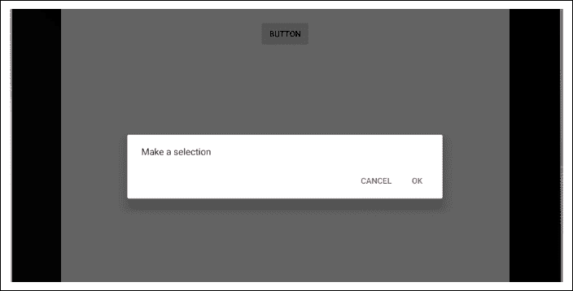

接下来，我们将制作另外两个实现对话框的类，作为我们多章节备忘录应用程序的第一阶段。我们将看到对话框窗口几乎可以有我们选择的任何布局，并且我们不必依赖`Dialog.Builder`类提供给我们的简单布局。

# 备忘录应用程序

欢迎来到本书中我们将实现的多章应用程序中的第一个。在做这些项目时，我们将比做较小的应用程序更专业。在这个项目中，我们将使用字符串资源而不是在布局中硬编码文本。

有时，当您尝试学习新的 Android 或 Kotlin 主题时，这些东西可能会过度，但它们对于尽快在真实项目中开始使用是有用且重要的。它们很快就会变得像第二天性一样，我们的应用程序质量将受益于此。

## 使用字符串资源

在第三章*探索 Android Studio 和项目结构*中，我们讨论了在布局文件中使用字符串资源而不是硬编码文本。这样做有一些好处，但也稍微冗长。

由于这是我们的第一个多章节项目，现在是做正确的时候。如果您想快速了解字符串资源的好处，请参阅第三章*探索 Android Studio 和项目结构*。

## 如何获取 Note to self 应用程序的代码文件

完全完成的应用程序，包括所有的代码和资源，可以在下载包的`Chapter18/Note to self`文件夹中找到。由于我们将在接下来的五章中实施这个应用程序，因此在每一章结束时查看部分完成的可运行应用程序也是有用的。部分完成的可运行应用程序及其所有相关的代码和资源可以在各自的文件夹中找到：

`Chapter14/Note to self`

`Chapter16/Note to self`

`Chapter17/Note to self`

`Chapter18/Note to self`

### 注意

在第十五章*处理数据和生成随机数*中没有 Note to self 的代码，因为虽然我们会学习一些在 Note to self 中使用的主题，但直到第十六章*适配器和回收器*，我们才对应用程序进行更改。

请注意，每个文件夹都包含一个独立的可运行项目，并且也包含在自己独特的包中。这样你就可以很容易地看到应用程序在完成给定章节后的运行情况。在复制和粘贴代码时，要小心不要包括包名称，因为它可能与您的包名称不同，导致代码无法编译。

如果您正在跟着做，并打算从头到尾构建 Note to self，我们将简单地构建一个名为`Note to self`的项目。然而，您仍然可以随时查看每个章节的项目文件中的代码，进行一些复制和粘贴。只是不要复制文件顶部的包指令。另外，请注意，在说明书的几个地方，您将被要求删除或替换前几章的偶尔一行代码。

因此，即使您复制和粘贴的次数多于输入代码的次数，请务必完整阅读说明，并查看书中的代码，以获取可能有用的额外注释。

在每一章中，代码将被呈现为如果您已经完全完成上一章，将显示来自早期章节的代码，必要时作为新代码的上下文。

每一章都不会完全致力于 Note to self 应用程序。我们还将学习其他相关内容，并构建一些更小更简单的应用程序。因此，当我们开始实施 Note to self 时，我们将在技术上做好准备。

## 完成的应用程序

以下功能和屏幕截图来自完成的应用程序。在开发的各个阶段，它显然会略有不同。必要时，我们将查看更多图像，作为提醒，或者查看开发过程中的差异。

完成的应用程序将允许用户点击应用程序右下角的浮动按钮图标，打开一个对话框窗口以添加新的便签。以下屏幕截图显示了这个突出的功能：

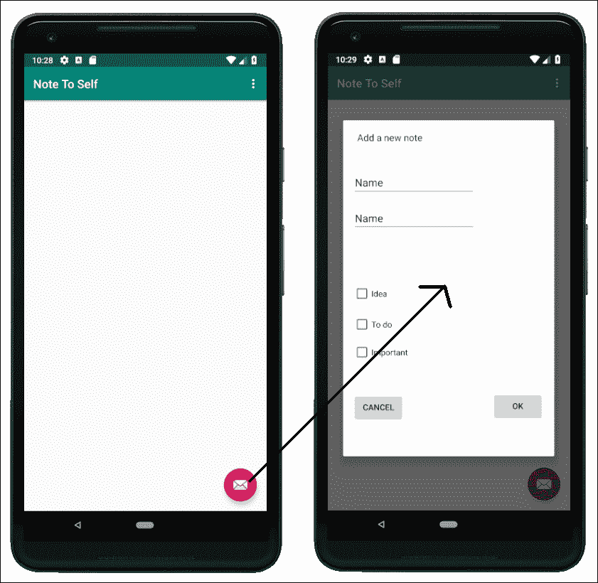

左侧的屏幕截图显示了要点击的按钮，右侧的屏幕截图显示了用户可以添加新便签的对话框窗口。

最终，随着用户添加更多的笔记，他们将在应用程序的主屏幕上拥有所有已添加的笔记列表，如下截图所示。用户可以选择笔记是**重要**、**想法**和/或**待办事项**笔记：

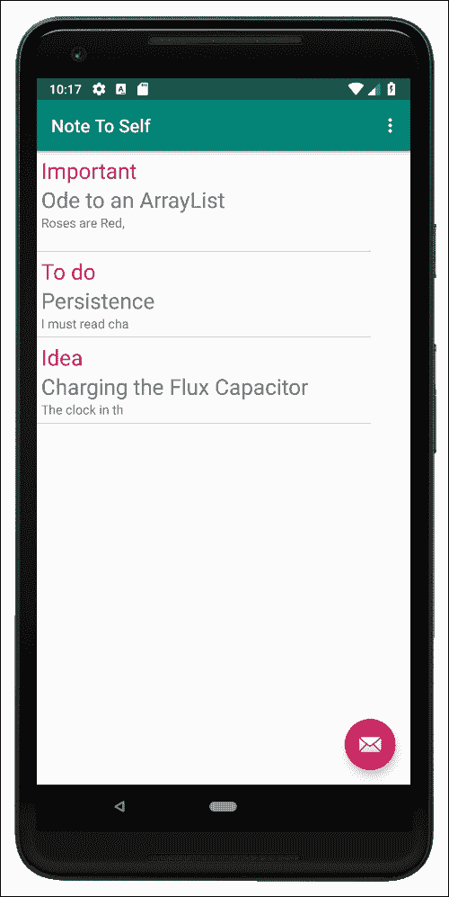

他们将能够滚动列表并点击一个笔记，以在专门用于该笔记的另一个对话框窗口中查看它。以下是显示笔记的对话框窗口：

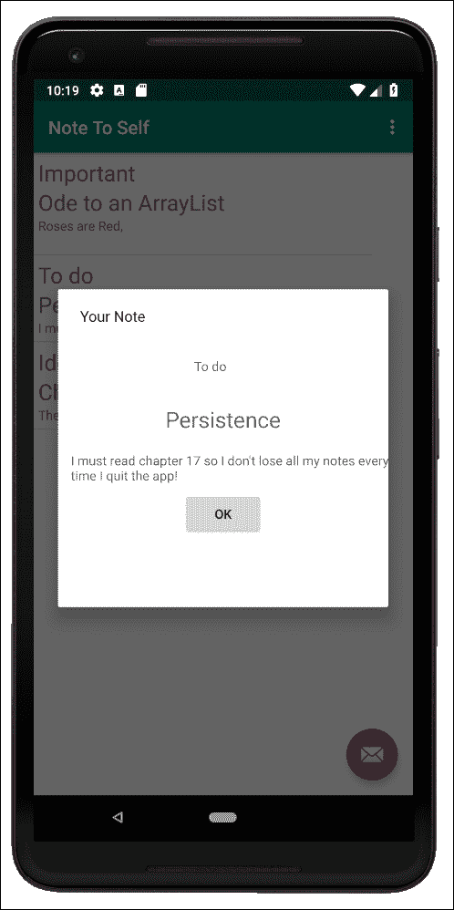

还将有一个非常简单的设置屏幕，可以从菜单中访问，允许用户配置笔记列表是否以分隔线格式化。以下是设置菜单选项的操作：


现在我们确切地知道我们要构建什么，我们可以继续并开始实施它。

## 构建项目

现在让我们创建我们的新项目。将项目命名为`Note to Self`，并使用**Basic Activity**模板。请记住，从第三章*探索 Android Studio 和项目结构*中得知，此模板将生成一个简单的菜单和一个浮动操作按钮，这两者都在此项目中使用。将其他设置保留为默认设置。

## 准备字符串资源

在这里，我们将创建所有的字符串资源，我们将从布局文件中引用这些资源，而不是硬编码`text`属性，就像我们一直在做的那样。严格来说，这是一个可以避免的步骤。但是，如果您想要制作深入的 Android 应用程序，学会以这种方式做事情将使您受益匪浅。

要开始，请在项目资源管理器中的`res/values`文件夹中打开`strings.xml`文件。您将看到自动生成的资源。添加我们将在整个项目的其余部分中使用的以下突出显示的字符串资源。在关闭`</resources>`标签之前添加以下代码：

```kt
...
<resources>
    <string name="app_name">Note To Self</string>
    <string name="hello_world">Hello world!</string>
    <string name="action_settings">Settings</string>

    <string name="action_add">add</string>
    <string name="title_hint">Title</string>
    <string name="description_hint">Description</string>
    <string name="idea_text">Idea</string>
    <string name="important_text">Important</string>
    <string name="todo_text">To do</string>
    <string name="cancel_button">Cancel</string>
    <string name="ok_button">OK</string>

    <string name="settings_title">Settings</string>
    <string name="theme_title">Theme</string>
    <string name="theme_light">Light</string>
    <string name="theme_dark">Dark</string>

</resources>
```

请注意在上述代码中，每个字符串资源都有一个唯一的`name`属性，用于将其与所有其他字符串资源区分开。`name`属性还提供了一个有意义的，并且希望是记忆深刻的线索，表明它代表的实际字符串值。正是这些名称值，我们将用来从我们的布局文件中引用我们想要使用的字符串。

## 编写 Note 类

这是应用程序的基本数据结构。这是一个我们将从头开始编写的类，它具有表示单个用户笔记所需的所有属性。在第十五章*处理数据和生成随机数*中，我们将学习一些新的 Kotlin 代码，以了解如何让用户拥有数十、数百甚至数千条笔记。

通过右键单击包含`MainActivity.kt`文件的文件夹来创建一个新类 - 通常是包含`MainActivity.kt`文件的文件夹。选择**New** | **Kotlin File/class**，命名为`Note`，并从下拉选择器中选择**Class**。单击**OK**创建类。

将以下代码添加到新的`Note`类中：

```kt
class Note {
    var title: String? = null
    var description: String? = null
    var idea: Boolean = false
    var todo: Boolean = false
    var important: Boolean = false
}
```

我们有一个简单的类，没有函数，叫做`Note`。这个类有五个`var`属性，分别叫做`title`、`description`、`idea`、`todo`和`important`。它们的用途是保存用户笔记的标题、笔记的描述（或内容），以及详细说明笔记是一个想法、一个待办事项，还是一个重要的笔记。现在让我们设计两个对话框窗口的布局。

## 实现对话框设计

现在我们将做一些我们以前做过很多次的事情，但这次是出于不同的原因。正如你所知，我们将有两个对话框窗口 - 一个用于用户输入新的笔记，另一个用于用户查看他们选择的笔记。

我们可以以与之前所有布局相同的方式设计这两个对话框窗口的布局。当我们开始为`FragmentDialog`类创建 Kotlin 代码时，我们将学习如何将这些布局结合起来。

首先，让我们按照以下步骤为我们的“新笔记”对话框添加布局：

1.  在项目资源管理器中右键单击`layout`文件夹，选择**新建** | **布局资源文件**。在**文件名：**字段中输入`dialog_new_note`，然后开始输入`Constrai`以填写**根元素：**字段。注意到有一个下拉列表，其中有多个以**Constrai…**开头的选项。现在选择**androidx.constraintlayout.widget.ConstraintLayout**。左键单击**确定**生成新的布局文件，其根元素类型为`ConstraintLayout`。

1.  在按照以下说明的同时，参考下面的屏幕截图中的目标设计。我已经使用 Photoshop 将完成的布局和我们即将自动生成的约束条件放在一起，约束条件被隐藏以增加清晰度：

1.  从**文本**类别中拖放一个**纯文本**小部件到布局的最上方和最左边，然后再添加另一个**纯文本**。现在不用担心任何属性。

1.  从**按钮**类别中拖放三个**复选框**小部件，依次放置。查看之前的参考屏幕截图以获得指导。同样，现在不用担心任何属性。

1.  从上一步中的最后一个**复选框**小部件直接下方拖放两个**按钮**到布局中，然后将第二个**按钮**水平放置，与第一个**按钮**对齐，但完全位于布局的右侧。

1.  整理布局，使其尽可能地与参考屏幕截图相似，然后点击**推断约束条件**按钮来修复您选择的位置。

1.  现在我们可以设置所有的`text`、`id`和`hint`属性。您可以使用下表中的值来设置。请记住，我们在`text`和`hint`属性中使用了我们的字符串资源。

### 注意

当您编辑第一个`id`属性时，可能会弹出一个窗口询问您是否确认更改。勾选**本次会话期间不再询问**并点击**是**继续，如下屏幕截图所示：

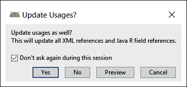

以下是要输入的值：

| **小部件类型** | **属性** | **要设置的值** |
| --- | --- | --- |
| 纯文本（顶部） | id | `editTitle` |
| 纯文本（顶部） | 提示 | `@string/title_hint` |
| 纯文本（底部） | id | `editDescription` |
| 纯文本（底部） | 提示 | `@string/description_hint` |
| 纯文本（底部） | 输入类型 | textMultiLine（取消其他选项） |
| 复选框（顶部） | id | `checkBoxIdea` |
| 复选框（顶部） | 文本 | `@string/idea_text` |
| 复选框（中部） | id | `checkBoxTodo` |
| 复选框（中部） | 文本 | `@string/todo_text` |
| 复选框（底部） | id | `checkBoxImportant` |
| 复选框（底部） | 文本 | `@string/important_text` |
| 按钮（左侧） | id | `btnCancel` |
| 按钮（左侧） | 文本 | `@string/cancel_button` |
| 按钮（右侧） | id | `btnOK` |
| 按钮（右侧） | 文本 | `@string/ok_button` |

我们现在有一个整洁的布局，准备好显示我们的 Kotlin 代码。请记住不同小部件的`id`值，因为当我们编写代码时，我们将看到它们的作用。重要的是，我们的布局看起来漂亮，并且每个相关项目都有一个`id`值，这样我们就可以引用它。

让我们布置对话框，向用户显示一个提示：

1.  在项目资源管理器中右键单击**布局**文件夹，然后选择**新建|布局资源文件**。在**文件名：**字段中输入`dialog_show_note`，然后开始输入`Constrai`以获取**根元素：**字段。注意到有一个下拉列表，其中有多个以**Constrai…**开头的选项。现在选择**androidx.constraintlayout.widget.ConstraintLayout**。单击**确定**生成具有`ConstraintLayout`类型作为其根元素的新布局文件。

1.  参考下一个截图中的目标设计，同时按照这些说明的其余部分进行操作。我已经使用 Photoshop 将包括我们即将自动生成的约束的完成布局与布局放在一起，并隐藏了约束以获得额外的清晰度：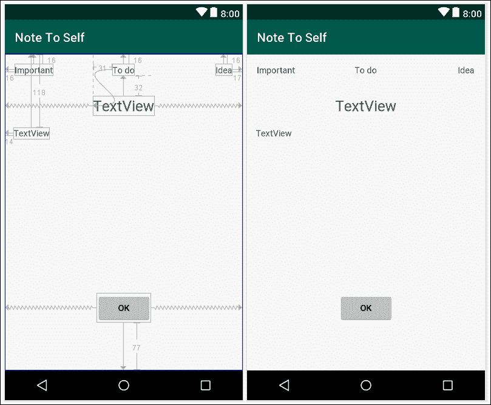

1.  首先，在布局的顶部垂直对齐拖放三个**TextView**小部件。

1.  接下来，在前三个`TextView`小部件的中心下方拖放另一个**TextView**小部件。

1.  在前一个下方的左侧添加另一个**TextView**小部件。

1.  现在在布局的底部水平居中位置添加一个**Button**。到目前为止，它应该是这个样子：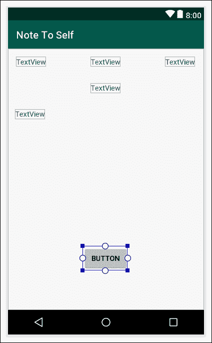

1.  整理布局，使其尽可能地与参考截图相似，然后单击**推断约束**按钮以修复您选择的位置。

1.  从以下表中配置属性：

| **小部件类型** | **属性** | **要设置的值** |
| --- | --- | --- |
| TextView（左上角） | `id` | `textViewImportant` |
| TextView（左上角） | `text` | `@string/important_text` |
| TextView（顶部中心） | `id` | `textViewTodo` |
| TextView（顶部中心） | `text` | `@string/todo_text` |
| TextView（右上角） | `id` | `textViewIdea` |
| TextView（右上角） | `text` | `@string/idea_text` |
| TextView（中心，第二行） | `id` | `txtTitle` |
| TextView（中心，第二行） | `textSize` | `24sp` |
| TextView（最后一个添加的） | `id` | `txtDescription` |
| Button | `id` | `btnOK` |
| Button | `text` | `@string/ok_button` |

### 提示

在进行上述更改之后，您可能希望通过拖动它们在屏幕上调整它们的大小和内容来微调一些 UI 元素的最终位置。首先，单击**清除所有约束**，然后调整布局使其符合您的要求，最后，单击**推断约束**以再次约束位置。

现在我们有一个布局，可以用来向用户显示笔记。请注意，我们可以重用一些字符串资源。我们的应用程序越大，这样做就越有益。

## 编写对话框

现在我们已经为我们的两个对话框窗口（“显示笔记”和“新建笔记”）设计好了，我们可以利用我们对`FragmentDialog`类的了解来实现一个类来代表用户可以交互的每个对话框窗口。

我们将从“新建笔记”屏幕开始。

### 编写 DialogNewNote 类

通过右键单击具有`.kt`文件的项目文件夹并选择**新建** | **Kotlin 文件/类**来创建一个新类。命名`DialogNewNote`类并在下拉选择器中选择**类**。单击**确定**生成新类。

首先，更改类声明并继承自`DialogFragment`。还要重写`onCreateDialog`函数，这是该类中其余代码的位置。使您的代码与以下代码相同以实现这一点：

```kt
class DialogNewNote : DialogFragment() {

   override 
   fun onCreateDialog(savedInstanceState: Bundle?): Dialog {

        // All the rest of the code goes here

    }
}
```

### 提示

您还需要添加以下新的导入：

```kt
import androidx.fragment.app.DialogFragment;
import android.app.Dialog;
import android.os.Bundle;
```

我们暂时在新类中有一个错误，因为我们需要在`onCreateDialog`函数中有一个`return`语句，但我们马上就会解决这个问题。

在接下来的代码块中，我们将在一会儿添加的首先声明并初始化一个`AlertDialog.Builder`对象，就像我们以前创建对话框窗口时所做的那样。然而，这一次，我们不会像以前那样经常使用这个对象。

接下来，我们初始化一个`LayoutInflater`对象，我们将用它来填充我们的 XML 布局。 "填充"简单地意味着将我们的 XML 布局转换为 Kotlin 对象。一旦完成了这个操作，我们就可以以通常的方式访问所有小部件。我们可以将`inflater.inflate`视为替换对话框的`setContentView`函数调用。在第二行中，我们使用`inflate`函数做到了这一点。

添加我们刚刚讨论过的三行代码：

```kt
// All the rest of the code goes here
val builder = AlertDialog.Builder(activity!!)

val inflater = activity!!.layoutInflater

val dialogView = inflater.inflate
   (R.layout.dialog_new_note, null)
```

### 提示

为了支持前三行代码中的新类，您需要添加以下`import`语句：

```kt
import androidx.appcompat.app.AlertDialog
import android.view.View
import android.view.LayoutInflater
```

我们现在有一个名为`dialogView`的`View`对象，它具有来自我们的`dialog_new_note.xml`布局文件的所有 UI 元素。

现在，在上一个代码块下面，我们将添加以下代码。

此代码将获取对每个 UI 小部件的引用。在上一个代码块之后添加以下代码：

```kt
val editTitle =
      dialogView.findViewById(R.id.editTitle) as EditText

val editDescription =
      dialogView.findViewById(R.id.editDescription) as 
                EditText

val checkBoxIdea =
      dialogView.findViewById(R.id.checkBoxIdea) as CheckBox

val checkBoxTodo =
      dialogView.findViewById(R.id.checkBoxTodo) as CheckBox

val checkBoxImportant =
      dialogView.findViewById(R.id.checkBoxImportant) as 
                CheckBox

val btnCancel =
      dialogView.findViewById(R.id.btnCancel) as Button

val btnOK =
      dialogView.findViewById(R.id.btnOK) as Button
```

### 提示

确保添加以下`import`代码，以使您刚刚添加的代码无错误：

```kt
import android.widget.Button
import android.widget.CheckBox
import android.widget.EditText
```

在上述代码中有一个新的 Kotlin 特性，称为`as`关键字；例如，`as EditText`，`as CheckBox`和`as Button`。由于编译器无法推断出每个 UI 小部件的具体类型，所以使用了这个特性。尝试从代码中删除一个`as…`关键字并注意产生的错误。使用`as`关键字（因为我们知道类型）可以解决这个问题。

在下一个代码块中，我们将使用`builder`实例设置对话框的消息。然后，我们将编写一个 lambda 来处理`btnCancel`的点击。在重写的`onClick`函数中，我们将简单地调用`dismiss()`，这是`DialogFragment`的一个函数，用于关闭对话框窗口。这正是用户单击**Cancel**时我们需要的。

添加我们刚刚讨论过的代码：

```kt
builder.setView(dialogView).setMessage("Add a new note")

// Handle the cancel button
btnCancel.setOnClickListener {
   dismiss()
}
```

现在，我们将添加一个 lambda 来处理用户单击**OK**按钮（`btnOK`）时发生的情况。

在其中，我们创建一个名为`newNote`的新`Note`。然后，我们将`newNote`的每个属性设置为表单的适当内容。

之后，我们使用对`MainActivity`的引用来调用`MainActivity`中的`createNewNote`函数。

### 提示

请注意，我们还没有编写`createNewNote`函数，直到本章后面我们这样做之前，函数调用将显示错误。

在这个函数中发送的参数是我们新初始化的`newNote`对象。这样做的效果是将用户的新笔记发送回`MainActivity`。我们将在本章后面看到我们如何处理这个。

最后，我们调用`dismiss`来关闭对话框窗口。在我们添加的上一个代码块之后添加我们讨论过的代码：

```kt
btnOK.setOnClickListener {
   // Create a new note
   val newNote = Note()

   // Set its properties to match the
   // user's entries on the form
   newNote.title = editTitle.text.toString()

   newNote.description = editDescription.text.toString()

   newNote.idea = checkBoxIdea.isChecked
   newNote.todo = checkBoxTodo.isChecked
   newNote.important = checkBoxImportant.isChecked

   // Get a reference to MainActivity
   val callingActivity = activity as MainActivity?

   // Pass newNote back to MainActivity
   callingActivity!!.createNewNote(newNote)

   // Quit the dialog
   dismiss()
}

return builder.create()
```

我们的第一个对话框窗口已经完成。我们还没有将其连接到`MainActivity`中，并且我们还需要实现`createNewNote`函数。我们将在创建下一个对话框之后立即执行此操作。

### 编写 DialogShowNote 类

通过右键单击包含所有`.kt`文件的项目文件夹，选择**New** | **Kotlin File/Class**来创建一个新类。命名为`DialogShowNote`类，然后在下拉选择器中选择**Class**，然后单击**OK**生成新类。

首先，更改类声明并继承自`DialogFragment`，然后重写`onCreateDialog`函数。由于这个类的大部分代码都在`onCreateDialog`函数中，所以按照以下代码中显示的签名和空体实现它，我们将在一分钟后回顾它。

请注意，我们声明了`Note`类型的`var`属性`note`。另外，添加`sendNoteSelected`函数及其初始化`note`的单行代码。这个函数将被`MainActivity`调用，并传入用户点击的`Note`对象。

添加我们刚讨论过的代码，然后我们可以查看`onCreateDialog`的细节：

```kt
class DialogShowNote : DialogFragment() {

    private var note: Note? = null

    override fun 
    onCreateDialog(savedInstanceState: Bundle?): Dialog {

        // All the other code goes here

    }

    // Receive a note from the MainActivity class
    fun sendNoteSelected(noteSelected: Note) {
        note = noteSelected
    }

}
```

### 提示

此时，您需要导入以下类：

```kt
import android.app.Dialog;
import android.os.Bundle;
import androidx.fragment.app.DialogFragment;
```

接下来，我们声明并初始化一个`AlertDialog.Builder`的实例。接下来，就像我们为`DialogNewNote`做的那样，我们声明并初始化`LayoutInflater`，然后使用它来创建一个具有对话框布局的`View`对象。在这种情况下，它是来自`dialog_show_note.xml`的布局。

最后，在下面的代码块中，我们获取对每个 UI 小部件的引用，并使用`note`中的相关属性设置`txtTitle`和`textDescription`的`text`属性，这些属性在`sendNoteSelected`函数调用中初始化。

添加我们刚刚讨论过的代码到`onCreateDialog`函数中：

```kt
val builder = AlertDialog.Builder(this.activity!!)

val inflater = activity!!.layoutInflater

val dialogView = inflater.inflate(R.layout.dialog_show_note, null)

val txtTitle = 
   dialogView.findViewById(R.id.txtTitle) as TextView

val txtDescription = 
   dialogView.findViewById(R.id.txtDescription) as TextView

txtTitle.text = note!!.title
txtDescription.text = note!!.description      

val txtImportant = 
   dialogView.findViewById(R.id.textViewImportant) as TextView

val txtTodo = 
   dialogView.findViewById(R.id.textViewTodo) as TextView

val txtIdea = 
   dialogView.findViewById(R.id.textViewIdea) as TextView
```

### 提示

将上述`import`语句添加到以前的代码中，以使所有类都可用：

```kt
import android.view.LayoutInflater;
import android.view.View;
import android.widget.TextView;
import androidx.appcompat.app.AlertDialog;
```

下一个代码也在`onCreateDialog`函数中。它检查正在显示的笔记是否“重要”，然后相应地显示或隐藏`txtImportant TextView`小部件。然后我们对`txtTodo`和`txtIdea`小部件做同样的操作。

在上一个代码块之后添加此代码，仍然在`onCreateDialog`函数中：

```kt
if (!note!!.important){
   txtImportant.visibility = View.GONE
}

if (!note!!.todo){
   txtTodo.visibility = View.GONE
}

if (!note!!.idea){
   txtIdea.visibility = View.GONE
}
```

现在我们只需要在用户点击**OK**按钮时`dismiss`（即关闭）对话框窗口。这是通过 lambda 完成的，因为我们已经看到了好几次。`onClick`函数只是调用`dismiss`函数，关闭对话框窗口。

在上一个代码块之后添加此代码到`onCreateDialog`函数中：

```kt
val btnOK = dialogView.findViewById(R.id.btnOK) as Button

builder.setView(dialogView).setMessage("Your Note")

btnOK.setOnClickListener({
   dismiss()
})

return builder.create()
```

### 提示

使用这行代码导入`Button`类：

```kt
import android.widget.Button;
```

我们现在有两个准备好的对话框窗口。我们只需要在`MainActivity`类中添加一些代码来完成工作。

## 显示和使用我们的新对话框

在`MainActivity`声明之后添加一个新的临时属性：

```kt
// Temporary code
private var tempNote = Note()
```

### 提示

这段代码不会出现在最终的应用程序中；这只是为了让我们立即测试我们的对话框窗口。

现在添加这个函数，以便我们可以从`DialogNewNote`类接收一个新的笔记：

```kt
fun createNewNote(n: Note) {
   // Temporary code
   tempNote = n
}
```

现在，要将一个笔记发送到`DialogShowNote`函数，我们需要在`layout_main.xml`布局文件中添加一个带有`button` `id`的按钮。

为了清楚地说明这个按钮的用途，我们将把它的`text`属性更改为`Show Note`，如下所示：

+   将`Button`小部件拖放到`layout_main.xml`上，并将其`id`配置为`button`，`text`配置为`Show Note`。

+   点击**Infer Constraints**按钮，使按钮停留在您放置的位置。此按钮的确切位置在这个阶段并不重要。

### 注意

只是为了澄清，这是一个临时按钮，用于测试目的，不会在最终的应用程序中使用。在开发结束时，我们将点击列表中的笔记标题。

现在，在`onCreate`函数中，我们将设置一个 lambda 来处理对临时按钮的点击。`onClick`中的代码将执行以下操作：

+   创建一个名为`dialog`的新`DialogShowNote`实例。

+   在`dialog`上调用`sendNoteSelected`函数，将我们的`Note`对象`tempNote`作为参数传递进去。

+   最后，它将调用`show`，为我们的新对话框注入生命。

将先前描述的代码添加到`onCreate`函数中：

```kt
// Temporary code
val button = findViewById<View>(R.id.button) as Button
button.setOnClickListener {
   // Create a new DialogShowNote called dialog
   val dialog = DialogShowNote()

   // Send the note via the sendNoteSelected function
   dialog.sendNoteSelected(tempNote)

   // Create the dialog
   dialog.show(supportFragmentManager, "123")
}
```

### 提示

确保使用这行代码导入`Button`类：

```kt
import android.widget.Button;
```

现在我们可以在点击按钮时召唤我们的`DialogShowNote`对话框窗口。运行应用程序，点击**SHOW NOTE**按钮，查看`DialogShowNote`对话框窗口，其中包含`dialog_show_note.xml`布局，如下截图所示：

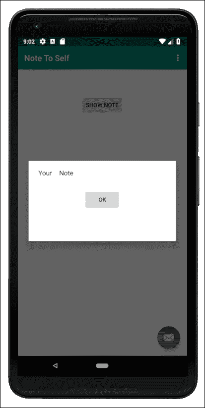

诚然，考虑到我们在本章中所做的大量编码，这并不是什么了不起的，但是当我们让`DialogNewNote`类起作用时，我们将看到`MainActivity`如何在两个对话框之间交互和共享数据。

让`DialogNewNote`对话框可用。

### 编写浮动操作按钮

这将很容易。浮动操作按钮已经在布局中为我们提供。作为提醒，这是浮动操作按钮：

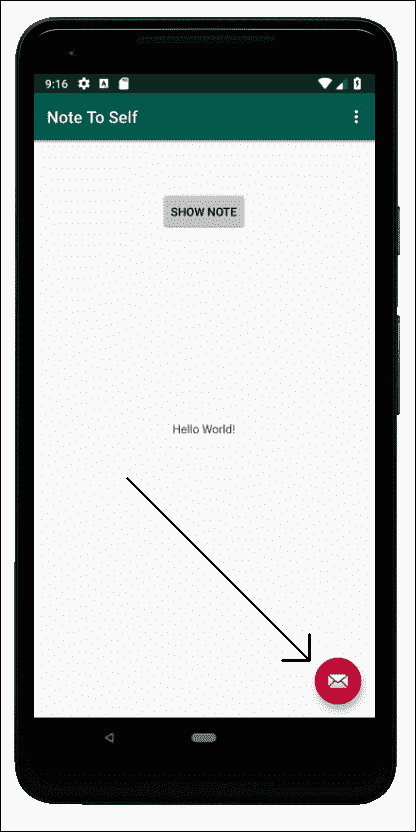

它在`activity_main.xml`文件中。这是定位和定义其外观的 XML 代码：

```kt
<com.google.android.material.floatingactionbutton
    .FloatingActionButton

   android:id="@+id/fab"
   android:layout_width="wrap_content"
   android:layout_height="wrap_content"
   android:layout_gravity="bottom|end"
   android:layout_margin="@dimen/fab_margin"
   app:srcCompat="@android:drawable/ic_dialog_email" />
```

Android Studio 甚至提供了一个现成的 lambda 来处理对浮动操作按钮的点击。我们只需要在已提供的代码的`onClick`函数中添加一些代码，就可以使用`DialogNewNote`类。

浮动操作按钮通常用于应用程序的核心操作。例如，在电子邮件应用程序中，它可能用于启动新电子邮件；或者在便签应用程序中，它可能用于添加新便签。所以，让我们现在做这个。

在`MainActivity.kt`中，在`onCreate`函数中找到 Android Studio 提供的自动生成的代码；以下是完整的代码：

```kt
fab.setOnClickListener { view ->
   Snackbar.make(view, "Replace with your own action", 
 Snackbar.LENGTH_LONG)
 .setAction("Action", null).show()
}
```

在前面的代码中，请注意突出显示的行并删除它。现在在删除的代码的位置添加以下代码：

```kt
val dialog = DialogNewNote()
dialog.show(supportFragmentManager, "")
```

新代码创建了`DialogNewNote`类型的新对话框窗口，然后向用户显示它。

现在我们可以运行应用程序；点击浮动操作按钮并添加一条便签，类似于以下截图：

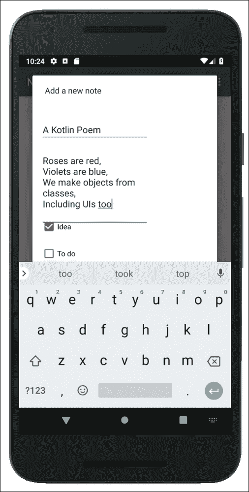

点击“确定”保存便签并返回到主布局。接下来，我们可以点击“显示便签”按钮，在对话框窗口中查看它，就像以下截图一样：

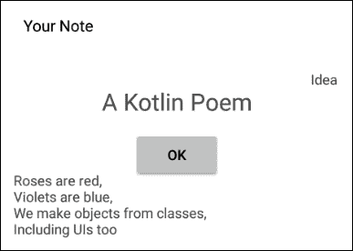

请注意，如果您添加第二个便笺，它将覆盖第一个，因为我们只有一个`Note`实例。此外，如果您关闭手机或完全关闭应用程序，那么便签将永远丢失。我们需要涵盖一些更多的 Kotlin 来解决这些问题。

# 摘要

在本章中，我们已经看到并实现了使用`DialogFragment`类的常见 UI 设计与对话框窗口。

当我们启动“Note to self”应用程序时，我们进一步迈出了一步，通过实现更复杂的对话框，可以从用户那里捕获信息。我们看到，`DialogFragment`使我们能够在对话框中拥有任何我们喜欢的 UI。

在下一章中，我们将开始解决一个明显的问题，即用户只能有一个便签，通过探索 Kotlin 的数据处理类。
