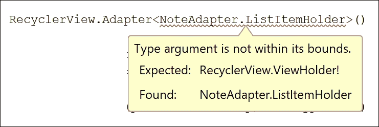
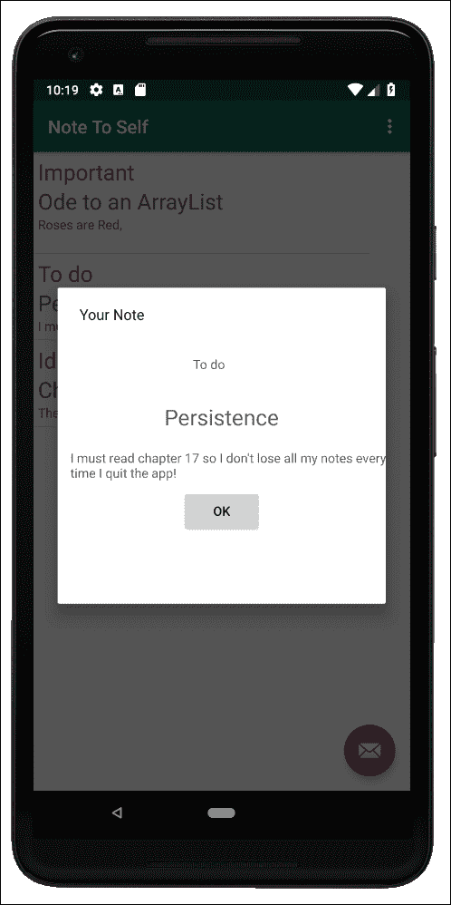

# 第十六章。适配器和回收器

在这一章中，我们将取得很大的进展。我们将首先学习适配器和列表的理论。然后，我们将看看如何在 Kotlin 代码中使用`RecyclerAdapter`实例，并将`RecyclerView`小部件添加到布局中，它作为我们 UI 的列表，然后通过 Android API 的明显魔法将它们绑定在一起，以便`RecyclerView`实例显示`RecyclerAdapter`实例的内容，并允许用户滚动查看一个充满`Note`实例的`ArrayList`实例的内容。你可能已经猜到，我们将使用这种技术在 Note to self 应用程序中显示我们的笔记列表。

在这一章中，我们将做以下事情：

+   探索另一种 Kotlin 类 - **内部类**

+   查看适配器的理论并检查将它们绑定到我们的 UI 上

+   使用`RecyclerView`实现布局

+   为在`RecyclerView`中使用的列表项布局

+   使用`RecyclerAdapter`实现适配器

+   将适配器绑定到`RecyclerView`

+   在`ArrayList`中存储笔记，并通过`RecycleAdapter`在`RecyclerView`中显示它们

很快，我们将拥有一个自管理的布局，用来保存和显示所有的笔记，所以让我们开始吧。

# 内部类

在这个项目中，我们将使用一种我们以前没有见过的类 - **内部**类。假设我们有一个名为`SomeRegularClass`的常规类，其中有一个名为`someRegularProperty`的属性和一个名为`someRegularFunction`的函数，就像下面的代码中所示：

```kt
class SomeRegularClass{
    var someRegularProperty = 1    

    fun someRegularFunction(){
    }
}
```

内部类是在常规类内部声明的类，就像下面的高亮代码中所示：

```kt
class SomeRegularClass{
    var someRegularProperty = 1

    fun someRegularFunction(){
    }

    inner class MyInnerClass {
 val myInnerProperty = 1

 fun myInnerFunction() {
 }
 }

}
```

上面高亮显示的代码显示了一个名为`MyInnerClass`的内部类，其中有一个名为`myInnerProperty`的属性和一个名为`myInnerFunction`的函数。

一个优点是外部类可以通过声明它的实例来使用内部类的属性和函数，就像下面的代码片段中所示：

```kt
class SomeRegularClass{
    var someRegularProperty = 1

    val myInnerInstance = MyInnerClass()

    fun someRegularFunction(){
        val someVariable = myInnerInstance.myInnerProperty
 myInnerInstance.myInnerFunction()
    }

    inner class MyInnerClass {
        val myInnerProperty = 1

        fun myInnerFunction() {
        }

    }
}
```

此外，内部类还可以从`myInnerFunction`函数中访问常规类的属性。下面的代码片段展示了这一点：

```kt
fun myInnerFunction() {
 someRegularProperty ++
}
```

在类中定义新类型并创建实例并共享数据的能力在某些情况下非常有用，并且用于封装。我们将在本章后面的 Note to self 应用程序中使用内部类。

# RecyclerView 和 RecyclerAdapter

在第五章中，我们使用了`ScrollView`小部件，并用一些`CardView`小部件填充它，以便我们可以看到它滚动。我们可以利用我们刚刚学到的关于`ArrayList`的知识，创建一个`TextView`对象的容器，用它们来填充`ScrollView`小部件，并在每个`TextView`中放置一个笔记的标题。这听起来像是在 Note to self 应用程序中显示每个笔记并使其可点击的完美解决方案。

我们可以在 Kotlin 代码中动态创建`TextView`对象，将它们的`text`属性设置为笔记的标题，然后将`TextView`对象添加到`ScrollView`中包含的`LinearLayout`中。但这并不完美。

## 显示大量小部件的问题

这可能看起来不错，但是如果有几十个、几百个，甚至上千个笔记怎么办？我们不能在内存中有成千上万个`TextView`对象，因为 Android 设备可能会因为尝试处理如此大量的数据而耗尽内存，或者至少会变得非常缓慢。

现在，想象一下我们希望（我们确实希望）`ScrollView`小部件中的每个笔记都显示它是重要的、待办事项还是想法。还有关于笔记文本的简短片段呢？

我们需要设计一些巧妙的代码，从`ArrayList`中加载和销毁`Note`对象和`TextView`对象。这是可以做到的 - 但要高效地做到这一点远非易事。

## 解决显示大量小部件的问题

幸运的是，这是移动开发人员如此常见的问题，以至于 Android API 中已经内置了解决方案。

我们可以在 UI 布局中添加一个名为`RecyclerView`的小部件（就像一个环保的`ScrollView`，但也有增强功能）。`RecyclerView`类是为我们讨论的问题设计的解决方案。此外，我们需要使用一种特殊类型的类与`RecyclerView`进行交互，这个类了解`RecyclerView`的工作原理。我们将使用一个**适配器**与它进行交互。我们将使用`RecyclerAdapter`类，继承它，定制它，然后使用它来控制我们的`ArrayList`中的数据，并在`RecyclerView`类中显示它。

让我们更多地了解一下`RecyclerView`和`RecyclerAdapter`类的工作原理。

## 如何使用 RecyclerView 和 RecyclerAdapter

我们已经知道如何存储几乎无限的笔记 - 我们可以在`ArrayList`中这样做，尽管我们还没有实现它。我们还知道有一个名为`RecyclerView`的 UI 布局，专门设计用于显示潜在的长列表数据。我们只需要看看如何将它付诸实践。

要向我们的布局中添加一个`RecyclerView`小部件，我们只需从调色板中像往常一样拖放它。

### 提示

现在不要这样做。让我们先讨论一会儿。

`RecyclerView`类在 UI 设计中将如下所示：


然而，这种外观更多地代表了可能性，而不是在应用程序中的实际外观。如果我们在添加了`RecyclerView`小部件后立即运行应用程序，我们将只会得到一个空白屏幕。

要实际使用`RecyclerView`小部件，我们需要做的第一件事是决定列表中的每个项目将是什么样子。它可以只是一个单独的`TextView`小部件，也可以是整个布局。我们将使用`LinearLayout`。为了清晰和具体，我们将使用一个`LinearLayout`实例，它为我们的`RecyclerView`小部件中的每个项目包含三个`TextView`小部件。这将允许我们显示笔记状态（重要/想法/待办事项）、笔记标题以及实际笔记内容中的一小段文本。

列表项需要在自己的 XML 文件中定义，然后`RecyclerView`小部件可以容纳多个此列表项布局的实例。

当然，这一切都没有解释我们如何克服管理显示在哪个列表项中的数据的复杂性，以及如何从`ArrayList`中检索数据。

这个数据处理是由我们自己定制的`RecyclerAdapter`来处理的。`RecyclerAdapter`类实现了`Adapter`接口。我们不需要知道`Adapter`内部是如何工作的，我们只需要重写一些函数，然后`RecyclerAdapter`将负责与我们的`RecyclerView`小部件进行通信的所有工作。

将`RecyclerAdapter`的实现与`RecyclerView`小部件连接起来的过程，肯定比将 20 个`TextView`小部件拖放到`ScrollView`小部件上要复杂得多，但一旦完成，我们就可以忘记它，它将继续工作并自行管理，无论我们向`ArrayList`中添加了多少笔记。它还具有处理整洁格式和检测列表中哪个项目被点击的内置功能。

我们需要重写`RecyclerAdapter`的一些函数，并添加一些我们自己的代码。

## 我们将如何使用 RecyclerView 与 RecyclerAdapter 和笔记的 ArrayList

看一下所需步骤的大纲，这样我们就知道可以期待什么。为了让整个事情运转起来，我们需要做以下事情：

1.  删除临时按钮和相关代码，然后向我们的布局中添加一个具有特定`id`属性的`RecyclerView`小部件。

1.  创建一个 XML 布局来表示列表中的每个项目。我们已经提到列表中的每个项目将是一个包含三个`TextView`小部件的`LinearLayout`。

1.  创建一个新的类，该类继承自`RecyclerAdapter`，并添加代码到几个重写的函数中，以控制它的外观和行为，包括使用我们的列表项布局和装满`Note`实例的`ArrayList`。

1.  在`MainActivity`中添加代码，以使用`RecyclerAdapter`和`RecyclerView`小部件，并将其绑定到我们的`ArrayList`实例。

1.  在`MainActivity`中添加一个`ArrayList`实例，用于保存所有我们的笔记，并更新`createNewNote`函数，以将在`DialogNewNote`类中创建的任何新笔记添加到这个`ArrayList`中。

让我们逐步实现这些步骤。

# 向“Note to Self”项目添加 RecyclerView、RecyclerAdapter 和 ArrayList

打开“Note to self”项目。作为提醒，如果您想要查看基于完成本章的完整代码和工作中的应用程序，可以在`Chapter16/Note to self`文件夹中找到。

### 提示

由于本章中所需的操作在不同的文件、类和函数之间跳转，我鼓励您在首选的文本编辑器中打开下载包中的文件，以供参考。

## 删除临时的“显示笔记”按钮并添加 RecyclerView

接下来的几个步骤将消除我们在第十四章中添加的临时代码，*Android 对话框窗口*，并设置我们的`RecyclerView`准备好在本章后期绑定到`RecyclerAdapter`：

1.  在`content_main.xml`文件中，删除临时的`Button`，该按钮具有`id`为`button`，我们之前为测试目的添加的。

1.  在`MainActivity.kt`的`onCreate`函数中，删除`Button`实例的声明和初始化，以及处理其点击的 lambda，因为这段代码现在会产生错误。稍后在本章中，我们将删除更多临时代码。删除下面显示的代码：

```kt
// Temporary code
val button = findViewById<View>(R.id.button) as Button
button.setOnClickListener {
  // Create a new DialogShowNote called dialog
  val dialog = DialogShowNote()

  // Send the note via the sendNoteSelected function
  dialog.sendNoteSelected(tempNote)

  // Create the dialog
  dialog.show(supportFragmentManager, "123")
}
```

1.  现在，切换回设计视图中的`content_main.xml`，并从调色板的**常用**类别中将一个**RecyclerView**小部件拖放到布局中。

1.  将其`id`属性设置为`recyclerView`。

现在，我们已经从项目中删除了临时的 UI 方面，并且我们有一个完整的`RecyclerView`小部件，具有一个独特的`id`属性，可以在我们的 Kotlin 代码中引用。

## 为 RecyclerView 创建列表项

接下来，我们需要一个布局来表示`RecyclerView`小部件中的每个项目。如前所述，我们将使用一个包含三个`TextView`小部件的`LinearLayout`实例。

这些是创建用于`RecyclerView`中使用的列表项所需的步骤：

1.  在项目资源管理器中右键单击`layout`文件夹，然后选择**新建 | 布局资源文件**。在**名称：**字段中输入`listitem`，并将**根元素：**设置为`LinearLayout`。默认的方向属性是垂直的，这正是我们需要的。

1.  查看下一个屏幕截图，以了解我们在本节剩余步骤中要实现的目标。我已经对其进行了注释，以显示成品应用程序中的每个部分将是什么样子：

1.  将三个`TextView`实例拖放到布局中，一个在另一个上方，如参考屏幕截图所示。第一个（顶部）将保存笔记状态/类型（想法/重要/待办事项），第二个（中间）将保存笔记标题，第三个（底部）将保存笔记本身的片段。

1.  根据以下表格中显示的内容，配置`LinearLayout`实例和`TextView`小部件的各种属性：

| **小部件类型** | **属性** | **要设置的值** |
| --- | --- | --- |
| LinearLayout | `layout_height` | `wrap_contents` |
| LinearLayout | `Layout_Margin all` | `5dp` |
| TextView（顶部） | `id` | `textViewStatus` |
| TextView（顶部） | `textSize` | `24sp` |
| TextView（顶部） | `textColor` | `@color/colorAccent` |
| TextView（中间） | `id` | `textViewTitle` |
| TextView（中间） | `textSize` | `24sp` |
| TextView（顶部） | `id` | `textViewDescription` |

现在我们在主布局中有一个`RecylerView`小部件和一个用于列表中每个项目的布局。我们可以继续编写我们的`RecyclerAdapter`实现。

## 编写 RecyclerAdapter 类

现在我们将创建并编写一个全新的类。让我们称我们的新类为`NoteAdapter`。以通常的方式在与`MainActivity`类（以及所有其他类）相同的文件夹中创建一个名为`NoteAdapter`的新类。

通过添加这些`import`语句并继承`RecyclerView.Adapter`类来编辑`NoteAdapter`类的代码，然后添加如下所示的两个属性。编辑`NoteAdapter`类，使其与我们刚刚讨论过的代码相同：

```kt
import android.view.LayoutInflater
import android.view.View
import android.view.ViewGroup
import android.widget.TextView
import androidx.recyclerview.widget.RecyclerView

class NoteAdapter(
   private val mainActivity: MainActivity, 
   private val noteList: List<Note>) 
   : RecyclerView.Adapter<NoteAdapter.ListItemHolder>() {

}
```

在前面的代码中，我们使用主构造函数声明和初始化了`NoteAdapter`类的两个属性。注意构造函数的参数。它接收一个`MainActivity`引用以及一个`List`引用。这意味着当我们使用这个类时，我们需要发送一个对这个应用程序的主活动（`MainActivity`）的引用，以及一个`List`引用。我们很快就会看到我们如何使用`MainActivity`的引用，但我们可以合理地猜测，带有`<Note>`类型的`List`引用将是对我们很快在`MainActivity`类中编写的`Note`实例的引用。`NoteAdapter`将永久持有所有用户笔记的引用。

然而，您会注意到类声明和代码的其他部分都被红色下划线标出，显示我们的代码中存在错误。

第一个错误是因为我们需要重写`RecylerView.Adapter`类（我们正在继承的类）的一些抽象函数。

### 注意

我们在第十一章*Kotlin 中的继承*中讨论了抽象类及其函数。

最快的方法是点击类声明，按住*Alt*键，然后点击*Enter*键。选择**实现成员**，如下一个截图所示：


在随后的窗口中，按住*Shift*键并左键单击所有三个选项（要添加的函数），然后点击**确定**。这个过程添加了以下三个函数：

+   `onCreateViewHolder`函数在需要列表项的布局时调用

+   `onBindViewHolder`函数在将`RecyclerAdapter`实例绑定到布局中的`RecyclerView`实例时调用

+   `getItemCount`函数将用于返回`ArrayList`中`Note`实例的数量

我们很快将为这些函数中的每一个添加代码，以在特定时间做出所需的工作。

然而，请注意，我们的代码中仍然存在多个错误，包括新生成的函数以及类声明中。我们需要做一些工作来解决这些错误。

错误是因为`NoteAdapter.ListItemHolder`类不存在。当我们扩展`NoteAdapter`时，我们添加了`ListItemHolder`。这是我们选择的类类型，将用作每个列表项的持有者。目前它不存在 - 因此出现错误。另外两个函数也因为同样的原因出现了相同的错误，因为当我们要求 Android Studio 实现缺失的函数时，它们是自动生成的。

让我们通过开始创建所需的`ListItemHolder`类来解决这个问题。对于`ListItemHolder`实例与`NoteAdapter`共享数据/变量对我们很有用，因此我们将`ListItemHolder`创建为内部类。

点击类声明中的错误，然后选择**创建类'ListItemHolder'**，如下一个截图所示：


在随后的弹出窗口中，选择**NoteAdapter**以在`NoteAdapter`内生成`ListItemHolder`。

以下代码已添加到`NoteAdapter`类中：

```kt
class ListItemHolder {

}
```

但我们仍然有多个错误。让我们现在修复其中一个。将鼠标悬停在类声明中的红色下划线错误上，如下一个截图所示：



错误消息显示**Type argument is not within its bounds. Expected:** **RecyclerView.ViewHolder! Found: NoteAdapter.ListItemHolder**。这是因为我们可能已经添加了`ListItemHolder`，但`ListItemHolder`必须也实现`RecyclerView.ViewHolder`才能作为正确的类型使用。

修改`ListItemHolder`类的声明以匹配此代码：

```kt
    inner class ListItemHolder(view: View) : 
         RecyclerView.ViewHolder(view), 
         View.OnClickListener {
```

现在`NoteAdapter`类声明中的错误已经消失，但因为我们还实现了`View.OnClickListener`，我们需要实现`onClick`函数。此外，`ViewHolder`没有提供默认构造函数，所以我们需要添加。将以下`onClick`函数（现在为空）和这个`init`块（现在为空）添加到`ListItemHolder`类中：

```kt
init {
}

override fun onClick(view: View) {
}
```

### 提示

确保你添加的代码是在内部的`ListItemHolder`类中，而不是`NoteAdapter`类中。

让我们清理掉最后剩下的错误。当`onBindViewHolder`函数被自动生成时，Android Studio 没有为`holder`参数添加类型。这导致函数和类声明中出现错误。根据下面的代码更新`onBindViewHolder`函数的签名：

```kt
override fun onBindViewHolder(
   holder: ListItemHolder, position: Int) {
```

在`onCreateViewHolder`函数签名中，返回类型没有被自动生成。修改`onCreateViewHolder`函数的签名，如下面的代码所示：

```kt
    override fun onCreateViewHolder(
       parent: ViewGroup, viewType: Int): ListItemHolder {
```

作为最后一点良好的整理，让我们删除自动生成但不需要的三个`// TODO…`注释。每个自动生成的函数中都有一个。它们看起来像下一个截图中突出显示的那样：


当你删除`TODO…`注释时，会出现更多的错误。我们需要在一些自动生成的函数中添加`return`语句。随着我们继续编写类，我们将会这样做。

经过多次调整和自动生成，我们最终有了一个几乎没有错误的`NoteAdapter`类，包括重写的函数和一个内部类，我们可以编写代码来使我们的`RecyclerAdapter`实例工作。此外，我们可以编写代码来响应每个`ListItemHolder`实例上的点击（在`onClick`中）。

接下来是代码在这个阶段应该看起来的完整清单（不包括导入语句）：

```kt
class NoteAdapter(
  private val mainActivity: MainActivity,
  private val noteList: List<Note>)
  : RecyclerView.Adapter<NoteAdapter.ListItemHolder>() {

    override fun onCreateViewHolder(
         parent: ViewGroup, viewType: Int):
         ListItemHolder {

    }

    override fun getItemCount(): Int {

    }

    override fun onBindViewHolder(
         holder: ListItemHolder, 
         position: Int) {

    }

    inner class ListItemHolder(view: View) : 
          RecyclerView.ViewHolder(view),
          View.OnClickListener {

        init {

        }

        override fun onClick(view: View) {
        }
    }
}
```

### 提示

你本可以只复制并粘贴前面的代码，而不必忍受之前页面的折磨，但那样你就不会如此近距离地体验到实现接口和内部类的过程。

现在，让我们编写函数并使这个类运行起来。

### 编写 onCreateViewHolder 函数

接下来，我们将调整自动生成的`onCreateViewHolder`函数。将下面的代码行添加到`onCreateViewHolder`函数中并学习它们：

```kt
override fun onCreateViewHolder(
   parent: ViewGroup, viewType: Int): 
   ListItemHolder {

 val itemView = LayoutInflater.from(parent.context)
 .inflate(R.layout.listitem, parent, false)

 return ListItemHolder(itemView)
}
```

这段代码通过使用`LayoutInflater`和我们新设计的`listitem`布局来初始化`itemView`。然后返回一个新的`ListItemHolder`实例，包括一个已经膨胀并且可以立即使用的布局。

### 编写 onBindViewHolder 函数

接下来，我们将调整`onBindViewHolder`函数。添加高亮代码，使函数与此代码相同，并确保也学习代码：

```kt
override fun onBindViewHolder(
         holder: ListItemHolder, position: Int) {

   val note = noteList[position]
 holder.title.text = note.title

 // Show the first 15 characters of the actual note
 holder.description.text = 
 note.description!!.substring(0, 15)

 // What is the status of the note?
 when {
 note.idea -> holder.status.text = 
 mainActivity.resources.getString(R.string.idea_text)

 note.important -> holder.status.text = 
 mainActivity.resources.getString(R.string.important_text)

 note.todo -> holder.status.text = 
 mainActivity.resources.getString(R.string.todo_text)
 }

}
```

首先，代码将文本截断为 15 个字符，以便在列表中看起来合理。请注意，如果用户输入的笔记长度小于 15 个字符，这将导致崩溃。读者可以自行回到这个项目中，发现解决这个缺陷的方法。

然后检查它是什么类型的笔记（想法/待办/重要），并使用`when`表达式从字符串资源中分配适当的标签。

这段新代码在`holder.title`，`holder.description`和`holder.status`的代码中留下了一些错误，因为我们需要将它们添加到我们的`ListItemHolder`内部类中。我们将很快做到这一点。

### 编写`getItemCount`

修改`getItemCount`函数中的代码，如下所示：

```kt
override fun getItemCount(): Int {
   if (noteList != null) {
 return noteList.size
 }
 // error
 return -1
}
```

这个函数是类内部使用的，它提供了`List`中当前项目的数量。

### 编写`ListItemHolder`内部类

现在我们可以将注意力转向`ListItemHolder`内部类。通过添加以下突出显示的代码来调整`ListItemHolder`内部类：

```kt
inner class ListItemHolder(view: View) :
         RecyclerView.ViewHolder(view),
         View.OnClickListener {

 internal var title =
 view.findViewById<View>(
 R.id.textViewTitle) as TextView

 internal var description =
 view.findViewById<View>(
 R.id.textViewDescription) as TextView

 internal var status =
 view.findViewById<View>(
 R.id.textViewStatus) as TextView

  init {

        view.isClickable = true
 view.setOnClickListener(this)
  }

  override fun onClick(view: View) {
        mainActivity.showNote(adapterPosition)
  }
}
```

`ListItemHolder`属性引用布局中的每个`TextView`小部件。`init`块代码将整个视图设置为可点击，这样操作系统将在点击持有者时调用我们讨论的下一个函数`onClick`。

在`onClick`中，对`mainActivity.showNote`的调用存在错误，因为该函数尚不存在，但我们将在下一节中修复这个问题。该调用将简单地使用我们的自定义`DialogFragment`实例显示单击的笔记。

## 编写 MainActivity 以使用 RecyclerView 和 RecyclerAdapter 类

现在，切换到编辑窗口中的`MainActivity`类。将这三个新属性添加到`MainActivity`类中，并删除临时代码：

```kt
// Temporary code
//private var tempNote = Note()

private val noteList = ArrayList<Note>()
private val recyclerView: RecyclerView? = null
private val adapter: NoteAdapter? = null
```

这三个属性是我们所有`Note`实例的`ArrayList`实例，我们的`RecyclerView`实例和我们的`NoteAdapter`类的一个实例。

### 在`onCreate`中添加代码

在处理用户按下浮动操作按钮的代码之后，在`onCreate`函数中添加以下突出显示的代码（为了上下文再次显示）：

```kt
fab.setOnClickListener { view ->
   val dialog = DialogNewNote()
   dialog.show(supportFragmentManager, "")
}

recyclerView = 
 findViewById<View>(R.id.recyclerView) 
 as RecyclerView

adapter = NoteAdapter(this, noteList)
val layoutManager = 
 LinearLayoutManager(applicationContext)

recyclerView!!.layoutManager = layoutManager
recyclerView!!.itemAnimator = DefaultItemAnimator()

// Add a neat dividing line between items in the list
recyclerView!!.addItemDecoration(
 DividerItemDecoration(this, 
 LinearLayoutManager.VERTICAL))

// set the adapter
recyclerView!!.adapter = adapter

```

在这里，我们使用布局中的`RecyclerView`小部件初始化`recyclerView`。通过调用我们编写的构造函数来初始化我们的`NoteAdapter`（`adapter`）实例。请注意，我们传入了对`MainActivity`（`this`）和`ArrayList`实例的引用，正如我们之前编写的类所要求的那样。

接下来，我们创建一个新对象 - 一个`LayoutManager`对象。在接下来的四行代码中，我们配置了`recyclerView`的一些属性。

`itemAnimator`属性和`addItemDecoration`函数使每个列表项在列表中的每个项目之间都有一个分隔线，从视觉上更加美观。稍后，当我们构建一个“设置”屏幕时，我们将让用户选择添加和删除这个分隔线的选项。

我们做的最后一件事是用我们的适配器初始化`recylerView`的`adapter`属性，将我们的适配器与我们的视图结合在一起。

现在，我们将对`createNewNote`函数进行一些更改。

### 修改`createNewNote`函数

在`createNewNote`函数中，删除我们在第十四章中添加的临时代码，*Android 对话框窗口*（显示为注释）。并添加下一个显示的新突出代码：

```kt
fun createNewNote(n: Note) {
  // Temporary code
  // tempNote = n
  noteList.add(n)
 adapter!!.notifyDataSetChanged()

}
```

新添加的突出显示的代码将一个笔记添加到`ArrayList`实例中，而不是简单地初始化一个孤立的`Note`对象，现在已经被注释掉。然后，我们需要调用`notifyDataSetChanged`，让我们的适配器知道已添加新的笔记。

### 编写`showNote`函数

添加`showNote`函数，它是从`NoteAdapter`类中使用传递给`NoteAdapter`构造函数的对这个类的引用来调用的。更准确地说，当用户点击`RecyclerView`小部件中的一个项目时，它是从`ListerItemHolder`内部类中调用的。将`showNote`函数添加到`MainActivity`类中：

```kt
fun showNote(noteToShow: Int) {
   val dialog = DialogShowNote()
   dialog.sendNoteSelected(noteList[noteToShow])
   dialog.show(supportFragmentManager, "")
}
```

### 注意

`NoteAdapter.kt`文件中的所有错误现在都已经消失。

刚刚添加的代码将启动一个新的`DialogShowNote`实例，传入由`noteToShow`引用的特定所需的笔记。

# 运行应用程序

现在，您可以运行应用程序并输入一个新的笔记，如下一个屏幕截图所示：


在输入了几种类型的笔记后，列表（`RecyclerView`）将看起来像下一个屏幕截图所示：


而且，如果您点击查看其中一条笔记，它会看起来像这样：



### 笔记

**读者挑战**

我们本可以花更多时间格式化我们的两个对话框窗口的布局。为什么不参考第五章，*使用 CardView 和 ScrollView 创建美丽的布局*，以及 Material Design 网站，[`material.io/design/`](https://material.io/design/)，做得比这更好。此外，您可以通过使用`CardView`而不是`LinearLayout`来增强`RecyclerView`的笔记列表。

不要花太长时间添加新的笔记，因为有一个小问题：关闭并重新启动应用程序。哦哦，所有的笔记都消失了！

# 经常问的问题

Q.1) 我仍然不明白`RecyclerAdapter`是如何工作的？

A) 那是因为我们实际上并没有讨论过。我们没有讨论幕后的细节是因为我们不需要知道它们。如果我们重写所需的函数，就像我们刚刚看到的那样，一切都会正常工作。这就是`RecyclerAdapter`和我们使用的大多数其他类的意图：隐藏实现并公开函数以暴露必要的功能。

Q.2) 我觉得我*需要*知道`RecyclerAdapter`和其他类的内部情况。我该怎么做？

A) 的确，`RecyclerAdapter`（以及我们在本书中使用的几乎每个类）有更多细节，我们没有空间来讨论。阅读您使用的类的官方文档是一个好的做法。您可以在[`developer.android.com/reference/android/support/v7/widget/RecyclerView.Adapter`](https://developer.android.com/reference/android/support/v7/widget/RecyclerView.Adapter)上阅读更多信息。

# 摘要

现在我们已经添加了保存多个笔记的功能，并实现了显示它们的能力。

我们通过学习和使用`RecyclerAdapter`类来实现了这一点，该类实现了`Adapter`接口，允许我们将`RecyclerView`实例和`ArrayList`实例绑定在一起，从而无缝显示数据，而我们（程序员）不必担心这些类的复杂代码，甚至看不到。

在下一章中，我们将开始使用户的笔记在退出应用程序或关闭设备时持久化。此外，我们将创建一个“设置”屏幕，并看看如何使设置也持久化。我们将使用不同的技术来实现这些目标。
