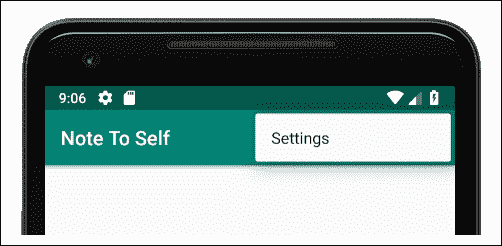
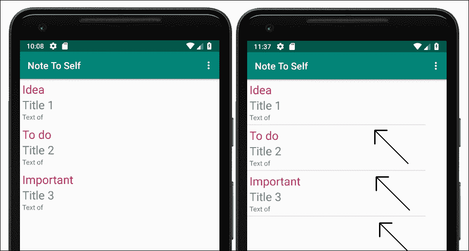

# 第十七章。数据持久性和共享

在本章中，我们将探讨将数据保存到 Android 设备的永久存储的几种不同方法。此外，我们还将首次向我们的应用程序添加第二个`Activity`实例。在我们的应用程序中实现一个单独的“屏幕”，比如“设置”屏幕时，这通常是有意义的，可以在一个新的`Activity`实例中这样做。我们可以通过在同一个`Activity`中隐藏原始 UI 然后显示新 UI 的方式来做到这一点，就像我们在第四章中所做的那样，*开始使用布局和材料设计*，但这很快会导致混乱和容易出错的代码。因此，我们将看到如何添加另一个`Activity`实例并在它们之间导航用户。

在本章中，我们将执行以下操作：

+   了解 Android `Intent`类以在`Activity`实例之间切换并在它们之间传递数据

+   在一个新的`Activity`实例中创建一个非常简单的设置屏幕

+   使用`SharedPreferences`类持久保存设置屏幕数据

+   了解**JavaScript 对象表示**（**JSON**）进行序列化

+   探索`try`-`catch`-`finally`

+   在我们的备忘录应用程序中实现数据保存

# Android Intent 类

`Intent`类的命名恰如其分。它是一个展示我们应用程序的`Activity`实例意图的类。它使意图清晰并且也促进了它。

到目前为止，我们的所有应用程序都只有一个`Activity`实例，但许多 Android 应用程序包含多个。

在它可能最常见的用法中，`Intent`对象允许我们在`Activity`实例之间切换。但是，当我们在这些类之间切换时，数据会发生什么？`Intent`类也通过允许我们在它们之间传递数据来解决了这个问题。

`Intent`类不仅仅是关于连接我们应用程序的活动。它们还使与其他应用程序进行交互成为可能。例如，我们可以在我们的应用程序中提供一个链接，让用户发送电子邮件，打电话，与社交媒体互动，或在浏览器中打开网页，并让电子邮件、拨号器、网络浏览器或相关的社交媒体应用程序完成所有工作。

没有足够的页面来深入了解与其他应用程序的交互，因此我们主要将专注于在活动之间切换和传递数据。

## 切换 Activity

假设我们有一个基于两个`Activity`的类的应用程序，很快我们就会有。我们可以假设，像往常一样，我们有一个名为`MainActivity`的`Activity`实例，这是应用程序的起点，以及一个名为`SettingsActivity`的第二个`Activity`实例。这是我们如何从`MainActivity`切换到`SettingsActivity`的方法：

```kt
// Declare and initialize a new Intent object called myIntent
val myIntent = Intent(this, 
         SettingsActivity::class.java)

// Switch to the SettingsActivity
startActivity(myIntent)
```

仔细查看我们如何初始化`Intent`对象。`Intent`有一个构造函数，它接受两个参数。第一个是对当前`Activity`实例`this`的引用。第二个参数是我们要打开的`Activity`实例的名称，`SettingsActivity::class`。`SettingsActivity`末尾的`class`使其成为`AndroidManifest.xml`文件中声明的`Activity`实例的完整名称，我们将在不久的将来尝试`Intent`时窥探一下。

### 注意

看起来奇怪的`.java`是因为所有的 Kotlin 代码都被转换为 Java 字节码，`SettingsActivity::class.java`是它的完全限定名称。

唯一的问题是`SettingsActivity`不共享`MainActivity`的任何数据。在某种程度上，这是一件好事，因为如果您需要从`MainActivity`获取所有数据，那么这合理地表明切换`Activity`实例可能不是处理应用程序设计的最佳方式。然而，让两个`Activity`实例封装得如此彻底，以至于它们彼此完全不知道，这是不合理的。

## 在 Activity 之间传递数据

如果我们为用户创建一个登录屏幕，并且我们希望将登录凭据传递给我们应用程序的每个`Activity`实例，我们可以使用`Intent`类来实现。

我们可以像这样向`Intent`实例添加数据：

```kt
// Create a String called username 
// and set its value to bob
val username = "Bob"

// Create a new Intent as we have already seen
val myIntent = Intent(this, 
         SettingsActivity::class.java)

// Add the username String to the Intent
// using the putExtra function of the Intent class
myIntent.putExtra("USER_NAME", username)

// Start the new Activity as we have before
startActivity(myIntent)
```

在`SettingsActivity`中，我们可以像这样检索`String`值：

```kt
// Here we need an Intent also
// But the default constructor will do
// as we are not switching Activity
val myIntent = Intent()

// Initialize username with the passed in String 
val username = intent.extras.getString("USER_NAME")
```

在前两个代码块中，我们以与我们已经看到的相同方式切换了`Activity`实例。但是，在调用`startActivity`之前，我们使用`putExtra`函数将一个`String`值加载到`myIntent`中。

我们使用**键值对**添加数据。每个数据都需要伴随一个**标识符**，以便在检索`Activity`实例中识别并检索数据。

标识符名称是任意的，但应该使用有用/易记的值。

然后，在接收的`Activity`实例中，我们只需使用默认构造函数创建一个`Intent`对象：

```kt
val myIntent = Intent();
```

然后，我们可以使用`extras.getString`函数和键值对中的适当标识符来检索数据。

`Intent`类可以帮助我们发送比这更复杂的数据，但`Intent`类有其限制。例如，我们将无法发送`Note`对象。一旦我们想要开始发送多个值，就值得考虑不同的策略。

# 向“Note to self”添加设置页面

现在我们已经掌握了关于 Android `Intent`类的所有知识，我们可以向我们的“Note to self”应用程序添加另一个屏幕（`Activity`）：一个“设置”屏幕。

首先，我们将为新屏幕创建一个新的`Activity`实例，并查看这对`AndroidManifest.xml`文件的影响。然后，我们将为设置屏幕创建一个非常简单的布局，并添加 Kotlin 代码以从`MainActivity`切换到新的布局。然而，我们将推迟将设置屏幕布局与 Kotlin 连接，直到我们学会如何将用户首选设置保存到磁盘。我们将在本章后面做这个，然后回到设置屏幕以使其数据持久化。

首先，让我们编写新的`Activity`类。我们将其称为`SettingsActivity`。

## 创建 SettingsActivity

SettingsActivity 将是一个屏幕，用户可以在其中打开或关闭`RecyclerView`小部件中每个笔记之间的装饰分隔线。这不会是一个非常全面的设置屏幕，但这将是一个有用的练习，并且我们将看到在两个`Activity`实例之间切换以及将数据保存到磁盘的操作。按照以下步骤开始：

1.  在项目资源管理器窗口中，右键单击包含所有`.kt`文件并与您的包具有相同名称的文件夹。从弹出的上下文菜单中，选择**新建|Activity|空白 Activity**。

1.  在**Activity Name:**字段中输入`SettingsActivity`。

1.  将所有其他选项保持默认值，然后单击**完成**。

Android Studio 为我们创建了一个新的`Activity`类及其关联的`.kt`文件。让我们快速查看一些在幕后为我们完成的工作，因为了解发生了什么是很有用的。

从项目资源管理器中的`manifests`文件夹中打开`AndroidManifest.xml`文件。注意文件末尾附近的以下新代码行：

```kt
<activity android:name=".SettingsActivity"></activity>
```

这是`Activity`类与操作系统**注册**的方式。如果`Activity`类未注册，则尝试运行它将使应用程序崩溃。我们可以通过在新的`.kt`文件中创建一个扩展`Activity`（或`AppCompatActivity`）的类来创建`Activity`类。但是，我们将不得不自己添加前面的代码。此外，通过使用新的 Activity 向导，我们自动生成了一个布局 XML 文件（`activity_settings.xml`）。

## 设计设置屏幕布局

我们将快速为我们的设置屏幕构建用户界面；以下步骤和屏幕截图应该使这变得简单：

1.  打开`activity_settings.xml`文件，并切换到**Design**选项卡，在那里我们将快速布置我们的设置屏幕。

1.  在遵循其余步骤时，请使用下一个截图作为指南：

1.  将一个**Switch**小部件拖放到布局的中上部。我通过拖动边缘来拉伸它，使其更大更清晰。

1.  添加一个`id`属性为`switch1`（如果还没有的话），以便我们可以使用 Kotlin 与其交互。

1.  使用约束处理程序来固定开关的位置，或者点击**推断约束**按钮来自动固定它。

我们现在为我们的设置屏幕有了一个漂亮（而且非常简单）的新布局，并且`id`属性已经就位，准备在本章后面的代码中与其连接。

## 使用户能够切换到“设置”屏幕

我们已经知道如何创建和切换到`SettingsActivity`实例。另外，由于我们不会向其传递任何数据，也不会从中获取任何数据，我们可以只用几行 Kotlin 代码就可以让其工作。

您可能已经注意到我们的应用程序的操作栏中有菜单图标。在下一个截图中指示了它：


如果您点击它，您会发现其中已经有一个**设置**菜单选项，这是我们在创建应用程序时默认提供的。当您点击菜单图标时，您将看到以下内容：



我们所需要做的就是将创建和切换到`SettingsActivity`实例的代码放在`MainActivity.kt`文件的`onOptionsItemSelected`函数中。Android Studio 甚至默认为我们提供了一个`when`块，以便我们将来有一天想要添加设置菜单时将我们的代码粘贴进去。多么体贴。

切换到编辑器窗口中的`MainActivity.kt`，并找到`onOptionsItemSelected`函数中的以下代码块：

```kt
return when (item.itemId) {
   R.id.action_settings -> true
   else -> super.onOptionsItemSelected(item)
}
```

编辑前面显示的`when`块以匹配以下代码：

```kt
return when (item.itemId) {
   R.id.action_settings -> {
         val intent = Intent(this, 
                      SettingsActivity::class.java)

         startActivity(intent)
         true
  }

  else -> super.onOptionsItemSelected(item)
}
```

### 提示

您需要使用您喜欢的技术导入`Intent`类以添加以下代码：

```kt
import android.content.Intent
```

现在您可以运行应用程序，并通过点击**设置**菜单选项来访问新的设置屏幕。此截图显示了模拟器上运行的设置屏幕：


要从`SettingsActivity`屏幕返回到`MainActivity`屏幕，您可以点击设备上的返回按钮。

# 使用 SharedPreferences 持久化数据

在 Android 中，有几种方法可以使数据持久化。持久化的意思是，如果用户退出应用程序，然后再次打开应用程序，他们的数据仍然可用。使用哪种技术取决于应用程序和数据类型。

在本书中，我们将介绍三种使数据持久化的方法。对于保存用户的设置，我们只需要一个简单的方法。毕竟，我们只需要知道他们是否希望在`RecyclerView`小部件的每个笔记之间有装饰性分隔符。

让我们看看如何使我们的应用程序将变量保存和重新加载到设备的内部存储器中。我们需要使用`SharedPreferences`类。`SharedPreferences`是一个提供对数据访问和编辑的类，可以被应用程序的所有类访问和编辑。让我们看看如何使用它：

```kt
// A SharedPreferences instance for reading data
val prefs = getSharedPreferences(
         "My app",
          Context.MODE_PRIVATE)

// A SharedPreferences.Editor instance for writing data
val editor = prefs.edit()
```

我们通过使用`getSharedPreferences`函数并传入一个`String`值来初始化`prefs`对象，该值将用于引用使用该对象读取和写入的所有数据。通常，我们可以使用应用的名称作为此字符串值。在下一段代码中，`Mode_Private`表示任何类都可以访问它，但只能从此应用程序访问。

然后，我们使用我们新初始化的`prefs`对象通过调用`edit`函数来初始化我们的`editor`对象。

让我们假设我们想要保存用户的名字，我们在一个名为`username`的`String`实例中拥有。然后我们可以像这样将数据写入设备的内部存储器：

```kt
editor.putString("username", username)
```

`putString`函数中使用的第一个参数是一个标签，可用于引用数据，第二个参数是保存我们要保存的数据的实际变量。前面代码的第二行启动了保存过程。因此，我们可以像这样将多个变量写入磁盘：

```kt
editor.putString("username", username)
editor.putInt("age", age)
editor.putBoolean("newsletter-subscriber", subscribed)

// Save all the above data
editor.apply()
```

前面的代码演示了您可以保存其他变量类型，并且假设`username`、`age`和`subscribed`变量已经被声明并使用适当的值进行了初始化。

一旦`editor.apply()`执行，数据就被存储了。我们可以退出应用程序，甚至关闭设备，数据仍将持久存在。

# 使用 SharedPreferences 重新加载数据

让我们看看下一次应用程序运行时如何重新加载我们的数据。这段代码将重新加载前一段代码保存的三个值。我们甚至可以声明变量并使用存储的值进行初始化：

```kt
val username  = prefs.getString(
   "username", "new user")

val age  = prefs.getInt("age", -1)

val subscribed = prefs.getBoolean(
    "newsletter-subscriber", false)
```

在前面的代码中，我们使用了适用于数据类型的函数从磁盘加载数据，并使用了与我们首次保存数据时使用的相同标签。不太清楚的是每个函数调用的第二个参数。

`getString`、`getInt`和`getBoolean`函数需要第二个参数作为默认值。如果没有存储带有该标签的数据，它将返回默认值。

然后，我们可以在我们的代码中检查这些默认值，并尝试获取所需的值或处理错误。例如，参见以下代码：

```kt
if (age == -1){
   // Ask the user for his age
}
```

我们现在已经了解足够的知识来保存用户的设置在 Note to self 应用程序中。

# 使自我备忘录设置持久化

我们已经学会了如何将数据保存到设备的内存中。当我们实现保存用户的设置时，我们将再次看到我们如何处理`Switch`小部件的输入，以及我们刚刚看到的代码将如何使我们的应用程序按照我们想要的方式工作。

## 编写 SettingsActivity 类

大部分操作将在`SettingsActivity.kt`文件中进行。因此，点击适当的选项卡，我们将逐步添加代码。

首先，我们希望有一个属性来表示用户在设置屏幕上的选项 - 他们是否想要装饰性分隔线。

将以下内容添加到`SettingsActivity`中：

```kt
private val showDividers: Boolean = true
```

现在，在`onCreate`中，添加突出显示的代码以初始化`prefs`，它被推断为`SharedPreferences`实例：

```kt
val prefs = getSharedPreferences(
               "Note to self",
                Context.MODE_PRIVATE)
```

### 提示

导入`SharedPreferences`类：

```kt
import android.content.SharedPreferences
```

接下来，在`onCreate`中，让我们加载保存的数据，这些数据代表我们的用户以前选择是否显示分隔线。我们将根据需要将开关设置为打开或关闭：

```kt
showDividers  = prefs.getBoolean("dividers", true)

// Set the switch on or off as appropriate
switch1.isChecked = showDividers
```

接下来，我们将创建一个 lambda 来处理我们的`Switch`小部件的更改。我们只需将`showDividers`的值设置为`Switch`小部件的`isChecked`变量相同。将以下代码添加到`onCreate`函数中：

```kt
switch1.setOnCheckedChangeListener {
   buttonView, isChecked ->

   showDividers = isChecked
}
```

您可能已经注意到，在任何代码中的任何时候，我们都没有将任何值写入设备存储。我们可以在检测到开关变化后放置它，但是将它放在保证被调用的地方要简单得多 - 但只有一次。

我们将利用我们对`Activity`生命周期的了解，并覆盖`onPause`函数。当用户离开`SettingsActivity`屏幕时，无论是返回`MainActivity`屏幕还是退出应用程序，`onPause`都将被调用，并且设置将被保存。这样，用户可以随意切换开关，应用程序将保存他们的最终决定。添加此代码以覆盖`onPause`函数并保存用户的设置。将此代码添加到`SettingsActivity`类的结束大括号之前：

```kt
override fun onPause() {
   super.onPause()

   // Save the settings here
   val prefs = getSharedPreferences(
               "Note to self",
                Context.MODE_PRIVATE)

   val editor = prefs.edit()

   editor.putBoolean("dividers", showDividers)

   editor.apply()
}
```

前面的代码在私有模式下声明和初始化了一个新的`SharedPreferences`实例，使用了应用程序的名称。它还声明和初始化了一个新的`SharedPreferences.Editor`实例。最后，使用`putBoolean`将值输入到`editor`对象中，并使用`apply`函数写入磁盘。

现在，我们可以向`MainActivity`添加一些代码，在应用程序启动时或用户从设置屏幕切换回主屏幕时加载设置。

## 编写 MainActivity 类

在`NoteAdapter`声明后添加这段突出显示的代码：

```kt
private var adapter: NoteAdapter? = null
private var showDividers: Boolean = false

```

现在我们有一个`Boolean`属性来决定是否显示分隔线。我们将重写`onResume`函数并初始化我们的`Boolean`属性。添加重写的`onResume`函数，如下所示，添加到`MainActivity`类旁边：

```kt
override fun onResume() {
   super.onResume()

   val prefs = getSharedPreferences(
               "Note to self",
                Context.MODE_PRIVATE)

  showDividers = prefs.getBoolean(
               "dividers", true)
}
```

用户现在能够选择他们的设置。应用程序将根据需要保存和重新加载它们，但我们需要让`MainActivity`响应用户的选择。

在`onCreate`函数中找到这段代码并删除它：

```kt
recyclerView!!.addItemDecoration(
   DividerItemDecoration(this,
         LinearLayoutManager.VERTICAL))
```

先前的代码是设置列表中每个笔记之间的分隔线。将这段新代码添加到`onResume`函数中，这是相同的代码行，被一个`if`语句包围，只有在`showDividers`为`true`时才选择性地使用分隔线。在`onResume`中的先前代码之后添加这段代码：

```kt
// Add a neat dividing line between list items
if (showDividers)
    recyclerView!!.addItemDecoration(
          DividerItemDecoration(
          this, LinearLayoutManager.VERTICAL))
else {
  // check there are some dividers
  // or the app will crash
  if (recyclerView!!.itemDecorationCount > 0)
        recyclerView!!.removeItemDecorationAt(0)
}
```

运行应用程序，你会注意到分隔线消失了；转到设置屏幕，打开分隔线，返回主屏幕（使用返回按钮），你会发现：现在有分隔符了。下一张截图显示了有和没有分隔符的列表，被并排合成一张照片，以说明开关的工作，并且设置在两个`Activity`实例之间持久保存：



一定要尝试退出应用程序并重新启动，以验证设置是否已保存到磁盘。甚至可以关闭模拟器，然后再次打开，设置将保持不变。

现在我们有一个整洁的设置屏幕，我们可以永久保存用户的选择。当然，关于持久性的一个重要缺失是用户的基本数据，他们的笔记，仍然无法持久保存。

# 更高级的持久性

让我们考虑一下我们需要做什么。我们想要将一堆笔记保存到内部存储器中。更具体地说，我们想要存储一些字符串和相关的布尔值。这些字符串和布尔值代表用户的笔记标题、文本，以及它是待办事项、重要事项还是想法。

鉴于我们已经对`SharedPreferences`类有所了解，乍一看，这似乎并不特别具有挑战性 - 直到我们更深入地了解我们的需求。如果用户喜欢我们的应用程序并最终拥有 100 条笔记，我们将需要 100 个键值对的标识符。这并非不可能，但开始变得尴尬。

现在，想象一下，我们想增强应用程序并让用户能够为它们添加日期。Android 有一个`Date`类非常适合这个用途。然后，添加一些整洁的功能，比如提醒，对我们的应用程序来说将是相当简单的。但是当涉及到保存数据时，事情突然变得复杂起来。

我们如何使用`SharedPreferences`存储日期？它并不是为此而设计的。我们可以在保存时将其转换为字符串值，然后在加载时再次转换回来，但这远非简单。

随着我们的应用程序功能的增加和用户拥有越来越多的笔记，整个持久性问题变得一团糟。我们需要一种方法来保存和加载实际的 Kotlin 对象。如果我们能简单地保存和加载对象，包括它们的内部数据（字符串、布尔值、日期或其他任何东西），我们的应用程序可以拥有我们需要适应用户的任何类型的数据。

将数据对象转换为位和字节以存储在磁盘上的过程称为**序列化**；反向过程称为**反序列化**。单独的序列化是一个广泛的主题，远非简单。幸运的是，正如我们所期望的那样，有一个类来处理大部分复杂性。

## JSON 是什么？

**JSON**代表**JavaScript 对象表示法**，它在 Android 编程之外的领域被广泛使用。它可能更经常用于在 Web 应用程序和服务器之间发送数据。

幸运的是，Android 上有可用的 JSON 类几乎完全隐藏了序列化过程的复杂性。通过学习一些更多的 Kotlin 概念，我们可以快速开始使用这些类，并开始将整个 Kotlin 对象写入设备存储，而不必担心构成对象的原始类型是什么。

与我们迄今为止看到的其他类相比，JSON 类进行的操作有比正常情况下更高的可能性失败。要了解为什么会这样以及可以采取什么措施，让我们看看**异常**。

## 异常 - try、catch 和 finally

所有这些关于 JSON 的讨论都要求我们学习另一个 Kotlin 概念：**异常**。当我们编写执行可能失败的操作的类时，特别是由于我们无法控制的原因，建议在我们的代码中明确说明这一点，以便任何使用我们的类的人都能为可能性做好准备。

保存和加载数据是一个可能发生失败的情况。想想当 SD 卡已被移除或已损坏时尝试加载数据。另一个可能失败的情况是，当我们编写依赖网络连接的代码时，如果用户在数据传输的过程中离线了会怎么样？

Kotlin 异常是解决方案，JSON 类使用它们，所以现在是学习它们的好时机。

当我们编写使用有可能失败的代码的类时，我们可以通过使用`try`、`catch`和`finally`来准备我们类的用户。

我们可以在我们的类中使用`@Throws`注解来写函数，就像这样，也许：

```kt
@Throws(someException::class)
fun somePrecariousFunction() {
   // Risky code goes here
}
```

现在，任何使用`somePrecariousFunction`的代码都需要**处理**异常。我们处理异常的方式是将代码包装在`try`和`catch`块中；也许像这样：

```kt
try {
  …
  somePrecariousFunction()
  …

} catch (e: Exception) {
   Log.e("Uh Oh!", "somePrecariousFunction failure", e)
}
```

如果需要，在`try`和`catch`块之后，我们还可以添加一个`finally`块来采取进一步的行动：

```kt
finally{
   // More action here
}
```

在我们的备忘录应用中，我们将采取最少的必要行动来处理异常，并简单地将错误输出到 logcat 窗口，但您可以做一些事情，比如通知用户，重试操作，或者实施一些聪明的备用计划。

# 备份用户数据到备忘录

因此，有了我们对异常的新认识，让我们修改一下我们的备忘录代码，然后我们可以介绍`JSONObject`和`JSONException`。

首先，让我们对我们的`Note`类进行一些小修改。

添加一些更多的属性，它们将作为我们的`Note`类的每个方面的键值对中的键：

```kt
private val JSON_TITLE = "title"
private val JSON_DESCRIPTION = "description"
private val JSON_IDEA = "idea"
private val JSON_TODO = "todo"
private val JSON_IMPORTANT = "important"
```

现在，添加一个构造函数和一个接收`JSONObject`引用并抛出`JSONException`错误的空默认构造函数。第一个构造函数的主体通过调用`JSONObject`类的`getString`或`getBoolean`函数并传入键作为参数来初始化单个`Note`对象的每个属性的成员。我们还提供了一个空构造函数，这是必需的，以便我们也可以创建一个未初始化属性的`Note`对象：

```kt
// Constructor
// Only used when created from a JSONObject
@Throws(JSONException::class)
constructor(jo: JSONObject) {

  title = jo.getString(JSON_TITLE)
  description = jo.getString(JSON_DESCRIPTION)
  idea = jo.getBoolean(JSON_IDEA)
  todo = jo.getBoolean(JSON_TODO)
  important = jo.getBoolean(JSON_IMPORTANT)
}

// Now we must provide an empty default constructor for
// when we create a Note to pass to the new note dialog
constructor() {

}
```

### 提示

您需要导入`JSONException`和`JSONObject`类：

```kt
import org.json.JSONException;
import org.json.JSONObject;
```

接下来我们将看到的代码将给定`Note`对象的属性值加载到`JSONObject`实例中。这是`Note`对象的值被打包准备好进行实际序列化的地方。

我们只需要使用适当的键和匹配的属性调用`put`函数。这个函数返回`JSONObject`（我们马上会看到在哪里），并且抛出一个`JSONObject`异常。添加我们刚刚讨论过的代码：

```kt
@Throws(JSONException::class)
fun convertToJSON(): JSONObject {

  val jo = JSONObject()

  jo.put(JSON_TITLE, title)
  jo.put(JSON_DESCRIPTION, description)
  jo.put(JSON_IDEA, idea)
  jo.put(JSON_TODO, todo)
  jo.put(JSON_IMPORTANT, important)

  return jo
}
```

现在，让我们创建一个`JSONSerializer`类，它将执行实际的序列化和反序列化。创建一个新的 Kotlin 类，命名为`JSONSerializer`。

让我们将编码分成几个块，并在编写每个块时讨论我们正在做什么。

首先，声明和一些属性：一个`String`实例来保存数据的文件名，以及一个`Context`实例，在 Android 中写入数据到文件是必要的。编辑`JSONSerializer`类的代码如下所示：

```kt
class JSONSerializer(
   private val filename: String, 
   private val context: Context) {
   // All the rest of the code goes here

}
```

### 提示

你需要导入`Context`类：

```kt
import android.content.Context
```

现在我们可以开始编写类的真正核心部分。接下来是`save`函数。它首先创建一个`JSONArray`对象，这是一个专门处理 JSON 对象的`ArrayList`类。

接下来，代码使用`for`循环遍历`notes`中的所有`Note`对象，并使用我们之前添加的`Note`类的`convertToJSON`函数将它们转换为 JSON 对象。然后，将这些转换后的`JSONObject`加载到`jArray`中。

接下来，代码使用`Writer`实例和`Outputstream`实例组合将数据写入实际文件。注意，`OutputStream`实例需要`Context`对象。添加我们刚刚讨论过的代码：

```kt
@Throws(IOException::class, JSONException::class)
fun save(notes: List<Note>) {

   // Make an array in JSON format
   val jArray = JSONArray()

   // And load it with the notes
   for (n in notes)
         jArray.put(n.convertToJSON())

  // Now write it to the private disk space of our app
  var writer: Writer? = null
  try {
    val out = context.openFileOutput(filename,
                Context.MODE_PRIVATE)

    writer = OutputStreamWriter(out)
    writer.write(jArray.toString())

  } finally {
        if (writer != null) {

        writer.close()
      }
   }
}
```

### 提示

你需要为这些新类添加以下导入语句：

```kt
import org.json.JSONArray
import org.json.JSONException
import java.io.IOException
import java.io.OutputStream
import java.io.OutputStreamWriter
import java.io.Writer
import java.util.List
```

现在进行反序列化 - 加载数据。这次，正如我们所期望的那样，该函数没有参数，而是返回`ArrayList`。使用`context.openFileInput`创建一个`InputStream`实例，并打开包含所有数据的文件。

我们使用`for`循环将所有数据追加到一个`String`对象中，并使用我们的新`Note`构造函数，将每个`JSONObject`解包为`Note`对象并将其添加到`ArrayList`中，最后将其返回给调用代码。添加`load`函数：

```kt
@Throws(IOException::class, JSONException::class)
fun load(): ArrayList<Note> {
   val noteList = ArrayList<Note>()
   var reader: BufferedReader? = null

   try {

         val `in` = context.openFileInput(filename)
         reader = BufferedReader(InputStreamReader(`in`))
         val jsonString = StringBuilder()

    for (line in reader.readLine()) {
          jsonString.append(line)
    }

    val jArray = JSONTokener(jsonString.toString()).
                 nextValue() as JSONArray

    for (i in 0 until jArray.length()) {
           noteList.add(Note(jArray.getJSONObject(i)))
    }

  } catch (e: FileNotFoundException) {
         // we will ignore this one, since it happens
        // when we start fresh. You could add a log here.

  } finally {
   // This will always run            
            reader!!.close()
  }

  return noteList
}
```

### 提示

你需要添加这些导入：

```kt
import org.json.JSONTokener
import java.io.BufferedReader
import java.io.FileNotFoundException
import java.io.InputStream
import java.io.InputStreamReader
import java.util.ArrayList
```

现在，我们需要在`MainActivity`类中让我们的新类开始工作。在`MainActivity`声明之后添加一个新属性，如下所示。此外，删除`noteList`的初始化，只留下声明，因为我们现在将在`onCreate`函数中使用一些新代码进行初始化。我已经注释掉了你需要删除的那行：

```kt
private var mSerializer: JSONSerializer? = null
private var noteList: ArrayList<Note>? = null
//private val noteList = ArrayList<Note>()
```

现在，在`onCreate`函数中，我们通过使用文件名和`getApplicationContext()`调用`JSONSerializer`构造函数来初始化`mSerializer`，这是应用程序的`Context`实例，是必需的。然后我们可以使用`JSONSerializer load`函数来加载任何保存的数据。在处理浮动操作按钮的代码之后添加这段新的突出代码。这段新代码必须出现在我们初始化`RecyclerView`实例的代码之前：

```kt
fab.setOnClickListener { view ->
   val dialog = DialogNewNote()
   dialog.show(supportFragmentManager, "")
}

mSerializer = JSONSerializer("NoteToSelf.json",
 applicationContext)

try {
 noteList = mSerializer!!.load()
} catch (e: Exception) {
 noteList = ArrayList()
 Log.e("Error loading notes: ", "", e)
}

recyclerView =
         findViewById<View>(R.id.recyclerView) 
         as RecyclerView

adapter = NoteAdapter(this, this.noteList!!)
val layoutManager = LinearLayoutManager(
          applicationContext)
```

### 提示

在上一段代码中，我展示了大量的上下文，因为它的正确位置对其工作是必要的。如果你在使用过程中遇到任何问题，请确保将其与`Chapter17/Note to self`文件夹中的下载包中的代码进行比较。

现在，在我们的`MainActivity`类中添加一个新函数，以便我们可以调用它来保存所有用户的数据。这个新函数所做的就是调用`JSONSerializer`类的`save`函数，传入所需的`Note`对象列表：

```kt
private fun saveNotes() {
  try {
        mSerializer!!.save(this.noteList!!)

  } catch (e: Exception) {
        Log.e("Error Saving Notes", "", e)
  }
}
```

现在，我们将重写`onPause`函数，以保存我们用户的数据，就像我们保存用户设置时所做的那样。确保在`MainActivity`类中添加这段代码：

```kt
override fun onPause() {
   super.onPause()

   saveNotes()
}
```

就是这样。现在我们可以运行应用程序，并添加尽可能多的笔记。`ArrayList`实例将把它们全部存储在我们的运行应用程序中，我们的`RecyclerAdapter`将管理在`RecyclerView`小部件中显示它们，现在 JSON 将负责从磁盘加载它们，并将它们保存回磁盘。

# 常见问题

Q.1)我并没有完全理解本章的所有内容，那我适合成为程序员吗？

A) 本章介绍了许多新的类、概念和函数。如果你感到有些头痛，这是可以预料的。如果一些细节不清楚，不要让它阻碍你。继续进行下一章（它们要简单得多），然后回顾这一章，特别是检查已完成的代码文件。

Q.2)那么，序列化的详细工作原理是什么？

A）序列化确实是一个广阔的话题。你可以一辈子写应用程序，而不真正需要理解它。这是一种可能成为计算机科学学位课程主题的话题。如果你想了解更多，请看看这篇文章：[`en.wikipedia.org/wiki/Serialization`](https://en.wikipedia.org/wiki/Serialization)。

# 总结

在我们通过 Android API 的旅程中，现在值得回顾一下我们所知道的。我们可以制定自己的 UI 设计，并可以从各种各样的小部件中进行选择，以便让用户进行交互。我们可以创建多个屏幕，以及弹出对话框，并且可以捕获全面的用户数据。此外，我们现在可以使这些数据持久化。

当然，Android API 还有很多东西需要学习，甚至超出了这本书会教给你的内容，但关键是我们现在知道足够的知识来规划和实施一个可工作的应用程序。你现在就可以开始自己的应用程序了。

如果你有立即开始自己的项目的冲动，那么我的建议是继续前进并去做。不要等到你认为自己是“专家”或更加准备好了。阅读这本书，更重要的是，实施这些应用程序将使你成为更好的 Android 程序员，但没有什么比设计和实施自己的应用程序更能让你更快地学会。完全可以阅读这本书并同时在自己的项目上工作。

在下一章中，我们将通过使应用程序支持多语言来为这个应用程序添加最后的修饰。这是相当快速和简单的。
