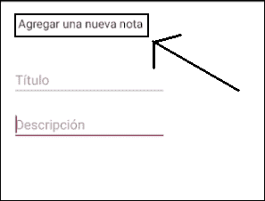

# 第十八章 本地化

本章内容简单明了，但我们将学会的内容可以使您的应用程序面向数百万潜在用户。我们将看到如何添加额外的语言，以及为什么通过字符串资源正确添加文本在添加多种语言时对我们有益。

在本章中，我们将执行以下操作：

+   通过添加西班牙语和德语语言使 Note to self 应用程序支持多语言

+   学习如何更好地使用**字符串资源**

让我们开始吧。

# 使 Note to self 应用程序支持西班牙语、英语和德语

首先，我们需要为我们的项目添加一些文件夹 - 每种新语言一个文件夹。文本被归类为**资源**，因此需要放在`res`文件夹中。按照以下步骤为项目添加西班牙语支持。

### 注意

虽然该项目的源文件存储在`Chapter18`文件夹中，但它们仅供参考。您需要按照下面描述的流程来实现多语言功能。

## 添加西班牙语支持

按照以下步骤添加西班牙语：

1.  右键单击`res`文件夹，然后选择**新建** | **Android 资源目录**。在**目录名称**字段中输入`values-es`。

1.  现在我们需要添加一个文件，我们可以在其中放置所有我们的西班牙翻译。

1.  右键单击`res`，然后选择**新建** | **Android 资源文件**，在**文件名**字段中输入`strings.xml`。在**目录名称**字段中输入`values-es`。

我们现在有一个`strings.xml`文件，任何设置为使用西班牙语的设备都将引用它。明确地说，我们现在有两个不同的`strings.xml`文件。

## 添加德语支持

按照以下步骤添加德语语言支持。

1.  右键单击`res`文件夹，然后选择**新建** | **Android 资源目录**。在**目录名称**字段中输入`values-de`。

1.  现在我们需要添加一个文件，我们可以在其中放置所有我们的德语翻译。

1.  右键单击`res`，然后选择**新建** | **Android 资源文件**，在**文件名**字段中输入`strings.xml`。在**目录名称**字段中输入`values-de`。

以下屏幕截图显示了`strings.xml`文件夹的外观。您可能想知道`strings.xml`文件夹是从哪里来的，因为它与我们似乎在之前的步骤中创建的结构不对应。

Android Studio 正在帮助我们组织我们的文件和文件夹，因为这是 Android 操作系统在 APK 格式中所需的。但是，您可以清楚地看到西班牙语和德语文件，它们通过它们的国旗以及它们的**(de)**和**(es)**后缀来表示：


### 提示

根据您的 Android Studio 设置，您可能看不到国旗图标。只要您能看到三个`strings.xml`文件，一个没有后缀，一个带有**(de)**，一个带有**(es)**，那么您就可以继续了。

现在我们可以将翻译添加到刚刚创建的文件中。

## 添加字符串资源

正如我们所知，`strings.xml`文件包含应用程序将显示的单词，例如 important，to-do 和 idea。通过为每种我们想要支持的语言创建一个`strings.xml`文件，我们可以让 Android 根据用户的语言设置选择适当的文本。

在接下来的步骤中，请注意，尽管我们将要翻译的单词的翻译放在值中，但`name`属性保持不变。如果你仔细想想，这是合乎逻辑的，因为我们在布局文件中引用的是`name`属性。

让我们提供翻译，看看我们取得了什么成就，然后回来讨论我们将如何处理 Kotlin 代码中的文本。

实现此代码的最简单方法是从原始的`strings.xml`文件中复制并粘贴代码，然后编辑每个`name`属性的值：

1.  通过双击打开`strings.xml`文件。确保选择靠近西班牙国旗或**(es)**后缀的文件。编辑文件使其如下所示：

```kt
<?xml version="1.0" encoding="utf-8"?>
<resources>
<string name="app_name">Nota a sí mismo</string>
<string name="action_settings">Configuración</string>

<string name="action_add">add</string>
<string name="title_hint">Título</string>
<string name="description_hint">Descripción</string>
<string name="idea_text">Idea</string>
<string name="important_text">Importante</string>
<string name="todo_text">Que hacer</string>
<string name="cancel_button">Cancelar</string>
<string name="ok_button">Vale</string>

<string name="settings_title">Configuración</string>
<string name="title_activity_settings">Configuración</string>

</resources>
```

1.  通过双击打开`strings.xml`文件。确保选择靠近德国国旗或**(de)**后缀的文件。编辑文件使其看起来像这样：

```kt
    <?xml version="1.0" encoding="utf-8"?>
    <resources>
 <string name="app_name">Hinweis auf selbst</string>
 <string name="action_settings">Einstellungen</string>

 <string name="action_add">add</string>
 <string name="title_hint">Titel</string>
 <string name="description_hint">Beschreibung</string>
 <string name="idea_text">Idee</string>
 <string name="important_text">Wichtig</string>
 <string name="todo_text">zu tun</string>
 <string name="cancel_button">Abbrechen</string>
 <string name="ok_button">Okay</string>

 <string name="settings_title">Einstellungen</string>
 <string name="title_activity_settings">Einstellungen</string>
    </resources>
```

### 提示

如果你没有在额外的（西班牙语和德语）`strings.xml`文件中提供所有的字符串资源，那么缺失的资源将从默认文件中获取。

我们所做的是提供了两种翻译。Android 知道哪种翻译是哪种语言，因为它们放置在不同的文件夹中。此外，我们使用了**字符串标识符**（`name`属性）来引用这些翻译。回顾一下之前的代码，你会发现相同的标识符被用于两种翻译，以及原始的`strings.xml`文件中。

### 提示

你甚至可以将本地化到不同版本的语言，比如美国或英国英语。完整的代码列表可以在[`stackoverflow.com/questions/7973023/what-is-the-list-of-supported-languages-locales-on-android`](http://stackoverflow.com/questions/7973023/what-is-the-list-of-supported-languages-locales-on-android)找到。你甚至可以本地化资源，比如图像和声音。在[`developer.android.com/guide/topics/resources/localization.html`](http://developer.android.com/guide/topics/resources/localization.html)了解更多信息。

这些翻译是从谷歌翻译中复制并粘贴而来的，因此很可能有些翻译与正确的相去甚远。像这样廉价地进行翻译可能是将具有基本字符串资源集的应用程序放到使用不同语言的用户的设备上的有效方式。一旦你开始需要任何深度的翻译，也许是为了叙事驱动的游戏或社交媒体应用程序的文本，你肯定会受益于由人类专业人员进行的翻译。

这个练习的目的是展示 Android 的工作原理，而不是如何翻译。

### 注意

对于可能能够看到这里提供的翻译的局限性的西班牙或德国人，我表示诚挚的歉意。

现在我们有了翻译，我们可以看到它们的作用-到一定程度。

# 在德语或西班牙语中运行 Note to self

运行应用程序，看看它是否按预期工作。现在，我们可以更改本地化设置，以便在西班牙语中查看。不同的设备在如何做到这一点上略有不同，但 Pixel 2 XL 模拟器可以通过点击**Custom Locale**应用程序进行更改：


接下来，选择**es-ES**，然后点击屏幕左下角的**SELECT 'ES'**按钮，如下一张截图所示：


现在你可以以通常的方式运行应用程序。这里有一张截图显示了应用程序在西班牙语中的运行情况。我用 Photoshop 将一些图像并排放在一起，展示了 Note to self 应用程序的一些不同屏幕：


你可以清楚地看到我们的应用主要是翻译成了西班牙语。显然，用户输入的文本将是他们所说的任何语言-这不是我们应用程序的缺陷。然而，仔细看图片，你会注意到我指出了一些地方，文本仍然是英文的。我们在每个对话窗口中仍然有一些未翻译的文本。

这是因为文本直接包含在我们的 Kotlin 代码中。正如我们所见，使用多种语言的字符串资源并在布局中引用它们是很容易的，但是我们如何从我们的 Kotlin 代码中引用字符串资源呢？

## 使翻译在 Kotlin 代码中起作用

首先要做的是在三个`strings.xml`文件中创建资源。这是需要添加到三个不同文件中的两个资源。

在`strings.xml`（没有任何标志或后缀），在`<resources></resources>`标签中添加这两个资源：

```kt
<string name="add_new_note">Add a new note</string>
<string name="your_note">Your note</string>
```

在带有西班牙国旗和/或**(es)**后缀的`strings.xml`文件中，在`<resources></resources>`标签内添加以下两个资源：

```kt
<string name="add_new_note">Agregar una nueva nota</string>
<string name="your_note">Su nota</string>
```

在带有德国国旗和/或**(de)**后缀的`strings.xml`文件中，在`<resources></resources>`标签内添加以下两个资源：

```kt
<string name="add_new_note">Eine neue Note hinzufügen</string>
<string name="your_note">Ihre Notiz</string>
```

接下来，我们需要编辑一些 Kotlin 代码，以引用资源而不是硬编码的字符串。

打开`DialogNewNote.kt`文件，找到以下代码行：

```kt
builder.setView(dialogView).setMessage("Add a new note")
```

编辑它，使用我们刚刚添加的字符串资源，而不是硬编码的文本，如下所示：

```kt
builder.setView(dialogView).setMessage(
      resources.getString(
         R.string.add_new_note))
```

新代码使用了链式的`setView`、`setMessage`和`resources.getString`函数来替换先前硬编码的`"Add a new note"`文本。仔细看，你会发现传递给`getString`的参数是字符串`R.string.add_new_note`标识符。

`R.string`代码指的是`res`文件夹中的字符串资源，`add_new_note`是我们的标识符。然后，Android 将能够根据应用程序运行的设备的语言环境决定哪个版本（默认、西班牙语或德语）是合适的。

我们还有一个硬编码的字符串资源要更改。

打开`DialogShowNote.kt`文件，找到以下代码行：

```kt
builder.setView(dialogView).setMessage("Your Note")
```

编辑它，使用我们刚刚添加的字符串资源，而不是硬编码的文本，如下所示：

```kt
builder.setView(dialogView).setMessage(
         resources.getString(R.string.your_note))
```

新代码再次使用了链式的`setView`、`setMessage`和`resources.getString`函数来替换先前硬编码的`"Your note"`文本。而且，再次，传递给`getString`的参数是字符串标识符，在这种情况下是`R.string.your_note`。

现在，Android 可以根据应用程序运行的设备的语言环境决定哪个版本（默认、西班牙语或德语）是合适的。下一个屏幕截图显示，新的笔记屏幕现在以适当的语言显示开头文本：



您可以添加任意多个字符串资源。作为第三章的提醒，*探索 Android Studio 和项目结构*，请注意，使用字符串资源是向所有项目添加所有文本的推荐方式。本书中的教程（除了 Note to Self 之外）将倾向于硬编码它们，以使教程更紧凑。

# 总结

现在我们可以全球化我们的应用，以及添加更灵活的字符串资源，而不是硬编码所有文本。

在下一章中，我们将看到如何使用动画和插值器为我们的布局添加酷炫的动画效果。
