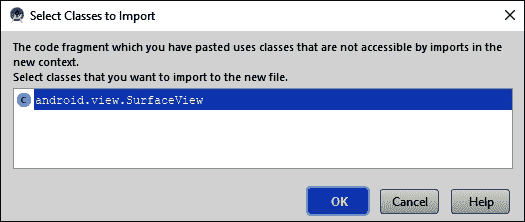
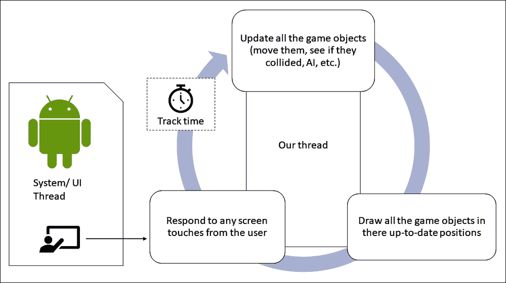

# 第二十一章：线程和启动实时绘图应用程序

在本章中，我们将开始我们的下一个应用程序。这个应用程序将是一个儿童风格的绘图应用程序，用户可以使用手指在屏幕上绘图。然而，我们创建的绘图应用程序将略有不同。用户绘制的线条将由粒子系统组成，这些粒子系统会爆炸成成千上万的碎片。我们将把项目称为*实时绘图*。

为了实现这一点，我们将在本章中涵盖以下主题：

+   开始使用实时绘图应用程序

+   学习实时交互，有时被称为游戏循环

+   学习关于线程

+   编写一个准备好进行绘制的实时系统

让我们开始吧！

# 创建实时绘图项目

要开始，可以在 Android Studio 中创建一个名为`Live Drawing`的新项目。使用**空活动**项目，并将其余设置保持默认。

与上一章的两个绘图应用程序类似，这个应用程序只包含 Kotlin 文件，没有布局文件。到本章结束为止的所有 Kotlin 文件和代码都可以在下载包的`Chapter21`文件夹中找到。完整的项目可以在下载包的`Chapter22`文件夹中找到。

接下来，我们将创建一些空的类，这些类将在接下来的两章中进行编码。创建一个名为`LiveDrawingView`的新类，一个名为`ParticleSystem`的新类，以及一个名为`Particle`的新类。

# 展望实时绘图应用程序

由于这个应用程序更加深入，需要实时响应，因此需要使用稍微更深入的结构。起初，这可能看起来有些复杂，但从长远来看，这将使我们的代码更简单，更容易理解。

在实时绘图应用程序中，我们将有四个类，如下：

+   `MainActivity`：Android API 提供的`Activity`类是与操作系统（OS）交互的类。我们已经看到了当用户点击应用程序图标启动应用程序时，操作系统如何与`onCreate`交互。与其让`MainActivity`类做所有事情，这个基于`Activity`的类将只处理应用程序的启动和关闭，并通过计算屏幕分辨率来提供一些初始化的帮助。这个类将是`Activity`类型而不是`AppCompatActivity`是有道理的。然而，很快你会看到，我们将通过触摸委托交互给另一个类，也就是将处理几乎每个方面的同一个类。这将为我们介绍一些新的有趣的概念。

+   `LiveDrawingView`：这个类将负责绘图，并创建允许用户在其创作移动和发展的同时进行交互的实时环境。

+   `ParticleSystem`：这是一个类，将管理多达数千个`Particle`类的实例。

+   `Particle`：这个类将是最简单的类；它将在屏幕上具有位置和方向。当由`LiveDrawingView`类提示时，它将每秒更新自己大约 60 次。

现在，我们可以开始编码。

# 编写 MainActivity 类

让我们开始编写基于`Activity`的类。通常情况下，这个类被称为`MainActivity`，当我们创建项目时，它是自动生成的。

编辑类声明并添加`MainActivity`类的代码的第一部分：

```kt
import android.app.Activity
import android.os.Bundle
import android.graphics.Point

class MainActivity : Activity() {

    private lateinit var liveDrawingView: LiveDrawingView

    override fun onCreate(savedInstanceState: Bundle?) {
        super.onCreate(savedInstanceState)

        val display = windowManager.defaultDisplay
        val size = Point()
        display.getSize(size)

        liveDrawingView = LiveDrawingView(this, size.x)

        setContentView(liveDrawingView)

    }
}
```

上述代码显示了我们将很快讨论的几个错误。首先要注意的是，我们正在声明`LiveDrawingView`类的一个实例。目前，这是一个空类：

```kt
private lateinit var liveDrawingView: LiveDrawingView
```

下面的代码以以下方式获取设备的像素数（水平和垂直）：

```kt
val display = windowManager.defaultDisplay
```

我们创建了一个名为`display`的`Display`类型的对象，并用`windowManager.defaultDisplay`进行初始化，这是`Activity`类的一部分。

然后，我们创建一个名为`size`的`Point`类型的新对象。我们将`size`作为参数发送到`display.getSize`函数。`Point`类型有`x`和`y`属性，因此`size`对象也有这些属性，在第三行代码之后，`size`现在保存了显示的宽度和高度（以像素为单位）。现在，我们在`size`对象的`x`和`y`属性中有了屏幕分辨率。

接下来，在`onCreate`中，我们初始化`liveDrawingView`如下：

```kt
liveDrawingView = LiveDrawingView(this, size.x)
```

我们正在向`LiveDrawingView`构造函数传递两个参数。显然，我们还没有编写构造函数，而且我们知道，默认构造函数不带参数。因此，在我们解决这个问题之前，这行代码将导致错误。

传入的参数很有趣。首先是`this`，它是对`MainActivity`的引用。`LiveDrawingView`类将需要执行一些操作（使用一些函数），它需要这个引用。

第二个参数是水平屏幕分辨率。我们的应用程序需要这些参数来执行任务，例如将其他绘图对象缩放到适当的大小。当我们开始编写`LiveDrawingView`的构造函数时，我们将进一步讨论这些参数。

现在，看一下接下来的更奇怪的一行：

```kt
setContentView(liveDrawingView)
```

这是在 Canvas Demo 应用程序中，我们将`ImageView`设置为应用程序的内容。请记住，`Activity`类的`setContentView`函数必须接受一个`View`对象，而`ImageView`是一个`View`对象。前面的代码似乎在暗示我们将使用`LiveDrawingView`类作为应用程序的可见内容？但是`LiveDrawingView`，尽管名字是这样，却不是一个`View`对象。至少目前还不是。

在我们向`MainActivity`添加几行代码之后，我们将解决构造函数和不是`View`类型的问题。

添加这两个重写的函数，然后我们将讨论它们。将它们添加到`onCreate`的闭合大括号下面，但在`MainActivity`的闭合大括号之前：

```kt
override fun onResume() {
   super.onResume()

   // More code here later in the chapter
}

override fun onPause() {
   super.onPause()

  // More code here later in the chapter
}
```

我们在这里做的是重写`Activity`类的另外两个函数。我们将看到为什么需要这样做以及我们将在这些函数中做什么。需要注意的是，通过添加这些重写的函数，我们给了操作系统在两种情况下通知我们用户意图的机会，就像我们在 Note to self 应用程序中保存和加载数据时所做的那样。

在这一点上，继续前进到这个应用程序最重要的类`LiveDrawingView`。我们将在本章末尾讨论`MainActivity`。

# 编写 LiveDrawingView 类

我们要做的第一件事是解决`LiveDrawingView`类不是`View`类型并且具有错误构造函数的问题。更新类声明如下：

```kt
class LiveDrawingView(
        context: Context,
        screenX: Int)
    : SurfaceView(context){
```

您将被提示导入`android.view.SurfaceView`类，如下截图所示：



点击**确定**以确认。

`SurfaceView`是`View`的后代，现在`LiveDrawingView`也是`View`的一种类型，通过继承。看一下已添加的`import`语句。这种关系在下面的代码中得到了明确的说明：

```kt
android.view.SurfaceView

```

### 提示

请记住，正是由于多态性，我们可以将`View`的后代发送到`MainActivity`类的`setContentView`函数中，而正是由于继承，`LiveDrawingView`现在是`SurfaceView`的一种类型。

有很多`View`的后代可以扩展以解决这个初始问题，但是随着我们的继续，我们将看到`SurfaceView`具有一些非常特定的功能，非常适合实时交互应用程序，并且这对我们来说是正确的选择。我们还提供了一个与从`MainActivity`调用的参数匹配的构造函数。

要导入`Context`类，请按照以下步骤操作：

1.  将鼠标光标放在新构造函数签名中红色的`Context`文本上。

1.  按住*Alt*键并点击*Enter*键。从弹出选项中选择**导入类**。

前面的步骤将导入`Context`类。现在，我们的`LiveDrawingView`类或初始化它的`MainActivity`类中都没有错误。

在这个阶段，我们可以运行应用程序，看看使用`LiveDrawingView`作为`setContentView`中的`View`参数是否有效，并且我们有一个美丽的空白屏幕，准备在上面绘制我们的粒子系统。如果你愿意，你可以尝试一下，但我们将编写`LiveDrawingView`类，以便它接下来会做一些事情。

记住`LiveDrawingView`无法看到`MainActivity`中的变量。通过构造函数，`MainActivity`提供了一个对自身（`this`）的引用以及包含在`size.x`中的像素屏幕分辨率给`LiveDrawingView`。

在这个项目的过程中，我们将不断回到这个类。我们现在要做的是准备好设置基础，以便在下一章编写`ParticleSystem`实例后添加它们。

为了实现这一点，我们首先会添加一些属性。之后，我们将编写`draw`函数，它将揭示我们需要在屏幕上每秒绘制 60 次的新步骤。此外，我们将看到一些使用我们上一章的老朋友`Canvas`、`Paint`和`drawText`的熟悉代码。

在这一点上，我们需要讨论一些更多的理论；例如，我们将如何计时粒子的动画，以及如何在不干扰 Android 的平稳运行的情况下锁定这些时间。这最后两个主题，即**游戏循环**和**线程**，将允许我们在添加本章的最终代码并观察我们的粒子系统绘画应用程序的同时，尽管只有一点点文本。

### 提示

游戏循环是一个描述允许虚拟系统同时更新和绘制自身的概念，同时允许用户对其进行修改和交互。

## 添加属性

在我们编写的`LiveDrawingView`声明和构造函数之后添加属性，如下面的代码块所示：

```kt
// Are we debugging?
private val debugging = true

// These objects are needed to do the drawing
private lateinit var canvas: Canvas
private val paint: Paint = Paint()

// How many frames per second did we get?
private var fps: Long = 0
// The number of milliseconds in a second
private val millisInSecond: Long = 1000

// How big will the text be?
// Font is 5% (1/20th) of screen width
// Margin is 1.5% (1/75th) of screen width
private val fontSize: Int = mScreenX / 20
private val fontMargin: Int = mScreenX / 75

// The particle systems will be declared here later
```

确保你学习了代码，然后我们会讨论它。注意所有的属性都声明为`private`。你可以愉快地删除所有的`private`访问修饰符，代码仍然可以正常工作，但是，由于我们不需要从这个类的外部访问任何这些属性，所以通过声明它们为`private`来保证这永远不会发生是明智的。

第一个属性是`debugging`。我们将使用它来手动切换打印调试信息和不打印调试信息。

我们声明的两个类实例将处理屏幕上的绘制：

```kt
// These objects are needed to do the drawing
private lateinit var canvas: Canvas
private val paint: Paint = Paint()
```

以下两个属性将为我们提供一些关于我们需要实现平滑和一致动画的见解：

```kt
// How many frames per second did we get?
private var fps: Long = 0
// The number of milliseconds in a second
private val millisInSecond: Long = 1000
```

这两个属性都是`long`类型，因为它们将保存一个我们将用来测量时间的大数字。计算机根据自 1970 年以来的毫秒数来测量时间。我们将在学习游戏循环时更多地讨论这个问题；然而，现在，我们需要知道监视和测量每一帧动画的速度是如何确保粒子移动正如它们应该的。

第一个变量`fps`将在每一帧动画中重新初始化，大约每秒 60 次。它将被传递到每个`ParticleSystem`对象（每一帧动画）中，以便它们知道经过了多少时间，然后可以计算应该移动多远或不移动。

`millisInSecond`变量初始化为`1000`。一秒钟确实有`1000`毫秒。我们将在计算中使用这个变量，因为它会使我们的代码比使用字面值 1,000 更清晰。

我们刚刚添加的代码的下一部分如下所示：

```kt
// How big will the text be?
// Font is 5% (1/20th) of screen width
// Margin is 1.5% (1/75th) of screen width
private val fontSize: Int = screenX / 20
private val fontMargin: Int = screenX / 75
```

`fontSize`和`marginSize`属性将根据通过构造函数传入的像素屏幕分辨率（`screenX`）进行初始化。它们将保存以像素为单位的值，以使我们的文本格式整洁而简洁，而不是为每个文本部分不断进行计算。

在我们继续之前，我们应该明确一下，这些是您目前应该在`LiveDrawingView.kt`代码文件顶部拥有的`import`语句：

```kt
import android.content.Context
import android.graphics.Canvas
import android.graphics.Paint
import android.view.SurfaceView
```

现在，让我们准备好绘制。

## 编写 draw 函数

在我们刚刚添加的属性之后立即添加`draw`函数。代码中会有一些错误。我们将首先处理它们，然后我们将详细讨论`draw`函数与`SurfaceView`的关系，因为其中有一些看起来很陌生的代码行，以及一些熟悉的代码行。添加以下代码：

```kt
// Draw the particle systems and the HUD
private fun draw() {
   if (holder.surface.isValid) {
         // Lock the canvas (graphics memory) ready to draw
         canvas = holder.lockCanvas()

         // Fill the screen with a solid color
         canvas.drawColor(Color.argb(255, 0, 0, 0))

         // Choose a color to paint with
         paint.color = Color.argb(255, 255, 255, 255)

         // Choose the font size
         paint.textSize = fontSize.toFloat()

         // Draw the particle systems

         // Draw the HUD

         if (debugging) {
               printDebuggingText()
         }
         // Display the drawing on screen
         // unlockCanvasAndPost is a 
         // function of SurfaceHolder
         holder.unlockCanvasAndPost(canvas)
   }
}
```

我们有两个错误 - 一个错误是需要导入`Color`类。您可以按照通常的方式修复这个问题，或者手动添加下一行代码。无论您选择哪种方法，以下额外的行需要添加到文件顶部的代码中：

```kt
import android.graphics.Color;
```

现在让我们处理另一个错误。

### 添加 printDebuggingText 函数

第二个错误是调用`printDebuggingText`。该函数尚不存在，所以现在让我们添加它。按照以下方式在`draw`函数之后添加代码：

```kt
private fun printDebuggingText() {
   val debugSize = fontSize / 2
   val debugStart = 150
   paint.textSize = debugSize.toFloat()
   canvas.drawText("fps: $fps",
         10f, (debugStart + debugSize).toFloat(), paint)

 }
```

先前的代码使用本地的`debugSize`变量来保存`fontSize`属性值的一半。这意味着，由于`fontSize`（用于**HUD**）是根据屏幕分辨率动态初始化的，`debugSize`将始终是其一半。

### 提示

HUD 代表抬头显示，是指覆盖应用程序中其他对象的按钮和文本的一种花哨方式。

然后使用`debugSize`变量来设置字体的大小，然后开始绘制文本。`debugStart`变量是一个整洁的垂直位置的猜测，用于开始打印调试文本，并留有一些填充，以免它被挤得太靠近屏幕边缘。

然后使用这两个值来定位屏幕上显示当前每秒帧数的一行文本。由于此函数是从`draw`调用的，而`draw`又将从游戏循环中调用，因此这行文本将每秒刷新多达 60 次。

### 注意

在非常高或非常低分辨率屏幕上，您可能需要尝试不同的值，以找到适合您屏幕的值。

让我们探索`draw`函数中的这些新代码行，并确切地检查我们如何使用`SurfaceView`来处理所有绘图需求，从而处理我们的`LiveDrawingView`类的派生。

## 理解 draw 函数和 SurfaceView 类

从函数的中间开始，向外工作，我们有一些熟悉的东西，比如调用`drawColor`，然后我们像以前一样设置颜色和文本大小。我们还可以看到注释，指示我们最终将添加绘制粒子系统和 HUD 的代码的位置：

+   `drawColor`代码用纯色清除屏幕。

+   `paint`的`textSize`属性设置了绘制 HUD 的文本大小。

+   一旦我们更深入地探索了粒子系统，我们将编写绘制 HUD 的过程。我们将让玩家知道他们的绘图由多少个粒子和系统组成。

然而，完全新的是`draw`函数开头的代码，如下面的代码块所示：

```kt
if (holder.surface.isValid) {
         // Lock the canvas (graphics memory) ready to draw
         canvas = holder.lockCanvas()
```

`if`条件是`holder.surface.isValid`。如果这行返回 true，则确认我们要操作的内存区域以表示我们的绘图帧是可用的，然后代码继续在`if`语句内部。

这是因为我们所有的绘图和其他处理（比如移动对象）都将异步进行，而代码则会检测用户输入并监听操作系统的消息。这在以前的项目中不是问题，因为我们的代码只是坐在那里等待输入，绘制一个帧，然后再次坐在那里等待。

现在我们想要每秒连续执行 60 次代码，我们需要确认我们能够访问绘图的内存，然后再访问它。

这引发了另一个关于这段代码如何异步运行的问题。但这将在我们不久后讨论线程时得到解答。现在，只需知道这行代码检查另一部分我们的代码或 Android 本身是否正在使用所需的内存部分。如果空闲，那么`if`语句内的代码将执行。

此外，在`if`语句内执行的第一行代码调用`lockCanvas`，这样如果代码的另一部分在我们访问内存时尝试访问内存，它将无法访问 - 然后我们进行所有的绘制。

最后，在`draw`函数中，以下代码（加上注释）出现在最后：

```kt
// Display the drawing on screen
// unlockCanvasAndPost is a 
// function of SurfaceHolder
holder.unlockCanvasAndPost(canvas)
```

`unlockCanvasAndPost`函数将我们新装饰的`Canvas`对象（`canvas`）发送到屏幕上进行绘制，并释放锁定，以便其他代码区域可以使用它，尽管非常短暂，在整个过程开始之前。这个过程发生在每一帧动画中。

我们现在理解了`draw`函数中的代码。然而，我们仍然没有调用`draw`函数的机制。事实上，我们甚至没有调用`draw`函数一次。接下来，我们将讨论游戏循环和线程。

# 游戏循环

那么，游戏循环到底是什么？几乎每个实时绘图、基于图形的应用程序和游戏都有一个游戏循环。甚至你可能没有想到的游戏，比如回合制游戏，仍然需要将玩家输入与绘图和人工智能同步，同时遵循底层操作系统的规则。

应用程序中的对象需要不断更新，比如移动它们并在当前位置绘制所有内容，同时响应用户输入：


我们的游戏循环包括三个主要阶段：

1.  通过移动它们、检测碰撞和处理人工智能（如粒子运动和状态变化）来更新所有游戏和绘图对象

1.  根据刚刚更新的数据，绘制动画的最新状态帧

1.  响应用户的屏幕触摸

我们已经有一个`draw`函数来处理循环的这一部分。这表明我们将有一个函数来进行所有的更新。我们很快将编写一个`update`函数的大纲。此外，我们知道我们可以响应屏幕触摸，尽管我们需要稍微调整之前所有项目的方式，因为我们不再在`Activity`类内部工作，也不再使用布局中的传统 UI 小部件。

还有一个问题，就是（我简要提到过的）所有的更新和绘制都是异步进行的，以便检测屏幕触摸并监听操作系统。

### 提示

只是为了明确，异步意味着它不会同时发生。我们的代码将通过与 Android 和 UI 共享执行时间来工作。CPU 将在我们的代码、Android 或用户输入之间非常快速地来回切换。

但这三个阶段将如何循环？我们将如何编写这个异步系统，从中可以调用`update`和`draw`，并且如何使循环以正确的速度（或帧率）运行？

正如你可能猜到的那样，编写一个高效的游戏循环并不像一个`while`循环那样简单。

### 注意

然而，我们的游戏循环也将包含一个`while`循环。

我们需要考虑时间、开始和停止循环，以及不会导致操作系统变得无响应，因为我们正在独占整个 CPU 在我们的单个循环中。

但是我们何时以及如何调用我们的`draw`函数？我们如何测量和跟踪帧速率？考虑到这些问题，我们完成的游戏循环可能更好地由以下图表表示——注意引入**线程**的概念：



既然我们知道我们想要实现什么，那么让我们学习一下线程。

# 线程

那么，什么是线程？你可以把编程中的线程看作是故事中的线程。在故事的一个线程中，我们可能有主要角色在前线与敌人作战，而在另一个线程中，士兵的家人正在过着日常生活。当然，一个故事不一定只有两个线程——我们可以引入第三个线程。例如，故事还讲述了政治家和军事指挥官做出决策，这些决策会以微妙或不那么微妙的方式影响其他线程中发生的事情。

编程线程就像这样。我们在程序中创建部分或线程来控制不同的方面。在 Android 中，当我们需要确保一个任务不会干扰应用程序的主（UI）线程时，或者当我们有一个需要很长时间才能完成并且不能中断主线程执行的后台任务时，线程尤其有用。我们引入线程来代表这些不同的方面，原因如下：

+   从组织的角度来看，这是有道理的

+   它们是一种经过验证的构建程序的方法。

+   我们正在处理的系统的性质迫使我们无论如何都要使用它们

在 Android 中，我们同时出于这三个原因使用线程——因为这是有道理的，它有效，而且我们必须使用线程，因为 Android 系统的设计要求如此。

通常，我们在不知情的情况下使用线程。这是因为我们使用的类会代表我们使用线程。我们在第十九章中编写的所有动画，*动画和插值*，都在线程中运行。在 Android 中的另一个例子是`SoundPool`类，它在一个线程中加载声音。我们将在第二十三章中看到，或者说听到，`SoundPool`的作用，*Android 音效和 Spinner 小部件*。我们将再次看到，我们的代码不必处理我们即将学习的线程方面，因为这一切都由类内部处理。然而，在这个项目中，我们需要更多地参与其中。

在实时系统中，想象一下一个线程同时接收玩家的左右移动按钮点击，同时监听来自操作系统的消息，比如调用`onCreate`（以及我们稍后将看到的其他函数）的一个线程，以及另一个线程绘制所有图形并计算所有移动。

## 线程的问题

具有多个线程的程序可能会出现与之相关的问题，就像故事的线程一样；如果适当的同步没有发生，那么事情可能会出错。如果我们的士兵在战斗甚至战争之前就进入了战斗，会发生什么？

假设我们有一个变量，`Int x`，代表我们程序的三个线程使用的一个关键数据。如果一个线程稍微超前于自己，并使数据对其他两个线程来说“错误”会发生什么？这个问题是由多个线程竞争完成而保持无视而引起的**正确性**问题——因为毕竟，它们只是愚蠢的代码。

正确性问题可以通过对线程和锁定的密切监督来解决。**锁定**意味着暂时阻止一个线程的执行，以确保事情以同步的方式工作；这类似于防止士兵在战船靠岸并放下舷梯之前登船，从而避免尴尬的溅水。

多线程程序的另一个问题是**死锁**问题。在这种情况下，一个或多个线程被锁定，等待“正确”的时刻来访问`Int x`；然而，那个时刻永远不会到来，最终整个程序都会停滞不前。

你可能已经注意到，第一个问题（正确性）的解决方案是第二个问题（死锁）的原因。

幸运的是，这个问题已经为我们解决了。就像我们使用`Activity`类并重写`onCreate`来知道何时需要创建我们的应用程序一样，我们也可以使用其他类来创建和管理我们的线程。例如，对于`Activity`，我们只需要知道如何使用它们，而不需要知道它们是如何工作的。

那么，当你不需要了解它们时，我为什么要告诉你关于线程呢？这只是因为我们将编写看起来不同并且结构不熟悉的代码。我们可以实现以下目标：

+   理解线程的一般概念，它与几乎同时发生的故事线程相同

+   学习使用线程的几条规则

通过这样做，我们将毫无困难地编写我们的 Kotlin 代码来创建和在我们的线程中工作。Android 有几个不同的类来处理线程，不同的线程类在不同的情况下效果最好。

我们需要记住的是，我们将编写程序的部分，它们几乎同时运行。

### 提示

几乎是什么意思？发生的是 CPU 在线程之间轮换/异步地。然而，这发生得如此之快，以至于我们除了同时性/同步性之外无法感知任何东西。当然，在故事线程的类比中，人们确实是完全同步地行动。

让我们来看看我们的线程代码将是什么样子。现在先不要向项目添加任何代码。我们可以声明一个`Thread`类型的对象，如下所示：

```kt
private lateinit var thread: Thread
```

然后可以按以下方式初始化并启动它：

```kt
// Initialize the instance of Thread
thread = Thread(this)

// Start the thread
thread.start()
```

线程还有一个谜团；再看一下初始化线程的构造函数。以下是代码行，以方便你查看：

```kt
thread = Thread(this)
```

看一下传递给构造函数的参数；我们传入了`this`。请记住，代码是放在`LiveDrawingView`类中的，而不是`MainActivity`。因此，我们可以推断`this`是对`LiveDrawingView`类（它扩展了`SurfaceView`）的引用。

在 Android 总部的工程师编写`Thread`类时，他们很可能不会意识到有一天我们会编写我们的`LiveDrawingView`类。那么，这怎么可能呢？

`Thread`类需要传入一个完全不同的类型到它的构造函数。`Thread`构造函数需要一个`Runnable`对象。

### 注意

你可以通过查看 Android 开发者网站上的`Thread`类来确认这一事实：[`developer.android.com/reference/java/lang/Thread.html#Thread(java.lang.Runnable)`](https://developer.android.com/reference/java/lang/Thread.html#Thread(java.lang.Runnable))。

你还记得我们在第十二章中讨论过接口吗，*将我们的 Kotlin 连接到 UI 和空值*？作为提醒，我们可以通过在类声明后添加接口名称来实现接口。

然后我们必须实现接口的抽象函数。`Runnable`只有一个函数，就是`run`函数。

### 注意

你可以通过查看 Android 开发者网站上的`Runnable`接口来确认这个事实：[`developer.android.com/reference/java/lang/Runnable.html`](https://developer.android.com/reference/java/lang/Runnable.html)。

我们可以使用`override`关键字来改变当操作系统允许我们的线程对象运行其代码时发生的情况：

```kt
override fun run() {
         // Anything in here executes in a thread
         // No skill needed on our part
         // It is all handled by Android, the Thread class
         // and the Runnable interface
}
```

在重写的`run`函数中，我们将调用两个函数，一个是我们已经开始的`draw`，另一个是`update`。 `update`函数是我们所有计算和人工智能的地方。代码将类似于以下代码块，但现在不要添加：

```kt
override fun run() { 
    // Update the drawing based on
    // user input and physics
    update()

    // Draw all the particle systems in their updated locations
    draw() 
}
```

在适当的时候，我们也可以停止我们的线程，如下所示：

```kt
thread.join()
```

现在，`run`函数中的所有内容都在一个单独的线程中执行，使默认或 UI 线程监听触摸和系统事件。我们很快将看到这两个线程如何相互通信在绘图项目中。

请注意，我们的应用程序中所有这些代码的确切位置尚未解释，但在真实项目中向您展示会更容易。

# 使用线程实现游戏循环

现在我们已经了解了游戏循环和线程，我们可以将它们全部整合到 Living Drawing 项目中来实现我们的游戏循环。

我们将添加整个游戏循环的代码，包括在`MainActivity`类中编写两个函数的代码，以启动和停止控制循环的线程。

### 提示

**读者挑战**

您能自己想出`Activity`-based 类将如何在`LiveDrawingView`类中启动和停止线程吗？

## 实现 Runnable 并提供 run 函数

通过实现`Runnable`来更新类声明，如下所示：

```kt
class LiveDrawingView(
        context: Context,
        screenX: Int)
    : SurfaceView(context), Runnable {
```

请注意，代码中出现了一个新错误。将鼠标光标悬停在`Runnable`一词上，您将看到一条消息，告诉您我们需要实现`run`函数，就像我们在上一节关于接口和线程的讨论中讨论的那样。添加空的`run`函数，包括`override`标签。

无论您在何处添加它，只要在`LiveDrawingView`类的大括号内而不是在另一个函数内。添加空的`run`函数，如下所示：

```kt
// When we start the thread with:
// thread.start();
// the run function is continuously called by Android
// because we implemented the Runnable interface
// Calling thread.join();
// will stop the thread
override fun run() {

}
```

错误已经消失，现在我们可以声明和初始化一个`Thread`对象了。

## 编写线程

在`LiveDrawingView`类的所有其他成员下面声明一些变量和实例，如下所示：

```kt
// Here is the Thread and two control variables
private lateinit var thread: Thread
// This volatile variable can be accessed
// from inside and outside the thread
@Volatile
private var drawing: Boolean = false
private var paused = true
```

现在，我们可以启动和停止线程了-花点时间考虑我们可能在哪里这样做。请记住，应用程序需要响应启动和停止应用程序的操作系统。

## 启动和停止线程

现在，我们需要启动和停止线程。我们已经看到了我们需要的代码，但是何时何地应该这样做呢？让我们添加两个函数的代码-一个用于启动，一个用于停止-然后我们可以考虑何时何地调用这些函数。在`LiveDrawingView`类中添加这两个函数。如果它们的名称听起来很熟悉，那并非偶然：

```kt
// This function is called by MainActivity
// when the user quits the app
fun pause() {
   // Set drawing to false
   // Stopping the thread isn't
   // always instant
   drawing = false
   try {
         // Stop the thread
         thread.join()
  }  catch (e: InterruptedException) {
     Log.e("Error:", "joining thread")
  }

}

// This function is called by MainActivity
// when the player starts the app
fun resume() {
    drawing = true
    // Initialize the instance of Thread
    thread = Thread(this)

    // Start the thread
    thread.start()
}
```

注释略微透露了发生的事情。现在我们有一个`pause`和`resume`函数，使用我们之前讨论过的相同代码来停止和启动`Thread`对象。

请注意，新函数是`public`的，因此它们可以从类外部访问，任何具有`LiveDrawingView`实例的其他类都可以访问。请记住，`MainActivity`保存了完全声明和初始化的`LiveDrawingView`实例。

让我们使用 Android Activity 生命周期来调用这两个新函数。

## 使用 Activity 生命周期来启动和停止线程

更新`MainActivity`中重写的`onResume`和`onPause`函数，如下所示：

```kt
override fun onResume() {
  super.onResume()

  // More code here later in the chapter
 liveDrawingView.resume()
}

override fun onPause() {
   super.onPause()

   // More code here later in the chapter
 liveDrawingView.pause()
}
```

现在，我们的线程将在操作系统恢复和暂停我们的应用程序时启动和停止。请记住，`onResume`在应用程序首次启动时（不仅是从暂停恢复时）调用，而不仅仅是在从暂停恢复后调用。在`onResume`和`onPause`中的代码使用`liveDrawingView`对象调用其`resume`和`pause`函数，这些函数又调用启动和停止线程的代码。然后触发线程的`run`函数执行。就是在这个`run`函数（在`LiveDrawingView`中）中，我们将编写我们的游戏循环。现在让我们来做这个。

## 编写 run 函数

尽管我们的线程已经设置好并准备就绪，但由于`run`函数为空，所以什么也不会发生。编写`run`函数，如下所示：

```kt
override fun run() {
   // The drawing Boolean gives us finer control
   // rather than just relying on the calls to run
   // drawing must be true AND
   // the thread running for the main
   // loop to execute
   while (drawing) {

         // What time is it now at the 
         // start of the loop?
         val frameStartTime = 
               System.currentTimeMillis()

        // Provided the app isn't paused
        // call the update function
        if (!paused) {
              update()
        }

        // The movement has been handled
        // we can draw the scene.
        draw()

        // How long did this frame/loop take?
        // Store the answer in timeThisFrame
        val timeThisFrame = System.currentTimeMillis() 
            - frameStartTime

      // Make sure timeThisFrame is 
      // at least 1 millisecond
      // because accidentally dividing
      // by zero crashes the app
      if (timeThisFrame > 0) {
            // Store the current frame rate in fps
            // ready to pass to the update functions of
            // of our particles in the next frame/loop
            fps = millisInSecond / timeThisFrame
      }
   }
}
```

请注意，Android Studio 中有两个错误。这是因为我们还没有编写`update`函数。让我们快速添加一个空函数（带有注释）；我在`run`函数后面添加了我的：

```kt
private fun update() {
   // Update the particles
}
```

现在，让我们逐步详细讨论`run`函数中的代码如何通过一步一步的方式实现游戏循环的目标。

这第一部分启动了一个`while`循环，条件是`drawing`，然后将代码的其余部分包装在`run`中，以便线程需要启动（调用`run`）并且`drawing`需要为`true`才能执行`while`循环：

```kt
override fun run() {
   // The drawing Boolean gives us finer control
   // rather than just relying on the calls to run
   // drawing must be true AND
   // the thread running for the main
   // loop to execute
   while (drawing) {
```

`while`循环内的第一行代码声明并初始化了一个名为`frameStartTime`的局部变量，其值为当前时间。`System`类的`currentTimeMillis`函数返回此值。如果以后我们想要测量一帧花费了多长时间，那么我们需要知道它开始的时间：

```kt
// What time is it now at the 
// start of the loop?
val frameStartTime = 
  System.currentTimeMillis()
```

接下来，在`while`循环中，我们检查应用程序是否暂停，只有在应用程序没有暂停的情况下，才会执行下一段代码。如果逻辑允许在此块内执行，则调用`update`：

```kt
// Provided the app isn't paused
// call the update function
if (!paused) {
   update()
}
```

在前一个`if`语句之外，调用`draw`函数以绘制所有对象的最新位置。此时，另一个局部变量被声明并初始化为完成整个帧（更新和绘制）所花费的时间长度。这个值是通过获取当前时间（再次使用`currentTimeMillis`）并从中减去`frameStartTime`来计算的，如下所示：

```kt
// The movement has been handled
// we can draw the scene.
draw()

// How long did this frame/loop take?
// Store the answer in timeThisFrame
val timeThisFrame = System.currentTimeMillis() 
  - frameStartTime
```

下一个`if`语句检测`timeThisFrame`是否大于零。如果线程在对象初始化之前运行，该值可能为零。如果您查看`if`语句内的代码，它通过将经过的时间除以`millisInSecond`来计算帧速率。如果除以零，应用程序将崩溃，这就是我们进行检查的原因。

一旦`fps`获得了分配给它的值，我们可以在下一帧中使用它传递给`update`函数，该函数将更新我们将在下一章中编写的所有粒子。它们将使用该值来确保它们根据其目标速度和刚刚结束的动画帧的长度移动了精确的数量：

```kt
// Make sure timeThisFrame is 
// at least 1 millisecond
// because accidentally dividing
// by zero crashes the app
if (timeThisFrame > 0) {
   // Store the current frame rate in fps
   // ready to pass to the update functions of
   // of our particles in the next frame/loop
   fps = millisInSecond / timeThisFrame
}
```

在每一帧中初始化`fps`的计算结果是，`fps`将保存一个分数。随着帧速率的波动，`fps`将保存不同的值，并为粒子系统提供适当的数量来计算每次移动。

# 运行应用程序

在 Android Studio 中单击播放按钮，本章的辛勤工作和理论将变为现实：


您可以看到，我们现在使用我们的游戏循环和线程创建了一个实时系统。如果您在真实设备上运行此应用程序，您将很容易在此阶段实现每秒 60 帧。

# 总结

这可能是迄今为止最技术性的一章。我们探讨了线程、游戏循环、定时、使用接口和`Activity`生命周期 - 这是一个非常长的主题列表。

如果这些事物之间的确切相互关系仍然不是很清楚，那也没关系。您只需要知道，当用户启动和停止应用程序时，`MainActivity`类将通过调用`LiveDrawingView`类的`pause`和`resume`函数来处理启动和停止线程。它通过重写的`onPause`和`onResume`函数来实现，这些函数由操作系统调用。

一旦线程运行，`run`函数内的代码将与监听用户输入的 UI 线程一起执行。通过同时从`run`函数调用`update`和`draw`函数，并跟踪每帧花费的时间，我们的应用程序已经准备就绪。

我们只需要允许用户向他们的艺术作品添加一些粒子，然后我们可以在每次调用`update`时更新它们，并在每次调用`draw`时绘制它们。

在下一章中，我们将编写、更新和绘制`Particle`和“ParticleSystem”类。此外，我们还将为用户编写代码，使其能够与应用程序进行交互（进行一些绘图）。
