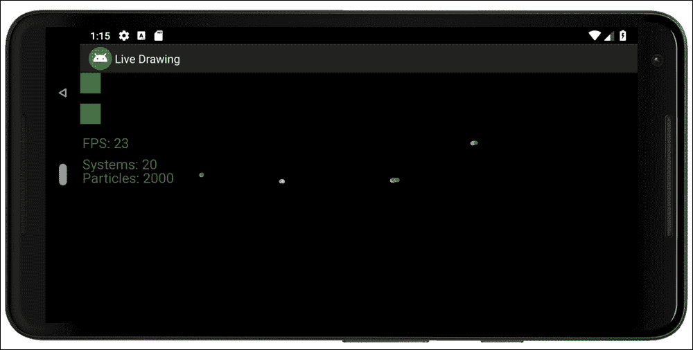
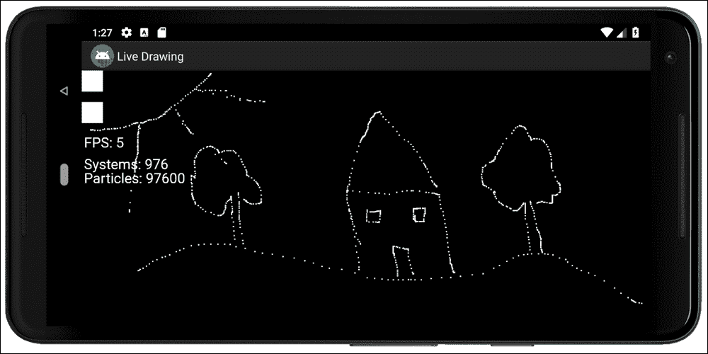

# 第二十二章。粒子系统和处理屏幕触摸

我们已经在上一章中使用线程实现了我们的实时系统。在本章中，我们将创建将存在并在这个实时系统中演变的实体，就像它们有自己的思想一样。

我们还将学习用户如何通过学习如何设置与屏幕交互的能力来将这些实体绘制到屏幕上。这与在 UI 布局中与小部件交互是不同的。

以下是本章的内容：

+   向屏幕添加自定义按钮

+   编写`Particle`类的代码

+   编写`ParticleSystem`类的代码

+   处理屏幕触摸

我们将首先向我们的应用程序添加自定义 UI。

# 向屏幕添加自定义按钮

我们需要让用户控制何时开始另一个绘图并清除屏幕上的先前工作。我们还需要让用户能够决定何时将绘图带到生活中。为了实现这一点，我们将在屏幕上添加两个按钮，分别用于这些任务。

在`LiveDrawingView`类的其他属性之后，将以下新属性添加到代码中：

```kt
// These will be used to make simple buttons
private var resetButton: RectF
private var togglePauseButton: RectF
```

我们现在有两个`RectF`实例。这些对象每个都包含四个`Float`坐标，每个按钮的每个角都有一个坐标。

我们现在将向`LiveDrawingView`类添加一个`init`块，并在首次创建`LiveDrawingView`实例时初始化位置，如下所示：

```kt
init {
   // Initialize the two buttons
   resetButton = RectF(0f, 0f, 100f, 100f)
   togglePauseButton = RectF(0f, 150f, 100f, 250f)
}
```

现在我们已经为按钮添加了实际坐标。如果你在屏幕上可视化这些坐标，你会看到它们在左上角，暂停按钮就在重置/清除按钮的下方。

现在我们可以绘制按钮。将以下两行代码添加到`LiveDrawingView`类的`draw`函数中。现有的注释准确显示了新突出显示的代码应该放在哪里：

```kt
// Draw the buttons
canvas.drawRect(resetButton, paint)
canvas.drawRect(togglePauseButton, paint)

```

新代码使用了`drawRect`函数的重写版本，我们只需将我们的两个`RectF`实例直接传递给通常的`Paint`实例。我们的按钮现在将出现在屏幕上。

我们将在本章后面看到用户如何与这些略显粗糙的按钮交互。

# 实现粒子系统效果

粒子系统是控制粒子的系统。在我们的情况下，`ParticleSystem`是一个我们将编写的类，它将产生`Particle`类的实例（许多实例），这些实例将一起创建一个简单的爆炸效果。

这是一些由粒子系统控制的粒子的屏幕截图，可能在本章结束时出现：


为了澄清，每个彩色方块都是`Particle`类的一个实例，所有`Particle`实例都由`ParticleSystem`类控制和持有。此外，用户将通过用手指绘制来创建多个（数百个）`ParticleSystem`实例。粒子系统将出现为点或块，直到用户点击暂停按钮并使其活动起来。我们将仔细检查代码，以便您能够在代码中修改`Particle`和`ParticleSystem`实例的大小、颜色、速度和数量。

### 注意

读者可以将额外的按钮添加到屏幕上，以允许用户更改这些属性作为应用程序的功能。

我们将首先编写`Particle`类的代码。

## 编写`Particle`类的代码

添加`import`语句，成员变量，构造函数和以下代码中显示的`init`块：

```kt
import android.graphics.PointF

class Particle(direction: PointF) {

    private val velocity: PointF = PointF()
    val position: PointF = PointF()

    init {
          // Determine the direction
          velocity.x = direction.x
          velocity.y = direction.y
    }
```

我们有两个属性——一个用于速度，一个用于位置。它们都是`PointF`对象。`PointF`保存两个`Float`值。粒子的位置很简单：它只是一个水平和垂直值。速度值值得解释一下。`velocity`对象`PointF`中的两个值将是速度，一个是水平的，另一个是垂直的。这两个速度的组合将产生一个方向。

接下来，添加以下`update`函数；我们稍后将更详细地查看它：

```kt
fun update() {
    // Move the particle
    position.x += velocity.x
    position.y += velocity.y
}
```

每个`Particle`实例的`update`函数将由`ParticleSystem`对象的`update`函数在应用程序的每一帧中调用，而`ParticleSystem`对象的`update`函数将由`LiveDrawingView`类（再次在`update`函数中）调用，我们将在本章后面编写。

在`update`函数中，`position`的水平和垂直值将使用`velocity`的相应值进行更新。

### 提示

请注意，我们在更新中没有使用当前的帧速率。如果您想确保您的粒子以确切的速度飞行，您可以修改这一点，但所有的速度都将是随机的。添加这个额外的计算并没有太多好处（对于每个粒子）。然而，正如我们很快会看到的，`ParticleSystem`类需要考虑每秒的帧数来测量它应该运行多长时间。

现在我们可以继续进行`ParticleSystem`类的学习。

## 编写 ParticleSystem 类

`ParticleSystem`类比`Particle`类有更多的细节，但仍然相当简单。记住我们需要用这个类来实现的功能：持有、生成、更新和绘制一堆（相当大的一堆）`Particle`实例。

添加以下构造函数、属性和导入语句：

```kt
import android.graphics.Canvas
import android.graphics.Color
import android.graphics.Paint
import android.graphics.PointF

import java.util.*

class ParticleSystem {

    private var duration: Float = 0f
    private var particles: 
         ArrayList<Particle> = ArrayList()

    private val random = Random()
    var isRunning = false
```

我们有四个属性：首先是一个名为`duration`的`Float`，它将被初始化为我们希望效果运行的秒数；名为`particles`的`ArrayList`实例，它持有`Particle`实例，并将保存我们为该系统实例化的所有`Particle`对象。

创建名为`random`的`Random`实例，因为我们需要生成如此多的随机值，每次创建一个新对象都会使我们的速度变慢一点。

最后，名为`isRunning`的`Boolean`将跟踪粒子系统当前是否正在显示（更新和绘制）。

现在我们可以编写`initParticles`函数。每当我们想要一个新的`ParticleSystem`时，将调用此函数。请注意，唯一的参数是一个名为`numParticles`的`Int`。

当我们调用`initParticles`时，我们可以有一些乐趣来初始化大量的粒子。添加以下`initParticles`函数，然后我们将更仔细地查看代码：

```kt
fun initParticles(numParticles:Int){

   // Create the particles
   for (i in 0 until numParticles) {
         var angle: Double = random.nextInt(360).toDouble()
         angle *= (3.14 / 180)

         // Option 1 - Slow particles
         val speed = random.nextFloat() / 3

         // Option 2 - Fast particles
         //val speed = (random.nextInt(10)+1);

         val direction: PointF

         direction = PointF(Math.cos(
                     angle).toFloat() * speed,
                     Math.sin(angle).toFloat() * speed)

         particles.add(Particle(direction))

    }
}
```

`initParticles`函数只包括一个`for`循环来完成所有工作。`for`循环从零到`numParticles`运行。

首先生成介于 0 和 359 之间的随机数，并将其存储在`Float angle`中。接下来，有一点数学运算，我们将`angle`乘以`3.14/180`。这将角度从度转换为弧度制的度量，这是`Math`类所需的度量单位，我们稍后将在其中使用。

然后，我们生成另一个介于 1 和 10 之间的随机数，并将结果分配给名为`speed`的`Float`变量。

### 注意

请注意，我已经添加了注释，以建议代码中的不同值选项。我在`ParticleSystem`类的几个地方都这样做了，当我们到达章节的末尾时，我们将有一些乐趣改变这些值，并看看这对绘图应用程序的影响。

现在我们有了一个随机角度和速度，我们可以将它们转换并组合成一个向量，这个向量可以在每一帧的`update`函数中使用。

### 注意

向量是一个确定方向和速度的值。我们的向量存储在`direction`对象中，直到传递到`Particle`构造函数中。向量可以有许多维度。我们的向量由两个维度组成，因此定义了 0 到 359 度之间的方向和 1 到 10 之间的速度。您可以在我的网站上阅读更多关于向量、方向、正弦和余弦的内容：[`gamecodeschool.com/essentials/calculating-heading-in-2d-games-using-trigonometric-functions-part-1/`](http://gamecodeschool.com/essentials/calculating-heading-in-2d-games-using-trigonometric-functions-part-1/)。

我决定不解释使用`Math.sin`和`Math.cos`创建向量的单行代码，因为其中的魔法部分发生在以下公式中：

+   角度 x`速度`的余弦

+   角度 x`速度`的正弦

其余的魔法发生在`Math`类提供的余弦和正弦函数的隐藏计算中。如果您想了解它们的全部细节，可以查看前面的提示。

最后，创建一个新的`Particle`，然后将其添加到`particles ArrayList`中。

接下来，我们将编写`update`函数。请注意，`update`函数需要当前的帧速率作为参数。编写`update`函数如下：

```kt
fun update(fps: Long) {
   duration -= 1f / fps

   for (p in particles) {
         p.update()
  }

   if (duration < 0) {
         isRunning = false
  }
}
```

`update`函数内部的第一件事是从`duration`中减去经过的时间。请记住，`fps`表示每秒帧数，因此`1/fps`给出的是秒的一小部分值。

接下来是一个`for`循环，它为`particles`中的每个`Particle`实例调用`update`函数。

最后，代码检查粒子效果是否已经完成，如果是，则将`isRunning`设置为`false`。

现在我们可以编写`emitParticles`函数，该函数将使每个`Particle`实例运行，不要与`initParticles`混淆，后者创建所有新粒子并赋予它们速度。`initParticles`函数将在用户开始与屏幕交互之前调用一次，而`emitParticles`函数将在每次效果需要启动时调用，用户在屏幕上绘制时。

使用以下代码添加`emitParticles`函数：

```kt
fun emitParticles(startPosition: PointF) {
    isRunning = true

    // Option 1 - System lasts for half a minute
    duration = 30f

    // Option 2 - System lasts for 2 seconds
    //duration = 3f

    for (p in particles) {
          p.position.x = startPosition.x
          p.position.y = startPosition.y
   }
}
```

首先，注意将`PointF`作为参数传递，所有粒子将从同一位置开始，然后根据它们各自的随机速度在每一帧上扩散。

`isRunning`布尔值设置为`true`，`duration`设置为`30f`，因此效果将持续 30 秒，`for`循环将将每个粒子的位置设置为起始坐标。

我们的`ParticleSysytem`的最终函数是`draw`函数，它将展示效果的全部荣耀。该函数接收对`Canvas`和`Paint`的引用，以便可以绘制到`LiveDrawingView`刚刚在其`draw`函数中锁定的相同`Canvas`实例上。

添加如下的`draw`函数：

```kt
fun draw(canvas: Canvas, paint: Paint) {

    for (p in particles) {

           // Option 1 - Colored particles
           //paint.setARGB(255, random.nextInt(256),
           //random.nextInt(256),
           //random.nextInt(256))

           // Option 2 - White particles
           paint.color = Color.argb(255, 255, 255, 255)
           // How big is each particle?

           // Option 1 - Big particles
           //val sizeX = 25f
           //val sizeY = 25f

           // Option 2 - Medium particles
           //val sizeX = 10f
           //val sizeY = 10f

           // Option 3 - Tiny particles
           val sizeX = 12f
           val sizeY = 12f

           // Draw the particle
           // Option 1 - Square particles
           canvas.drawRect(p.position.x, p.position.y,
                       p.position.x + sizeX,
                       p.position.y + sizeY,
                       paint)

          // Option 2 - Circular particles
          //canvas.drawCircle(p.position.x, p.position.y,
          //sizeX, paint)
   }
}
```

在前面的代码中，`for`循环遍历`particles`中的每个`Particle`实例。然后使用`drawRect`绘制每个`Particle`。

### 注意

再次注意，我建议不同的代码更改选项，这样我们在完成编码后可以有些乐趣。

我们现在可以开始让粒子系统工作了。

## 在`LiveDrawingView`类中生成粒子系统

添加一个充满系统的`ArrayList`实例和一些其他成员来跟踪事物。在现有注释所指示的位置添加以下突出显示的代码：

```kt
// The particle systems will be declared here later
private val particleSystems = ArrayList<ParticleSystem>()

private var nextSystem = 0
private val maxSystems = 1000
private val particlesPerSystem = 100

```

现在我们可以跟踪多达 1,000 个每个系统中有 100 个粒子的粒子系统。随意调整这些数字。在现代设备上，您可以运行数百万个粒子而不会遇到任何问题，但在模拟器上，当粒子数量达到几十万个时，它将开始出现问题。

通过添加以下突出显示的代码在`init`块中初始化系统：

```kt
init {

  // Initialize the two buttons
  resetButton = RectF(0f, 0f, 100f, 100f)
  togglePauseButton = RectF(0f, 150f, 100f, 250f)

  // Initialize the particles and their systems
  for (i in 0 until maxSystems) {
 particleSystems.add(ParticleSystem())
 particleSystems[i]
 .initParticles(particlesPerSystem)
 }
}
```

代码循环遍历`ArrayList`，对每个`ParticleSystem`实例调用构造函数，然后调用`initParticles`。

现在我们可以通过将突出显示的代码添加到`update`函数中，在循环的每一帧中更新系统：

```kt
private fun update() {
  // Update the particles
  for (i in 0 until particleSystems.size) {
 if (particleSystems[i].isRunning) {
 particleSystems[i].update(fps)
         }
 }
}
```

前面的代码循环遍历每个`ParticleSystem`实例，首先检查它们是否活动，然后调用`update`函数并传入当前的每秒帧数。

现在我们可以通过在`draw`函数中添加以下片段中的突出显示代码来在循环的每一帧中绘制系统：

```kt
// Choose the font size
paint.textSize = fontSize.toFloat()

// Draw the particle systems
for (i in 0 until nextSystem) {
 particleSystems[i].draw(canvas, paint)
}

// Draw the buttons
canvas.drawRect(resetButton, paint)
canvas.drawRect(togglePauseButton, paint)
```

先前的代码循环遍历`particleSystems`，对每个调用`draw`函数。当然，我们实际上还没有生成任何实例；为此，我们需要学习如何响应屏幕交互。

# 处理触摸

要开始屏幕交互，将`OnTouchEvent`函数添加到`LiveDrawingView`类中，如下所示：

```kt
override fun onTouchEvent(
   motionEvent: MotionEvent): Boolean {

   return true
}
```

这是一个被覆盖的函数，并且每当用户与屏幕交互时，Android 都会调用它。看看`onTouchEvent`的唯一参数。

事实证明，`motionEvent`中隐藏了大量数据，这些数据包含了刚刚发生的触摸的详细信息。操作系统将其发送给我们，因为它知道我们可能需要其中的一些数据。

请注意，我说的是*其中一部分*。`MotionEvent`类非常庞大；它包含了几十个函数和属性。

目前，我们只需要知道屏幕会在玩家的手指移动、触摸屏幕或移开手指的精确时刻做出响应。

我们将使用`motionEvent`中包含的一些变量和函数，包括以下内容：

+   `action`属性，不出所料，保存了执行的动作。不幸的是，它以稍微编码的格式提供了这些信息，这就解释了其他一些变量的必要性。

+   `ACTION_MASK`变量提供了一个称为掩码的值，再加上一点 Kotlin 技巧，可以用来过滤`action`中的数据。

+   `ACTION_UP`变量，我们可以用它来判断执行的动作（例如移开手指）是否是我们想要响应的动作。

+   `ACTION_DOWN`变量，我们可以用它来判断执行的动作是否是我们想要响应的动作。

+   `ACTION_MOVE`变量，我们可以用它来判断执行的动作是否是移动/拖动动作。

+   `x`属性保存事件发生的水平浮点坐标。

+   `y`属性保存事件发生的垂直浮点坐标。

举个具体的例子，假设我们需要使用`ACTION_MASK`过滤`action`中的数据，并查看结果是否与`ACTION_UP`相同。如果是，那么我们知道用户刚刚从屏幕上移开了手指，也许是因为他们刚刚点击了一个按钮。一旦我们确定事件是正确类型的，我们就需要使用`x`和`y`找出事件发生的位置。

还有一个最后的复杂情况。我提到的 Kotlin 技巧是`&`位运算符，不要与我们一直与`if`关键字一起使用的逻辑`&&`运算符混淆。

`&`位运算符用于检查两个值中的每个对应部分是否为真。这是在使用`ACTION_MASK`和`action`时所需的过滤器。

### 注意

理智检查：我不愿详细介绍`MotionEvent`和位运算。完全可以完成整本书的编写，甚至制作出专业质量的交互式应用，而无需完全理解它们。如果你知道我们将在下一节中编写的代码行确定了玩家触发的事件类型，那么这就是你需要知道的全部。我只是认为像你这样有洞察力的读者可能想了解系统的方方面面。总之，如果你理解位运算，那太好了；你可以继续。如果你不理解，也没关系；你仍然可以继续。如果你对位运算感兴趣（有很多），你可以在[`en.wikipedia.org/wiki/Bitwise_operation`](https://en.wikipedia.org/wiki/Bitwise_operation)上阅读更多关于它们的内容。

现在我们可以编写`onTouchEvent`函数，并查看所有`MotionEvent`的相关内容。

## 编写`onTouchEvent`函数

通过在`onTouchEvent`函数中添加以下片段中的突出显示代码来响应用户在屏幕上移动手指：

```kt
// User moved a finger while touching screen
if (motionEvent.action and MotionEvent.
 ACTION_MASK == 
 MotionEvent.ACTION_MOVE) {

 particleSystems[nextSystem].emitParticles(
 PointF(motionEvent.x,
 motionEvent.y))

 nextSystem++
 if (nextSystem == maxSystems) {
 nextSystem = 0
 }
}

return true
```

`if`条件检查是否事件类型是用户移动手指。如果是，则调用`particleSystems`中的下一个粒子系统的`emitParticles`函数。然后，增加`nextSystem`变量，并进行测试，看它是否是最后一个粒子系统。如果是，则将`nextSystem`设置为零，准备在下次需要时重新使用现有的粒子系统。

我们可以继续让系统响应用户按下按钮，通过在下面的片段中添加高亮显示的代码，紧接着我们刚刚讨论过的代码之后，在我们已经编码的`return`语句之前：

```kt
// Did the user touch the screen
if (motionEvent.action and MotionEvent.ACTION_MASK ==
 MotionEvent.ACTION_DOWN) {

 // User pressed the screen so let's 
 // see if it was in the reset button
 if (resetButton.contains(motionEvent.x,
 motionEvent.y)) {

 // Clear the screen of all particles
 nextSystem = 0
 }

 // User pressed the screen so let's 
 // see if it was in the toggle button
 if (togglePauseButton.contains(motionEvent.x,
 motionEvent.y)) {

 paused = !paused
 }
}

return true
```

`if`语句的条件检查是否用户已经点击了屏幕。如果是，则`RectF`类的`contains`函数与`x`和`y`一起使用，以查看该按压是否在我们的自定义按钮之一内。如果按下了重置按钮，则当`nextSystem`设置为零时，所有粒子将消失。如果按下了暂停按钮，则切换`paused`的值，导致在线程内停止/开始调用`update`函数。

## 完成 HUD

编辑`printDebuggingText`函数中的代码，使其显示如下：

```kt
canvas.drawText("Systems: $nextSystem",
         10f, (fontMargin + debugStart + 
         debugSize * 2).toFloat(), paint)

canvas.drawText("Particles: ${nextSystem * 
         particlesPerSystem}",
         10f, (fontMargin + debugStart 
         + debugSize * 3).toFloat(), paint)
```

前面的代码将在屏幕上打印一些有趣的统计数据，告诉我们当前正在绘制多少粒子和系统。

# 运行应用程序

现在我们可以看到实时绘图应用程序的运行情况，并尝试一些我们在代码中留下注释的不同选项。

以小、圆、多彩、快速的粒子运行应用程序。下面的屏幕截图显示了屏幕上已经被点击了几次：



然后恢复绘图，如下面的屏幕截图所示：


制作一个儿童风格的绘图，粒子小、白色、方形、缓慢、持续时间长，如下面的屏幕截图所示：



然后恢复绘图，并等待 20 秒，让绘图活跃起来并发生变化：


# 摘要

在本章中，我们学习了如何将成千上万个独立的实体添加到我们的实时系统中。这些实体由`ParticleSystem`类控制，而`ParticleSystem`类又与游戏循环进行交互和控制。由于游戏循环在一个线程中运行，我们了解到用户仍然可以无缝地与屏幕进行交互，操作系统将通过`onTouchEvent`函数向我们发送这些交互的详细信息。

在下一章中，当我们探索如何播放音效时，我们的应用程序最终会变得有些喧闹。
