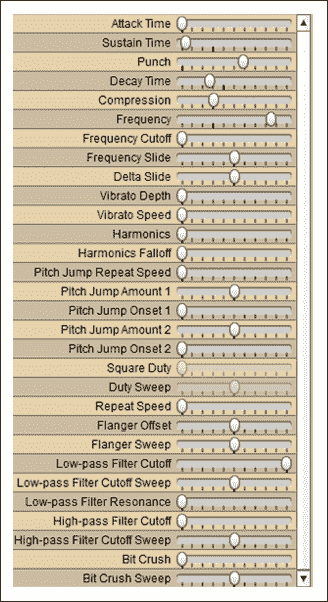

# 第二十三章。Android 声音效果和 Spinner 小部件

在本章中，我们将学习`SoundPool`类以及我们可以根据是否只想播放声音或进一步跟踪我们正在播放的声音的不同方式。然后，我们将把我们学到的一切付诸实践，制作一个很酷的声音演示应用程序，这也将向我们介绍一个新的 UI 小部件：**spinner**。

在本章中，我们将做以下事情：

+   学习如何使用 Android 的`SoundPool`类

+   使用`SpinnerView`编写基于声音的应用程序

让我们开始吧。

# SoundPool 类

`SoundPool`类允许我们持有和操作一组声音效果：字面上就是一组声音。该类处理从解压缩声音文件（如`.wav`或`.ogg`文件）到通过整数 ID 保持标识引用，以及当然，播放声音的一切。当声音播放时，它以非阻塞的方式播放（在后台使用线程），不会干扰我们应用程序的流畅运行或用户与应用程序的交互。

我们需要做的第一件事是将声音效果添加到游戏项目的`main`文件夹中名为`assets`的文件夹中。我们很快就会做到这一点。

接下来，在我们的 Kotlin 代码中，我们声明了`SoundPool`类型的对象和每个我们打算使用的声音效果的`Int`标识符，如下面的代码所示。我们还将声明另一个名为`nowPlaying`的`Int`，我们可以用它来跟踪当前正在播放的声音；我们很快就会看到我们如何做到这一点：

```kt
var sp: SoundPool
var idFX1 = -1
nowPlaying = -1
volume = .1f
```

现在，我们将看一下初始化`SoundPool`的方式。

## 初始化 SoundPool

我们将使用`AudioAttributes`对象来设置我们想要的声音池的属性。

第一个代码块使用链接，并在一个对象上调用了四个单独的函数，初始化了我们的`AudioAttributes`对象（`audioAttributes`），如下面的代码所示：

```kt
val audioAttributes = AudioAttributes.Builder()
         .setUsage(AudioAttributes.
                     USAGE_ASSISTANCE_SONIFICATION)
         .setContentType(AudioAttributes.
                     CONTENT_TYPE_SONIFICATION)
         .build()

sp = SoundPool.Builder()
         .setMaxStreams(5)
         .setAudioAttributes(audioAttributes)
         .build()
```

在上面的代码中，我们使用了此类的`Builder`函数来初始化一个`AudioAttributes`实例，让它知道它将用于`USAGE_ASSISTANCE_SONIFICATION`的用户界面交互。

我们还使用了`CONTENT_TYPE_SONIFICATION`，让该类知道它是用于响应声音，例如按钮点击，碰撞或类似的声音。

现在，我们可以通过传入`AudioAttributes`对象（`audioAttributes`）和我们可能想要播放的同时声音的最大数量来初始化`SoundPool`（`sp`）本身。

第二个代码块将另外四个函数链接到`sp`的初始化中，包括调用`setAudioAttributes`，该函数使用我们在前面链接函数块中初始化的`audioAttributes`对象。

现在，我们可以继续加载（解压缩）声音文件到我们的`SoundPool`中。

### 将声音文件加载到内存中

与我们的线程控制一样，我们需要将我们的代码包装在`try`-`catch`块中。这是有道理的，因为读取文件可能因我们无法控制的原因而失败，但我们也这样做是因为我们被迫这样做，因为我们使用的函数会抛出异常，否则我们编写的代码将无法编译。

在`try`块内，我们声明并初始化了`AssetManager`和`AssetFileDescriptor`类型的对象。

`AssetFileDescriptor`是通过使用`AssetManager`对象的`openFd`函数来初始化的，该函数解压缩声音文件。然后，我们初始化我们的 ID（`idFX1`），同时将`AssetFileDescriptor`实例的内容加载到我们的`SoundPool`中。

`catch`块只是简单地在控制台输出一条消息，让我们知道是否出了问题，如下面的代码所示：

```kt
try {
    // Create objects of the 2 required classes
    val assetManager = this.assets
    var descriptor: AssetFileDescriptor

    // Load our fx in memory ready for use
    descriptor = assetManager.openFd("fx1.ogg")
    idFX1 = sp.load(descriptor, 0)

}  catch (e: IOException) {
    // Print an error message to the console
    Log.e("error", "failed to load sound files")
}
```

现在，我们准备制造一些噪音。

### 播放声音

此时，我们的`SoundPool`中有一个音效，并且我们有一个 ID 可以用来引用它。

这是我们播放声音的方式。请注意，在下面的代码行中，我们使用相同的函数的返回值初始化`nowPlaying`变量。因此，以下代码同时播放声音并将正在播放的 ID 的值加载到`nowPlaying`中：

```kt
nowPlaying = sp.play(idFX2,
  volume, volume, 0, repeats, 1f)
```

### 提示

不需要将 ID 存储在`nowPlaying`中以播放声音，但是它有其用途，我们现在将看到。

`play`函数的参数从左到右如下：

+   声音效果的 ID

+   左右扬声器音量

+   可能正在播放/已播放的其他声音的优先级

+   声音重复的次数

+   播放速率/速度（1 为正常速率）

在我们制作声音演示应用程序之前，还有一件事情需要讨论。

### 停止声音

当仍在播放时，使用`stop`函数停止声音也非常容易，如下面的代码所示。请注意，可能会有多个音效在任何给定时间播放，因此`stop`函数需要您想要停止的音效的 ID：

```kt
sp.stop(nowPlaying)
```

当您调用`play`时，如果您想要跟踪它以便以后与它交互，您只需要存储当前播放声音的 ID。现在，我们可以制作声音演示应用程序。

# 声音演示应用程序介绍 Spinner 小部件

当然，谈到音效，我们需要一些实际的声音文件。您可以使用 BFXR 制作自己的声音文件（如下一节所述）或使用提供的声音文件。该应用程序的音效包含在下载包中，并且可以在`Chapter23/Sound Demo`文件夹的`assets`文件夹中找到。

## 制作音效

有一个名为 BFXR 的开源应用程序，允许我们制作自己的音效。以下是使用 BFXR 制作自己的音效的快速指南。从[www.bfxr.net](http://www.bfxr.net)免费获取一份副本。

### 提示

请注意，声音演示应用程序的音效包含在`Chapter23/assets`文件夹中。除非您愿意，否则您不必创建自己的音效，但是学习如何使用它仍然是值得的。

按照网站上的简单说明进行设置。尝试一些这样的事情来制作酷炫的音效：

### 提示

这是一个非常简化的教程。您可以使用 BFXR 做很多事情。要了解更多，请阅读我们之前提到的网站上的提示。

1.  运行`bfxr`。您应该会看到一个类似于下面屏幕截图所示的屏幕：

1.  尝试所有生成该类型随机声音的预设类型，如下面的屏幕截图所示。当您有一个接近您想要的声音时，继续下一步：

1.  使用滑块微调音高、持续时间和其他方面的新声音，如下面的屏幕截图所示：

1.  通过单击**导出 Wav**按钮保存您的声音，如下面的屏幕截图所示。尽管这个按钮的文本，正如我们将看到的，我们也可以保存为`.wav`以外的格式：

1.  Android 与 OGG 格式的声音非常兼容，因此在要求命名文件时，请在文件名的末尾使用`.ogg`扩展名。

1.  重复步骤 2 到 5 以创建三个酷炫的音效。将它们命名为`fx1.ogg`，`fx2.ogg`和`fx3.ogg`。我们使用`.ogg`文件格式，因为它比 WAV 等格式更压缩。

当您的声音文件准备好后，我们可以继续进行应用程序。

## 布置声音演示 UI

我将比之前的项目更简要地描述我们正在适应的项目的部分。但是，每当有新概念时，我一定会详细解释。我想现在您应该可以轻松地将一些小部件拖放到`ConstraintLayout`上并更改它们的`text`属性。

完成以下步骤，如果遇到任何问题，您可以复制或查看下载包的`Chapter23/Sound Demo`文件夹中的代码：

1.  创建一个新项目，称其为`Sound Demo`，选择**基本活动**，并在**最低 API 级别**选项上选择**API 21：Android 5.0（棒棒糖）**，但将所有其他设置保持默认，并删除**Hello world!** `TextView`。

1.  按照从上到下，然后从左到右的顺序，从**容器**类别中拖动一个**下拉列表**，从**小部件**类别中拖动一个**SeekBar** **（离散）**，并从调色板上拖动四个**按钮**到布局上，同时排列和调整它们的大小，并设置它们的`text`属性，如下图所示：

1.  点击**推断约束**按钮。

1.  使用以下表格设置它们的属性：

| Widget | 要更改的属性 | 要设置的值 |
| --- | --- | --- |
| Spinner | id | `spinner` |
| 下拉列表 | spinnerMode | `dropdown` |
| Spinner | 条目 | `@array/spinner_options` |
| SeekBar | id | `seekBar` |
| SeekBar | max | `10` |
| 按钮（**FX 1**） | id | `btnFX1` |
| 按钮（**FX 2**） | id | `btnFX2` |
| 按钮（**FX 3**） | id | `btnFX3` |
| 按钮（**STOP**） | id | `btnStop` |

1.  接下来，将以下突出显示的代码添加到`values`文件夹中的`strings.xml`文件中。我们在上一步中使用了这个名为`spinner_options`的字符串资源数组，用于`options`属性。它将代表可以从我们的下拉列表中选择的选项：

```kt
   <resources>
       <string name="app_name">Sound Demo</string>

       <string name="hello_world">Hello world!</string>
       <string name="action_settings">Settings</string>

       <string-array name="spinner_options">
         <item>0</item>
         <item>1</item>
         <item>3</item>
         <item>5</item>
         <item>10</item>
       </string-array>

    </resources>
```

现在运行应用程序，最初你不会看到任何之前没有看到的东西。但是，如果你点击下拉列表，你将看到我们称为`spinner_options`的字符串数组中的选项。我们将使用下拉列表来控制播放时音效重复的次数，如下图所示：


让我们编写 Kotlin 代码，使这个应用程序工作，包括我们如何与我们的下拉列表交互。

使用您操作系统的文件浏览器，转到项目的`app\src\main`文件夹，并添加一个名为`assets`的新文件夹。

在下载包的`Chapter23/Sound Demo/assets`文件夹中为您准备了三个音频文件。将这三个文件放入您刚创建的`assets`目录中，或者使用您自己创建的文件。重要的是它们的文件名必须是`fx1.ogg`，`fx2.ogg`和`fx3.ogg`。

## 编写声音演示

首先，我们将更改类声明，以便我们可以高效地处理所有小部件的交互。编辑声明以实现`View.OnClickListener`，如下面的代码中所突出显示的那样：

```kt
class MainActivity : AppCompatActivity(), 
  View.OnClickListener {
```

我们将很快添加所需的`onClick`函数。

现在，我们将为我们的`SoundPool`实例、音效 ID 和`nowPlaying Int`属性添加一些属性，正如我们之前讨论的，我们还将添加一个`Float`来保存设备当前音量基础上的 0（静音）到 1（最大音量）之间的音量值。我们还将添加一个名为`repeats`的`Int`属性，它意料之中地保存我们将重复给定音效的次数的值：

```kt
var sp: SoundPool   

private var idFX1 = -1
private var idFX2 = -1
private var idFX3 = -1

var nowPlaying = -1
var volume = .1f
var repeats = 2

init{

  val audioAttributes = AudioAttributes.Builder()
        .setUsage(AudioAttributes.
              USAGE_ASSISTANCE_SONIFICATION)
        .setContentType(AudioAttributes.
              CONTENT_TYPE_SONIFICATION)
        .build()

  sp = SoundPool.Builder()
        .setMaxStreams(5)
        .setAudioAttributes(audioAttributes)
        .build()
}
```

在前面的代码中，我们还添加了一个`init`块，我们在其中初始化了我们的`SoundPool`实例。

### 提示

使用您喜欢的方法添加以下`import`语句，以使前面的代码工作：

```kt
import android.media.AudioAttributes
import android.media.AudioManager
import android.media.SoundPool
import android.os.Build

import android.view.View
import android.widget.Button
```

现在，在`onCreate`函数中，我们可以像往常一样为我们的按钮设置点击监听器，如下所示：

```kt
btnFX1.setOnClickListener(this)
btnFX2.setOnClickListener(this)
btnFX3.setOnClickListener(this)
btnStop.setOnClickListener(this)
```

### 提示

确保添加以下`import`以使前面的代码工作：

```kt
import kotlinx.android.synthetic.main.content_main.*
```

接下来，我们依次加载我们的每个音效，并用与我们加载到`SoundPool`中的相关音效匹配的值初始化我们的 ID。整个过程都包裹在`try`-`catch`块中，如下面的代码所示，根据需要：

```kt
try {
    // Create objects of the 2 required classes
    val assetManager = this.assets
    var descriptor: AssetFileDescriptor

    // Load our fx in memory ready for use
    descriptor = assetManager.openFd("fx1.ogg")
    idFX1 = sp.load(descriptor, 0)

    descriptor = assetManager.openFd("fx2.ogg")
    idFX2 = sp.load(descriptor, 0)

    descriptor = assetManager.openFd("fx3.ogg")
    idFX3 = sp.load(descriptor, 0)

}   catch (e: IOException) {
    // Print an error message to the console
    Log.e("error", "failed to load sound files")
}
```

### 提示

使用您喜欢的方法添加以下`import`语句，以使前面的代码工作：

```kt
import android.content.res.AssetFileDescriptor
import android.content.res.AssetManager
import android.util.Log
import java.io.IOException
```

接下来，我们将看看如何处理`SeekBar`。正如您可能已经期待的那样，我们将使用 lambda。我们将使用`OnSeekBarChangeListener`并重写`onProgressChanged`、`onStartTrackingTouch`和`onStopTrackingTouch`函数。

我们只需要向`onProgressChanged`函数添加代码。在这个函数中，我们只需更改`volume`变量的值，然后在我们的`SoundPool`对象上使用`setVolume`函数，传入当前播放的声音效果以及左右声道的音量，如下面的代码所示：

```kt
seekBar.setOnSeekBarChangeListener(
         object : SeekBar.OnSeekBarChangeListener {

   override fun onProgressChanged(
         seekBar: SeekBar, value: Int, fromUser: Boolean) {

         volume = value / 10f
         sp.setVolume(nowPlaying, volume, volume)
  }

   override fun onStartTrackingTouch(seekBar: SeekBar) {}

   override fun onStopTrackingTouch(seekBar: SeekBar) {

  }
})
```

### 提示

使用您喜欢的方法为先前的代码添加以下`import`语句：

```kt
import android.widget.SeekBar
```

`SeekBar`之后是`Spinner`和另一个处理用户交互的 lambda。我们将使用`AdapterView.OnItemSelectedListener`来重写`onItemSelected`和`onNothingSelected`函数。

我们所有的代码都放在`onItemSelected`函数中，它创建了一个临时的名为`temp`的`String`，然后使用`Integer.ValueOf`函数将`String`转换为`Int`，我们可以用它来初始化`repeats`属性，如下面的代码所示：

```kt
 spinner.onItemSelectedListener =
         object : AdapterView.OnItemSelectedListener {

   override fun onItemSelected(
         parentView: AdapterView<*>,
         selectedItemView: View,
         position: Int, id: Long) {

         val temp = spinner.selectedItem.toString()
         repeats = Integer.valueOf(temp)
  }

   override fun onNothingSelected(
         parentView: AdapterView<*>) {
  }
}
```

### 提示

使用您喜欢的方法将以下`import`语句添加到先前的代码中：

```kt
import android.widget.AdapterView
import android.widget.Spinner
```

这就是`onCreate`函数的所有内容。

现在，实现`onClick`函数，这是必需的，因为这个类实现了`View.OnClickListener`接口。非常简单，每个按钮都有一个`when`选项。请注意，对`play`的每次调用的返回值都存储在`nowPlaying`中。当用户按下**STOP**按钮时，我们只需使用`nowPlaying`的当前值调用`stop`，导致最近启动的声音效果停止，如下面的代码所示：

```kt
 override fun onClick(v: View) {
   when (v.id) {
         R.id.btnFX1 -> {
               sp.stop(nowPlaying)
               nowPlaying = sp.play(idFX1, volume,
                           volume, 0, repeats, 1f)
    }

         R.id.btnFX2 -> {
               sp.stop(nowPlaying)
               nowPlaying = sp.play(idFX2,
                           volume, volume, 0, repeats, 1f)
    }

         R.id.btnFX3 -> {
               sp.stop(nowPlaying)
               nowPlaying = sp.play(idFX3,
                           volume, volume, 0, repeats, 1f)
    }

         R.id.btnStop -> sp.stop(nowPlaying)
   }
}
```

现在我们可以运行应用程序。如果听不到任何声音，请确保设备的音量已调高。

单击适当的按钮以播放所需的声音效果。更改音量和重复播放次数，当然，尝试使用**STOP**按钮停止它。

还要注意，当一个声音效果正在播放时，您可以重复点击多个播放按钮，声音将同时播放，直到我们设置的最大流数（五）。

# 总结

在本章中，我们仔细研究了如何使用`SoundPool`，并利用了所有这些知识来完成声音演示应用程序。

在下一章中，我们将学习如何使我们的应用程序与多个不同的布局配合工作。
