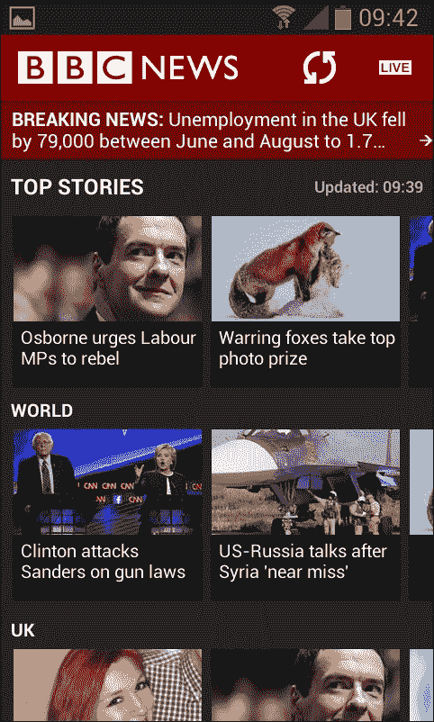
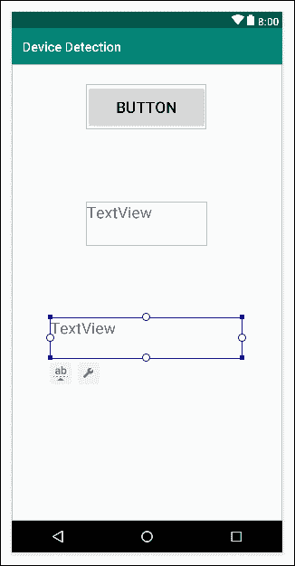
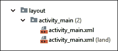
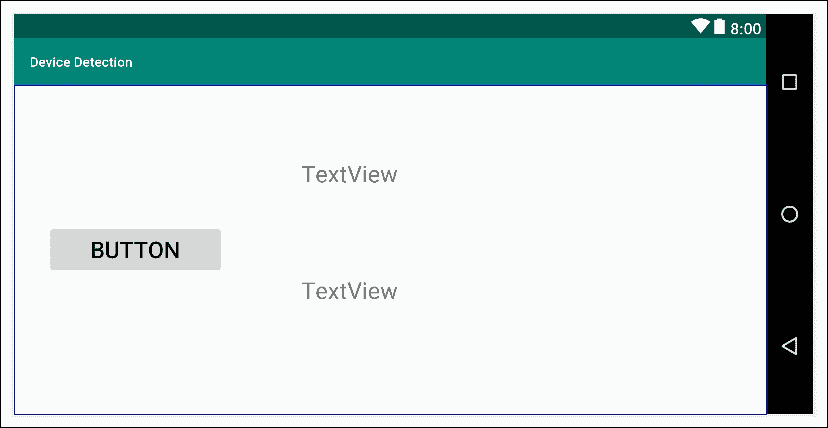
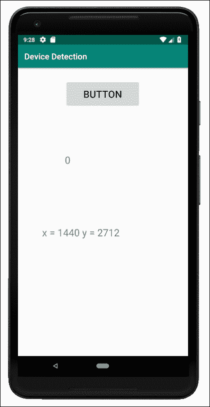
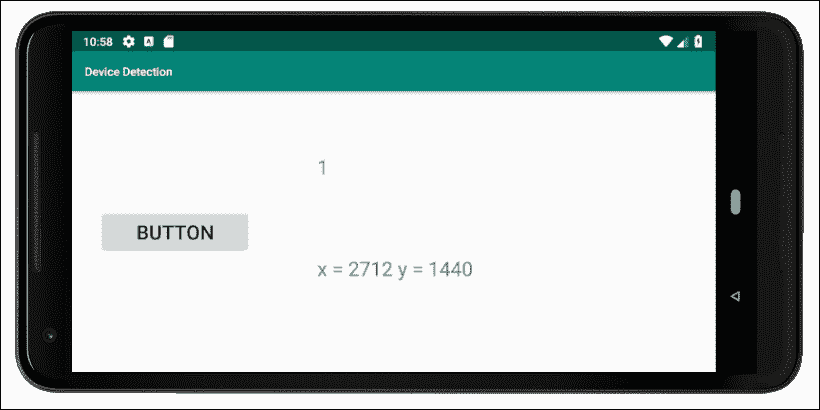
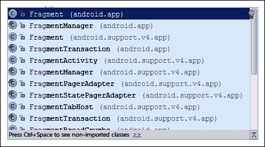

# 第二十四章：设计模式、多个布局和片段

我们已经走了很长的路，从最开始设置 Android Studio 的时候。那时，我们一步一步地进行了一切，但随着我们的进展，我们试图向你展示的不仅仅是如何将*x*添加到*y*或将特性 A 添加到应用程序 B，而是让你能够以自己的方式使用所学的知识，以便将自己的想法变为现实。

这一章更加关注你未来的应用程序，而不是这本书中迄今为止的任何其他章节。我们将看一下 Kotlin 和 Android 的一些特性，你可以将其用作框架或模板，以制作更加令人兴奋和复杂的应用程序，同时保持代码的可管理性。此外，我将建议进一步学习的领域，这些领域在本书中几乎没有涉及，因为它的范围有限。

在本章中，我们将学习以下内容：

+   模式和模型-视图-控制器

+   Android 设计指南

+   开始真实世界设计和处理多个不同设备

+   片段简介

让我们开始吧。

# 介绍模型-视图-控制器模式

**短语模型、视图**和**控制器**反映了我们应用程序的不同部分分为不同的部分，称为**层**。Android 应用程序通常使用模型-视图-控制器**模式**。模式只是一种公认的结构代码和其他应用程序资源的方式，例如布局文件、图像和数据库。

模式对我们很有用，因为通过遵循模式，我们可以更有信心地做正确的事情，并且不太可能因为将自己编码到尴尬的境地而不得不撤销大量的辛苦工作。

计算机科学中有许多模式，但只要理解 MVC 模式就足以创建一些专业构建的 Android 应用程序。

我们已经部分使用了 MVC，所以让我们依次看看这三个层。

## 模型

模型指的是驱动我们应用程序的数据以及专门管理它并使其可用于其他层的逻辑/代码。例如，在我们的自我备忘录应用程序中，`Note`类及其 JSON 代码就是数据和逻辑。

## 视图

自我备忘录应用程序的视图是所有不同布局中的所有小部件。用户在屏幕上可以看到或与之交互的任何内容通常都是视图的一部分。你可能还记得小部件来自 Android API 的`View`类层次结构。

## 控制器

控制器是视图和模型之间的部分。它与两者交互并使它们分开。它包含所谓的**应用逻辑**。如果用户点击按钮，应用程序层决定如何处理它。当用户点击**确定**以添加新的备忘录时，应用程序层会监听视图层上的交互。它捕获视图中包含的数据，并将其传递给模型层。

### 提示

设计模式是一个庞大的主题。有许多不同的设计模式，如果你想对这个主题有一个友好的入门，我会推荐*Head First Design Patterns*。即使这本书的例子是用另一种语言 Java 描述的，它对你仍然非常有用。如果你想真正深入设计模式的世界，那么你可以尝试*Design Patterns: Elements of Reusable Object-Oriented Software*，它被认为是一种设计模式的权威，但阅读起来要困难得多。

随着本书的进展，我们还将开始利用我们已经讨论过但迄今为止尚未充分利用的面向对象编程特性。我们将逐步做到这一点。

# Android 设计指南

应用程序设计是一个广阔的主题——如此广阔，以至于只能在专门致力于该主题的书中开始教授。而且，就像编程一样，只有通过不断的练习、复习和改进，才能开始擅长应用程序设计。

那么，我所说的设计到底是什么？我说的是屏幕上放置小部件的位置，使用哪些小部件，它们应该是什么颜色，多大，如何在屏幕之间过渡，滚动页面的最佳方式，何时以及使用哪些动画插值器，你的应用应该分成哪些屏幕，以及更多其他方面。

这本书希望能让你有能力*实现*你选择的答案，以及更多其他问题的答案。不幸的是，它没有足够的空间，作者可能也没有技能来教你如何*做出*这些选择。

### 提示

你可能会想，“我该怎么办？”继续制作应用，不要让缺乏设计经验和知识阻止你！甚至将你的应用发布到应用商店。然而，请记住，还有一个完全不同的话题——设计——如果你的应用真的要成为世界级的话，这需要一些关注。

即使在中等规模的开发公司中，设计师很少也是程序员，即使是非常小的公司也经常外包他们的应用设计（或设计师可能外包编码）。

设计既是一门艺术，也是一门科学，Google 已经证明它认识到这一点，为现有和有抱负的设计师提供了高质量的支持。

### 提示

我强烈建议你访问并收藏网页[`developer.android.com/design/`](https://developer.android.com/design/)。它非常详细和全面，完全专注于 Android，并提供了大量的数字资源，如图像、调色板和指南。

将理解设计原则作为短期目标。将提高你的实际设计技能作为一个持续的任务。访问并阅读以设计为重点的网站，并尝试实现你发现令人兴奋的想法。

然而，最重要的是，不要等到你成为设计专家才开始制作应用。继续将你的想法付诸实践并发布它们。要求每个应用的设计都比上一个稍微好一点。

我们将在接下来的章节中看到，而且已经在一定程度上看到，Android API 为我们提供了一整套超时尚的 UI，我们可以用非常少的代码或设计技能来利用这些 UI。这些 UI 在很大程度上使你的应用看起来像是由专业人员设计的。

# 真实世界的应用

到目前为止，我们已经构建了十几个或更多不同复杂度的应用。大多数是在手机上设计和测试的。

当然，在现实世界中，我们的应用需要在任何设备上都能良好运行，并且必须能够处理在横向或纵向视图（在所有设备上）时发生的情况。

此外，我们的应用通常不能只是在不同设备上正常工作并看起来“还行”。通常情况下，我们的应用需要根据设备是手机、平板还是横向/纵向方向，以不同的方式运行并呈现出显著不同的 UI。

### 注意

Android 支持大屏电视、智能手表、虚拟和增强现实以及物联网的应用。本书不涉及后两个方面，但作者希望在书的结尾，你将有足够的准备去涉足这些话题。

看一下 BBC 新闻应用在 Android 手机上纵向运行的屏幕截图。看基本布局，但也注意新闻的类别（**头条新闻**，**世界**，**英国**）都是可见的，并允许用户滚动查看更多类别或在每个类别的故事之间左右滑动：



我们将在下一章中看到如何使用`ImagePager`和`FragmentPager`类实现滑动/分页 UI，但在此之前，我们需要了解更多的基础知识，我们将在本章中探讨。目前，上一个截图的目的不是向您展示特定的 UI 功能，而是让您将其与以下截图进行比较。看看在平板电脑上横向方向上运行的完全相同的应用程序：


请注意，故事（数据层）是相同的，但布局（视图层）却非常不同。用户不仅可以从应用程序顶部的选项卡菜单中选择类别，还可以通过“添加主题”选项添加自己的选项卡。

再次，这张图片的重点不是向您展示特定的 UI，甚至不是我们如何实现类似的 UI，而是它们是如此不同，以至于它们很容易被误认为是完全不同的应用程序。

Android 允许我们设计真实世界的应用程序，不仅布局因设备类型/方向/大小而异，行为也是如此，即应用程序层。Android 实现这一点的秘密武器是`Fragment`类。

### 注意

**Google 说：**

“片段代表活动中的行为或用户界面的一部分。您可以在单个活动中组合多个片段，构建多窗格 UI，并在多个活动中重用片段。”

您可以将片段视为活动的模块化部分，它具有自己的生命周期，接收自己的输入事件，并且您可以在活动运行时添加或删除它（有点像可以在不同活动中重用的“子活动”）。

“片段必须始终嵌入在活动中，并且片段的生命周期直接受到宿主活动生命周期的影响。”

我们可以在不同的 XML 文件中设计多个不同的布局，并很快就会这样做。我们还可以在代码中检测设备方向和屏幕分辨率，以便我们可以动态地对布局做出决策。

让我们尝试使用设备检测，然后我们将首次查看片段。

# 设备检测迷你应用

了解检测和响应设备及其不同属性（屏幕、方向等）的最佳方法是制作一个简单的应用程序。让我们通过以下步骤来做到这一点：

1.  创建一个新的**空活动**项目，并将其命名为`设备检测`。将所有其他设置保留为默认设置。

1.  在**设计**选项卡中打开`activity_main.xml`文件，并删除默认的**Hello world!** `TextView`。

1.  将一个**按钮**拖放到屏幕顶部，并将其**onClick**属性设置为`detectDevice`。我们将在一分钟内编写此功能。

1.  将两个**TextView**小部件拖放到布局中，一个放在另一个下面，并将它们的**id**属性分别设置为`txtOrientation`和`txtResolution`。

1.  检查您是否有一个类似以下截图的布局：

### 提示

我已经拉伸了我的小部件（主要是水平方向），并将`textSize`属性增加到`24sp`，以使它们在屏幕上更清晰，但这并不是应用程序正常工作所必需的。



1.  单击**推断约束**按钮以确保 UI 元素的位置。

现在，我们将做一些新的事情：我们将专门为横向方向构建一个布局。

在 Android Studio 中，确保在编辑器中选择了`activity_main.xml`文件，并找到**预览方向**按钮，如下截图所示：


单击它，然后选择**创建横向变化**。

现在，你有一个新的布局 XML 文件，名称相同，但是是横向布局。在编辑器中，布局看起来是空白的，但正如我们将看到的那样，情况并非如此。查看项目资源管理器中的`layout`文件夹，注意确实有两个名为`activity_main`的文件，其中一个（我们刚刚创建的新文件）以**（land）**结尾。如下截图所示：



选择这个新文件（以**（land）**结尾的文件），现在看组件树。如下截图所示：


看起来布局已经包含了所有我们的小部件，只是在设计视图中看不到它们。这种异常的原因是，当我们创建横向布局时，Android Studio 复制了纵向布局，包括所有约束。纵向约束很少与横向约束匹配。

要解决这个问题，点击**删除所有约束**按钮；它是**推断约束**按钮左边的按钮。现在 UI 没有约束了。我的界面是这样的：


布局有点混乱，但至少我们现在可以看到它。重新排列它使其看起来整洁。这是我重新排列的方式：



点击**推断约束**按钮以锁定布局在新位置。

现在我们已经为两种不同方向的基本布局，我们可以把注意力转向我们的 Kotlin 代码。

## 编写 MainActivity 类

我们已经有一个调用名为`detectDevice`的函数的机制，我们只需要编写这个演示应用的函数。在`MainActivity`类的`onCreate`函数之后，添加处理按钮点击并运行检测代码的函数，如下所示：

```kt
fun detectDevice(v: View) {
   // What is the orientation?
   val display = windowManager.defaultDisplay
   txtOrientation.text = "${display.rotation}"

   // What is the resolution?
   val xy = Point()
   display.getSize(xy)
   txtResolution.text = "x = ${xy.x} y = ${xy.y}"
}
```

### 提示

导入以下三个类：

```kt
import android.graphics.Point
import android.view.Display
import android.view.View
```

这段代码通过声明和初始化一个名为`display`的`Display`类型的对象来工作。这个对象（`display`）现在包含了关于设备特定显示属性的大量数据。

存储在`rotation`属性中的值将输出到顶部的`TextView`小部件中。

然后，代码初始化了一个名为`xy`的`Point`类型的对象。`getSize`函数将屏幕分辨率加载到`xy`中。然后将结果用于将水平（`xy.x`）和垂直（`xy.y`）分辨率输出到`TextView`中。

每次点击按钮，两个`TextView`小部件都将被更新。

### 解锁屏幕方向

在运行应用之前，我们要确保设备没有被锁定在纵向模式（大多数新手机默认是这样）。从模拟器的应用抽屉（或者你将要使用的设备）中，点击**设置**应用，选择**显示**，然后使用开关将**自动旋转屏幕**设置为开启。我在下图中展示了这个设置：


## 运行应用

现在，你可以运行应用并点击按钮，如下图所示：



使用模拟器控制面板上的旋转按钮之一将设备旋转到横向，如下截图所示：


### 提示

你也可以在 PC 上使用*CTRL* + *F11*，或者在 macOS 设备上使用*CTRL* + *FN* + *F11*。

现在，再次点击按钮，你将看到横向布局的效果，如下图所示：



你可能会注意到的第一件事是，当你旋转屏幕时，屏幕会短暂变空白。这是活动重新启动并再次执行`onCreate`。这正是我们需要的。它在横向布局上调用`setContentView`，`MainActivity`中的代码引用具有相同 ID 的小部件，因此完全相同的代码可以工作。

### 注意

暂时考虑一下，如果我们需要在两个方向之间需要不同的行为和布局，我们该如何处理。不要花太长时间思考这个问题，因为我们将在本章后面讨论这个问题。

如果`0`和`1`的结果对您来说不太明显，它们指的是`Surface`类的`public const`变量，其中`Surface.ROTATION_0`等于零，`Surface.ROTATION_180`等于一。

### 注意

请注意，如果您将屏幕向左旋转，那么您的值将是`1`，与我的相同，但如果您将其向右旋转，您将看到值为`3`。如果您将设备旋转到纵向模式（倒置），您将得到值`4`。

我们可以使用`when`块并根据这些检测测试的结果执行不同的代码并加载不同的布局。但正如我们刚才看到的，Android 使事情变得比这更简单，它允许我们将特定布局添加到具有配置限定符的文件夹中，比如**land**。

# 配置限定符

我们已经在第三章中看到了配置限定符，比如`layout-large`或`layout-xhdpi`，*探索 Android Studio 和项目结构*。在这里，我们将刷新并扩展对它们的理解。

我们可以通过使用配置限定符来减轻我们对控制器层的依赖，以影响应用程序布局。有关大小、方向和像素密度的配置限定符。要利用配置限定符，我们只需按照通常的方式设计一个针对我们首选配置进行优化的布局，然后将该布局放入 Android 识别为特定配置的文件夹中。

例如，在先前的应用程序中，将布局放在`land`文件夹中告诉 Android 在设备处于横向方向时使用该布局。

前面的陈述可能显得有些模糊。这是因为 Android Studio 项目资源管理器窗口显示了一个文件和文件夹结构，它并不完全对应现实——它试图简化事情并“帮助”我们。如果您从项目资源管理器窗口顶部的下拉列表中选择**项目文件**选项，然后检查项目的内容，您确实会看到有一个布局和`layout-land`文件夹，如下面的屏幕截图所示：


切换回**Android**布局或保持在**项目文件**视图上，以您喜欢的方式。

如果我们想要横向和纵向有不同的布局，我们可以在`res`文件夹中创建一个名为`layout-land`的文件夹（或者使用我们在先前应用程序中使用的快捷方式），并在其中放置我们专门设计的布局。

当设备处于纵向方向时，将使用`layout`文件夹中的常规布局，当设备处于横向方向时，将使用`layout-land`文件夹中的布局。

如果我们要为不同尺寸的屏幕设计，我们将布局放入以下名称的文件夹中：

+   `layout-small`

+   `layout-normal`

+   `layout-large`

+   `layout-xlarge`

如果我们要为不同像素密度的屏幕设计，我们可以将 XML 布局放入名称为这些的文件夹中：

+   `layout-ldpi` 用于低 DPI 设备

+   `layout-mdpi` 用于中等 DPI 设备

+   `layout-hdpi` 用于高 DPI 设备

+   `layout-xhdpi` 用于超高 DPI 设备

+   `layout-xxhdpi` 用于超超高 DPI 设备

+   `layout-xxxhdpi` 用于超超超高 DPI 设备

+   `layout-nodpi` 用于其他情况下未考虑的 DPI 设备

+   `layout-tvdpi` 用于电视

低、高或超高 DPI 等的具体资格可以在以下信息框中的链接中找到。这里要说明的是布局存储的位置。

值得一提的是，我们刚刚讨论的远远不是关于配置限定符的整个故事，就像设计一样，值得将其列入进一步学习的清单。

### 注意

正如经常发生的那样，Android 开发者网站上有大量关于处理不同设备布局的详细信息。请访问[`developer.android.com/guide/practices/screens_support`](https://developer.android.com/guide/practices/screens_support)获取更多信息。

## 配置限定符的限制

以前的应用程序和我们对配置限定符的讨论向我们展示了在许多情况下肯定非常有用。然而，不幸的是，配置限定符和在代码中检测属性只解决了我们 MVC 模式的视图层中的问题。

正如我们讨论过的，我们的应用程序有时需要具有不同的*行为*，以及布局。这可能意味着我们的 Kotlin 代码在控制器层（在我们以前的应用程序中是`MainActivity`）中可能有多个分支，并且可能召唤出对每种不同情况具体代码的巨大的`if`或`when`块的可怕愿景。

幸运的是，这并不是这样做的方式。对于这种情况——事实上，对于大多数应用程序——Android 都有**片段**。

# 片段

片段很可能会成为您制作的几乎每个应用程序的基本组成部分。它们非常有用，有很多使用它们的理由，而且一旦您习惯了它们，它们就变得非常简单，几乎没有理由不使用它们。

片段是应用程序的可重用元素，就像任何类一样，但正如我们之前提到的，它们具有特殊功能，例如能够加载自己的视图/布局，以及它们自己的生命周期函数，这使它们非常适合实现我们在真实世界应用程序部分讨论的目标。

让我们深入了解片段，一次一个特性。

## 片段也有生命周期

我们可以通过覆盖适当的生命周期函数来设置和控制片段，就像我们对活动所做的那样。

### onCreate 函数

在`onCreate`函数中，我们可以初始化变量并几乎做所有我们通常在`Activity onCreate`函数中做的事情。这个例外是初始化我们的 UI。

### onCreateView 函数

在`onCreateView`函数中，我们将像其名称所示的那样，获取对我们任何 UI 小部件的引用，设置 lambda 以监听点击，以及更多，正如我们很快将看到的那样。

### onAttach 和 onDetach 函数

`onAttach`和`onDetach`函数在`Fragment`实例被投入使用/停止使用之前调用。

### onStart，onPause 和 onStop 函数

在`onStart`，`onPause`和`onStop`函数中，我们可以执行某些操作，例如创建或删除对象或保存数据，就像我们在它们基于活动的对应函数中所做的那样。

还有其他片段生命周期函数，但我们已经了解足够开始使用片段了。如果您想学习片段生命周期的详细信息，可以在 Android 开发者网站上进行学习[`developer.android.com/guide/components/fragments`](https://developer.android.com/guide/components/fragments)。

这都很好，但我们需要一种方法来首先创建我们的片段，并配置它们以响应这些函数。

## 使用 FragmentManager 管理片段

`FragmentManager`类是`Activity`类的一部分。我们使用它来初始化`Fragment`实例，将`Fragment`实例添加到布局中，并结束`Fragment`。我们在以前的“Note to self”应用程序中初始化`FragmentDialog`实例时曾简要看到`FragmentManager`。

学习 Android 很难不碰到`Fragment`类，就像学习 Kotlin 很难不断碰到 OOP、类等一样。

以下代码片段中的突出显示的代码是提醒我们如何使用传递给弹出对话框的参数 `FragmentManager`（它已经是 `Activity` 类的一部分）：

```kt
button.setOnClickListener {
   val myDialog = MyDialog()
   myDialog.show(supportFragmentManager, "123")
   // This calls onCreateDialog
   // Don't worry about the strange looking 123
   // We will find out about this in Chapter 18
}
```

当时，我要求您不要关心函数调用的参数。调用的第二个参数是 `Fragment` 的 ID。我们很快将看到如何更广泛地使用 `FragmentManager` 和 `Fragment` ID。

`FragmentManager` 正是其名称所暗示的。这里重要的是，一个 `Activity` 只有一个 `FragmentManager`，但它可以管理多个 `Fragment` 实例。这正是我们需要的，以便在单个应用程序中具有多个行为和布局。

`FragmentManager` 还调用它负责的各个片段的各种生命周期函数。这与 `Activity` 的生命周期函数是不同的，后者是由 Android 调用的，但它也与 `FragmentManager` 密切相关，因为 `FragmentManager` 调用许多 `Fragment` 生命周期函数是作为对 `Activity` 生命周期函数的响应。通常情况下，我们不需要太担心它是何时以及如何做到这一点，只要我们在每种情况下做出适当的响应即可。

# 我们的第一个片段应用

让我们构建一个尽可能简单的片段，以便我们可以理解发生了什么，然后我们开始在各个地方生成真正有用的 `Fragment` 对象。

### 提示

我敦促所有读者去完成并构建这个项目。从一个文件跳到另一个文件，仅仅阅读说明就会使它看起来比实际复杂得多。当然，您可以从下载包中复制并粘贴代码，但也请按照步骤进行，并创建自己的项目和类。片段并不太难，但它们的实现，就像它们的名称所暗示的那样，有点分散。

使用 **Empty Activity** 模板创建一个名为 `Simple Fragment` 的新项目，并将其余设置保持默认。

请注意，有选项可以创建一个带有片段的项目，但是通过自己从头开始做事情，我们会学到更多。

切换到 `activity_main.xml` 并删除默认的 **Hello world!** `TextView`。

现在，通过在 **Component tree** 窗口中左键单击选择根 `ConstraintLayout`，然后将其 **id** 属性更改为 `fragmentHolder`。现在我们将能够在我们的 Kotlin 代码中引用此布局，并且正如 **id** 属性所暗示的那样，我们将向其中添加一个片段。

现在，我们将创建一个布局，该布局将定义我们片段的外观。右键单击 `layout` 文件夹，然后选择 **New | Layout resource file**。在 **File name:** 字段中，键入 `fragment_layout`，然后左键单击 **OK**。我们刚刚创建了一个 `LinearLayout` 类型的新布局。

在布局的任何位置添加一个单独的 **Button** 小部件，并将其 **id** 属性设置为 `button`。

现在我们有了一个供我们的片段使用的简单布局，让我们编写一些 Kotlin 代码来创建实际的片段。

请注意，您可以通过从调色板中简单地拖放一个 `Fragment` 实例来创建一个 `Fragment` 实例，但以这种方式做事情的灵活性和可控性要少得多，而灵活性和可控性是使用片段的重要好处，正如我们将在本章和接下来的三章中看到的那样。通过创建一个扩展 `Fragment` 的类，我们可以从中制作出许多片段。

在项目资源管理器中，右键单击包含 `MainActivity` 文件的文件夹。从上下文菜单中，创建一个名为 `SimpleFragment` 的新 Kotlin 类。

在我们的新 `SimpleFragment` 类中，将代码更改为继承自 `Fragment`。在输入代码时，将要求您选择要导入的特定 `Fragment` 类，如下面的屏幕截图所示：



选择顶部选项（如前面的屏幕截图所示），即常规的 `Fragment` 类。

### 注意

我们将在这个类中需要以下所有的导入语句：

```kt
import android.app.Fragment
import android.os.Bundle
import android.view.LayoutInflater
import android.view.View
import android.view.ViewGroup
import android.widget.Button
import android.widget.Toast
```

此时代码如下所示：

```kt
class SimpleFragment: Fragment() {
}
```

现在，添加一个名为`myString`的`String`属性并初始化它，如下面的代码所示：

```kt
class SimpleFragment: Fragment() {
    val myString: String = "Hello from SimpleFragment"
}
```

在使用`Fragment`时，我们需要在`onCreateView`函数中处理布局。现在让我们重写它，学习如何设置视图并获取对我们的`Button`的引用。

将以下代码添加到`SimpleFragment`类中：

```kt
override fun onCreateView(
          inflater: LayoutInflater,
          container: ViewGroup?,
          savedInstanceState: Bundle?)
          : View? {

  val view = inflater.inflate(
              R.layout.fragment_layout,
              container,
              false)  

  return view
}
```

为了理解上一段代码，我们首先必须查看`onCreateView`的签名。请注意，在第一个实例中，签名说明它必须返回一个`View`类型的对象，如下面的代码所示：

```kt
…:View?
```

接下来，我们有三个参数。让我们先看前两个：

```kt
(inflater: LayoutInflater, container: ViewGroup?...
```

我们需要一个`LayoutInflater`，因为我们不能调用`setContentView`，因为`Fragment`没有提供这样的函数。在`onCreateView`的主体中，我们使用`inflater`的`inflate`函数来膨胀我们在`fragment_layout.xml`中包含的布局，并用结果初始化`view`（`View`类型的对象）。

我们在`inflate`函数中也使用了传入`onCreateView`的`container`作为参数。`container`变量是对`activity_main.xml`中的布局的引用。

`activity_main.xml`是包含布局可能看起来很明显，但是正如我们将在本章后面看到的那样，`ViewGroup container`参数允许*任何*`Activity`与*任何*布局成为我们的 fragment 的容器。这是非常灵活的，并且在很大程度上使我们的`Fragment`代码可重用。

我们传递给`inflate`的第三个参数是`false`，这意味着我们不希望我们的布局立即添加到包含的布局中。我们很快将从代码的另一个部分自己完成这个步骤。

`onCreateView`的第三个参数是`Bundle savedInstanceState`，它可以帮助我们维护我们的 fragment 持有的数据。

现在我们有了包含在`view`中的膨胀布局，我们可以使用它来从布局中获取对我们的`Button`小部件的引用并监听点击。

最后，我们将`view`用作调用代码的返回值，如下所示：

```kt
return view
```

现在，我们可以按照通常的方式为按钮添加 lambda 来监听点击。在`onClick`函数中，我们显示一个弹出的`Toast`消息，以演示一切都按预期工作。

将此代码添加到`onCreateView`中的`return`语句之前，如下面的代码所示：

```kt
val button = view.findViewById(R.id.button) as Button

button.setOnClickListener(
  {
         Toast.makeText(activity,
               myString, Toast.LENGTH_SHORT).show()
  }
)
```

### 提示

请注意，在`makeText`中使用的`activity`属性是对包含`Fragment`的`Activity`的引用。这是为了显示`Toast`消息而需要的。

我们现在还不能运行我们的应用程序；它不会工作，因为还需要一步。我们需要创建一个`SimpleFragment`的实例并适当地初始化它。这就是`FragmentManager`将被介绍的地方。

以下代码使用`Activity`的`supportFragmentManager`属性。它基于我们的`SimpleFragment`类创建一个新的`Fragment`，使用`findFragmentByID`函数，并传入将容纳它的布局（在`Activity`内部）的 ID。

将此代码添加到`MainActivity.kt`的`onCreate`函数中，在调用`setContentView`之后：

```kt
// Create a new fragment using the manager
var frag = supportFragmentManager
         .findFragmentById(R.id.fragmentHolder)

// Check the fragment has not already been initialized
if (frag == null) {
   // Initialize the fragment based on our SimpleFragment
   frag = SimpleFragment()
         supportFragmentManager.beginTransaction()
               .add(R.id.fragmentHolder, frag)
               .commit()
}
```

现在运行应用程序，惊叹于我们可点击的按钮，它显示了一个使用`Toast`类的消息，并且创建它需要两个布局和两个完整的类：


如果你还记得在第二章中以这种方式做过，*Kotlin, XML 和 UI 设计师*，并且代码要少得多，那么很明显我们需要一个 fragment 现实检查来回答“为什么？”的问题！

# Fragment 现实检查

那么，这个 fragment 到底对我们有什么作用呢？如果我们根本不去理会 fragment，我们的第一个 fragment 迷你应用程序的外观和功能将是一样的。

实际上，使用片段使整个事情变得更加复杂！为什么我们要这样做呢？

我们有点知道这个问题的答案；只是根据我们目前所见，它并不是特别清楚。我们知道一个片段或多个片段可以添加到活动的布局中。

我们知道一个片段不仅包含自己的布局（视图），还包含自己的代码（控制器），虽然由一个活动托管，但实际上是相对独立的。

我们的快速应用程序只显示了一个片段的操作，但我们可以有一个托管两个或更多片段的活动。然后我们在单个屏幕上有效地显示了两个几乎独立的控制器。这听起来可能很有用。

然而，最有用的是，当活动启动时，我们可以检测我们的应用程序运行的设备的属性，也许是手机或平板电脑，是纵向还是横向模式。然后我们可以使用这些信息来决定同时显示一个或两个片段。

这不仅帮助我们实现了我们在本章开头讨论的真实应用部分中讨论的功能，而且还允许我们在两种可能的情况下使用完全相同的片段代码！

这确实是片段的本质。我们通过将功能（控制器）和外观（视图）配对成一堆片段来创建一个完整的应用程序，我们可以以几乎不用担心的方式以不同的方式重复使用它们。

缺失的环节是，如果所有这些片段都是完全功能的独立控制器，那么我们需要更多地了解如何实现我们的模型层。

当然，可以预见到一些障碍，所以看一下以下经常问的问题。

# 经常问的问题

Q）如果我们只有一个`ArrayList`，就像我们在“Note to self”应用程序中一样，它将去哪里？我们如何在片段之间共享它（假设所有片段都需要访问相同的数据）？

A）我们可以使用一种更加优雅的解决方案来创建一个模型层（数据本身和维护数据的代码）。当我们探索`NavigationDrawer`时，我们将看到这一点第二十六章，“使用导航抽屉和片段的高级 UI”，以及 Android 数据库第二十七章，“Android 数据库”。

# 总结

现在我们对片段的用途有了广泛的了解，以及如何开始使用它们，我们可以开始深入了解它们的使用。在下一章中，我们将制作一些以不同方式使用多个片段的应用程序。
