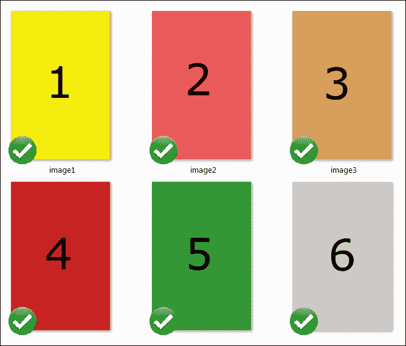

# 第二十五章：使用分页和滑动的高级 UI

**分页**是从一页到另一页的行为，在 Android 上，我们通过在屏幕上滑动手指来实现这一点。当前页面会根据手指的移动方向和速度进行过渡。这是一个有用和实用的应用程序导航方式，但也许更重要的是，它是一种极其令用户满意的视觉效果。此外，就像`RecyclerView`一样，我们可以选择性地仅加载当前页面所需的数据，也许还有前后页面的数据。

正如您所期望的那样，Android API 有一些简单的解决方案来实现分页。

在本章中，我们将学习以下内容：

+   实现像照片库应用程序中可能找到的图像一样的分页和滑动

+   使用基于`Fragment`的布局实现分页和滑动，为用户提供通过滑动浏览整个用户界面的可能性

首先，让我们看一个滑动的例子。

# 愤怒的小鸟经典滑动菜单

在这里，我们可以看到著名的愤怒的小鸟关卡选择菜单展示了滑动/分页的功能：


让我们构建两个分页应用程序：一个带有图像，一个带有`Fragment`实例。

# 构建图库/滑块应用程序

在 Android Studio 中创建一个名为`Image Pager`的新项目。使用**空活动**模板，并将其余设置保持默认。

这些图像位于下载包中的`Chapter25/Image Pager/drawable`文件夹中。以下图表显示它们在 Windows 资源管理器中的位置：



将图像添加到项目资源管理器中的`drawable`文件夹中，当然，您也可以添加更有趣的图像，也许是您拍摄的一些照片。

## 实现布局

对于一个简单的图像分页应用程序，我们使用`PagerAdapter`类。我们可以将其视为像`RecyclerApater`一样用于图像，因为它将处理在`ViewPager`小部件中显示图像数组。这与`RecyclerAdapter`非常相似，后者处理在`RecyclerView`中显示`ArrayList`的内容。我们只需要重写适当的函数。

要使用`PagerAdapter`实现图像库，我们首先需要在主布局中添加一个`ViewPager`小部件。因此，您可以清楚地看到所需的内容；以下是`activity_main.xml`的实际 XML 代码。编辑`layout_main.xml`使其看起来完全像这样：

```kt
<RelativeLayout xmlns:android=
   "http://schemas.android.com/apk/res/android"
    android:layout_width="fill_parent"
    android:layout_height="fill_parent" >

    <androidx.viewpager.widget.ViewPager
        android:id="@+id/pager"
        android:layout_width="wrap_content"
        android:layout_height="wrap_content" />

</RelativeLayout>
```

略微不寻常命名的类`androidx.ViewPager.widget.ViewPager`是在发布`ViewPager`之前的 Android 版本中提供此功能的类。

接下来，就像我们需要一个布局来表示列表项一样，我们需要一个布局来表示`ViewPager`小部件中的项目，这种情况下是一个图像。以通常的方式创建一个新的布局文件，并将其命名为`pager_item.xml`。它将包含一个带有`id`属性为`imageView`的`ImageView`。

使用可视化设计工具来实现这一点，或者将以下 XML 复制到`pager_item.xml`中：

```kt
<RelativeLayout xmlns:android=
   "http://schemas.android.com/apk/res/android"
    android:layout_width="fill_parent"
    android:layout_height="fill_parent" >

    <androidx.viewpager.widget.ViewPager
        android:id="@+id/pager"
        android:layout_width="wrap_content"
        android:layout_height="wrap_content" />

</RelativeLayout>
```

现在，我们可以开始编写我们的`PagerAdapter`类。

## 编写 PagerAdapter 类

接下来，我们需要继承自`PagerAdapter`来处理图像。创建一个名为`ImagePagerAdapter`的新类，并使其继承自`PagerAdapter`。此时代码应该如下所示：

```kt
class ImagePagerAdapter: PagerAdapter() {
}
```

将以下导入添加到`ImagePagerAdapter`类的顶部。通常我们依靠使用快捷键*Alt* + *Enter*来添加导入。这次我们做法略有不同，因为 Android API 中有一些非常相似的类，它们不适合我们的目标。

将以下导入添加到`ImagePagerAdapter`类中：

```kt
import android.content.Context
import android.view.LayoutInflater
import android.view.Vie
import android.view.ViewGroup
import android.widget.ImageView
import android.widget.RelativeLayout

import androidx.viewpager.widget.PagerAdapter
import androidx.viewpager.widget.ViewPager
```

接下来，在类中添加一个构造函数，以便在创建实例时从`MainActivity`获取`Context`对象和一个`Int`数组（指向图像资源 ID）：

```kt
class ImagePagerAdapter(
        var context: Context,
 private var images: IntArray)
        : PagerAdapter() {

}
```

现在，我们必须重写`PagerAdapter`的必需函数。在`ImagePagerAdapter`类的主体内，添加重写的`getCount`函数，它简单地返回数组中图像 ID 的数量。该函数是该类内部使用的：

```kt
override fun getCount(): Int {
   return images.size
}
```

现在，我们必须重写`isViewFromObject`函数，它根据当前`View`是否与作为参数传入的当前`Object`相同或关联来返回`Boolean`。再次强调，这是该类内部使用的函数。在上一个代码之后，添加以下重写函数：

```kt
override fun isViewFromObject(
         view: View, `object`: Any)
       : Boolean {
   return view === `object`
}
```

现在，我们必须重写`instantiateItem`函数，这是我们大部分关注的工作所在。首先，我们声明一个新的`ImageView`对象，然后初始化一个`LayoutInflater`。接下来，我们使用`LayoutInflater`从我们的`pager_item.xml`布局文件中声明和初始化一个新的`View`。

在此之后，我们获取`pager_item.xml`布局内的`ImageView`的引用。现在，根据`instantiateItem`函数的`position`参数和`images`数组的适当 ID，我们可以将适当的图像添加为`ImageView`小部件的内容。

最后，我们使用`addView`将布局添加到`PagerAdapter`中，并从函数返回。

现在，添加我们刚刚讨论的代码：

```kt
override fun instantiateItem(
         container: ViewGroup,
         position: Int)
         : View {

  val image: ImageView
  val inflater: LayoutInflater =
        context.getSystemService(
        Context.LAYOUT_INFLATER_SERVICE)
        as LayoutInflater

  val itemView =
        inflater.inflate(
              R.layout.pager_item, container,
              false)

     // get reference to imageView in pager_item layout
     image = itemView.findViewById<View>(
           R.id.imageView) as ImageView

  // Set an image to the ImageView
  image.setImageResource(images[position])

  // Add pager_item layout as 
  // the current page to the ViewPager
  (container as ViewPager).addView(itemView)

  return itemView
}
```

我们必须重写的最后一个函数是`destroyItem`，当类需要根据`position`参数的值移除适当的项时，可以调用该函数。

在上一个代码之后，在`ImagePagerAdapter`类的闭合大括号之前添加`destroyItem`函数：

```kt
override fun destroyItem(
  container: ViewGroup, 
  position: Int, 
  `object`: Any) {

  // Remove pager_item layout from ViewPager
  (container as ViewPager).
        removeView(`object` as RelativeLayout)
}
```

正如我们在编写`ImagePagerAdapter`时所看到的，这里几乎没有什么。只是正确实现`ImagePagerAdapter`类用于在幕后顺利运行的重写函数。

现在，我们可以编写`MainActivity`类，它将使用`ImagePagerAdapter`。

## 编写 MainActivity 类

最后，我们可以编写我们的`MainActivity`类。与`ImagePagerAdapter`类一样，为了清晰起见，在类声明之前手动添加以下导入语句，如下面的代码所示：

```kt
import android.view.View
import androidx.viewpager.widget.ViewPager
import androidx.viewpager.widget.PagerAdapter
```

所有代码都放在`onCreate`函数中。我们使用`drawable-xhdpi`文件夹中添加的每个图像来初始化我们的`Int`数组。

我们以通常的方式使用`findViewByID`函数初始化`ViewPager`小部件。我们还通过传递`MainActivity`的引用和`images`数组来初始化我们的`ImagePagerAdapter`实例，这是我们之前编写的构造函数所要求的。最后，我们使用`setAdapter`将适配器绑定到 pager。

将`onCreate`函数编码为与以下代码完全相同的样式：

```kt
override fun onCreate(savedInstanceState: Bundle?) {
   super.onCreate(savedInstanceState)

   setContentView(R.layout.activity_main)

   // Grab all the images and stuff them in our array
   val images: IntArray = intArrayOf(
         R.drawable.image1,
         R.drawable.image2,
         R.drawable.image3,
         R.drawable.image4,
         R.drawable.image5,
         R.drawable.image6)

  // get a reference to the ViewPager in the layout
  val viewPager: ViewPager =
        findViewById<View>(R.id.pager) as ViewPager

  // Initialize our adapter
  val adapter: PagerAdapter =
        ImagePagerAdapter(this, images)

  // Binds the Adapter to the ViewPager
  viewPager.adapter = adapter

}
```

现在，我们准备运行应用程序。

## 运行画廊应用程序

在这里，我们可以看到我们`int`数组中的第一个图像：


向左和向右滑动一点，看到图像平稳过渡的愉悦方式：


现在，我们将构建一个具有几乎相同功能的应用程序，只是 pager 中的每个页面将是`Fragment`实例，它可以具有常规`Fragment`可以具有的任何功能，因为它们是常规`Fragments`。

在我们实现这之前，让我们学习一些有助于我们实现这一目标的 Kotlin 知识。

# Kotlin 伴生对象

伴生对象在语法上类似于内部类，因为我们将其声明在一个常规类内部，但请注意我们将其称为对象，而不是类。这意味着它本身是一个实例，而不是一个实例的蓝图。这正是它的作用。当我们在一个类内部声明一个伴生对象时，它的属性和函数将被所有常规类的实例共享。当我们想要一组常规类共享一组相关数据时，它非常完美。我们将在下一个应用程序中看到伴生对象的作用，也将在倒数第二章的 Age 数据库应用程序中看到它的作用。

# 构建一个 Fragment Pager/滑块应用程序

我们可以将整个`Fragment`实例作为`PagerAdapter`中的页面。这是非常强大的，因为我们知道，`Fragment`实例可以具有大量的功能 - 甚至是一个完整的 UI。

为了保持代码简洁和直观，我们将在每个`Fragment`布局中添加一个`TextView`，以演示滑块的工作原理。然而，当我们看到如何轻松地获取对`TextView`的引用时，我们应该很容易地添加我们迄今为止学到的任何布局，然后让用户与之交互。

### 注意

在下一个项目中，我们将看到另一种显示多个`Fragment`实例的方法，`NavigationView`，并且我们将实际实现多个编码的`Fragment`实例。

我们将首先构建滑块的内容。在这种情况下，内容当然是`Fragment`的一个实例。我们将构建一个简单的名为`SimpleFragment`的类，和一个简单的名为`fragment_layout`的布局。

你可能会认为这意味着每个幻灯片在外观上都是相同的，但我们将使用在实例化时由`FragmentManager`传入的 ID 作为`TextView`的文本。这样，当我们翻转/滑动`Fragment`实例时，每个实例都是一个新的不同实例。

当我们看到从列表中加载`Fragment`实例的代码时，很容易设计完全不同的`Fragment`类，就像我们以前做过的那样，并且可以为一些或所有幻灯片使用这些不同的类。当然，这些类中的每一个也可以使用不同的布局。

## 编写 SimpleFragment 类

与 Image Pager 应用程序一样，很难确定 Android Studio 需要自动导入哪些类。我们使用这些类是因为它们彼此兼容，如果让 Android Studio 建议导入哪些类，可能会出现错误。项目文件位于`Chapter25/Fragment Pager`文件夹中。

使用**空活动**模板创建一个名为`Fragment Slider`的新项目，并将所有设置保持默认设置。

现在，创建一个名为`SimpleFragment`的新类，继承自`Fragment`，并添加`import`语句，如下所示的代码：

```kt
import android.view.LayoutInflater
import android.view.View
import android.view.ViewGroup
import android.widget.TextView

import androidx.fragment.app.Fragment

class SimpleFragment: Fragment() {
}
```

我们必须添加两个函数，第一个是`newInstance`，将包含在一个伴生对象中，我们将从`MainActivity`中调用它来设置并返回对`Fragment`的引用。以下代码创建了一个类的新实例，但它还将一个`String`放入`Bundle`对象中，最终将从`onCreateView`函数中读取。添加到`Bundle`中的`String`作为`newInstance`函数的唯一参数传入。

在`SimpleFragment`类的伴生对象中添加`newInstance`函数，如下所示：

```kt
class SimpleFragment: Fragment() {
// Our companion object which
// we call to make a new Fragment

companion object {
   // Holds the fragment id passed in when created
   val messageID = "messageID"

   fun newInstance(message: String)
               : SimpleFragment {
        // Create the fragment
        val fragment = SimpleFragment()

        // Create a bundle for our message/id
        val bundle = Bundle(1)
        // Load up the Bundle
        bundle.putString(messageID, message)
        fragment.arguments = bundle
        return fragment
   }
}
```

我们的`SimpleFragment`类的最终函数需要覆盖`onCreateView`，在这里，我们将像往常一样获取传入的布局的引用，并将我们的`fragment_layout` XML 文件加载为布局。

然后，第一行代码使用`getArguments.getString`和键值对的`MESSAGE`标识符从`Bundle`中解包`String`。

添加我们刚刚讨论过的`onCreateView`函数：

```kt
override fun onCreateView(
         inflater: LayoutInflater,
         container: ViewGroup?,
         savedInstanceState: Bundle?)
         : View? {

  // Get the id from the Bundle
  val message = arguments!!.getString(messageID)

  // Inflate the view as normal
  val view = inflater.inflate(
              R.layout.fragment_layout,
              container,
              false)

  // Get a reference to textView
  val messageTextView = view
        .findViewById<View>(R.id.textView) 
              as TextView

  // Display the id in the TextView
  messageTextView.text = message

  // We could also handle any UI
  // of any complexity in the usual way
  // And we will over the next two chapters
  // ..
  // ..

  return view
}
```

让我们也为`Fragment`制作一个超级简单的布局，当然，它将包含我们刚刚使用的`TextView`。

## fragment_layout

`fragment_layout`是我们制作过的最简单的布局。右键单击`layout`文件夹，选择**新建** | **资源布局文件**。将文件命名为`fragment_layout`，然后单击**确定**。现在，添加一个单独的`TextView`并将其`id`属性设置为`textView`。

现在我们可以编写`MainActivity`类，它处理`FragmentPager`并使我们的`SimpleFragment`实例活起来。

## 编写 MainActivity 类

这个类由两个主要部分组成；首先，我们将对重写的`onCreate`函数进行更改，其次，我们将实现一个内部类及其重写的`FragmentPagerAdapter`函数。

首先，添加以下导入：

```kt
import java.util.ArrayList

import androidx.appcompat.app.AppCompatActivity
import androidx.fragment.app.Fragment
import androidx.fragment.app.FragmentManager
import androidx.fragment.app.FragmentPagerAdapter
import androidx.viewpager.widget.ViewPager
```

接下来，在`onCreate`函数中，我们创建一个`Fragment`实例的`ArrayList`，然后创建并添加三个`SimpleFragment`实例，传入一个数字标识符以打包到`Bundle`中。

然后，我们初始化`SimpleFragmentPagerAdapter`（我们很快将编写），传入我们的片段列表。

我们使用`findViewByID`获取对`ViewPager`的引用，并使用`setAdapter`将适配器绑定到它。

将以下代码添加到`MainActivity`的`onCreate`函数中：

```kt
public override fun onCreate(savedInstanceState: Bundle?) {
  super.onCreate(savedInstanceState)
  setContentView(R.layout.activity_main)

  // Initialize a list of three fragments
  val fragmentList = ArrayList<Fragment>()

  // Add three new Fragments to the list
  fragmentList.add(SimpleFragment.newInstance("1"))
  fragmentList.add(SimpleFragment.newInstance("2"))
  fragmentList.add(SimpleFragment.newInstance("3"))

  val pageAdapter = SimpleFragmentPagerAdapter(
              supportFragmentManager, fragmentList)

  val pager = findViewById<View>(R.id.pager) as ViewPager
  pager.adapter = pageAdapter

}
```

现在，我们将添加我们的`inner`类`SimpleFragmentPagerAdapter`。我们所做的就是在构造函数中添加一个`Fragment`实例的`ArrayList`，并用传入的列表进行初始化。

然后，我们重写`getItem`和`getCount`函数，这些函数在内部使用，方式与上一个项目中所做的方式相同。将我们刚讨论过的以下`inner`类添加到`MainActivity`类中：

```kt
private inner class SimpleFragmentPagerAdapter
   // A constructor to receive a fragment manager
   (fm: FragmentManager,
   // An ArrayList to hold our fragments
   private val fragments: ArrayList<Fragment>)
   : FragmentPagerAdapter(fm) {

   // Just two methods to override to get the current
   // position of the adapter and the size of the List
   override fun getItem(position: Int): Fragment {
          return this.fragments[position]
   }

  override fun getCount(): Int {
          return this.fragments.size
  }
}
```

我们需要做的最后一件事是为`MainActivity`添加布局。

## activity_main 布局

通过复制以下代码来实现`activity_main`布局。它包含一个小部件，一个`ViewPager`，很重要的是它来自正确的层次结构，以便与我们在此项目中使用的其他类兼容。

修改我们刚刚讨论的`layout_main.xml`文件中的代码：

```kt
<RelativeLayout xmlns:android=
      "http://schemas.android.com/apk/res/android"

      android:layout_width="match_parent"
      android:layout_height="match_parent"  
      tools:context=".MainActivity">

      <androidx.viewpager.widget.ViewPager
      android:id="@+id/pager"
      android:layout_width="wrap_content"
      android:layout_height="wrap_content" />

</RelativeLayout>
```

让我们看看我们的片段滑块在运行中的样子。

## 运行片段滑块应用程序

运行应用程序，然后您可以通过滑动左或右来浏览滑块中的片段。以下截图显示了当用户尝试在`List`中的最后一个`Fragment`之外滑动时，`FragmentPagerAdapter`产生的视觉效果：


# 摘要

在本章中，我们看到我们可以使用分页器来制作简单的图像库，或者通过整个 UI 的复杂页面进行滑动，尽管我们通过一个非常简单的`TextView`来演示这一点。

在下一章中，我们将看到另一个非常酷的 UI 元素，它在许多最新的 Android 应用程序中使用，可能是因为它看起来很棒，而且非常实用。让我们来看看`NavigationView`。
