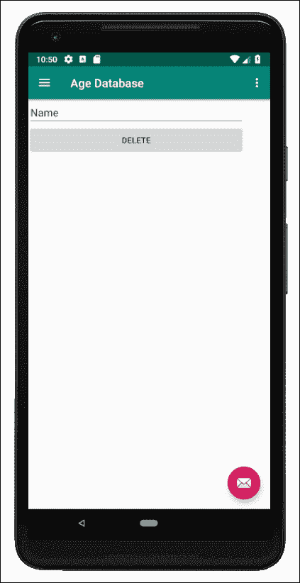
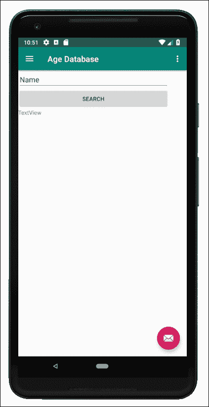
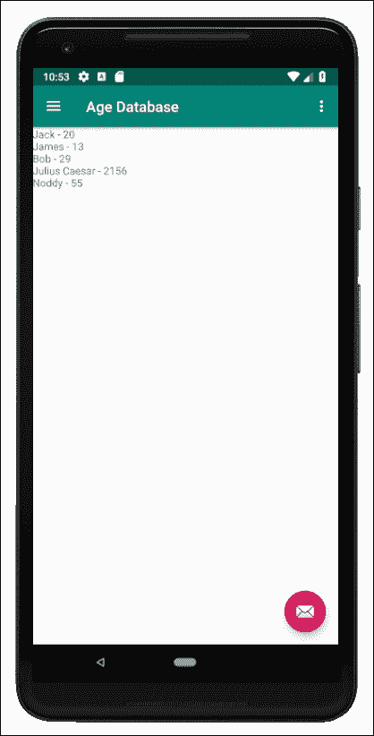
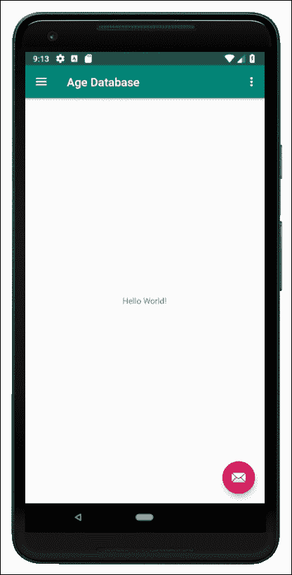
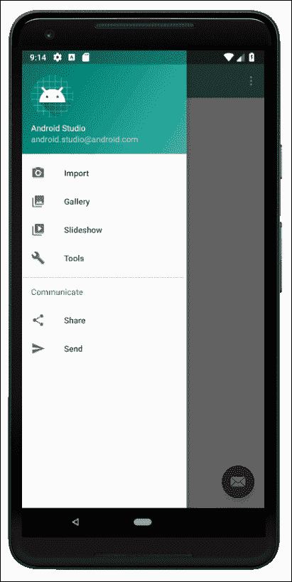
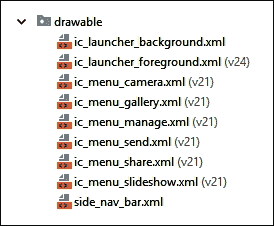
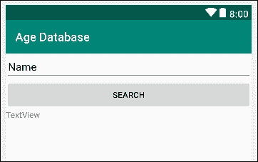

# 第二十六章：使用导航抽屉和 Fragment 的高级 UI

在本章中，我们将看到（可以说是）最先进的 UI。`NavigationView`或导航抽屉（因为它滑出内容的方式），可以通过在创建新项目时选择它作为模板来简单创建。我们将这样做，然后我们将检查自动生成的代码并学习如何与其交互。然后，我们将使用我们对`Fragment`类的所有了解来填充每个“抽屉”具有不同行为和视图。然后，在下一章中，我们将学习数据库，为每个`Fragment`添加一些新功能。

在本章中，将涵盖以下主题：

+   引入`NavigationView`小部件

+   开始使用年龄数据库应用

+   使用项目模板实现`NavigationView`

+   向`NavigationView`添加多个`Fragment`实例和布局

让我们来看看这个非常酷的 UI 模式。

# 引入 NavigationView

`NavigationView`有什么好处？可能首先吸引您注意的是它可以看起来非常时尚。看看下面的截图，展示了 Google Play 应用中`NavigationView`的运行情况：


老实说，从一开始，我们的应用不会像 Google Play 应用中的那样花哨。但是我们的应用中将具有相同的功能。

这个 UI 的另一个亮点是它在需要时滑动隐藏或显示自己的方式。正是因为这种行为，它可以是一个相当大的尺寸，使得它在添加选项时非常灵活，并且当用户完成后，它会完全消失，就像一个抽屉一样。

### 提示

如果您还没有尝试过，我建议现在尝试一下 Google Play 应用，看看它是如何工作的。

您可以从屏幕的左边缘滑动拇指或手指，抽屉将慢慢滑出。当然，您也可以向相反方向再次滑动它。

导航抽屉打开时，屏幕的其余部分会略微变暗（如前一个截图所示），帮助用户专注于提供的导航选项。

在抽屉打开时，您还可以点击抽屉之外的任何地方，它将自行滑开，为布局的其余部分留出整个屏幕。

也可以通过点击左上角的菜单图标打开抽屉。

我们还可以调整和完善导航抽屉的行为，这将在本章末尾看到。

# 检查年龄数据库应用

在本章中，我们将专注于创建`NavigationView`并用四个`Fragment`类及其各自的布局填充它。在下一章中，我们将学习并实现数据库功能。

这是我们`NavigationView`的全貌。请注意，当使用`NavigationView`活动模板时，默认情况下提供了许多选项和大部分外观和装饰：


四个主要选项是我们将添加到 UI 中的。它们是**Insert**，**Delete**，**Search**和**Results**。接下来将展示布局并描述它们的目的。

## 插入

第一个屏幕允许用户将一个人的姓名和相关年龄插入到数据库中：


这个简单的布局有两个`EditText`小部件和一个按钮。用户将输入姓名和年龄，然后点击**INSERT**按钮将它们添加到数据库中。

## 删除

这个屏幕甚至更简单。用户将在`EditText`小部件中输入姓名，然后点击按钮：



如果输入的姓名存在于数据库中，则该条目（姓名和年龄）将被删除。

## 搜索

这个布局与上一个布局大致相同，但目的不同：



用户将在`EditText`中输入姓名，然后点击按钮。如果数据库中存在该姓名，那么它将显示出来，并显示匹配的年龄。

## 结果

这个屏幕显示了整个数据库中的所有条目：



让我们开始使用应用和导航抽屉。

# 启动 Age Database 项目

在 Android Studio 中创建一个新项目。将其命名为`Age Database`，使用**Navigation Drawer Activity**模板，并将所有其他设置保持与本书中一致。在做其他任何事情之前，值得在模拟器上运行应用程序，看看作为模板的一部分自动生成了多少，如下面的截图所示：



乍一看，它只是一个普通的布局，带有一个`TextView`。但是，从左边缘滑动，或者按菜单按钮，导航抽屉就会显示出来。



现在，我们可以修改选项，并为每个选项插入一个`Fragment`实例（带有布局）。要理解它是如何工作的，让我们来看看自动生成的代码。

# 探索自动生成的代码和资源

在`drawable`文件夹中，有一些图标，如下面的截图所示：



这些是通常的图标，也是出现在导航抽屉菜单中的图标。我们不会费心去更改它们，但如果你想个性化你的应用中的图标，通过本次探索最终应该清楚如何做到。

接下来，打开`res/menu`文件夹。请注意，那里有一个额外的文件，名为`activity_main_drawer.xml`。下面的代码是从这个文件中摘录出来的，所以我们可以讨论它的内容：

```kt
<group android:checkableBehavior="single">
   <item
         android:id="@+id/nav_camera"
         android:icon="@drawable/ic_menu_camera"
         android:title="Import" />
   <item
         android:id="@+id/nav_gallery"
         android:icon="@drawable/ic_menu_gallery"
         android:title="Gallery" />
   <item
         android:id="@+id/nav_slideshow"
         android:icon="@drawable/ic_menu_slideshow"
         android:title="Slideshow" />
   <item
         android:id="@+id/nav_manage"
         android:icon="@drawable/ic_menu_manage"
         android:title="Tools" />
</group>
```

请注意，在`group`标签中有四个`item`标签。现在，请注意从上到下的`title`标签（`Import`，`Gallery`，`Slideshow`和`Tools`）与自动生成的导航抽屉菜单中的前四个文本选项完全对应。另外，请注意在每个`item`标签中都有一个`id`标签，这样我们就可以在 Kotlin 代码中引用它们，还有一个`icon`标签，对应着我们刚刚看到的`drawable`文件夹中的图标之一。

另外，请查看`layout`文件夹中的`nav_header_main.xml`文件，其中包含了抽屉的头部布局。

其余的文件都如我们所料，但在 Kotlin 代码中还有一些要注意的关键点。这些都在`MainActivity.kt`文件中。现在打开它，我们来看看它们。

首先是`onCreate`函数中处理我们 UI 各个方面的额外代码。看看这段额外的代码，然后我们可以讨论它：

```kt
val toggle = ActionBarDrawerToggle(
         this, drawer_layout, 
         toolbar, 
         R.string.navigation_drawer_open, 
         R.string.navigation_drawer_close)

drawer_layout.addDrawerListener(toggle)

toggle.syncState()

nav_view.setNavigationItemSelectedListener(this)
```

代码获取了一个`DrawerLayout`的引用，它对应着我们刚刚看到的布局。代码还创建了一个`ActionBarDrawerToggle`的新实例，它允许控制或切换抽屉。代码的最后一行在`NavigationView`上设置了一个监听器。现在，每当用户与导航抽屉交互时，Android 都会调用一个特殊的函数。我所指的这个特殊函数是`onNavigationItemSelected`。我们将在一分钟内看到这个自动生成的函数。

接下来，看一下`onBackPressed`函数：

```kt
override fun onBackPressed() {
   if (drawer_layout.isDrawerOpen(GravityCompat.START)) {
         drawer_layout.closeDrawer(GravityCompat.START)
   } else {
         super.onBackPressed()
  }
}
```

这是`Activity`类的一个重写函数，它处理用户在设备上按返回按钮时发生的情况。如果抽屉打开，代码会关闭它；如果抽屉没有打开，代码会简单地调用`super.onBackPressed`。这意味着如果抽屉打开，按返回按钮会关闭抽屉；如果抽屉已经关闭，会使用默认行为。

现在，看一下`onNavigationItemSelected`函数，这对应着应用功能的关键部分：

```kt
override fun onNavigationItemSelected(
   item: MenuItem)
   : Boolean {

   // Handle navigation view item clicks here.
   when (item.itemId) {
         R.id.nav_camera -> {
               // Handle the camera action
         }
         R.id.nav_gallery -> {

         }
         R.id.nav_slideshow -> {

         }
         R.id.nav_manage -> {

         }
         R.id.nav_share -> {

         }
         R.id.nav_send -> {

         }
   }

   drawer_layout.closeDrawer(GravityCompat.START)
   return true
}
```

请注意，`when`块分支对应于`activity_main_drawer.xml`文件中包含的`id`值。这是我们将响应用户在导航抽屉菜单中选择选项的地方。目前，`when`代码什么也不做。我们将更改它以加载特定的`Fragment`以及其相关的布局到主视图中。这意味着我们的应用将根据用户从菜单中的选择具有完全不同的功能和独立的 UI，就像我们在第二十四章中讨论 MVC 模式时所描述的那样，*设计模式、多个布局和片段*。

让我们编写`Fragment`类和它们的布局，然后我们可以回来编写代码，使用它们在`onNavigationItemSelected`函数中。

# 编写片段类及其布局

我们将创建四个类，包括加载布局的代码以及实际的布局，但是在学习了 Android 数据库之后，我们不会将任何数据库功能放入 Kotlin 代码中。

当我们有了四个类和它们的布局后，我们将学习如何从导航抽屉菜单中加载它们。在本章结束时，我们将拥有一个完全可用的导航抽屉，让用户在片段之间切换，但是在下一章之前，这些片段不会有任何功能。

## 为类和布局创建空文件

通过右键单击`layout`文件夹并选择**新建** | **布局资源文件**来创建四个布局文件，它们的父视图都是垂直的`LinearLayout`。将第一个文件命名为`content_insert`，第二个为`content_delete`，第三个为`content_search`，第四个为`content_results`。其他选项可以保持默认值。

现在你应该有四个新的布局文件，其中包含`LinearLayout`父视图，如下截图所示：


让我们编写 Kotlin 类。

## 编写类

通过右键单击包含`MainActivity.kt`文件的文件夹并选择**新建** | **Kotlin 文件/类**来创建四个新类。将它们命名为`InsertFragment`、`DeleteFragment`、`SearchFragment`和`ResultsFragment`。从名称上就可以看出哪些片段将显示哪些布局。

接下来，让我们为每个类添加一些代码，使这些类从`Fragment`继承并加载它们相关的布局。

打开`InsertFragment.kt`并编辑它，使其包含以下代码：

```kt
import android.os.Bundle
import android.view.LayoutInflater
import android.view.View
import android.view.ViewGroup

import androidx.fragment.app.Fragment

class InsertFragment : Fragment() {
    override fun onCreateView(
         inflater: LayoutInflater,
         container: ViewGroup?,
         savedInstanceState: Bundle?)
         : View? {

         val view = inflater.inflate(
                R.layout.content_insert,
                container,
                false)

        // Database and UI code goes here in next chapter

        return view
    }
}
```

打开`DeleteFragment.kt`并编辑它，使其包含以下代码：

```kt
import android.os.Bundle
import android.view.LayoutInflater
import android.view.View
import android.view.ViewGroup

import androidx.fragment.app.Fragment

class DeleteFragment : Fragment() {
    override fun onCreateView(
         inflater: LayoutInflater,
        container: ViewGroup?,
        savedInstanceState:
        Bundle?)
        : View? {

        val view = inflater.inflate(
               R.layout.content_delete,
               container,
               false)

        // Database and UI code goes here in next chapter

        return view
    }
}
```

打开`SearchFragment.kt`并编辑它，使其包含以下代码：

```kt
import android.os.Bundle
import android.view.LayoutInflater
import android.view.View
import android.view.ViewGroup

import androidx.fragment.app.Fragment

class SearchFragment : Fragment() {
    override fun onCreateView(
         inflater: LayoutInflater,
        container: ViewGroup?,
        savedInstanceState: Bundle?)
        : View? {

         val view = inflater.inflate(
               R.layout.content_search,
               container,
               false)

        // Database and UI code goes here in next chapter

        return view
    }
}
```

打开`ResultsFragment.kt`并编辑它，使其包含以下代码：

```kt
import android.os.Bundle
import android.view.LayoutInflater
import android.view.View
import android.view.ViewGroup

import androidx.fragment.app.Fragment

class ResultsFragment : Fragment() {

    override fun onCreateView(
         inflater: LayoutInflater,
        container: ViewGroup?,
        savedInstanceState: Bundle?)
         : View? {

        val view = inflater.inflate(
               R.layout.content_results,
               container,
               false)

        // Database and UI code goes here in next chapter

        return inflater.inflate(R.layout.content_results,
                container,
                false)
    }
}
```

每个类完全没有功能，除了在`onCreateView`函数中，从相关的布局文件加载适当的布局。

让我们为之前创建的布局文件添加 UI。

## 设计布局

正如我们在本章开头所看到的，所有的布局都很简单。让你的布局与我的完全相同并不是必要的，但是，如同往常一样，`id`属性值必须相同，否则我们在下一章中编写的 Kotlin 代码将无法工作。

## 设计 content_insert.xml

从**文本**类别的调色板中拖动两个**纯文本**小部件到布局中。记住**纯文本**小部件是`EditText`实例。现在，在两个**EditText**/**纯文本**小部件之后，拖动一个**按钮**到布局中。

根据这个表格配置小部件：

| 小部件 | 属性和值 |
| --- | --- |
| 顶部编辑文本 | id = `editName` |
| 顶部编辑文本 | 文本 = `姓名` |
| 第二个编辑文本 | id = `editAge` |
| 第二个编辑文本 | 文本 = `年龄` |
| 按钮 | id = `btnInsert` |
| 按钮 | 文本 = `插入` |

这是你的布局在 Android Studio 的设计视图中应该是这样的：


## 设计 content_delete.xml

将**普通文本**/**EditText**小部件拖放到布局上方，下方是一个**按钮**。根据以下表格配置小部件：

| 小部件 | 属性值 |
| --- | --- |
| EditText | id = `editDelete` |
| EditText | 文本 = `名称` |
| 按钮 | id = `btnDelete` |
| 按钮 | 文本 = `删除` |

这是您在 Android Studio 的设计视图中的布局应该看起来的样子：


## 设计 content_search.xml

将**普通文本**/**EditText**小部件拖放到布局上方，然后是一个**按钮**，然后是一个常规的**TextView**，然后根据以下表格配置小部件：

| 小部件 | 属性值 |
| --- | --- |
| EditText | id = `editSearch` |
| EditText | 文本 = `名称` |
| 按钮 | id = `btnSearch` |
| 按钮 | 文本 = `搜索` |
| TextView | id = `textResult` |

这是您在 Android Studio 的设计视图中的布局应该看起来的样子：



## 设计 content_results.xml

将单个`TextView`（这次不是**普通文本**/**EditText**）拖放到布局中。在下一章中，我们将看到如何将整个列表添加到这个单个`TextView`中。

根据以下表格配置小部件：

| 小部件 | 属性值 |
| --- | --- |
| TextView | id = `textResults` |

这是您在 Android Studio 的设计视图中的布局应该看起来的样子：


现在，我们可以使用基于`Fragment`类和它们的布局的类。

# 使用`Fragment`类及其布局

这个阶段有三个步骤。首先，我们需要编辑导航抽屉的菜单，以反映用户的选项。接下来，我们需要在布局中添加一个`View`实例，以容纳当前活动的`Fragment`实例，最后，我们需要在`MainActivity.kt`中添加代码，以在用户点击导航抽屉菜单时在不同的`Fragment`实例之间切换。

## 编辑导航抽屉菜单

在项目资源管理器的`res/menu`文件夹中打开`activity_main_drawer.xml`文件。编辑`group`标签中的代码，以反映我们的**插入**、**删除**、**搜索**和**结果**菜单选项：

```kt
<group android:checkableBehavior="single">
   <item
         android:id="@+id/nav_insert"
         android:icon="@drawable/ic_menu_camera"
         android:title="Insert" />
   <item
         android:id="@+id/nav_delete"
         android:icon="@drawable/ic_menu_gallery"
         android:title="Delete" />
   <item
         android:id="@+id/nav_search"
         android:icon="@drawable/ic_menu_slideshow"
         android:title="Search" />
   <item
         android:id="@+id/nav_results"
         android:icon="@drawable/ic_menu_manage"
         android:title="Results" />
</group>
```

### 提示

现在是一个很好的时机，可以向`drawable`文件夹添加新的图标，并编辑前面的代码以引用它们，如果您想使用自己的图标。

## 向主布局添加一个占位符

在布局文件夹中打开`content_main.xml`文件，并在`ConstraintLayout`的闭合标签之前添加以下突出显示的 XML 代码：

```kt
<FrameLayout
 android:id="@+id/fragmentHolder"
 android:layout_width="0dp"
 android:layout_height="0dp"
 app:layout_constraintBottom_toBottomOf="parent"
 app:layout_constraintEnd_toEndOf="parent"
 app:layout_constraintStart_toStartOf="parent"
 app:layout_constraintTop_toTopOf="parent"> 
</FrameLayout>

</androidx.constraintlayout.widget.ConstraintLayout>
```

现在，我们有一个`id`属性为`fragmentHolder`的`FrameLayout`，我们可以引用并将所有`Fragment`实例的布局加载到其中。

## 编写 MainActivity.kt 文件

打开`MainActivity`文件，并编辑`onNavigationItemSelected`函数，以处理用户可以选择的所有不同菜单选项：

```kt
override fun onNavigationItemSelected(
  item: MenuItem): 
  Boolean {

  // Create a transaction
  val transaction = 
        supportFragmentManager.beginTransaction()

  // Handle navigation view item clicks here.
  when (item.itemId) {
        R.id.nav_insert -> {
              // Create a new fragment of the appropriate type
              val fragment = InsertFragment()
              // What to do and where to do it
              transaction.replace(R.id.fragmentHolder, fragment)
    }
    R.id.nav_search -> {
              val fragment = SearchFragment()
              transaction.replace(R.id.fragmentHolder, fragment)
    }
    R.id.nav_delete -> {
              val fragment = DeleteFragment()
              transaction.replace(R.id.fragmentHolder, fragment)
    }
    R.id.nav_results -> {
      val fragment = ResultsFragment()
      transaction.replace(R.id.fragmentHolder, fragment)
    }

  }

   // Ask Android to remember which
   // menu options the user has chosen
   transaction.addToBackStack(null);

  // Implement the change
  transaction.commit();

   drawer_layout.closeDrawer(GravityCompat.START)
   return true
}
```

让我们来看一下我们刚刚添加的代码。大部分代码应该看起来很熟悉。对于我们的每个菜单选项，我们创建一个相应类型的新`Fragment`实例，并将其插入到`id`值为`fragmentHolder`的`FrameLayout`中。

`transaction.addToBackStack`函数调用意味着所选的`Fragment`将按顺序与其他`Fragment`一起被记住。这样做的结果是，如果用户选择**插入**片段，然后选择**结果**片段，然后点击返回按钮，应用程序将把用户返回到**插入**片段。

现在可以运行应用程序，并使用导航抽屉菜单在所有不同的`Fragment`实例之间切换。它们看起来就像本章开头的图片一样，但它们还没有任何功能。

# 摘要

在本章中，我们看到了拥有一个吸引人和令人愉悦的 UI 是多么简单，尽管我们的`Fragment`实例还没有任何功能，但一旦我们学会了数据库，它们就已经准备就绪了。

在下一章中，我们将学习关于数据库的一般知识，以及 Android 应用程序可以使用的特定数据库，在我们为`Fragment`类添加功能之前。
